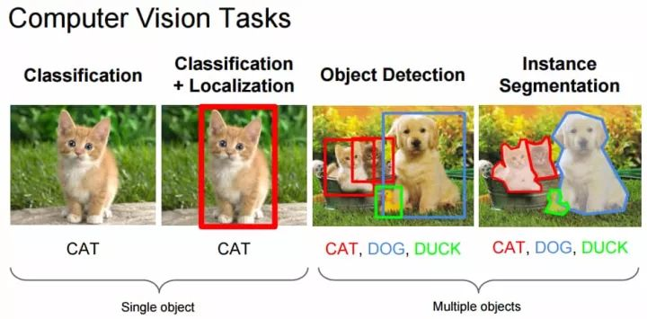
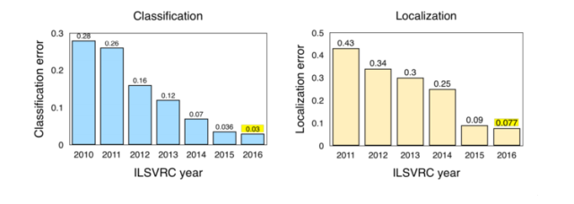
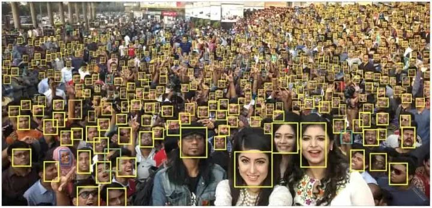
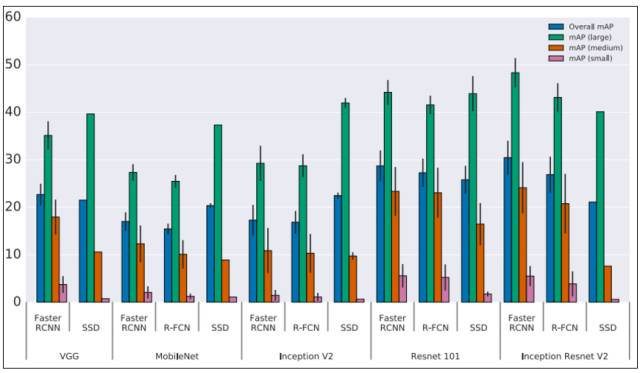
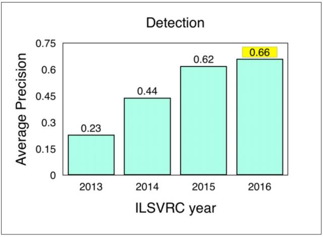

# 计算机视觉这一年：这是最全的一份 CV 技术报告

选自 The M tank

**机器之心编译**

**参与：蒋思源、刘晓坤**

> > The M Tank 编辑了一份报告《A Year in Computer Vision》，记录了 2016 至 2017 年计算机视觉领域的研究成果，对开发者和研究人员来说是不可多得的一份详细材料。该材料共包括四大部分，在本文中机器之心对第一部分做了编译介绍，后续会放出其他部分内容。
> 
> **内容目录**
> 
> **简介**
> 
> **第一部分**
> 
> *   分类/定位
>     
>     
> *   目标检测
>     
>     
> *   目标追踪
>     
>     
> 
> **第二部分**
> 
> *   分割
>     
>     
> *   超分辨率、风格迁移、着色
>     
>     
> *   动作识别
>     
>     
> 
> **第三部分**
> 
> *   3D 目标
>     
>     
> *   人体姿势估计
>     
>     
> *   3D 重建
>     
>     
>     
> *   其他未分类 3D
>     
>     
> *   总结
>     
>     
> 
> **第四部分**
> 
> *   卷积架构
>     
>     
> *   数据集
>     
>     
> *   不可分类的其他材料与有趣趋势
>     
>     
> 
> **结论**
> 
> 完整 PDF 地址：http://www.themtank.org/pdfs/AYearofComputerVisionPDF.pdf
> 
> **简介**
> 
> 计算机视觉是关于研究机器视觉能力的学科，或者说是使机器能对环境和其中的刺激进行可视化分析的学科。机器视觉通常涉及对图像或视频的评估，英国机器视觉协会（BMVA）将机器视觉定义为「对单张图像或一系列图像的有用信息进行自动提取、分析和理解」。
> 
> 对我们环境的真正理解不是仅通过视觉表征就可以达成的。更准确地说，是视觉线索通过视觉神经传输到主视觉皮层，然后由大脑以高度特征化的形式进行分析的过程。从这种感觉信息中提取解释几乎包含了我们所有的自然演化和主体经验，即进化如何令我们生存下来，以及我们如何在一生中对世界进行学习和理解。
> 
> 从这方面来说，视觉过程仅仅是传输图像并进行解释的过程，然而从计算的角度看，图像其实更接近思想或认知，涉及大脑的大量功能。因此，由于跨领域特性很显著，很多人认为计算机视觉是对视觉环境和其中语境的真实理解，并将引领我们实现强人工智能。
> 
> 不过，我们目前仍然处于这个领域发展的胚胎期。这篇文章的目的在于阐明 2016 至 2017 年计算机视觉最主要的进步，以及这些进步对实际应用的促进。
> 
> 为简单起见，这篇文章将仅限于基本的定义，并会省略很多内容，特别是关于各种卷积神经网络的设计架构等方面。
> 
> 这里推荐一些学习资料，其中前两个适用与初学者快速打好基础，后两个可以作为进阶学习：
> 
> *   Andrej Karpathy:「What a Deep Neural Network thinks about your #selfie」，这是理解 CNN 的应用和设计功能的最好文章 [4]。
>     
>     
> *   Quora:「what is a convolutional neural network?」，解释清晰明了，尤其适合初学者 [5]。
>     
>     
> *   CS231n: Convolutional Neural Networks for Visual Recognition，斯坦福大学课程，是进阶学习的绝佳资源 [6]。
>     
>     
> *   Deep Learning(Goodfellow,Bengio&Courville,2016)，这本书在第九章提供了对 CNN 的特征和架构设计等详尽解释，网上有免费资源 [7]。
>     
>     
> 
> 对于还想进一步了解神经网络和深度学习的，我们推荐：
> 
> *   Neural Networks and Deep Learning(Nielsen,2017)，这是一本免费在线书籍，可为读者提供对神经网络和深度学习的复杂性的直观理解。即使只阅读了第一章也可以帮助初学者透彻地理解这篇文章。
>     
>     
> 
> 下面我们先简介本文的第一部分，这一部分主要叙述了目标分类与定位、目标检测与目标追踪等十分基础与流行的计算机视觉任务。而后机器之心将陆续分享 Benjamin F. Duffy 和 Daniel R. Flynn 后面 3 部分对计算机视觉论述，包括第二部分的语义分割、超分辨率、风格迁移和动作识别，第三部分三维目标识别与重建、和第四部分卷积网络的架构与数据集等内容。
> 
> **基础的计算机视觉任务**
> 
> **分类/定位**
> 
> 图像分类任务通常是指为整张图像分配特定的标签，如下左图整张图像的标签为 CAT。而定位是指找到识别目标在图像中出现的位置，通常这种位置信息将由对象周围的一些边界框表示出来。目前 ImageNet [9] 上的分类/定位的准确度已经超过了一组训练有素的人类 [10]。因此相对于前一部分的基础，我们会着重介绍后面如语义分割、3D 重建等内容。
> 
> 
> 
> *图 1：计算机视觉任务，来源 cs231n 课程资料。*
> 
> 然而随着目标类别 [11] 的增加，引入大型数据集将为近期的研究进展提供新的度量标准。在这一方面，Keras [12] 创始人 Francois Chollet 将包括 Xception 等架构和新技术应用到谷歌内部的大型数据集中，该数据集包含 1.7 万个目标类别，共计 350M（Million）的多类别图像。
> 
> 
> 
> *图 2：ILSVRC 竞赛中，分类/定位的逐年错误率，来源 Jia Deng (2016)，ILSVRC2016。*
> 
> ImageNet LSVRC（2016）亮点：
> 
> *   场景分类是指用「温室」、「体育场」和「大教堂」等特定场景对图像进行分类。ImageNet 去年举办了基于 Places2[15] 子数据的场景分类挑战赛，该数据集有 365 个场景共计 8 百万 训练图像。海康威视 [16] 选择了深度类 Inception 的网络和并不太深的 ResNet，并利用它们的集成实现 9% 的 Top-5 误差率以赢得竞赛。
>     
>     
> *   Trimps-Soushen 以 2.99% 的 Top-5 分类误差率和 7.71% 的定位误差率赢得了 ImageNet 分类任务的胜利。该团队使用了分类模型的集成（即 Inception、Inception-ResNet、ResNet 和宽度残差网络模块 [17] 的平均结果）和基于标注的定位模型 Faster R-CNN [18] 来完成任务。训练数据集有 1000 个类别共计 120 万的图像数据，分割的测试集还包括训练未见过的 10 万张测试图像。
>     
>     
> *   Facebook 的 ResNeXt 通过使用从原始 ResNet [19] 扩展出来的新架构而实现了 3.03% 的 Top-5 分类误差率。
>     
>     
> 
> **目标检测**
> 
> 目标检测（Object Detection）即如字面所说的检测图像中包含的物体或目标。ILSVRC 2016 [20] 对目标检测的定义为输出单个物体或对象的边界框与标签。这与分类/定位任务不同，目标检测将分类和定位技术应用到一张图像的多个目标而不是一个主要的目标。
> 
> 
> 
> *图 3：仅有人脸一个类别的目标检测。图为人脸检测的一个示例，作者表示目标识别的一个问题是小物体检测，检测图中较小的人脸有助于挖掘模型的尺度不变性、图像分辨率和情景推理的能力，来源 Hu and Ramanan (2016, p. 1)[21]。*
> 
> 目标识别领域在 2016 年主要的趋势之一是转向更快、更高效的检测系统。这一特性在 YOLO、SSD 和 R-FCN 方法上非常显著，它们都倾向于在整张图像上共享计算。因此可以将它们与 Fast/Faster R-CNN 等成本较高的子网络技术区分开开来，这些更快和高效的检测系统通常可以指代「端到端的训练或学习」。
> 
> 这种共享计算的基本原理通常是避免将独立的算法聚焦在各自的子问题上，因为这样可以避免训练时长的增加和网络准确度的降低。也就是说这种端到端的适应性网络通常发生在子网络解决方案的初始之后，因此是一种可回溯的优化（retrospective optimisation）。然而，Fast/Faster R-CNN 技术仍然非常有效，仍然广泛用于目标检测任务。
> 
> *   SSD：Single Shot MultiBox Detector[22] 利用封装了所有必要计算并消除了高成本通信的单一神经网络，以实现了 75.1% mAP 和超过 Faster R-CNN 模型的性能（Liu et al. 2016）。
>     
>     
> *   我们在 2016 年看到最引人注目的系统是「YOLO9000: Better, Faster, Stronger」[23]，它引入了 YOLOv2 和 YOLO9000 检测系统 [24]。YOLOv2 很大程度上提升了 2015 年提出的 YOLO 模型 [25] 性能，它能以非常高的 FPS（使用原版 GTX Titan X 在低分辨率图像上达到 90FPS）实现更好的结果。除了完成的速度外，系统在特定目标检测数据集上准确度要优于带有 ReNet 和 SSD 的 Faster RCNN。
>     
>     
> 
> YOLO9000 实现了检测和分类的联合训练，并将其预测泛化能力扩展到未知的检测数据上，即它能检测从未见过的目标或物体。YOLO9000 模型提供了 9000 多个类别的实时目标检测，缩小了分类和检测数据集间的鸿沟。该模型其它详细的信息和预训练模型请查看：http://pjreddie.com/darknet/yolo/。
> 
> *   Feature Pyramid Networks for Object Detection [27] 是 FAIR [28] 实验室提出的，它能利用「深度卷积网络的内部多尺度、金字塔型的层级结构构建具有边际额外成本的特征金字塔」，这意味着表征能更强大和快速。Lin et al. (2016) 在 COCO[29] 数据集上实现了顶尖的单模型结果。若与基础的 Faster R-CNN 相结合，将超过 2016 年最好的结果。
>     
>     
> *   R-FCN：Object Detection via Region-based Fully Convolutional Networks [30]，这是另一种在图像上避免应用数百次高成本的各区域子网络方法，它通过使基于区域的检测器在整张图像上进行全卷积和共享计算。「我们每张图像的测试时间只需要 170ms，要比 Faster R-CNN 快 2.5 到 20 倍」(Dai et al., 2016)。
>     
>     
> 
> 
> 
> *图 4：目标检测中的准确率权衡，来源 Huang et al. (2016, p. 9)[31]。*
> 
> 注意：Y 轴表示的是平均准确率（mAP），X 轴表示不同元架构（meta-architecture）的各种特征提取器（VGG、MobileNet...Inception ResNet V2）。此外，mAP small、medium 和 large 分别表示对小型、中型和大型目标的检测平均准确率。即准确率是按「目标尺寸、元架构和特征提取器」进行分层的，并且图像的分辨率固定为 300。虽然 Faster R-CNN 在上述样本中表现得更好，但是这并没有什么价值，因为该元架构相比 R-FCN 来说慢得多。
> 
> Huang et al. (2016)[32] 的论文提供了 R-FCN、SSD 和 Faster R-CNN 的深度性能对比。由于机器学习准确率对比中存在的问题，这里使用的是一种标准化的方法。这些架构被视为元架构，因为它们可以组合不同的特征提取器，比如 ResNet 或 Inception。
> 
> 论文的作者通过改变元架构、特征提取器和图像分辨率研究准确率和速度之间的权衡。例如，对不同特征提取器的选择可以造成元架构对比的非常大的变化。
> 
> 实时商业应用中需要低功耗和高效同时能保持准确率的目标检测方法，尤其是自动驾驶应用，SqueezeDet[33] 和 PVANet[34] 在论文中描述了这种发展趋势。
> 
> COCO[36] 是另一个常用的图像数据集。然而，它相对于 ImageNet 来说更小，更常被用作备选数据集。ImageNet 聚焦于目标识别，拥有情景理解的更广泛的语境。组织者主办了一场包括目标检测、分割和关键点标注的年度挑战赛。在 ILSVRC[37] 和 COCO[38] 上进行的目标检测挑战赛的结果如下：
> 
> *   ImageNet LSVRC 图像目标检测（DET）：CUImage 66% 平均准确率，在 200 个类别中有 109 个胜出。
>     
>     
> *   ImageNet LSVRC 视频目标检测（VID）：NUIST 80.8% 平均准确率。
>     
>     
> *   ImageNet LSVRC 视频追踪目标检测：CUvideo 55.8% 平均准确率。
>     
>     
> *   COCO 2016 目标检测挑战赛（边界框）：G-RMI（谷歌）41.5% 平均准确率（比 2015 的胜者 MSRAVC 高出 4.2% 绝对百分点）。
>     
>     
> 
> 从以上结果可以看出，在 ImageNet 上的结果表明「MSRAVC 2015 的结果为『引入 ResNet』设置了很高的标准。在整个项目中对所有的类别的目标检测性能都有所提升。在两个挑战赛中，定位任务的性能都得到较大的提升。关于小型目标实例的大幅性能提升结果详见参考文献」（ImageNet,2016）。[39]
> 
> 
> 
> *图 5.ILSVRC 的图像目标检测结果（2013-2016），来源 ImageNet. 2016\. [Online] Workshop*
> 
> **目标追踪**
> 
> 目标追踪即在给定的场景中追踪感兴趣的一个或多个特定目标的过程，在视频和现实世界的交互中（通常是从追踪初始的目标检测开始的）有很多应用，且对于自动驾驶而言非常重要。
> 
> *   Fully-Convolutional Siamese Networks for Object Tracking[40]，将一个连体网络（Siamese network）结合一个基础的追踪算法，使用端到端的训练方法，达到了当前最佳，图框显示率超过了实时应用的需求。这篇论文利用传统在线学习方法构建追踪模型。
>     
>     
> *   Learning to Track at 100 FPS with Deep Regression Networks[41]，该论文试图改善在线训练方法中存在的缺陷。他们构建了一个使用前馈网络学习目标运动、外观和方向中的普遍关系的追踪器，从而可以在没有在线训练的情况下有效地追踪到新的目标。该算法在一个标准的追踪基准测试中达到了当前最佳，同时可以 100FPS 的帧数追踪所有的目标（Held et al.,2016）。
>     
>     
> *   Deep Motion Features for Visual Tracking[43] 结合了手工设计的特征、深度外观特征（利用 CNN）和深度运动特征（在光流图像上训练），并取得了当前最佳的结果。虽然深度运动特征在动作识别和视频分类中很常见，但作者声称这是其首次被应用于视觉追踪上。该论文获得了 ICPR2016 的「计算机视觉和机器人视觉」的最佳论文。
>     
>     
> 
> 「本论文展示了深度运动特征（motion features）对检测和追踪框架的影响。我们还进一步说明了手工制作的特征、深度 RGB 和深度运用特征包含互补信息。据我们所知，这是第一个提出融合外表信息和深度运动特征，并用于视觉追踪的研究。我们全面的实验表明融合方法具有深度运动特征，并超过了单纯依赖外表信息的方法。」
> 
> *   Virtual Worlds as Proxy for Multi-Object Tracking Analysis [44] 方法解决了现有虚拟世界中缺乏真实可变性视频追踪基准和数据集。该论文提出了一种新的真实世界复制方法，该方法从头开始生成丰富、虚拟、合成和照片逼真的环境。此外，该方法还能克服现有数据集中存在的一些内容匮乏问题。生成的图像能自动通过正确的真值进行标注，并允许应用于除目标检测/追踪外其它如光流等任务。
>     
>     
> *   Globally Optimal Object Tracking with Fully Convolutional Networks [45] 专注处理目标变化和遮挡，并将它们作为目标追踪的两个根本限制。「我们提出的方法通过使用全卷积网络解决物体或目标外表的变化，还通过动态规划的方法解决遮挡情况」(Lee et al., 2016)。
>     
>     
> 
> 参考文献：
> 
> [1] British Machine Vision Association (BMVA). 2016\. What is computer vision? [Online] Available at: http://www.bmva.org/visionoverview [Accessed 21/12/2016]
> 
> [2] Krizhevsky, A., Sutskever, I. and Hinton, G. E. 2012\. ImageNet Classification with Deep Convolutional Neural Networks, NIPS 2012: Neural Information Processing Systems, Lake Tahoe, Nevada. Available: http://www.cs.toronto.edu/~kriz/imagenet_classification_with_deep_convolutional.pdf 
> 
> [3] Kuhn, T. S. 1962\. The Structure of Scientific Revolutions. 4th ed. United States: The University of Chicago Press.
> 
> [4] Karpathy, A. 2015\. What a Deep Neural Network thinks about your #selfie. [Blog] Andrej Karpathy Blog. Available: http://karpathy.github.io/2015/10/25/selfie/ [Accessed: 21/12/2016]
> 
> [5] Quora. 2016\. What is a convolutional neural network? [Online] Available: https://www.quora.com/What-is-a-convolutional-neural-network [Accessed: 21/12/2016]
> 
> [6] Stanford University. 2016\. Convolutional Neural Networks for Visual Recognition. [Online] CS231n. Available: http://cs231n.stanford.edu/ [Accessed 21/12/2016]
> 
> [7] Goodfellow et al. 2016\. Deep Learning. MIT Press. [Online] http://www.deeplearningbook.org/ [Accessed: 21/12/2016] Note: Chapter 9, Convolutional Networks [Available: http://www.deeplearningbook.org/contents/convnets.html]
> 
> [8] Nielsen, M. 2017\. Neural Networks and Deep Learning. [Online] EBook. Available: http://neuralnetworksanddeeplearning.com/index.html [Accessed: 06/03/2017].
> 
> [9] ImageNet refers to a popular image dataset for Computer Vision. Each year entrants compete in a series of different tasks called the ImageNet Large Scale Visual Recognition Challenge (ILSVRC). Available: http://image-net.org/challenges/LSVRC/2016/index 
> 
> [10] See「What I learned from competing against a ConvNet on ImageNet」by Andrej Karpathy. The blog post details the author』s journey to provide a human benchmark against the ILSVRC 2014 dataset. The error rate was approximately 5.1% versus a then state-of-the-art GoogLeNet classification error of 6.8%. Available: http://karpathy.github.io/2014/09/02/what-i-learned-from-competing-against-a-convnet-on-imagenet/ 
> 
> [11] See new datasets later in this piece.
> 
> [12] Keras is a popular neural network-based deep learning library: https://keras.io/ 
> 
> [13] Chollet, F. 2016\. Information-theoretical label embeddings for large-scale image classification. [Online] arXiv: 1607.05691\. Available: arXiv:1607.05691v1
> 
> [14] Chollet, F. 2016\. Xception: Deep Learning with Depthwise Separable Convolutions. [Online] arXiv:1610.02357\. Available: arXiv:1610.02357v2
> 
> [15] Places2 dataset, details available: http://places2.csail.mit.edu/. See also new datasets section.
> 
> [16] Hikvision. 2016\. Hikvision ranked No.1 in Scene Classification at ImageNet 2016 challenge. [Online] Security News Desk. Available: http://www.securitynewsdesk.com/hikvision-ranked-no-1-scene-classification-imagenet-2016-challenge/ [Accessed: 20/03/2017].
> 
> [17] See Residual Networks in Part Four of this publication for more details.
> 
> [18] Details available under team information Trimps-Soushen from: http://image-net.org/challenges/LSVRC/2016/results
> 
> [19] Xie, S., Girshick, R., Dollar, P., Tu, Z. & He, K. 2016\. Aggregated Residual Transformations for Deep Neural Networks. [Online] arXiv: 1611.05431\. Available: arXiv:1611.05431v1
> 
> [20] ImageNet Large Scale Visual Recognition Challenge (2016), Part II, Available: http://image-net.org/challenges/LSVRC/2016/ [Accessed: 22/11/2016]
> 
> [21] Hu and Ramanan. 2016\. Finding Tiny Faces. [Online] arXiv: 1612.04402\. Available: arXiv:1612.04402v1
> 
> [22] Liu et al. 2016\. SSD: Single Shot MultiBox Detector. [Online] arXiv: 1512.02325v5\. Available: arXiv:1512.02325v5
> 
> [23] Redmon, J. Farhadi, A. 2016\. YOLO9000: Better, Faster, Stronger. [Online] arXiv: 1612.08242v1\. Available: arXiv:1612.08242v1 
> 
> [24] YOLO stands for「You Only Look Once」.
> 
> [25] Redmon et al. 2016\. You Only Look Once: Unified, Real-Time Object Detection. [Online] arXiv: 1506.02640\. Available: arXiv:1506.02640v5 
> 
> [26]Redmon. 2017\. YOLO: Real-Time Object Detection. [Website] pjreddie.com. Available: https://pjreddie.com/darknet/yolo/ [Accessed: 01/03/2017].
> 
> [27] Lin et al. 2016\. Feature Pyramid Networks for Object Detection. [Online] arXiv: 1612.03144\. Available: arXiv:1612.03144v1
> 
> [28] Facebook's Artificial Intelligence Research
> 
> [29] Common Objects in Context (COCO) image dataset
> 
> [30] Dai et al. 2016\. R-FCN: Object Detection via Region-based Fully Convolutional Networks. [Online] arXiv: 1605.06409\. Available: arXiv:1605.06409v2 
> 
> [31] Huang et al. 2016\. Speed/accuracy trade-offs for modern convolutional object detectors. [Online] arXiv: 1611.10012\. Available: arXiv:1611.10012v1
> 
> [32] ibid
> 
> [33] Wu et al. 2016\. SqueezeDet: Unified, Small, Low Power Fully Convolutional Neural Networks for Real-Time Object Detection for Autonomous Driving. [Online] arXiv: 1612.01051\. Available: arXiv:1612.01051v2
> 
> [34] Hong et al. 2016\. PVANet: Lightweight Deep Neural Networks for Real-time Object Detection. [Online] arXiv: 1611.08588v2\. Available: arXiv:1611.08588v2
> 
> [35] DeepGlint Official. 2016\. DeepGlint CVPR2016\. [Online] Youtube.com. Available: https://www.youtube.com/watch?v=xhp47v5OBXQ [Accessed: 01/03/2017].
> 
> [36] COCO - Common Objects in Common. 2016\. [Website] Available: http://mscoco.org/ [Accessed: 04/01/2017].
> 
> [37] ILSRVC results taken from: ImageNet. 2016\. Large Scale Visual Recognition Challenge 2016.
> 
>  [Website] Object Detection. Available: http://image-net.org/challenges/LSVRC/2016/results [Accessed: 04/01/2017].
> 
> [38] COCO Detection Challenge results taken from: COCO - Common Objects in Common. 2016\. Detections Leaderboard [Website] mscoco.org. Available: http://mscoco.org/dataset/#detections-leaderboard [Accessed: 05/01/2017].
> 
> [39] ImageNet. 2016\. [Online] Workshop Presentation, Slide 31\. Available: http://image-net.org/challenges/talks/2016/ECCV2016_ilsvrc_coco_detection_segmentation.pdf [Accessed: 06/01/2017].
> 
> [40] Bertinetto et al. 2016\. Fully-Convolutional Siamese Networks for Object Tracking. [Online] arXiv: 1606.09549\. Available: https://arxiv.org/abs/1606.09549v2 
> 
> [41] Held et al. 2016\. Learning to Track at 100 FPS with Deep Regression Networks. [Online] arXiv: 1604.01802\. Available: https://arxiv.org/abs/1604.01802v2 
> 
> [42] David Held. 2016\. GOTURN - a neural network tracker. [Online] YouTube.com. Available: https://www.youtube.com/watch?v=kMhwXnLgT_I [Accessed: 03/03/2017].
> 
> [43] Gladh et al. 2016\. Deep Motion Features for Visual Tracking. [Online] arXiv: 1612.06615\. Available: arXiv:1612.06615v1
> 
> [44] Gaidon et al. 2016\. Virtual Worlds as Proxy for Multi-Object Tracking Analysis. [Online] arXiv: 1605.06457\. Available: arXiv:1605.06457v1
> 
> [45] Lee et al. 2016\. Globally Optimal Object Tracking with Fully Convolutional Networks. [Online] arXiv: 1612.08274\. Available: arXiv:1612.08274v1
> 
> *原报告地址：http://www.themtank.org/a-year-in-computer-vision*
> 
> ****本文为机器之心编译，**转载请联系本公众号获得授权****。**
> 
> ✄------------------------------------------------
> 
> **加入机器之心（全职记者/实习生）：hr@jiqizhixin.com**
> 
> **投稿或寻求报道：content@jiqizhixin.com**
> 
> **广告&商务合作：bd@jiqizhixin.com**