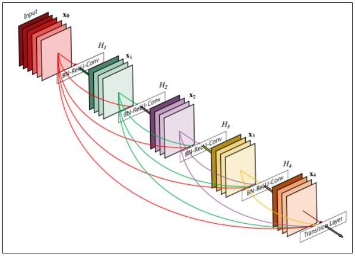
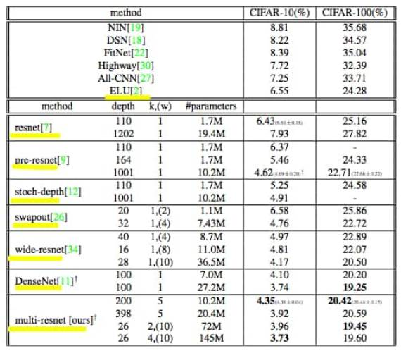
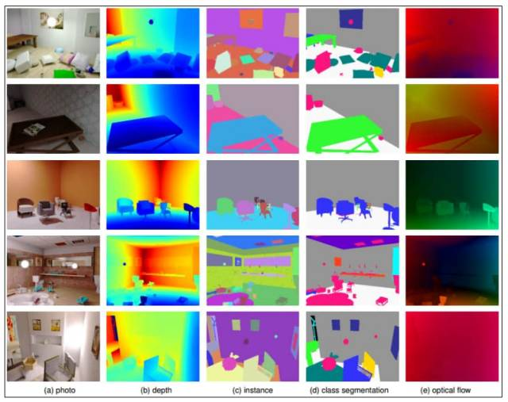
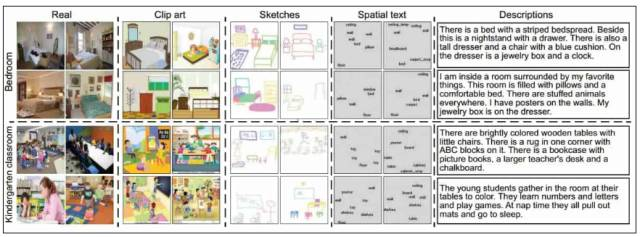
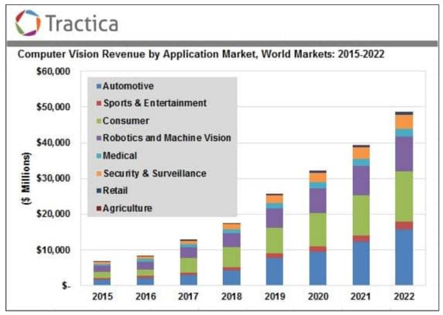

# 计算机视觉这一年：2017 CV 技术报告 Plus 之卷积架构、数据集与新趋势

选自 The M tank

**机器之心编译**

> 本文是 the M Tank 计算机视觉报告《A Year in Computer Vision》的第四部分（之前部分参见：[计算机视觉这一年：这是最全的一份 CV 技术报告](https://mp.weixin.qq.com/s?__biz=MzA3MzI4MjgzMw==&mid=2650733805&idx=1&sn=1439bf16d6c534fa8da69d93bb33f0a4&scene=21#wechat_redirect)）。本节将会介绍卷积神经网络架构、数据集和其他软硬件研究在 2017 年的最新进展，同时对于计算机视觉领域未来的发展做出展望。本文对于开发者和研究人员来说是不可多得的详细材料。

**ConvNet 架构**

近期，ConvNet 架构在计算机视觉之外也有很多新的应用。但是，它们的架构在速度、准确率和任务训练方面都有进步，仍然主导着计算机视觉领域。因此，整体而言，ConvNet 架构对计算机视觉至关重要。下面列出了 2016 年以来一些优秀的 ConvNet 架构，其中很多从 ResNet 中获得灵感。

*   Inception-v4, Inception-ResNet and the Impact of Residual Connections on Learning [131]：Inception v4 是一种新型 Inception 架构，从 Inception v2 和 v3 [132] 发展而来。本文还分析了使用残差连接训练 Inception 网络和一些 Residual-Inception hybrid 网络。

*   Densely Connected Convolutional Networks [133]（DenseNet）从 ResNet 的恒等／跳跃连接（identity/skip connections）中直接获取灵感。该方法先在 ConvNet 中用前馈的方式将每一层连接至其他层，将前面所有层的特征图作为输入，从而创建 DenseNet。

「DenseNet 有多个优势：改善梯度下降问题，加强特征传播，鼓励特征重用，以及大幅减少参数数量。」[134] 

*图 16：DenseNet 架构示例。5 层，growth rate k = 4。每一层的输入为前面所有特征图。来源：Huang et al. (2016) [135]*

该模型在 CIFAR-10、CIFAR-100、SVHN 和 ImageNet 上进行评估，并在多个数据集上实现了顶尖性能。同时，DenseNet 使用了较少内存和计算能力。现在已经有多个实现（Keras、Tensorflow 等）：https://github.com/liuzhuang13/DenseNet。[136]

*   FractalNet Ultra-Deep Neural Networks without Residuals [137]：使用不同长度的子路径，没有传递（pass-through）或残差连接，而是使用滤波器和非线性函数改变内部信号进行转换。

「FractalNet 重复连接多个并行层序列和不同数量的卷积 block，以获取大的额定深度，同时维护网络中的很多短路径。」[138]

该网络在 CIFAR 和 ImageNet 上获得了顶尖的性能，同时也展现了其他的特性。如，它们质疑极深层的卷积网络中残差连接的作用，同时通过不同的子网络深度找出问题的答案。

*   Lets keep it simple: using simple architectures to outperform deeper architectures [139]：创建一个简化的母架构（mother architecture）。该架构在 CIFAR10/100、MNIST 和 SVHN 等数据集（使用简单的或不使用数据增强）上获得了顶尖结果，或至少与现有方法性能相当。

「该研究中，我们展示了一个非常简单的 13 层全卷积网络架构，该架构最少限度地依赖新特征，但是优于几乎所有深层网络（参数数量是该架构的 2 倍到 25 倍）。我们的架构可用于多种场景，尤其是嵌入式设备中。」

「使用深度压缩（DeepCompression）可以进一步压缩该架构，从而大幅减少内存消耗。我们尝试创建一个最少限度地依赖新特征的母架构，以展示精巧、简单的卷积网络架构的有效性，文献中提到的现有或新方法还可以提高其效用。」[140]

下面是一些补充 ConvNet 架构的技术：

*   Swapout: Learning an ensemble of deep architectures [141]：生成 dropout 和随机深度（stochastic depth）方法来防止特定层或所有层中单元的共适应。集成训练方法从多个架构中采样，包括「dropout、随机深层和残差架构」。Swapout 在 CIFAR-10 和 CIFAR-100 数据上优于同样网络结构的 ResNet，该技术属于正则化的范畴。

*   SqueezeNet [142]：小型 DNN 具备很多优势，如较少的复杂计算训练、较容易的信息传输，以及可在内存或处理能力有限的设备上运行。SqueezeNet 是一个小型 DNN 架构，该架构使用模型压缩技术大幅减少参数数量和所需内存（AlexNet 的大小是它的 510x），且达到了 AlexNet 级别的准确率。

传统意义上，修正线性单元（ReLU）是所有神经网络中主要的激活函数。但是，现在有一些其他选项：

*   Concatenated Rectified Linear Units（CRelu）[143]

*   Exponential Linear Units（ELUs）[144]（2015 年末）

*   Parametric Exponential Linear Unit（PELU）[145]

**卷积网络中的不变性**

卷积网络是转换不变的，意思是它们可以在一张图像的多个部分识别相同的特征。然而，经典的 CNN 并不是旋转不变的，即当某一个特征或整张图像旋转之后，网络的识别性能就会下降。通常卷积网络通过数据增强（例如，在训练中有目的地将图像旋转随机的角度）可以（稍微地）学习处理旋转不变性。这意味着卷积网络可以不引入具体的旋转不变性而获得轻微的旋转不变性。同样意味着使用当前的技术在网络中引入旋转不变性是行不通的，这是一个基本的局限性。这其实和人类难以识别上下颠倒的图像挺相似的，但是机器必须克服这个局限性。

以下几篇论文都提出了旋转不变的卷积网络。每一种方法都有其创新性，都是通过更有效的参数利用提升旋转不变性，并最终获得全局旋转同变性（equivariance）：

*   Harmonic CNNs [146] 使用『圆谐波』（circular harmonics）滤波器替换常规的 CNN 滤波器。

*   Group Equivariant Convolutional Networks (G-CNNs) [147]：使用 G-卷积（G-Convolutions），这是一种新类型的层，其中层内共享的权重比常规的 CNN 层内的权重高级得多，从而能增大网络的表达容量，并且不需要额外增加参数数量。

*   Exploiting Cyclic Symmetry in Convolutional Neural Networks [148] 中提出了四种运算（作为层的结构），可以增强神经网络的层以部分增加旋转不变性。

*   Steerable CNNs [149] 由 Cohen 和 Welling 在他们对 G-CNN 的研究基础上建立，证明可控架构（steerable architectures）在 CIFAR 数据集上的性能超过了残差和密集网络。他们还对不变性问题做了简要的概述：

「为了提高机器学习方法的统计效率，很多人曾经寻求学习不变性表征的方法。然而，在深度学习中，中间层不应该是完全不变性的，因为局部特征的相对位姿（relative pose）必须保留给之后的层。因此，人们提出了同变性（equivariance）的思想：假如已知输入的转换，表征可以用一种可预测的线性形式生成转换，那么该网络就是同变的。换种说法即，同变网络生成的表征是可控的。可控性使网络不仅可以在所有的位置（正如标准的卷积层）还可以在所有的位姿上应用滤波器，从而增加参数共享。」

**残差网络**

*图 17：CIFAR 数据集上的测试误差率。其中黄色标记表示这些论文针对的是我们所讨论的问题。关于 pre-resnet 请参考「Identity Mappings in Deep Residual Networks」（参见接下来的内容）。此外，虽然不包含在表格中，我们相信，「Learning Identity Mappings with Residual Gates」在 CIFAR-10 和 CIFAR-100 上分别获得了 3.65% 和 18.27% 的 2016 年最低误差率。来源：Abdi and Nahavandi (2016, p. 6) [150]*

随着微软的 ResNet[151] 获得成功，残差网络和其变体在 2016 年变得很流行，出现了很多开源版本和可用的预训练模型。在 2015 年，ResNet 在 ImageNet 的检测、定位和分类任务，以及 COCO 的检测和分割挑战赛上都赢得了第一名。虽然其深度仍然是个问题，但 ResNet 解决了梯度消失问题，使人们更加相信「网络越深，抽象表达能力越强」的理念，巩固了深度学习的当前地位。

ResNet 通常被概念化为浅层网络的集成，通过运行（与它们的卷积层平行的）跳过链接，从而在某种程度上抵消深度神经网络的分层性质。这些跳过连接允许更简单的反向传播过程，缓解了深度神经网络中的梯度消失和梯度爆炸问题。如果想了解更多信息，请查阅 Quora：https://www.quora.com/What-is-an-intuitive-explanation-of-Deep-Residual-Networks。[152]

**残差学习、理论和改进**

*   Wide Residual Networks [153]：目前是一种非常普遍的 ResNet 方法。作者对由 ResNet 模块组成的架构进行了实验性研究，并通过增加网络的宽度和减少深度提升了网络的性能，从而缓解了逐渐减少的特征重用（diminishing feature reuse）的问题。这个方法在多个基准测试中都取得了当前最佳结果，包括在 CIFAR-10 和 CIFAR-100 上的 3.89% 和 18.3%。作者证明了一个 16 层深的宽 ResNet 可以获得比任何其它 ResNet（包括 1000 层的网络）更高的准确率和效率。

*   Deep Networks with Stochastic Depth [154]：主要将 dropout 技术应用于整个层的神经元，而不是单个神经元。「我们从很深的网络开始，在训练过程中，对于每一个小批量，随机删除部分层，使用恒等函数绕过它们。」随机深度允许更快的训练，能得到更高的准确率，甚至当训练的网络过了 1200 层也是如此。

*   Learning Identity Mappings with Residual Gates [155]：「通过使用一个标量参数控制每一个门，我们提供了一种只需要优化一个参数就可以学习恒等映射的方法。」作者使用这些 Gated ResNet 改善了深度网络的优化方式，并提供了对「移除整层的高接收度」，从而即使随机而大量地删除层，也能保持 90% 的性能。使用 Wide Gated ResNet 在 CIFAR-10 和 CIFAR-100 上分别获得了 3.65% 和 18.27% 的结果。

*   Residual Networks Behave Like Ensembles of Relatively Shallow Networks [156]：ResNet 可以看成很多路径的集成，路径之间的依赖关系不强，从而增强对整体行为的理解。此外，残差路径长度不同，短路径为训练过程中的梯度做贡献，长梯度对该阶段没有影像。

*   Identity Mappings in Deep Residual Networks [157]：恒等映射『用作跳跃连接和 after-addition activation 时，允许在 ResNet block 中对信号进行前后和后向传输」。该方法改善了「1001 层的 ResNet 在 CIFAR-10（误差 4.62%）和 CIFAR-100 数据集，以及 200 层的 ResNet 在 ImageNet 上」的生成、训练和结果。

*   Multi-Residual Networks: Improving the Speed and Accuracy of Residual Networks [158]：再次提倡 ResNet 的集成，支持 ResNet 架构变得更宽、更深。「multi-residual network 增加了残差块中残差函数的数量。」提高的准确率使网络在 CIFAR-10 和 CIFAR-100 数据集上的误差分别是 3.73% 和 19.45%。

其他残差理论和改进。尽管它是最近提出的想法，但已经有大量研究围绕着 ResNet 展开。下面是一些相关的论文：

*   Highway and Residual Networks learn Unrolled Iterative Estimation[159]

*   Residual Networks of Residual Networks: Multilevel Residual Networks[160]

*   Resnet in Resnet: Generalizing Residual Architectures[161] 

*   Wider or Deeper: Revisiting the ResNet Model for Visual Recognition[162]

*   Bridging the Gaps Between Residual Learning, Recurrent Neural Networks and Visual Cortex[163]

*   Convolutional Residual Memory Networks[164]

*   Identity Matters in Deep Learning[165]

*   Deep Residual Networks with Exponential Linear Unit[166]

*   Weighted Residuals for Very Deep Networks[167]

**数据集**

不能过分夸大用于机器学习所有层面的丰富数据集的重要性。因此，我们审慎地收录该领域中一些最大进步。Kaggle CTO 兼联合创始人 Ben Hamner 曾说过「一个新数据集能催生出一千篇论文」[168]，即数据的可用性能够催生新方法，并为之前无效的技术注入新活力。

2016 年，传统数据集如 ImageNet [169]、COCO [170]、 CIFARs [171] 和 MNIST [172] 中加入了大量新条目。我们还注意到制图技术的进步引发合成数据集的增长，它是满足人工神经网络对大量数据的需求的一种有趣工作。为了简洁起见，我们选择了 2016 年最重要的新数据集：

*   Places2 [173] 是一个场景分类数据集，其任务是使用一个场景分类（比如「体育馆」、「公园」等等）标注图像。尽管借助 Places2 数据集预测模型和图像理解无疑会有改善，从这个数据集上训练的网络得到一个有趣的发现是，在学习分类场景的过程中，网络无需经过明确指导学会了检测其中的物体。例如，卧室里有床和厨房与浴室里都有水池。这意味着在场景分类的抽象层级中，物体本身是较低水平的特征。

*图 18：SceneNet RGB-D 示例。来自 SceneNet RGB-D 的示例，它是一个带有 500 万张真实感图像的合成室内轨迹的真值数据集。图片 (a) 通过计算图呈现，带有从 (b) 到 (e) 的特定任务的可用真值。合成数据集的创建有助于域适应进程，如果从其中学习到的知识无法应用到现实世界，那么合成数据集则是无意义的。这正是域适应发挥作用的地方，它具备把知识从一个领域迁移到另一个领域的能力，比如从合成图像到现实世界。域适应最近再次迅速发展，其在迁移学习方面的努力是亮点。列 (c) vs (d) 展示了实例与语义/分类分割之间的不同。来源：McCormac et al. (2017) [174]*

*   SceneNet RGB-D [175]：此合成数据集扩展了原始的 SceneNet 数据集，为语义分割、实例分割和物体检测等场景理解问题以及光流、深度估计、相机姿态估计和三维重建等几何计算机视觉问题提供了像素完美的真值。该数据集通过提供像素完美的表征来细微化已选的环境。

*   CMPlaces [176] 是 MIT 的一个跨模态场景数据集，其任务是识别除自然图像以外的许多不同形态的场景，并且在这个过程中跨模态地迁移知识。其中一些形态如下：剪贴画、素描、空间文本以及自然语言描述。这篇论文同样也讨论了通过跨模态卷积神经网络处理这一类型问题的方法。

*图 19：CMPlaces 跨模态场景表征。来自 CMPlaces 论文，它展示了两个实例，卧室和幼儿园教师。传统的神经网络方法学习无法在不同形态之间很好迁移的表征，并且该论文试图生成一个共享表征「形态不可知论」。来源：Aytar et al. (2016) [177]*

CMPlaces 明显提及到迁移学习、域不变表征、域适应和多模态学习。所有这些都进一步证明了计算机视觉研究的当前进展。作者致力于试图找到「域/模态独立的表征」，它可以对应于人类借以获取统一表征的更高层级的抽象。比如以不同形态之中的「猫」为例，无论是看到猫这个单词，一只素描本中的猫，一张猫的真实图像，抑或是在演讲中提及猫，人类总会抽象出一个相同的统一表征，高于以上所有的形态。

人类能够独立地利用从形态中感知到的知识与经验，机器获得相似能力能够带来检索和识别方面的若干个重要应用。

*   MS-Celeb-1M [178] 包含一百万张名人图像，人脸识别训练集中有一千万张训练图像。

*   Open Images[179] 来自谷歌，有带有多标签的九百万张图像 URLs，这是对典型的单标签图像的一次巨大提升。Open images 涵盖 6000 个范畴，远高于之前 ImageNet 提供的 1000 个类别，这使其成为了机器学习社区不可或缺的一部分。

*   YouTube-8M[180] 同样也来自谷歌，它包含八百万个视频 URL、五十万小时视频时长以及 4800 个类别，每个视频平均 1.8 个标签。一些标签示例如下：艺术&娱乐、购物以及宠物&动物。视频数据集更加难以标注和收集，因此该数据集价值很大。

也就是说，图像理解的进步，如分割、物体分类和检测已经将视频理解带入了研究前沿。然而，在这个数据集发布之前，真实世界的视频数据集的种类和规模实际上很缺乏。此外，这个数据集刚刚更新 [181]，并且今年谷歌联合 Kaggle 正组办一场视频理解竞赛，它是 CVPR 2017[182] 的一部分。有关 YouTube-8M 的一般信息请参见：https://research.google.com/youtube8m/[183]。

**局限和趋势**

这一部分总结其他应用、趋势、遗漏等。

应用／用例：

*   Facebook 构建的适合盲人的应用 [184] 和百度的硬件 [185]。

*   情绪检测将人脸检测和语义分析结合起来，并发展迅速。目前有 20+ 可用 API [186]。

*   从航空影像中提取道路 [187]，从航测图和人口密度地图中提取土地使用分类 [188]。

*   Amazon Go 免排队商店提升了计算机视觉的重要性 [189]，尽管目前还存在很多功能问题 [190]。

*   现有很多为自动驾驶进行的大量研究，我们没有太多涉及。但是，对于那些想要深入研究市场趋势的人来说，Twenty Billion Neurons 公司的 Moritz Mueller-Freitag 关于德国汽车行业和自动驾驶汽车的影像有一些精彩的论断 [191]。

*   其他有趣的领域：图像检索／搜索 [192]、手势识别、图像修复和人脸重建。

*   也有大量研究是关于医学数字成像和通信（DICOM）和其他医疗应用的，尤其是成像方面。例如，大量 Kaggle 检测竞赛（肺癌、宫颈癌）。

但是，尽管研究还在继续改善这些算法的误差率，它们作为医疗从业者工具的价值越来越重要。医学专家 [194] + AI 系统 [193] 在乳腺癌检测上获得的性能提升实在令人震惊。在这个案例中，人机协作以 99.5% 的准确率远远超过人和机器单独的准确率。

这只是目前深度学习／机器学习社区探索的医疗应用洪流中的一个例子。我们团队的一些成员开玩笑地说这些尝试只是试图讨好社会，使人们认为 AI 研究是一种普遍、善意的力量。但是只要技术能够帮助医疗行业，且用安全、周密的方式引入，那么我们真诚地欢迎这样的进步。

**硬件/市场**

*   机器人视觉/机器视觉（这是两个不同领域）以及物联网的潜在目标市场正在不断增长当中。深度学习的应用或许在其中会扮演重要的角色，通过是用树莓派和 TensorFlow，一个日本农民的儿子就可以利用计算机视觉对黄瓜的形状、色泽和尺寸进行分类 [195]。这一过程大大减少了他母亲分拣黄瓜的人工需求。

*   计算需求的缩减和移动端移植的呼声是非常明显的，但计算机视觉应用的发展与硬件加速相关性仍然很高。我们很快就会见到移动端 CNN 和视觉处理单元（VPU）大量进入人们的手中。例如，Movidius Myriad2 正被谷歌 Project Tango 和一些无人机使用。[196]

Movidius Fathom 处理单元 [197] 也使用了 Myriad2 的技术，它允许用户将 SOTA 计算机视觉能力扩展到很多消费级产品中去。Fathom 就像一块 U 盘一样小巧，却可以轻松地将神经网络嵌入到几乎所有设备上。

*   探测除可见光以外的传感器和系统也将得到发展：如雷达、红外线摄像头、高光谱成像、声呐、磁共振成像等等。

*   更加便宜的 LiDAR，它通过发射不可见光束来探测距离，相对于常用 RGB 摄像头具有更多优势。LiDAR 设备目前的售价已经普遍低于 500 美元。

*   Hololens 和其他大量增强现实头盔 [198] 也将进入市场。

*   谷歌的 Project Tango [199] 代表了 SLAM 商业化的未来。Tango 是一个增强现实的计算机平台，包含了新硬件和软件。Tango 可以探测移动设备的位置，并与现实世界展开互动，也可以在没有 GPS 或其他外部信息的情况下对周遭环境进行 3D 绘图。

在该项目中，谷歌与合作伙伴联想共同在 2016 年推出了一款中端手机，让开发者们可以在 Tango 平台上开发新的应用。Tango 包含了以下软件技术：运动跟踪、视场学习和深度知觉。

**遗漏补充**

值得注意的是计算机视觉和机器学习/人工智能的其他领域有很多重叠。这些内容在以上论述中均有涉及，在本文中，我们根据自己的思路对内容进行了划分。

例如，我们若决定将两个完整的计算机视觉任务：图像标注和视觉问答加入 NLP 系统中整合为视觉语音识别系统，该研究就同时具有了 CV 与 NLP 的组成部分，其中生成模型用于处理图像。这样的未来方向包含：

*   唇读系统：在 2016 年，我们看到了像 LipNet [200] 这样的系统可以从视频中说话人的唇语中读取出文字内容，这种技术结合了计算机视觉与 NLP，形成了视觉语音识别。

*   生成模型适用于图像领域，其中的各种自回归模型（如 PixelRNN、PixelCNN、ByteNet、VPN、WaveNet 等）、生成对抗网络（GAN）、变分自编码器以及它们的各种变体、结合与混合方法之间的技术竞争非常激烈。

在最后一节中，我们将给出一些结论性意见，总结出目前的发展趋势。我们希望能够得到计算机视觉领域近期发展的全貌。注意：该总结不包含 2017 年 1 月-8 月的早期内容——由于技术的快速发展，旧的技术已经被新的技术超越了。这种快速发展的态势将使得计算机视觉硬件和软件在 2022 年发展成为 486 亿美元规模的新市场。

*图 20：计算机视觉应用市场利润发展预测 [202]。来源：Tractica（2016）[203]。*

**结论**

在这里我们希望突出一些不断出现的趋势和重点研究方向。首先必须提到的是研究社区对于优化的重视，其中最明显的就是今年各类研究中准确度的提升。

错误率并不是唯一一个被关注的参数，研究人员同时也在关注速度、效率以及算法的泛化能力，希望其成果可以在其他任务中具有足够竞争力。像 one-shot learning、生成模型、迁移模型以及最近开始火热的进化模型等方法是目前的主流，这些方向正在逐渐产生影响，并催生出更好的工作。

尽管以上论述毫无疑问是对于未来的美好憧憬，但随着这个思路，我们不免会回到人工智能的终极问题——通用人工智能上来。尽管我们在计算机视觉领域和其他 AI 相关领域里进展很快，目前技术的发展距离我们需要担忧还有很长一段距离。只有通过不断公开这些信息，我们才能消除公众对于新技术的误解。

我们选择对最近一年的技术发展进行概述原因在于：目前的研究成果正呈指数级增长，即使对于业内人士来说，随时保持对最新研究的跟踪也是一件越来越困难的事了；同时，我们也想以年为单位对于技术的进步作出度量。

回顾一年来的进展，读者们或许会惊讶于目前技术发展的高速度，在很短的一段时间内，技术就已有了多次重大进步。这是因为研究者们已经建立了一个全球化的社区，让新的探索可以在前人的方法上（架构、元架构、技术、思想、提示、捷径、结果……）和基础工具上（Keras、TensorFlow、PyTorch、GPU 加速方法等等）更进一步，这是一件可喜可贺的事情。这样的开源环境绝无仅有，它正在不断鼓励新的研究者将他们从其他领域中（如经济学、物理学等等）得来的想法应用其中。

对于还未意识到这些的人来说，理解计算机视觉发展的现状非常重要，在一片赞扬声中，我们需要回到技术的本质上，去理解它；至少需要理解这项技术可以用新的方式来改变世界。然而，技术的发展还在展开，未来的时间线上仍然存在很多的分支。

希望本文可以帮助人工智能开发者快速获知计算机视觉和人工智能领域的最新进展。

*原报告地址：http://www.themtank.org/a-year-in-computer-vision*

****本文为机器之心编译，**转载请联系本公众号获得授权****。**

✄------------------------------------------------

**加入机器之心（全职记者/实习生）：hr@jiqizhixin.com**

**投稿或寻求报道：content@jiqizhixin.com**

**广告&商务合作：bd@jiqizhixin.com**