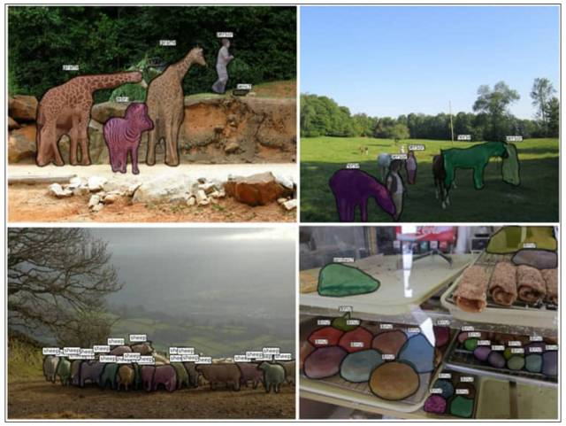
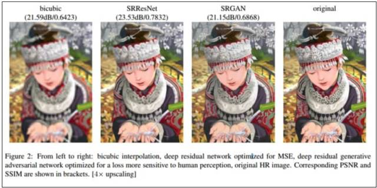
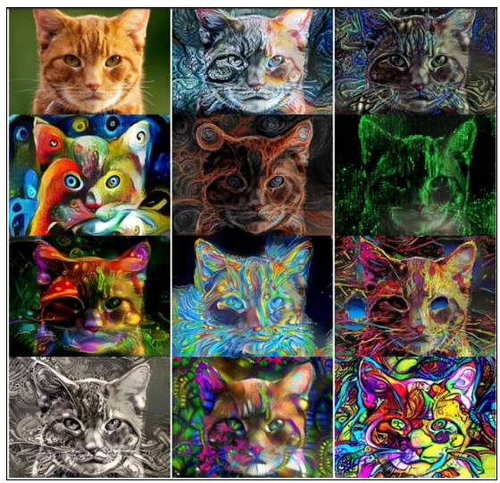
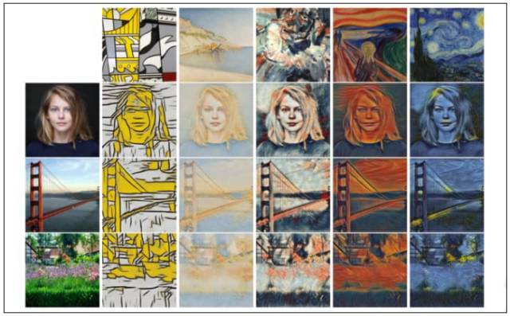
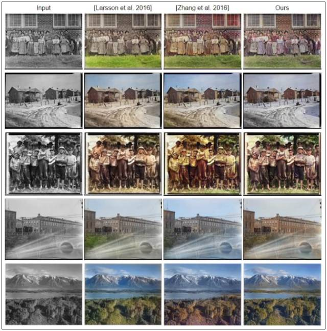

# 深度 | 2017 CV 技术报告之图像分割、超分辨率和动作识别

选自 The M Tank

**机器之心编译**

**参与：晏奇**、蒋思源****

> The M Tank 编辑了一份报告《A Year in Computer Vision》，记录了 2016 至 2017 年计算机视觉领域的研究成果，对开发者和研究人员来说是不可多得的一份详细材料。该材料共包括四大部分，在本文中机器之心对第二部分做了编译介绍，第一部分和第四部分详见《[计算机视觉这一年：这是最全的一份 CV 技术报告](http://mp.weixin.qq.com/s?__biz=MzA3MzI4MjgzMw==&mid=2650733805&idx=1&sn=1439bf16d6c534fa8da69d93bb33f0a4&chksm=871b3893b06cb18521424a1f0bae26fa2235bf30eb95b698e1d3f12a49947daa8cfa492c8497&scene=21#wechat_redirect)》和《[计算机视觉这一年：2017 CV 技术报告 Plus 之卷积架构、数据集与新趋势](http://mp.weixin.qq.com/s?__biz=MzA3MzI4MjgzMw==&mid=2650733850&idx=1&sn=ee05c1e715621e41643cd6af5627a013&chksm=871b3964b06cb0728981e6500c700fa71272726c66b3fee1dfd23c5d18de0205873767bdf973&scene=21#wechat_redirect)》。

**图像分割**

计算机视觉任务的核心是分割（Segmentation）处理，它将整幅图片分割成可被标记和分类的像素组。在此基础上，语义分割（Semantic Segmentation）则更进了一步，它试图从语义上去理解一幅图像中每个像素扮演的角色。比如：一个图像中出现的是一只猫还是汽车，还是其它类别的事物。然而，实例分割（Instance Segmentation）又在语义分割上更进了一步，它能够分割出一个类别事物中具体不同的对象，比如以三种不同颜色来标记不同的三只狗。此外，分割技术的应用十分广泛，大量语义分割技术被应用于自动驾驶中。

可以认为，在图像分割领域，部分最重要的贡献应该归功于 FAIR 实验室。自 2015 年起，他们便展开了名为 DeepMask[46] 的研究项目。DeepMask 可以在对象上粗略生成一个初级版本的分割区域（也即一个「mask」）。在 2016 年，Fair 开发了 SharpMask[47] 系统，它可以对 DeepMask 提供的分割区域进行修正，纠正漏掉的细节并且改善语义分割效果。在此基础之上，MultiPathNet[48] 可以识别出由每个分割区域描述的物体。

「为了能够识别一般物体的形状，你必须首先在高层面（high-level）理解所观察的事物（DeepMask），但是如果要想更具体地来识别它们，那你则需要观察那些小到像素的低层面（lower-level）特征（SharpMask）。」——Piotr Dollar，2016.[49]

*图 6：FAIR 语义分割技术实例展示，来源 Dollar（2016）。**上图展示了 FAIR 应用的图像分割技术，它按顺序包括了 DeepMask、SharpMask 和 MutiPathNet 技术。该流程可实现大规模场景中的精准分割与分类。*

视频传递网络（Video Propagation Network）[51] 通过建立一个简单模型，从视频第一帧开始便向后传递精准的对象分割区域。此外，在整个视频的传递过程中模型也会加入一些额外的信息。

在 2016 年，为了解决上文提及的大规模任务以及本地实现问题，研究人员开始寻找替代性的网络方案。DeepLab 就是一个例子，它在图像语义分割任务上得到了令人激动的成果。Khoreva et al.[53] 基于 Deeplab[52] 的早期工作（circa 2015）提出了一个半监督学习方法，该方法和监督学习网络的性能水平不相上下。

通过使用端到端网络，计算机视觉进一步修正了网络共享有用信息的方法。该方案降低了多进程全方位子任务分类的计算需求。以下是两篇使用了该方法的论文。

*   Fully Convolutional Instance-aware Semantic Segmentation[55] 可以同时执行具体实例的掩码（mask）预测与分类这两项子任务。该网络获得了微软亚洲研究院 COCO 分割挑战的冠军。

然而在此之外，ENet[56]（这是一种用于实时语义分割的深度神经网络架构）却并不属于这一类别。它也展示出了可以降低计算成本的经济适用价值，可以更好地用于移动设备。

我们希望尽可能地将这些前沿技术与已有的实际应用联系起来。所以下面列举了医疗卫生领域在 2016 年内最有意思的一些图像分割项目：

*   3D fully convolutional networks for subcortical segmentation in MRI: A large-scale study[58]

*   Semi-supervised Learning using Denoising Autoencoders for Brain Lesion Detection and Segmentation[59]

*   3D Ultrasound image segmentation: A Survey[60]

*   A Fully Convolutional Neural Network based Structured Prediction Approach Towards the Retinal Vessel Segmentation[61]

*   3-D Convolutional Neural Networks for Glioblastoma Segmentation[62]

其中我们最欣赏的一个准医疗分割应用为 FusionNet[63]，这是一个深度残差卷积神经网络，它可以将图像分割任务用于分析生物神经网络的连接方式，其能力与最先进的电子显微镜分割方法不相上下。

**超分辨率、风格迁移与着色**

并非所有计算机视觉任务都是为了去扩展机器的仿生认知能力。常常我们会发现，那些一个个走进公众的生活的新奇应用产品都使用了具有极强适应能力的神经网络以及其他机器学习技术。去年在超分辨率任务、风格迁移与图像着色的研究就是这样的例子。

超分辨率（Super-resolution）任务指的是从一个低分辨率样本上预测出一个高分辨率版本的过程，此外，它也指对图像特征在不同放大倍数情况下的预测（这一点人类大脑几乎可以不费吹灰之力就办到）。最初的超分辨任务是通过如「双三次插值法」、「最邻近规则」这样的简单技术来实现的。但是对于商业应用而言这显然不够，人们希望系统能克服因数据源质量不高而出现的分辨率低的问题，实现像电视剧《犯罪现场调查：迈阿密》中那样的图像增强技术。正是这样的愿景推动着领域研究的前进。下面列举相关方面的年度进展以及其潜在的影响：

*   Real-Time Video Super Resolution：2016 年也有两篇相关的著名论文 [66][67]。

*   RAISR（Rapid and Accurate Image Super-Resolution），该技术来自谷歌，通过使用由高、低分辨率图像配对而成的数据训练的过滤器，系统避免了对内存与神经网络速度的高度依赖。作为一个基于学习的框架，RAISR 比其竞争对手快了两个数量级。此外，相较于基于神经网络的方法，系统的内存需求达到了最低。因此超分辨率技术可以扩展到移动设备上。[69]

*图 7：SRGAN 的超分辨率任务示例，来源 Ledig et al. (2017)[70]。从左至右分别为「双三次插值法」、优化了均方误差性能的深度残差网络、深度残差生成对抗网络、原始高清图像。相关的峰值信噪比（PSNR）与结构相似性在括号中已列出。[4 倍清晰度倍增]*

使用了生成对抗网络之后，系统达到了目前超分辨率技术的最先进水平：

尽管从峰值信噪比（PSNR）标准来看 SRResNet 的表现最佳，但是就画质而言，SRGAN 的表现才是最好的，它生成了更好的纹理细节，并且得到了最高的平均主观意见分（Mean Opinion Score, MOS）。「就我们所知，这是第一个能够以*4*倍清晰度推理提升逼真自然图像的框架。」[72]

*图 8：风格迁移，图中显示的是将不同的风格迁移到一只猫的照片上（原图位于左上方），图片来源 Nikulin & Novakle（2016）。*

毫无疑问，风格迁移以新颖的方式使用了神经网络，从而进入了公众领域。比较著名的案例如 Facebook 去年进行的整合以及像 Prisma[74] 和 Artomatix[75] 等公司的成果。虽然风格迁移这种技术由来已久，但是直到 2015 年，它可以用神经网络进行处理的方法才随着《艺术风格的神经算法》[76] 的发表而被人知晓。从那以后，作为计算机视觉领域的系列进展，风格迁移的概念得到了 Nikulin 和 Novak[77] 二人的扩展，并且风格迁移也被应用到了视频领域 [78]。

*图 9：风格迁移的其他案例，来源于 Dumoulin et al. (2017, p. 2)[79]。上图第一行（从左到右）的图片代表了系统将向原始图片迁移的艺术风格。图中第一列（从上到下）的图片则是将被进行艺术迁移处理的 3 张原始图片（女性、金门大桥、草地环境）。单个风格迁移网络在使用条件归一化后，可以同时捕捉到 32 种风格。图中显示的是其中 5 种。全部样式可在原论文附录中进行查看。该项工作将会在 2017 ICLR 大会上进行讨论。*

风格迁移是一个热门话题，它会在视觉上给人耳目一新的感觉。试想你有一副图，然后将另一幅图的风格特征应用到这幅图上会怎么样，比如用一位著名画家或某一副名画的风格来修改你的图像。就在今年，Facebook 发布了他们的 Caffe2Go[80]，该深度学习系统可以整合到移动设备上。谷歌也发布了部分有趣的工作，通过结合多种样式，系统可以创造一种独一无二的图像样式，完整论文参见 [82]。

此外，移动整合、风格迁移技术已经应用在了游戏产业的创作中。我们团队的成员最近在 Artomatix 公司创始人兼 CTO Eric Risser 的一个演讲中看到，他们已经在讨论将风格迁移技术应用于游戏内容创作了（比如图像纹理的变化等等）。这种工作会显著减小传统图像纹理设计师的工作。

着色（Colourisation）是指将单色图像转换成全彩的过程。最初这样工作是由人工操作完成的，人们会花非常多的精力去选择每幅图中特定像素应该使用的颜色。长久以来，让画面变得真实一直是人类着色家的专利，但是到 2016 年，技术的进步让机器也可能办到这一点。虽然人类可能无法精准地还原图像中事物的真实颜色，但是他们可以凭借自己对真实世界的知识来让自己的着色在某种程度上看起来是连贯且不奇怪的。

在着色的过程中，网络会根据其对物体位置、纹理与环境的理解来选择最可能的颜色添加到图像上。比如它会学习到皮肤是略带血色的，天空是带些蓝色的。

下面是年度三项影响力最大的工作：

*   Larsson 等人 [84] 通过使用深度学习来进行直方图预测，他们让系统实现了全自动着色功能。

*   Lizuka, Simo-Serra 和 Ishikawa[85] 展示了一个基于卷积神经网络的着色模型。该项工作达到了目前最先进的水平。在我们看来，他们的系统表现从质量上来看是最好的，同时其结果看起来也是最真实的，图 10 提供了对比图。

*图 10：着色研究成果对比，来源 Lizuka et al. 2016[86]。上图从上到下，第一列包含的是等待着色的原始单色图像输入。其他的几列展示了 2016 年多个不同研究生成的着色结果。从左到右看，分别是第二列 Larsson et al.[84]、第三列 Zhang et al.[83]、以及 Lizuka, Simo-Serra 和 Ishikawa[85] 的研究成果，也就是图中被作者称为「ours」的那个团队。纵观整个比较，第三行（图中有一群男孩）的着色差异是最明显的。对此我们相信 Lizuka 等人的工作（第 4 列）在着色结果上看是领先于其对手的。*

「进一步来说，我们的架构可以处理任何分辨率的图像，这与大多数基于卷积神经网络的现有技术不同。」

在一次测试模型生成图像自然程度的实验中，研究人员向被试者随机提供一张模型生成的图像，并提问：「这幅图在你看来自然吗？」

实验结果证明，Lizuka 等人的方法得到了 92.6% 的认可度，基线水准达到了 70%。要知道以当时的技术来看，彩色照片大约在 97.7% 的程度上看起来是自然的。

**行为识别**

行为识别任务有两个含义，一个是在给定视频内对一种动作进行分类；最近更多指的是指：算法仅需要观察一部分场景，就可以在实际动作还没出现之前便预测出相关的结果。按照这种视角，我们发现，最近的研究试图将语境因素嵌入算法的决策过程。这一点与计算机视觉的其他领域类似。以下是该领域的部分重要论文：

「我们在两个具有挑战性的人类行为识别基准上分别实现了 UCF101 (92.7%)、HMDB51 (67.2%)，达到目前最先进的水平。」

「这两个网络首先分别会自己执行视频识别任务与最后的分类任务，然后系统会引入 softmax 分值对二者进行融合。迄今为止，这是应用机器学习进行行为识别最有效的方法，尤其当训练数据有限的情况下更是如此。在我们的工作中，我们将图像卷积网络直接转换成了 3D 架构，结果显示系统在两种人类行为识别基准 UCF101 和 HMDB51 上性能大幅提高，分别达到了 94% 和 70.6%」。Feichtenhofer 等人改进了传统 IDT 方法，结合以上两种技术得到了更好的结果。

「我们方法的关键思想在于，我们可以训练深度网络，让它来预测未来可能在图像中出现的视觉表征。视觉表征是一个可靠的预测目标，因为它们站在比像素层面高的语义层面来编码图像。然后，我们在预测得到的表征上应用识别算法，从而得出对目标和动作的估计。」

*原文链接：http://www.themtank.org/a-year-in-computer-vision*

****本文为机器之心编译，**转载请联系本公众号获得授权****。**

✄------------------------------------------------

**加入机器之心（全职记者/实习生）：hr@jiqizhixin.com**

**投稿或寻求报道：content@jiqizhixin.com**

**广告&商务合作：bd@jiqizhixin.com**