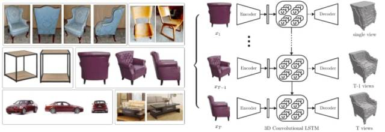
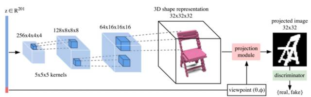
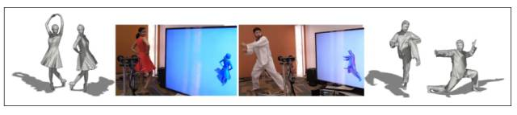
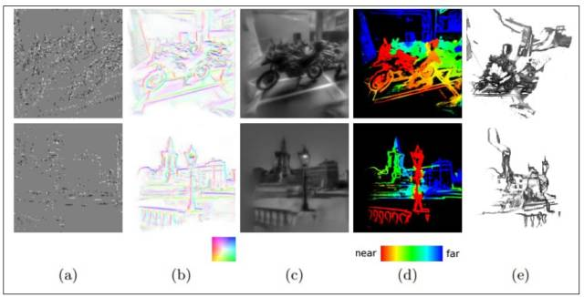
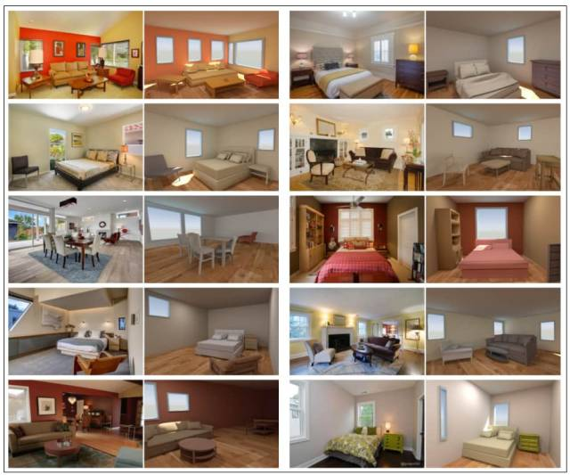

# 深度 | 2017CV 技术报告：从 3D 物体重建到人体姿态估计

选自 The M Tank

**机器之心编译**

> The M Tank 编辑了一份报告《A Year in Computer Vision》，记录了 2016 至 2017 年计算机视觉领域的研究成果，对开发者和研究人员来说是不可多得的一份详细材料。该材料共包括四大部分，在本文中机器之心对第三部分做了编译介绍，第一部分、第二部分和第四部分详见《[计算机视觉这一年：这是最全的一份 CV 技术报告 ](http://mp.weixin.qq.com/s?__biz=MzA3MzI4MjgzMw==&mid=2650733805&idx=1&sn=1439bf16d6c534fa8da69d93bb33f0a4&chksm=871b3893b06cb18521424a1f0bae26fa2235bf30eb95b698e1d3f12a49947daa8cfa492c8497&scene=21#wechat_redirect)》、《[深度 | 2017 CV 技术报告之图像分割、超分辨率和动作识别](https://mp.weixin.qq.com/s?__biz=MzA3MzI4MjgzMw==&mid=2650734197&idx=2&sn=4e205aac262da52978e2286f5bde649c&chksm=871b3a0bb06cb31d3ad73908c98d2b6ff68eef3d47e7bd96ab958b6b07159e7b1d10f8da7db5&scene=21#wechat_redirect) 》、《[计算机视觉这一年：2017 CV 技术报告 Plus 之卷积架构、数据集与新趋势](http://mp.weixin.qq.com/s?__biz=MzA3MzI4MjgzMw==&mid=2650733850&idx=1&sn=ee05c1e715621e41643cd6af5627a013&chksm=871b3964b06cb0728981e6500c700fa71272726c66b3fee1dfd23c5d18de0205873767bdf973&scene=21#wechat_redirect) 》。

「计算机视觉的主要目标是从 2D 的观察复原世界的 3D 结构。」——Rezende et al. (2016, p. 1[92]

正如我们所了解的，在计算机视觉领域，对场景、物体和活动的分类以及绘制边界框和图像分割是许多新兴研究的重点。实际上，这些方法依靠计算来「理解」图像的二维空间。但是，反对者指出，理解 3D 空间对于系统地解释和认知现实世界是必不可少的。

例如，一个网络可能会在图像中找到一只猫，将猫的灰度图上色，并将其归类为一只猫。但是，网络是否能完全理解图像里的猫在其所处环境中的位置？

可能有人会说，在上述任务中，计算机对于 3D 世界的了解很少。与此相反，即使在查看 2D 图片（即透视、遮挡、深度、场景中的对象如何相互关联等情况下）的时候，人们也能够以 3D 空间来理解世界。将这些 3D 表示及其相关知识传递给智能系统是下一场计算机视觉变革的前沿。我这样想的一个主要原因是：

「场景的 2D 投影是关于摄像机的位置、属性，以及灯光和组成场景的物体的复杂函数。如果赋予 3D 理解，智能体可以从这种复杂性中抽象出稳定的、易懂的表示。例如，无论是从上面还是从侧面看，在不同的光照条件和遮挡情况下，模型都可以辨认出椅子就是椅子。」[93]

但是，理解 3D 空间一直面临着几个难题。第一个问题涉及到「自遮挡」和「正常遮挡」的问题，以及大量 3D 形状都能符合单个 2D 表示的特征。由于无法将相同结构的不同图像映射到相同的 3D 空间以及处理这些表示的多模态，对这些问题的理解变得更加复杂 [ 94 ]。最后，实况的 3D 数据集通常相当昂贵且难以获得，加上表示 3D 结构的方法各异，这些都导致了模型训练的局限性。

**3D 物体**

第一部分有些零散，仅作为一个概览，涉及应用于 3D 数据表示的物体的计算、从 2D 图像推导 3D 物体形状和姿态估计、从 2D 图像确定物体的 3D 姿态的变换。[95] 重建的过程将在下一节中详细地介绍。以下展示了我们团队在这个综合领域的最激动人心的工作：

**OctNet: Learning Deep 3D Representations at High Resolutions**

*   **ObjectNet3D: A Large Scale Database for 3D Object Recognition**[97] 贡献了一个数据库，用于 3D 物体识别，其中包含 100 个物体类别的 2D 图像和 3D 形状。『我们的数据库中的图像（取自 ImageNet）中的对象与（从 ShapeNet 存储库获取）的 3D 形状保持一致，该一致性指为每个 2D 物体提供精确的 3D 姿态标注和最接近的 3D 形状标注。』 基准实验包括：生成区域建议、2D 物体检测、联合 2D 检测和 3D 物体姿态估计，以及基于图像的 3D 形状恢复。

*   **3D-R2N2: A Unified Approach for Single and Multi-view 3D Object Reconstruction**[98] - 使用任意视角的单个或多个对象实例的图像，以 3D 占据网格的形式重建对象，主要利用合成数据学习从物体 2D 图像到 3D 形状的映射，网络不需要任何图像标注或物体类别标签就可以训练和测试。该网络由一个 2D-CNN、一个 3D 卷积 LSTM（为本文需要新创建的结构）和一个 3D 解卷积神经网络组成。这些不同的组件之间的相互作用和联合端到端的训练是神经网络分层特征的完美例证。

*图 11： 3D-R2N2 的功能图例*

**论文笔记：**作者希望重建的一些示例对象图像——视图被高基准分隔开，并且物体的外观纹理很少或是非朗伯表面，亦或两者具备。（b）对我们提出的 3D-R2N2 的概述：网络从任意（未校准的）视角输入一系列图像（或者一张图像）作为输入（在本例中为扶手椅的 3 个视图），并产生重建的体素化 3D 作为输出。随着网络看到对象的更多视图，重建过程逐渐细化。

3D-R2N2 使用 ShapeNet 模型生成渲染图像和体素化模型，并有助于 3D 物体重建，而从运动恢复结构（SfM）和并发建图与定位（SLAM）通常会失败：

「我们的拓展实验分析表明，我们的重建框架（i）优于最好的单一视图重建方法，并且（ii）当传统的 SFM / SLAM 方法失效时，仍然能够对物体进行三维重建。

**3D Shape Induction from 2D Views of Multiple Objects**

*图 12：PrGAN 部分架构*

**论文笔记：**用于生成 2D 图像的形状的 PrGAN 架构。3D 体素表示（323）和视角是从输入 z（201-d 向量）独立生成的。投影模块通过给定视角 (θ,φ) 呈现体素形状来创建图像。判别器由二维卷积层和池化层组成，目的在于判定输入图像是生成的还是真实的。论文: Gadhelha et al. (2016, p. 3)[101]

通过这种方式，推断能力是通过无监督的方式学习到的：

「增加投影模块使我们能够在学习阶段不使用任何 3D 信息、视角信息或标注来推断潜在的 3D 形状分布。」

另外，形状的内部表示可以被内插，这意味着体素形状中的离散共性允许实现对象到对象的变换，例如，汽车变飞机。

**Unsupervised Learning of 3D Structure from Images**

DeepMind 的强大的生成模型可运行在 3D 和 2D 图像上。使用 OpenGL 的基于网格的表示允许构建更多的知识，例如，光线如何影响场景和使用的材料。「使用基于 3D 网格的表示和在循环中使用完整的黑盒渲染器进行训练，可以了解对象的颜色、材质和纹理、灯光位置以及其他对象之间的相互作用。」[103]

这些模型质量高，可应对不确定性，并适合概率推理，适用于生成 3D 结构和仿真。该团队在 3D MNIST 和 ShapeNet 上实现了 3D 密度建模的第一个量化基准。这种方法表明，模型可以在 2D 图像上进行端对端的无监督训练，不需要真实的 3D 标签。

**人体姿态估计与关键点检测**

人体姿态估计试图找出人体部位的方向和构型。2D 人体姿态估计或关键点检测一般是指定位人体的身体部位，例如找到膝盖、眼睛、脚等的 2D 位置。

然而，三维姿态估计进一步通过在三维空间中找到身体部位的方向，然后可以选择执行形状估计/建模。在过去的几年中，这些子领域有了大幅的进步。

在竞争评估方面，「COCO2016 关键点挑战包括同时检测人员和定位关键点」[104]「欧洲计算机视觉国际会议」（ECCV）[105] 提供了有关这些主题的广泛的文献，但我们想安利一篇论文：

**Realtime Multi-Person 2D Pose Estimation using Part Affinity Fields**

该方法在首届 MSCOCO 2016 关键挑战赛上以 60％的平均精度（AP）取得了当前最佳性能，并在 ECCV 上获得了最佳的演示奖，视频：https://www.youtube.com/watch?v=pW6nZXeWlGM[107]

**Keep it SMPL: Automatic Estimation of 3D Human Pose and Shape from a Single Image**

「我们描述了第一种（从一张无约束图像）自动估计人体 3D* *姿态以及 3D* *人体形状的方法。我们估计一个完整的 3D* *网格，并表明仅仅 2D 关节就携带了大量的身体形状的信息。由于人体的复杂性、清晰度、遮挡情况、衣服、照明条件以及从 2D 推断 3D 所固有的模糊性，致使这个问题极具挑战性。」[110]

**3D 重建**

如前所述，前面重点介绍了一些关于重建的例子。但大部分都在关注物体，特别是物体的形状和姿态。虽然其中有一部分是重建（Reconstruction）技术，但「重建」这个领域本身包括更多不同的类型，例如场景重建、多视点重建、单视点重建、基于运动的重建（SfM）、即时定位与地图重建（SLAM）等。此外，一些重建方法利用了附加（和多个）传感器与设备，比如 Event 或 RGB-D 摄像机等，这些方法可以同时分层运用多种技术来推动系统进程。

那么结果如何？整个场景可以非刚性（non-rigidly）地重建，并在时空上进行改变。例如，对你自己的高保真结构以及你的动作可进行实时更新。

如前所述，围绕 2D 图像映射到 3D 空间的问题持续存在。以下文章介绍了创建高保真实时重建的多种方法：

**Fusion4D: Real-time Performance Capture of Challenging Scenes**

*图 13：实时反馈的 Fusion4D 案例，来源 Dou et al. (2016, p. 1)[112]。*

**论文笔记：**「我们提出了一种实时高质量 4D（即，时空相干）性能捕获的新方法，允许从多个有噪声的 RGB-D 相机输入中进行增量式非刚性重建。我们的系统以实时速率演示了非刚性序列前所未有的重构，包括对大型帧对帧运动和拓扑变化的鲁棒性处理。」

Fusion4D 创建实时高保真三维像素表示，在虚拟现实、增强现实和远程监控方面的运用令人印象深刻。这项来自微软的工作可能会彻底改变动作捕捉技术，有可能在体育直播中得到运用。

**Real-Time 3D Reconstruction and 6-DoF Tracking with an Event Camera**

*图 14：实时三维重建示例，来源 Kim et al. (2016, p. 12)[116]。*

**论文笔记：**我们的联合估计算法在不同方面各种设置的演示如下。（a）输入事件流的可视化；（b）估计梯度关键帧；（c）具有超高分辨率和高动态范围特性的强度关键帧重构；（d）估算深度图；（e）半密集的 3D 点云。

与传统相机相比，Event Camera 在计算机视觉领域越发受到研究者的青睐。它的延时更短、能耗更低、动态范围更大。传统相机输出的是一系列的帧，但 Event Camera 输出的却是「异步尖峰流（asynchronous spikes），每一个都与像素位置、符号、准确时间相对应，指示了何时单个像素记录阈值对数强度的变化。」[117]

有关 Event Camera 的功能、实时三维重建和 6-DoF 跟踪的说明，请参阅报告原文的附加资料 [118]。

使用单视点进行实时图像绘制和深度估计时，这种方法的表现令人难以置信：

「我们提出了一种方法，它可以在仅利用一个简单的手持式 Event Camera 而不使用其他外加传感的情况下进行实时三维重建，并且可以在无先验知识的非结构化场景下工作。」

**其他未分类的三维重建**

IM2CAD[120] 描述了「将图形转换为 CAD 模型」的过程。CAD 是指计算机辅助设计，是为建筑测绘、工程设计、产品设计等领域创建三维场景的主要方法。

「给定一个房间的照片和大型的家具 CAD 模型数据库，我们的任务就是重建一个尽可能与照片相似的场景，其中组成场景的对象都从数据库中提取。」

原论文作者提出了一个自动系统，可以「迭代地优化对象的位置和尺度」，从而对来自真实图像的输入进行最佳匹配。绘制的场景通过使用深度 CNN 作为度量方法验证与原始图像的差别。

*图 15：IM2CAD 渲染卧室场景的例子，其中左侧为真实的输入图像，右为根据输入图像和 IM2CAD 自动创建的 CAD 模型。来源 Izadinia et al. (2016, p. 10) [121]。*

**为何关注 IM2CAD?**

作者所处理的问题是 Lawrence Roberts 在 1963 年展示的首进步创技术之一，意义重大。尽管对象是非常简单的线条图，它可以在使用已知对象数据库的情况下推断 3D 场景。

「虽然 Robert 的方法很有远见，但在计算机视觉超过半个世纪的后续研究中，还是没能使他的方法走向实际发展，即没能在真实图像和场景之间可靠地工作。」

本文作者介绍了这个问题的一个变形，旨在利用「3D 目标模型数据库中的对象」，从照片当中重建高保真的场景。

**IM2CAD 的流程主要涉及和包含以下部分：**

*   用于目标检测的 Faster R-CNN。

*   在找到图片内的对象之后，找寻 ShapeNet 库中与检测对象最接近的 CAD 模型，完成 CAD 模型对齐。例如，在给定形状和近似的姿态之后，找到椅子的类型。每个 3D 模型都会被渲染到 32 个视点，然后利用深度特征，将其与对象检测生成的边界框相比较

*   场景中的对象布置

*   Finally Scene Optimization 通过优化渲染场景的摄像机视图与输入图片的视觉相似性，进行对象布置的进一步优化。

**同样地，在这个领域中，ShapeNet 意义重大：**

「首先，我们利用 ShapeNet，其中包含上百万个对象的 3D 模型，包括上千种不同的桌子、椅子和其他家居用品。这个数据集是使 3D 场景理解研究改变的关键，也是使得我们的工作成为可能的关键。」

**Learning Motion Patterns in Videos**

**Deep Image Homography Estimation**

单应性（homography）这个术语来自投影几何，指的是将一个平面映射到另一个平面的一种变换。「从一对图像中估计 2D 单应性是计算机视觉领域的一项基本任务，也是单眼 SLAM 系统中的重要部分。」

作者还提供了从真实图像（例如 MS-COCO）的现有数据集中生成「近无限」数据集的方案，这弥补了深度网络大量的数集需求。他们设法「通过在大型图像数据集中应用随机投影变换，创建近无限多个标记训练样例」。

**gvnn: Neural Network Library for Geometric Computer Vision**

「在这个工作中，我们依赖原本在空间变换网络上提出的 2D 变换层，提供了进行几何变换的多种新型扩展，它们常用于计算机几何视觉中。」

「通过参数变换来调整图像重建误差，这给学习几何变换的不变性开辟了应用，可被用于地点识别、端到端视觉测量、深度估计和无监督学习等领域。」

**结语**

在这一整节中，我们广泛了解了 3D 理解领域，主要关注了姿态估计、重建、深度估计和单应性矩阵四部分内容。但是由于字数的限制，还有很多精彩的工作被我们忽略了。因此，我们是在为读者提供一个宝贵的出发点，但不是绝对涵盖了所有领域。

大部分突出的工作可以被归类于几何视觉，它通常处理真实世界数量的测量，比如从图片中直接得出的距离、形状、面积、体积。我们获得的启发是，基于识别的任务和通常关注几何视觉的应用有一些不同，它们更关注高级的语义信息。然而我们发现，三维理解的不同领域往往是密不可分的。

即时定位与地图重建（SLAM）是最大的几何问题之一。研究人员正在考虑，SLAM 是否会成为深度学习所面临的下一个主要问题。很多怀疑所谓深度学习「普适性」的研究者指出了 SLAM 作为算法的重要性与功能：

「视觉 SLAM 算法能够在跟踪摄像机位置和方向的同时，建立世界的 3D 地图。」[127] SLAM 方法的几何估计部分目前不太适合深度学习手段，端到端学习同样也不太可能。SLAM 是机器人学最重要的算法之一，而且它是根据计算机视觉领域大量的输入这一特征来设计的。该技术在谷歌地图、自动驾驶汽车、类似 Google Tango[128] 的 AR 设备、甚至火星漫游车中都有应用。

此外，Tomasz Malisiewicz 提供了著名人士关于这个问题的汇总意见。他们同意「语义性是建立更大、更好的 SLAM 系统所必须的。」[129] 这表明了一种潜在的前景，即深度学习未来可能应用在 SLAM 领域。

我们联系了 Plink and Pointy 的联合创始人 Mark Cummins，他在博士期间钻研 SLAM 技术。对以上问题，他提供了自己的看法：

「利用现有手段，SLAM 的核心几何估计部分得到了很好的处理。但是，高级语义和低级系统组成都能受益于深度学习。尤其是：

深度学习能极大地提高地图语义的质量，即超越姿势和点云，并充分理解地图中不同类型的对象或区域。这对于许多应用而言有着更加强大的功能，并且有助于实现通用的鲁棒性。（例如，通过更好地处理动态对象和环境改变）

在低层次，许多组件可以通过深度学习得到改善。其中主要包括：地点识别、闭环检测、重新定位、针对稀疏 SLAM 方法更好地进行点描述等。

总的来说，SLAM 解决方案的结构可能保持不变，但是在组件上可能有一些改进。「大家可能希望用深度学习做一些全新的、根本上的改变，例如完全扔掉几何图形、建立更基于识别的导航系统。但是对于目标是精确几何地图的系统而言，SLAM 中的深度学习可能更倾向于改进组件，而不是做一些全新的事情。」

总而言之，我们相信 SLAM 不太可能完全被深度学习取代。但是，未来这两种途径很可能变得互补。

*原报告地址：http://www.themtank.org/a-year-in-computer-vision*

****本文为机器之心编译，**转载请联系本公众号获得授权****。**

✄------------------------------------------------

**加入机器之心（全职记者/实习生）：hr@jiqizhixin.com**

**投稿或寻求报道：content@jiqizhixin.com**

**广告&商务合作：bd@jiqizhixin.com**