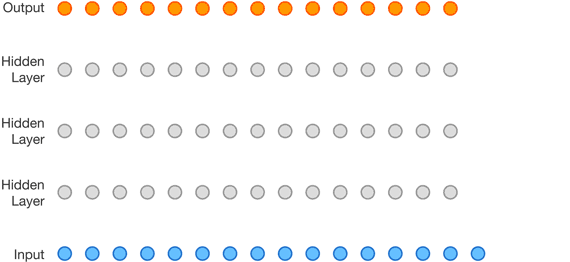
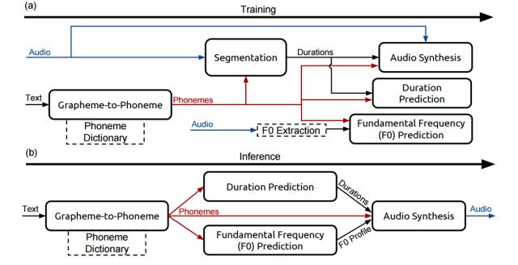
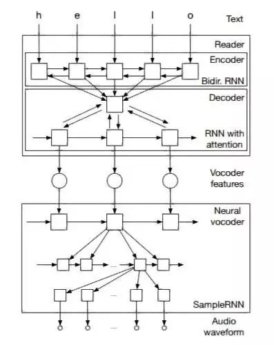
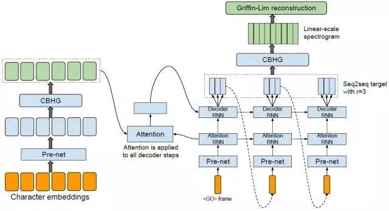

# 语音合成到了跳变点？深度神经网络变革 TTS 最新研究汇总

机器之心原创

**作者：李亚洲**

> > *近年来，随着深度神经网络的应用，计算机理解自然语音能力有了彻底革新，例如深度神经网络在语音识别、机器翻译中的应用。但是，使用计算机生成语音（语音合成（speech synthesis）或文本转语音（TTS）），仍在很大程度上基于所谓的拼接 TTS（concatenative TTS）。而这种传统的方法所合成语音的自然度、舒适度都有很大的缺陷。深度神经网络，能否像促进语音识别的发展一样推进语音合成的进步？这也成为了人工智能领域研究的课题之一。*
> 
> [2016 年，DeepMind 提出了 WaveNet](http://mp.weixin.qq.com/s?__biz=MzA3MzI4MjgzMw==&mid=2650719022&idx=1&sn=3eeb1958e695388817dd32b0d228ced9&scene=21#wechat_redirect)，在业内引起了极大的关注。WaveNet 可以直接生成原始音频波形，能够在文本转语音和常规的音频生成上得到出色的结果。但就实际应用而言，它存在的一个问题就是计算量很大，没办法直接用到产品上面。
> 
> 因此在语音合成领域，仍然有很多工作要做。语音合成有两个主要目标：可理解性（intelligibility）和自然感（naturalness）。可理解性是指合成音频的清晰度，特别是听话人能够在多大程度上提取出原信息。自然感则描述了无法被可理解性直接获取的信息，比如听的整体容易程度、全局的风格一致性、地域或语言层面的微妙差异等等。
> 
> 去年，我们看到了业界将研究热点聚焦于语音识别，而今年语音合成成为深度学习社区研究的重要领域之一。2017 年刚过去不久，机器之心已经关注到了三篇有关这一课题的研究论文：百度的 Deep Voice、Yoshua Bengio 团队提出的 Char2Wav 以及谷歌的 Tacotron。
> 
> 在介绍今年的最新研究成果之前，我们先来回顾一下 Deep Mind 的 WaveNet。
> 
> WaveNet 受启发于二维的 PixelNet，在这里它被调整为了一维的。
> 
> 
> 
> 以上的动画展示了 WaveNet 的结构。这是一个完全卷积的神经网络，其中的卷积层有不同的膨胀系数（dilation factors），这让其感受野（receptive field）可在深度（depth）上指数式地增长并可覆盖数千个时间步骤（timesteps）。
> 
> 在训练时间上，其输入序列是由人类说话者录制的真实波形。训练之后，可以对这个网络进行采样以生成合成话语。在采样的每一个时间步骤，都会从该网络所计算出的概率分布中取出一个值。然后这个值会被反馈进入输入，并为下一个步骤生成一个新的预测。我们可以发现，像这样一次一步地构建样本就会产生很高的计算成本，这也是我们上面所提到的实际应用中的问题。
> 
> 另外要提到的一点是，为了使用 WaveNet 将文本转化为语音，需要识别文本中是什么。在 DeepMind 这篇论文中，研究人员是通过将文本转换为一序列的语言和语音特征（包含了当前音素、音节、词等方面的信息）做到这一点的。
> 
> 刚才也提到 WaveNet 在实际应用中所面临的挑战，而深度神经网络应用到语音合成上还有很大的提升空间。接下来，介绍一下该领域最新的三篇研究成果。
> 
> **百度 Deep Voice **
> 
> 2017 年 2 月，百度研究部门提出了深度语音（Deep Voice）系统，该系统是一个完全由深度神经网络构建的高质量文本转语音系统。
> 
> 在研究博客中百度研究人员表示，如今建立文本转语音系统最大的障碍就是音频合成的速度，而他们的系统已经做到了实时的语音合成，这相比以前的 WaveNet 推理的实现有 400 倍的加速。
> 
> 作者们表示，Deep Voice 论文的贡献在于：
> 
> *   Deep Vioce 受启发于传统的文本转语音处理流程，采用了同样的架构，但它使用神经网络取代了所有组件且使用了更简单的特征。这使得该系统更适用于新数据集、语音和没有任何手动数据注释或其他特征调配的领域。
>     
>     
> *   Deep Voice 为真正的端到端语音合成奠定了基础，这种端到端系统没有复杂的处理流程，也不依赖于人工调配（hand-engineered）的特征作为输入或进行预训练（pre-training）。
>     
>     
> 
> 
> 
> 如上图所示，TTS 包含 5 个模块：
> 
> *   一个字素转音素模型；
>     
>     
> *   一个在语音数据集中定位音素边界的分隔模型；
>     
>     
> *   预测音素序列中每个音素时距（temporal duration）的音素长度模型；
>     
>     
> *   一个基本的频率模型预测音素是否浊音的；
>     
>     
> *   一个音频合成模型，结合以上 4 个组件的输出来合成音频。
>     
>     
> 
> 在百度的研究中，研究人员通过相应的神经网络代替经典 TTS 流程中的每一个组件，具体实现读者可参阅论文。
> 
> 百度在研究博客中表示，「深度学习变革了包括计算机视觉和语音识别在内的许多领域，我们相信语音合成如今也到了一个跳变点。」
> 
> 参考阅读：
> 
> [业界 | 百度提出 Deep Voice：实时的神经语音合成系统](http://mp.weixin.qq.com/s?__biz=MzA3MzI4MjgzMw==&mid=2650723769&idx=4&sn=7098361f7369fe813aed6b2d035394c8&chksm=871b11c7b06c98d11ff77ed0f23ac56ad1c55ae34756b628f215912f7feb815f290207ab13a6&scene=21#wechat_redirect)
> 
> **端到端语音合成模型 Char2wav**
> 
> 2 月份，来自印度理工学院坎普尔分校、INRS-EMT、加拿大高等研究院（CIFAR）的研究者在 arXiv 上发布了一篇论文，介绍他们在端到端语音合成上的研究成果 Char2Wav。
> 
> 在此论文中，作者们提出一种端到端的用于语音合成的模型 Char2Wav。Char2Wav 由两个组成部分：一个读取器（reader）和一个神经声码器（nerual vocoder）。
> 
> 读取器是一个带有注意（attention）的编码器-解码器模型。其中编码器是一个以文本或音素作为输入的双向循环神经网络（RNN），而解码器则是一个带有注意的循环神经网络，其会产出声码器声学特征（vocoder acoustic features）。神经声码器是指 SampleRNN 的一种条件式的扩展，其可以根据中间表征（intermediate representations）生成原始的声波样本。
> 
> 
> 
> *Char2Wav：一个基于注意的循环序列生成器（ARSG/attention-based recurrent sequence generator）是指一种基于一个输入序列 X 生成一个序列 Y= (y1, . . . , yT ) 的循环神经网络。X 被一个编码器预处理输出一个序列 h = (h1, . . . , hL)。在本研究中，输出 Y 是一个声学特征的序列，而 X 则是文本或要被生成的音素序列。此外，该编码器是一个双向循环网络。*
> 
> 作者们表示该工作工作受到了 Alex Graves (Graves, 2013; 2015) 研究的很大影响。在一个客座讲座中，Graves 展示了一个使用了注意机制的语音合成模型，但 Graves 的研究未已论文的形式发表出来。
> 
> 此外，与用于语音合成的传统模型不同，Char2Wav 可以学习直接根据文本生成音频。这和百度的 Deep Voice 系统一致。
> 
> 参考阅读：
> 
> [Yoshua Bengio 等人提出 Char2Wav：实现端到端的语音合成](http://mp.weixin.qq.com/s?__biz=MzA3MzI4MjgzMw==&mid=2650723604&idx=4&sn=5aeb3df13d7565fb6c889450bb48b80b&chksm=871b116ab06c987c8c0dc36f437008c30ab7df5f8450c2de183f358662e14260995d8cdf10ce&scene=21#wechat_redirect)
> 
> **谷歌端到端的文本转语音合成模型 Tacotron**
> 
> 不就之前，谷歌歌科学家王雨轩（第一作者）等人提出了一种新的端到端语音合成系统 Tacotron，该模型可接收字符的输入，输出相应的原始频谱图，然后将其提供给 Griffin-Lim 重建算法直接生成语音。此外作者们表示他们还提出了几个可以使该序列到序列框架在这个高难度任务上表现良好的关键技术。
> 
> 测试结果上，Tacotron 在美式英语测试里的平均主观意见评分达到了 3.82 分（总分是 5 分），在自然感（naturalness）方面优于已在生产中应用的参数系统（parametric system）。此外，由于 Tacotron 是在帧（frame）层面上生成语音，所以它比样本级自回归（sample-level autoregressive）方式快得多。
> 
> 
> 
> *模型架构：该模型接收字符的输入，输出相应的原始频谱图，然后将其提供给 Griffin-Lim 重建算法以生成语音*
> 
> 参考阅读：
> 
> [学界 | 谷歌全端到端语音合成系统 Tacotron：直接从字符合成语音](http://mp.weixin.qq.com/s?__biz=MzA3MzI4MjgzMw==&mid=2650725012&idx=5&sn=0a563bffd5f9ca34560767cfb3064e99&chksm=871b1eeab06c97fc74242ddd85fcca962482bd1f76dcd52b139e0a78c4568fdbe08e4b6b3c43&scene=21#wechat_redirect)
> 
> **总结**
> 
> 一直以来，与机器进行自然的语音交互一直是我们的一个梦想。虽然，语音识别已经达到了相当高的准确度，但在语音交互的回路中不只有语音识别，自然的语音合成也是一个非常重要的研究领域。
> 
> 在提高语音识别准确度之后，深度神经网络在促进语音合成的发展上也有非常大的潜力。2017 年开始到现在，我们已经观察到了上面所介绍的这样的研究成果（当然，会有遗漏）。我们相信，语音合成就像百度博客中所介绍的那样到了一个「跳变点」，期待接下来会有更多新的研究成果出现，让人与机器能够进行更自然的交互。
> 
> **机器之心正在寻找副主编、资深记者、大客户经理、活动执行经理等，查看详情及更多职位，请查看：[全球招聘 | 机器之心 ALL IN 了，你 CALL 吗？](http://mp.weixin.qq.com/s?__biz=MzA3MzI4MjgzMw==&mid=2650724980&idx=5&sn=27df019851d83ff328998aa4dbbd88b0&chksm=871b1e0ab06c971cb144cc118b0d6f49e59408386fb8763bde743f9b9e223b5489db9680998f&scene=21#wechat_redirect)**
> 
> ******©本文为机器之心原创，***转载请联系本公众号获得授权******。***
> 
> ✄------------------------------------------------
> 
> **加入机器之心（全职记者/实习生）：hr@jiqizhixin.com**
> 
> **投稿或寻求报道：editor@jiqizhixin.com**
> 
> **广告&商务合作：bd@jiqizhixin.com**