# 资源 | 从全连接层到大型卷积核：深度学习语义分割全指南

选自 qure.ai

**机器之心编译**

**参与：路雪、蒋思源**

> > *语义分割一直是计算机视觉中十分重要的领域，随着深度学习的流行，语义分割任务也得到了大量的进步。本文首先阐释何为语义分割，然后再从论文出发概述多种解决方案。本文由浅层模型到深度模型，简要介绍了语义分割各种技术，虽然本文并没有深入讲解语义分割的具体实现，但本文简要地概述了每一篇重要论文的精要和亮点，希望能给读者一些指南。*
> 
> ### **什么是语义分割？**
> 
> 语义分割指像素级地识别图像，即标注出图像中每个像素所属的对象类别。如下图：
> 
> 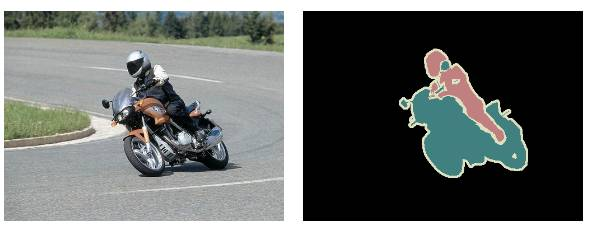
> 
> *左：输入图像，右：该图像的语义分割*
> 
> 除了识别车和骑车的人，我们还需要描绘出每个物体的边界。因此，与图像分类不同，语义分割需要根据模型进行密集的像素级分类。
> 
> VOC2012 和 MSCOCO 是语义分割领域最重要的数据集。
> 
> ### **有哪些不同的解决方案？**
> 
> 在深度学习应用到计算机视觉领域之前，人们使用 TextonForest 和 随机森林分类器进行语义分割。卷积神经网络（CNN）不仅对图像识别有所帮助，也对语义分割领域的发展起到巨大的促进作用。
> 
> 语义分割任务最初流行的深度学习方法是图像块分类（patch classification），即利用像素周围的图像块对每一个像素进行独立的分类。使用图像块分类的主要原因是分类网络通常是全连接层（full connected layer），且要求固定尺寸的图像。
> 
> 2014 年，加州大学伯克利分校的 Long 等人提出全卷积网络（FCN），这使得卷积神经网络无需全连接层即可进行密集的像素预测，CNN 从而得到普及。使用这种方法可生成任意大小的图像分割图，且该方法比图像块分类法要快上许多。之后，语义分割领域几乎所有先进方法都采用了该模型。
> 
> 除了全连接层，使用卷积神经网络进行语义分割存在的另一个大问题是池化层。池化层不仅扩大感受野、聚合语境从而造成了位置信息的丢失。但是，语义分割要求类别图完全贴合，因此需要保留位置信息。本文将介绍两种不同结构来解决该问题。
> 
>  第一个是编码器-解码器结构。编码器逐渐减少池化层的空间维度，解码器逐步修复物体的细节和空间维度。编码器和解码器之间通常存在快捷连接，因此能帮助解码器更好地修复目标的细节。U-Net 是这种方法中最常用的结构。
> 
> 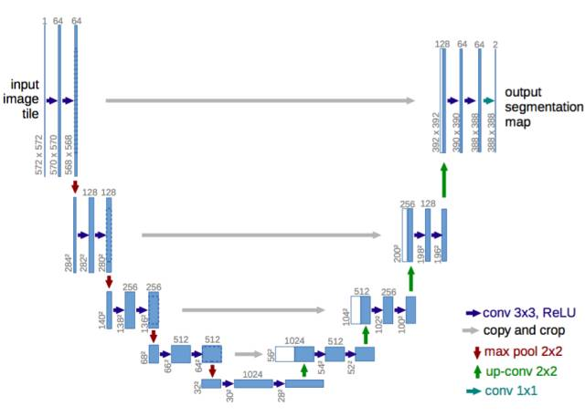
> 
> *U-Net：一种编码器-解码器结构*
> 
>  第二种方法使用空洞/带孔卷积（dilated/atrous convolutions）结构，来去除池化层。
> 
> 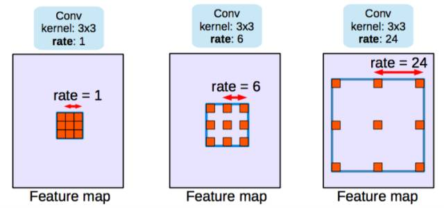
> 
> *Dilated/atrous 卷积，rate=1 是典型的卷积结构*
> 
> 条件随机场（CRF）预处理通常用于改善分割效果。CRF 是一种基于底层图像像素强度进行「平滑」分割的图模型。它的工作原理是灰度相近的像素易被标注为同一类别。CRF 可令分值提高 1-2%。
> 
> 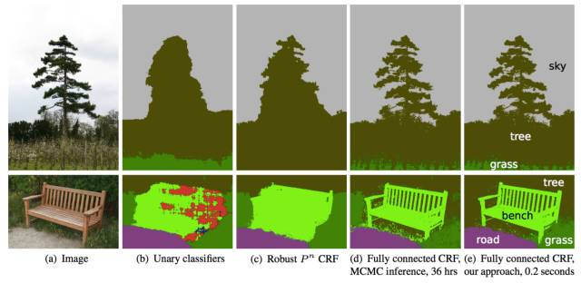
> 
> *CRF 示意图。（b）一元分类器作为 CRF 的分割输入。（c、d、e）是 CRF 的变体，其中（e）是广泛使用的一种 CRF*
> 
> 下面，我将总结几篇论文，介绍分割结构从 FCN 以来的发展变化。所有这些架构都使用 VOC2012 评估服务器进行基准测试。
> 
> ### **论文概述**
> 
> 下列论文按照时间顺序进行介绍：
> 
> 1.  FCN
>     
>     
> 2.  SegNet
>     
>     
> 3.  Dilated Convolutions
>     
>     
> 4.  DeepLab (v1 & v2)
>     
>     
> 5.  RefineNet
>     
>     
> 6.  PSPNet
>     
>     
> 7.  Large Kernel Matters
>     
>     
> 8.  DeepLab v3
>     
>     
> 
> 我列出了每篇论文的主要贡献，并稍加解释。同时我还展示了这些论文在 VOC2012 测试数据集上的基准测试分数（IOU 均值）。
> 
> #### **FCN**
> 
> *   使用全卷积网络进行语义分割（Fully Convolutional Networks for Semantic Segmentation）
>     
>     
>     
> *   2014 年 11 月 14 日提交
>     
>     
>     
> *   arXiv 链接（https://arxiv.org/abs/1411.4038）
>     
>     
>     
> 
> 主要贡献：
> 
> *   推广端到端卷积网络在语义分割领域的应用
>     
>     
>     
> *   修改 Imagenet 预训练网络并应用于语义分割领域
>     
>     
>     
> *   使用解卷积层进行上采样
>     
>     
>     
> *   使用跳跃连接，改善上采样的粒度程度
>     
>     
>     
> 
> 相关解释：
> 
> 本论文的关键点是分类网络中的全连接层可视为使用卷积核覆盖整个输入区域的卷积操作。这相当于根据重叠的输入图像块评估原始分类网络，但由于计算过程由图像块的重叠部分共同分担，这种方法比之前更加高效。尽管该结论并非独一无二，但它显著提高了 VOC2012 数据集上模型的最佳效果。
> 
> 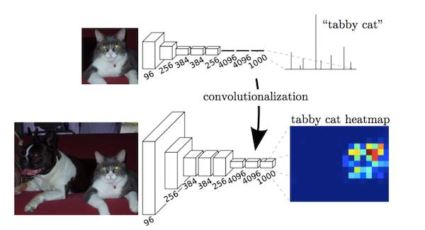
> 
> *全连接层作为卷积操作*
> 
> 将全连接层在 VGG 等 Imagenet 预训练网络中进行卷积操作后，由于 CNN 中的池化操作，特征图仍旧需要上采样。解卷积层不使用简单的双线性插值，而是学习所进行的插值。解卷积层又被称为上卷积（upconvolution）、完全卷积、转置卷积或微步卷积（fractionally-strided convolution）。
> 
> 但是，由于池化过程造成信息丢失，上采样（即使带有解卷积层）生成的分割图较为粗糙。因此我们可以从高分辨率的特征图中引入跳跃连接（shortcut/skip connection）来改善上采样的粗糙程度。
> 
> VOC2012 基准测试分数：
> 
> 
> 
> 个人评价：
> 
> 这是一项重要的贡献，但是当前的技术水平又有了很大发展。
> 
> #### **SegNet**
> 
> *   SegNet：用于图像分割的一种深度卷积编码器-解码器架构（SegNet: A Deep Convolutional Encoder-Decoder Architecture for Image Segmentation）
>     
>     
> *   2015 年 11 月 2 日提交
>     
>     
> *   arXiv 链接（https://arxiv.org/abs/1511.00561）
>     
>     
> 
> 主要贡献：
> 
> 将最大池化索引（Maxpooling indices）转移到解码器，从而改善分割分辨率。
> 
> 相关解释：
> 
> 在 FCN 网络中，尽管使用了解卷积层和一些跳跃连接，但输出的分割图仍然比较粗糙。因此，更多的跳跃连接被引入 FCN 网络。但是，SegNet 没有复制 FCN 中的编码器特征，而是复制了最大池化索引。这使得 SegNet 比 FCN 更节省内存。
> 
> 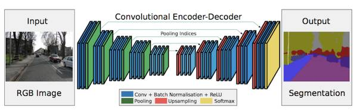
> 
> *Segnet 结构*
> 
> VOC2012 基准测试分数：
> 
> 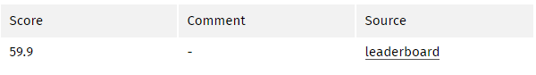
> 
> 个人评价：
> 
> *   FCN 和 SegNet 都是最早出现的编码器-解码器结构。
>     
>     
>     
> *   SegNet 的基准测试分数不够好，不宜继续使用。
>     
>     
>     
> 
> #### **空洞卷积（Dilated Convolutions）**
> 
> *   使用空洞卷积进行多尺度背景聚合（Multi-Scale Context Aggregation by Dilated Convolutions）
>     
>     
>     
> *   2015 年 11 月 23 日提交
>     
>     
>     
> *   arXiv 链接（https://arxiv.org/abs/1511.07122）
>     
>     
>     
> 
> 主要贡献：
> 
> *   使用空洞卷积，一种可进行稠密预测的卷积层。
>     
>     
> *   提出「背景模块」（context module），该模块可使用空洞卷积进行多尺度背景聚合。
>     
>     
> 
> 相关解释：
> 
> 池化使感受野增大，因此对分类网络有所帮助。但池化会造成分辨率下降，不是语义分割的最佳方法。因此，论文作者使用空洞卷积层（dilated convolution layer），其工作原理如图：
> 
> 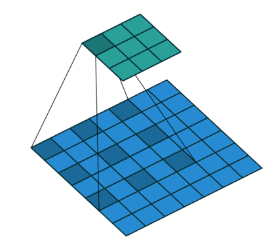
> 
> *空洞/带孔卷积*
> 
> 空洞卷积层（DeepLab 将其称为带孔卷积）可使感受野呈指数级增长，而空间维度不至于下降。
> 
> 从预训练好的分类网络（此处指 VGG）中移除最后两个池化层，之后的卷积层都使用空洞卷积。尤其是，pool-3 和 pool-4 之间的卷积是空洞卷积 2，pool-4 后面的卷积是空洞卷积 4。使用这个模块（论文中称为前端模块 frontend module）之后，无需增加参数即可实现稠密预测。另一个模块（论文中称为背景模块 context module）将使用前端模块的输出作为输入进行单独训练。该模块是多个不同扩张程度的空洞卷积级联而成，因此该模块可聚合多尺度背景，并改善前端模块获取的预测结果。
> 
> VOC2012 基准测试分数：
> 
> 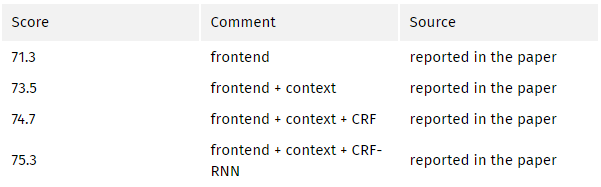
> 
> 个人评价：
> 
> 预测分割图的大小是图像大小的 1/8。几乎所有的方法都存在这个现象，通常使用插值的方法获取最终分割图。
> 
> #### **DeepLab (v1 & v2)**
> 
> *   v1: 使用深度卷积网络和全连接 CRF 进行图像语义分割（Semantic Image Segmentation with Deep Convolutional Nets and Fully Connected CRFs）
>     
>     
>     
> *   2014 年 12 月 22 日提交
>     
>     
>     
> *   arXiv 链接（https://arxiv.org/abs/1412.7062）
>     
>     
>     
> 
> *   v2 : DeepLab: 使用深度卷积网络、带孔卷积和全连接 CRF 进行图像语义分割（DeepLab: Semantic Image Segmentation with Deep Convolutional Nets, Atrous Convolution, and Fully Connected CRFs）
>     
>     
>     
> *   2016 年 6 月 2 日提交
>     
>     
>     
> *   arXiv 链接（https://arxiv.org/abs/1606.00915）
>     
>     
>     
> 
> 主要贡献：
> 
> *   使用带孔/空洞卷积。
>     
>     
>     
> *   提出金字塔型的空洞池化（ASPP）
>     
>     
>     
> *   使用全连接 CRF
>     
>     
>     
> 
> 相关解释：
> 
> 带孔/空洞卷积在不增加参数的情况下增大感受野。如上文中空洞卷积论文中所述，分割网络得到改进。
> 
> 将原始图像的多个重新缩放版本传递到 CNN 网络的并行分支（图像金字塔）中，或者使用采样率不同的多个并行空洞卷积层（ASPP），实现多尺度处理。
> 
> 结构化预测可通过全连接 CRF 实现。CRF 的训练/微调需作为后处理的步骤单独进行。
> 
> 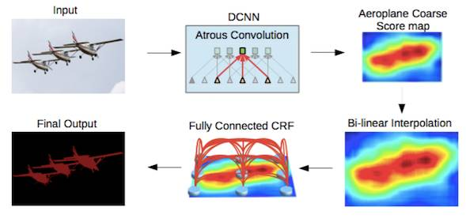
> 
> *DeepLab2 流程图*
> 
> VOC2012 基准测试分数：
> 
> 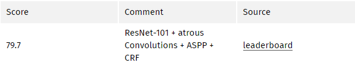
> 
> #### **RefineNet**
> 
> *   RefineNet：使用多路径精炼网络进行高分辨率语义分割（RefineNet: Multi-Path Refinement Networks for High-Resolution Semantic Segmentation）
>     
>     
>     
> *   2016 年 11 月 20 日提交
>     
>     
>     
> *   arXiv 链接（https://arxiv.org/abs/1611.06612）
>     
>     
>     
> 
> 主要贡献：
> 
> *   具备精心设计解码器模块的编码器-解码器架构
>     
>     
>     
> *   所有组件遵循残差连接设计
>     
>     
>     
> 
> 相关解释：
> 
> 使用空洞/带孔卷积的方法也有弊端。由于空洞卷积需要大量高分辨率特征图，因此其计算成本高昂，且占用大量内存。这妨碍了高分辨率预测的计算。例如，DeepLab 的预测结果大小是原始输入图像的 1/8。
> 
> 因此，这篇论文提出使用编码器-解码器结构。编码器是 ResNet-101 模块，解码器是 RefineNet 模块，该模块融合了编码器中的高分辨率特征和先前 RefineNet 模块中的低分辨率特征。
> 
> 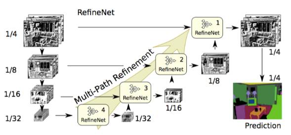
> 
> *RefineNet 架构* 
> 
>  每一个 RefineNet 模块都有两个组件，一个组件通过对低分辨率特征进行上采样来融合多分辨率特征，另一个组件基于步幅为 1、5 x 5 大小的重复池化层来获取背景信息。这些组件遵循单位映射的思想，采用残差连接设计。
> 
> 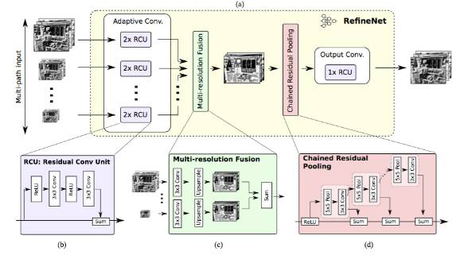
> 
> *RefineNet 模块*
> 
> VOC2012 基准测试分数：
> 
> 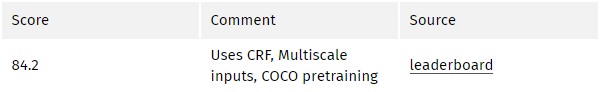
> 
> #### **PSPNet**
> 
> *   金字塔型场景解析网络
>     
>     
>     
> *   2016 年 12 月 4 日提交
>     
>     
>     
> *   arXiv 链接（https://arxiv.org/abs/1612.01105）
>     
>     
>     
> 
> 主要贡献：
> 
> *   提出金字塔池化模块帮助实现背景聚合。
>     
>     
>     
> *   使用辅助损失（auxiliary loss）。
>     
>     
>     
> 
> 相关解释：
> 
> 全局场景分类为分割的类别分布提供线索，因此很重要。金字塔池化模块（Pyramid pooling module）通过应用较大核池化层的获取这些信息。如上文中空洞卷积论文中所述，PSPNet 也使用空洞卷积改善 ResNet，并添加一个金字塔池化模块。该模块将 ResNet 的特征图与并行池化层的上采样输出结果连接起来，其中卷积核核覆盖了图像的全部、一半和小块区域。
> 
> 在 ResNet 的第四阶段之后（即输入到金字塔池化模块），在主分支损失之外又增加了附加损失。这个想法在其他研究中也被称为中间监督（intermediate supervision）。
> 
> 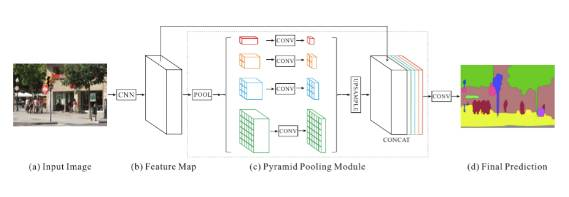
> 
> *PSPNet 架构*
> 
> VOC2012 基准测试分数：
> 
> 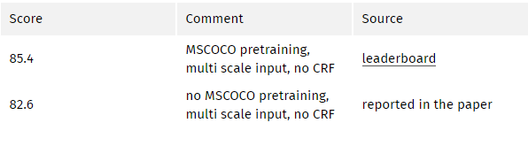
> 
> #### **Large Kernel Matters**
> 
> *   大型核的问题——通过全局卷积网络改善语义分割（Large Kernel Matters -- Improve Semantic Segmentation by Global Convolutional Network）
>     
>     
>     
> *   2017 年 3 月 8 日提交
>     
>     
>     
> *   arXiv 链接（https://arxiv.org/abs/1703.02719）
>     
>     
>     
> 
> 主要贡献：
> 
> 提出使用带有大型卷积核的编码器-解码器结构
> 
> 相关解释：
> 
> 语义分割不仅需要分割，同时还需要对分割目标进行分类。由于分割结构中无法使用全连接层，因此带有大核函数的卷积可以替代全连接层得到应用。
> 
> 使用大型核的另一个原因是，尽管 ResNet 等更深层的网络拥有较大的感受野，但相关研究显示这样的网络更易收集较小范围（即有效感受野）内的信息。大型核的计算成本高昂，且拥有大量参数。因此，k x k 卷积可近似成 1 x k + k x 1、k x 1 和 1 x k。这篇论文中将该模块称为全局卷积网络（GCN）。
> 
> 再来看结构，ResNet（没有空洞卷积）构成该结构的编码器部分，而 GCN 和反卷积构成了解码器部分。该结构还采用了一个叫做边界细化（BR）的简单残差块。
> 
> 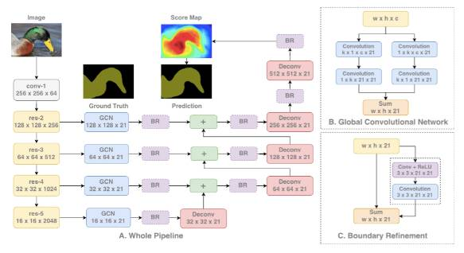
> 
> *GCN 结构*
> 
> VOC2012 测试分数：
> 
> 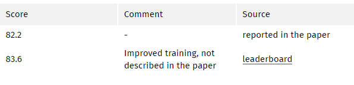
> 
> #### **DeepLab v3**
> 
> *   重新思考使用空洞卷积进行图像语义分割（Rethinking Atrous Convolution for Semantic Image Segmentation）
>     
>     
>     
> *   2017 年 6 月 17 日提交
>     
>     
>     
> *   arXiv 链接（https://arxiv.org/abs/1706.05587）
>     
>     
>     
> 
> 主要贡献：
> 
> *   改进了金字塔型的空洞池化（ASPP）
>     
>     
>     
> *   模型级联了多个空洞卷积
>     
>     
>     
> 
> 相关解释：
> 
> 与 DeepLabv2 和空洞卷积论文一样，该研究也使用空洞/扩张卷积来改进 ResNet 模型。改进后的 ASPP 包括图像层级特征连接、一个 1x1 的卷积和三个 3x3 的不同比率空洞卷积。每一个并行卷积层之后使用批量归一化操作。
> 
> 级联模型是一个 ResNet 模块，但其中的卷积层是不同比率的空洞卷积。该模型与空洞卷积论文中的背景模块相似，但是它直接应用于中间特征图，而不是可信度地图（信念图是通道数与类别数相同的最终 CNN 特征图）。
> 
> 该论文分别评估了这两个已提出的模型。两个模型在 验证集上的性能相似，带有 ASPP 的模型性能稍好，且未使用 CRF。这两个模型优于 DeepLabv2 中最优的模型。论文作者还提到性能的改进来自于批量归一化操作和更好的多尺度背景编码方式。
> 
> 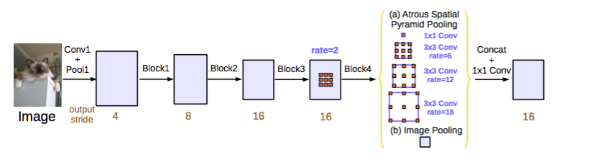
> 
> *DeepLabv3 ASPP*
> 
> VOC2012 测试分数：
> 
> 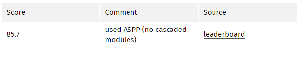
> 
> *原文链接：http://blog.qure.ai/notes/semantic-segmentation-deep-learning-review*
> 
> ******本文为机器之心编译，***转载请联系本公众号获得授权******。***
> 
> ✄------------------------------------------------
> 
> **加入机器之心（全职记者/实习生）：hr@jiqizhixin.com**
> 
> **投稿或寻求报道：editor@jiqizhixin.com**
> 
> **广告&商务合作：bd@jiqizhixin.com**
> 
> **点击阅读原文，查看机器之心官网↓↓↓**