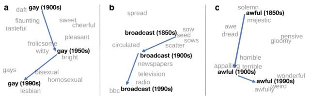

# 学界 | 词嵌入 2017 年进展全面梳理：趋势和未来方向

选自 ruder

**机器之心编译**

**参与：Panda、蒋思源**

> 词嵌入（word embedding）在许多自然语言处理任务中都取得了前所未有的成功，因此它常被视为自然语言处理的万灵药。自然语言处理博士、AYLIEN 研究科学家 Sebastian Ruder 总结了词嵌入在 2017 年已有的进展，并展望了未来的发展方向。

**目录：**

*   子词（subword）级嵌入

*   集外词（OOV）处理

*   评估

*   多感知嵌入

*   不只是将词作为点进行处理

*   短语和多词表达

*   偏见

*   时间维度

*   缺乏理论理解

*   特定于任务和领域的嵌入

*   用于多语言的嵌入

*   基于其它语境的嵌入

基于使用负采样的 skip-gram 的 word2vec 方法（Mikolov et al., 2013）[49] 发表于 2013 年并对这一领域产生了很大影响，这主要是通过其附带的软件包实现的。该软件包可以高效训练密集型词表征，并且可以直接整合到下游模型中。在某些方面，我们已经在此基础上实现了更进一步的发展：词嵌入已然成为了自然语言处理（NLP）模型中必备的部分。但在另一些方面，我们可能和 2013 年时一样，还没有找到能取代原版 word2vec 的其它预训练词嵌入方法。

这篇文章将重点关注词嵌入的缺陷以及最近试图解决它们的方法。如果没有额外说明，本文所讨论的都是预训练之后的词嵌入，即使用 word2vec 及其变体在大型语料库上学习到的词表征。如果没有数以百万计的训练样本可用，预训练过的词嵌入就是最高效的（因此从一个大型的无标注的语料库迁移知识是有用的）。这个结论适用于大多数 NLP 任务。对词嵌入的基础介绍，可以参阅这个系列文章： 

*   [技术 | 词嵌入系列博客 Part1：基于语言建模的词嵌入模型](http://mp.weixin.qq.com/s?__biz=MzA3MzI4MjgzMw==&mid=2650719971&idx=2&sn=c7e0d1f6dd4e9ddce291e9bc2c85c65f&chksm=871b029db06c8b8b7557095989dd3fdb57b86a1d7923c388ca1e74255d07f08992bb0461d958&scene=21#wechat_redirect)

*   [ 技术 | 词嵌入系列博客 Part2：比较语言建模中近似 softmax 的几种方法](http://mp.weixin.qq.com/s?__biz=MzA3MzI4MjgzMw==&mid=2650720050&idx=2&sn=9fedc937d3128462c478ef7911e77687&chksm=871b034cb06c8a5a8db8a10f708c81025fc62084d871ac5d184bab5098cb64e939c1c23a7369&scene=21#wechat_redirect)

*   [技术 | 词嵌入系列博客 Part3：word2vec 的秘密配方](http://mp.weixin.qq.com/s?__biz=MzA3MzI4MjgzMw==&mid=2650720074&idx=2&sn=183fc6285835a48ae7c6bbcce228b063&chksm=871b0334b06c8a22b072f61d4f914210468db7df36a1c6586bd9b6bf3fc6d9f821101d5254c0&scene=21#wechat_redirect)

**子词（subword）级嵌入**

使用子词信息增强的词嵌入已经在很多任务上得到了应用，比如命名实体识别（Lample et al., 2016）[8]、词性标注（Plank et al., 2016）[9]、依存句法分析（Ballesteros et al., 2015; Yu & Vu, 2017）[17, 10] 和语言建模（Kim et al., 2016）[11]。这些模型中大多数都使用了一个 CNN 或 BiLSTM，它们以词的字符为输入，输出基于字符的词表征。

但是，为了将字符信息整合进预训练的嵌入中，字符 n-gram 特征就要表现得比单个字符上的组合函数更加强大（Wieting et al., 2016; Bojanowski et al., 2017）[2, 3]。对文本分类而言，字符 n-gram 并不是一种全新的特征（Cavnar et al., 1994）[1]；而且它也是 Facebook 的 fastText 分类器（Joulin et al., 2016）[4] 的基础。使用 fastText 学习到的嵌入支持 294 种语言。

研究已经发现基于字节对编码（byte-pair encoding）的子词单元对机器翻译任务而言尤为有用（Sennrich et al., 2016）[12]，其中它们已经替代词而成为了标准的输入单元。它们也能被用于带有很多未知词的任务，比如实体输入（entity typing，Heinzerling & Strube, 2017）[13]，但它们在标准的 NLP 任务上还没表现得很有助益。在标准 NLP 任务中，这并不是一个主要问题。尽管它们的学习很容易，但在大多数任务上，我们却难以看到它们相对于基于字符表征的优势（Vania & Lopez, 2017）[50]。

使用集成了字符信息的预训练嵌入的另一个选择是使用在某个大型领域内语料库上训练的当前最佳的语言模型（Jozefowicz et al., 2016）[7]。比如 1 Billion Word Benchmark 就是这样一个大型语料库，地址：https://goo.gl/xtYLUj。尽管我们已经发现语言建模可以用作不同任务的辅助目标（Rei, 2017）[5]，但我们还发现预训练的语言模型嵌入也可用于增强词嵌入（Peters et al., 2017）[6]。随着我们开始对预训练和模型初始化的方式有更好的了解，预训练的语言模型嵌入将会变得更加高效。由于过去几年出现的更好的框架和更多计算资源，它们具有了更好的表现力和更简单的训练方式，甚至有望取代 word2vec 成为初始化词嵌入的首要选择。

**集外词（OOV）处理**

使用预训练的词嵌入的主要问题之一是无法处理集外词（out-of-vocabulary words），即未在训练阶段看见过的词。一般来说，这些词都会被设置为 UNK token 并被分配给同一个向量；如果集外词数量巨大，这种做法就无效了。上一节讨论的子词级嵌入是缓解这个问题的方法之一。另一种方法是将集外词分配给它们预训练的词嵌入（如果有的话），这种方法对阅读理解很有效（Dhingra et al., 2017）[14]。

最近，研究者已经提出了多种在训练中为集外词生成嵌入的方法。Herbelot 和 Baroni (2017) [15] 将集外词的嵌入初始化为它们的上下文词的和，然后再用大学习率快速细化这个集外词嵌入。对于明确需要建模只出现一次的词的数据集而言，他们的方法很成功，但目前还不清楚这种方法能否扩展，从而可靠地用于更典型的 NLP 任务。生成集外词嵌入的另一个有趣方法是训练基于字符的模型以明确地重建预训练的嵌入（Pinter et al., 2017）[16]。尽管这让我们甚至可以为集外词生成嵌入，但使用预训练的嵌入作为中间表征会带来这样的问题：为什么我们不直接为原来的嵌入目标优化一个基于字符的模型呢？

**评估**

预训练的嵌入的评估自始以来一直都是一个存有争议的问题，因为基于词相似性或类比数据集的常用评估方法已经证明仅与下游的表现水平弱相关（Tsvetkov et al., 2015）[21]。ACL 2016 上的 RepEval Workshop 专注于寻找评估预训练的嵌入的更好方法，研究者们似乎已有共识：尽管预训练的嵌入可以基于词相似性等内部任务进行评估名，以便和之前的方法比较，但评估它们的最好方法是在下游任务上的外部评估。

**多义词嵌入**

对词嵌入的一个常见批评是它们无法理解多义词。ACL 2016 的一份教程列出了近几年关注为多义词的多个含义学习分开的嵌入的研究（Neelakantan et al., 2014; Iacobacci et al., 2015; Pilehvar & Collier, 2016）[18, 19, 20]。教程 PDF 地址：https://goo.gl/u1Xc5H。但是，学习多义词嵌入的大多数已有方法都只是评估词的相似性。Pilehvar et al. (2017) [22] 以主题分类作为下游任务获得了最早的研究成果之一；尽管在他们的实验中多义词嵌入的表现优于随机初始化的词嵌入，但预训练的词嵌入却比它们更好。

近几年来，使用词嵌入的神经机器翻译系统已经取得了不俗的成就（Johnson et al., 2016）[23]。有鉴于此，似乎当前一代模型具有足够的表现力来根据语境进行词义消歧，而无需依靠专门的消歧流程或多义词嵌入。但是，我们仍然需要更好的方法来理解我们的模型是否真正足以消除词的歧义以及在必要时该如何改善这种消歧行为。

**不只是将词作为点进行处理**

尽管我们不需要为每个词的每个含义都创建一个单独的嵌入，也能得到很好的下游表现，但将每个词约简成向量空间中的一个点毫无疑问是过于简化了，这会让我们丢失可能对下游任务有用的微妙差别。因此，部署其它能更好地获取这些表征的方法也是一个有趣的研究方向。Vilnis & McCallum (2015) [24] 提出将每个词都建模为一个概率分布，而不是一个点向量，这让我们可以在特定的维度上表征概率质量和不确定性。Athiwaratkun & Wilson (2017) [25] 将这种方法扩展成了一种多模态分布（multimodal distribution），从而可以处理多义词、蕴涵、不确定性，以及提升可解释性。

除了修改表征，也可以修改嵌入空间来更好地表征特定的特征。比如 Nickel 和 Kiela (2017) [52] 通过将词嵌入到一个双曲空间中来学习分层表征。寻找能够集成语言学假设或更好地处理下游任务特性的其它词表征方法是一个引人注目的研究方向。

**短语和多词表达**

除了无法理解多义词，词嵌入也无法获取短语的含义和多词表达——它们可能是其组成词的含义的函数，也可能有完全全新的含义。在原来的 word2vec 论文（Mikolov et al., 2013）[37] 中就已经提出了短语嵌入，而且在学习更好的组合性和非组合性短语嵌入方面也一直都有研究成果出现（Yu & Dredze, 2015; Hashimoto & Tsuruoka, 2016）[38, 39]。但是，与多义词嵌入类似，明确地建模短语至今尚未在下游任务表现上实现显著改善，只会额外增加复杂度。类似地，更好地理解短语在神经网络中的建模方式将让我们有望找到增强模拟能力的方法，从而得到表达的组合性（compositionality）和非组合性特征。

**偏见**

我们模型中的偏见（Bias）正变成一个越来越大的问题，而且我们才刚刚开始理解其对模型的训练和评估的影响。即使在 Google News 文章上训练的词嵌入也表现出了对女性/男性的固有偏见，甚至达到了让人不安的程度（Bolukbasi et al., 2016）[26]。若自然语言处理应用需要开发出公平公正的算法，了解词嵌入会获得哪些偏见并找到更好的移除这些偏见的方法是很关键的。

**时间维度**

言语是时代精神的镜子，它们的含义会随时间而不断变化；当前的词所表达的含义可能与这些词在过去以及未来的含义大不相同。因此，考虑时间维度和词随时间变化的性质是一个有趣的研究方向。这让我们可以揭示出语义变化的规律（Hamilton et al., 2016; Bamler & Mandt, 2017; Dubossarsky et al., 2017）[27, 28, 29]、在时间上建模词类比（word analogy）或相关性（Szymanski, 2017; Rosin et al., 2017）[30, 31] 或获取语义关系的动态规则（Kutuzov et al., 2017）[31]。

**缺乏理论理解**

除了使用 skip-gram 负采样的 word2vec 隐含地分解一个 PMI 矩阵的见解（Levy & Goldberg, 2014）[33]，在对词嵌入空间及其性质的理论理解上的研究还相对较少，例如摘要总结会捕捉类比关系（analogy relations）。Arora et al. (2016) [34] 提出了一种用于词嵌入的新型生成模型，它可以将语料库生成看作是语篇向量（discourse vector）的随机游动（random walk），并会根据类比行为确立一些理论动机。Gittens et al. (2017) [35] 提供了更加透彻的附加组合性的理论证明，并且表明 skip-gram 词向量在信息论方面看是最优的。Mimno & Thompson (2017) [36] 进一步揭示了词嵌入和语境词嵌入之间的有趣关系。尽管增加了这些见解，但我们对词嵌入的位置和性质的理解仍然还很缺乏，也还需要更多理论上的研究工作。

**特定于任务和领域的嵌入**

使用预训练的嵌入的一大重要缺点是：我们用于训练它们的新闻数据往往与我们希望用它们来处理的数据之间存在很大的差异。但是在大多数案例中，我们无法在我们的目标领域中获得数以百万计的文档，没法从头开始得到合适的预训练嵌入。因此我们希望能够调整在大型新闻语料库上预训练的嵌入，以便它们能具备目标领域的特性，同时还能保留所有已有的相关知识。Lu & Zheng (2017) [40] 提出了一种用于学习这种跨领域嵌入的正则化 skip-gram 模型。未来，我们还需要调整预训练嵌入的更好方法，以用于新领域或将多个相关领域的知识集成到一起。

除了适应新领域，我们也可以使用编码在语义词典里的已有知识中与任务相关的信息来增强预训练的嵌入。将这种关系注入嵌入空间的一种有效方法是 retro-fitting（Faruqui et al., 2015）[41]，其最近已经被扩展成一种带有正例负例智能选择的语义特化（semantic specialisation）（Mrkšić et al., 2017）[42]。将附加的预先知识注入词嵌入中是一个重要的研究方向，能让我们的模型更加鲁棒；这些预先知识包括单调性（You et al., 2017）[51]、词相似性（Niebler et al., 2017）[53]、与任务相关的分级或强度、逻辑关系。

**用于多语言的嵌入**

随着 NLP 模型在多种语言上的部署和评估越来越多，创造多语言词嵌入正在变成一个越来越重要的问题，并且在近些年得到的关注也越来越多。使用尽可能少的并行数据开发可以跨语言表征进行学习的方法是一个很有潜力的研究方向。通过这种方法，可以学习资源很少的语言的表征。Ruder et al. (2017) [43] 最近给出了对这一领域的调查。

**基于其它语境的嵌入**

词嵌入通常仅基于周围语境词的窗口而学习得到。Levy & Goldberg (2014) [44] 表明依存关系结构可以用作语境，从而获取更符合句法的词关系；Köhn (2015) [45] 发现这种基于依存关系的嵌入在一种特定的多语言评估方法（根据不同的句法特征对嵌入进行聚类）上表现最佳。

Melamud et al. (2016) [46] 观察到在不同的下游任务上表现好语境类型也不同，而且简单地将使用不同语境类型学习到的词嵌入连接在一起就能进一步提升表现水平。近来在多种不同的任务上，将图（graph）结构集成到神经模型中的方法都取得了成功；比如图卷积神经网络（graph-convolutional neural networks; Bastings et al., 2017; Marcheggiani & Titov, 2017）[47, 48]。有鉴于此，我们可以推测将这种结构用于为下游任务学习嵌入也可能带来帮助。

**总结**

从将词嵌入应用于每种可能的问题到对它们获取更有原理性的、差异微妙的和实用的理解，我们这个社区正在不断进步。这篇文章的目的是强调一些我认为最吸引人的学习词嵌入上的当前趋势和未来方向。毫无疑问，我没法全面囊括许多其它同样重要和值得关注的领域。你认为词嵌入的哪个方面最为激动人心或还未被探索？

*原文链接：**http://ruder.io/word-embeddings-2017/index.html*

****本文为机器之心编译，**转载请联系本公众号获得授权****。**

✄------------------------------------------------

**加入机器之心（全职记者/实习生）：hr@jiqizhixin.com**

**投稿或寻求报道：content@jiqizhixin.com**

**广告&商务合作：bd@jiqizhixin.com**