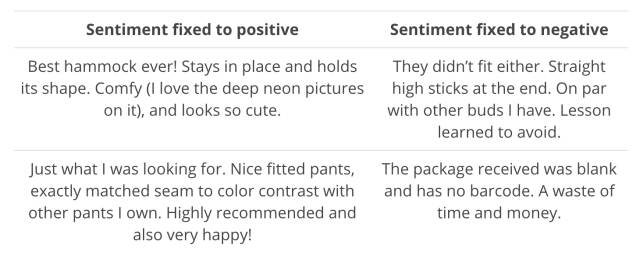

# 深度 | 一文概述 2017 年深度学习 NLP 重大进展与趋势

选自 tryolabs

**机器之心编译**

**参与：路雪、黄小天、蒋思源**

> 作者通过本文概述了 2017 年深度学习技术在 NLP 领域带来的进步，以及未来的发展趋势，并与大家分享了这一年中作者最喜欢的研究。2017 年是 NLP 领域的重要一年，深度学习获得广泛应用，并且这一趋势还会持续下去。

近年来，深度学习（DL）架构和算法在图像识别、语音处理等领域实现了很大的进展。而深度学习在自然语言处理方面的表现最初并没有那么起眼，不过现在我们可以看到深度学习对 NLP 的贡献，在很多常见的 NLP 任务中取得了顶尖的结果，如命名实体识别（NER）、词性标注（POS tagging）或情感分析，在这些任务中神经网络模型优于传统方法。而机器翻译的进步或许是最显著的。

本文，我将概述 2017 年深度学习技术在 NLP 领域带来的进步。可能会有遗漏，毕竟涵盖所有论文、框架和工具难度太大。我想和大家分享这一年我最喜欢的一些研究。我认为 2017 年是 NLP 领域的重要一年。深度学习在 NLP 中的应用变得广泛，在很多分支取得了傲人的成绩，所有这些都说明这个趋势不会停止。

**从训练 word2vec 到使用预训练模型**

可以说，词嵌入是用于自然语言处理（NLP）的最广为人知的深度学习（DL）技术。它遵循由 Harris（1954）提出的分布式假设，根据该假设，具有相似含义的词通常出现在相似语境中。如想详细了解词嵌入，推荐阅读 Gabriel Mordecki 的文章：《Word embeddings: how to transform text into numbers》（https://monkeylearn.com/blog/word-embeddings-transform-text-numbers/）。

*词的分布式向量示例（图像来源：https://arxiv.org/abs/1708.02709）。*

word2vec（Mikolov et al., 2013）和 GloVe（Pennington et al., 2014）是该领域的先驱性算法，尽管它们无法被称为 DL（word2vec 中的神经网络是浅层的，GloVe 实现了一种计数方法），但借助它们进行训练的模型通常用作深度学习 NLP 方法的输入数据。它的效果很好，因此越来越多的人开始使用词嵌入。

最初，对于一个需要词嵌入的 NLP 问题，我们倾向于利用与领域相关的大型语料库训练自己的模型。当然，这不是推进词嵌入广泛使用的最佳方式，因此人们开始慢慢转向预训练模型。通过在维基百科、推特、谷歌新闻、网页抓取内容等上面进行训练，这些模型可以轻松地把词嵌入整合到 DL 算法中。

今年证实，预训练词嵌入模型仍然是 NLP 中的核心问题。比如来自 Facebook 人工智能实验室（FAIR）的 fastText 发布了 294 种语言的预训练向量，对社区做出了重大贡献。除了大量的语言，fastText 这一举措的有用之处在于其使用字符 n 元作为特征。这使得 fastText 避免了 OOV（out of vocabulary）问题，因为即使非常罕见的词（比如特定领域的术语）也很可能与常见词共享字符 n 元。在这个意义上，fastText 要比 word2vec 和 GloVe 表现更好，并且它在小数据集上的表现也要优于二者。

然而，尽管我们看到一些进展，这一领域中仍有很多事情要做。比如，NLP 框架 spaCy 通过整合词嵌入和 DL 模型以本地方式完成诸如命名实体识别（NER）和依存句法分析（Dependency Parsing）等任务，允许用户更新模型或使用他们自己的模型。

我认为这就是趋势。未来将会有针对特定领域（比如生物、文学、经济等）、易于在 NLP 框架中使用的预训练模型。就我们的使用情况来说，锦上添花的事情就是以尽可能简单的方式调整它们。与此同时，现在开始出现适应词嵌入的方法。

**使用通用嵌入适应特定用例**

也许使用预训练词嵌入的主要缺点是训练数据和真实数据之间存在词分布式差距。假设你有一个生物学论文、食谱或者经济学研究论文的语料库。由于你很可能没有一个足够大的语料库训练好的嵌入，所以通用词嵌入可能帮助你提升结果。但是如果你能使通用嵌入适应你的特定用例呢？

在 NLP 中此类适应通常被称为跨域或域适应技术，并且非常接近迁移学习。Yang et al. 今年提出了一个非常有趣的工作，在给定源域嵌入的情况下，他们展示了一个正则化的 skip-gram 模型来学习目标域的词嵌入。

其核心思想简单却有效。想象一下如果我们知道源域中词 w 的词嵌入为 w_sws。为了计算 w_twt（目标域）的嵌入，研究者将两个域之间的特定迁移量添加到 w_sws。基本上，如果词频繁出现在两个域中，这意味着其语义并不依赖于域。这种情况下，迁移量很大，在两个域中产生的嵌入可能相似。但是如果特定域的词在一个域中出现的频率比另一个域频繁得多，则迁移量小。

该词嵌入研究主题还未被广泛探索，我认为在不久的将来它将获得更多关注。

**情感分析不可思议的「副作用」**

青霉素、X 光甚至邮件都是意料之外的发现。今年，Radford et al. 发现训练模型中的单个神经元具有高度可预测的情感值，并探索了字节级的循环语言模型属性，旨在预测亚马逊评论文本中的下一个字符。是的，这一单个「情感神经元」能够相当精确地区分消极和积极的评论。

*评论极性 vs 神经元值（图像来源：https://blog.openai.com/unsupervised-sentiment-neuron/）。*

注意到这个行为之后，Radford 等人决定在 Stanford Sentiment Treebank 上测试该模型，测试结果显示其精确度高达 91.8%，而之前的最优结果是 90.2%。这意味着通过显著减少实例的使用，他们以无监督方式训练的模型至少在一个特定但经过广泛研究的数据集上取得了当前最佳的情感分析结果。

**运转中的情感神经元**

由于模型在字符级别上起作用，因此神经元为文本中的每个字符改变状态，其工作方式看起来相当惊人。

*情感神经元的行为（图像来源：https://blog.openai.com/unsupervised-sentiment-neuron/）。*

比如，在词 best 之后，神经元值呈现为强积极；但是词 horrendous 出现时，神经元值的状态完全相反。

**生成极性（polarity）有偏文本**

当然，已训练模型仍然是有效的生成模型，因此它能用于生成类似 Amazon 评论的文本。但我发现你可以简单地重写情感神经元的值，从而选择生成文本的情感级性（积极或消极）。

*生成文本示例（图像来源：https://blog.openai.com/unsupervised-sentiment-neuron/）。*

Radford 等人选择的神经网络模型是 Krause 等人在 2016 年提出的 multiplicative LSTM，选择原因是他们观察到在给定超参数设置情况下，multiplicative LSTM 的收敛速度比一般的 LSTM 快。该模型有 4096 个单元，且在 8200 万亚马逊评论语料库中进行训练。

**推特上的情感分析**

无论是获取客户对企业品牌的评价、分析营销活动的影响还是民意调查，Twitter 上的情感分析都是非常强大的工具。

*特朗普和希拉里在 Twitter 上的情感分析（图像来源：https://monkeylearn.com/blog/donald-trump-vs-hillary-clinton-sentiment-analysis-twitter-mentions/）。*

**SemEval 2017**

Twitter 中的情感分析不仅已经引起了 NLP 研究者的关注，同时还引起了政治和社会科学的关注。这就是为什么自 2013 年以来，SemEval 比赛设置了推特情感分析任务。

今年共有 48 支队伍参加了该任务，表明人们对推特情感分析的关注程度。为了说明 SemEval 比赛中推特情感分析的内容，下面我们看一下该竞赛今年的子任务：

2.  子任务 B：给定一篇推文和一个主题，区分推文传递到该主题的情感是积极还是消极。

3.  子任务 C：给定一篇推文与一个主题，区分推文传递到该主题的情感是强积极、弱积极、中性、弱消极还是强消极。

4.  子任务 D：给定关于相同主题的一组推文，评估这组推文在积极和消极之间的分布。

5.  子任务 E：给定关于相同主题的一组推文，评估这组推文在强积极、弱积极、中性、弱消极和强消极之间的分布。

其中子任务 A 是最常见的情感分析任务，有 38 支团队参与了该任务，但其它几个任务更具挑战性。组织方表明深度学习方法的使用十分突出且得到持续的提升，今年有 20 支队伍采用了 CNN 和 LSTM 等深度学习模型。此外，虽然 SVM 模型仍然非常流行，但很多参赛者将它们与神经网络方法结合起来，或使用词嵌入特征。

**BB_twtr 系统**

我发现今年令人印象深刻的是一个纯 DL 系统 BB_twtr 系统（Cliche, 2017），该系统在英语任务的 5 个子任务中名列第一。该系统的作者将 10 个 CNN 与 10 个双向 LSTM（biLSTM）结合起来，并使用不同的超参数和预训练策略进行训练。

为了训练这样的模型，作者使用人工标注的推文（子任务 A 就有 49693 篇样本），构建包含 1 亿篇推文的无标注数据集，作者通过表情符号将推文简单地标注为积极情感或消极情感，从中抽取出一个隔离的数据集。为了将预训练的词嵌入作为 CNN 和双向 LSTM 的输入，作者在未标记的数据集上使用 word2vec、GloVe 和 fastText（全部使用默认设置）等方法构建词嵌入。然后他使用前面隔离数据集提炼词嵌入以添加积极和消极信息，最后再使用人工标注的数据集对他们再次进行提炼。

之前使用 SemEval 数据集的经验表明使用 GloVe 会降低性能，并且对所有的标准数据集并没有唯一的最优模型。因此作者用软投票策略将所有模型结合起来，由此产生的模型比 2014 和 2016 年的历史最好成绩都要好。

即使这种组合不是以一种有机的方式进行，但这种简单的软投票策略已经证明了模型的高效性，因此这项工作表明了将结合 DL 模型的潜力，以及端到端的方法在推特情感分析任务中的性能优于监督方法。

**令人兴奋的抽象摘要系统**

自动摘要和机器翻译一样是 NLP 任务。自动摘要系统有两个主要的方法：抽取式——从源文本中抽取最重要的部分来创建摘要；生成式——通过生成文本来创建摘要。从历史角度来看，抽取式自动摘要方法最常用，因为它的简洁性优于生成式自动摘要方法。

近年来，基于 RNN 的模型在文本生成领域获得了惊人成绩。它们在短输入和输出文本上效果非常好，但对长文本的处理不太好，不连贯且会重复。Paulus et al. 在论文中提出一种新的神经网络模型来克服该局限。结果很好，如下图所示。

*自动摘要生成模型图示（图片来源：https://einstein.ai/research/your-tldr-by-an-ai-a-deep-reinforced-model-for-abstractive-summarization）。*

Paulus et al. 使用 biLSTM 编码器读取输入，使用 LSTM 解码器生成输出。他们的主要贡献是一种新的注意力内策略（intra-attention strategy），分别关注输入和持续生成的输出；和一种新的训练方法，将标准监督式词预测和强化学习结合起来。

**注意力内策略**

目标是避免重复输出。研究者在解码时使用时间注意力（temporal attention），以查看输入文本之前的 segments，从而确定接下来要生成的单词。这强制模型在生成过程中使用输入的不同部分。他们还让模型评估解码器中之前的隐藏状态。然后结合这两个功能选择输出摘要中最适合的单词。

**强化学习**

创建摘要的时候，两个人会使用不同的单词和句子顺序，两个摘要可能都是有效的。因此，好的摘要的词序未必要匹配训练数据集中的顺序。基于此，论文作者没有使用标准的 teacher forcing 算法，该算法可使每个解码步（即每个生成单词）的损失最小化；而是使用强化学习策略，这被证明是一个很棒的选择。

**几乎端到端模型的结果**

该模型在 CNN／Daily Mail dataset 上进行测试，获得了当前最佳结果。此外，人类评估员参与的特定实验证明人类的阅读能力和质量也有提升。在基础的预处理后能够取得这样的结果非常惊人，预处理包括：输入文本标记化、小写，数字用 0 代替，移除数据集中的某些实体。

**迈向完全无监督机器翻译的第一步**

双语词典构建，即使用源语言和目标语言的单语语料库获取两种语言词向量之间的映射关系，是一个古老的 NLP 任务。自动构建双语词典在信息检索、统计机器翻译等 NLP 任务中起到一定作用。但是，这种方法主要依赖于初始的双语词典，而这种词典通常不容易获取或构建。

随着词嵌入的成功，跨语言词嵌入出现，其目标是对齐嵌入空间而不是词典。不幸的是，这种方法仍然依赖于双语词典或平行语料库。Conneau et al.（2018）在论文中呈现了一种很有前景的方法，该方法不依赖于任何特定资源，且在多个语言对的词翻译、句子翻译检索和跨语言词汇相似度任务上优于顶尖的监督方法。

该方法将在单语数据上分别训练的两种语言的词嵌入集作为输入，然后学习二者之间的映射，以使共享空间中的翻译结果较为接近。他们使用的是用 fastText 在 Wikipedia 文档上训练的无监督词向量。下图展示了其关键想法：

*构建两个词嵌入空间之间的映射（图像来源：https://arxiv.org/pdf/1710.04087.pdf）。红色的 X 分布是英语单词的词嵌入，蓝色的 Y 分布是意大利单词的词嵌入。*

首先，他们使用对抗学习学习旋转矩阵 W，W 执行第一次原始对齐（raw alignment）。他们基本上按照 Goodfellow et al.（2014）的 proposition 训练生成对抗网络（GAN）。如想对 GAN 的工作原理有直观了解，推荐阅读 https://tryolabs.com/blog/2016/12/06/major-advancements-deep-learning-2016/。

为了使用对抗学习来建模问题，他们使判别器具备决定作用，从 WX 和 Y 中随机采样一些元素（见上图第二列），两种语言分属于 WX 和 Y。然后，他们训练 W 阻止判别器做出准确预测。在我看来，这种做法非常聪明、优雅，直接结果也很不错。

之后，他们用两步重新定义映射。一步用来避免罕见词引入映射计算中的噪声，另一步主要使用学得的映射和距离测量（distance measure）来构建实际的翻译结果。

这种方法在一些案例中的结果非常好，比如在英语-意大利语词翻译中，在 P@10 中，该方法在 1500 个源单词上的准确率比最优平均准确率高将近 17%。

*英语-意大利语词翻译平均准确率（图像来源：https://arxiv.org/pdf/1710.04087.pdf）。*

Conneau 等人称他们的方法是通向无监督机器翻译的第一步。如果真的是这样，那就太棒了。这种新方法能走多远，让我们拭目以待。

**专用框架和工具**

现有大量通用 DL 框架和工具，其中一些得到广泛应用，如 TensorFlow、Keras 和 PyTorch。但是，专门用于 NLP 的开源 DL 框架和工具出现了。2017 年对我们来说是重要一年，因为很多有用的开源框架对社区开放。其中有三个尤其引起了我的注意，你或许也会觉得有趣。

**AllenNLP**

AllenNLP 框架是基于 PyTorch 构建的平台，可以在语义 NLP 任务中轻松使用 DL 方法。其目标是允许研究者设计和评估新模型。该框架包括语义角色标注、文字蕴涵和共指消解等常见语义 NLP 任务的模型参考实现。

**ParlAI**

ParlAI 框架是一个用于对话研究的开源软件平台。它使用 Python 实现，目标是提供用于共享、训练和测试对话模型的统一框架。ParlAI 提供与亚马逊土耳其机器人轻松集成的机制，它还提供该领域常用数据集，支持多个模型，包括记忆网络、seq2seq 和注意力 LSTM 等神经网络模型。

**OpenNMT**

OpenNMT 工具包是专用于序列到序列模型的通用框架，可用于执行机器翻译、摘要、图像到文本和语音识别等任务。

**结语**

不可否认，用于解决 NLP 问题的 DL 技术持续发展。一个重要指标就是近年深度学习论文在重要的 NLP 会议如 ACL、EMNLP、EACL、NAACL 上的比例。

*深度学习论文在 NLP 会议论文中的比例（图像来源：https://arxiv.org/abs/1708.02709）。*

但是，有关端到端学习的研究才刚刚开始。我们仍然通过处理一些经典的 NLP 任务来准备数据集，如清洗、标记化（tokenization）或部分实体统一化（如 URL、数字、电子邮箱地址等）。我们还使用通用嵌入，缺点是它们无法捕捉特定领域术语的重要性，且对多词表达的处理效果不好，这是我在过去项目中多次发现的重要问题。

2017 年是深度学习应用到 NLP 的伟大一年。我希望 2018 年能够出现更多端到端学习方面的研究以及专门的开源框架变的更加完善。

**扩展阅读**

*   From Characters to Understanding Natural Language (C2NLU): Robust End-to-End Deep Learning for NLP，Blunsom et al.（2017）：http://drops.dagstuhl.de/opus/volltexte/2017/7248/pdf/dagrep_v007_i001_p129_s17042.pdf

*   模型对比：Comparative Study of CNN and RNN for Natural Language Processing，Yin et al.（2017）：https://arxiv.org/pdf/1702.01923.pdf

*   GAN 工作原理：The major advancements in Deep Learning in 2016，Pablo Soto：https://tryolabs.com/blog/2016/12/06/major-advancements-deep-learning-2016/

*   词嵌入详解：Word embeddings: how to transform text into numbers，Gabriel Mordecki：https://monkeylearn.com/blog/word-embeddings-transform-text-numbers/

*   Word embeddings in 2017: Trends and future directions，Sebastian Ruder：http://ruder.io/word-embeddings-2017/

**参考文献**

*   BB_twtr at SemEval-2017 Task 4: Twitter Sentiment Analysis with CNNs and LSTMs Mathieu Cliche (2017)

*   Word Translation without Parallel Data Alexis Conneau, Guillaume Lample, Marc』Aurelio Ranzato, Ludovic Denoyer, Hervé Jégou (2018)

*   Generative adversarial nets Ian Goodfellow, Jean Pouget-Abadie, Mehdi Mirza, Bing Xu, David Warde-Farley, Sherjil Ozair, Aaron Courville and Yoshua Bengio (2014)

*   Distributional structure Zellig Harris (1954)

*   OpenNMT: Open-source toolkit for neural machine translation Guillaume Klein, Yoon Kim, Yuntian Deng, Jean Senellart and Alexander M Rush. (2017)

*   Multiplicative lstm for sequence modelling Ben Krause, Liang Lu, Iain Murray and Steve Renals (2016)

*   Parlai: A dialog research software platform Alexander H Miller, Will Feng, Adam Fisch, Jiasen Lu, Dhruv Batra, Antoine Bordes, Devi Parikh and Jason Weston (2017)

*   Linguistic Regularities in Continuous Space Word Representations Tomas Mikolov, Scott Wen-tau Yih and Geoffrey Zweig (2013)

*   Glove: Global vectors for word representation Jeffrey Pennington, Richard Socher and Christopher D. Manning (2014)

*   Learning to Generate Reviews and Discovering Sentiment Alec Radford, Rafal Jozefowicz and Ilya Sutskever (2017)

*   A Simple Regularization-based Algorithm for Learning Cross-Domain Word Embeddings Wei Yang, Wei Lu, Vincent Zheng (2017)

*   Comparative study of CNN and RNN for Natural Language ProcessingWenpeng Yin, Katharina Kann, Mo Yu and Hinrich Schütze (2017)

*   Recent Trends in Deep Learning Based Natural Language Processing Tom Younga, Devamanyu Hazarikab, Soujanya Poriac and Erik Cambriad (2017)

*原文链接：https://tryolabs.com/blog/2017/12/12/deep-learning-for-nlp-advancements-and-trends-in-2017/*

****本文为机器之心编译，**转载请联系本公众号获得授权****。**

✄------------------------------------------------

**加入机器之心（全职记者/实习生）：hr@jiqizhixin.com**

**投稿或寻求报道：content@jiqizhixin.com**

**广告&商务合作：bd@jiqizhixin.com**