# 学界 | 一文综述所有用于推荐系统的深度学习方法

选自 arXiv

**机器之心编译**

**参与：Smith、黄小天**

> 在信息泛滥的时代，如何快速高效地萃取出有价值信息成为人们的当务之急，传统的推荐系统由此应运而生；而在诸多领域硕果累累的深度学习也被应用于推荐系统，为后者注入新的动力。机器之心编译的这篇论文，对深度学习在推荐系统中的应用现状作了综述性调研，以期进一步推动推荐系统研究的进展；对于发现的新问题，文中也给出了潜在的解决方案。

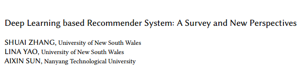

原文链接：https://arxiv.org/pdf/1707.07435.pdf

摘要：随着线上信息的体量、复杂度和动态性的不断增长，推荐系统已经成为了一种可以有效解决这种信息过载问题的关键性解决方案。近几年，深度学习的革命性进步在语音识别、图像分析和自然语言处理方面都受到了广泛关注。与此同时，近期的一些研究也说明了深度学习在处理信息检索和推荐任务中的有效性。由于其一流的性能表现和高质量的推荐结果，将深度学习应用于推荐系统已经获得了动力。与传统推荐模型相比，深度学习可以更好的理解用户需求、项目特征及其之间的历史性互动。

本文旨在为近期推动推荐系统研究的基于深度学习的推荐方法提供一份综述评论。同时提出一种基于深度学习推荐模型的分类体系（taxonomy），用于对那些被调查的文章进行分类。在分析回顾相关工作成果的基础上我们发现了尚待解决的问题，潜在的解决方案也将被讨论。

二维分类方法与定性分析：

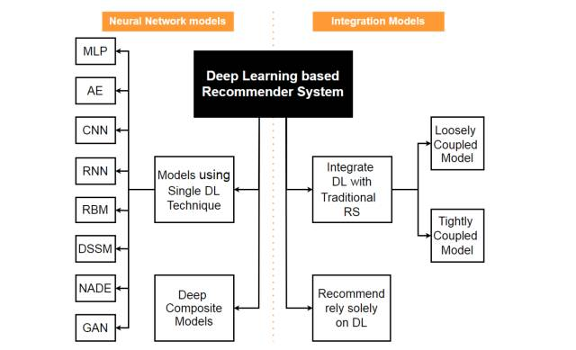

*图 1：基于深度学习的推荐系统分类的二维体系，左侧部分对神经网络模型进行了说明，右侧部分则说明了整合模型。*

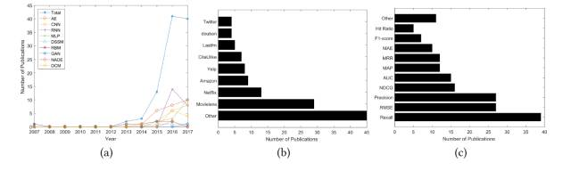

*图 2：（a）使用的数据集；（b）使用的评测指标；（c）最有影响力的工作。*

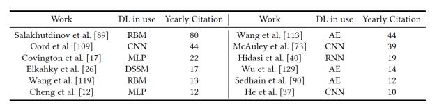

*表 2：年引用次数超过 10 次的最具影响力论文。*

 **应用领域：

*表 3：特定应用领域的推荐模型。*

**1\. 基于多层感知机（Multilayers Perception）的推荐系统**

多层感知机是简明且有效的模型。它广泛应用于很多领域，尤其是工业界。多层前馈网络能够让任意的可测函数接近任意的期望精度。它也是很多高级模型的基础。

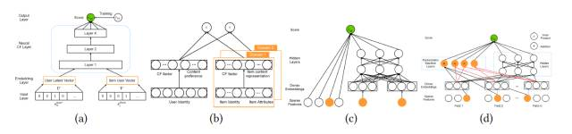

*图 3：（a）神经协同过滤；（b）CCCFNet；（c）宽度&深度学习；（d）DeepFM。*

**2.基于自编码器（Autoencoders）的推荐系统**

将自编码器应用于推荐系统一般有两种常用方式：（1）使用自编码器在瓶颈层（bottleneck layer）来学习低维度特征表征；或者（2）直接在重构层填充评分矩阵的空白处。

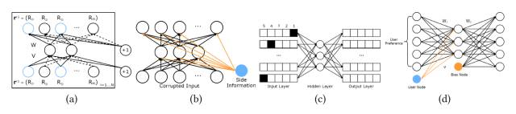

*图 4：（a）I-AutoRec；（b）CFN；（c）ACF；（d）CDAE。*

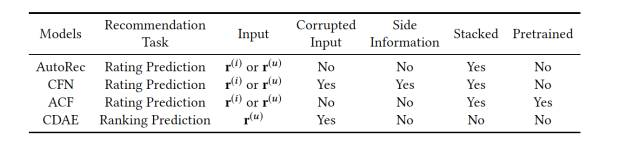

*表 4：5 个基于自编码器的推荐模型之间的对比。*

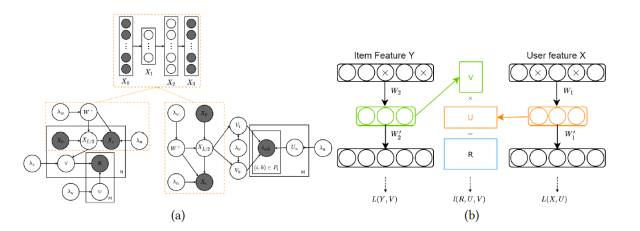

*图 5：（a）协同深度学习（左）与协同深度排序（右）的图模型；（b）深度协同过滤框架。*

**3.基于卷积神经网络（CNN）的推荐系统**

此种系统中的卷积神经网络大多是用于特征提取（ feature extraction）的。

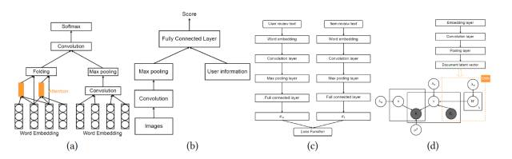

*图 6：（a）基于 Attention 的 CNN；（b）个性化 CNN 标签推荐；（c）DeepCoNN；（d）ConvMF。*

**4.基于循环神经网络（RNN）的推荐系统**

循环神经网络特别适用于处理推荐系统中的评级和序列特征的时序动态。

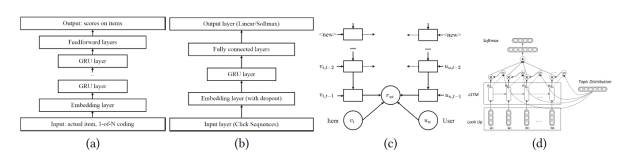

*图 7：（a）借助 RNN 的 Session 推荐；（b）借助 RNN 的完善的 Session 推荐；（c）循环推荐网络；（d）用于标签推荐的基于 Attention 的 RNN。*

**5.基于深度语义相似性模型（Deep Semantic Similarity Model）的推荐系统**

深度语义相似性模型（DSSM）是一种广泛应用于信息检索领域的深度神经网络。它非常适用于排行榜（top-n）推荐。基础型 DSSM 由 MLP 组成，更高级的神经层比如卷积层和最大池化（max-pooling ）层可以被很容易地添加进去。

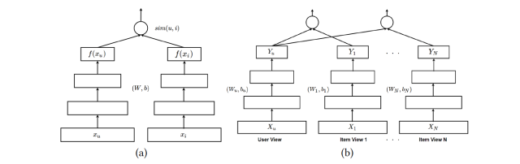

*图 8：（a）基于深度语义相似性的个性化推荐；（b）多视角深度神经网络。*

**6\. 基于受限玻尔兹曼机（Restricted Boltzmann machine）的推荐系统**

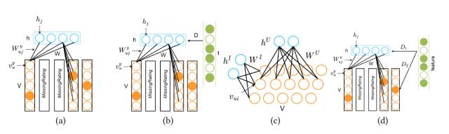

*图 9：（a）RBM-CF；（b）带有隐式反馈的条件性 RBM-CF；（c）基于用户和基于项目的 RBM-CF 的组合；（d）混合 RBM-CF。*

**7.新兴方法：NADE 和 GAN**

NADE 提出了一种易于处理的方法，以对源数据的真实分布进行近似计算，并且可以在几个试验性数据集中产生最一流的推荐精度（与其它基于深度学习的推荐模型相比）。生成对抗网络（GAN）能够将判别模型和生成模型相融合，并且充分利用二者的优点。

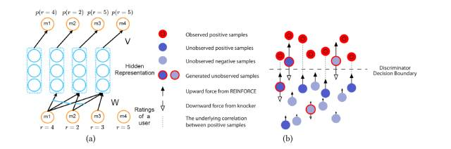

*图 10：（a）基于神经自回归的推荐系统；（b）IRGAN。*

**8\. 用于推荐系统的深度复合网络（Deep composite models）**

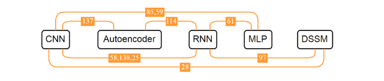

*图 11：现有的深度复合模型。*

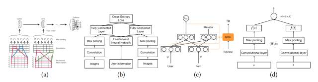

*图 12：（a）CNN 和 RNN 的引用推荐；（b）比较性深度学习模型；（c）NRT；（d）带有 CNN 的深度语义相似性模型（DSSM）*******************

******本文为机器之心编译，***转载请联系本公众号获得授权******。***

✄------------------------------------------------

**加入机器之心（全职记者/实习生）：hr@jiqizhixin.com**

**投稿或寻求报道：editor@jiqizhixin.com**

**广告&商务合作：bd@jiqizhixin.com****