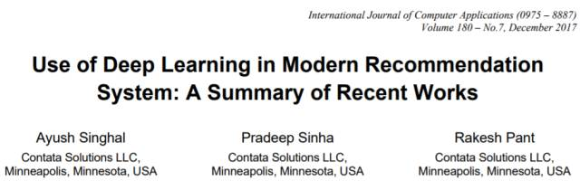
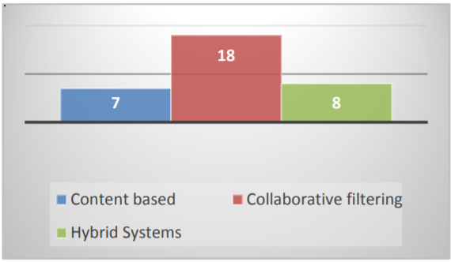
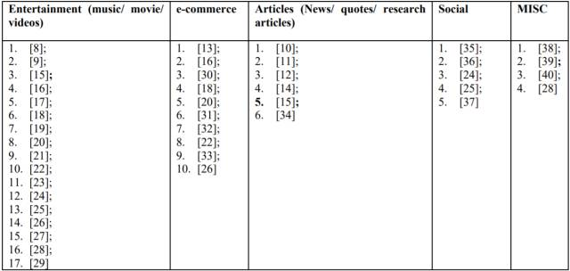

# 使用深度学习构建先进推荐系统：近期 33 篇重要研究概述

选自 arXiv

**作者：Ayush Singhal、Pradeep Sinha、Rakesh Pant**

**机器之心编译**

> 除了计算机视觉和自然语言处理，深度学习近年来在推荐系统上也取得了引人关注的结果。事实上，Spotify、Netflix、Facebook、谷歌等公司早已对深度学习推荐系统有过深入研究，并在实际应用中取得了很好的效果。来自 Contata Solutions 的研究人员发表在 IJCA 上的概述论文对这些研究进行了梳理。

**论文：Use of Deep Learning in Modern Recommendation System: A Summary of Recent Works**

论文链接：https://arxiv.org/abs/1712.07525

**摘要**：随着互联网中数字信息数量的增长，在线商店、在线音乐、视频和图片库、搜索引擎和推荐系统已成为人们快速寻找信息的主要方式。近一段时间，深度学习的发展在语音识别、图像处理和自然语言处理领域取得了很多成果。此外，深度学习在推荐系统和信息检索领域里也得到应用。本文介绍了深度学习技术在推荐系统中的近期进展。全文从三部分来介绍：协作系统（Collaborative system）、基于内容的系统和混合系统。本文还讨论了结合了深度学习的推荐系统对多个应用领域的贡献，讨论了推荐系统中的深度学习对不同领域的影响和深度学习是否显著改善传统的推荐系统。最后，本文根据深度学习在推荐系统中的应用现状对未来的研究方向提供一些见解。

**1\. 引言**

我们的日常需求，从商品、书籍、新文章、歌、电影、研究文件和其他基础性事物，其数量和种类填满了多个数据仓库和数据库 [1-2]。为此，智能推荐系统和强大的搜索引擎为用户提供援助之手。此类系统的流行程度和有用性在于它们能够便捷地显示几乎无限的物品信息 [3]。因此 Amazon、Netflix 等推荐系统尝试了解用户兴趣，并把用户感兴趣的商品告知他们。尽管这些系统由于使用场景而各不相同，但其寻找用户感兴趣商品的核心机制都是用户兴趣与商品匹配的机制 [4]。

通常可以根据用户偏好、商品特征、用户-商品交易和其他环境因素（如时间、季节、位置等）生成推荐结果。推荐系统的相关文献把它们分成三类：协同过滤（仅使用用户与商品的交互信息生成推荐）系统、基于内容（利用用户偏好和／或商品偏好）的系统和混合推荐模型（使用交互信息、用户和商品的元数据）[5]。这些类别中的模型都有局限性，如数据稀疏性、用户和商品的冷启动 [6]。

近期，深度学习给计算机视觉、语音识别等不同应用领域带来了大量进展，深度学习也扩展至信息检索和推荐系统中 [7]。对将深度学习整合进推荐系统的通常看法是显著优于传统模型。本文对整合深度学习的推荐系统相关研究进行了一个系统性总结，便于读者理解利用深度学习构建推荐系统的未来发展、影响力和方向。

**2\. 方法**

本节介绍本文收集、挑选和总结研究论文的方法。我们使用谷歌学术搜索引擎，从大量研究论文中选择相关论文；使用以下关键词提取文章：「recommender system deep learning」、「collaborative filtering deep learning」、「recurrent neural network recommender systems」；将时间设置为「Since 2013」，这样我们就可以只选近 5 年的文章。通过在谷歌学术执行每个搜索请求，我们得到了多篇文章，然后我们通过浏览论文题目进行了一次手动选择，以了解它们是否确实关于推荐系统中的深度学习。手动选择后，一共筛选出 33 篇文章。之后，我们综述了每篇文章中用于提升推荐模型的深度学习方法，并了解验证所用的不同数据集。

**3\. 综述和讨论**

图 1 总结了 33 篇论文中与每种模型相关的论文数量，发现大部分近期论文关于协同过滤推荐系统。下一节将讨论它使用的深度学习方法，并简要讨论深度学习如何提升传统推荐模型。

 **

*图 1：三种推荐系统相关的论文数量分布。*

**基于内容的推荐系统**

本节概述多篇关于基于内容的推荐系统的论文中深度学习的贡献。

[8] 在无使用数据的情况下，使用深层卷积神经网络利用音频生成歌曲的潜在因子。该方法优于简单的基线模型，如线性回归、使用 Million Song 数据集和词袋表征训练的多层感知机（该数据集包括 Last.fm 数据集和 Echo Nest Taste Profile 子数据集）。

[9] 提出一种结合深度信念网络和概率图模型的模型，从音频内容中同时学习特征和制定个性化推荐。该论文使用 Echo Nest Taste Profile Subset（一个音乐推荐数据集）比较该模型和基于内容和模型、未使用深度学习的混合模型。结果显示该模型在验证数据集上的性能优于基于内容的基线模型和协同过滤基线模型。

[10][11] 提出深度学习方法用于提升文本和对话中引用推荐领域的基于内容的推荐系统。Tan et al 使用 LSTM 展示语境和引用的分布式意义。Lee et al 结合循环神经网络和卷积神经网络来学习对话线程中引用的语义表征。Wikiquotes 和 Oxford Concise Dictionary of Proverbs 作为推特对话线程的引用来源。

[12] 利用基于 GPU 的循环神经网络将条目文本（item text）转换为隐藏特征来提高专门用于冷启动的协同过滤性能。研究人员使用该模型在 CiteULike 的两个现实世界数据集（密集和稀疏版本）上对引文推荐系统进行了测试，与协同主题建模模型进行了比较。在两个数据集上，该方法都有显著的性能优势。

[13] 使用评论信息在深度神经网络上进行条目属性与用户习惯的联合学习，这被称为深度合作神经网络（Deep Cooperative Neural Network）。该模型还使用共享层将条目特征与用户习惯进行结合。模型对比了 5 个基准，分别是矩阵分解、概率矩阵分解、LDA、协同主题回归、Hidden Factor as Topic 以及合作深度学习，研究者在三个现实世界数据集上对它们进行评测（Yelp 评论、亚马逊评论、Beer 评论）。该模型在所有测试中都超过了其他基线模型。

[14] 开发了一种新型文章推荐模型——使用动态注意力机制深度模型处理编辑为终端用户文章池选择新闻文章时的非显式选择标准问题。该新闻推荐阶段是最终新闻推荐之前的一个步骤。在这个阶段中，编辑需要从一个动态变化的文章池里（包含不同新闻源）选择出新闻文章的一个子集。编辑选择或放弃文章没有硬性标准。该研究使用深度学习来学习编辑选择文章风格的动态标准。这种问题不能直接使用传统的词袋方法来解决。所以，深度学习注意力机制模型被引入，用于生成复杂特征来表示文章的风格，随后以编辑是否喜欢为标准进行分类。

**基于协同过滤的系统**

在本节中，我们总结了深度学习对协同过滤推荐系统的主要贡献。其中大多数方法都在尝试使用一些深度神经网络代替矩阵分解。

[15] 解决了 CF 方法的稀疏性问题和协同主题回归（Collaborative topic regression）方法的辅助信息稀疏性问题。该模型使用了贝叶斯堆叠去噪自编码。研究者在 CiteULike 数据集和 Netflix 数据集上对该模型和矩阵分解、协同主题回归进行对比、测试，结果显示该模型具备更为优秀的性能。

[16] 首次提出了将深度学习特征融合到 CF 模型（如矩阵分解）的框架。作者通过将该模型与几种使用矩阵分解的协同过滤方法进行比较，展现了其在 4 个现实世界数据集（MovieLens-100k、MovieLeans-1M、Book-Crossing 和 Advertising 数据集）上的性能提升。

[30] 开发了一种概率评分自编码器（probabilistic rating auto-encoder），它可以执行无监督特征学习，并利用用户-条目评分数据生成用户画像以提升协同过滤方法。作者将深度学习应用到传统的协同过滤方法（如矩阵分解）中，从而在 Yelp.com 数据集上显著地提升了评分预测的性能。该方法常用于电子商务领域。

[17] 表明协同过滤可以转化为序列预测问题，因此循环神经网络是非常有帮助的。特别是 LSTM 可以很好地应用于 CF 问题，实验证明 LSTM 在两个电影推荐数据集（MovieLens 和 Netflix）上优于 K 近邻法和矩阵分解，这表明使用深度学习的协同过滤系统在性能上可以匹配其它顶尖的协同过滤方法。

对于基于会话的推荐系统（session recommendation），一些研究使用循环神经网络来提升推荐系统的性能。[18] 首先使用 RNN 提升基于短会话数据的推荐系统。该论文的作者表明传统的矩阵分解方法不适合基于会话的推荐系统。研究人员在电子商务点击流数据和类似 YouTube 的 OTT 视频服务数据集上进行了实验，结果表明使用 RNN 要比 MF 方法更有优势。

此外，[19] 使用图像和文本等特征以加强基于 RNN 的会话推荐系统。论文作者引入了并行 RNN 的概念，并用来对特征属性（如文本、图像、ID 等）进行建模。与简单的 RNN 和 item-kNN 相比，经过特征增强的 RNN 在类似 YouTube 的视频服务数据集上有显著的性能提升。[20] 表明 RNN 与 kNN 的结合可以在电子商务应用上有效地提升推荐的准确性，该评估在公开的电子商务数据集上进行，如 TMall 竞赛数据集和其它来自 last.fm、artofmixing.org 和 8tracks.com 的音乐数据集。

[31] 使用基于贝叶斯统计的变分推断模型来提升循环神经网络的预测性能，性能评估在电子商务数据集上进行，并与一些顶尖方法进行比较，如 BPR-MF、基于 GRU 的方法和基于 RNN 的方法。[32] 提出了一个 RNN 模型以结合停留时间（用户花在某个推荐条目上的时间），因此该模型可以提升基于会话的推荐系统在电子商务数据集（Yoochoose）上的推荐准确度。

[35] 使用深度学习初始化用户和推荐条目的潜在特征向量以提升社会信用的推荐效果，并将社会影响从用户的信任关系中分离出来。该方法在两个现实数据集（Epinions 和 Flixster）中获得了比一些矩阵分解方法更优秀的性能。

[36] 为关系推荐系统提出了一个贝叶斯个性化排名深度神经网络模型，该模型在 Epinion 和 Slashdot 社交网络数据集中进行训练。该模型首先使用卷积神经网络从输入网络抽取潜在的结构模式，然后再使用贝叶斯排名算法进行推荐。该基于深度学习的推荐系统要优于如矩阵分解算法、Katz 相似度、Adamic/Adar 相似度和简单的成对输入神经网络等基线方法。

[38] 提出了一个深度学习框架以解决长尾网页服务的推荐问题。他们使用堆栈式降噪自编码器来执行长尾条目的特征提取，也就是对有非常少的内容描述和历史使用数据的条目进行特征提取。他们所提出的模型使用从 ProgrammableWeb.com 收集的数据集，并对比了如矩阵分解和主题模型等基线结果。

[21] 提出一种使用深度神经网络将用户和商品映射到共同低维空间的矩阵分解方法。该模型使用显性评分和隐性评分。在 MovieLens movies、Amazon Music 和 Amazon movies 数据集上将该模型和顶尖的矩阵分解方法进行对比、测试，结果显示在 NDCG 指标上前者比后者高出 7.5%。

[22] 提出一种神经语义个性化排名方法，使用深度神经网络和 pairwise 学习解决协同推荐系统中的冷启动问题。该方法在 Netflix 和 CiteuLike 数据集上优于矩阵分解方法和基于话题回归（topic regression）的协同过滤方法。

[23] 提出一种去噪堆叠自编码器，从原始稀疏用户-商品矩阵中提取有用的低维特征。研究者在 MovieLens 数据集上对比了该方法与基于商品的 CF 和 SVD 算法。

[24] 使用深度学习开发了一个通用框架对用户-条目交互矩阵进行直接建模——而非只对辅助数据应用深度学习。该研究提出的方法完全取代了基于矩阵分解，或矩阵分解作为通用模型特例用于生成用户和条目隐藏特征的方法。该研究提出的通用模型与业内最佳矩阵分解方法（如 eALS 何 BPR）和基础基准（如 ItemPop 和 ItemKNN）在 MovieLens 和 Pinterest 数据集上进行了比较。该方法在两个数据集上的表现均较上述方法有了提高。

[39] 使用深度学习模型，特别是门控循环单元来学习用户交互特征来提升个性化用户界面的表现。研究中深度学习方法对业内最佳张量分解和度量嵌入的比较显示了深度学习方法在用户界面、网页浏览和电子学习数据集上占据优势。

[25] 提出了一种图形卷积矩阵完成方法，其中使用图自动编码框架来完成矩阵。除了仅使用用户和条目的交互信息外，该模型还泛化为包含了用户端和条目端两部分的信息。该模型在六个真实世界数据集上进行了测试（Flixster、Douban、YahooMusic、MovieLens100K、MovieLens1M、MovieLens10M），并与矩阵填充方法（如几何矩阵完成、交替最小二乘优化方法、基于 CNN 的矩阵完成方法）进行了比较，结果优异。

**混合系统**

在此部分，我们总结了深度学习在混合推荐系统上的研究。

[40] 开发了两种基于神经网络的方法来改进个性化标签推荐。该模型利用基于标签的用户和条目资料，使用深度学习模型将他们转化为常见的隐空间。该研究发现，提出的模型超越了传统的推荐方法，例如基于余弦相似性的聚类方法、基于聚类的协同过滤方法以及基于自编码器的协同过滤方法。

[33] 开发了一种基于卷积神经网络的模型来吸收用户或者推荐条目的元数据信息，从而改进矩阵分解方法。该模型在电影场景与亚马逊评论数据集上进行了评测，并与其他多种顶尖的协同过滤方法做了对比。

[26] 提出了一种基于去噪自编码器的协同过滤方法。论文表示，该模型是一种适用于所有协同过滤方法的泛化框架，但能更灵活地做精调。在 ItemPop、ItemCF、Matrix factorization、BPR、FISM on MovieLens、Yelp、Netflix 基线上，该模型都极为卓越。

[37] 开发了一种深度语义矩阵分解模型来改进个性化标签推荐的表现。在此研究中，作者集成了深度语义建模技术、混合学习技术以及矩阵分解来改进性能。在真实社交书签数据集上的实验分析表明，深度学习增强了矩阵分解推荐方法，且相比于带有聚类的模型、矩阵分解方法、基于编码器的模型和基于深度语义相似性的方法，这种集成方法极大的改进了在标签推荐任务上的表现。

[34] 提出了一种带有注意的神经网络来解决终端用户推荐的问题。提出的这种架构，能够解决新闻读者阅读兴趣会随时间变化的动态特性。该模型既能很好的处理静态用户与推荐条目的特征，也能使用基于注意的循环神经网络处理用户的动态阅读兴趣。在 CLEF NewsREEL 真实数据集上的大量实验表明，该研究在条目流行度和矩阵分解等其他基线上，也体现了深度学习的有效性。

[27] 给出了一种做混合推荐系统的深度学习架构。该方法使用 doc2vec 模型来表达用户与推荐条目的信息，并使用分类器预测条目与用户间的关系。该方法使用的协同组件包括 k 最近邻方法，用来预测某个用户对一个推荐条目的评分。此外，基于注意的模型的结果和基于协同的模型结果使用前馈神经网络结合，且模型的表现是在 MovieLens 数据集上测试的。

[28] 引入了一个深度学习框架利用推荐条目和用户端信息来支持系数用户-条目评分矩阵中的信息缺乏。为了帮助信息利用，附加的堆叠去噪自动编码器（aSDAE）被用于将信息转换为潜在维度并与矩阵分解后的潜在因子矩阵结合。当模型在 MovieLens 数据集和 Book-Crossing 数据集（书籍读者评分数据集）上测试时，该模型的表现超过了使用协同过滤的几种最先进算法。

[29] 提出了一种上下文感知混合模型，它整合了卷积神经网络和条目统计中的概率矩阵分解。这种方法捕获上下文信息，并用不同方式处理高斯噪声。这种方法相比非深度学习的方法——如矩阵分解和协同主题回归，以及深度学习方法如使用三个真实世界数据集的协同深度学习（两个电影镜头数据集和一个亚马逊录影数据集）——都显示了更好的表现。

**4\. 结论以及未来工作的方向**

在本概述论文中，我们系统地总结了推荐系统中的各种深度学习方法的发展。我们讨论了以下 3 类推荐系统中的各项研究：基于内容的推荐系统、基于协同过滤方法的推荐系统和混合系统。我们发现大部分深度学习方法都在增强协同过滤方法，而且相比于矩阵分解方法有极大地改进。我们也发现大部分深度学习方法都偏向于娱乐产业，比如音乐与电影推荐。这极大可能归因于数据集的丰富，效果方便验证。

根据目前的趋势，我们预计推荐系统会沿以下方向发展：

1.  在其他领域创造公开数据集，例如学术作者-文章数据集、在线零售数据集、包含用户-推荐条目的交互信息以及有关用户、推荐条目丰富元数据的数据集；

2.  构建把用户包含在内的测试台，评估推荐系统在近真实环境中的性能改进。目前，以上大部分研究成果中，使用深度学习改进的范围大约在 5%-8%。但这种改进也需要在真实环境中测试。这也可以由收益后部署分析或者把产业推荐系统与深度学习集成后的方法来完成。

3.  我们还需要进行元分析，在同样的基准上对比所有的深度学习模型。

**6\. 参考文献**

[1] A. Singhal and J. Srivastava, “Research dataset discovery from research publications using web context,” Web Intell., vol. 15, no. 2, pp. 81–99, 2017\.
[2] A. Singhal, R. Kasturi, and J. Srivastava, “DataGopher: Context-based search for research datasets,” in Proceedings of the 2014 IEEE 15th International Conference on Information Reuse and Integration, IEEE IRI 2014, 2014, pp. 749–756\.
[3] A. Singhal, “Leveraging open source web resources to improve retrieval of low text content items,” ProQuest Diss. Theses, p. 161, 2014\.
[4] A. Singhal, R. Kasturi, V. Sivakumar, and J. Srivastava, “Leveraging Web intelligence for finding interestingresearch datasets,” in Proceedings - 2013 IEEE/WIC/ACM International Conference on Web Intelligence, WI 2013, 2013, vol. 1, pp. 321–328\.
[5] J. Lu, D. Wu, M. Mao, W. Wang, and G. Zhang, “Recommender system application developments: A survey,” Decis. Support Syst., vol. 74, pp. 12–32, 2015\.
[6] S. Lakshmi and T. Lakshmi, “Recommendation Systems: Issues and challenges,” Int. J. Comput. Sci. Inf. Technol., vol. 5, no. 4, pp. 5771–5772, 2014\.
[7] Y. LeCun, Y. Bengio, and G. Hinton, “Deep learning,” Nature, vol. 521, no. 7553, pp. 436–444, 2015\.
[8] A. van den Oord, S. Dieleman, and B. Schrauwen, “Deep content-based music recommendation,” Electron. Inf. Syst. Dep., p. 9, 2013\.
[9] X. Wang and Y. Wang, “Improving Content-based and Hybrid Music Recommendation using Deep Learning,” MM, pp. 627–636, 2014\.
[10] J. Tan, X. Wan, and J. Xiao, “A Neural Network Approach to Quote Recommendation in Writings,” Proc. 25th ACM Int. Conf. Inf. Knowl. Manag. - CIKM ’16, pp. 65–74, 2016\.
[11] H. Lee, Y. Ahn, H. Lee, S. Ha, and S. Lee, “Quote Recommendation in Dialogue using Deep Neural Network,” in Proceedings of the 39th International ACM SIGIR conference on Research and Development in Information Retrieval - SIGIR ’16, 2016, pp. 957–960\.
[12] T. Bansal, D. Belanger, and A. McCallum, “Ask the GRU,” in Proceedings of the 10th ACM Conference on Recommender Systems - RecSys ’16, 2016, pp. 107– 114\.
[13] L. Zheng, V. Noroozi, and P. S. Yu, “Joint Deep Modeling of Users and Items Using Reviews for Recommendation,” 2017\.
[14] X. Wang et al., “Dynamic Attention Deep Model for Article Recommendation by Learning Human Editors’ Demonstration,” in Proceedings of the 23rd ACM SIGKDD International Conference on Knowledge Discovery and Data Mining - KDD ’17, 2017, pp. 2051– 2059\.
[15] H. Wang, N. Wang, and D.-Y. Yeung, “Collaborative Deep Learning for Recommender Systems,” in Proceedings of the 21th ACM SIGKDD International Conference on Knowledge Discovery and Data Mining, 2015, pp. 1235–1244\.
[16] S. Li, J. Kawale, and Y. Fu, “Deep Collaborative Filtering via Marginalized Denoising Auto-encoder,” in Proceedings of the 24th ACM International on Conference on Information and Knowledge Management - CIKM ’15, 2015, pp. 811–820\.
[17] R. Devooght and H. Bersini, “Collaborative Filtering with Recurrent Neural Networks,” Aug. 2016\.
[18] A. K. Balazs Hidasi, “Session-based Recommendation with Recurrent Neural Networks,” ICLR, pp. 1–10, 2016\.
[19] B. Hidasi, M. Quadrana, A. Karatzoglou, and D. Tikk, “Parallel Recurrent Neural Network Architectures for Feature-rich Session-based Recommendations,” in Proceedings of the 10th ACM Conference on Recommender Systems - RecSys ’16, 2016, pp. 241–248\.
[20] D. Jannach and M. Ludewig, “When Recurrent Neural Networks meet the Neighborhood for Session-Based Recommendation,” in Proceedings of the Eleventh ACM Conference on Recommender Systems - RecSys ’17, 2017, pp. 306–310\.
[21] H.-J. Xue, X.-Y. Dai, J. Zhang, S. Huang, and J. Chen, “Deep Matrix Factorization Models for Recommender Systems *,” 2017\.
[22] T. Ebesu and Y. Fang, “Neural Semantic Personalized Ranking for item cold-start recommendation,” Inf. Retr. J., vol. 20, no. 2, pp. 109–131, 2017\.
[23] S. Cao, N. Yang, and Z. Liu, “Online news recommender based on stacked auto-encoder,” in Proceedings - 16th IEEE/ACIS International Conference on Computer and Information Science, ICIS 2017, 2017, pp. 721–726\.
[24] X. He, L. Liao, H. Zhang, L. Nie, X. Hu, and T.-S. Chua, “Neural Collaborative Filtering,” in Proceedings of the 26th International Conference on World Wide Web - WWW ’17, 2017, pp. 173–182\.
[25] R. Van Den Berg, T. N. Kipf, and M. Welling, “Graph Convolutional Matrix Completion,” arXiv, 2017\.
[26] Y. Wu, C. DuBois, A. X. Zheng, and M. Ester, “Collaborative Denoising Auto-Encoders for Top-N Recommender Systems,” in Proceedings of the Ninth ACM International Conference on Web Search and Data Mining - WSDM ’16, 2016, pp. 153–162\.
[27] G. Sottocornola, F. Stella, M. Zanker, and F. Canonaco, “Towards a deep learning model for hybrid recommendation,” in Proceedings of the International Conference on Web Intelligence - WI ’17, 2017, pp. 1260–1264\.
[28] X. Dong, L. Yu, Z. Wu, Y. Sun, L. Yuan, and F. Zhang, “A Hybrid Collaborative Filtering Model with Deep Structure for Recommender Systems,” Aaai, pp. 1309– 1315, 2017\.
[29] D. Kim, C. Park, J. Oh, and H. Yu, “Deep hybrid recommender systems via exploiting document context and statistics of items,” Inf. Sci. (Ny)., vol. 417, pp. 72– 87, 2017\.
[30] H. Liang and T. Baldwin, “A Probabilistic Rating Autoencoder for Personalized Recommender Systems,” in Proceedings of the 24th ACM International on Conference on Information and Knowledge Management - CIKM ’15, 2015, pp. 1863–1866\.
[31] S. P. Chatzis, P. Christodoulou, and A. S. Andreou, “Recurrent Latent Variable Networks for Session-Based Recommendation,” in Proceedings of the 2nd Workshop on Deep Learning for Recommender Systems - DLRS 2017, 2017, pp. 38–45\.
[32] V. Bogina and T. Kuflik, “Incorporating dwell time in session-based recommendations with recurrent Neural networks,” in CEUR Workshop Proceedings, 2017, vol. 1922, pp. 57–59\.
[33] D. Kim, C. Park, J. Oh, S. Lee, and H. Yu, “Convolutional Matrix Factorization for Document Context-Aware Recommendation,” in Proceedings of the 10th ACM Conference on Recommender Systems - RecSys ’16, 2016, pp. 233–240\.
[34] V. Kumar, D. Khattar, S. Gupta, and M. Gupta, “Deep Neural Architecture for News Recommendation,” in Working Notes of the 8th International Conference of the CLEF Initiative, Dublin, Ireland. CEUR Workshop Proceedings, 2017\.
[35] S. Deng, L. Huang, G. Xu, X. Wu, and Z. Wu, “On Deep Learning for Trust-Aware Recommendations in Social Networks,” IEEE Trans. Neural Networks Learn. Syst., vol. 28, no. 5, pp. 1164–1177, 2017\.
[36] D. Ding, M. Zhang, S.-Y. Li, J. Tang, X. Chen, and Z.-H. Zhou, “BayDNN: Friend Recommendation with Bayesian Personalized Ranking Deep Neural Network,” in Conference on Information and Knowledge Management (CIKM), 2017, pp. 1479–1488\.
[37] Z. Xu, C. Chen, T. Lukasiewicz, and Y. Miao, “Hybrid Deep-Semantic Matrix Factorization for Tag-Aware Personalized Recommendation,” Aug. 2017\.
[38] B. Bai, Y. Fan, W. Tan, and J. Zhang, “DLTSR: A Deep Learning Framework for Recommendation of Long-tail Web Services,” IEEE Trans. Serv. Comput., pp. 1–1, 2017\.
[39] H. Soh, S. Sanner, M. White, and G. Jamieson, “Deep Sequential Recommendation for Personalized Adaptive User Interfaces,” in Proceedings of the 22nd International Conference on Intelligent User Interfaces - IUI ’17, 2017, pp. 589–593\.
[40] Z. Xu, C. Chen, T. Lukasiewicz, Y. Miao, and X. Meng, “Tag-Aware Personalized Recommendation Using a Deep-Semantic Similarity Model with Negative Sampling,” in Proceedings of the 25th ACM International on Conference on Information and Knowledge Management - CIKM ’16, 2016, pp. 1921– 1924. ************

**机器之心推出「****[Synced Machine Intelligence Awards](http://mp.weixin.qq.com/s?__biz=MzA3MzI4MjgzMw==&mid=2650734610&idx=5&sn=6c4c1d8659d6cfb10bfade8d79714f24&chksm=871ac46cb06d4d7a28ccd30f08558c2c85ba7cc7f69b9a335d86f4ef182a2400655f88ef7d04&scene=21#wechat_redirect)」2017，希望通过四大奖项记录这一年人工智能的发展与进步，传递行业启示性价值。**

********点****击「阅读原文」，立即报名。******