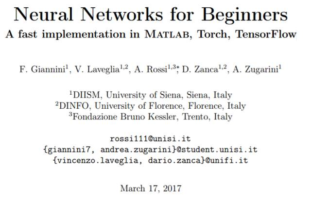
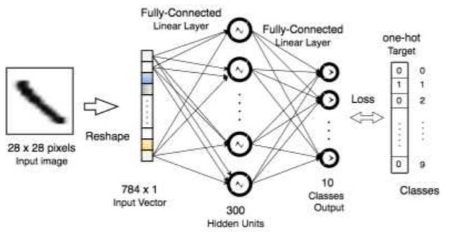
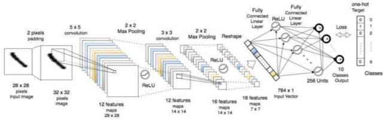
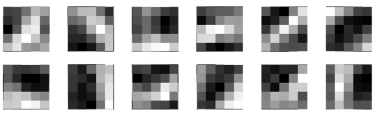
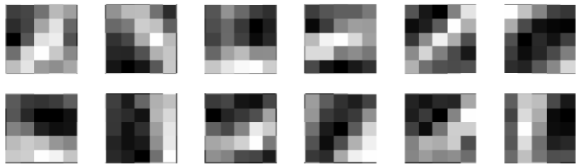
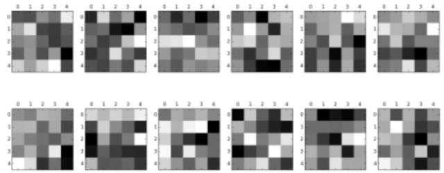
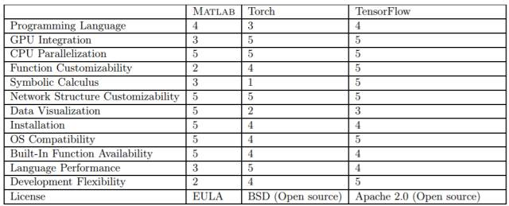
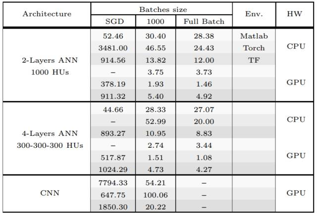

# 初学者怎么选择神经网络环境？对比 MATLAB、Torch 和 TensorFlow

选自 arXiv

**机器之心编译**

**参与：吴攀、蒋思源、李亚洲**

> > *初学者在学习神经网络的时候往往会有不知道从何处入手的困难，甚至可能不知道选择什么工具入手才合适。近日，来自意大利的四位研究者发布了一篇题为《神经网络初学者：在 MATLAB、Torch 和 TensorFlow 中的快速实现（Neural Networks for Beginners A fast implementation in Matlab, Torch, TensorFlow）》的论文，对 MATLAB、Torch 和 TensorFlow 这三种神经网络工具进行了介绍和比较。机器之心对其中部分内容进行了编译介绍（其中第 6 节比较结论部分进行了全部介绍），论文原文请点击文末「阅读原文」查阅。*
> 
> 
> 
> **本报告的目的**
> 
> 本报告提供了最常见的开发环境内一些机器学习工具的介绍。本报告主要关注实际问题，跳过了任何理论介绍。本报告面向的读者是想要进入机器学习领域的学生和正在寻找新框架的专家。
> 
> 这篇论文是关于人工神经网络（ANN，[1,2]）的，因为这是目前最热门的主题，并且在许多人工智能任务上都达到了当前最佳的水平。在单独介绍了每一种框架之后，我们同时也给出实现一些一般常见问题的设置方法，从而使它们的比较更简单。
> 
> 因为这个主题已经得到了广泛的研究，而且还在持续快速地增长，所以我们将这个文档和一个 GitHub 库进行了配对，这个库中的文档是动态更新的，而且以后可能还会扩大规模。
> 
> GitHub 地址：https://github.com/AILabUSiena/NeuralNetworksForBeginners
> 
> **目录**
> 
> 1 MATLAB：一个统一友好的环境
> 
> 1.1 介绍
> 
> 1.2 设置异或实验
> 
> 1.3 停止准则和正则化
> 
> 1.4 绘制分离面
> 
> 2 Torch 和 Lua 环境
> 
> 2.1 介绍
> 
> 2.2 起步
> 
>   2.2.1 Lua
> 
>   2.2.2 Torch 环境
> 
> 2.3 设置异或实验
> 
> 2.4 停止准则和正则化
> 
> 2.5 绘制分离面
> 
> 3 TensorFlow
> 
> 3.1 介绍
> 
> 3.2 起步
> 
>   3.2.1 Python
> 
>   3.2.2 TensorFlow 环境
> 
>   3.2.3 安装
> 
> 3.3 设置异或实验
> 
> 4 MNIST 手写字符识别
> 
> 4.1 MATLAB 上的 MNIST
> 
> 4.2 Torch 上的 MNIST
> 
> 4.3 TensorFlow 上的 MNIST
> 
> 5 卷积神经网络
> 
> 5.1 MATLAB
> 
> 5.2 Torch
> 
> 5.3 TensorFlow
> 
> 6 关键比较
> 
> 6.1 MATLAB
> 
> 6.2 Torch
> 
> 6.3 TensorFlow
> 
> 6.4 比较总体概览
> 
> 6.5 计算问题
> 
> **1 Matlab：一个统一的友好环境**
> 
> **1.1 介绍**
> 
> Matlab 是一个强大的工具，能够对大部分类型的数值运算、算法、编程和测试进行简单又快速的处理。其直观且友好的交互式接口使得它能简单地对数据进行处理、可视化与分析。针对各种类型的任务，该软件提供了大量的内置数学函数，以及丰富的、易于获取的文档。其主要设计是处理矩阵的，因此，几乎所有的函数和运算都向量化了，也就是说它们可以管理标量以及向量、矩阵和张量（往往会有）。因此，其能更高效地避免循环（可能的时候），以及建立利用矩阵乘法的运算。
> 
> 在此文档中，我们只展现了一些简单的用于上手人工神经网络（ANN）的机器学习相关的工具。我们假设读者有基础知识，并把重点放在了进一步信息的官方文档上。例如，你可以从 Matlab 的官网发现如何掌握该软件的相关信息。确实，其许可证并非免费的，虽然大部分大学会为学生提供教学用许可证，但可能也无法获取目前所有的程序包。特别是 Statistic and Machine Learning Toolbox 和 Neural Network Toolbox 提供了大量内置函数和模型，可用于实现适用于各类任务的不同 ANN 架构。
> 
> 即使我们参考一些简单独立的案例，这两个工具也是基本所需的。最容易理解的是 nnstart 函数，其能激活一个简单的 GUI 并通过简单的 2 层架构来引导用户。它能允许加载可用的数据样本或使用用户自定义数据（即输入数据和对应目标的两个矩阵），还能训练网络并分析结果（误差趋势、混淆矩阵、ROC 曲线等）。
> 
> 然而，还有更多可用于特定任务的函数。比如说，patternnet 函数是专为模式识别问题而设计的、newfit 函数适用于回归问题，而 feedforwardnet 函数是最灵活的，其允许构建自定义的和复杂的网络。所有的版本都以类似方式实现，主要的选项和方法适用于所有函数。在下一章节中，我们展示了如何管理可定制架构，并开始解决非常基础的问题。相关详细信息可以在官方网站找到：http://ch.mathworks.com/help/nnet/getting-started-with-neural-network-toolbox.html
> 
> **2 Torch 和 Lua 环境**
> 
> **2.1 介绍**
> 
> Torch7 是一个易于使用并十分高效的科学计算框架，本质上是面向机器学习算法的。Torch7 以 C 语言写成，这就保证了高效性。然而，通过 LuaJIT 接口（其提供了一种快速和直观的脚本语言），我们可以进行完全地交互（通常很方便）。此外，它还集成了支持 GPU 计算的 CUDA 环境的必要库。截至目前，Torch7 是构建任何种类拓扑结构的 ANN 原型上最常用的工具之一。事实上，Torch7 现在有很多软件包，有很大的社区和不断的更新和改进，这些都让我们可以非常简单地开发几乎任何种类的架构。
> 
> 有关安装信息可以在官方网站入门部分找到：http://torch.ch/docs/getting-started.html。对基于 UNIX 的操作系统，这一过程非常简单直接，而 Windows 系统即使有替代方法（https://github.com/torch/torch7/wiki/Windows），但还没有官方支持。如果已经安装了 CUDA，那么就会自动添加 cutorch 和 cunn 包，其中包含了处理 Nvidia GPU 的所有必要工具。
> 
> **3 TensorFlow**
> 
> **3.1 简介**
> 
> TensorFlow [5] 是一个用于数值计算的开源软件库，其相比于其它机器学习框架是最年轻的。TensorFlow 最初由谷歌大脑团队的研究员和工程师开发，其目的是鼓励对深度架构的研究。然而，该环境对一些数值编程领域提供了大量的合适的工具。其计算方式是在数据流图（Data Flow Graphs）概念下构想的。图的结点表示数学运算，图的边表示张量（多维数据数组）。该机器学习包的核心是用 C++写的，但其提供了一个优良的 Python API，而且有很好的文档支持。TensorFlow 主要的特征是其符号方法，该方法允许对前向模型做出一般性定义，而将对应的衍生计算留给该环境本身执行。
> 
> **4 MNIST 手写字符识别**
> 
> 在本章节中，我们将讨论如何建立一个 2 层 ANN 以解决 MNIST [6] 分类问题，MNIST 是一个著名的手写字体识别数据集。其广泛用于测试和比较一般机器学习算法和计算视觉方法。该数据集提供 28×28 像素（灰度）的手写数字图像。训练和测试集分别包含 6 万与 1 万条样本。压缩文件可以在官网获得：http://yann.lecun.com/exdb/mnist/，同时还有大多数常见算法的性能测评列表。
> 
> 我们展示了构建的标准 2 层 ANN，其每一个隐藏层包含 300 个神经元。如图 4 所示，因为该网络是在官方网站上测评报告的架构之一，我们可以轻松地比较所得到的结果。其输入需要重塑为包含 28 · 28 = 784 个元素的一维向量以满足神经网络。每个图像最初由包含灰度像素值 [0, 255] 的矩阵所表征，并将归一化为 [0, 1] 之内。输出将是包含 10 个元素的预测向量，因为每个元素的标签将由 one-hot 编码的 10 空位二元向量组成。激活和惩罚函数在不同的环境中并不相同，这样以提供一个不同方法的概览。
> 
> 
> 
> *图 4：面向 MNIST 数据的 2 层网络模型的一般架构*
> 
> **5 卷积神经网络**
> 
> 在本章节中，我们将介绍卷积神经网络（CNN [7, 6, 8]），该神经网络是一种重要和强大的学习架构，其广泛用于计算机视觉应用。卷积神经网络目前代表着用于图像分类任务的最先进算法，并构成了深度学习中的主要架构。我们展示了在所有提到的框架内如何构建和训练这样一个神经网络，并且还探索了其最常用的功能和在 MNIST 上进行一些试验以指出一些重要的特征。
> 
> 
> 
> *图 8：面向 MNIST 数据的 CNN 模型的一般架构*
> 
> 
> 
> *图 9：在 MNIST 图像上用 Matlab 训练后的第一个卷积层的 5 × 5 滤波器。*
> 
> 
> 
> *图 11：在 2 × 2 最大池化的 MNIST 图像上用 Torch 训练的第一个卷积层的 5 × 5 滤波器。*
> 
> 
> 
> *图 12：在 MNIST 图像上用 TensorFlow 和所述的架构训练的第一个卷积层的 5 × 5 滤波器。*
> 
> **6 关键比较**
> 
> 在这一节，我们将提供对这些环境的整体概览。即使我们在表 1 中提供了基于一些我们认为和机器学习软件开发主要相关的特征的分数比较，但本研究的目的并不是通过这样简单的评估来完成分析。相反，我们希望提出一个有用的引导，可帮助人们进入广义上的 ANN 和机器学习领域，从而根据个人背景和要求来在环境中自我定位。更完整的和统计相关的比较可参阅：http://hammerprinciple.com/therighttool，这里我们进行了总结，以帮助人们加速单个和全局的任务开发。
> 
> 我们首先给出了每个环境的一般描述，然后我们尝试在一些具体要求上比较了它们的优缺点。最后，我们在不同的任务上进行了计算性能的指示性数值分析，这也可以作为一个比较和讨论的主题。
> 
> **6.1 MATLAB**
> 
> 该编程语言是直观的，并且该软件也提供了完整的软件包——让用户可以无需编写任何特定的代码就能定义和训练几乎所有类型的人工神经网络架构。其代码并行化（code parallelization）是自动完成的，而且与 CUDA 的集成也很直接。其可用的内置函数是高度可自定义和可优化的，从而提供了快速的和可扩展的实验设置方式，让你可以轻松获取网络的变量以进行深度分析。但是，扩展和集成 Matlab 工具需要对于该环境的高阶知识。这可能会驱使用户开始从头编写其代码，导致计算表现的普遍衰减。这些功能让其成为了一个完美的统计和分析工具箱，但是作为开发环境来说还是慢了一点。其 GUI 需要一些重量级的计算，但另一方面，这对用户很友好，而且还提供了最好的图形数据可视化。MATLAB 的文档很完整，在官网上也组织得非常好。
> 
> **6.2 Torch**
> 
> Torch 的编程语言（Lua）有时候有一点难，但它应该比这些语言中其它一些要快一点。其提供了所有所需的 CUDA 集成和 CPU 并行自动化。其基于模块的结构允许灵活的 ANN 架构，而且扩展其提供的软件包也相对容易。而且其还有其它强大的软件包，但一般而言它们需要一定的专业知识才能实现有意识的操作。Torch 可被轻松用于特定和一般算法测试的原型设计环境。其文档遍布于整个 Torch 的 GitHub 库，有时候不能立即解决一些特定的问题。
> 
> **6.3 Tensor Flow**
> 
> 其使用了非常动态的语言 Python，让用户可以轻松地编写脚本。其 CPU 并行化是自动的，而且其使用了计算图结构，可以轻松利用 GPU 计算。其提供了很好的数据可视化，并且让初学者也可以轻松地获取已经准备好的软件包，尽管本文并没有涉及到这方面。其符号计算（symbolic computation）的力量仅在前向步骤中涉及到用户，而其反向步骤完全是由 TensorFlow 环境导出的。这样的灵活性让任何知识水平的用户都可以非常快速地进行开发。
> 
> **6.4 整体比较情况概览**
> 
> 就像之前说过的，我们尝试在表 1 中总结出全局对比，根据不同的视角进行 1-5 的评分。下面介绍了主要的对比指标：
> 
> *   编程语言：它们所有的基本语言都非常直观
>     
>     
> *   GPU 集成：Matlab 因为需要额外的工具包而得分较低
>     
>     
> *   CPU 并行化：所有的环境都可利用尽可能多的核（core）
>     
>     
> *   函数可定制性：Matlab 得分较低，因为要将良好优化的函数与已有的函数整合起来很困难
>     
>     
> *   符号运算：Lua 不支持
>     
>     
> *   网络结构可定制性：每种网络都是可能的
>     
>     
> *   数据可视化：交互式的 Matlab 优于其它
>     
>     
> *   安装：所有都相当简单，但 Matlab 的交互式 GUI 是个加分项
>     
>     
> *   操作系统兼容性：Torch 在 Windows 上不容易安装
>     
>     
> *   语言性能：Matlab 接口有时候很沉重
>     
>     
> *   开发灵活性：同样，Matlab 得分低，因为其会迫使中等用户精通其语言，才能有能力整合已有的工具或编写出合适的代码，一般来说，这会拖慢软件开发速度。
>     
>     
> 
> 
> 
> *表 1：三种环境的各项得分*
> 
> **6.5 计算问题**
> 
> 在表 2 中，我们比较了不同任务的运行时间，分析了 CPU 和 GPU 计算的优点和不同之处。结果是 5 次实验的平均得分，而且实验都是在同一台计算机上完成的，该计算机的配置是：32 核的英特尔 Xeon CPU E5-2650 v2 @ 2.60GHz、66 GB RAM、4 GB 内存的 Geforce GTX 960。操作系统是 Debian GNU/Linux 8 (jessie)。我们在不同的网络框架、批大小（包括随机梯度下降（SGD）、1000 样本批和完全批（Full Bacth））和硬件（在 HW 列说明）上测试了标准的梯度下降流程。这里用到的 CNN 架构和图 8 中给出的一样。结果是通过尝试使用尽可能相似的优化流程而得到的。在实际中，我们很难在 Matlab 内置的工具箱中应用特定的优化技术。我们为 Torch 的第二个架构（第 8 行）跳过了 SGD 的案例，因为其第一个架构获得了大量的计算时间。我们也跳过了使用 GPU 的 Matlab 在 ANN 上的 SGD，因为其训练函数不支持 GPU 计算（第 4 和 10 行）。实际上，这可能是一个不常见的研究案例，但为了最好的完整性，我们还是报告其结果。我们跳过了在 GPU 上的 CNN Full Batch 的实验，因为其内存需求实在太高了。
> 
> 
> 
> *表 2：给定环境在 MNIST 数据上用不同架构训练 10 epoch 5 次后的平均时间（秒）。所有架构都使用了 ReLU 作为激活函数，softmax 作为输出函数，交叉熵作为惩罚。***
> 
> ******本文为机器之心编译，***转载请联系本公众号获得授权******。***
> 
> ✄------------------------------------------------
> 
> **加入机器之心（全职记者/实习生）：hr@jiqizhixin.com**
> 
> **投稿或寻求报道：editor@jiqizhixin.com**
> 
> **广告&商务合作：bd@jiqizhixin.com**