# 神经形态计算与神经网络硬件最全调查：从研究全貌到未来前景

选自 arXiv

**机器之心编译**

**参与：Jane W，吴攀**

> *神经形态计算被认为是未来人工智能计算的重要方向，近日，电气和电子工程师协会（IEEE）多位研究者联合发表了一篇长达 88 页的概述论文，对神经形态计算过去 35 年的发展进行了全面的梳理，同时还展望了这一领域的未来发展。机器之心对这篇调查论文的主干部分进行了摘要编译介绍，论文原文请访问：https://arxiv.org/abs/1705.06963*

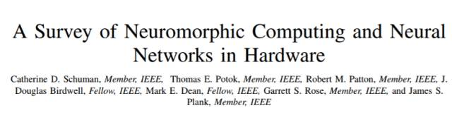

神经形态计算（Neuromorphic computing）用来指代与普遍的冯·诺依曼计算机体系结构形成鲜明对比的灵感来源于大脑的计算机、器件和模型。这种仿生学方法创造了高度连接的合成神经元和突触，它们可用于神经科学理论建模，并解决具有挑战性的机器学习问题。该技术的前景是创造一个像大脑一样具有学习和适应能力的系统，但这项技术存在很多技术挑战，从建立准确的大脑神经模型，到寻找材料和技术来构建支持这些模型的设备，到开发一个能使系统自动学习的编程框架，再到创建具有类脑功能的应用程序。在这项过程中，我们调查了神经形态计算研究的起源和发展史。首先，我们对过去 35 年中神经形态计算的动机和驱动因素作了回顾，然后了解了该领域的主要范围，其范围定义为神经启发的模型、算法和学习方法、硬件和设备、支持系统以及应用程序。最后，我们以广泛讨论的方式对未来几年需要解决的主要研究课题进行了总结，作为对神经形态计算前景的展望。这项工作的目标是对神经形态计算研究的发展过程进行详尽的回顾，并通过指出新研究的需求点来激励进一步的工作。

**I. 引言**

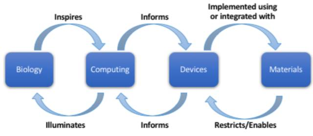

*图 1\. 涉及神经形态计算的研究领域及其相关性。涉及到生物学、计算、器件和材料多个领域。*

**II. 动机**

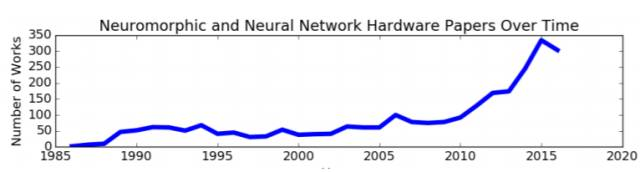

*图 2\. 关于神经形态和神经网络硬件的论文数量随时间推移的变化情况。*

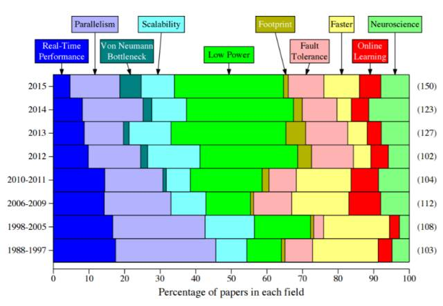

*图 3\. 发展神经形态系统的十种不同动机，以及随时间推移各动机在论文中所占的百分比的变化情况。从左到右依次为：实时性能、并行性、冯·诺依曼的瓶颈、可扩展性、低功耗、封装大小、容错、速度更快、在线学习、神经科学*

**III. 模型**

与神经形态计算相关的关键问题之一是使用哪种神经网络模型。神经网络模型决定构成网络的组成部分、这些组成部分如何运行、以及它们之间如何相互作用。例如，根据来自生物神经网络的灵感，人工神经网络模型的常见组成部分是神经元和突触。当定义神经网络模型时，还必须为每个组件定义模型（例如，神经元模型和突触模型）；每个组件的模型决定这个组件的运行方式。

如何选择正确的模型？在某些情况下，所选择的模型可能是由特定的应用场景确定的。例如，如果神经元器件的目的是利用该器件来模拟生物大脑，用于比传统的冯·诺依曼架构速度更快的神经科学研究，那么生物学现实和/或合理的模型是必要的。如果应用场景是需要高精度的图像识别任务，那么具有卷积神经网络的神经形态系统可能是最好的。模型本身也可以由特定器件或材料的特性和/或局限性而塑造决定。例如，基于忆阻器（memristor-based）的系统（在 V-B1 节进一步讨论）具有允许针对脉冲时间相关的可塑性（spike-timing dependent plasticity）机制（一种学习机制，IV 节中进一步讨论）的特征，这些机制最适合于脉冲神经网络模型。在许多其它情况下，模型的选择或模型的复杂程度尚不完全清楚。

我们已经在神经形态或神经网络硬件系统中实现了多种模型类型。这些模型包含了从生物启发为主到计算驱动为主的模型。后者更多地受到人工神经网络模型的启发，而不是生物大脑的启发。本节将讨论在神经形态系统中使用的不同神经元模型、突触模型和网络模型，并列出每种类型模型的重要论文。

**A. 神经元模型**

图 4 给出了在硬件中实现的神经元模型的类型概述。神经元模型分为五大类：

*   生物学合理的（Biologically-plausible）：直接模拟生物神经系统的行为类型。

*   生物学启发的（Biologically-inspired）：尝试复制生物神经系统的行为，但不一定用生物学合理的方式。

*   神经元+其它（Neuron+Other）：神经元模型，包括其它由生物启发但不包括在其它神经形态模型中（如轴突、树突或神经胶质细胞）的组成部分。

*   Integrate-and-fire：一类更简单的生物启发的脉冲神经元模型。

*   McCulloch-Pitts：神经元模型是 McCulloch-Pitts 神经元的衍生模型[23]，用于大多数人工神经网络论文。对于该模型，神经元 j 的输出遵循以下等式：

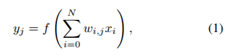

其中 y_j 是输出值，f 是激活函数，N 是输入到神经元 j 的数量，w_{i,j} 是从神经元 i 到神经元 j 的突触的权重，x_i 是神经元 i 的输出值。

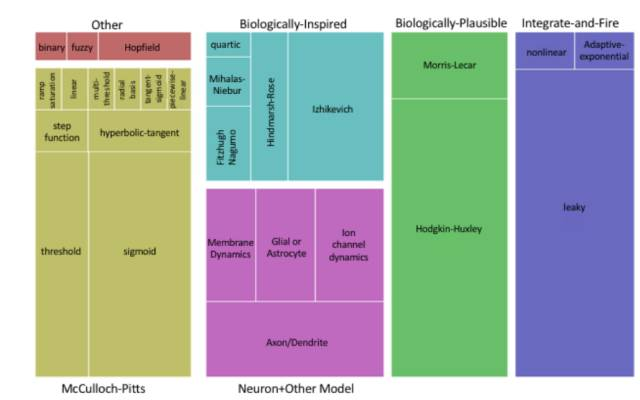

*图 4\. 在硬件中实现的神经元模型的层次结构。框的大小对应于该模型的实现数量，并且框的颜色对应于神经元模型的「系列」，系列名称标记在框的上方或下方。*

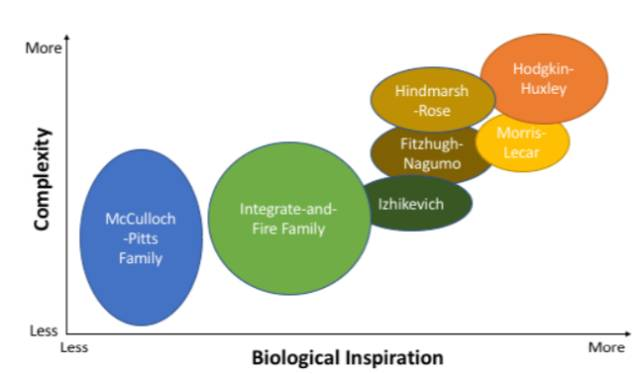

*图 5\. 神经元模型在由生物启发和模型复杂性方面的定性比较。*

**B. 突触模型**

像一些神经形态研究特别关注神经元模型一样，这些模型偶尔也包含对突触模型的实现，在神经形态系统中，也有专门独立于神经元系统的突触模型。我们可以将突触模型分为两类：生物启发型突触实现，包括针对基于脉冲系统（spike-based system）的突触，以及用于传统人工神经网络（例如前馈神经网络）的突触实现。值得注意的是，突触通常为神经形态系统中最丰富的元素，或是特定芯片上需要最多元件的元素。对于许多硬件实现，特别是用于神经形态的新型材料的开发和使用，重点通常在优化突触实现。因此，突触模型往往相对简单，除非它们试图明确地模拟生物行为。对于更复杂的突触模型，一个普遍的方法是含有可塑性机制（plasticity mechanism），其导致神经元的强度或权重随着时间而变化。已经发现可塑性机制与生物大脑的学习有关。

**C. 网络模型**

网络模型解释了不同的神经元和突触如何相互连接以及相互作用的方式。从前面的章节可以看出，在神经形态系统中有多种神经网络模型可供选择。

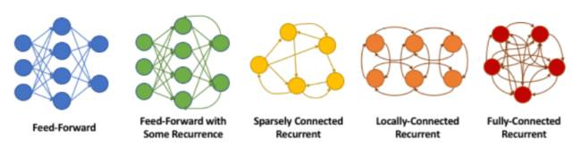

*图 6\. 神经形态系统可能需要的不同网络拓扑结构。确定神经形态实现所需的连接级别，然后找到适合该级别连接的适当硬件，这通常是一项重要的工作。*

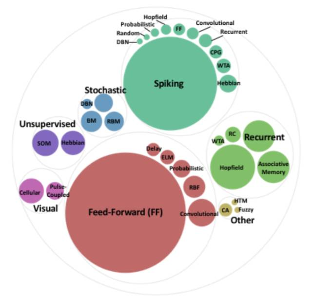

*图 7\. 神经形态实现中网络模型的细分，按整体类型和相关论文数量的大小分组。*

**D. 总结与讨论**

**IV. 算法和学习**

神经形态系统的未决问题的焦点围绕在算法。我们选择的神经元、突触和网络模型对所选择的算法产生影响，因为某些算法对于特定的网络拓扑、神经元模型或其它网络模型特征敏感。除此之外，第二个问题是系统的训练或学习是否应该在芯片上执行，或者网络的训练是否应该在芯片外执行，然后迁移到神经形态系统上实现。第三个问题是算法是否应该使用 on-line 和无监督学习（在此情况下，需要在芯片上训练），使用 off-line 和监督学习方法是否能够满足要求，或者是否应该结合两者使用。在后摩尔定律（post-Moore’s law）时代，神经形态系统作为流行的互补架构的一个关键原因是它们 on-line 学习的能力；然而，即使基础良好的神经形态系统也很难开发用于硬件编程的算法，无论是以 off-line 还是 on-line 的方式。在本节中，我们主要关注片上（on-chip）算法、chip-in-the-loop 算法和直接针对硬件的实现算法。

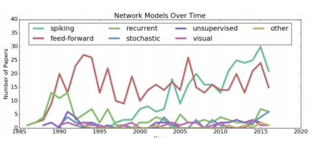

*图 8\. 神经形态实现的模型（每年发表的论文数量）随时间的变化情况。*

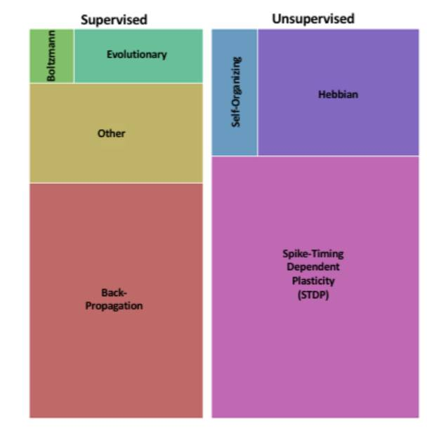

*图 9\. 芯片上训练/学习算法的概览。框的大小对应于该类别中的论文数量。*

A. 监督学习

B. 无监督学习

C. 总结和讨论

**V. 硬件**

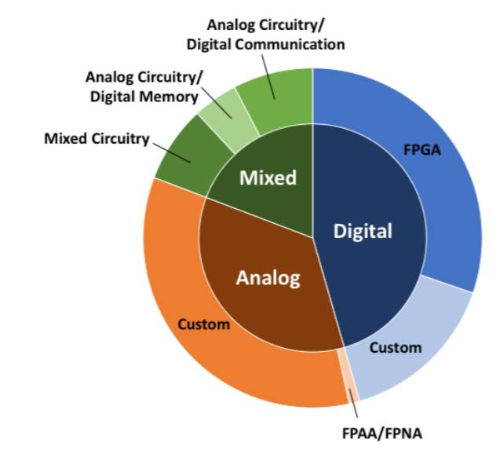

*图 10\. 神经形态计算的硬件实现。这些实现是相对基本的硬件实现，并且不包含 V-B 节中讨论的更异常的设备组件。*

A. 高层级

B. 器件层级组件

C. 神经形态系统的材料

D. 总结和讨论

**VI. 支持系统**

**VII. 应用**

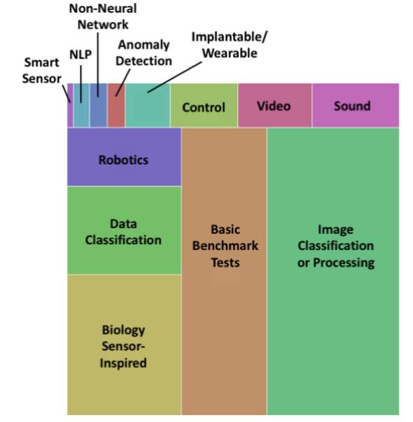

*图 13\. 神经形态系统的应用细分。框的大小对应于该神经形态系统用于开发的应用的数量。*

**VIII. 讨论：神经形态计算的未来**

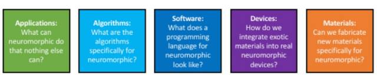

*图 15\. 主要神经形态计算研究在不同领域面临的挑战。*

**IX. 总结**

**致谢和参考文献（略）**

 ****更多有关 GMIS 2017 大会的内容，请点击「阅读原文」查看机器之心官网 GMIS 专题↓↓↓**

 ******