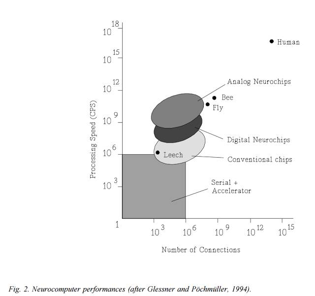
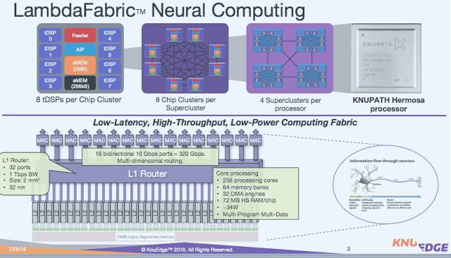
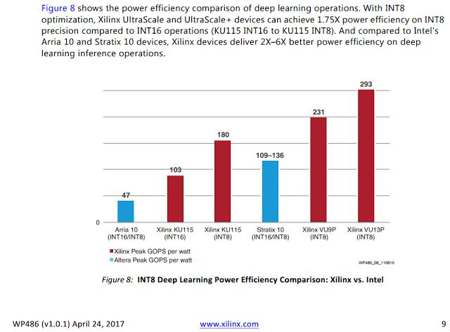
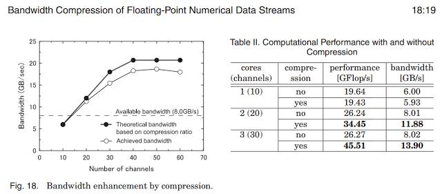
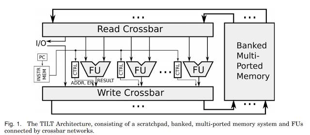
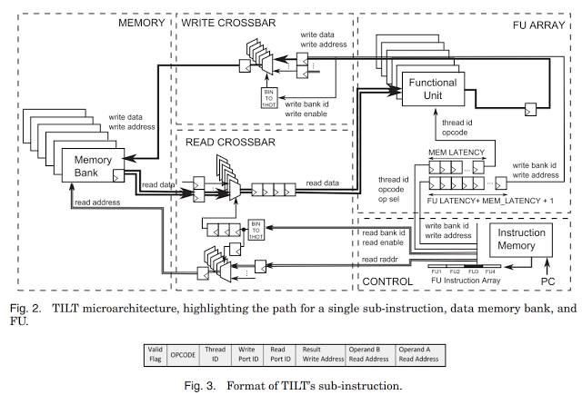

# 从 GPU、TPU 到 FPGA 及其它：一文读懂神经网络硬件平台战局

选自 Blogspot

**作者：Matt Hurd**

**机器之心编译**

**参与：Panda**

> 在如今深度学习大爆发的时代，相关的硬件平台也在百花齐放，既有英伟达和谷歌这样的科技巨头，也有地平线机器人和 Graphcore 等创业公司——它们都各自提出了自己的解决方案。近日，多家公司的技术顾问 Matt Hurd 在其博客上发表了一篇全面评点各种神经网络硬件平台的长文，机器之心对本文进行了编译介绍。

这是我几周前做的一个传统的 90 年代风格的性别识别神经网络的很好的隐藏节点。

一个简单的性别识别器网络中的 90 年代风格的隐藏节点图像

我的硕士项目是一种类似级联相关（cascade correlation）的神经网络 Multi-rate Optimising Order Statistic Equaliser（MOOSE：多速率优化顺序统计均衡器），可用于日内的 Bund（国库债券产品）交易。MOOSE 曾经是为获取高速的 LEO 卫星信号（McCaw 的 Teledesic）而设计的一点成果，后来在从 LIFFE 迁移到 DTB 时将目标转向了 Bund。作为一家投资银行的职业交易员，我可以购买很好的工具。我有那时候世界上最快的计算机：一个 IBM MicroChannel dual Pentium Pro 200MHz 处理器外加带有几 MB RAM 的 SCSI。在 1994 年那会儿，将 800,000 个数据点输入到我的 C++ stream/dag 处理器中看上去就像是黑魔法。有限差分方法让我可以做许多 O(1) 增量线性回归这样的运算，以获得 1000 倍的加速。那时候这看起来已经很好了。现在，你的手机都能嘲笑我的大方向。

那时候，在神经网络领域有很多研究。倒不是说它有过人的生产力，只是因为有用。读到 Lindsay Fortado 和 Robin Wigglesworth 的 FT 文章《Machine learning set to shake up equity hedge funds》中 Eric Schmidt 关于机器学习和交易的看法，还真有点让人高兴：

> Eric Schmidt 是谷歌母公司 Alphabet 的执行董事长，他上周对一众对冲基金经理说他相信在 50 年内，所有交易都会有计算机解读数据和市场信号。
> 
> 「我期待出现在交易方面做机器学习的创业公司，看看我描述的这种模式识别能否比数据分析专家的传统线性回归算法做得更好。」他补充说，「我这个行业内的许多人都认为这注定将成为一种新的交易形式。」

老朋友 Eric，我在 90 年代早期就已经算是迟到了，你真是有点后知后觉。

好吧，现在情况已经不同了。我喜欢思考它，并喜欢将神经网络的这次新复兴称为感知时代（The Age of Perception）。这并不是智能，只是擅长模式而已。它仍然无力应对语言歧义。它还要一些时间才能理解基本的价值和概念，从而形成深刻的金融理解。

深度学习既被夸大了，也被低估了。这不是智能，但会有助于帮我们实现智能。一些人将其夸大为将会给我们带来替代人的类人机器的人工智能突破。我们仍然还受困于常识以及用于推理的简单文本中的歧义。我们还有很长的路要走。相对简单的规划算法和启发式方法以及基于神奇的深度学习的视觉、声音、文本、雷达等等的感知能力将会带来深刻的影响，就像是每个人和他们的狗现在理解的那样。所以我叫它「感知时代」。就好像是我们口袋里的超级计算机突然有了眼睛，并且快速适应了真实世界所带来的闪光性致盲。

深度学习将会带来巨大的影响，并且将会改变这颗行星上全人类的生活方式。但我们低估了其对我们的危险。不，我们不会和能激起或挑战我们最深刻的思想的深度图灵对话者约会——还不会。这将不可避免地到来，但在可见的未来里还不可见。借助语音、文本和 Watson 那样的数据库的智能代理可以实现非常先进的 Eliza，但不会更先进了。自动化运输、食物生产、建筑、协助家事将会极大地改变人们的生活方式和不动产的价值。

除了这些泛泛之谈，本文的目的是收集一些关于芯片的思想见解——它们驱动着当前的神经网络革命。其中很多见解都不是最为激动人心的，但这对我来说是一个有用的锻炼。

**神经网络硬件**

与 20 年前相比，今天的神经处理方法并没有很大不同。深度更多的是一个品牌，而不是一项差异。激活函数已经得到了简化，以更好地适配硬件。主要的成功之处在于我们有了更多数据，对如何初始化权重、处理许多层、并行化和提升鲁棒性也有了更好的理解，其中要用到像是 dropout 这样的技术。1980 年的 Neocognitron 架构与今天的深度学习器或 CNN 并没有显著差异，但 Yann LeCun 让它具备了学习能力。

在 90 年代那会儿也有很多神经硬件平台，比如 CNAPS（1990），它带有 64 个处理单元和 256kB 内存，可以在 8/16 位条件下达到 1.6 GCPS 的速度（CPS 是指每秒连接次数/ connections per second）或在 1 位条件下达到 12.8 GCPS 的速度。你可以在《神经硬件概述（Overview of neural hardware）》[Heemskerk, 1995, draft] 中读到 Synapse-1、CNAPS、SNAP、CNS Connectionist Supercomputer、Hitachi WSI、My-Neupower、LNeuro 1.0、UTAK1、GNU（通用神经单元/General Neural Unit）Implementation、UCL、Mantra 1、Biologically-Inspired Emulator、INPG Architecture、BACHUS 和 ZISC036。

阅读地址：https://pdfs.semanticscholar.org/5841/73aa4886f87da4501571957c2b14a8fb9069.pdf

好吧，东西还真多，但实际上还排除了软件和加速器板/CPU 组合，比如 ANZA plus、SAIC SIGMA-1、NT6000、Balboa 860 协处理器、Ni1000 识别加速器硬件（英特尔）、IBM NEP、NBC、Neuro Turbo I、Neuro Turbo II、WISARD、Mark II & IV、Sandy/8、GCN（索尼）、Topsi、BSP400（400 微处理器）、DREAM Machine、RAP、COKOS、REMAP、通用并行神经计算机（General Purpose Parallel Neurocomputer）、TI NETSIM 和 GeNet。另外还有一些模拟和混合模拟的实现，包括英特尔的电气式可训练模拟神经网络（801770NX）。你懂我要表达的意思了，那时候的东西还真是多。

这在 1994 年迎来了一次爆发：

乐观的摩尔定律告诉我们，TeraCPS 即将实现：

> 「未来十年，微电子很可能将继续主导神经网络实现的领域。如果进展和过去进步得一样快，那就意味着神经计算机的性能将会增长大约 2 个数量级。因此，神经计算机将会接近 TeraCPS（10¹² CPS）的性能。由 100 万个节点（每个节点有大约 1000 个输入）组成的网络可以达到大脑的计算速度（100-1000 Hz）。这将能为实验合理巨大的网络提供良好的机会。」

由于 Minsky 和 Papert 对隐藏层的不正确简单概括，打击了 Rosenblatt 的感知器梦想并最终导致了他不幸的死亡，神经网络研究遭遇了第一个冬天，研究资金被残酷地撤销了。1995 年，又出现了另一次神经网络冬天，尽管那时候我其实并不知道。作为温水锅里的一只青蛙，我没有注意到正在加热。第二个冬天的主要原因是缺乏激动人心的进展，让人们普遍感到无聊了。

到了 2012 年，多亏了 Geoffrey Hinton 的冬季生存技能，多伦多大学基于 AlexNet 开发的 SuperVision 在 ImageNet 处理上实现了极大的提升，第二个神经网络冬天也由此终结了。之后谷歌的 LeNet Inception 模型在 2014 年打破了它的记录。所以据我估计，感知时代始于 2012 年。将它记在你的日历里面吧，五年已经过去了。

谷歌在几千台普通机器上进行了出色的并行 CPU 有损更新研究。吴恩达教授和他的朋友们让数十台 GPU 就能完成数千台 CPU 的工作，从而让规模化成为了可能。因此，我们从需要很好的资助的神经处理前景中解放了出来。好吧，或多或少吧，现在最先进的网络有时候需要数千台 GPU 或专用芯片。

更多数据和更多处理能力是其中的关键。让我们进入本文的重点，列出一些感知时代大数据之战中的一些关键平台：

**英伟达的 GPU**

这一家是很难被战胜的。来自大型视频处理市场的收益驱动着巨大的规模经济。新款英伟达 V100 带有一种新的 Tensor Core 架构，速度可达 15 TFlops（单精度/SP）或 120 TFlops（浮点精度，其中带有 FP16 的乘法和 FP32 的累加或加法，非常适合机器学习）。英伟达在它们的 DGX-1 中装入了 8 块计算卡，速度可达 960 Tensor TFlops.

**AMD 的 GPU**

在机器学习领域，AMD 一直是英伟达的追赶者。即将发布的 AMD Radeon Instinct MI25 有希望达到 12.3 TFlops（SP）或 24.6 TFlops（FP16）。如果你把英伟达的 Tensor Core 也算进来，则 AMD 完全无力竞争。英伟达设备的带宽 900GB/s 也是 AMD 484GB/s 的两倍。

**谷歌的 TPU**

谷歌原来的 TPU 相比于 GPU 有很大的领先，并帮助 DeepMind 的 AlphaGo 赢得了与李世石的围棋大战。据描述，原来的 700 MHz TPU 有 95 TFlops 的 8 位计算能力或 23 TFlops 的 16 位计算能力，同时功耗仅有 40W。这可比当时的 GPU 快得多，但现在落后于英伟达的 V100；但在单位功耗的计算能力上，TPU 并没落后。据称新的 TPU2 是一款带有 4 块芯片的 TPU 设备，速度可达到 180 TFlops 左右。每块芯片的性能都翻倍了，达到了 45 TFlops 的 16 位计算能力。你可以看到与英伟达 V100 的差距正在变小。你没法买到 TPU 或 TPU2。谷歌正在通过它们的云提供这些 TPU 服务，包含 64 台设备的 TPU pod 速度高达 11.5 PetaFlops。TPU2 上巨大的散热片说明了一些原因，但市场正在发生变化——从单独的设备转向了设备的组合以及将这些组合以云的形式提供。

**Wave Computing**

Wave 之父澳洲人 CTO Chris Nicol 博士的成果斐然，领导开发了 Wave 的 Compute Appliance 中的异步数据流处理器（asynchronous data flow processor）。几年前，Metamako 的创始人 Charles Thomas 在加州简单介绍了我和 Chris 认识。他们俩都曾在 NICTA 研究过无时钟异步。这两人都很出色。

我不确定 Wave 的设备最早是不是针对机器学习设计的，但在他们的 3RU appliance 上运行 TensorFlow 的速度可以达到 2.9 PetaOPS/s，这实在了不起。Wave 将他们的处理器称为 DPU，一个 appliance 有 16 个 DPU。Wave 使用了他们称之为粗粒度可重构阵列（CGRA：Coarse Grained Reconfigurable Array）的处理元素。我还不清楚 2.9 PetaOPS/s 的速度对应多少位宽。根据他们的白皮书，其 ALU 可以执行 1 位、8 位、16 位和 32 位计算：

「算术单元是分区的。它们可以并行执行 8 位运算（完美适用于 DNN 推理）以及 16 位和 32 位运算（或以上的任何组合）。也可以执行一些 64 位运算，而且可以使用软件扩展到任意精度。」

关于其 appliance 中的 16 个 DPU，还有一些额外的信息：

「Wave Computing DPU 是一种包含了 16384 PE 的 SoC，它们被配置成了一个 32×32 集群的 CGRA。它包含了 4 个 HMC（Hybrid Memory Cube）第二代接口、一个 PCIe 第三代 16 通道接口和一个用于 SoC 资源管理的嵌入式 32 位 RISC 微控制器。这款 Wave DPU 可以在没有主机 CPU 时自动执行。」

对于 TensoFlow 指令：

「Wave DNN Library 团队为 TensorFlow 等工作流程中所使用的常见 DNN 函数创建了预编译的可重新定位的 kernel。它们可以被组合到 Agent 中并且可以被实例化成机器，以构建大型的张量数据流图和 DNN kernel。」

「……一个可与 TensorFlow、CNTK、Caffe 和 MXNet 等机器学习工作流程交互的 session 管理器，可作为用于训练和推理的工作器过程（worker process）。这些工作流程可为工作器过程提供张量的数据流图。在运行时，Wave 的 session 管理器会分析数据流图并将这些软件智能体放置到 DPU 芯片中，然后将它们连接起来以构建数据流图。这些软件智能体会被分配用于输入缓冲和本地存储的全局内存区域。CGRA kernel 的静态本质和分布式的内存架构可以让一个性能模型准确估计智能体的延迟。session 管理器可使用该性能模型来在智能体之间插入 FIFO 缓冲，这有助于 DPU 中通信和计算的重叠。这个可变智能体支持穿过整个图的数据流的软件流程，从而可以进一步增加并发性和性能。这个 session 管理器可以监控数据流图运行时的性能（通过监控卡顿、缓冲区下溢出和/或上溢出），并且可以动态地调节 FIFO 缓冲区的大小以实现吞吐量的最大化。在附加了 DPU 的处理器中，有一个分布式运行时管理系统会在运行时安装和卸载数据流图的一些部分，从而平衡计算和内存的使用量。这种在数据流计算机中的数据流图上的运行时重新配置还是有史以来第一次。」

是的，我也觉得非常酷。这个平台的惊人之处是它在架构方面比 FPGA 更加粗粒度，因此灵活性更低，但却很可能表现更好。非常有意思。

**KnuEdge 的 KnuPath**

在 2016 年 6 月时我在 Twitter 上谈过 KnuPath。那以后他们的产品页面却失踪了。我不确定他们要把那 1 亿美元如何用到他们的 MIMD 架构上。那时候他们向我这样描述的：每个 ASIC 中有 256 个微型 DSP（即 tDSP）核以及一个 ARM 控制器，适用于 35W 包络中的稀疏矩阵处理。

它的性能未知，但他们把自己的芯片与一款当时的英伟达芯片进行了比较，那时候他们说实现了 2.5 倍的性能。我们知道英伟达现在凭借 Tensor 内核已经提速了十倍以上，所以 KnuEdge 还要努力才能跟上节奏。MIMD 或 DSP 方法必须要得到非常好的效果才能在这一领域占据一席之地。时间会给我们答案。

**英特尔的 Nervana**

Nervana Systems 曾经除了开发他们的 Nervana Engine ASIC，还开发着一种 GPU/软件方法，后来英特尔收购了这家公司。性能比较方面还不清楚。英特尔也在规划通过一个 Knights Crest 项目将其集成到 Phi 平台中。NextPlatform 认为其 2017 年在 28nm 节点上的目标是在某个位宽的运算速度达到 55 TOPS/s。英特尔还安排一个 NervanaCon，将在 12 月份举办，所以那时候我们也许将能看到他们的第一批成果。

**地平线机器人**

这家中国创业公司正在研发一种大脑处理单元（BPU：Brain Processing Unit）。余凯博士是正规军出身，他曾是百度深度学习研究院的负责人。今年早些时候，一段 YouTube 视频演示了基于 Arria 10 FPGA 的 BPU 仿真：https://youtu.be/GI9U9lUFaDo。目前关于这一平台的公开消息还很少。

**Eyeriss**

Eyeriss 是 MIT 的一个项目，开发出了一款具有出色原始性能表现的 64nm ASIC。在 AlexNet 上，这款芯片的速度大约是英伟达 TK1 的一半。其优势在于借助于其行固定（row stationary）方法，仅需要一个 278mW 的可重新配置加速器就能实现这样中规中矩的性能。赞。

**Graphcore**

去年 Graphcore 拿到了 3000 万美元的 A 轮融资，以开发他们的智能处理单元（IPU： Intelligence Processing Unit）。他们的网站还缺少细节，只是给出了一些亮眼的事实，比如多于 14000 个独立的处理器线程和大于 100 倍的内存带宽。根据 NextPlatform 报道的零星信息，其在一块芯片上具有多于 1000 个真实内核，并且采用了定制的互连方式。它的 PCIe 板具有一个 16 个处理器的元件。听起来似乎是数据流。抛开公关的言论，这个团队确实有很强的背景，而且投资者也不并不傻，所以就拭目以待吧。

**Tenstorrent**

Tenstorrent 是加拿大多伦多的一家小创业公司，它宣称在深度学习的效率上实现了一个数量级的提升，和大多数公司一样，还没有什么公开的细节，但该公司入选了 Cognitive 300 榜单。

**Cerebras**

Cerebras 值得一提，因为它得到了 Benchmark 的支持，而且其创始人是 SeaMicro 的 CEO。它似乎已经融资 2500 万美元了，而且仍然处于隐身模式。

**Thinci**

Thinci 正在美国萨克拉门托开发视觉处理器，并且在印度也有员工。他们宣称即将推出他们的第一款硅芯片 Thinci-tc500，而且已经开始进行标准评测和赢得客户了。但除了「一切都并行处理」之外，我们所知甚少。

**Koniku**

Koniku 的网站正在倒计时，现在还有 20 几天。我已经等不及了。他们没有融到多少钱，而看过它们在福布斯上的这个视频之后（https://goo.gl/VA1PJx），你很可能也不得不相信他们，但你也无法预料究竟会如何。利用生物细胞肯定是不一样的。听起来就像是一个科研项目，但他们这样说：

> 「我们是一个企业。我们不是一个科研项目。」下周将在维也纳的 Pioneers Festival 上发表演讲的 Agabi 这样说，「今天有些需求是硅所不能满足的，而我们可以通过我们的系统提供。」

> Koniku 提供的核心是所谓的神经元壳（neuron-shell），这家创业公司称其内部可以控制神经元彼此通信的方式，加上一种正在申请专利的电极，就可以在神经元上读写信息。所有这些都可以装在一个 iPad 大小的设备里，他们还希望能在 2018 年之前将其减小到一枚五美分硬币大小。

**Adapteva**

Adapteva 是我最喜欢的一家小技术公司，正如你在之前文章《Adapteva tapes out Epiphany-V：一款 1024 核 64 位 RISC 处理器》：https://goo.gl/6ZH7JP。去年年底时 Andreas Olofsson 拿出了他的 1024 核芯片，我们都等着看它的性能表现。Epiphany-V 有用于深度学习的新指令，我们必须要看看这种带有 64MB 片上内存的更少内存控制器的设计是否具有合适的扩展能力。Andrea 的设计和构建的出色效率可能能让我们真正负担得起这种芯片，所以让我们希望它有良好的表现吧。

**Knowm**

Known 研究的是 Anti-Hebbian and Hebbian（AHaH）可塑性和忆阻器。这里有篇覆盖这一主题的论文《AHaH 计算：从 Metastable Switches 到 Attractors 到机器学》：https://doi.org/10.1371/journal.pone.0085175。这对我来说有点太高级了。简单看了看，我看不出这项技术和胡言乱语的区别，但看起来确实科学味道十足。我需要亲眼看到才能相信。神经忆阻式处理器（neuromemristive processor）的思想是很有趣的。我早上确实需要一个好的流行术语。

**Mythic**

Mythic 的一款电池驱动的神经芯片具有低 50 倍的功耗。目前还看不到太多真正的细节。这款芯片大约纽扣大小，但大多数芯片不都这样吗？

> 「Mythic 的平台能在纽扣大小的芯片上提供桌面 GPU 的性能。」

也许这又是一款适合无人机和手机的芯片，很可能被用在手机中，也可能被排除在外。

**高通**

手机显然是机器学习硬件的一大用武之地。我们希望能够识别狗的品种、花朵、树叶、癌症痣、翻译标识、理解口语等等。我们口袋里的超级计算机愿意用上它能得到的所有帮助，以便能迈入感知时代。高通一直以来都在鼓捣机器学习，推出了 Zeroth SDK 和 Snapdragon 神经处理引擎（NPE）。这种 NPE 显然在高通所用的 Hexagon DSP 上效果良好。

Hexagon DSP 已经远远不止是一个非常广泛的并行平台了，Yann LeCun 已经证实高通和 Facebook 正在合作开发一种更好的方法，参见 Wired 的文章《业界 | 谷歌 TPU 之后还有高通，人工智能芯片竞赛已经展开》：

> 「最近，高通已经开始制造执行神经网络的专用芯片，这条消息来自 LeCun，因为 Facebook 正帮助高通开发机器学习相关技术，所以他对高通的计划很了解；高通技术副总裁 Jeff Gehlhaar 证实了这个项目，他说：『在原型设计和开发方面，我们还有很长的路要走。』」

也许我们很快就会看到 Kryo CPU、Adreno GPU、Hexagon DSP 和 Hexagon Vector Extensions 之外的其它东西。对于这一领域的创业公司来说，和高通的机器学习竞争将会艰难无比。

**Pezy-SC 和 Pezy-SC2**

这两者是 Pezy 开发的 1024 核和 2048 核处理器。Pezy-SC 1024 核芯片可以驱动 2015 年 Green500 超级计算机榜单的前三名的系统。Pezy-SC2 是现在已经开始提供的后续芯片，我在 6 月份也做过关于它的演讲，但相关细节还很少，不过仍然很吸引人：

> 「PEZY-SC2 HPC Brick：单个机箱中有 32 个带有 64GB DDR4 DIMM（2.1 PetaFLOPS（DP））的 Pezy-SC2 模块卡，速度可达 6.4 Tb/s.」

不知道 2048 个 MIMD MIPS Warrior 64 位核的机器能做到什么？在 6 月份的 2017 年 Green500 榜单中，一个英伟达 P100 系统拿到了头把交椅，而排名第 7 的是一个 Pezy-SC2 系统。所以看起来这款芯片还活着，但相关细节却很少。Motoaki Saito（齊藤元章）当然值得一看。

**Kalray**

尽管做了很多承诺，但 Kalray 的芯片还没有超过 256 核，我在 2015 年的一篇文章就谈到：https://goo.gl/pxqn7Z。Kalray 宣传自己的产品说是适合嵌入式自动驾驶汽车应用，但我觉得其目前产品架构的形式并不是一种完美的 CNN 平台。Kalray 有一个 Kalray Neural Network（KaNN）软件包并且宣称有比 GPU 更好的效率，在芯片上能实现高达 1 TFlop/s 的速度。

随着即将到来的产品更新，Kalray 的神经网络财富可能还会提升，就在这个月 Kalray 完成了新一轮 2600 万美元的融资。他们新的 Coolidge 处理器预计将在 2018 年年中上市，它会带有 80 或 160 个核，另外还有 80 或 160 个为视觉和深度学习优化的协处理器。

这在他们的多于 1000 核的方法上有了很大的改变，而我认为这是最明智的。

**IBM TrueNorth**

TrueNorth 是 IBM 的神经形态 CMOS ASIC，是与 DARPA 的 StNAPSE 项目一起开发的。

这是一种单个芯片设计上的多核处理器网络，具有 4096 个核，每个核模拟 256 个可编程的硅「神经元」，总共就超过了 100 万个神经元。另外，每个神经元还有 256 个可编程的「突触」，信号可以在这些突触之间传递。因此，可编程突触的总是超过了 2.68 亿（2²⁸）。在基本构建模块方面，它的晶体管数量为 54 亿。因为存储、计算和通信都是在这 4096 个神经突触核中各自处理的，所以 TrueNorth 避开了冯·诺依曼架构的瓶颈，而且能效非常高，功耗为 70 mW，大约是传统微处理器的功率密度的万分之一（来自维基百科）。

IBM 之前还在批评脉冲神经网络（spiking neural network）无法适配深度学习，现在 IBM 开发了一种在 TureNorth 上运行 CNN 的新算法。

这些神经元不会在每个周期内都放电，脉冲神经网络中的神经元必须逐渐积累它们的电势，然后才能放电……深度学习专家普遍认为脉冲神经网络在深度学习上没有效率——至少和卷积神经网络比起来是这样。Facebook 人工智能研究院主任和深度学习先驱 Yann LeCun 曾经批评过 IBM 的 TureNorth 芯片，因为它主要支持脉冲神经网络……

> ……这种神经形态芯片不会太激动人心，因为它们注重的脉冲神经网络在深度学习领域并不受欢迎。

为了让 TrueNorth 芯片很好地契合深度学习，IBM 不得不开发了一种新算法，让卷积神经网络可以在这款神经形态计算硬件上很好地运行。这种组合方法实现了 IBM 所谓的「接近当前最佳」的分类准确度，实验涉及了视觉和语音挑战赛方面的 8 个数据集。在最好的情况下，它们的准确度达到了 65% 到 97%。

当只使用一块 TrueNorth 芯片时，它只在这 8 个数据集中的 1 个数据集上超越了当前最佳的准确度。但如果使用多达 8 块芯片，IBM 的研究者可以极大提升这款硬件在深度学习挑战上的准确度。这使 TureNorth 可以在其中 3 个数据集上媲美或超越当前最佳的准确度。

这个 TureNorth 测试也做到了每秒处理 1200 到 2600 视频帧。这意味着单个 TureNorth 芯片就能实时检测来自多达 100 个同时工作的相机的数据的模式……（来自 IEEE Spectrum）

TrueNorth 的功率效率非常出色，所以非常值得考虑。

Brainchip 的脉冲神经元自适应处理器（SNAP：Spiking Neuron Adaptive Processor）

SNAP 不能做深度学习，这只是一个源于好奇心的项目，还没有实际落地成 CNN 工程解决方案，至少现在还没有。如果你想探索这条路，IBM 的随机相变神经元（stochastic phase-change neurons）似乎更有意思。

**苹果的神经引擎（Neural Engine）**

到底会不会有？彭博社报道称这会是一款次级处理器，但没有什么细节信息。对苹果来说，这不仅是一个重要领域，而且也有助于与高通的竞争。

**其它**

1\. 寒武纪（Cambricon）——中国科学院在芯片上投入的 140 万美元。它是一个用于神经网络的指令集架构，具有数据级的并行、自定义向量/矩阵指令、片上 scratchpad memory。宣称速度是 x86 CPU 的 91 倍，是 K40M 的 3 倍，且峰值功率仅有 1%，即 1.695W。参阅这两篇论文：

*   Cambricon：一个用于神经网络的指令集架构 s：http://dl.acm.org/citation.cfm?id=3001179

2\. 前谷歌员工创立的 Groq Inc.，也许是另一种 TPU？

3\. Aimotive：https://aimotive.com/

4\. Deep Vision 正在开发用于深度学习的低功耗芯片，也许这两篇创始人的论文能提供一点线索：

*   Convolution Engine: Balancing Efficiency and Flexibility in Specialized Computing [2015]：http://csl.stanford.edu/~christos/publications/2015.convolution_engine.cacm.pdf

5\. DeepScale 

6\. Reduced Energy Microsystems 正在开发用于 CNN 推理的低功耗异步芯片。据 TechCrunch 报道，REM 是 Y Combinator 第一个 ASIC 领域的风险投资。

7\. Leapmind 也很忙。

**FPGA**

微软已经站队 FPGA 了。Wired 这篇文章说得很好：《深度 |《连线》长文揭秘微软 Project Catapult：人工智能时代押注 FPGA》。

> 「Bing 占据着世界上 20% 的桌面搜索市场和 6% 的移动手机市场，在 Bing 上，这个芯片能帮助 Bing 适应新品种的人工智能：深度神经网络。」

我对这种方法也有些兴趣。赛灵思和英特尔（收购了 Altera）的 FPGA 是很强大的引擎。赛灵思自然宣称他们的 FPGA 是对 INT8 最好的，他们的一份白皮书里面包含了下面的幻灯片：

这两家供应商都很支持使用他们的 FPGA 做机器学习：

*   Intel FPGA OpenCL（https://goo.gl/S62fMA）和 Solutions（https://goo.gl/zkYyXB）

尽管 FPGA 单位功耗的性能是很出色的，但这些供应商的更大型的芯片的售价却长时间以来都高得吓人。赛灵思的 VU9P 在 Avnet 上的售价超过 5 万美元。

寻找价格和能力之间的平衡点是 FPGA 的主要难题。

FPGA 方法的一大优势是可以用来制定一些非常出色的架构决策。比如如果因为 HBM，你想在板上 DRAM 压缩并且实时地解压，然后希望借此改善你的内存的浮点数据流，如果你足够努力，你能找到解决方案。参阅《用于基于 FGPA 的高性能计算的浮点数值数据流的带宽压缩（Bandwidth Compression of Floating-Point Numerical Data Streams for FPGA-Based High-Performance Computing）》：http://dl.acm.org/citation.cfm?id=3053688。

这种动态的架构敏捷性（architectural agility）很困难，几乎无法用其它任何方法实现。

架构选择太多可能也是一个问题，但我自己还是挺喜欢这个问题的。这篇论文很不错《使用 TILT 减少 Soft Scalar CPU 和定制硬件之间的性能差距（Reducing the Performance Gap between Soft Scalar CPUs and Custom Hardware with TILT）》：http://dl.acm.org/citation.cfm?id=3079757，其中研究了定制硬件和 FPGA 处理器（带有基于 FPGA 的水平微编码的计算引擎）的性能差距，这让人想起了古老的 DISC 和很多个月前的离散指令集计算机（discrete instruction set computer）。

**谁是赢家？**

在这样的竞争中，预测谁是赢家是傻瓜的举动。高通凭借其手机市场的主导地位，可以轻松进入赢家榜单。苹果不管做什么都会成功的。英伟达的 V100 有 Tensor 单元，也基本上赢了。我不确定我能否看到谷歌的 TPU 在无休止的长期硅谷竞赛中幸存下来，尽管目前它的性能很出色。我很喜欢 FPGA 方法，但我也不禁想他们应该以远远更低的价格发布 DNN 版本，这样才不会被大众漠视。英特尔和 AMD 会做自己的协处理器。因为所有主要玩家都参战了，所以其中很多都会支持标准的工具包，比如 TensorFlow，这样我们就不必太在意规格了，关心基准就可以了。

在更小型的玩家中，我很喜欢而且支持的是 Adapteva 方法，我认为他们的内存架构可能并不适合 DNN。我希望我错了。

Wave Computing 可能是我继 FPGA 之后最喜欢的方法。他们的整个异步数据流方法是非常棒的。REM 似乎也在做类似的事情；但我认为他们可能太迟了。Wave Computing 能否在面对所有竞争对手时继续保持领先吗？也许只要他们的异步 CGRA 有一个本质优势，就可以。尽管我不确定他们是否只要 DNN 上的成功，因为他们的技术有更加广泛的应用能力。

神经形态脉冲处理器也许现在暂时可以忽略，但也可以保持关注，因为它们有很大的功耗优势。量子计算反正会让所有这些都稍逊风骚。IBM 的 TrueNorth 可能会是个例外，因为它不仅能执行脉冲网络，还能有效地运行 DNN。 ******************

*原文链接：https://meanderful.blogspot.jp/2017/06/fpgas-and-ai-processors-dnn-and-cnn-for.html*

******本文为机器之心编译，***转载请联系本公众号获得授权******。***

✄------------------------------------------------

**加入机器之心（全职记者/实习生）：hr@jiqizhixin.com**

**投稿或寻求报道：content@jiqizhixin.com**

**广告&商务合作：bd@jiqizhixin.com**