# 从浅层模型到深度模型：概览机器学习优化算法

选自 arxiv

**机器之心编译**

**参与：乾树、蒋思源**

> *学习算法一直以来是机器学习能根据数据学到知识的核心技术。而好的优化算法可以大大提高学习速度，加快算法的收敛速度和效果。该论文从浅层模型到深度模型纵览监督学习中常用的优化算法，并指出了每一种优化算法的优点及局限性，同时其还包括了一阶和二阶等各种算法的形式化表达。机器之心主要对本论文选择性地编译了优化算法的部分，更详细的推导及介绍请查看原论文。*

> 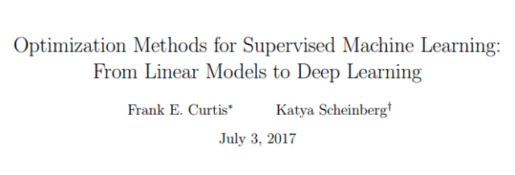
> 
> 论文链接：https://arxiv.org/abs/1706.10207
> 
> 摘要：本篇论文旨在介绍关于将最优化方法应用于机器学习的关键模型、算法、以及一些开放性问题。这篇论文是写给有一定知识储备的读者，尤其是那些熟悉基础优化算法但是不了解机器学习的读者。首先，我们推导出一个监督学习问题的公式，并说明它是如何基于上下文和基本假设产生各种优化问题。然后，我们讨论这些优化问题的一些显著特征，重点讨论 logistic 回归和深层神经网络训练的案例。本文的后半部分重点介绍几种优化算法，首先是凸 logistic 回归，然后讨论一阶方法，包括了随机梯度法（SGD）、方差缩减随机方法（variance reducing stochastic method）和二阶方法的使用。最后，我们将讨论如何将这些方法应用于深层神经网络的训练，并着重描述这些模型的复杂非凸结构所带来的困难。
> 
> **1 引言**
> 
> 在过去二十年里，机器学习这一迷人的算法领域几乎以史无前例的速度崛起。机器学习以统计学和计算机科学为基础，以数学优化方法为核心。事实上，近来优化方法研究领域中的许多最新理论和实际进展都受到了机器学习和其它数据驱动的学科的影响。然而即使有这些联系，统计学、计算机科学和致力于机器学习相关问题的优化方法研究之间仍存在许多障碍。因此本文试图概述机器学习学习算法而打破这种障碍。
> 
> 本篇论文的目的是给出与机器学习领域相关的一些关键问题和研究问题的概述。考虑到涉及运筹学领域的知识，我们假设读者熟悉基本的优化方法理论，但是仍将引入在广义机器学习领域使用的相关术语和概念，希望借此促进运筹学专家和其它贡献领域的人员之间的沟通。为了实现这一目的，我们在词汇表 1 中列出了本论文将介绍和使用的最重要的术语。
> 
> 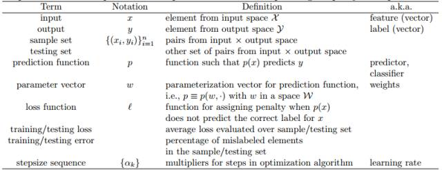
> 
> *表 1 ： 监督机器学习的术语表（监督机器学习的目的之一就是理解输入空间 X 中每个输入向量 x 和输出空间 Y 中相应输出向量 y 之间的关系）*
> 
> **1.1 阐明动机**
> 
> **1.2 学习问题和优化问题**
> 
> **1.3 学习边界、过拟合和正则化**
> 
> **2 解决 Logistic 回归问题的优化方法（浅层模型的优化方法）**
> 
> 当 L 和 r 是关于 w 的任意凸函数时，可以运用在本节中讨论的方法来解决问题（11）：
> 
> 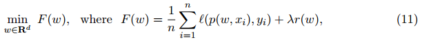
> 
> 这一类中包含很多机器学习模型，包括支持向量机、Lasso（Least Absolute Shrinkage and Selection Operator）、稀疏逆协方差选择等。有关这些模型的详细信息请参见 [86] 和其中的参考文献。为了每一步都能具体（展现出来），此处我们指定以二分类的正则化 logistic 回归为例（进行讲解）。为了简化例子中的符号，我们作不失一般性的假设，令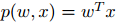。（此处省去了偏置项 b0），这一省略操作可以通过在输入向量上增加一维恒为 1 的特征值来弥补）。当 w 和 x 都是 d 维时就可以令其为特定的凸优化问题。
> 
> 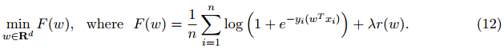
> 
> 值得一提的是，对于此类问题，正则化项必不可少。想一想为什么说它必不可少，假设对于所有的 i ∈{1,...,n}，有参数向量 w，满足 yi(wT*xi) > 0 以及（存在）无界射线 {θw : θ > 0}。那问题就很明朗了，在这个例子中，当 θ →∞时，
> 
> 
> 
> 也就是说函数（式 12）无法取最小值。另一方面，通过增加（强制）正则化函数 r，可以保证问题（12）将具有最优解。
> 
> 对于正则化函数 r，我们将会参考常用选择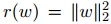和 r(w) = ||w||1。不过为了简单起见，我们通常会选择前者，因为它使得公式 12 对于每一个因子是连续可微的。相反，r(w) = ||w||1 会导致非平滑问题，为此，（实现）函数最小化就需要更复杂的算法。
> 
> **2.1 一阶方法**
> 
> 我们首先讨论用一阶方法求解问题（12），这里的」一阶」仅仅指对函数 F 中的参数进行一阶偏导的数学技巧。
> 
> 2.1.1 梯度下降法
> 
> 从概念上讲，最小化光滑凸目标的最简单的方法是梯度下降法，具体分析参见 [ 62 ]。在这种方法中，从初始化估计值 w0 开始，通过下述公式迭代地更新权重估计值。
> 
> 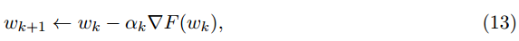
> 
> 其中 αk > 0 是一个步长参数。步长序列 {αk} 的选择直接决定此算法的性能。在优化研究领域，人们普遍认为，在每次迭代中采用线性搜索来确定 {αk }，可以为解决各种类型的问题找到一个性能优越的算法。然而，对于机器学习应用程序来说，这种运算成本高昂，因为每次函数 F 的计算都需要传递整个数据集，如果 n 过大，很可能带来高昂的（训练）成本。
> 
> 好在当每个αk 都设置为一个正的常数α且它是一个足够小的固定值时，从理论上分析，该算法的收敛性仍可以得到保证。（固定的步长常数在机器学习领域叫做学习率。但即使不是常数，也有人把αK 或整个序列 {αK } 叫做学习率）。该算法的收敛速度取决于函数 f 是强凸函数还是弱凸函数。
> 
> 用于解决 L1 范数正则化的 logistic 回归问题的梯度下降和加速梯度下降拓展算法分别被称作 ISTA 和 FISTA。我们观察到，在这种情况下，即使λ> 0，目标函数也不会是强凸函数。只有目标函数为凸时 [5]，ISTA 和 FISTA 具有与其对应的平滑函数相同的次线性收敛速度。
> 
> 梯度下降在 ML 训练过程中的一个重要特性就是计算出每次迭代中求解函数 F 的梯度的运算成本。在 ML 的训练过程中，单个梯度计算的成本通常是 O（ND），这个确实可以看到，例如，在正则化项为的情况中，函数 F 关于每一个特定的 w 的梯度是
> 
> 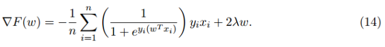
> 
> 2.1.2 随机梯度法
> 
> 随机梯度法由于其用于最小化随机目标函数而在运筹学领域广为人知，同时也是 ML 社区中的一种特征优化算法。该算法最初由 Robbins 和 Monro [ 67 ] 在解决随机方程组问题时提出，值得注意的是，它可以用于最小化具有良好收敛性的随机目标，而且每次迭代的计算复杂度仅为 O（d）而不是 O（nd）（梯度下降中的计算复杂度）。
> 
> 在每一次迭代中，随机梯度法都会计算梯度 F（Wk）的无偏估计 GK。该估计可以以及低的代价计算得到；例如，对于公式（12），某次迭代的随机梯度可被求解为
> 
> 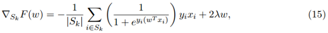
> 
> 其中 Sk 被称作小批量，它的所有元素都是从总数据集 {1,...,n} 中按均匀分布选出来的。接下来的运算类似于梯度下降：
> 
> 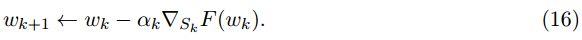
> 
> 毫无疑问，该算法的关键在于选择步长序列 {αk}。不同于梯度下降，固定的步长（即学习率）不能保证算法会收敛到强凸函数 F 的最小值，而只保证收敛到最小值的邻域。
> 
> SGD 的收敛速度比梯度下降慢。尤其当函数 F 是强凸函数时，该算法只保证当 k ≥ O(1/ε) 时可以得到预期精度的解（即满足 E[F(wk)]-F(w) ≤ ε的解），而当函数 F 仅仅是凸函数时，只有在 k ≥ O(1/ε²) [11] 时才能保证得出上述解。
> 
> 另一方面，正如前文提及的，如果 Sk 的大小由一个常数限定（独立于 n 或 k 的常数），那么 SGD 的每次的迭代成本都比梯度下降法小 0（n）倍。
> 
> 然而，在实际运用中，标准的 SGD 并不一定是解决机器学习中优化问题的最有效方法。事实上，机器学习和优化算法领域在开发改进或替代 SGD 方面进行了大量的积极研究。在随后的两部分中，我们将讨论两类方法：方差缩减法和二阶方法。但是在这两类方法以外，还有多种方法。例如，加有动量的 SGD 就是一个实践中被发现的性能好于好于标准 SGD 的拓展版 SGD。见下图算法 1
> 
> 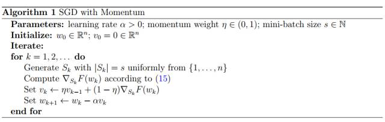
> 
> 2.1.3 方差缩减法（Variance reducing method）
> 
> 考虑到问题（11），人们发现通过利用目标 F 的结构作为 n 个函数的有限和再加上简单的凸函数项，可以改善 SGD 方法。目前已经研究出几种方法，如 SAG [74]，SAGA [22]，SDCA [76] 和 SVRG [44]。
> 
> 为了方便引用，我们把 SVRG 叫做算法 2。该算法在每个外部迭代中执行一次完整的梯度计算，然后沿着随机方向再迭代 L 步，这是整个梯度的随机修正过程。内环步长 L（inner loop size）必须满足一定的条件以保证收敛 [ 44 ]。
> 
> 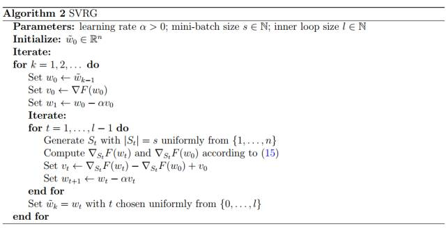
> 
> SVRG，全称为随机方差减小梯度，其名称源自于该算法可以被视为 SGD 的方差减小变体（尤其是有限和最小化/finite-sum minimization）。
> 
> 研究员通过结合 SVRG 和 SAGA 的一些思想，提出一个新的方法，叫做 SARAH。仅是内层迭代步长不同于 SVRG，SARAH 的公式如下
> 
> 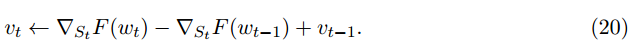
> 
> 该变化导致 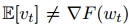，使得 SARAH 中的步长不基于无偏梯度估计。不过，相对于 SVRG，它获得了改进的收敛特性。
> 
> 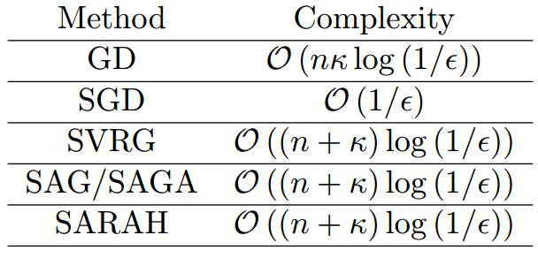
> 
> *表 2 ： 最小化强凸函数的一阶方法计算复杂度*
> 
> 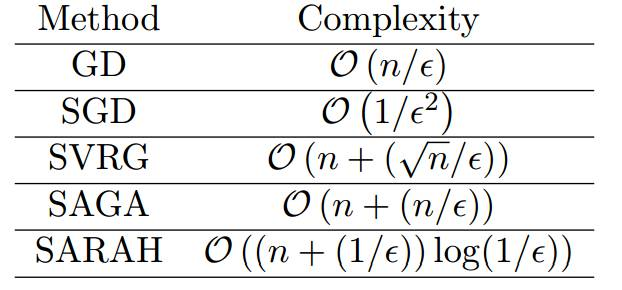
> 
> *表 3 ： 最小化一般凸函数的一阶方法计算复杂度*
> 
> **2.2 二阶方法和拟牛顿法**
> 
> 受确定性优化研究领域几十年研究成果的激励，ML 优化中最活跃的研究领域之一就是关于如何使用二阶导数（即曲率）信息来加速训练。
> 
> 不幸的是，当 n 或 d 很大时，在机器学习应用程序中，海塞矩阵（Hessian matrix）的计算和存储变得非常昂贵。
> 
> 另一类基于形如（21）模型的算法是拟牛顿方法：
> 
> 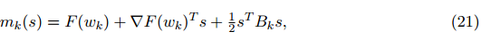
> 
> 有趣的是，这些方法没有计算出显式二阶导数，而是通过在每次迭代中应用低秩更新构造完全由一阶导数的海塞近似矩阵。例如，让我们简要介绍最流行的拟牛顿算法，全称为 Broyden-Fletcher-Goldfarb-Shanno（BFGS）方法。在这种方法中，我们首先可以看到（21）的最小值为、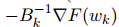进一步发现它实际上可以方便地计算出逆 Hessian 近似。由于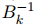随着步长 sk = w_k+1 − wk 和位移 yk = ∇F(wk+1) − ∇F(wk) 的移动，有人选择 以最小化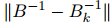以满足割线方程 sk = (B^-1)yk。使用精心挑选的规范表达，这个问题的解析式可以显示的写成
> 
> 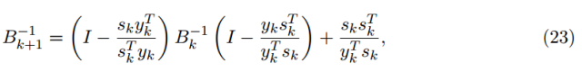
> 
> 其中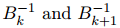之间的差异可以仅表示为二阶矩阵。
> 
> 为方便引用，完整的经典 BFGS 算法被称为算法 3。
> 
> 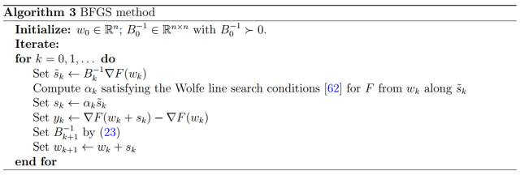
> 
> 即使采用二阶信息，随机优化方法（无差异减少）也无法达到比次线性更快的收敛速度。不过，使用二阶信息是一个不错的想法，因为如果海塞近似矩阵收敛于海塞矩阵的真实解，则可以减少收敛速度中的常数，同时还可以减少病态（ill-conditioning）的影响。
> 
> 不幸的是，尽管已经观察到了实际的效率提升，但在理论上还没有一个真正的二阶方法，可以实现这样的提升。到目前为止，只要海塞（近似）矩阵保持良好特性，大多数实际的方法只能保证实现 SGD 的收敛（速率）特性。例如，如果序列 {Bk}（不一定由 BFGS 更新生成）对所有 k 满足：
> 
> 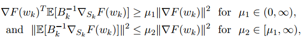
> 
> 此时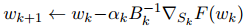具有与 SGD 相同的收敛速度属性。我们就 可以合理地假设这些限定适用于上述讨论的方法，这些假设有适当的保障。然而，在拟牛顿方法的背景下应该小心，其中随机梯度估计可能与海塞近似相关。
> 
> **3 深度学习**
> 
> 沿着这些方向进行的主要进展包括深层神经网络（DNN）的运用。机器学习的一个相应的分支称为深度学习（或分层学习），它代表了一类试图通过使用包含连续线性和非线性变换的多层次深层图来构造数据中高层次抽象的算法 [6, 51, 73, 37, 38, 23]。近年来科学家们已经研究了各种神经网络类型，包括全连接神经网络（FNN）[84,28]，卷积神经网络（CNN）[50] 和循环神经网络（RNN）[41,57,52]。对于我们来说，将主要关注前两类神经网络，同时留意其它网络。
> 
> **3.1 问题公式化**
> 
> **3.2 随机梯度下降法**
> 
> 我们引用以下内容来强调将优化算法应用于训练 DNN 的令人困惑的反应。首先，例如在 [11] 中，有一个结论表明，通过应用 SGD 来最小化非凸目标函数（一直从输入×输出空间绘制），可以保证预期梯度风险将消失，至少在一个子序列上是这样，即：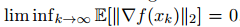。这一结论令人欣慰，这表明 SGD 可以实现与其他最先进的基于梯度的优化算法类似的收敛保证。然而，尽管文献中的种种保证是有局限性的; 毕竟，尽管许多基于梯度的优化算法确保目标函数单调减少，但 SG 并不以这种方式计算。因此，如果一个子序列收敛到一个固定点，那么我们怎么能确定该点不是鞍点，或者是有误差局部最小值，亦或是一些目标值比初始点差的最大值？事实上，我们并不能肯定。也就是说，SGD 方法通常擅长找到局部极小值，而不是全局最小值。另一方面，SGD 往往会在固定值附近减缓收敛速度，这可能会阻碍它在深度神经网络中发展。
> 
> 一般来说，对于非凸问题，SGD 的收敛速度记录在 [29,30]，但是它们非常有限，特别是它们不适用于§1.3 中的讨论。因此，我们不能以同样的方式争论 SGD 是机器学习中非凸优化问题的最佳方法。此外，下式
> 
> 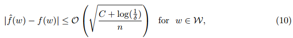
> 
> 中的学习界限是没有用的，因为对于许多 DNN 和 CNN，由神经网络产生的分类的复杂度 C 比训练样本数 n 大得多。事实上，在 [90] 中，经验表明，只有这些集合中的数据随机扰动，神经网络才能轻易地超过典型的数据集类型。
> 
> **3.3 海塞-自由优化方法（Hessian-free method）**
> 
> 有研究者发现我们可以修改 DNN 的反向传播算法来计算这样的海塞-矢量乘积，因为它们可以被看作是方向导数 [65]。计算这种乘积的复杂度只是比计算梯度多一个常数因子。所得到的类的方法通常被称为海塞-自由优化方法，因为当访问和使用 Hessian 信息时，没有显式地存储 Hessian 矩阵。
> 
> 由于目标函数的非凸性，在 DNN 的情况中出现了其它的问题，真正的海塞矩阵可能不是正定矩阵。一般来说，在确定性优化中，处理这个问题的两种可能的方法是修改海森矩阵和运用置信域（trust region）方法。这两种方法都在训练 DNN 的情况中探讨过，例如，在 [54,55] 中，提出了一种高斯牛顿法，其在（11）中函数 F 的 Hessian 的公式中的第一项近似于 Hessian 矩阵（省略了正则化项）
> 
> 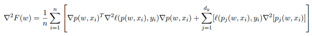
> 
> 其中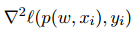是关于第一个参数的损失函数 l(·, ·) 的海塞矩阵，∇p(w, xi) 是 dy-维函数 p(w, x) 对于权重 w 的雅可比式，∇² [pj (w, xi)] for all j ∈ {1, . . . , dy} 是关于 w 的按元素运算的海塞矩阵。
> 
> **3.4 子采样海森方法（Subsampled Hessian method）**
> 
> 最近，在一系列论文（3, 15, 34）中，研究员们利用一个很一般的随机模型框架，对凸区域和非凸情形下的置信域、线搜索和自适应三次正则化方法进行了分析。在这项工作中，它表明，只要梯度和 Hessian 估计是足够准确的一些正概率，使用随机不精确梯度和 Hessian 信息的标准优化方法就可以保留其收敛速度。
> 
> 在机器学习和采样 Hessian 和梯度的情况下，结果只要求| SK |必须选择足够大的相对于该算法采取的步骤的长度。例如，在 [ 3, 34 ]，| SK |大小与置信域半径的关系。需要注意的是，对于采样的海塞矩阵，其对样本集的大小要求比采样的梯度要高得多，因此支持使用精确梯度的海塞估计的思想催生了强大的算法，它拥有强大理论支撑和良好的实践高效性。 ************
> 
> ******本文为机器之心编译，***转载请联系本公众号获得授权******。***
> 
> ✄------------------------------------------------
> 
> **加入机器之心（全职记者/实习生）：hr@jiqizhixin.com**
> 
> **投稿或寻求报道：editor@jiqizhixin.com**
> 
> **广告&商务合作：bd@jiqizhixin.com**
> 
> **点击阅读原文，查看机器之心官网↓↓↓**