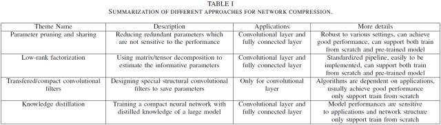
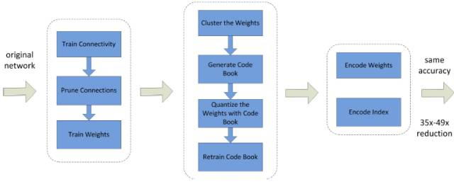
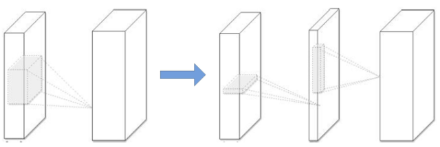
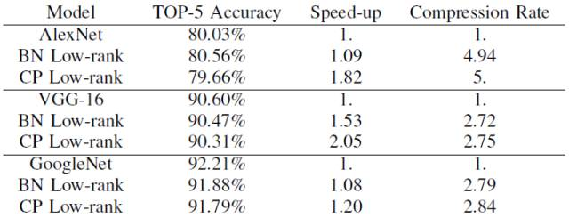
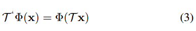
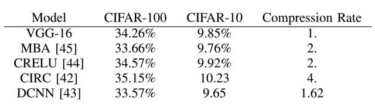
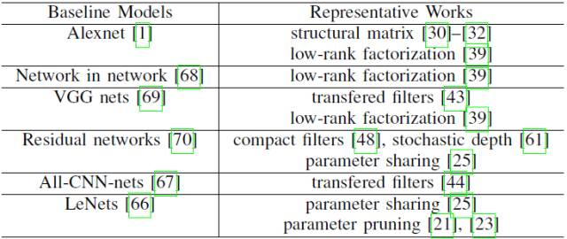

# 综述论文：当前深度神经网络模型压缩和加速方法速览

选自 arXiv

**作者：Yu Cheng 等**

**机器之心编译**

**参与：蒋思源、路雪、刘晓坤**

> 本文全面概述了深度神经网络的压缩方法，主要可分为参数修剪与共享、低秩分解、迁移/压缩卷积滤波器和知识精炼，本论文对每一类方法的性能、相关应用、优势和缺陷等进行独到的分析。机器之心简要介绍了该论文，更详细的内容请查看原论文。

大型神经网络具有大量的层级与结点，因此考虑如何减少它们所需要的内存与计算量就显得极为重要，特别是对于在线学习和增量学习等实时应用。此外，近来智能可穿戴设备的流行也为研究员提供了在资源（内存、CPU、能耗和带宽等）有限的便携式设备上部署深度学习应用提供了机会。高效的深度学习方法可以显著地影响分布式系统、嵌入式设备和用于人工智能的 FPGA 等。典型的例子是 ResNet-50[5]，它有 50 层卷积网络、超过 95MB 的储存需求和计算每一张图片所需要的浮点数乘法时间。如果剪枝一些冗余的权重后，其大概能节约 75% 的参数和 50% 的计算时间。对于只有兆字节资源的手机和 FPGA 等设备，如何使用这些方法压缩模型就很重要了。

实现这个目标需要联合多个学科以寻找解决方案，包括但不限于机器学习、最优化、计算机架构、数据压缩、索引和硬件设计等。在本论文中，我们回顾了在压缩和加速深度神经网络方面的工作，它们广泛受到了深度学习社区的关注，并且近年来已经实现了很大的进展。

我们将这些方法分为四个类别：参数修剪和共享、低秩分解、迁移/压缩卷积滤波器和知识精炼等。基于参数修剪（parameter pruning）和共享的方法关注于探索模型参数中冗余的部分，并尝试去除冗余和不重要的参数。基于低秩分解（Low-rank factorization）技术的方法使用矩阵/张量分解以估计深层 CNN 中最具信息量的参数。基于迁移/压缩卷积滤波器（transferred/compact convolutional filters）的方法设计了特殊结构的卷积滤波器以减少存储和计算的复杂度。而知识精炼（knowledge distillation）则学习了一个精炼模型，即训练一个更加紧凑的神经网络以再现大型网络的输出结果。

在表 1 中，我们简单地总结了这四种方法。通常参数修剪和分享、低秩分解和知识精炼方法可以通过全连接层和卷积层用于 DNN，它们能实现有竞争力的性能。另外，使用迁移/压缩滤波器的方法只适用于全卷积神经网络。低秩分解和迁移/压缩滤波器的方法提供了一种端到端的流程，并且它们很容易直接在 CPU/GPU 环境中实现。而参数修剪和共享使用了不同的方法，如向量量化、二进制编码和系数约束以执行这些任务，通常他们需要花一些处理步骤才能达到最终的目标。

*表 1\. 不同的模型压缩方法。*

至于训练协议，基于参数修剪/共享、低秩分解的模型可以从预训练的模型中抽取或者从头开始训练，这些训练比较灵活高效。而迁移/压缩滤波器和知识精炼模型只支持从头开始训练。这些方法独立设计，互为补充。例如，迁移层和参数修剪/共享可以一起使用，模型量化/二进制化（binarization）可以和低秩分解一起使用，以实现进一步提速。论文作者详细介绍了每一类方法，包括特性、优势和缺陷等。

**参数修剪和共享**

根据减少冗余（信息冗余或参数空间冗余）的方式，这些技术可以进一步分为三类：模型量化和二进制化、参数共享和结构化矩阵（structural matrix）。

**A. 量化和二进制化**

网络量化通过减少表示每个权重所需的比特数来压缩原始网络。Gong et al. [6] 和 Wu et al. [7] 对参数值使用 K 均值标量量化。Vanhoucke et al. [8] 展示了 8 比特参数量化可以在准确率损失极小的同时实现大幅加速。[9] 中的研究在基于随机修约（stochastic rounding）的 CNN 训练中使用 16 比特定点表示法（fixed-point representation），显著降低内存和浮点运算，同时分类准确率几乎没有受到损失。

[10] 提出的方法是首先修剪不重要的连接，重新训练稀疏连接的网络。然后使用权重共享量化连接的权重，再对量化后的权重和码本（codebook）使用霍夫曼编码，以进一步降低压缩率。如图 1 所示，该方法首先通过正常的网络训练来学习连接，然后再修剪权重较小的连接，最后重新训练网络来学习剩余稀疏连接的最终权重。

缺陷：此类二元网络的准确率在处理大型 CNN 网络如 GoogleNet 时会大大降低。另一个缺陷是现有的二进制化方法都基于简单的矩阵近似，忽视了二进制化对准确率损失的影响。

*图 1\. [10] 中提到的三阶段压缩方法：修剪、量化（quantization）和霍夫曼编码。修剪减少了需要编码的权重数量，量化和霍夫曼编码减少了用于对每个权重编码的比特数。稀疏表示的元数据包含压缩率。压缩机制不会带来任何准确率损失。*

**B. 剪枝和共享**

网络剪枝和共享已经被用于降低网络复杂度和解决过拟合问题。有一种早期应用的剪枝方法称为偏差权重衰减（Biased Weight Decay），其中最优脑损伤（Optimal Brain Damage）和最优脑手术（Optimal Brain Surgeon）方法基于损失函数的 Hessian 矩阵减少连接的数量，他们的研究表明这种剪枝方法的精确度比基于重要性的剪枝方法（比如 weight dDecay 方法）更高。

缺陷：剪枝和共享方法存在一些潜在的问题。首先，若使用了 L1 或 L2 正则化，则剪枝方法需要更多的迭代次数才能收敛，此外，所有的剪枝方法都需要手动设置层的敏感度，即需要精调超参数，在某些应用中会显得很冗长繁重。

**C. 设计结构化矩阵**

如果一个 m x n 阶矩阵只需要少于 m×n 个参数来描述，就是一个结构化矩阵（structured matrix）。通常这样的结构不仅能减少内存消耗，还能通过快速的矩阵-向量乘法和梯度计算显著加快推理和训练的速度。

**低秩分解和稀疏性**

一个典型的 CNN 卷积核是一个 4D 张量，需要注意的是这些张量中可能存在大量的冗余。而基于张量分解的思想也许是减少冗余的很有潜力的方法。而全连接层也可以当成一个 2D 矩阵，低秩分解同样可行。

所有近似过程都是一层接着一层做的，在一个层经过低秩滤波器近似之后，该层的参数就被固定了，而之前的层已经用一种重构误差标准（reconstruction error criterion）微调过。这是压缩 2D 卷积层的典型低秩方法，如图 2 所示。

*图 2\. CNN 模型压缩的低秩近似（Low-rank approximation）。左：原始卷积层。右：使用秩 K 进行低秩约束的卷积层。*

*表 2\. 低秩模型及其基线模型在 ILSVRC-2012 数据集上的性能对比。*

缺陷：低秩方法很适合模型压缩和加速，该方法补充了深度学习的近期发展，如 dropout、修正单元（rectified unit）和 maxout。但是，低秩方法的实现并不容易，因为它涉及计算成本高昂的分解操作。另一个问题是目前的方法逐层执行低秩近似，无法执行非常重要的全局参数压缩，因为不同的层具备不同的信息。最后，分解需要大量的重新训练来达到收敛。

**迁移/压缩卷积滤波器**

使用迁移卷积层对 CNN 模型进行压缩受到 [42] 中研究的启发，该论文介绍了等变群论（equivariant group theory）。使 x 作为输入，Φ(·) 作为网络或层，T (·) 作为变换矩阵。则等变概念可以定义为：

即使用变换矩阵 T (·) 转换输入 x，然后将其传送至网络或层Φ(·)，其结果和先将 x 映射到网络再变换映射后的表征结果一致。

根据该理论，将变换矩阵应用到层或滤波器Φ(·) 来对整个网络模型进行压缩是合理的。

*表 3\. 基于迁移卷积滤波器的不同方法在 CIFAR-10 和 CIFAR-100 数据集上的性能对比。*

缺陷：将迁移信息应用到卷积滤波器的方法需要解决几个问题。首先，这些方法的性能可与宽/平坦的架构（如 VGGNet）相媲美，但是无法与较窄/特殊的架构（如 GoogleNet、Residual Net）相比。其次，迁移假设有时过于强大以致于无法指导算法，使得在某些数据集上的结果不稳定。

**知识精炼**

据我们所知，Caruana 等人 [49] 首先提出利用知识迁移（KT）来压缩模型。他们通过集成强分类器标注的伪数据训练了一个压缩模型，并再现了原大型网络的输出结果。然而他们的工作仅限于浅层网络。这个想法近来在 [50] 中扩展为知识精炼（Knowledge Distillation/KD），它可以将深度和宽度的网络压缩为浅层模型，该压缩模型模仿了复杂模型所能实现的功能。KD 的基本思想是通过软 softmax 学习教师输出的类别分布而降大型教师模型（teacher model）的知识精炼为较小的模型。

[51] 中的工作引入了 KD 压缩框架，即通过遵循学生-教师的范式减少深度网络的训练量，这种学生-教师的范式即通过软化教师的输出而惩罚学生。该框架将深层网络（教师）的集成压缩为相同深度的学生网络。为了完成这一点，学生学要训练以预测教师的输出，即真实的分类标签。尽管 KD 方法十分简单，但它同样在各种图像分类任务中表现出期望的结果。

缺点：基于 KD 的方法能令更深的模型变得更加浅而显著地降低计算成本。但是也有一些缺点，例如 KD 方法只能用于具有 Softmax 损失函数分类任务，这阻碍了其应用。另一个缺点是模型的假设有时太严格了，以至于其性能有时比不上其它方法。

*表 4\. 模型压缩不同的代表性研究中使用的基线模型。*

**讨论与挑战**

深度模型的压缩和加速技术还处在早期阶段，目前还存在以下挑战：

*   剪枝是一种压缩和加速 CNN 的有效方式。目前大多数的剪枝技术都是以减少神经元之间的连接设计的。另一方面，对通道进行剪枝可以直接减小特征映射的宽度并压缩模型。这很有效，但也存在挑战，因为减少通道会显著地改变下一层的输入。确定这类问题的解决方式同样很重要。

*   正如之前所提到的，结构化矩阵和迁移卷积滤波器方法必须使模型具有人类先验知识，这对模型的性能和稳定性有显著的影响。研究如何控制强加先验知识的影响是很重要的。

*   知识精炼（knowledge distillation/KD）方法有很多益处比如不需要特定的硬件或实现就能直接加速模型。开发基于 KD 的方法并探索如何提升性能仍然值得一试。

*   多种小型平台（例如，移动设备、机器人、自动驾驶汽车）的硬件限制仍然是阻碍深层 CNN 扩展的主要问题。如何全面利用有限的可用计算资源以及如何为这些平台设计特定的压缩方法仍然是个挑战。

**论文：**A Survey of Model Compression and Acceleration for Deep Neural Networks

论文链接：https://arxiv.org/abs/1710.09282

深层卷积神经网络（CNN）目前已经在很多视觉识别任务中达到了非常准确的表现。然而，目前的深层卷积神经网络模型非常耗费计算资源和内存，面临着在终端部署和低延迟需求场景下难以应用的问题。因此，一种很自然的解决方案就是在保证分类准确率不显著下降的前提下对深层卷积神经网络进行压缩和加速。近年来，该领域实现了极大的发展。我们将在本论文中介绍近期压缩和加速 CNN 模型的先进技术。这些技术可以大致分为四类：参数修剪和共享（parameter pruning and sharing）、低秩分解（low-rank factorization）、迁移/压缩卷积滤波器（transfered/compact convolutional filter）和知识精炼（knowledge distillation）。参数修剪和共享的方法将在论文开头详细描述，其他几类方法也都会在文中介绍。我们对每一类方法的性能、相关应用、优势和缺陷等进行独到的分析。然后本文将介绍几个最近的其他成功方法，如动态网络和随机深度网络（stochastic depths network）。之后，我们将研究评估矩阵（evaluation matrix）——用于评估模型性能和近期基准的主要数据集。最后，我们总结并讨论了现有的挑战和可能的发展方向。 

****本文为机器之心编译，**转载请联系本公众号获得授权****。**

✄------------------------------------------------

**加入机器之心（全职记者/实习生）：hr@jiqizhixin.com**

**投稿或寻求报道：content@jiqizhixin.com**

**广告&商务合作：bd@jiqizhixin.com**