# 深度 | 从修正 Adam 到理解泛化：概览 2017 年深度学习优化算法的最新研究进展

选自 Ruder Blog

**作者：Sebastian Ruder**

**机器之心编译**

**参与：****刘晓坤、路雪、蒋思源**

> Sebastian Ruder 的这篇博客总结了 2017 年深度学习优化算法的最新进展，他主要从 Adam 算法的局限性与提升方法、学习率衰减方案、超参数搜索、怎样学习优化和理解泛化性能等角度向我们展示近来研究者对最优化方法的思考与探索。

深度学习终究是寻找一个使泛化性能足够好的（损失函数）极小值过程，它并不一定要求能搜索到非凸函数的最小值点，而需要模型的损失能得到显著性地降低，以收敛到一个可接受的极小值点。随机梯度下降（SGD）已经有 60 多年的历史（Robbins and Monro, 1951）[1]，通过应用于反向传播过程，它是当前深度学习算法最基本的组成部分。

近年来人们提出了多种优化算法，使用不同的方程更新模型的参数。Adam（Kingma and Ba, 2015）[18] 在 2015 年被提出，可以认为其在今天仍然是最常用的算法。因此从机器学习从业者的角度看来，深度学习最好的优化算法开发近年来基本没有太大的突破。

然而，今年我们开发了好几种新的方法被，它们有望优于当前最佳的方法，并用于未来复杂模型的优化中。在这篇博客中，我将介绍深度学习优化算法中几个最有意义的进展以及最有潜力的方向。这篇博客假定读者熟悉 SGD 和适应性学习率方法，如 Adam。如果想快速入门，可以查看 Ruder 以前的博客以概览当前已有的梯度下降优化算法：[深度解读最流行的优化算法：梯度下降](http://mp.weixin.qq.com/s?__biz=MzA3MzI4MjgzMw==&mid=2650720663&idx=3&sn=d9f671f77be23a148d1830448154a545&chksm=871b0de9b06c84ffaf260b9ba2a010108cca62d5ce3dcbd8c98c72c9f786f9cd460b27b496ca&scene=21#wechat_redirect)，或参见更加基础与入门的文章：[目标函数的经典优化算法介绍](https://mp.weixin.qq.com/s?__biz=MzA3MzI4MjgzMw==&mid=2650733850&idx=2&sn=00a0e8086ffb441c6cd7d858fc586367&scene=21#wechat_redirect)。

**提升 Adam 方法**

尽管如 Adam 那样的适应性学习率方法仍然是实际应用中绝对的主流，但如目标识别（Huang et al., 2017）[17] 或机器翻译（Wu et al., 2016）[3] 等计算机视觉和自然语言处理任务的最优结果仍然是由带动量的 SGD 算法实现。最近的理论（Wilson et al., 2017）[15] 为此提供了一些理由，他们的研究表明适应性学习率方法相对于带动量的 SGD 会收敛到不同或次优的极小值。从经验上来说，适应性学习率方法一般在目标识别、字符级语言建模和句法分析任务中要比带动量的 SGD 方法所搜索到的极小值差。这似乎是反直觉的，因为 Adam 一般保证了优良的收敛性，它的适应性学习率也比标准 SGD 的固定或指数衰减学习率更有优势。然而，Adam 和其它适应性学习率方法并不是没有缺陷的。

**去耦合指数衰减**

权重衰减因素可以部分解释 Adam 方法在一些数据集上比带动量的 SGD 方法泛化性能更差的原因。权重衰减广泛应用于图像分类问题中，它一般在参数更新后乘以一个稍微小于 1 的数值 w_t 而令权重 θ_t 得到衰减：

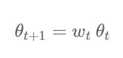

这样的过程可以避免权重的值增长过快，因此，它也可以理解为依赖于权重衰减率 w_t 的 L2 正则项：

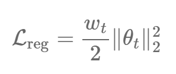

权重衰减在许多神经网络库中都有实现，一般它们都是作为上述的正则化项或直接应用于修正梯度。由于梯度在动量法和 Adam 更新方程（通过将衰减项与梯度相乘）中都有修改，因此权重衰减不再等同于 L2 正则项。Loshchilov 和 Hutter（2017）[19] 因此提出解耦合权重衰减方法，该方法通过将梯度更新添加到参数更新步骤之后而实现原定义中的权重衰减。带有动量和权重衰减的随机梯度下降（SGDW）的更新规则如下所示： 

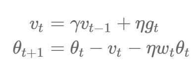

其中 η 为学习率，第二个方程式的第三项为解耦合权重衰减。同样，带权重衰减的 Adam 方法（AdamW）可以表示为：

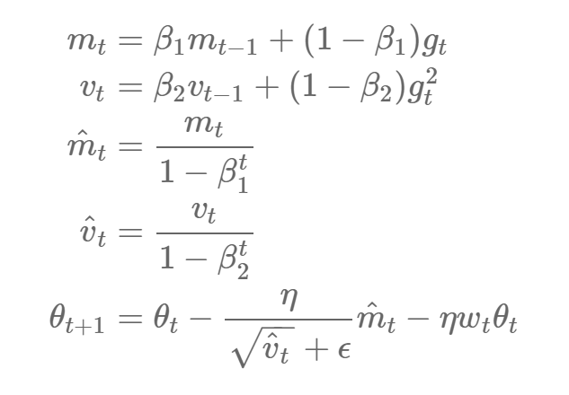

其中 m_t 和 m_t hat 、v_t 和 v_t hat 分别为一阶矩与二阶矩的有偏和偏差修正后的估计，β_1 和 β_2 分别为它们的衰减率，相同的权重衰减项也会添加到其中。作者还表示，这大大加强了 Adam 算法的泛化性能，且允许它在图像分类任务中获得像带动量的 SGD 方法那样的性能。

另外，Adam 方法可以解耦合学习率与权重衰减，即超参数之间不再相互依赖，这使得超参数优化更加优秀。它还将优化器的实现和权重衰减的实现分离开，因此能实现更简明与可复用的代码。

**修正指数滑动平均**

近来一些论文 (Dozat and Manning, 2017; Laine and Aila, 2017) [13,16] 经验性地发现较低的β_2 值 0.90 在各自的应用中要比默认值 0.999 更有效，β_2 即控制 Adam 算法中梯度平方的指数滑动平均值，这也就表明指数滑动平均模型可能会存在一些问题。

在 ICLR 2018 中，一份提交论文形式化地提出了这个问题，他们表示 Adam、RMSprop 和 Adadelta 等方法都是基于使用前面迭代所产生梯度平方的指数滑动平均值，在对该滑动平均值取平方根后用于缩放当前梯度以更新权重。指数均值的贡献是积极的：这种方法应该防止学习率在学习过程中变得逼近无穷小，这也是 Adagrad 算法关键的缺点。然而，这种梯度的短期记忆能力也成为了其它情况的障碍。

在 Adam 算法收敛到次优解的过程中，它已经观察到一些小批量数据提供了大量且具有信息的梯度，但是由于这些小批量数据发生地非常少，指数平均将降低它们的影响，这也就造成了 Adam 只能收敛到次优的极小值点。作者提供了一个简单的凸优化案例，其中 ADAM 方法并不能收敛到非常好的最优解。

为了解决这个问题，作者提出了一个新算法 AMSGrad，该算法使用过去梯度平方的最大值以替代指数平均值来更新参数。不带偏差修正估计的 AMSGrad 更新规则可以表示为：

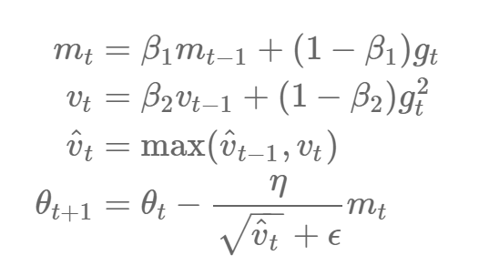

作者观察到该算法在 CIFAR-10 小数据集上的性能优于 Adam 方法。

**调整学习率**

在很多案例中，需要提高和调整的通常不是模型，而是超参数。最新的语言建模案例表明调整 LSTM 的参数（Melis 等,2017）[20] 和正则化参数（Merity 等,2017）[21] 可以获得与复杂模型相当的当前最佳结果。

优化深度学习的一个重要参数是学习率 η。实际上，SGD 已被证明需要结合学习率退火方案以收敛到极小值。人们通常认为适应性学习率方法例如 Adam 对不同的学习率有更好的鲁棒性。然而即使对这些方法，一个好的学习率和最优的学习率也有很大的不同。

Zhang 等人（2017）[2] 证明了 SGD 结合学习率退火方案和动量参数不仅可以取得和 Adam 算法相当的结果，其收敛速度还更快。另一方面，我们可能认为 Adam 学习率的适应性和学习率退火类似，但一个显式的退火方案仍然是有利的：如果添加 SGD 形式的学习率退火到 Adam 上，它能收敛得更快，并超越 SGD 在机器翻译上的性能（Denkowski 和 Neubig, 2017）[4]。

实际上，学习率退火方案工程可以当成一种新的特征工程，因为我们通常都能找到高度调优的（能提升模型最终收敛性能的）学习率退火方案。一个有趣的案例是 Vaswani 等（2017）[14]。虽然通常模型的超参数受大规模的超参数优化支配，实际上这些学习率退火方案对细节的相同关注也是很有趣的：作者使用的 Adam 超参数为 β_1=0.9，（非默认）β_2=0.98，ϵ=10^-9，以及可认为是最复杂的学习率退火方案的学习率设置：

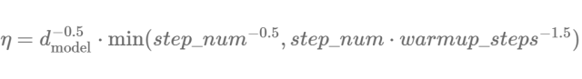

其中 d_model 是模型的参数数量，warmup_steps=4000。

另外一篇最新的由 Smith 等（2017）[5] 写的论文证明了学习率和批量大小之间的有趣关系，过去通常认为这两个参数是互相独立的。他们证明了衰减学习率等价于增加批量大小，而后者可以增加训练的并行度。相反地，我们可以通过增大学习率和减小批量大小，从而减少模型的更新频率以加快训练过程。这对大规模的深度学习有显著的效果，从而可以使我们重复利用已有的训练方案而不需要调整超参数。

**热启动**

**SGD 结合热启动**

另外一个有效的最新进展是 SGDR（Loshchilov and Hutter, 2017）[6]，这是一种使用热启动取代学习率衰减的 SGD 变体。每一次重启后，学习率被初始化为某些值，并按计划衰减。重要的是，这个重启属于热启动，因为优化过程不会再次从零开始，而是从模型在最后一步收敛的参数开始。其中的关键是学习率使用一种「激进的」余弦衰减方案，它会快速地降低学习率，如下所示：

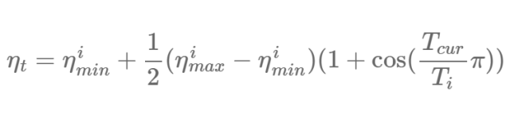

其中 η^i_min 和η^i_max 是在第 i 次迭代中学习率的取值范围，T_cur 表示自最后一次重启后的 epoch 数，T_i 表示下一次重启时的 epoch 数。热启动方案 T_i=50、T_i=100、T_i=200 和常规的学习率衰减的对比如图 1 所示。

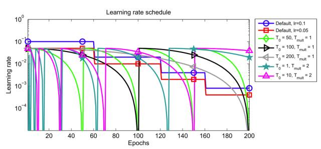

*图 1：结合热启动的学习率衰减方案（Loshchilov and Hutter, 2017）*

经过重启后的初始学习率基本作用是将参数从上次收敛到的极小值中重新「发散」出去，并到达损失曲面的另一个区域。激进的衰减方案允许模型快速收敛到一个新的更优解。作者通过经验发现 SGD 结合热启动需要的 epoch 数比学习率衰减少 2 到 4 倍，并能获得相当的结果。

学习率衰减结合热启动也被称为周期性学习率，由 Smith（2017）[22] 首次提出。

**Snapshot 集成**

Snapshot 集成（Snapshot ensembles，Huang 等,2017）[7] 是一种最新的巧妙技术，其使用热启动以在训练单个模型的时候不需要额外的代价就能集合多组参数。该方法训练单个模型直到使用余弦退火方案达到收敛（如上所述），然后保存模型参数，进行一次热启动，再重复这些过程 M 次。最后，所有保存的模型副本被集成起来。图 2 展示了常用的 SGD 优化和 Snapshot 集成在误差曲面上的行为的对比。

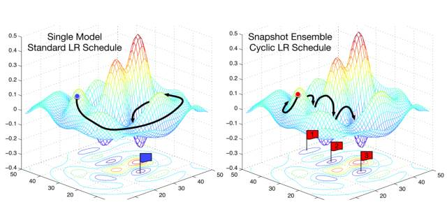

*图 2：SGD vs. snapshot 集成（Huang et al., 2017）*

集成的成功通常依赖于集成中单个模型的多样性。因此，snapshot 集成依赖于余弦退火程序的能力，使该模型在每次重启后收敛至不同的局部最优。论文作者展示了这在实践中证明是合理的，在 CIFAR-10、CIFAR-100 和 SVHN 数据集上实现了顶尖结果。

**具备热启动的 Adam**

热启动最初不能与 Adam 共同使用的，因其不正常的权重衰减。在权重衰减修复之后，Loshchilov 和 Hutter（2017）扩展 Adam，使其可以与热启动共同使用。他们的设置为 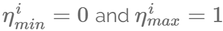，且这些变量都服从：

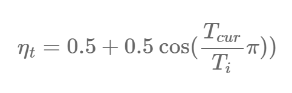

他们推荐开始时使用较小的 T_i 值（epoch 总数在 11 和 1010 之间），然后每次重启时使 T_i 乘 T_mult 的值（如 T_mult=2）。

**学习如何优化**

去年最有趣的论文之一（同时也是「Best paper name of 2016」的获奖者）是由 Andrychowicz 等人写的「Learning to learn by gradient descent by gradient descent」[23]，他们训练了一个 LSTM 优化器以在训练过程中更新主要的模型。不幸的是，学习一个分离的 LSTM 优化器或甚至使用一个预训练的 LSTM 优化器用于优化会大大增加模型模型训练过程的复杂度。

另外一个今年来很有影响力的学会学习的论文使用一个 LSTM 生成一个特定领域语言的模型架构（Zoph 和 Quoc, 2017）[24]。尽管搜索过程需要消耗大量的资源，其所发现的架构能达到替换已有架构的性能。该搜索过程被证明具备有效性，并且能找到达到当前最佳结果的语言建模架构，以及能找到和在 CIFAR-10 上获得的当前最佳结果相当的架构。

同样的搜索理论可以应用于任何其它关键过程已被人工预定义的领域，其中一个是深度学习中的优化算法。正如我们之前所看到的，优化算法之间其实很相似：所有的算法都结合了过去梯度的指数加权平均（如动量算法），以及过去梯度平方的指数加权平均（如 Adadelta、RMSprop 和 Adam）（Ruder,2016）[25]。Bello 等人（2017）[8] 定义了一种特定领域的语言，其由用于优化算法的（例如以上介绍的各种指数加权平均法）原词组成。然后，他们从可能更新规则的空间中采样一个更新规则，使用这个更新规则去训练一个模型，并基于已训练模型在测试集上的性能更新 RNN 控制器。完整的过程如图 3 所示。

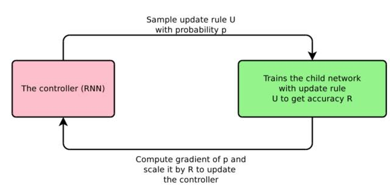

*图 3：神经优化器搜索（Bello 等，2017）*

特别地，他们发现了两个更新等式，PowerSign 和 AddSign。PowerSign 的更新等式如下所示：

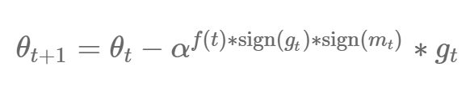

其中 α 是一个超参数，通常设为 e 或 2。f(t) 等于 1 或者表示线性、周期性的衰减函数，或者基于时间步的衰减和重启。m_t 是过去梯度的移动平均数。通常情况下设定 α=e 和无衰减。通过该等式我们可以观察到梯度通过 α^f(t) 或 1/α^f(t) 被缩放，增大还是减小取决于使用 sign 函数判断梯度和移动平均数的正负。这表明这种类动量算法关于当前梯度和过去梯度的关系是优化深度学习模型的关键部分。

而 AddSign 的更新等式如下所示：

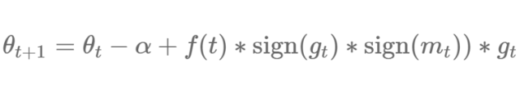

其中 α 通常设为 1 或 2。和 PowerSign 类似，梯度的缩放同样取决于梯度的方向。作者证明了 PowerSign 和 AddSign 超过了 Adam、RMSprop 和动量法在 CIFAR-10 的优化性能，并能很好地迁移到其它任务比如 ImageNet 分类和机器翻译等。

**理解泛化**

优化与泛化密切相关，因为模型可收敛至的极小值决定了该模型的泛化性能。因此，优化方面的进步与更深入地理解深度学习中的泛化密切相关。

但是，我们对深度神经网络中的泛化的理解仍然比较粗浅。近期的研究表明局部极小值数量随参数数量呈指数级增长（Kawaguchi, 2016）。即使当前深度学习架构具备大量参数，那它收敛至泛化效果好的解决方案仍然很难，尤其是此类模型可以完全存储随机输入（Zhang et al., 2017）。

Keskar et al.（2017）认为极小值的尖锐程度或陡峭程度是泛化性能不好的原因：尤其是，他们认为批量梯度下降导致的尖锐性极小值（近似尖点）存在很高的泛化误差。这给人的直观感觉是：正如我们通常希望函数比较平滑，尖锐性极小值代表对应误差曲面的高度不规则性。但是，更多近期研究发现泛化性能较好的局部极小值的尖锐程度可以是随机的，因此尖锐程度可能并非合适的指标（Dinh et al., 2017）。

正在接受 ICLR 2018 盲审的论文《On the importance of single directions for generalization》通过一系列对照分析证明模型的可靠性在于激活空间中的单个维度，即单个单元或特征图的激活是评估泛化性能的合适指标。此外，他们还发现 dropout 对此没有帮助，而批归一化降低了单向可靠性。

尽管这些发现表明我们对深度学习中的泛化仍然存在很多未知，但现在很多研究者在进行收敛保证和大量针对凸优化的研究，且现有的很多想法和见解都可以一定程度地用于非凸优化。

*参考文献详见原文，*原文地址：http://ruder.io/deep-learning-optimization-2017/**

****本文为机器之心编译，**转载请联系本公众号获得授权****。**

✄------------------------------------------------

**加入机器之心（全职记者/实习生）：hr@jiqizhixin.com**

**投稿或寻求报道：content@jiqizhixin.com**

**广告&商务合作：bd@jiqizhixin.com**