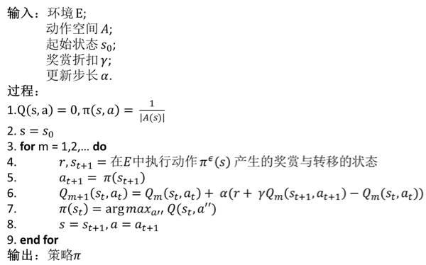

# 从强化学习基本概念到 Q 学习的实现，打造自己的迷宫智能体

选自 Medium

**作者：Aneek Das**

**机器之心编译**

**参与：蒋思源**

> *近年以来，强化学习在人工智能所充当的角色越来越重要了，很多研究机构和大学都将强化学习与深度学习相结合打造高性能的系统。因此，本文注重描述强化学习的基本概念与实现，希望能为读者介绍这一机器学习分支的巨大魅力。*

强化学习其实也是机器学习的一个分支，但是它与我们常见监督学习和无监督学习又不太一样。强化学习旨在选择最优决策，它讲究在一系列的情景之下，通过多步恰当的决策来达到一个目标，是一种序列多步决策的问题。该学习算法能帮助我们公式化表达生物体以奖励为动机（reward-motivated）的行为。比如说，让一个孩子坐下来安静地为考试而复习是十分困难的，但如果你在他每次学完一章时奖励一块巧克力，那么他就会明白只有保持学习才能获得奖励，因此也就有动力复习备考。而现在，如果这个孩子在备考时没有明确的方法，他可能会花大量时间学习一个章节而不能及时完成课程大纲。所以我们需要小孩有效率地学，因此如果小孩在一小时内完成某章节，那么就奖励大块巧克力，而超过 1 小时那就只奖励小块巧克力。现在他不仅会学习，同时大脑会思考设计出更快完成章节学习的方法。

在这个例子中，孩子就是代表着训练实体（Agent ：与环境交互的对象）。奖励系统和考试就代表着环境（Environment）。而章节就可以类比为强化学习的状态（States）。所以孩子们就需要决定哪些章节更重要（即计算每一个章节的值），这也就是价值函数（Value-Function）所做的事。并且小孩每次从一个状态到另一个状态就能收到奖励，而他随时间完成章节的方式就是策略（Policy）。

强化学习和其他机器学习范式有什么不同：

*   没有大量标注数据进行监督，所以也就不能由样本数据告诉系统什么是最可能的动作，训练主体只能从每一步动作得出奖励。因此系统是不能立即得到标记的，而只能得到一个反馈，也可以说强化学习是一种标记延迟的监督学习。

*   时间序列的重要性，强化学习不像其他接受随机输入的学习方法，其更注重序列型数据，并且下一步的输入经常依赖于前一状态的输入。

*   延迟奖励的概念，系统可能不会在每步动作上都获得奖励，而只有当完成整个任务时才会获得奖励。

*   训练实体的动作影响下一个输入。如你可以选择向左走或向右走，那么当选择的方向不同时，下一个时间步的输入也会不同。即选择不同的动作进入不同的状态后，当前可选的动作又不一样。

总的来说，强化学习的目标就是要寻找一个能使得我们获得最大累积奖赏的策略。因此，强化学习实际上和我们人类与环境的交互方式类似，是一套非常通用的框架，可以用来解决各种各样的人工智能的问题。

如上所示，在任何时间步（t），训练实体会得到一个环境的观察值（实例）。然后它会从所有可行动作中采取一种，并获得环境的奖励和下一个观察值。所以我们需要为训练实体提供算法，其所作出的决策应该是以最大化提升结束时的全部奖励为目的。

**历史与状态**

历史（History）是描述在环境和训练实体之间发生的所有事件的变量集合。

训练实体必须将历史映射到一个确切的动作中。对于环境，其必须将历史映射到需要发送的下一组观察值。因此，训练实体必须持续保持并储存大量的信息，这将占用大量的储存空间和处理时间。

所以，我们想创建历史的抽象表征，它可以储存足够的信息以便我们可以选择下一步动作，这也就是状态的概念。所以基本上系统的输出就取决于我们怎样定义状态。

在上式中，S 表征状态、f 表征一种能对时间步「t」的历史求和的函数。

上述表达式中，前一个代表训练实体的内部表征，其可以对历史求和并允许在以后采取动作。而后一个代表环境的内部表征，其允许发送下一个观察值。

**马尔可夫状态（Markov State）**

马尔可夫状态使用抽象形式储存过去所有的信息。所以如果训练实体预测未来的动作，其并不会使用全部的历史，而是使用马尔可夫状态。本质上来说，马尔可夫状态储存的信息并不比历史少。

所以在给定状态 St 的情况下求未来状态 St+1 的概率和给定前面所有状态求 St+1 的概率相同。这是因为状态 St 已经将前面所有状态的信息都嵌入了其中。

**序列的游戏**

现在假设有个游戏发生在餐厅里，餐厅提供三种食物：甜甜圈、饮料和三明治。现在顾客要求服务员带五样食品，且服务员会按顺序依次提供这五样食品。如果顾客喜欢这些食物的顺序，那么服务员将得到奖励，否则就会得到惩罚。现在服务员第一次提供食物的顺序如 S1 所示，他得到了奖励。

然而，当下一次服务员又以另一个顺序带来五份食品（S2）时，他得到了惩罚。那么现在第三个序列 S3 的输出是什么，奖励还是惩罚？

这里的解决方案取决于先前状态的定义。如果说状态的定义仅仅只是采用食物序列最后三项的顺序，那么根据 S1 最后三项的结果，S3 序列能获得奖励。然而如果根据每个食物出现的数量来定义，那么 S3 最有可能得到惩罚，因为 S2 和 S3 每一份食物的数量都相同。所以本质上系统的输出是依赖于状态的定义。

**环境**

如果你在电脑上玩自己编写的象棋，那么你就很清楚计算机是如何分析怎样下棋。所以基本上你知道在给定的行动下电脑确定的是哪一步棋。这是一种完全可观察的环境（Fully Observable Environment）。

现在如果你在玩由其他人编写的象棋游戏，你并不知道电脑下一步会怎么下。所以现在你能做的就是在下一步棋后观察电脑的下棋。这是一种部分可观察环境（Partially Observable Environment）。在这种情况下，你能做的就是预测游戏的内部动态，并期望能对其内部状态能有一个足够好的预测。

另外，根据周志华的《机器学习》，我们需注意「机器」与「环境」的界限。例如在种西瓜任务中，环境是西瓜生长的自然世界;在下棋对弈中，环境是棋盘与对手;在机器人控制中，环境是机器人的躯体与物理世界。总之，在环境中状态的转移、奖赏的返回是不受机器控制的，机器只能通过选择要执行的动作来影响环境，也只能通过观察转移后的状态和返回的奖赏来感知环境。

最后总结一下强化学习的概念，强化学习的输入 是：

*   状态 (States) = 环境，例如迷宫的每一格就是一个状态

*   动作 (Actions) = 在每个状态下，有什么行动是容许的

*   奖励 (Rewards) = 进入每个状态时，能带来正面或负面的价值 (utility)

而输出就是：

*   策略 (Policy) = 在每个状态下，你会选择哪个行动？

如上图所示，强化学习的思想主要：即训练实体 (Agent) 不断地采取动作 (action), 之后转到下一个状态 (State), 并且获得一个奖励 (reward), 从而进一步更新训练实体。

在了解了强化学习的基本概念后，我们就可以进一步理解 Q 学习（Q-Learning）的原理和实现。

下面我们将从迷宫寻宝游戏开始了解 Q 学习的基本概念。该游戏规则如下：

该游戏从一个给定的位置开始，即初始状态（starting state）。在每一个状态下训练实体都可以保留原地或选择向上、下、左、右移动，但不能穿越迷宫的边界。每个动作都将使得训练实体进入不同的单元格（即不同的状态）。现在在某个单元格有一个宝箱（即目标状态）。此外，迷宫的某些位置/状态有蛇。因此训练实体的目标就是通过寻找一条没有蛇的路径从起始状态走到目标状态。

现在当我们在网格中（即环境中）放置一个训练实体，它首先会开始探索。它最开始不知道蛇是什么，也不知道什么是宝箱或宝箱在哪。所以我们需要给定训练主体蛇和宝箱的概念，并在每一步动作后给予一定的奖励。对于每一块有蛇的单元格（状态），我们给予-10 的奖励，而对于宝藏，我们给予+10 的奖励。现在我们希望训练实体尽快完成任务（采取最短路径），因此我们给予其他状态-1 的奖励。最后我们给定训练实体的目标就是最大化最后累积得分。随着训练实体的探索，它会知道蛇是有害的，宝藏是有益的，并且它需要尽可能快地得到宝箱。上图中「-」就表示从起始状态到目标状态最短的路径。

Q 学习（Q-Learning）就尝试在给定状态下学习当前值，并采取特定的动作。

现在我们设计一张表格，其中每行是训练实体的状态，而每列是训练实体可能采取的动作。所以上例有 16×5 种可能的状态-行动对，其中每种状态都是迷宫中的一个单元格。

首先我们初始化矩阵（上文所述的 16×5 表格）为零矩阵，然后根据不同动作所获得的奖励更新矩阵的元素。当然，更新该矩阵的方法为计算贝尔曼方程（Bellman Equation）：

「S」代表当前状态，「a」代表训练实体在当前状态下所采取的动作，「S'」代表采取该动作所产生的状态，「r'」是采取该动作所得到的奖励。贴现系数（discount factor）「γ」决定了训练实体对未来奖励的重视程度，γ越大，训练实体就会越重视以往经验，而γ越小，训练实体只重视眼前的利益。如果说训练实体向远离目标状态的状态运动，而该状态遇到蛇的概率减少，那么实时奖励将减少，未来奖励将增加，训练实体更注重未来的奖励。

我们将每次迭代（训练主体的尝试动作）作为一个 episode。对于每一次 episode，训练主体将尝试到达目标状态，并且对于每一次动作，Q 矩阵元素都会进行一次更新。

现在让我们了解一下 Q 矩阵是如何计算的（为了更简洁，我们采用更小的 2×2 迷宫）：

Q 矩阵的初始状态如下（每行代表一个状态，每列代表一个动作）：

U—向上走, D—向下走, L—向左走, R—向右走

奖励矩阵如下所示：

其中 E 代表空值（NULL，训练主体不能采取该动作）

算法：

1.  初始化 Q 矩阵为零矩阵，设定「γ」值，完成奖励矩阵。

2.  对于每一 episode，选择一个随机起始状态（在这个案例中，我们严格限制起始状态为-1）。

3.  在当前状态（S）的所有可能动作中选择一个。

4.  作为该动作（a）的结果，训练主体移往下一个状态（S'）。

5.  对于状态（S'）产生的所有可能动作，选择 Q 值最大的动作。

6.  使用贝尔曼方程（Bellman Equation）更新 Q 矩阵。

7.  将下一个状态设置为当前状态。

8.  如果到达目标状态，结束算法。

我们可以从以下一段伪代码进一步理解：

现在假设训练主体从状态 1 开始，其可以采取动作 D 或 R。如果采取了动作 D，那么训练主体到达状态 3（蛇），并可以采取动作 U 或 R。现在取值γ = 0.8，那么方程有：

Q(1,D) = R(1,D) + γ*[max(Q(3,U) & Q(3,R))]

Q(1,D) = -10 + 0.8*0 = -10

其中，因为 Q 矩阵还没有更新，max(Q(3,U) & Q(3,R)) = 0。设定设定踩上蛇的奖励为-10。现在新的 Q 矩阵的值就如下所示：

现在，状态 3 为当前状态，从状态 3 采取了动作 R。训练主体就到达状态 4，并其可以采取动作 U 或 L。

Q(3,R) = R(3,R) + 0.8*[max(Q(4,U) & Q(4,L))]

Q(3,R) = 10 + 0.8*0 = 10

再一次更新 Q 矩阵的值：

所以，现在训练主体到达目标状态 4。接下来终止该进程，并进行更多的训练直到训练主体理解了所有状态和动作，且所有的 Q 矩阵元素成为常数。这也就意味为训练主体已经尝试了所有的状态-动作对。

这一过程的 Python 实现：

最后 Q 矩阵的输出：

*注：为便于理解，机器之心在原文基础上进行了扩展，原文链接如下：**https://medium.com/becoming-human/the-very-basics-of-reinforcement-learning-154f28a79071*

 ***机器之心正在寻找副主编、资深记者、大客户经理、活动执行经理等，查看详情及更多职位，请查看：[全球招聘 | 机器之心 ALL IN 了，你 CALL 吗？](http://mp.weixin.qq.com/s?__biz=MzA3MzI4MjgzMw==&mid=2650724980&idx=5&sn=27df019851d83ff328998aa4dbbd88b0&chksm=871b1e0ab06c971cb144cc118b0d6f49e59408386fb8763bde743f9b9e223b5489db9680998f&scene=21#wechat_redirect)**

******本文为机器之心编译，***转载请联系本公众号获得授权******。***

✄------------------------------------------------

**加入机器之心（全职记者/实习生）：hr@jiqizhixin.com**

**投稿或寻求报道：editor@jiqizhixin.com**

**广告&商务合作：bd@jiqizhixin.com***