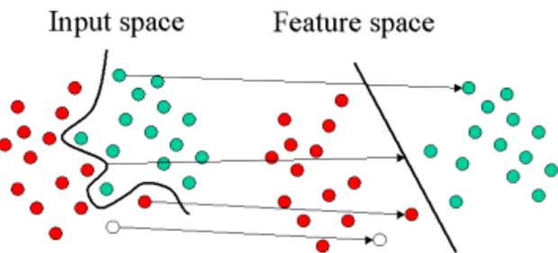

# 回归、分类与聚类：三大方向剖解机器学习算法的优缺点（附 Python 和 R 实现）

选自 EliteDataScience

**机器之心编译**

**参与：蒋思源、晏奇**

> *在本教程中，作者对现代机器学习算法进行一次简要的实战梳理。虽然类似的总结有很多，但是它们都没有真正解释清楚每个算法在实践中的好坏，而这正是本篇梳理希望完成的。因此本文力图基于实践中的经验，讨论每个算法的优缺点。而机器之心也在文末给出了这些算法的具体实现细节。*

对机器学习算法进行分类不是一件容易的事情，总的来看，有如下几种方式：生成与判别、参数与非参数、监督与非监督等等。

然而，就实践经验来看，这些都不是实战过程中最有效的分类算法的方式。因为对于应用机器学习而言，开发者一般会在脑海中有一个最终目标，比如预测一个结果或是对你的观察进行分类。

因此，我们想介绍另一种对算法进行分类的路数，其基于机器学习任务来分类。

**没有免费午餐定理**

在机器学习中，有个定理被称为「没有免费的午餐」。简而言之，就是说没有一个算法可以完美解决所有问题，而且这对于监督学习（即对预测的建模）而言尤其如此。

举个例子，你不能说神经网络就一定任何时候都比决策树优秀，反过来也是。这其中存在很多影响因素，比如你数据集的规模和结构。

所以，当你使用一个固定的数据测试集来评估性能，挑选最适合算法时，你应该针对你的问题尝试多种不同的算法。

当然，你所使用的算法必须要适合于你试图解决的问题，这也就有了如何选择正确的机器学习任务这一问题。做个类比，如果你需要打扫你的房子，你可能会用吸尘器、扫帚或者是拖把，但是你绝不会掏出一把铲子然后开始挖地。

**机器学习任务**

在本次梳理中，我们将涵盖目前「三大」最常见机器学习任务：

1.  回归方法

2.  分类方法

3.  聚类方法

**说明：**

*   本文的梳理不会涵盖具体领域的问题，比如自然语言处理。

*   本文也不会对每个算法都进行梳理。因为现有太多算法，而且新的算法也层出不穷。然而，这份清单将向读者展现对每个任务而言目前具有代表性的算法概览。

**1、回归方法**

回归方法是一种对数值型连续随机变量进行预测和建模的监督学习算法。使用案例一般包括房价预测、股票走势或测试成绩等连续变化的案例。

回归任务的特点是标注的数据集具有数值型的目标变量。也就是说，每一个观察样本都有一个数值型的标注真值以监督算法。

**1.1 线性回归（正则化）**

线性回归是处理回归任务最常用的算法之一。该算法的形式十分简单，它期望使用一个超平面拟合数据集（只有两个变量的时候就是一条直线）。如果数据集中的变量存在线性关系，那么其就能拟合地非常好。

在实践中，简单的线性回归通常被使用正则化的回归方法（LASSO、Ridge 和 Elastic-Net）所代替。正则化其实就是一种对过多回归系数采取惩罚以减少过拟合风险的技术。当然，我们还得确定惩罚强度以让模型在欠拟合和过拟合之间达到平衡。

*   优点：线性回归的理解与解释都十分直观，并且还能通过正则化来降低过拟合的风险。另外，线性模型很容易使用随机梯度下降和新数据更新模型权重。

*   缺点：线性回归在变量是非线性关系的时候表现很差。并且其也不够灵活以捕捉更复杂的模式，添加正确的交互项或使用多项式很困难并需要大量时间。

*   Python 实现：http://scikit-learn.org/stable/modules/linear_model.html 

*   R 实现：https://cran.r-project.org/web/packages/glmnet/index.html 

**1.2 回归树（集成方法）**

回归树（决策树的一种）通过将数据集重复分割为不同的分支而实现分层学习，分割的标准是最大化每一次分离的信息增益。这种分支结构让回归树很自然地学习到非线性关系。

集成方法，如随机森林（RF）或梯度提升树（GBM）则组合了许多独立训练的树。这种算法的主要思想就是组合多个弱学习算法而成为一种强学习算法，不过这里并不会具体地展开。在实践中 RF 通常很容易有出色的表现，而 GBM 则更难调参，不过通常梯度提升树具有更高的性能上限。

*   优点：决策树能学习非线性关系，对异常值也具有很强的鲁棒性。集成学习在实践中表现非常好，其经常赢得许多经典的（非深度学习）机器学习竞赛。

*   缺点：无约束的，单棵树很容易过拟合，因为单棵树可以保留分支（不剪枝），并直到其记住了训练数据。集成方法可以削弱这一缺点的影响。

*   随机森林 Python 实现：http://scikit-learn.org/stable/modules/ensemble.html#random-forests

*   随机森林 R 实现：https://cran.r-project.org/web/packages/randomForest/index.html

*   梯度提升树 Python 实现：http://scikit-learn.org/stable/modules/ensemble.html#classification

*   梯度提升树 R 实现：https://cran.r-project.org/web/packages/gbm/index.html

**1.3 深度学习**

深度学习是指能学习极其复杂模式的多层神经网络。该算法使用在输入层和输出层之间的隐藏层对数据的中间表征建模，这也是其他算法很难学到的部分。

深度学习还有其他几个重要的机制，如卷积和 drop-out 等，这些机制令该算法能有效地学习到高维数据。然而深度学习相对于其他算法需要更多的数据，因为其有更大数量级的参数需要估计。

*   优点：深度学习是目前某些领域最先进的技术，如计算机视觉和语音识别等。深度神经网络在图像、音频和文本等数据上表现优异，并且该算法也很容易对新数据使用反向传播算法更新模型参数。它们的架构（即层级的数量和结构）能够适应于多种问题，并且隐藏层也减少了算法对特征工程的依赖。

*   缺点：深度学习算法通常不适合作为通用目的的算法，因为其需要大量的数据。实际上，深度学习通常在经典机器学习问题上并没有集成方法表现得好。另外，其在训练上是计算密集型的，所以这就需要更富经验的人进行调参（即设置架构和超参数）以减少训练时间。

*   Python 资源：https://keras.io/

*   R 资源：http://mxnet.io/ 

**1.4 最近邻算法**

最近邻算法是「基于实例的」，这就意味着其需要保留每一个训练样本观察值。最近邻算法通过搜寻最相似的训练样本来预测新观察样本的值。

而这种算法是内存密集型，对高维数据的处理效果并不是很好，并且还需要高效的距离函数来度量和计算相似度。在实践中，基本上使用正则化的回归或树型集成方法是最好的选择。

**2、分类方法**

分类方法是一种对离散型随机变量建模或预测的监督学习算法。使用案例包括邮件过滤、金融欺诈和预测雇员异动等输出为类别的任务。

许多回归算法都有与其相对应的分类算法，分类算法通常适用于预测一个类别（或类别的概率）而不是连续的数值。

**2.1 Logistic 回归（正则化）**

Logistic 回归是与线性回归相对应的一种分类方法，且该算法的基本概念由线性回归推导而出。Logistic 回归通过 Logistic 函数（即 Sigmoid 函数）将预测映射到 0 到 1 中间，因此预测值就可以看成某个类别的概率。

该模型仍然还是「线性」的，所以只有在数据是线性可分（即数据可被一个超平面完全分离）时，算法才能有优秀的表现。同样 Logistic 模型能惩罚模型系数而进行正则化。

*   优点：输出有很好的概率解释，并且算法也能正则化而避免过拟合。Logistic 模型很容易使用随机梯度下降和新数据更新模型权重。

*   缺点：Logistic 回归在多条或非线性决策边界时性能比较差。

*   Python 实现：http://scikit-learn.org/stable/modules/linear_model.html#logistic-regression

*   R 实现：https://cran.r-project.org/web/packages/glmnet/index.html

**2.2 分类树（集成方法）**

与回归树相对应的分类算法是分类树。它们通常都是指决策树，或更严谨一点地称之为「分类回归树（CART）」，这也就是非常著名的 CART 的算法。

*简单的随机森林*

*   优点：同回归方法一样，分类树的集成方法在实践中同样表现十分优良。它们通常对异常数据具有相当的鲁棒性和可扩展性。因为它的层级结构，分类树的集成方法能很自然地对非线性决策边界建模。

*   缺点：不可约束，单棵树趋向于过拟合，使用集成方法可以削弱这一方面的影响。

*   随机森林 Python 实现：http://scikit-learn.org/stable/modules/ensemble.html#regression

*   随机森林 R 实现：https://cran.r-project.org/web/packages/randomForest/index.html

*   梯度提升树 Python 实现：http://scikit-learn.org/stable/modules/ensemble.html#classification

*   梯度提升树 R 实现：https://cran.r-project.org/web/packages/gbm/index.html

**2.3 深度学习**

深度学习同样很容易适应于分类问题。实际上，深度学习应用地更多的是分类任务，如图像分类等。

*   优点：深度学习非常适用于分类音频、文本和图像数据。

*   缺点：和回归问题一样，深度神经网络需要大量的数据进行训练，所以其也不是一个通用目的的算法。

*   Python 资源：https://keras.io/

*   R 资源：http://mxnet.io/ 

**2.4 支持向量机**

支持向量机（SVM）可以使用一个称之为核函数的技巧扩展到非线性分类问题，而该算法本质上就是计算两个称之为支持向量的观测数据之间的距离。SVM 算法寻找的决策边界即最大化其与样本间隔的边界，因此支持向量机又称为大间距分类器。

*支持向量机中的核函数采用非线性变换，将非线性问题变换为线性问题*

例如，SVM 使用线性核函数就能得到类似于 logistic 回归的结果，只不过支持向量机因为最大化了间隔而更具鲁棒性。因此，在实践中，SVM 最大的优点就是可以使用非线性核函数对非线性决策边界建模。

*   优点：SVM 能对非线性决策边界建模，并且有许多可选的核函数形式。SVM 同样面对过拟合有相当大的鲁棒性，这一点在高维空间中尤其突出。

*   缺点：然而，SVM 是内存密集型算法，由于选择正确的核函数是很重要的，所以其很难调参，也不能扩展到较大的数据集中。目前在工业界中，随机森林通常优于支持向量机算法。

*   Python 实现：http://scikit-learn.org/stable/modules/svm.html#classification

*   R 实现：https://cran.r-project.org/web/packages/kernlab/index.html

**2.5 朴素贝叶斯**

朴素贝叶斯（NB）是一种基于贝叶斯定理和特征条件独立假设的分类方法。本质上朴素贝叶斯模型就是一个概率表，其通过训练数据更新这张表中的概率。为了预测一个新的观察值，朴素贝叶斯算法就是根据样本的特征值在概率表中寻找最大概率的那个类别。

之所以称之为「朴素」，是因为该算法的核心就是特征条件独立性假设（每一个特征之间相互独立），而这一假设在现实世界中基本是不现实的。

*   优点：即使条件独立性假设很难成立，但朴素贝叶斯算法在实践中表现出乎意料地好。该算法很容易实现并能随数据集的更新而扩展。

*   缺点：因为朴素贝叶斯算法太简单了，所以其也经常被以上列出的分类算法所替代。

*   Python 实现：http://scikit-learn.org/stable/modules/naive_bayes.html

*   R 实现：https://cran.r-project.org/web/packages/naivebayes/index.html

**3、聚类**

聚类是一种无监督学习任务，该算法基于数据的内部结构寻找观察样本的自然族群（即集群）。使用案例包括细分客户、新闻聚类、文章推荐等。

因为聚类是一种无监督学习（即数据没有标注），并且通常使用数据可视化评价结果。如果存在「正确的回答」（即在训练集中存在预标注的集群），那么分类算法可能更加合适。

**3.1 K 均值聚类**

K 均值聚类是一种通用目的的算法，聚类的度量基于样本点之间的几何距离（即在坐标平面中的距离）。集群是围绕在聚类中心的族群，而集群呈现出类球状并具有相似的大小。聚类算法是我们推荐给初学者的算法，因为该算法不仅十分简单，而且还足够灵活以面对大多数问题都能给出合理的结果。

*   优点：K 均值聚类是最流行的聚类算法，因为该算法足够快速、简单，并且如果你的预处理数据和特征工程十分有效，那么该聚类算法将拥有令人惊叹的灵活性。

*   缺点：该算法需要指定集群的数量，而 K 值的选择通常都不是那么容易确定的。另外，如果训练数据中的真实集群并不是类球状的，那么 K 均值聚类会得出一些比较差的集群。

*   Python 实现：http://scikit-learn.org/stable/modules/clustering.html#k-means

*   R 实现：https://stat.ethz.ch/R-manual/R-devel/library/stats/html/kmeans.html

**3.2 Affinity Propagation 聚类**

AP 聚类算法是一种相对较新的聚类算法，该聚类算法基于两个样本点之间的图形距离（graph distances）确定集群。采用该聚类方法的集群拥有更小和不相等的大小。

*   优点：该算法不需要指出明确的集群数量（但是需要指定「sample preference」和「damping」等超参数）。

*   缺点：AP 聚类算法主要的缺点就是训练速度比较慢，并需要大量内存，因此也就很难扩展到大数据集中。另外，该算法同样假定潜在的集群是类球状的。

*   Python 实现：http://scikit-learn.org/stable/modules/clustering.html#affinity-propagation

*   R 实现：https://cran.r-project.org/web/packages/apcluster/index.html

**3.3 层次聚类（Hierarchical / Agglomerative）**

层次聚类是一系列基于以下概念的聚类算法：

1.  最开始由一个数据点作为一个集群

2.  对于每个集群，基于相同的标准合并集群

3.  重复这一过程直到只留下一个集群，因此就得到了集群的层次结构。

*   优点：层次聚类最主要的优点是集群不再需要假设为类球形。另外其也可以扩展到大数据集。

*   缺点：有点像 K 均值聚类，该算法需要设定集群的数量（即在算法完成后需要保留的层次）。

*   Python 实现：http://scikit-learn.org/stable/modules/clustering.html#hierarchical-clustering

*   R 实现：https://stat.ethz.ch/R-manual/R-devel/library/stats/html/hclust.html

**3.4 DBSCAN**

DBSCAN 是一个基于密度的算法，它将样本点的密集区域组成一个集群。最近还有一项被称为 HDBSCAN 的新进展，它允许改变密度集群。

*   优点：DBSCAN 不需要假设集群为球状，并且它的性能是可扩展的。此外，它不需要每个点都被分配到一个集群中，这降低了集群的异常数据。

*   缺点：用户必须要调整「epsilon」和「min_sample」这两个定义了集群密度的超参数。DBSCAN 对这些超参数非常敏感。

*   Python 实现：http://scikit-learn.org/stable/modules/clustering.html#dbscan

*   R 实现：https://cran.r-project.org/web/packages/dbscan/index.html

**结语**

本文从回归问题、分类问题和聚类问题三个角度下初步了解了各个算法的优缺点，也基本了解了那些算法到底是什么。但以上每一个算法都有更多的概念和细节没有展现出来，我们不能知道它们的损失函数是什么、训练目标是什么、权重更新策略是什么等等一些列问题。因此我们希望能从机器之心历来文章中搜寻一些，为有兴趣的读者提供这些算法的具体细节。

线性回归：

*   [初学 TensorFlow 机器学习：如何实现线性回归？（附练习题）](http://mp.weixin.qq.com/s?__biz=MzA3MzI4MjgzMw==&mid=2650726606&idx=1&sn=c26b56e320e8abab053ad24bd73e52b6&chksm=871b24b0b06cada6da34fd3a0240acbc5614d69439bd9b5499ab3b20eb60753a7b69b9388012&scene=21#wechat_redirect)

*   [从头开始：用 Python 实现带随机梯度下降的线性回归](http://mp.weixin.qq.com/s?__biz=MzA3MzI4MjgzMw==&mid=2650722778&idx=3&sn=4baa72592dd8432a25cdecd742eb82fe&chksm=871b15a4b06c9cb23f0c112b3bf74de38f2871f90d1ddf53c13b78380bc563b3636684fd3ded&scene=21#wechat_redirect)

决策树（集成方法）：

*   [从头开始：用 Python 实现随机森林算法](http://mp.weixin.qq.com/s?__biz=MzA3MzI4MjgzMw==&mid=2650722795&idx=3&sn=53a95b9ecc269dc0ec8926253b2d5412&chksm=871b1595b06c9c83d205dcab550d14f2709bbae290219b2ce0ad913a0677dc617f138d1ebb6f&scene=21#wechat_redirect)

*   [从头开始：用 Python 实现决策树算法](http://mp.weixin.qq.com/s?__biz=MzA3MzI4MjgzMw==&mid=2650723438&idx=4&sn=cf3902a9933afe08ac3c38452044cddd&chksm=871b1010b06c99062809133f3ad6279bccd64768a761a2aa6495367048069bc13788929b276a&scene=21#wechat_redirect)

支持向量机：

*   [详解支持向量机（附学习资源）](http://mp.weixin.qq.com/s?__biz=MzA3MzI4MjgzMw==&mid=2650722941&idx=2&sn=328ba8aa2657217c1d90304018ba3bc6&chksm=871b1603b06c9f155faf0f1e6d6a62f9d014bcaa85f57abc9f0f9ff0ab0ac608b1749f12c170&scene=21#wechat_redirect)

深度学习：

*   [深度神经网络全面概述：从基本概念到实际模型和硬件基础](http://mp.weixin.qq.com/s?__biz=MzA3MzI4MjgzMw==&mid=2650724980&idx=1&sn=bd8bbf172316eb189ea256194e2d95fd&chksm=871b1e0ab06c971c0b6996439d7f6a0691d7b05763071f6e14ccb6f9d108d42f367735d77601&scene=21#wechat_redirect)

*   [深度学习与神经网络全局概览：核心技术的发展历程](http://mp.weixin.qq.com/s?__biz=MzA3MzI4MjgzMw==&mid=2650717969&idx=1&sn=712e4880e63db42bcb4db5ba06c9856d&scene=21#wechat_redirect)

聚类算法：

*   [机器理解大数据的秘密：聚类算法深度详解](http://mp.weixin.qq.com/s?__biz=MzA3MzI4MjgzMw==&mid=2650725078&idx=1&sn=db7b6f92466bdf146ac9b0163880e42c&chksm=871b1ea8b06c97be5256dd45e14ec50c7ac984b68045e869dab44bd11cfa411fab0e954860f9&scene=21#wechat_redirect)

最后，不论是基本概念还是具体算法，最重要的就是实践。不实践这些算法就永远不能发现哪些地方没有掌握，因此希望本文能有助于各位读者实践自己的算法。****

*原文地址：https://elitedatascience.com/machine-learning-algorithms#regression*

读者福利：即日起至 GMIS 2017 大会前一天，读者在头条文章下留言，机器之心会在次日选出最专业或最有见解的一条评论赠送 GMIS 2017 双日票一张！

请点「击阅读原文」查看全部嘉宾阵容，并报名参与机器之心 GMIS 2017。

 ****