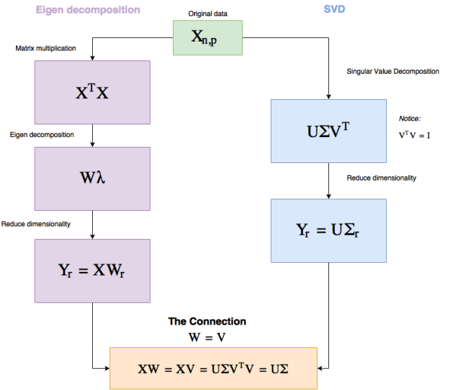
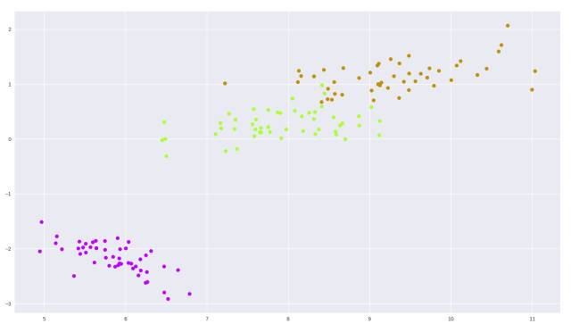
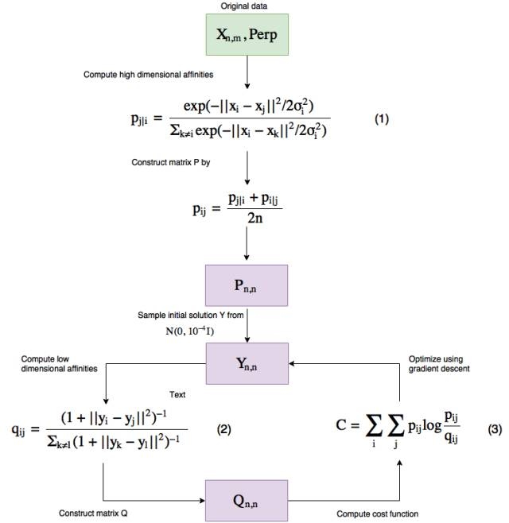
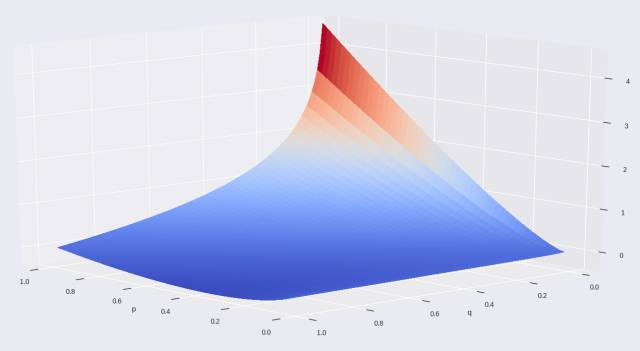
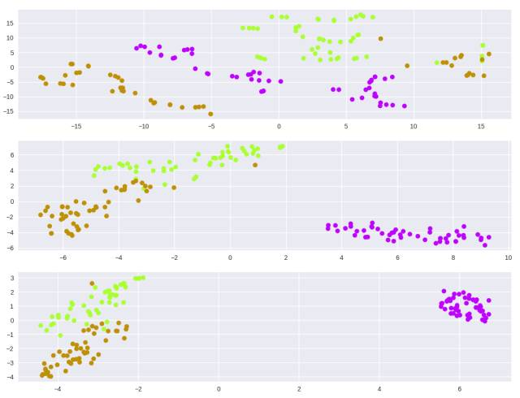
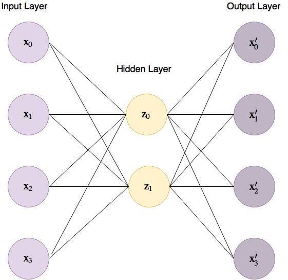
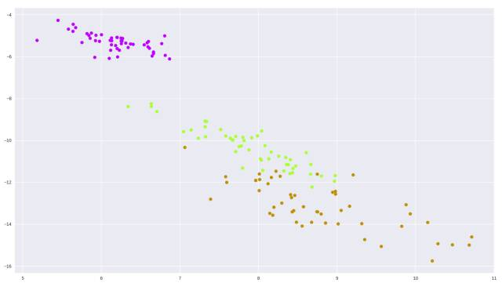

# 基于 TensorFlow 理解三大降维技术：PCA、t-SNE 和自编码器

选自 medium

**机器之心编译**

**参与****：Panda**

> *Pythonista 数据科学家 Elior Cohen 近日在 Medium 上发文解读了最常见的三大降维技术：PCA、t-SNE 和自编码器。为了帮助理解，他还为其中每种相关算法编写了代码（也发布在了 GitHub 上）。机器之心对本文进行了编译介绍。*

代码地址：https://github.com/eliorc/Medium/blob/master/PCA-tSNE-AE.ipynb

在这篇文章中，我将尽我所能揭秘三种降维技术：PCA、t-SNE 和自编码器。我做这件事的主要原因是基本上这些方法都被当作黑箱对待，因此有时候会被误用。理解它们将能让读者有办法决定在何时如何使用哪一种方法。

为了实现这一目标，我将深入到每种方法的内部，并且将使用 TensorFlow 从零开始为每种方法编写代码（t-SNE 除外）。为什么选择 TensorFlow？因为其最常被用于深度学习领域，让我们能有点挑战。

**动机**

当处理真实问题和真实数据时，我们往往遇到维度高达数百万的高维数据。

尽管在其原来的高维结构中，数据能够得到最好的表达，但有时候我们可能需要给数据降维。

降维的需求往往与可视化有关（减少两三个维度，好让我们可以绘图），但这只是其中一个原因。

有时候，我们认为性能比精度更重要，那么我们就可以将 1000 维的数据降至 10 维，从而让我们可以更快地对这些数据进行操作（比如计算距离）。

有时候对降维的需求是真实存在的，而且有很多应用。

在我们开始之前，先看一个问题：如果你要为以下案例选择一种降维技术，你会怎么选？

1\. 你的系统可以使用余弦相似度测量距离，但你需要将其可视化，以便不懂技术的董事会成员也能理解，这些人可能甚至从来没听说过余弦相似度；你会怎么做？

2\. 你有必要将数据的维度压缩到尽可能最低，你的限制是要保留大约 80% 的数据，你会怎么做？

3\. 你有一个数据库，其中的数据是耗费了大量时间收集的，而且还时不时有新的（相似类型的）数据加入。你需要降低你已有数据的维度，并且还要给到来的新数据降维，你会选择什么方法？

这篇文章的目的是希望能帮助你更好地了解降维，以便你能轻松应对类似这样的问题。

让我们从 PCA 开始吧。

**PCA**

PCA，即主成分分析（Principal Component Analysis），可能是最古老的技巧了。

PCA 已经得到了充分的研究，而且有很多方法可以实现这种解决方案，这里我们会谈到其中两种：Eigen 分解和奇异值分解（SVD），然后我们会在 TensorFlow 中实现其中的 SVD 方法。

从现在起，假设我们的数据矩阵为 X，其 shape 为 (n, p)，其中 n 是指样本的数量，而 p 是指维度。

所以给定了 X 之后，这两种方法都要靠自己的方式找到一种操作并分解 X 的方法，以便接下来我们可以将分解后的结果相乘，从而以更少的维度表征最大化的信息。我知道，这听起来很唬人，但我们不会深入到数学证明中去，仅保留有助于我们理解这种方法的优缺点的部分。

所以 Eigen 分解和 SVD 都是分解矩阵的方式，让我们看看它们可以在 PCA 中提供怎样的帮助，以及它们有怎样的联系。

先看看下面的流程图，我会在后面解释。



*图 1：PCA 工作流程*

所以，你为什么要关心这个？实际上，这两个流程中有一些非常基本的东西，能够给我们理解 PCA 提供很大帮助。

你可以看到，这两种方法都是纯线性代数，这基本上就意味着：使用 PCA 就是在另一个角度看待真实数据——这是 PCA 独有的特性，因为其它方法都是始于低维数据的随机表征，然后使其表现得就像是高维数据。

另外值得一提的是因为所有的运算都是线性的，所以 SVD 的速度非常快。

另外，给定同样的数据，PCA 总是会给出同样的答案（而其它两种方法却不是这样）。

注意我们在 SVD 中是怎样选择 r（r 是我们想要降低至的维度）的，以便将 Σ 中的大部分值保留到更低的维度上。

Σ 则有一些特别之处。

Σ 是一个对角矩阵（diagonal matrix），其中有 p（维度数）个对角值（被称为奇异值（singular value）），它们的大小表明了它们对保存信息的重要程度。

所以我们可以选择降维到能保留给定比例的数据的维度数，后面我将通过代码说明。（比如让我们降维，但最多失去 15% 的数据。）

你将看到，用 TensorFlow 写这个代码是很简单的，我们要编码的是一个带有 fit 方法和我们将提供维度的 reduce 方法的类。

**代码（PCA）**

设 self.X 包含数据且 self.dtype=tf.float32，那么 fit 方法看起来就是这样：

```py
def fit(self):
    self.graph = tf.Graph()
    with self.graph.as_default():
        self.X = tf.placeholder(self.dtype, shape=self.data.shape)

        # Perform SVD
        singular_values, u, _ = tf.svd(self.X)

        # Create sigma matrix
        sigma = tf.diag(singular_values)

    with tf.Session(graph=self.graph) as session:
        self.u, self.singular_values, self.sigma = session.run([u, singular_values, sigma],
                                                               feed_dict={self.X: self.data})
```

所以 fit 的目标是创建我们后面要用到的 Σ 和 U。

我们将从 tf.svd 行开始，这一行给了我们奇异值（就是图 1 中标记为 Σ 的对角值）和矩阵 U 和 V。

然后 tf.diag 是 TensorFlow 的将一个 1D 向量转换成一个对角矩阵的方法，在我们的例子中会得到 Σ。

在 fit 调用结束后，我们将得到奇异值、Σ 和 U。

现在让我们实现 reduce。

```py
def reduce(self, n_dimensions=None, keep_info=None):
    if keep_info:
        # Normalize singular values
        normalized_singular_values = self.singular_values / sum(self.singular_values)

        # Create the aggregated ladder of kept information per dimension
        ladder = np.cumsum(normalized_singular_values)

        # Get the first index which is above the given information threshold
        index = next(idx for idx, value in enumerate(ladder) if value >= keep_info) + 1
        n_dimensions = index

    with self.graph.as_default():
        # Cut out the relevant part from sigma
        sigma = tf.slice(self.sigma, [0, 0], [self.data.shape[1], n_dimensions])

        # PCA
        pca = tf.matmul(self.u, sigma)

    with tf.Session(graph=self.graph) as session:
        return session.run(pca, feed_dict={self.X: self.data})
```

如你所见，reduce 既有 keep_info，也有 n_dimensions（我没有实现输入检查看是否只提供了其中一个）。

如果我们提供 n_dimensions，它就会降维到那个数；但如果我们提供 keep_info（应该是 0 到 1 之间的一个浮点数），就说明了我们将从原来的数据中保存多少信息（假如是 0.9，就保存 90% 的数据）。

在第一个 if 中，我们规范化并检查了需要多少了奇异值，基本上能从 keep_info 得知 n_dimensions。

在这个图中，我们只需要从 Σ (sigma) 矩阵切下我们所需量的数据，然后执行矩阵乘法。

现在让我们在鸢尾花数据集上试一试，这是一个 (150, 4) 的数据集，包含了三种鸢尾花。

```py
from sklearn import datasets
import matplotlib.pyplot as plt
import seaborn as sns

tf_pca = TF_PCA(iris_dataset.data, iris_dataset.target)
tf_pca.fit()
pca = tf_pca.reduce(keep_info=0.9)  # Results in 2 dimensions

color_mapping = {0: sns.xkcd_rgb['bright purple'], 1: sns.xkcd_rgb['lime'], 2: sns.xkcd_rgb['ochre']}
colors = list(map(lambda x: color_mapping[x], tf_pca.target))

plt.scatter(pca[:, 0], pca[:, 1], c=colors)
```



*图 2：鸢尾花数据集 PCA 二维绘图*

还不错吧？

**t-SNE**

相对于 PCA，t-SNE 是一种相对较新的方法，起源于 2008 年的论文《Visualizing Data using t-SNE》：http://www.jmlr.org/papers/volume9/vandermaaten08a/vandermaaten08a.pdf

它也比 PCA 更难理解，所以让我们一起坚持一下。

我们对 t-SNE 的符号定义为：X 是原来的数据；P 是一个矩阵，显示了高维（原来的）空间中 X 中的点之间的亲和度（affinities，约等于距离）；Q 也是一个矩阵，显示了低维空间中数据点之间的亲和度。如果你有 n 个数据样本，那么 Q 和 P 都是 n×n 的矩阵（从任意点到任意点的距离包含自身）。

现在 t-SNE 有自己的「独特的」测量事物之间距离的方式（我们下面就会介绍）、一种测量高维空间中数据点之间的距离的方式、一种测量低维空间中数据点之间的距离的方式以及一种测量 P 和 Q 之间的距离的方式。

根据原始论文，一个数据点 x_j 与另一个点 x_i 之间的相似度是 p_j|i，其定义为：「x_i 选取 x_j 为其近邻点（neighbor），而近邻点的选取与以 x_i 为中心的高斯分布概率密度成正比。」

「这是什么意思！」不要担心，我前面说了，t-SNE 有自己测量距离的独特方式，所以让我们看看用于测量距离（亲和度）的公式，然后从中取出我们理解 t-SNE 的行为所需的见解。

从高层面来讲，这就是算法的工作方式（注意和 PCA 不一样，这是一个迭代式的算法）。



*图 3：t-SNE 工作流程*

让我们一步步地研究一下这个流程。

这个算法有两个输入，一个是数据本身，另一个被称为困惑度（Perp）。

简单来说，困惑度（perplexity）是指在优化过程中数据的局部（封闭点）和全局结构的焦点的平衡程度——本文建议将其保持在 5 到 50 之间。

更高的困惑度意味着一个数据点会把更多的数据点看作是其紧密的近邻点，更低的困惑度就更少。

困惑度会实际影响可视化的结果，而且你需要小心应对，因为它可能会在可视化低维数据时出现误导现象——我强烈推荐阅读这篇文章了解如何使用 t-SNE 困惑度：http://distill.pub/2016/misread-tsne，其中介绍了不同困惑度的影响。

这种困惑度从何而来？它被用于求解式子 (1) 中的 σ_i，而且因为它们有单调的连接，所以可以通过二元搜索（binary search）找到。

所以使用我们提供给算法的困惑度，我们基本上会找到不同的 σ_i。

让我们看看公式为我们提供了哪些关于 t-SNE 的信息。

在我们探索公式 (1) 和 (2) 之前，需要知道 p_ii 和 q_ii 被设置为 0（即使我们将它们应用到两个相似的点上，公式的输出也不会是 0，这只是给定的值）。

所以看看公式 (1) 和 (2)，我希望你注意到，当两个点很接近时（在高维表征中），分子的值大约为 1，而如果它们相距非常远，那么我们会接近无穷小——这将有助于我们后面理解成本函数。

现在我们可以了解关于 t-SNE 的一些事情了。

一是因为亲和度公式的构建方式，在 t-SNE 图中解读距离可能会出问题。

这意味着聚类之间的距离和聚类大小可能被误导，并且也会受到所选择的困惑度的影响（在上面我推荐的文章中，你可以看到这些现象的可视化）。

第二件要注意的事情是，怎么在等式 (1) 中我们基本上计算的是点之间的欧几里得距离？这方面 t-SNE 很强大，我们可以用任何我们喜欢的距离测量来取代它，比如余弦距离、Manhattan 距离，也可以使用任何你想用的测量方法（只要其保持空间度量（space metric），而且保持低维亲和度一样）——以欧几里得的方式会得到复杂的距离绘图。

比如说，如果你是一位 CTO，你有一些数据需要根据余弦相似度测量距离，而你的 CEO 想要你通过图表的形式呈现这些数据。我不确定你是否有时间向董事会解释什么是余弦相似度以及解读聚类的方式，你可以直接绘制余弦相似度聚类，因为欧几里得距离聚类使用 t-SNE——要我说，这确实很酷。

在代码中，你可以在 scikit-learn 中通过向 TSNE 方法提供一个距离矩阵来实现。

现在，我们知道当 x_i 和 x_j 更近时，p_ij/q_ij 的值更大；相反则该值更小。

让我们看看这会对我们的成本函数（被称为 KL 散度（Kullback–Leibler divergence））带来怎样的影响。让我们绘图，然后看看没有求和部分的公式 (3)。



*图 4：没有求和部分的 t-SNE 成本函数*

很难看明白这是啥？但我在上面给轴加了名字。

如你所见，这个成本函数是不对称的。

对于高维空间中临近的点，其得出了非常高的成本（p 轴），但这些点是低维空间中很远的点表示的；而在高维空间中远离的点则成本更低，它们则是用低维空间中临近的点表示的。

这说明在 t-SNE 图中，距离解释能力的问题甚至还更多。

```py
model = TSNE(learning_rate=100, n_components=2, random_state=0, perplexity=5)
tsne5 = model.fit_transform(iris_dataset.data)

model = TSNE(learning_rate=100, n_components=2, random_state=0, perplexity=30)
tsne30 = model.fit_transform(iris_dataset.data)

model = TSNE(learning_rate=100, n_components=2, random_state=0, perplexity=50)
tsne50 = model.fit_transform(iris_dataset.data)

plt.figure(1)
plt.subplot(311)
plt.scatter(tsne5[:, 0], tsne5[:, 1], c=colors)

plt.subplot(312)
plt.scatter(tsne30[:, 0], tsne30[:, 1], c=colors)

plt.subplot(313)
plt.scatter(tsne50[:, 0], tsne50[:, 1], c=colors)

plt.show()
```



*图 5：在鸢尾花数据集上的 t-SNE，不同的困惑度*

正如我们从数学中了解到的那样，你可以看到给定一个好的困惑度，数据会聚类，但要注意超参数的敏感性（如果不给梯度下降提供学习率，我无法找到聚类）。

在我们继续之前，我想说如果使用正确，t-SNE 会是一种非常强大的方法，而不会受到前面提及的负面影响，只是你要清楚如何使用它。

接下来是自编码器。

**自编码器（Auto Encoders）**

PCA 和 t-SNE 是方法，而自编码器则是一系列的方法。

自编码器是一种神经网络，其目标是通过使用比输入节点更少的隐藏节点（在编码器一端）预测输入（训练该网络使其输出尽可能与输入相似），为此该网络需要尽可能多地将信息编码到隐藏节点中。

图 6 给出了一个用于 4 维鸢尾花数据集的基本自编码器，其中输入层到隐藏层之间的连接线被称为编码器（encoder），而隐藏层到输出层之间的线被称为解码器（decoder）。



*图 6：用于鸢尾花数据集的基本自编码器*

所以为什么自编码器是一系列方法呢？因为我们仅有的约束条件是其输入层和输出层具有同样的维度，在两者之间，我们可以创建任何我们想要的可以最好地编码我们的高维数据的结构。

自编码器始于一些随机的低维表征（z）并会通过梯度下降改变其输入层和隐藏层以及隐藏层和输出层之间连接的权重，从而找到它们的解。

现在，我们对自编码器已经有了一定了解，因为我们可以控制该网络的内部，我们可以让编码器能挑选出特征之间的非常复杂的关系。

自编码器还有一个加分项。因为在训练结束时，我们有与隐藏层的连接权重，所以我们可以在特定的输入上训练，如果后面我们遇到了另一个数据点，那么我们无需重新训练就可以使用这些权重进行降维——但这种操作要小心，只有当新数据点与我们训练所用的数据点类似时这才有效。

在这种情况下，探索自编码器的数学可能很简单，但却没什么用处，因为对于每一种架构和我们选择的成本函数，其数学形式可能是不同的。

但如果我们想一想自编码器权重的优化方式，我们会理解我们定义的成本函数具有非常重要的作用。

因为自编码器会使用成本函数来确定其预测结果的质量，那么我们就可以使用这个功能来强化我们希望实现的东西。

不管我们想要的是欧几里得距离还是其它测量，我们都可以通过成本函数、使用不同的距离方法、使用不对称函数和其它方法而将其反映到编码的数据上。

而且因为自编码器本质上是神经网络，所以它还具有更大的力量，我们甚至可以在训练时给类和样本加权，从而为数据中的特定现象提供更大的重要性。

这能给我们压缩数据的方式提供很大的灵活性。

自编码器非常强大，而且在一些案例中能实现比其它方法更好的结果（谷歌搜一下「PCA vs Auto Encoders」，你就知道），所以它们肯定是一种有效的方法。

让我们用 TensorFlow 实现一个基于鸢尾花数据集的基本自编码器，并且绘图。

**代码（自编码器）**

同样，我们将其分成了 fit 和 reduce。

```py
def fit(self, n_dimensions):
    graph = tf.Graph()
    with graph.as_default():

        # Input variable
        X = tf.placeholder(self.dtype, shape=(None, self.features.shape[1]))

        # Network variables
        encoder_weights = tf.Variable(tf.random_normal(shape=(self.features.shape[1], n_dimensions)))
        encoder_bias = tf.Variable(tf.zeros(shape=[n_dimensions]))

        decoder_weights = tf.Variable(tf.random_normal(shape=(n_dimensions, self.features.shape[1])))
        decoder_bias = tf.Variable(tf.zeros(shape=[self.features.shape[1]]))

        # Encoder part
        encoding = tf.nn.sigmoid(tf.add(tf.matmul(X, encoder_weights), encoder_bias))

        # Decoder part
        predicted_x = tf.nn.sigmoid(tf.add(tf.matmul(encoding, decoder_weights), decoder_bias))

        # Define the cost function and optimizer to minimize squared error
        cost = tf.reduce_mean(tf.pow(tf.subtract(predicted_x, X), 2))
        optimizer = tf.train.AdamOptimizer().minimize(cost)

    with tf.Session(graph=graph) as session:
        # Initialize global variables
        session.run(tf.global_variables_initializer())

        for batch_x in batch_generator(self.features):
            self.encoder['weights'], self.encoder['bias'], _ = session.run([encoder_weights, encoder_bias, optimizer],
                                                                        feed_dict={X: batch_x})
```

这里没什么特别要说的，代码本身就已经给出了解释。我们可以看到在偏置中的编码器权重，然后我们可以在下面的 reduce 方法中给该数据降维。

```py
def reduce(self):
    return np.add(np.matmul(self.features, self.encoder['weights']), self.encoder['bias'])
```

没错，就是这么简单 :)

让我们看看它的效果（批大小：50，1000 epoch）。



*图 7：这个简单自编码器在鸢尾花数据集上的输出*

我们可以继续调整批大小、epoch 数和不同的优化器，甚至无需改变架构我们就能得到不同的结果。

注意这里我给超参数随便选择了一些值，在真实场景中，我们需要通过交叉验证或测试数据来检验我们的结果，并借此找到最优的设置。

**结语**

这样的文章往往会通过某种形式的对比表格收尾，看看它们长处短处之类的。但那正好不是我想做的事情。

我的目标是深入到这些方法内部，让读者可以自己明白它们各自的优势和劣势。

我希望你喜欢这篇文章，并且能从中获益。现在回到文章开始处的问题，你知道它们的答案了吗？************

*原文链接：https://reinforce.io/blog/introduction-to-tensorforce/*

 *******本文为机器之心编译，***转载请联系本公众号获得授权******。***

✄------------------------------------------------

**加入机器之心（全职记者/实习生）：hr@jiqizhixin.com**

**投稿或寻求报道：editor@jiqizhixin.com**

**广告&商务合作：bd@jiqizhixin.com**

**点击阅读原文，查看机器之心官网↓↓↓***