# 一文读懂遗传算法工作原理（附 Python 实现）

选自 AnalyticsVidhya

**机器之心编译**

**参与：晏奇、黄小天**

> 近日，Analyticsvidhya 上发表了一篇题为《Introduction to Genetic Algorithm & their application in data science》的文章，作者 Shubham Jain 现身说法，用通俗易懂的语言对遗传算法作了一个全面而扼要的概述，并列举了其在多个领域的实际应用，其中重点介绍了遗传算法的数据科学应用。机器之心对该文进行了编译，原文链接请见文末。

## **简介**

几天前，我着手解决一个实际问题——大型超市销售问题。在使用了几个简单模型做了一些特征工程之后，我在排行榜上名列第 219 名。

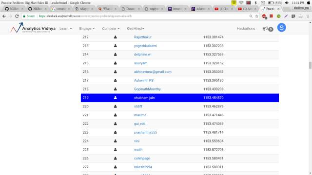

虽然结果不错，但是我还是想做得更好。于是，我开始研究可以提高分数的优化方法。结果我果然找到了一个，它叫遗传算法。在把它应用到超市销售问题之后，最终我的分数在排行榜上一下跃居前列。

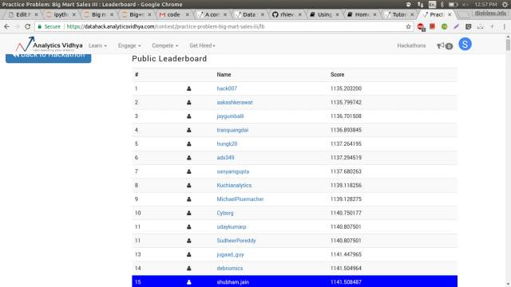

没错，仅靠遗传算法我就从 219 名直接跳到 15 名，厉害吧！相信阅读完本篇文章后，你也可以很自如地应用遗传算法，而且会发现，当把它用到你自己正在处理的问题时，效果也会有很大提升。

### **目录**

1、遗传算法理论的由来

2、生物学的启发

3、遗传算法定义

4、遗传算法具体步骤

*   初始化

*   适应度函数

*   选择

*   交叉

*   变异

5、遗传算法的应用

*   特征选取

*   使用 TPOT 库实现

6、实际应用

7、结语

## **1、遗传算法理论的由来**

我们先从查尔斯·达尔文的一句名言开始：

> 能够生存下来的往往不是最强大的物种，也不是最聪明的物种，而是最能适应环境的物种。

你也许在想：这句话和遗传算法有什么关系？其实遗传算法的整个概念就基于这句话。

让我们用一个基本例子来解释 ：

我们先假设一个情景，现在你是一国之王，为了让你的国家免于灾祸，你实施了一套法案：

*   你选出所有的好人，要求其通过生育来扩大国民数量。

*   这个过程持续进行了几代。

*   你将发现，你已经有了一整群的好人。

这个例子虽然不太可能，但是我用它是想帮助你理解概念。也就是说，我们改变了输入值（比如：人口），就可以获得更好的输出值（比如：更好的国家）。现在，我假定你已经对这个概念有了大致理解，认为遗传算法的含义应该和生物学有关系。那么我们就快速地看一些小概念，这样便可以将其联系起来理解。

## **2、生物学的启发**

相信你还记得这句话：「细胞是所有生物的基石。」由此可知，在一个生物的任何一个细胞中，都有着相同的一套染色体。所谓染色体，就是指由 DNA 组成的聚合体。

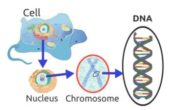

传统上看，这些染色体可以被由数字 0 和 1 组成的字符串表达出来。

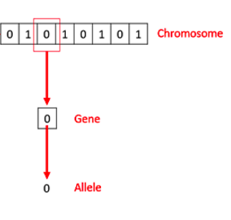

一条染色体由基因组成，这些基因其实就是组成 DNA 的基本结构，DNA 上的每个基因都编码了一个独特的性状，比如，头发或者眼睛的颜色。希望你在继续阅读之前先回忆一下这里提到的生物学概念。结束了这部分，现在我们来看看所谓遗传算法实际上指的是什么？

## **3、遗传算法定义**

首先我们回到前面讨论的那个例子，并总结一下我们做过的事情。

1.  首先，我们设定好了国民的初始人群大小。

2.  然后，我们定义了一个函数，用它来区分好人和坏人。

3.  再次，我们选择出好人，并让他们繁殖自己的后代。

4.  最后，这些后代们从原来的国民中替代了部分坏人，并不断重复这一过程。

遗传算法实际上就是这样工作的，也就是说，它基本上尽力地在某种程度上模拟进化的过程。

因此，为了形式化定义一个遗传算法，我们可以将它看作一个优化方法，它可以尝试找出某些输入，凭借这些输入我们便可以得到最佳的输出值或者是结果。遗传算法的工作方式也源自于生物学，具体流程见下图：


那么现在我们来逐步理解一下整个流程。

## **4、遗传算法具体步骤**

为了让讲解更为简便，我们先来理解一下著名的组合优化问题「背包问题」。如果你还不太懂，这里有一个我的解释版本。

比如，你准备要去野游 1 个月，但是你只能背一个限重 30 公斤的背包。现在你有不同的必需物品，它们每一个都有自己的「生存点数」（具体在下表中已给出）。因此，你的目标是在有限的背包重量下，最大化你的「生存点数」。

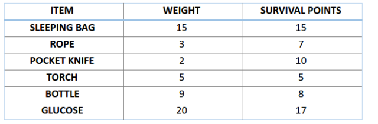

### **4.1 初始化**

这里我们用遗传算法来解决这个背包问题。第一步是定义我们的总体。总体中包含了个体，每个个体都有一套自己的染色体。

我们知道，染色体可表达为二进制数串，在这个问题中，1 代表接下来位置的基因存在，0 意味着丢失。（译者注：作者这里借用染色体、基因来解决前面的背包问题，所以特定位置上的基因代表了上方背包问题表格中的物品，比如第一个位置上是 Sleeping Bag，那么此时反映在染色体的『基因』位置就是该染色体的第一个『基因』。）

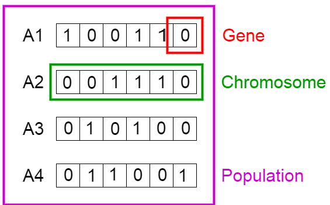

现在，我们将图中的 4 条染色体看作我们的总体初始值。

### **4.2 适应度函数**

接下来，让我们来计算一下前两条染色体的适应度分数。对于 A1 染色体 [100110] 而言，有：

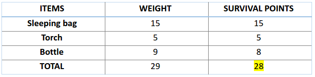

类似地，对于 A2 染色体 [001110] 来说，有：

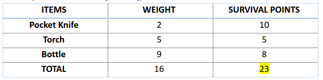

对于这个问题，我们认为，当染色体包含更多生存分数时，也就意味着它的适应性更强。

因此，由图可知，染色体 1 适应性强于染色体 2。

### **4.3 选择**

现在，我们可以开始从总体中选择适合的染色体，来让它们互相『交配』，产生自己的下一代了。这个是进行选择操作的大致想法，但是这样将会导致染色体在几代之后相互差异减小，失去了多样性。因此，我们一般会进行「轮盘赌选择法」（Roulette Wheel Selection method）。


想象有一个轮盘，现在我们将它分割成 m 个部分，这里的 m 代表我们总体中染色体的个数。每条染色体在轮盘上占有的区域面积将根据适应度分数成比例表达出来。

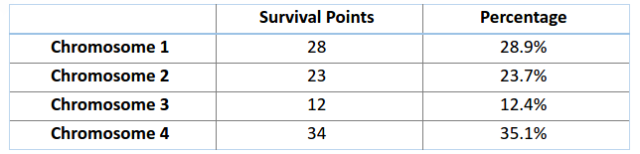

基于上图中的值，我们建立如下「轮盘」。

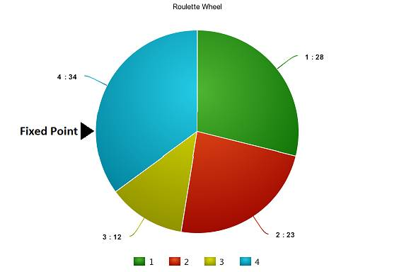

现在，这个轮盘开始旋转，我们将被图中固定的指针（fixed point）指到的那片区域选为第一个亲本。然后，对于第二个亲本，我们进行同样的操作。有时候我们也会在途中标注两个固定指针，如下图：

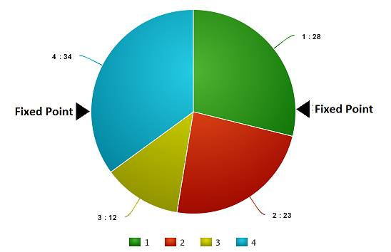

通过这种方法，我们可以在一轮中就获得两个亲本。我们将这种方法成为「随机普遍选择法」（Stochastic Universal Selection method）。

### **4.4 交叉**

在上一个步骤中，我们已经选择出了可以产生后代的亲本染色体。那么用生物学的话说，所谓「交叉」，其实就是指的繁殖。现在我们来对染色体 1 和 4（在上一个步骤中选出来的）进行「交叉」，见下图：

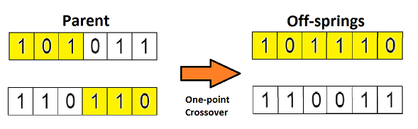

这是交叉最基本的形式，我们称其为「单点交叉」。这里我们随机选择一个交叉点，然后，将交叉点前后的染色体部分进行染色体间的交叉对调，于是就产生了新的后代。

如果你设置两个交叉点，那么这种方法被成为「多点交叉」，见下图：

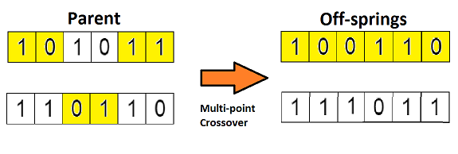

**4.5 变异**

如果现在我们从生物学的角度来看这个问题，那么请问：由上述过程产生的后代是否有和其父母一样的性状呢？答案是否。在后代的生长过程中，它们体内的基因会发生一些变化，使得它们与父母不同。这个过程我们称为「变异」，它可以被定义为染色体上发生的随机变化，正是因为变异，种群中才会存在多样性。

下图为变异的一个简单示例：

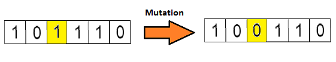

变异完成之后，我们就得到了新为个体，进化也就完成了，整个过程如下图：

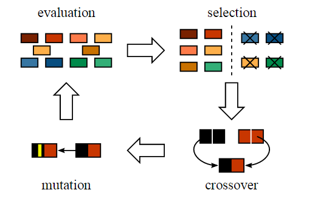

在进行完一轮「遗传变异」之后，我们用适应度函数对这些新的后代进行验证，如果函数判定它们适应度足够，那么就会用它们从总体中替代掉那些适应度不够的染色体。这里有个问题，我们最终应该以什么标准来判断后代达到了最佳适应度水平呢？

一般来说，有如下几个终止条件：

1.  在进行 X 次迭代之后，总体没有什么太大改变。

2.  我们事先为算法定义好了进化的次数。

3.  当我们的适应度函数已经达到了预先定义的值。

好了，现在我假设你已基本理解了遗传算法的要领，那么现在让我们用它在数据科学的场景中应用一番。

## **5、遗传算法的应用**

**5.1 特征选取**

试想一下每当你参加一个数据科学比赛，你会用什么方法来挑选那些对你目标变量的预测来说很重要的特征呢？你经常会对模型中特征的重要性进行一番判断，然后手动设定一个阈值，选择出其重要性高于这个阈值的特征。

那么，有没有什么方法可以更好地处理这个问题呢？其实处理特征选取任务最先进的算法之一就是遗传算法。

我们前面处理背包问题的方法可以完全应用到这里。现在，我们还是先从建立「染色体」总体开始，这里的染色体依旧是二进制数串，「1」表示模型包含了该特征，「0 表示模型排除了该特征」。

不过，有一个不同之处，即我们的适应度函数需要改变一下。这里的适应度函数应该是这次比赛的的精度的标准。也就是说，如果染色体的预测值越精准，那么就可以说它的适应度更高。

现在我假设你已经对这个方法有点一概念了。下面我不会马上讲解这个问题的解决过程，而是让我们先来用 TPOT 库去实现它。

**5.2 用 TPOT 库来实现**

这个部分相信是你在一开始读本文时心里最终想实现的那个目标。即：实现。那么首先我们来快速浏览一下 TPOT 库（Tree-based Pipeline Optimisation Technique，树形传递优化技术），该库基于 scikit-learn 库建立。下图为一个基本的传递结构。

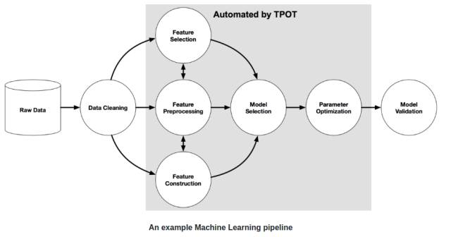

图中的灰色区域用 TPOT 库实现了自动处理。实现该部分的自动处理需要用到遗传算法。

我们这里不深入讲解，而是直接应用它。为了能够使用 TPOT 库，你需要先安装一些 TPOT 建立于其上的 python 库。下面我们快速安装它们：

```py
# installing DEAP, update_checker and tqdm 

pip install deap update_checker tqdm
# installling TPOT 
pip install tpot
```

这里，我用了 Big Mart Sales（数据集地址：https://datahack.analyticsvidhya.com/contest/practice-problem-big-mart-sales-iii/）数据集，为实现做准备，我们先快速下载训练和测试文件，以下是 python 代码：

```py
# import basic libraries

import numpy as np import pandas as pd import matplotlib.pyplot as plt %matplotlib inline from sklearn import preprocessing from sklearn.metrics import mean_squared_error ## preprocessing 
### mean imputations 

train['Item_Weight'].fillna((train['Item_Weight'].mean()), inplace=True) test['Item_Weight'].fillna((test['Item_Weight'].mean()), inplace=True) 
### reducing fat content to only two categories 

train['Item_Fat_Content'] = train['Item_Fat_Content'].replace(['low fat','LF'], ['Low Fat','Low Fat']) train['Item_Fat_Content'] = train['Item_Fat_Content'].replace(['reg'], ['Regular']) test['Item_Fat_Content'] = test['Item_Fat_Content'].replace(['low fat','LF'], ['Low Fat','Low Fat']) test['Item_Fat_Content'] = test['Item_Fat_Content'].replace(['reg'], ['Regular']) train['Outlet_Establishment_Year'] = 2013 - train['Outlet_Establishment_Year'] test['Outlet_Establishment_Year'] = 2013 - test['Outlet_Establishment_Year'] train['Outlet_Size'].fillna('Small',inplace=True) test['Outlet_Size'].fillna('Small',inplace=True) train['Item_Visibility'] = np.sqrt(train['Item_Visibility']) test['Item_Visibility'] = np.sqrt(test['Item_Visibility']) col = ['Outlet_Size','Outlet_Location_Type','Outlet_Type','Item_Fat_Content'] test['Item_Outlet_Sales'] = 0combi = train.append(test)for i in col: combi[i] = number.fit_transform(combi[i].astype('str')) combi[i] = combi[i].astype('object') train = combi[:train.shape[0]] test = combi[train.shape[0]:] test.drop('Item_Outlet_Sales',axis=1,inplace=True)
## removing id variables 

tpot_train = train.drop(['Outlet_Identifier','Item_Type','Item_Identifier'],axis=1) tpot_test = test.drop(['Outlet_Identifier','Item_Type','Item_Identifier'],axis=1) target = tpot_train['Item_Outlet_Sales'] tpot_train.drop('Item_Outlet_Sales',axis=1,inplace=True)
# finally building model using tpot library

from tpot import TPOTRegressor X_train, X_test, y_train, y_test = train_test_split(tpot_train, target, train_size=0.75, test_size=0.25) tpot = TPOTRegressor(generations=5, population_size=50, verbosity=2) tpot.fit(X_train, y_train) print(tpot.score(X_test, y_test)) tpot.export('tpot_boston_pipeline.py')
```

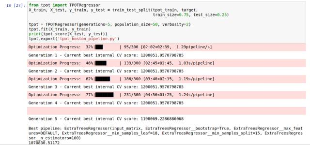

一旦这些代码运行完成，tpot_exported_pipeline.py 里就将会放入用于路径优化的 python 代码。我们可以发现，ExtraTreeRegressor 可以最好地解决这个问题。

```py
## predicting using tpot optimised pipeline

tpot_pred = tpot.predict(tpot_test) sub1 = pd.DataFrame(data=tpot_pred)
#sub1.index = np.arange(0, len(test)+1)

sub1 = sub1.rename(columns = {'0':'Item_Outlet_Sales'}) sub1['Item_Identifier'] = test['Item_Identifier'] sub1['Outlet_Identifier'] = test['Outlet_Identifier'] sub1.columns = ['Item_Outlet_Sales','Item_Identifier','Outlet_Identifier'] sub1 = sub1[['Item_Identifier','Outlet_Identifier','Item_Outlet_Sales']] sub1.to_csv('tpot.csv',index=False)
```

如果你提交了这个 csv，那么你会发现我一开始保证的那些还没有完全实现。那是不是我在骗你们呢？当然不是。实际上，TPOT 库有一个简单的规则。如果你不运行 TPOT 太久，那么它就不会为你的问题找出最可能传递方式。

所以，你得增加进化的代数，拿杯咖啡出去走一遭，其它的交给 TPOT 就行。此外，你也可以用这个库来处理分类问题。进一步内容可以参考这个文档：http://rhiever.github.io/tpot/。除了比赛，在生活中我们也有很多应用场景可以用到遗传算法。

## **6、 实际应用**

遗传算法在真实世界中有很多应用。这里我列了部分有趣的场景，但是由于篇幅限制，我不会逐一详细介绍。

### **6.1 工程设计**

工程设计非常依赖计算机建模以及模拟，这样才能让设计周期过程即快又经济。遗传算法在这里可以进行优化并给出一个很好的结果。

相关资源：

*   论文：Engineering design using genetic algorithms

*   地址：http://lib.dr.iastate.edu/cgi/viewcontent.cgi?article=16942&context=rtd

### **6.2 交通与船运路线（Travelling Salesman Problem，巡回售货员问题）**

这是一个非常著名的问题，它已被很多贸易公司用来让运输更省时、经济。解决这个问题也要用到遗传算法。

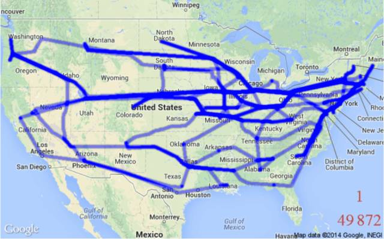

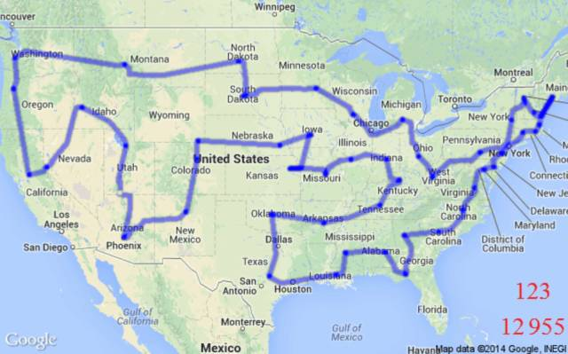

**6.3 机器人**

遗传算法在机器人领域中的应用非常广泛。实际上，目前人们正在用遗传算法来创造可以像人类一样行动的自主学习机器人，其执行的任务可以是做饭、洗衣服等等。

相关资源：

*   论文：Genetic Algorithms for Auto-tuning Mobile Robot Motion Control

*   地址：https://pdfs.semanticscholar.org/7c8c/faa78795bcba8e72cd56f8b8e3b95c0df20c.pdf

## **7、结语**

希望通过本文介绍，你现在已经对遗传算法有了足够的理解，而且也会用 TPOT 库来实现它了。但是如果你不亲身实践，本文的知识也是非常有限的。

所以，请各位读者朋友一定要在无论是数据科学比赛或是生活中尝试自己去实现它。 ******************

原文链接：https://www.analyticsvidhya.com/blog/2017/07/introduction-to-genetic-algorithm/

******本文为机器之心编译，***转载请联系本公众号获得授权******。***

✄------------------------------------------------

**加入机器之心（全职记者/实习生）：hr@jiqizhixin.com**

**投稿或寻求报道：editor@jiqizhixin.com**

**广告&商务合作：bd@jiqizhixin.com**