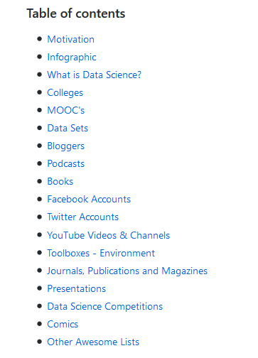
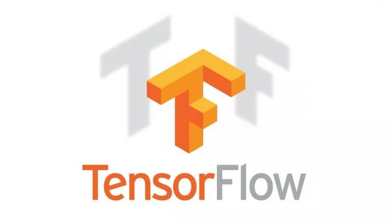
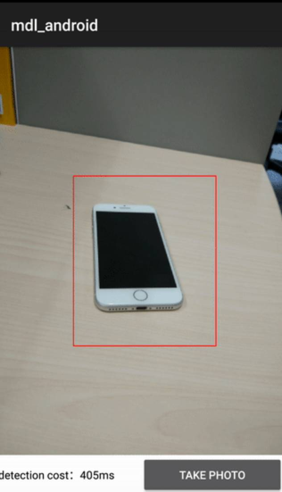
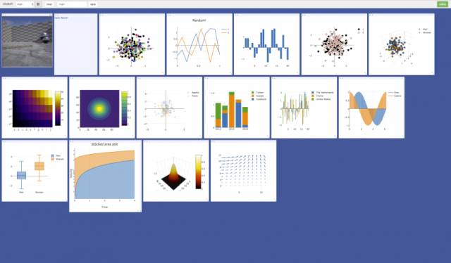
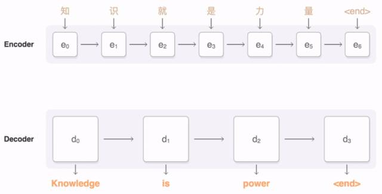
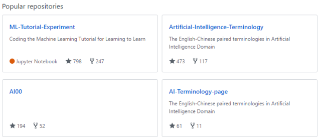
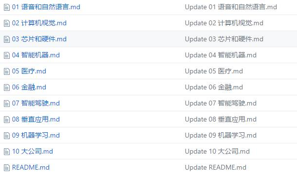

# 二千零一十七、年度盘点：15 个最流行的 GitHub 机器学习项目

选自 Analytics Vidhya

**作者：Sunil Ray**

**机器之心编译**

> 在本文中，作者列出了 2017 年 GitHub 平台上最为热门的知识库，囊括了数据科学、机器学习、深度学习中的各种项目，希望能对大家学习、使用有所帮助。另，小编恬不知耻地把机器之心的 Github 项目也加了进来，求 star，求 pull requests。

GitHub 是计算机科学领域最为活跃的社区，在 GitHub 上，来自不同背景的人们分享越来越多的软件工具和资源库。在其中，你不仅可以获取自己所需的工具，还可以观看代码是如何写成并实现的。

作为一名机器学习爱好者，作者在本文中列出了 2017 年 GitHub 平台上最为热门的知识库，其中包含了学习资料与工具。希望对你的学习和研究有所帮助。

**目录**

**1\. 学习资源**

 1\. Awesome Data Science

 2\. Machine Learning / Deep Learning Cheat Sheet

 3\. Oxford Deep Natural Language Processing Course Lectures

 4\. PyTorch – Tutorial

 5\. Resources of NIPS 2017

**2\. 开源工具**

 1\. TensorFlow

 2\. TuriCreate – A Simplified Machine Learning Library

 3\. OpenPose

 4\. DeepSpeech

 5\. Mobile Deep Learning

 6\. Visdom

 7\. Deep Photo Style Transfer

 8\. CycleGAN

 9\. Seq2seq

 10\. Pix2code

**3\. 机器之心项目**

 1\. AI00-百家影响人工智能未来的公司

 2\. Artificial-Intelligence-Terminology

 3\. ML-Tutorial-Experiment

**1\. 学习资源**

**1.1 Awesome Data Science**

项目地址： https://github.com/bulutyazilim/awesome-datascience

该 repo 是数据科学的基本资源。多年来的无数贡献构建了此 repo 里面的各种资源，从入门指导、信息图，到社交网络上你需要 follow 的账号。无论你是初学者还是业内老兵，里面都有大量的资源需要学习。

从该 repo 的目录可以看出其深度。

**1.2 Machine Learning / Deep Learning Cheat Sheet**

项目地址：https://github.com/kailashahirwar/cheatsheets-ai

该项目以 cheatsheet 的形式介绍了机器学习/深度学习中常用的工具与技术，从 pandas 这样的简单工具到深度学习技术都涵盖其中。在收藏或者 fork 该项目之后，你就不用再费事搜索常用的技巧和注意事项了。

简单介绍下，cheatsheets 类型包括 pandas、numpy、scikit learn、matplotlib、ggplot、dplyr、tidyr、pySpark 和神经网络。

**1.3 Oxford Deep Natural Language Processing Course Lectures**

项目地址：https://github.com/oxford-cs-deepnlp-2017/lectures

斯坦福的 NLP 课程一直是自然语言处理领域的金牌教程。但是近期随着深度学习的发展，在 RNN 和 LSTM 等深度学习架构的帮助下，NLP 出现了大量进步。

该 repo 基于牛津大学的 NLP 课程，涵盖先进技术和术语，如使用 RNN 进行语言建模、语音识别、文本转语音（TTS）等。该 repo 包含该课程从课程材料到实践联系的所有内容。

**1.4 PyTorch – Tutorial**

项目地址：https://github.com/yunjey/pytorch-tutorial

截至今天，PyTorch 仍是 TensorFlow 的唯一竞争对手，它的功能和声誉使其成为了颇具竞争力的深度学习框架。因其 Pythonic 风格的编程、动态计算图和更快的原型开发，Pytorch 已经获得了深度学习社区的广泛关注。

该知识库包含 PyTorch 上大量的深度学习任务代码，包括 RNN、GAN 和神经风格迁移。其中的大多数模型在实现上仅需 30 余行代码。这充分说明了 PyTorch 的抽象能力，它让研究人员可以专注于找到正确的模型，而无需纠缠于编程语言和工具选择等细节。

**1.5 Resources of NIPS 2017**

项目地址：https://github.com/hindupuravinash/nips2017

该 repo 包含 NIPS 2017 的资源和所有受邀演讲、教程和研讨会的幻灯片。NIPS 是一年一度的机器学习和计算神经科学会议。

过去几年中，数据科学领域内的大部分突破性研究都曾作为研究结果出现在 NIPS 大会上。如果你想站在领域前沿，那这就是很好的资源！

**2\. 开源软件库**

**2.1 TensorFlow**

 **项目地址：https://github.com/tensorflow/tensorflow

TensorFlow 是一种采用数据流图（data flow graph）进行数值计算的开源软件库。其中 Tensor 代表传递的数据为张量（多维数组），Flow 代表使用计算图进行运算。数据流图用「结点」（node）和「边」（edge）组成的有向图来描述数学运算。「结点」一般用来表示施加的数学操作，但也可以表示数据输入的起点和输出的终点，或者是读取/写入持久变量（persistent variable）的终点。边表示结点之间的输入/输出关系。这些数据边可以传送维度可动态调整的多维数据数组，即张量（tensor）。

TensorFlow 自正式发布以来，一直保持着「深度学习/机器学习」顶尖库的位置。谷歌大脑团队和机器学习社区也一直在积极地贡献并保持最新的进展，尤其是在深度学习领域。

TensorFlow 最初是使用数据流图进行数值计算的开源软件库，但从目前来看，它已经成为构建深度学习模型的完整框架。它目前主要支持 TensorFlow，但也支持 C、C++ 和 Java 等语言。此外，今年 11 月谷歌终于发布了新工具的开发者预览版本，这是一款 TensorFlow 用于移动设备和嵌入式设备的轻量级解决方案。

**2.2 TuriCreate：一个简化的机器学习库**

 **

项目地址：https://github.com/apple/turicreate

TuriCreate 是苹果最近贡献的一个开源项目，它为机器学习模型提供易于使用的创建方法和部署方法，这些机器学习模型包括目标检测、人体姿势识别和推荐系统等复杂任务。

可能我们作为机器学习爱好者会比较熟悉 GraphLab Create，一个非常简便高效的机器学习库，而当初创建该库的公司 TuriCreate 被苹果收购时，造成了很大反响。

TuriCreate 是针对 Python 开发的，且它最强的的特征是将机器学习模型部署到 Core ML 中，用于开发 iOS、macOS、watchOS 和 tvOS 等应用程序。

**2.3 OpenPose**

 **项目地址： https://github.com/CMU-Perceptual-Computing-Lab/openpose

OpenPose 是一个多人关键点检测库，它可以帮助我们实时地检测图像或视频中某个人的位置。OpenPose 软件库由 CMU 的感知计算实验室开发并维护，对于说明开源研究如何快速应用于部署到工业中，它是非常好的一个案例。

OpenPose 的一个使用案例是帮助解决活动检测问题，即演员完成的动作或活动能被实时捕捉到。然后这些关键点和它们的动作可用来制作动画片。OpenPose 不仅有 C++的 API 以使开发者能快速地访问它，同时它还有简单的命令行界面用来处理图像或视频。

**2.4 DeepSpeech**

 **

项目地址： https://github.com/mozilla/DeepSpeech

DeepSpeech 是百度开发的开源实现库，它提供了当前顶尖的语音转文本合成技术。它基于 TensorFlow 和 Python，但也可以绑定到 NodeJS 或使用命令行运行。

Mozilla 一直是构建 DeepSpeech 和开源软件库的主要研究力量，Mozilla 技术战略副总裁 Sean White 在一篇博文中写道：「目前只有少数商用质量的语音识别引擎是开源的，它们大多数由大型公司主宰。这样就减少了初创公司、研究人员和传统企业为它们的用户定制特定的产品与服务。但我们与机器学习社区的众多开发者和研究者共同完善了该开源库，因此目前 DeepSpeech 已经使用了复杂和前沿的机器学习技术创建语音到文本的引擎。」

**2.5 Mobile Deep Learning**

项目地址：https://github.com/baidu/mobile-deep-learning

该 repo 将数据科学中的当前最佳技术移植到了移动平台上。该 repo 由百度研究院开发，目的是将深度学习模型以低复杂性和高速度部署到移动设备（例如 Android 和 IOS）上。

该 repo 解释了一个简单的用例，即目标检测。它可以识别目标（例如一张图像中的手机）的准确位置，很棒不是吗？

**2.6 Visdom**

项目地址：https://github.com/facebookresearch/visdom

Visdom 支持图表、图像和文本在协作者之间进行传播。你可以用编程的方式组织可视化空间，或者通过 UI 为实时数据创建仪表盘，检查实验结果，或者调试实验代码。

绘图函数中的输入会发生改变，尽管大部分输入是数据的张量 X（而非数据本身）和（可选）张量 Y（包含可选数据变量，如标签或时间戳）。它支持所有基本图表类型，以创建 Plotly 支持的可视化。

Visdom 支持使用 PyTorch 和 Numpy。

**2.7 Deep Photo Style Transfer**

项目地址：https://github.com/luanfujun/deep-photo-styletransfer

该 repo 基于近期论文《Deep Photo Style Transfer》，该论文介绍了一种用于摄影风格迁移的深度学习方法，可处理大量图像内容，同时有效迁移参考风格。该方法成功克服了失真，满足了大量场景中的摄影风格迁移需求，包括时间、天气、季节、艺术编辑等场景。

**2.8 CycleGAN**

项目地址：https://github.com/junyanz/CycleGAN

CycleGAN 是一个有趣且强大的库，展现了该顶尖技术的潜力。举例来说，下图大致展示了该库的能力：调整图像景深。这里有趣的点在于你事先并没有告诉算法需要注意图像的哪一部分。算法完全依靠自己做到了！

目前该库用 Lua 编写，但是它也可以在命令行中使用。

**2.9 Seq2seq**

项目地址：https://github.com/google/seq2seq

Seq2seq 最初是为机器翻译而建立的，但已经被开发用于多种其它任务，包括摘要生成、对话建模和图像捕捉。只要一个问题的结构是将输入数据编码为一种格式，并将其解码为另一种格式，就可以使用 Seq2seq 框架。它使用了所有流行的基于 Python 的 TensorFlow 库进行编程。

**2.10 Pix2code**

项目地址：https://github.com/tonybeltramelli/pix2code

这个深度学习项目非常令人振奋，它尝试为给定的 GUI 自动生成代码。当建立网站或移动设备界面的时候，通常前端工程师必须编写大量枯燥的代码，这很费时和低效。这阻碍了开发者将主要的时间用于实现真正的功能和软件逻辑。Pix2code 的目的是通过将过程自动化来克服这一困难。它基于一种新方法，允许以单个 GUI 截图作为输入来生成计算机 token。

Pix2code 使用 Python 编写，可将移动设备和网站界面的捕捉图像转换成代码。

**3\. 机器之心项目**

机器之心目前在 GitHub 上也有三个项目，分别是评估人工智能各领域优秀公司的 AI00、人工智能领域中英术语集和模型试验与解释项目。

**3.1 AI00——机器之心百家影响人工智能未来的公司榜单**

项目地址：https://github.com/jiqizhixin/AI00

人工智能是一个复杂庞大的体系，涉及众多学科，也关乎技术、产品、行业和资本等众多要素，本报告的写作团队只代表他们的专业观点，有自己的局限性，需要更多行业专家参与进来加以修正和完善。

我们深刻地理解在没有专业用户反馈的情况下所做出报告的质量局限性，所以希望用工程界「Agile Development」的理念来对待我们的报告，不断收集专业反馈来持续提升报告质量。

为此，我们将邀请人工智能领域的科学家、技术专家、产业专家、专业投资人和读者加入进来，共同完成这项人工智能的长期研究。我们将对参与者提供的信息进行汇总和整理，以月度为单位更新此份报告。

**3.2 Artificial-Intelligence-Terminology**

项目地址：https://github.com/jiqizhixin/Artificial-Intelligence-Terminology

我们将机器之心在编译技术文章和论文过程中所遇到的专业术语记录下来，希望有助于大家查阅和翻译（第二版）。

本词汇库目前拥有的专业词汇共计 760 个，主要为机器学习基础概念和术语，同时也是该项目的基本词汇。机器之心将继续完善术语的收录和扩展阅读的构建。

词汇更新主要分为两个阶段，第一阶段机器之心将继续完善基础词汇的构建，即通过权威教科书或其它有公信力的资料抽取常见术语。第二阶段机器之心将持续性地把编译论文或其他资料所出现的非常见术语更新到词汇表中。

读者的反馈意见和更新建议将贯穿整个阶段，并且我们将在项目致谢页中展示对该项目起积极作用的读者。因为我们希望术语的更新更具准确度和置信度，所以我们希望读者能附上该术语的来源地址与扩展地址。因此，我们能更客观地更新词汇，并附上可信的来源与扩展。

**3.3 ML-Tutorial-Experiment**

项目地址：https://github.com/jiqizhixin/ML-Tutorial-Experiment

该项目主要是展示我们在实验机器学习模型中所获得的经验与解释，目前我们解释并实现了卷积神经网络、生成对抗网络和 CapsNet。这些实现都有非常详细的文章以说明模型的结构与实现代码。如下所示为这三个实现项目的说明：

*   [机器之心 GitHub 项目：从零开始用 TensorFlow 搭建卷积神经网络](http://mp.weixin.qq.com/s?__biz=MzA3MzI4MjgzMw==&mid=2650730287&idx=1&sn=5697b072a5671ac201e15b43339efab9&chksm=871b2b51b06ca247ac1fdc939e39cfc44cbc2ee25e1b105cf9a582395ddbcdd43cfe18fecd40&scene=21#wechat_redirect) 

*   [机器之心 GitHub 项目：GAN 完整理论推导与实现，Perfect！](http://mp.weixin.qq.com/s?__biz=MzA3MzI4MjgzMw==&mid=2650731540&idx=1&sn=193457603fe11b89f3d298ac1799b9fd&chksm=871b306ab06cb97c502af9552657b8e73f1f5286bc4cc71b021f64604fd53dae3f026bc9ac69&scene=21#wechat_redirect)

*   [先读懂 CapsNet 架构然后用 TensorFlow 实现，这应该是最详细的教程了](http://mp.weixin.qq.com/s?__biz=MzA3MzI4MjgzMw==&mid=2650732855&idx=1&sn=87319e9390200f24dfd2faff4d7d364a&chksm=871b3d49b06cb45fd8a68d003310b05562d9f8ff094ed08345f112e4450f7e66e6cf71c5b571&scene=21#wechat_redirect)

*原文链接：https://www.analyticsvidhya.com/blog/2017/12/15-data-science-repositories-github-2017/*

 ****机器之心推出「****[Synced Machine Intelligence Awards](http://mp.weixin.qq.com/s?__biz=MzA3MzI4MjgzMw==&mid=2650734610&idx=5&sn=6c4c1d8659d6cfb10bfade8d79714f24&chksm=871ac46cb06d4d7a28ccd30f08558c2c85ba7cc7f69b9a335d86f4ef182a2400655f88ef7d04&scene=21#wechat_redirect)」2017，希望通过四大奖项记录这一年人工智能的发展与进步，传递行业启示性价值。**

********点****击「阅读原文」，立即报名。**************