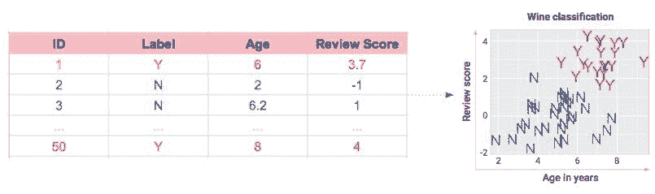
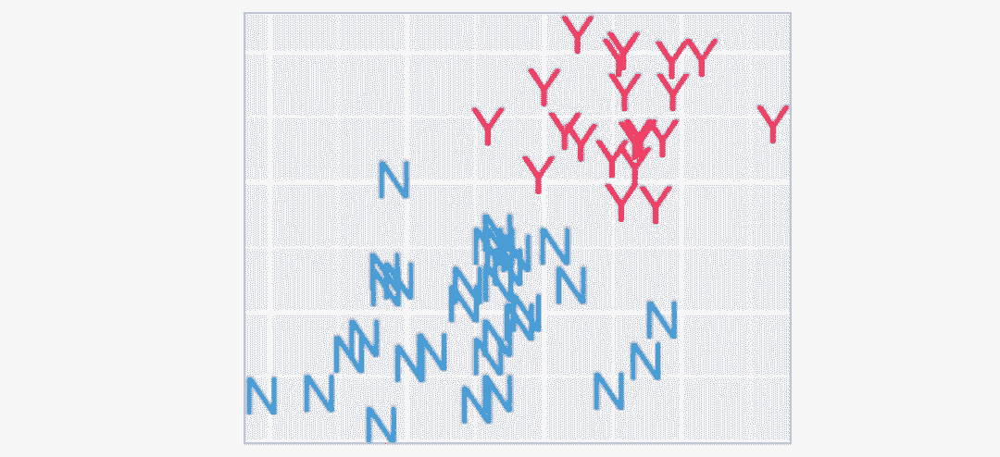
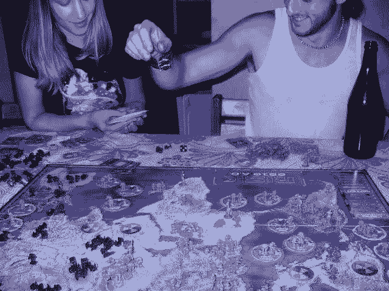
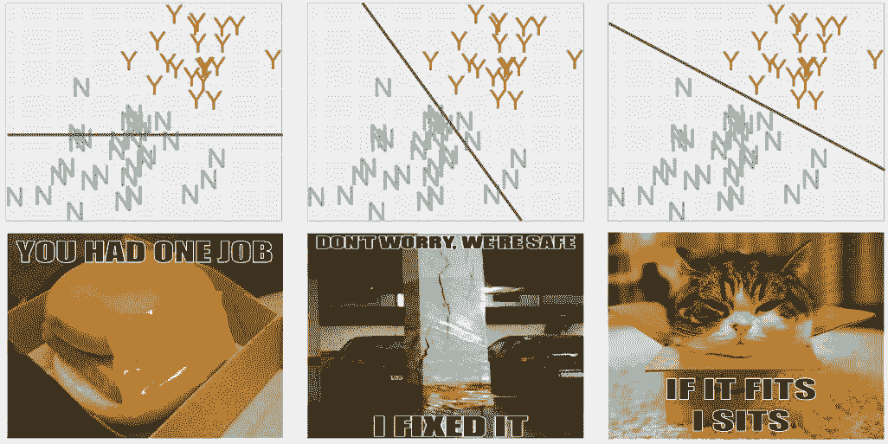
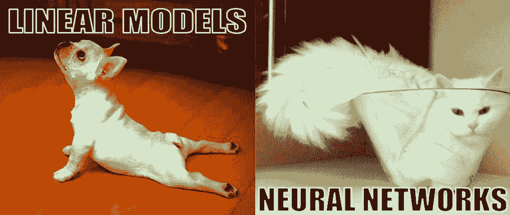
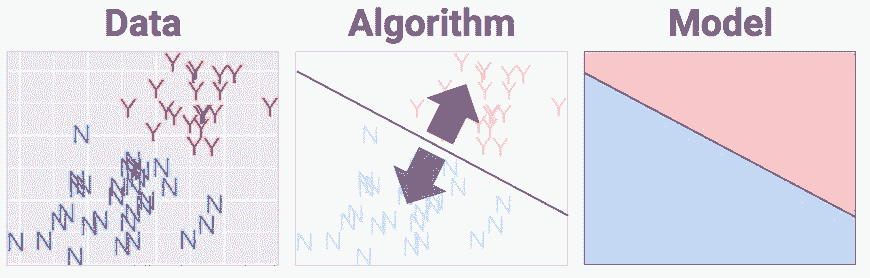
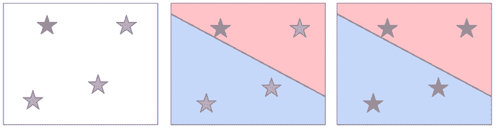
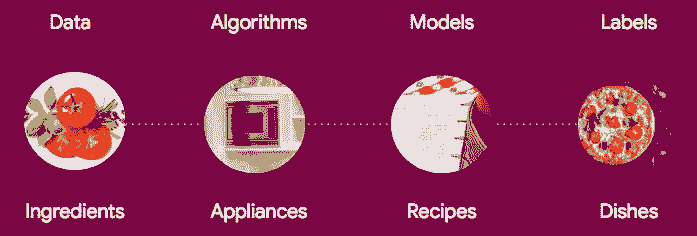
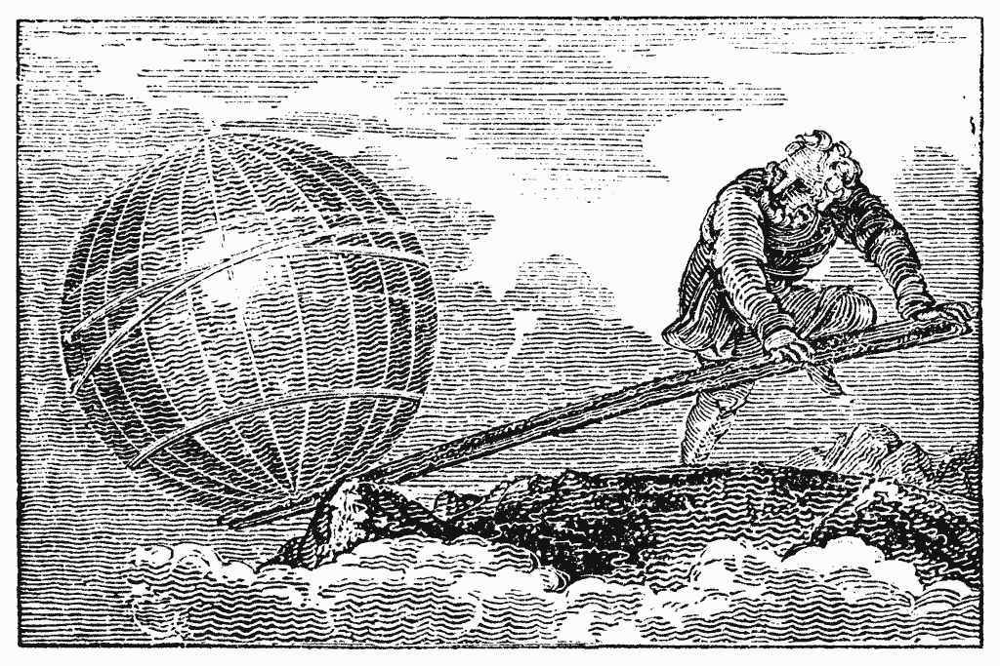

# 入门 | 诗人般的机器学习，ML 工作原理大揭秘

选自 arXiv

**作者：Cassie Kozyrkov**

**机器之心编译**

> 很多人会认为机器学习相比于传统编程是一种编写学习过程的方法，它性能非常神奇且高大上。但是在本文中，谷歌首席决策工程师 Cassie Kozyrkov 小姐姐以非常形象的比喻介绍了机器学习核心原理。

机器学习使用数据中的模式来标记事物。听起来好像很神奇，实际上核心概念相当简单。

比如说标记事物，把酒分为好喝或者不好喝就是一个例子。这种标记不必想得太复杂，记得享受好喝的美酒就行啦~当然，如果你不喜欢喝酒，那无酒精的饮品可以了解一下→_ →

**ML 工作原理**

*机器学习不是魔术。没有数据就无法学习，因此我必须尝一尝。尝过之后我给它一个「N」的标签，N 代表「nope」，意思是「我们不要再试这个了。」这是我们为科学做出的贡献。*

**数据**

学习需要素材。想象一下我尝了 50 种酒（为科学献身！）并将其可视化。每种酒都有年限、评分及我们尝试学习的正确答案：Y 代表「Yummy（好喝）」，N 代表「not-so-yummy（不怎么好喝）」。

*我品尝了酒的味道并把它们的数据记录在电子表格（左），但是我觉得以右图的方式向你展示信息可能更友好。*

**算法**

选择要使用的机器学习算法，就是在选我们要用到的「菜谱」。你要做的就是把红色和蓝色的事物分开，怎样，没问题吧？

如果你想画一条线，那恭喜啦！你发明了一种叫「感知机」的 ML 算法。嗯，一个这么简单的东西名字就是这么高大上！不要被机器学习里的术语给吓住了，实际上很多东西没有其名字那么复杂和厉害啦。

*你会怎么把红色和蓝色的东西分开呢？*

你的线要怎么画？你应该也能看出来，一条水平线不是什么聪明的解决方案。我们的目标是把 N 和 Y 分开来，而不是装饰地平线。

机器学习算法的目的是在数据中选择最合理的地方设置栅栏，而这要取决于数据点的位置。那要怎么做？答案是：优化目标函数。

**优化**

我计划专门写个博客来讲优化问题，但目前先这么着想：目标函数就像是棋盘游戏的得分规则，优化目标函数就是找出游戏的玩法，然后尽可能获得最高分。

目标函数（损失函数）就像是棋盘游戏的得分系统。这张图说明，大学时代我还没有学会优化问题……

通常在 ML 中，我们更喜欢大棒而不是胡萝卜——分数是对错误的惩罚，而游戏规则是这些错误得分越少越好。这也是为什么在机器学习中目标函数被称为「损失函数」，且目标是最小化损失。

想试试吗？回到上面的分类图，把你的手指水平放在屏幕上旋转，直到错误得分为零。

希望你找到的解决方案如下所示：

*来，先看图片最左边；简单粗暴地画一条水平线…中间的会更好一点，但还不是最好的。我喜欢最右边的方法。*

**生活的调味品**

如果你喜欢变化，那么你会爱上算法的。世界上有太多算法了，它们彼此之间的区别在于分割边界时尝试的位置不同。

「优化狂魔」将告诉你以小的幅度旋转栅栏（fence）是绝对不行的，有很多更好的方式可以更快速到达最优位置。一些研究者竭尽全力尝试结合多种方法在最短的距离内到达最优位置，不管地形（由输入决定）变得如何反常。

多样性的另一来源是边界的形状。栅栏不必是直线，不同的算法使用不同的栅栏。

*当我们选择这些复杂术语时，我们其实只是选择了用来划分标签的边界形状。我们想用一条斜线分割样本，还是很多水平／垂直的线或者灵活的曲线？可选择的算法实在是太多了，分类边界的形状也各不相同。*

**潮人喜欢的算法**

现在，机器学习潮人都不喜欢直线。灵活的曲线在机器学习大潮中大受欢迎（即「神经网络」，尽管其实并没有什么神经，这个名字是半个多世纪以前出现的，充满了雄心壮志，似乎没有人喜欢我的建议——将它们重命名为「瑜伽网络」或「多层数学运算」）。

*与其接受与线性算法和大脑神经网络的炒作性质的对比，不如从柔术表演能力的角度来思考神经网络。其他方法在数学瑜伽方面略逊一筹。但是没有什么东西是免费的，神经网络需要付出代价，因此不要相信任何人称神经网络是最优解决方案的说法。*

> *神经网络或许也可以被称为「瑜伽网络」，其特殊能力在于能够提供非常灵活的边界。*

那些专业的算法名称告诉你它们将要用什么形状的栅栏划分输入数据。如果你是一名应用机器学习爱好者，不记住它们也没问题，但在实践中你需要将数据输入到尽可能多的算法中，然后在看起来更有前途的算法上进行迭代。布丁的存在意义就在于吃，那么我们来吃吧～

即使翻阅了课本，你也很难一次就找到解决方案。别担心。这不是个有一个正确答案的游戏，没有人能一次就找到解决方案。你需要修补、尝试并接着玩。留给设计新算法的研究人员一个问题：「它是如何工作的」。（你最终可能会熟悉这些名字，就像你了解困扰你的任何一部烂肥皂剧的角色一样。）

**模型**

一旦栅栏到位，算法就完成了，你从中得到的就是你想要的：一个模型，说白了就是一个「食谱」。现在有一些指令，让电脑在下次看到一瓶新酒时用来将数据转换成决策。如果数据落在蓝色区域，就叫它蓝色。落在红色部分就叫它红色。

**标注**

一旦你把新铸造的模型投入「荐酒」生产中，你就可以通过给电脑输入年龄和评审分数来使用它，系统会查找出对应的区域并输出标签。

*当我有四瓶新酒时，我只需将它们的输入数据与「食谱」中的红色和蓝色区域进行匹配，并相应地给它们贴上标签。看到没？这很容易！*

我们怎么判断它是否有效？检查输出！

通过运行一堆新数据来测试你的系统，并确保它运行良好。不管是谁出的这种主意，跟着做就对了。

**总结**

以下，我另一篇文章为你提供了一份简单直观的总结：

**诗人般的机器学习**

如果你还对机器学习感到困惑，那么可以试试这个类比：一位诗人选择一种方法（或算法）将所有词汇组合在纸上。这种方法决定了诗歌体裁（或决策边界的形状），这种体裁可能是三行俳句，也可能是十四行诗。一旦诗人完成了作品，即找到了将语句填充到十四行诗的最优方法，现在完成的诗歌就相当于机器学习中的模型。

**ML 模型 vs 传统代码**

我想指出，机器学习模型和程序员通过评估问题而写出代码并手工制定规则的做法并不存在不可逾越的鸿沟。用非拟人化的语言来描述机器学习就是，模型在概念上和通常的代码是相同的。

「随着新样本的输入，重复运行算法来调整决策边界」，这种说法会使你难以将机器学习和程序员的标准工作联系起来。人类也可以随新信息的获取而调整代码。

**这就是机器学习的全部吗？**

是的，机器学习工程方法真正困难的部分在于安装软件包，并对粗糙的数据集进行一系列炫酷的操作，这样就相当于在数据上运行了一个非常复杂的算法。接下来是对代码设定的无限修改，请注意别让高贵的名字「超参数调优」迷惑了你。当你在新数据上评估模型的性能时，如果它的性能非常感人，那么你可能就需要重新设计方案并训练。这一修正过程需要持续到获得还能接受的效果，这也就是为什么机器学习工程师需要有良好的耐心。

机器学习不是魔术。机器学习能让你写出不能完全理解，但能自动地工作得很好的代码。不要嫌弃它太简单，杠杆也很简单，但它能撬动整个地球。

*原文链接：**https://hackernoon.com/machine-learning-is-the-emperor-wearing-clothes-59933d12a3cc*

****本文为机器之心编译，**转载请联系本公众号获得授权****。**

✄------------------------------------------------

**加入机器之心（全职记者 / 实习生）：hr@jiqizhixin.com**

**投稿或寻求报道：**content**@jiqizhixin.com**

**广告 & 商务合作：bd@jiqizhixin.com**