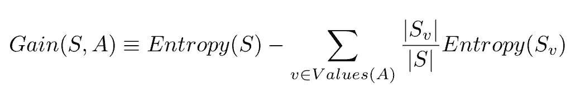

# 入门 | 机器学习第一课：决策树学习概述与实现

选自 HEARTBEAT

**作者：Ishan Sharma**

**机器之心编译**

> 基于树的学习算法在数据科学竞赛中相当常见。这些算法给预测模型赋予了准确性、稳定性以及易解释性。其中，决策树算法也是引人关注的「随机森林」算法的基础构造模块。本文介绍了决策树的概念和简单实现，使用生动的示例帮助理解，希望能够对你有所帮助。


从 Kaggle 到课堂，机器学习第一课就是决策树。之所以关注决策树，是因为与其他 ML 方法相比，决策树的数学复杂度不高，同时能为分类问题提供足够的精度。

对于 ML 的入门者来说，决策树很容易上手。本教程将介绍：

*   决策树是什么

*   如何构建决策树

*   使用 Python 构建决策树

**决策树是什么**

我们跳过正式定义，从概念上了解一下决策树。试想你坐在办公室里，感觉自己饿了，想出去吃点东西，但是午餐要下午 1 点才开始。那么你怎么办呢？当然，你会看一下时间，然后决定能否出去。你可以按照以下逻辑进行思考：


我们刚刚搭了一个决策树！这是一个简单的版本，但我们可以通过加入天气、成本等因素构建一个更为复杂的决策树。如果你想和你的朋友 Jon Snow 去一家中餐馆吃午饭，决策逻辑可以这样表示：


这也是一个决策树。从顶部开始，循着描述当前状况的路线一路向下，直到做出决定。

**注意事项**

我们把场景切换到计算机世界。我们刚刚画的每一个框叫做一个节点。最上面的节点叫做根节点，下面每层的节点叫做叶节点，可以把它想成现实世界中的一棵树，但是根朝上。

每个节点测试我们的世界（数据集）中的某个属性，从节点引出的每个分支对应于该属性的值。给定一棵决策树，决策过程如下：

1.  从根节点开始

2.  观察根节点属性的值

3.  按照与观察值对应的路径往下走

4.  重复以上步骤，直至到达叶节点，这样就能做出决策

**如何构建决策树？**

构建决策树不需要从头开始（除非你是一个像我一样的学生）。尽管如此，这也是一个很好的学习经验，你将学到一些有趣的概念。

构建决策树最常用的算法是 ID3，该算法非常简单。以下是算法伪代码：

```py
1.  `ID3 (Examples, Target_Attribute, Attributes)`

2.  `Create a root node for the tree`

3.  `If all examples are positive, Return the single-node tree Root, with label = +.`

4.  `If all examples are negative, Return the single-node tree Root, with label = -.`

5.  `If Atributes list is empty, then Return the single node tree Root,`

6.  `with label = most common value of the target attribute in the examples.`

7.  `Otherwise Begin`

8.  `A ← The Attribute that best classifies examples.`

9.  `Decision Tree attribute for Root = A.`

10.  `For each possible value, vi, of A,`

11.  `Add a new tree branch below Root, corresponding to the test A = vi.`

12.  `Let Examples(vi) be the subset of examples that have the value vi for A`

13.  `If Examples(vi) is empty`

14.  `Then below this new branch add a leaf node with label = most common target value in the examples`

15.  `Else below this new branch add the subtree ID3 (Examples(vi), Target_Attribute, Attributes – {A})`

16.  `End`

17.  `Return Root`

```

你将注意到这样一个细节：在循环开始之后，算法必须选择一个属性，为样本分类选出最佳方案。那么算法会怎么做呢？为了理解这一点，我们必须深入了解一些数学知识。别担心，不会太难。

**信息增益和熵**

信息增益是选择最佳属性常用且容易上手的方法之一。它使用另一种叫做熵的属性计算出来。

熵是物理学和数学中的概念，指系统的随机性或混乱度。在信息论中，它指的是一组样本的混乱度。

我们通过一个例子来说明：你有两个装满巧克力的袋子。巧克力有红的也有蓝的。你想通过计算巧克力的数量来测量袋子的熵。所以你坐下来开始数。2 分钟后，你发现第一袋有 50 块巧克力。其中 25 块是红色的，25 块是蓝色的。第二袋也有 50 块巧克力，都是蓝色的。

在这种情况下，第一个袋子的熵是 1，因为里面的巧克力呈均匀分布。第二个袋子的熵为零，因为里面的巧克力没有随机性。

我们用下面这个公式计算一个系统的熵：


在这个公式中，c 代表类别或属性的总数，p_i 代表属于第 i 类的样本数量。是不是有点懵？我们通过例子了解一下：

让我们回到刚刚的巧克力袋子。我们有两个类别：红色（R）和蓝色（B）。第一个袋子里有 25 块红色巧克力。巧克力总数是 50。因此，p_i=25/50。蓝色类别也是这样处理。把这些值代入熵方程，我们得到以下结果：


解方程，结果如下：


如果想验证结果或尝试其他例子，请移步 Wolfram Alpha：http://www.wolframalpha.com/input/?i=-(25%2F50)log2(25%2F50)+-+(25%2F50)log2(25%2F50)。

继续计算第二个袋子的熵，里面有 50 块红色巧克力，0 块蓝色巧克力。得到的熵是 0。

如果你理解这个概念，太好了！我们现在转到信息增益。

**信息增益**

信息增益是由基于给定属性的样本分割导致的熵下降。从数学角度上看，信息增益的定义为：



S 代表整个样本集，A 代表我们想要分割的属性。|S| 代表样本数量，|Sv| 表示属性 A 当前值的样本数量。

仍然很复杂，是不是？那我们举个例子，看看它的工作流程。

**构建决策树**

首先，给巧克力的例子添加一些细节。我们已经知道袋 1 中有 25 块红色巧克力、25 块蓝色巧克力。现在，我们还要考虑巧克力的品牌。红色巧克力中，有 15 块是士力架，10 块是 Kit Kat 牌。蓝色巧克力中，20 块是 Kit Kat 牌，5 块是士力架。假设我们只想吃红色的士力架。那么这里，红色士力架（15）是正例，其他的巧克力（如红色 Kit Kat 和蓝色士力架）都是负例。

现在，与我们的类别（吃／不吃）相关的数据集的熵是：


现在我们来回顾一下，我们有 50 块巧克力。如果只看属性「颜色」，则我们有 25 个红色的、25 个蓝色的。如果看属性「品牌」，则我们有 20 块士力架、30 块 Kit Kat 巧克力。

为了构建决策树，我们需要选择其中一个属性作为根节点。我们想要选择具备最高信息增益的属性。现在我们来计算这些属性的信息增益。

颜色相关的信息增益是：


我们刚才计算了与类别相关的巧克力的熵，是 0.8812。如果我们想吃 15 块士力架而不是 10 块 Kit Kat，则红色巧克力的熵是：


如果我们不想吃蓝色巧克力，则熵为 0。

我们的信息增益计算就变成了：


如果我们分割颜色，则信息增益是 0.3958。

现在我们来看下品牌。如果我们想吃 15 块士力架（共有 20 块），不想吃 Kit Kat。则士力架的熵是：


如果我们不吃 Kit Kat，则熵为 0。信息增益为：


品牌分割的信息增益是 0.5567。

由于品牌的信息增益较大，我们将基于品牌进行分割。下一级，我们只要左边的颜色。我们可以轻松地根据颜色进行分割，无需进行任何计算。决策树如下：


谁能想到吃块巧克力这么难呢？

现在你应该了解决策树的运行原理了。

**使用 Python 3 实现决策树**

现在我们继续为巧克力数据集构建决策树。

代码和数据地址：https://github.com/ishansharma/decision_trees_tutorial/

1.  创建新文件夹。

2.  从 GitHub 下载 data.csv（https://github.com/ishansharma/decision_trees_tutorial/blob/master/data.csv）。

3.  你可能需要安装 Scipy、Scikit-Learn 和 Pandas，如果没有安装的话。我推荐使用虚拟环境，参见：http://docs.python-guide.org/en/latest/dev/virtualenvs/。从终端运行以下命令行，安装 Pandas 和 Scikit-Learn：

```py
1.  `pip install scikit-learn`

2.  `pip install scipy`

3.  `pip install pandas`

```

4\. 安装后，创建新文件 decision_tree.py，并将以下两行添加进去：

```py
1.  `from pandas import read_csv`

2.  `from sklearn import tree`

```

5\. 使用 Pandas 加载数据：

```py
1.  `data = read_csv("data.csv")`

```

6\. Pandas 可以处理大型数据集，且具备大量可视化功能。它在使用 Python 的大数据流程中广泛使用，因此使用 Pandas 是个好主意。在 Pandas 中你可以使用 head() 方法快速查看加载数据：

```py
1.  `print(data.head())`

```

下图显示了数据的前 5 行。


7\. 我使用 Class 列来确定我们是否想吃巧克力。1 代表吃，0 代表不吃。

8\. 接下来，我们需要对数据执行一些预处理。Scikit-Learn 默认不支持文本标签，因此我们使用 Pandas 将文本标签转换成数字。只需要添加以下两行：

```py
1.  `data['Color'] = data['Color'].map({'Red': 0, 'Blue': 1})`

2.  `data['Brand'] = data['Brand'].map({'Snickers': 0, 'Kit Kat': 1})`

```

9\. 刚才我们改变了 Color 属性，用 0 代表红色，1 代表蓝色。类似地，在 Brand 列中，我们用 0 替代士力架，用 1 替换 Kit Kat。

10\. 如果你使用 head() 查看数据集，你将看到品牌和颜色的值已经变成了整数：


11\. 最后，按惯例用 X 表示训练属性，Y 表示输出类别，因此我们执行以下命令：

```py
1.  `predictors = ['Color', 'Brand']`

2.  `X = data[predictors]`

3.  `Y = data.Class`

```

12\. 差不多完成了。我们现在已经准备好训练决策树了。添加以下两行在我们的数据上训练决策树：

```py
1.  `decisionTreeClassifier = tree.DecisionTreeClassifier(criterion="entropy")`

2.  `dTree = decisionTreeClassifier.fit(X, Y)`

```

13\. 完成了吗？我们对决策树进行快速可视化。添加下列行，并运行程序：

```py
1.  `dotData = tree.export_graphviz(dTree, out_file=None)`

2.  `print(dotData)`

```

14\. 输出如下：


15\. 复制输出，访问 WebGraphviz (http://www.webgraphviz.com/) 并粘贴输出，点击 Generate Graph。你讲看到一个与上文决策树类似的决策树：


16\. 这颗树有点难懂，因为有很多额外信息，不过你可以看到它先基于列 1（Brand）进行分割，再基于列 2（Color）进行分割。

一旦构建处这颗树，那么未来的预测就很简单了。我们来看一下我们是否想吃蓝色的 Kit Kat 巧克力。

将以下行添加至 decision_tree.py 文件的末尾：

```py
1.  `print(dTree.predict([[1, 1]]))`

```

输出为 [0]，意味着分类是不吃。如果你尝试红色士力架（print(dTree.predict([[0, 0]]))），则输出是 [1]。

**继续研究**

经过以上学习，你应该对决策树有所了解，同时学会了简单的实现。如果希望进一步探索，你可以参考这些资源：

1.  Scikit-Learn 上的决策树页面，讨论在更大的数据集和其他度量下分割数据：http://scikit-learn.org/stable/modules/tree.html

2.  Kaggle 上的机器学习教程，一个深度教程，教你参与 Kaggle 竞赛，并构建一个住房数据的决策树模型：https://www.kaggle.com/learn/machine-learning

3.  Saving your Scikit Models：本教程中，每次运行都会训练一遍模型。这在小数据集中还可以接受，但对于更大的数据集来说最好是一次训练，随后仅使用。这个教程可以教你如何保存自己的模型：http://scikit-learn.org/stable/modules/model_persistence.html

4.  将训练好的模型转换为 Core ML：如果你为另一个数据集训练了自己的决策树，并希望在 iOS 设备上运行，那么你就需要将已训练模型转换为 Core ML 框架版本：https://developer.apple.com/documentation/coreml/converting_trained_models_to_core_ml 

*原文链接：https://heartbeat.fritz.ai/introduction-to-decision-tree-learning-cd604f85e236*

****本文为机器之心编译，**转载请联系本公众号获得授权****。**

✄------------------------------------------------

**加入机器之心（全职记者/实习生）：hr@jiqizhixin.com**

**投稿或寻求报道：editor@jiqizhixin.com**

**广告&商务合作：bd@jiqizhixin.com**