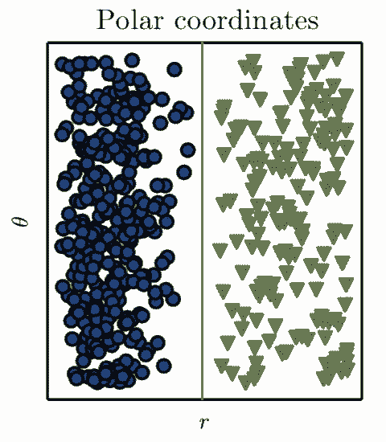

# 这是一份「不正经」的深度学习简述

选自 TowardsDataScience

**作者：Favio Vazquez**

**机器之心编译**

**参与：路雪、刘晓坤、李泽南**

> 作为人工智能领域里最热门的概念，深度学习会在未来对我们的生活产生显著的影响，或许现在已经是了，从 AlphaGo 到 iPhone X 上的人脸识别（FaceID），背后都有它的身影。关于深度学习，我们能够看到很多优秀的介绍、课程和博客，本文将列举其中的精华部分，而且，你会发现这是一篇「不一样」的文章。

不一样在哪儿呢？可能是本文没有按照「正常」的深度学习博客结构：从数学讲起，然后介绍论文、实现，最后讲应用。我希望用讲故事的方式来介绍深度学习，这可能要比只介绍信息和公式要更加平易近人一些。

**我为什么要写这篇深度学习简介？**

有时候，把自己的思考过程记录下来非常重要。

目前，深度学习（Deep Learning）是数据科学、AI、技术和人类生活中重要的一部分，它值得我们去关注。你不能简单地说：「深度学习就是往神经网络中添加一个层，哇，神奇！」。不，不是这样。我希望读完本文后，大家会对深度学习有不一样的认识。

**深度学习时间线**

我根据多篇论文和其他文章的内容绘制了这份时间线，旨在使大家看到深度学习不只是神经网络。在它的发展过程中出现了真正的理论进步、软件和硬件进展。

**深度学习有何「奇怪」之处？**

深度学习已经出现很久了，那么为什么它直到最近 5-7 年才闻名于世，并迅速发展起来呢？

如前所述，直到 21 世纪初，我们仍然缺乏训练非常深层神经网络的可靠途径。现在，随着多个简单却重要的理论、算法进步，硬件发展（大部分是 GPU，现在是 TPU）和数据的指数级增长和积累，深度学习快速发展，并改变我们做机器学习的方式。

深度学习也是非常活跃的研究领域，今天，众多研究者们仍在寻找最好的模型、网络拓扑、最好的超参数优化方法等等。要想像其他活跃的科学领域一样紧跟研究成果很难，但是并非不可能。

Hofer 等人在论文《Deep Learning with Topological Signatures》如此介绍拓扑和机器学习：

> 近期代数拓扑方法仅在机器学习社区出现，最显著的是，它出现在术语「拓扑数据分析」（topological data analysis，TDA）下面。TDA 帮助我们从数据中推断出相关拓扑和几何信息，因此它提供了一种看待多种机器学习问题的新型、有益的视角。

对我们来说很幸运的是，有很多人在帮助我们理解和消化此类信息，比如吴恩达的课程、一些相关博客等等。

参考阅读：

*   [机器之心专访吴恩达，深度学习课程项目 Deeplearning.ai 正式发布](http://mp.weixin.qq.com/s?__biz=MzA3MzI4MjgzMw==&mid=2650729714&idx=1&sn=f1b85b00e7cba588706fb4744171560a&chksm=871b288cb06ca19a309847a55db5bb3036e7e2c47132edd23a5bd8f5b48335f69b430b316316&scene=21#wechat_redirect)

*   [吴恩达 Deeplearning.ai 课程学习全体验：深度学习必备课程（已获证书）](http://mp.weixin.qq.com/s?__biz=MzA3MzI4MjgzMw==&mid=2650729826&idx=1&sn=9efa4e62ae2456cc509b85a66a376be4&chksm=871b291cb06ca00ac758954e0d76301490af5d5f4d6ab5824f0e46ae0b0dbfa891fb9b210036&scene=21#wechat_redirect)

*   [入门 | 吴恩达 Deeplearning.ai 全部课程学习心得分享](http://mp.weixin.qq.com/s?__biz=MzA3MzI4MjgzMw==&mid=2650732373&idx=2&sn=a9e7e73cf7341e82ab8b803bbcc9a4b0&chksm=871b332bb06cba3d7568b77e5a9067d3e57ab066044cd2617958987805dd2b070feb0c4360a9&scene=21#wechat_redirect)

*   [资源 | 吴恩达 deeplearning.ai 第四课学习心得：卷积神经网络与计算机视觉](http://mp.weixin.qq.com/s?__biz=MzA3MzI4MjgzMw==&mid=2650733632&idx=2&sn=12ded354c742dfda520c8da72df9766a&chksm=871b383eb06cb128fc60e7de8a31bba2cf3ca7b9d98b4c34c2d0ae2ff67942ec63295903cf4b&scene=21#wechat_redirect)

*   [资源 | 吴恩达 deeplearning.ai 五项课程完整笔记了解一下？](http://mp.weixin.qq.com/s?__biz=MzA3MzI4MjgzMw==&mid=2650739143&idx=2&sn=a8f9c0dd6e41756e724caf96c2243fb9&chksm=871ad5b9b06d5caf35ab9995ed1b67aba2a1d75454e74532276f836da8e7bdf2765be09f1089&scene=21#wechat_redirect)

这对我来说有些奇怪或者不寻常，因为正常情况下你必须花费一段时间（甚至好多年）才能消化论文或期刊中那么多艰深、前沿的信息。当然，现在大部分科学领域从论文到一篇博客解读的时间越来越快，虽然我认为深度学习还有一些不一样的感觉。

**深度学习和表征学习的突破性成果**

机器学习领域中的大多数人都认为，几十年来深度学习论文中的每个最新思想（具体来说是指神经网络或算法的新型拓扑结构和配置）都是机器学习中的最棒思想（要知道深度学习是机器学习的子领域）。

我在本文中用了很多次「学习」（learning）这个词，那么「学习」究竟是什么意思呢？

在机器学习中，「学习」是指为你正在分析和研究的数据自动搜索更好的数据表征的过程（记得，这并不是让机器来学习）。

「表征」（representation）一词在这个领域中特别重要，那什么是「表征」呢？「表征」就是观察数据的方式。

举个例子，如下图所示，假设问题是画出一条直线将图中的蓝色圆和绿色三角形分开：

*Ian Goodfellow et al. (《深度学习》, 2016)*

在《深度学习》这本书中，作者解释道：我们使用笛卡尔坐标系来表征数据，这时该问题不可解。

难道就没办法了吗？当然不是。如果我们采用不同的方式来表征数据，使得可以用直线分离不同的数据类型。这种方法在数学中已经出现了好几百年。在这个例子中我们需要的仅仅是一次坐标变换。通过坐标变换，我们得到了问题的解：

*Ian Goodfellow et al. (《深度学习》, 2016)*

现在我们就可以画出一条直线来分离数据：

因此在这个例子中，我们通过手动探索并选择了能获得更好的表征方式的变换。但是，假如我们能开发一个系统或程序来自动搜索不同的表征（在这个例子中是坐标变换），然后确定新方法的分类准确率的计算方式，这时候就变成了机器学习。

这一点很重要，深度学习是使用不同类型神经网络的表征学习，通过优化网络的超参数来获得对数据的更好表征。

而没有深度学习中的突破性研究，这一切也将不可能出现，这里我列出几个经典案例：

**1：反向传播**

参考阅读：

*   [被 Geoffrey Hinton 抛弃，反向传播为何饱受质疑？（附 BP 推导）](http://mp.weixin.qq.com/s?__biz=MzA3MzI4MjgzMw==&mid=2650731098&idx=1&sn=c7391caee3a567b4b046406d53f022f2&chksm=871b3624b06cbf320f3725fe452d291e04a4a8c1beda8ee9e00f1d10266847be4736090aade3&scene=21#wechat_redirect)

*   A theoretical framework for Back-Propagation——Yann Lecun：http://yann.lecun.com/exdb/publis/pdf/lecun-88.pdf

**2：更好的初始化网络参数。**需要记住的是：初始化策略需要根据所使用的激活函数来选择。

参考阅读：

*   「深度学习的权重初始化」——Coursera：https://www.coursera.org/learn/deep-neural-network/lecture/RwqYe/weight-initialization-for-deep-networks

*   How to train your Deep Neural Network：http://rishy.github.io/ml/2017/01/05/how-to-train-your-dnn/

*   斯坦福大学 CS231n Convolutional Neural Networks for Visual Recognition：http://cs231n.github.io/neural-networks-2/#init

**3：更好的激活函数。**这意味着，可以更快地逼近函数，从而实现更快的训练。

参考阅读：

*   [一文概览深度学习中的激活函数](http://mp.weixin.qq.com/s?__biz=MzA3MzI4MjgzMw==&mid=2650732724&idx=4&sn=5230b8bb1811cda38ab97afb417d1613&chksm=871b3ccab06cb5dcdf0bdfadcc7ae85d8ae95588bed0b884a55ba50b76d541771104675fbb3e&scene=21#wechat_redirect)

*   [神经网络中激活函数的作用](http://mp.weixin.qq.com/s?__biz=MzA3MzI4MjgzMw==&mid=2650718853&idx=4&sn=4f33d503f1602e608b34c6cda4e55dad&scene=21#wechat_redirect)

**4：Dropout：防止过拟合等问题。**

*   Learning Less to Learn Better—Dropout in (Deep) Machine learning：https://medium.com/@amarbudhiraja/https-medium-com-amarbudhiraja-learning-less-to-learn-better-dropout-in-deep-machine-learning-74334da4bfc5

*   Geoffrey Hinton 等人的「Dropout: A Simple Way to Prevent Neural Networks from Overfitting」：http://www.jmlr.org/papers/volume15/srivastava14a/srivastava14a.pdf?utm_content=buffer79b43&utm_medium=social&utm_source=twitter.com&utm_campaign=buffer

**5：卷积神经网络（CNN）**

参考阅读：

*   [一文看懂卷积神经网络](http://mp.weixin.qq.com/s?__biz=MzA3MzI4MjgzMw==&mid=2650738083&idx=3&sn=f57af7f2f36dbe100850dbfe56428e81&chksm=871ac9ddb06d40cb9c52902e79277def16ae370f55beccae169d549cffc83af8b112df3d7ba7&scene=21#wechat_redirect)

*   Yann LeCun 等人的「Gradient-Based Learning Applied to Document Recognition」：http://yann.lecun.com/exdb/publis/pdf/lecun-01a.pdf

**6：残差网络（ResNet）**

参考阅读：

*   孙剑等人的论文「Deep Residual Learning for Image Recognition」：https://arxiv.org/abs/1512.03385v1

*   论文「Residual Networks of Residual Networks: Multilevel Residual Networks」：https://arxiv.org/abs/1608.02908

**7：基于区域的 CNN**，可用于目标检测等。

参考阅读：

*   论文「Rich feature hierarchies for accurate object detection and semantic segmentation」：https://arxiv.org/abs/1311.2524v5

*   [先理解 Mask R-CNN 的工作原理，然后构建颜色填充器应用](http://mp.weixin.qq.com/s?__biz=MzA3MzI4MjgzMw==&mid=2650739707&idx=2&sn=feadded92a57db2aa890e6ad2f187cc8&chksm=871ad785b06d5e93a08200024b32c8d6c1b0939be4cd95940ae463a21943a7ced1e1f5b1e7d7&scene=21#wechat_redirect)

*   [从论文到测试：Facebook Detectron 开源项目初探](http://mp.weixin.qq.com/s?__biz=MzA3MzI4MjgzMw==&mid=2650736577&idx=2&sn=4b49c25001bd90b4185c46f676dd364f&chksm=871ac3bfb06d4aa9ae9e6fde86c4a417780c61dc3c2204078a47b2e9c8e69925bc8a121a6b4d&scene=21#wechat_redirect)

**8：循环神经网络（RNN）与 LSTM**

参考阅读：

*   [LSTM 入门必读：从入门基础到工作方式详解](http://mp.weixin.qq.com/s?__biz=MzA3MzI4MjgzMw==&mid=2650729264&idx=1&sn=e748f5ba8142ece2fa63529889b602b8&chksm=871b2f4eb06ca6588bb34d67e9d5ee67d0d614259e9a54a75a96379abff53a47efebd52c2454&scene=21#wechat_redirect)

*   [在调用 API 之前，你需要理解的 LSTM 工作原理](http://mp.weixin.qq.com/s?__biz=MzA3MzI4MjgzMw==&mid=2650734862&idx=1&sn=1a2adda4da7bd7509f10556e8ae218f4&chksm=871ac570b06d4c6644802a4dafe8ab56805ed642dba2e1e4b29ccbaa0d9245c522b7c9a28308&scene=21#wechat_redirect)

*   [从 90 年代的 SRNN 开始，纵览循环神经网络 27 年的研究进展 ](http://mp.weixin.qq.com/s?__biz=MzA3MzI4MjgzMw==&mid=2650735722&idx=1&sn=f0129db9d2fb64efab7819f2c1b65505&chksm=871ac014b06d4902e8a59093d378b87a65770327c7b1bb9e4a0c76f4649b6893937c09af3598&scene=21#wechat_redirect)

**9：生成对抗网络（GAN）**

参考阅读：

*   Ian Goodfellow 等人的 GAN 论文：https://arxiv.org/abs/1406.2661v1

*   [机器之心 GitHub 项目：GAN 完整理论推导与实现，Perfect！](http://mp.weixin.qq.com/s?__biz=MzA3MzI4MjgzMw==&mid=2650731540&idx=1&sn=193457603fe11b89f3d298ac1799b9fd&chksm=871b306ab06cb97c502af9552657b8e73f1f5286bc4cc71b021f64604fd53dae3f026bc9ac69&scene=21#wechat_redirect)

**10：Geoffrey Hinton 近期提出的 Capsule**

*   [终于，Geoffrey Hinton 那篇备受关注的 Capsule 论文公开了](http://mp.weixin.qq.com/s?__biz=MzA3MzI4MjgzMw==&mid=2650732472&idx=1&sn=259e5aa77b62078ffa40be9655da0802&chksm=871b33c6b06cbad0748571c9cb30d15e9658c7509c3a6e795930eb86a082c270d0a7af1e3aa2&scene=21#wechat_redirect)

*   [浅析 Geoffrey Hinton 最近提出的 Capsule 计划](http://mp.weixin.qq.com/s?__biz=MzA3MzI4MjgzMw==&mid=2650731207&idx=1&sn=db9b376df658d096f3d1ee71179d9c8a&chksm=871b36b9b06cbfafb152abaa587f6730716c5069e8d9be4ee9def055bdef089d98424d7fb51b&scene=21#wechat_redirect)

*   [Capsule 官方代码开源之后，机器之心做了份核心代码解读](http://mp.weixin.qq.com/s?__biz=MzA3MzI4MjgzMw==&mid=2650737203&idx=1&sn=43c2b6f0e62f8c4aa3f913aa8b9c9620&chksm=871ace4db06d475be8366969d74c4b2250602f5e262a3f97a5faf2183e53474d3f9fd6763308&scene=21#wechat_redirect)

当然，还有很多其它的重要成果。我认为正是以上所列举的研究给我们带来了重要的理论和算法上的突破，并改变了世界，推动了深度学习的革命。

**如何入门深度学习？**

深度学习的入门并不容易，但我会尽我所能指导你完成这一阶段。参考以下学习资源，但记住，你需要的不仅仅是观看视频和阅读论文，还需要不断地理解、编程、写代码、经历失败，然后成功。

**-1\. 请先学习 Python 和 R 语言：）**

**0\. 学习吴恩达的深度学习课程**

**Siraj Raval 的视频**：Siraj Raval 非常 amazing，他可以用风趣易懂的方式来解释复杂的概念。你可以在 YouTube 上关注他的个人频道，其中这两个视频非常棒：

**François Chollet 的两本书：**

*   Deep Learning with Python

*   Deep Learning with R

**分布式深度学习**

深度学习是数据科学家应该学习的最重要的工具和理论之一。我们很幸运，有那么多深度学习方向的研究、软件、工具和硬件被开发出来。

深度学习的计算成本很昂贵，即使在理论、软件和硬件有所进展的情况下，我们也需要大数据和分布式机器学习的发展来提升深度学习的性能和效率。为此，人们开发出了分布式框架（Spark）和深度学习库（TensorFlow、PyTorch 和 Keras）。

参考阅读：

*   [学习了！谷歌今日上线基于 TensorFlow 的机器学习速成课程（中文版）](http://mp.weixin.qq.com/s?__biz=MzA3MzI4MjgzMw==&mid=2650738445&idx=1&sn=b2dbe3aa45c253e37b4a81a0ba3dc4a0&chksm=871acb73b06d426503929c75ff2c8112e04ed8c0acfc80e03d64f36010da255b90e3ea9e9628&scene=21#wechat_redirect)

*   [三天速成！香港科技大学 TensorFlow 课件分享](http://mp.weixin.qq.com/s?__biz=MzA3MzI4MjgzMw==&mid=2650731659&idx=1&sn=0ad68e73f2501eb9d2d9d28eae3e1390&chksm=871b30f5b06cb9e319d8231ea735c564f2b20ebe917fd9b34e24be815095fd3b69c3461bf386&scene=21#wechat_redirect)

*   [四天速成！香港科技大学 PyTorch 课件分享](http://mp.weixin.qq.com/s?__biz=MzA3MzI4MjgzMw==&mid=2650731685&idx=1&sn=9b8cfdf380ff9c8c91b45ebe7452f4ee&chksm=871b30dbb06cb9cd199412e72d7740970e82c7c61057473871287706a4239f3661eafbfd1630&scene=21#wechat_redirect)

*   [分布式 TensorFlow 入坑指南：从实例到代码带你玩转多机器深度学习](http://mp.weixin.qq.com/s?__biz=MzA3MzI4MjgzMw==&mid=2650734471&idx=1&sn=be4cd4b85ed84f997baf4c88543dc3f4&chksm=871b3bf9b06cb2ef94ea9531ec74fef14b8db5d1996b0cf0c9bd31ca3594ef1f54feaea17109&scene=21#wechat_redirect)

*   分布式 Keras（Keras+Spark）：https://github.com/cerndb/dist-keras

*   在谷歌云上运行 TensorFlow 和 Spark：https://cloud.google.com/blog/big-data/2017/11/using-apache-spark-with-tensorflow-on-google-cloud-platform

**使用深度学习完成任务**

正如之前所说的，深度学习领域最重要的里程碑之一就是 TensorFlow 的创建与开源。

TensorFlow 是一个使用数据流图进行数学计算的开源软件库，图中的节点表示数学运算，而图的边表示在节点之间通信的多维数据阵列（张量）。

上图是广义相对论黎曼张量中的张量运算。

张量，从数学定义上看，就是简单的数或函数的阵列，根据坐标变换的特定规则进行变换。

但是在机器学习和深度学习领域中，张量是向量和矩阵在更高维度上的泛化形式。TensorFlow 将张量表示为基础数据类型的 n 维数组。

我们在深度学习中广泛使用张量，但是你不必成为这方面的专家，只需要稍微了解就足够了。

参考阅读：

*   [教程 | 深度学习初学者必读：张量究竟是什么？](http://mp.weixin.qq.com/s?__biz=MzA3MzI4MjgzMw==&mid=2650728195&idx=3&sn=4d7e69e3f74a0679967a8186214635a3&chksm=871b237db06caa6bd51d4bc54a13608e893f15844abba298a8c74087fdae8e911e2ecf4c9d5e&scene=21#wechat_redirect)

现在你已经了解了我之前提到的突破和编程框架（如 TensorFlow 或 Keras），那么你应该明白自己需要了解和使用深度学习的哪些方面了。

但是目前我们使用深度学习取得了什么成就？下面我列举了一些（来自 François Chollet 的书）：

*   接近人类水平的图像识别能力；

*   接近人类水平的语音识别能力；

*   接近人类水平的手写体转录能力；

*   机器翻译水平提高；

*   文本转语音水平提高；

*   数字助手，如 Google Now 或 Amazon Alexa；

*   接近人类水平的自动驾驶能力；

*   广告定向投放水平提高；

*   网页搜索结果优化；

*   自然语言问答能力提高；

*   超越人类的围棋水平。

参考阅读：

*   30 AMAZING APPLICATIONS OF DEEP LEARNING：http://www.yaronhadad.com/deep-learning-most-amazing-applications/

关于深度学习的未来，我认为 GUI 和 AutoML 是深度学习不久后能够达到的。不要误会，我喜欢写代码，但是我也认为以后我们写的代码数量会减少。我们不能重复浪费那么多时间一遍一遍写同样的东西，因此我认为这两个功能（GUI 和 AutoML）将帮助数据科学家提高生产力，解决更多问题。

参考阅读：

*   [业界 | 李飞飞、李佳宣布发布 Cloud AutoML：AI 技术「飞入寻常百姓家」](http://mp.weixin.qq.com/s?__biz=MzA3MzI4MjgzMw==&mid=2650736316&idx=3&sn=64e629475cd2168f02573925975e8e38&chksm=871ac2c2b06d4bd4d126b0bc47fde14bfea662ec07ab5a482825f85cb9a03b621b5d8978f8a7&scene=21#wechat_redirect)

*   [专栏 | 自动选模型+调参：谷歌 AutoML 背后的技术解析](http://mp.weixin.qq.com/s?__biz=MzA3MzI4MjgzMw==&mid=2650737203&idx=4&sn=031d07168f84d269a5783429532ee81f&chksm=871ace4db06d475bb5457511442c8565fde63baefd5d7da5b96f2a6fc7f19159592a5fc9b245&scene=21#wechat_redirect)

在简单的 GUI 中完成这些任务的最好免费平台之一是 Deep Cognition。其简单的拖放界面可以帮助你轻松设计深度学习模型。Deep Learning Studio 具备先进的 AutoML 功能（几乎可以一键完成），可以为你的自定义数据集设计深度学习模型。

该平台还是免费的～

我的意思是，这个领域的发展实在太迅速，现在我们已经可以使用简单的 GUI 来学习本文中涉及的所有复杂和有趣的概念。

我喜欢这个平台的原因是，你不需要安装任何东西就可以写代码，用命令行或 Notebook 来使用 TensorFlow、Keras、Caffe、MXNet 等。 

其它有趣的深度学习应用：

*   http://skejul.com/

*   https://www.microsoft.com/en-us/seeing-ai/

*   https://dialogflow.com/

*原文链接：https://towardsdatascience.com/a-weird-introduction-to-deep-learning-7828803693b0*

****本文为机器之心编译，**转载请联系本公众号获得授权****。**

✄------------------------------------------------

**加入机器之心（全职记者/实习生）：hr@jiqizhixin.com**

**投稿或寻求报道：editor@jiqizhixin.com**

**广告&商务合作：bd@jiqizhixin.com**