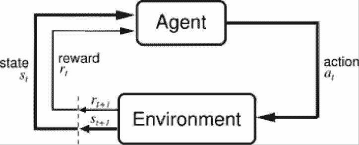
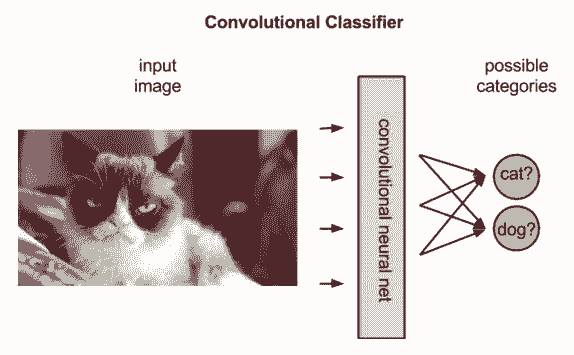
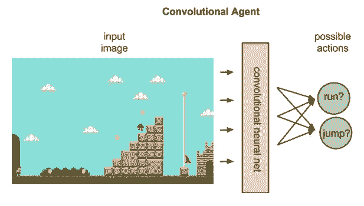

# 入门 | 强化学习的基本概念与代码实现

选自 DeepLearning4j

**机器之心编译**

**参与：Nurhachu Null、李泽南**

> 从 AlphaGo 到自动驾驶汽车，我们能在很多最先进的人工智能应用中找到强化学习的身影。这种技术是如何从零开始慢慢学会完成任务，成长为「超越人类水平」的专家的？本文将会进行一番简要介绍。

神经网络造就了最近我们在计算机视觉、机器翻译和时间序列预测等领域上的突破—同时它也可以和强化学习算法结合来创建一些惊人的成果，例如 AlphaGo（参阅：[无需人类知识，DeepMind 新一代围棋程序 AlphaGo Zero 再次登上 Nature](http://mp.weixin.qq.com/s?__biz=MzA3MzI4MjgzMw==&mid=2650732104&idx=1&sn=8d0f5b9a1d5ede22cc1017c1c596afe2&chksm=871b3236b06cbb2051eaa1a4a8cf5b8c307c1655d9680af7e81f452ebe590a0b557bca84ab4c&scene=21#wechat_redirect)）。

强化学习指的是面向目标的算法，这种算法学习如何在一些具体的步骤中达到一个目标或者最大化；例如，最大化一个游戏中通过一些行动而获得的得分。它们可以从一个空白状态开始，然后在合适的条件下达到超越人类水平的性能。就像被糖果和体罚刺激的小孩子一样，当它们做出错误的预测时，这些算法会受到惩罚，当它们做出正确的预测时，它们会得到奖励—这便是强化的意义所在。

结合深度学习的强化算法可以在围棋和 Atari 游戏中打败人类冠军。尽管这听起来还不具有足够的说服力，但是这已经远远优于它们之前的成就了，而且目前最先进的进步是很迅速的。

两个强化学习的算法 Deep-Q learning 和 A3C 已经在 Deeplearning4j 库上实现了，现在，它已经可以玩《毁灭战士（Doom）》了。

强化学习解决了对即刻行动和与之相关的延迟响应之间的关联的问题。就像人类一样，强化学习算法必须等待一会，看看它们决策的结果如何。它们运行在延迟响应的环境之中，在这种环境中理解哪些行动在多个步骤后导致哪些结果是很困难的。

我们可以期望强化学习算法在更加模糊的现实环境中表现得更好，它可以在真实环境下从任意多个可能的行动中进行选择，而不是从有限个电子游戏动作选项中进行选择。也就是说，随着时间的推移，我们希望它们（强化学习算法）能够在现实世界中有着实现目标的价值。

强化学习入门（https://docs.skymind.ai/docs?__hstc=3042607.e3fc0b81c1643174a38ec061d10e5084.1517447567935.1517447567935.1517447567935.1&__hssc=3042607.1.1517447567935&__hsfp=3282609078）

**强化学习定义**

我们可以通过了解智能体、环境、状态、行动以及奖励等概念来理解强化学习，我们会在一下的内容里解释这些概念。大写字母表示事物的集合，小写字母代表事物的实例；例如，A 是所有可能存在的行动的集合，而 a 是这个集合中包含的一个实例。

*   智能体（Agent）：可以采取行动的智能个体；例如，可以完成投递的无人机，或者在视频游戏中朝目标行动的超级马里奥。强化学习算法就是一个智能体。而在现实生活中，那个智能体就是你。

*   行动（Action）：A 是智能体可以采取的行动的集合。一个行动（action）几乎是一目了然的，但是应该注意的是智能体是在从可能的行动列表中进行选择。在电子游戏中，这个行动列表可能包括向右奔跑或者向左奔跑，向高出处跳或者向低处跳，下蹲或者站住不动。在股市中，这个行动列表可能包括买入，卖出或者持有任何有价证券或者它们的变体。在处理空中飞行的无人机时，行动选项包含三维空间中的很多速度和加速度。

*   环境（Environment）：指的就是智能体行走于其中的世界。这个环境将智能体当前的状态和行动作为输入，输出是智能体的奖励和下一步的状态。如果你是一个智能体，那么你所处的环境就是能够处理行动和决定你一系列行动的结果的物理规律和社会规则。

*   状态（State，S）：一个状态就是智能体所处的具体即时状态；也就是说，一个具体的地方和时刻，这是一个具体的即时配置，它能够将智能体和其他重要的失事物关联起来，例如工具、敌人和或者奖励。它是由环境返回的当前形势。你是否曾在错误的时间出现在错误的地点？那无疑就是一个状态了。

*   奖励（Reward，R）：奖励是我们衡量某个智能体的行动成败的反馈。例如，在视频游戏中，当马里奥碰到金币的时候，它就会赢得分数。面对任何既定的状态，智能体要以行动的形式向环境输出，然后环境会返回这个智能体的一个新状态（这个新状态会受到基于之前状态的行动的影响）和奖励（如果有任何奖励的话）。奖励可能是即时的，也可能是迟滞的。它们可以有效地评估该智能体的行动。

*   策略（policy，π）：policy 是智能体基于当前的状态做出下一步行动所用的策略。

*   价值（value，V）：期望的具有折扣的长期收益，而不是短期回报 R。我们定义 Vπ(s) 为当前状态为 s 时基于策略π的长期回报。

*   Q 价值或者行动价值（Q）：Q 价值（Q-Value）和上述的价值类似，不同的是它还使用了另一个参数--当前的行动 a。Vπ(s) 指的是基于当前状态 s，行动 a 和策略π，得到的长期回报。

所以，环境就是能够将当前状态下采取的动作转换成下一个状态和奖励的函数；智能体是将新的状态和奖励转换成下一个行动的函数。我们可以知悉智能体的函数，但是我们无法知悉环境的函数。环境是一个我们只能看到输入输出的黑盒子。强化学习相当于智能体在尝试逼近这个环境的函数，这样我们就能够向黑盒子环境发送最大化奖励的行动了。



在上图的反馈回路中，每一个代表时间步骤的下标 t 和 t+1 都指的是一个不同的状态：在 t 时刻和 t+1 时刻的状态。与其他诸如监督学习和非监督学习形式不同—强化学习仅可以被认为是一系列先后发生的状态-行动（state-action）对。

强化学习通过行动产生的结果来判断行动。它是面向目标的，它的目标是习得能够让智能体达到目标的一些行动序列。这里有一些例子：

*   在电子游戏中，这个目标是以最高的分数完成游戏，所以游戏过程中每一次得到的额外分数都会影响智能体随后的行动；也就是说，智能体可能学会：为了最大化它的得分，他应该射击战舰，触碰硬币或者躲避流星。

*   在现实世界中，一个机器人的目标可能是从 A 点移动到 B 点，机器人从 A 点向 B 点移动的每一英寸都算作得分。

可以通过对输入的解释将强化学习与监督学习和非监督学习区分开来。我们可以通过描述它们学习的「东西」来说明它们的不同之处。

*   无监督学习：那东西就是这个样子的。（无监督学习算法学到了没有名字的事物之间的相似性，通过进一步的扩展，它们可以通过识别不寻常或者不相似的实例来发现相反或者执行异常检测）

*   监督学习：那个东西是一块「双层吉士汉堡」。（标签，联系名字和面孔……）这些监督学习算法学到了数据实体实例和它们的标签之间的关联；也就是说，监督学习算法需要有一个有标签的数据集。那些标签被用来「监督」和矫正算法，因为算法在预测标签的时候可能会做出错误的猜测。

*   强化学习：吃了这个东西，因为它味道蛮不错，而且可以让你活得更久。（基于短期和回报和长期回报的奖励，就相当于你摄入的卡路里或者你生存的时间一样。）强化学习可以被看做是在一个具有稀疏反馈的环境中的监督学习。

**强化学习的域选择**

可以将一个自动强化学习的智能体想象为一个盲人，这个盲人智能依靠耳朵和手中的白手杖来尝试在这个世界中导航。智能体有一些允许它们感知所处环境的小窗，但是那些小窗甚至是最不适合它们感知周遭环境的最不适合的方式。

事实上，决定你的智能体的输入和反馈类型是一个需要解决的复杂问题。这就是所谓的域选择问题。学习玩电子游戏的算法可以忽略这个问题，因为它们的环境是人为设定的，而且是受到严格限制的。因此，电子游戏提供了无菌的实验室环境，可以在里面测试强化学习的想法。域选择需要人为决定，通常是基于需要解决的问题的知识或理论来进行的；例如，在无人车的算法中输入域的选择可能包括雷达传感器、相机以及 GPS 数据的信息。


**状态-动作对（state-action pair）& 复杂的奖励概率分布**

强化学习算法的目标是习得针对任意给定状态的最佳行动，这意味着行动必须被排序，并逐个赋值。由于那些行动都是依赖于状态的，所以我们实际上测量的是状态-行动对（state-action pairs）的价值；也就是说，您在某个状态下采取的行动，也就是你在某地方所做的某件事情。这里有几个例子，可以描述一下一个行动的价值和意义取决于智能体在采取这个行动时所面对的状态。

*   如果这里的行动指的是和某人结婚，那么您在 18 岁的时候和一位 35 岁的结婚可能会与您在 90 岁的时候与一位 35 岁的结婚大有不同，这两个结果可能会有着不同的动机，而且会进一步导致不同的结果。

*   如果这里的行动时大喊一声「Fire」，那么在一个人群密集的影院和在一众持枪者旁边大喊这句话则有不同的意义。如果不了解具体的语境，我们就不能预测行动会导致的结果。

我们用上述的 Q 函数将状态-行动对映射到我们希望它能够产生的价值上。Q 函数将智能体的状态和行动作为输入，将它们映射到可能的奖励上。

强化学习是通过一系列状态-行动对来运行智能体的过程，观察状态-行动对所导致的结果，调整 Q 函数的预测，直到它能够准确地预测出智能体应该采取的最佳行动。这种预测被称作策略。

强化学习是一种尝试，它对于大量的状态-行动对以及与之关联的奖励的复杂概率分布进行建模。这是强化学习与马尔科夫决策过程（https://deeplearning4j.org/markovchainmontecarlo）配合使用的一个原因，马尔科夫决策过程是一个从复杂的分布中进行采样，以推断它的属性的一种方法。这和启发 Stan Ulam 来发明蒙特卡罗方法的问题是很相似的；即在纸牌游戏中通过给定的手牌尝试推断获胜的机会。

任何统计方法，其本质上都是无知的。有些现象（例如生物学、政治学或者与棋类游戏有关的现象）的巨大复杂性使得从最初原则去推断是不可能的。唯一的方法就是通过统计去研究它们，从表面去衡量事件，并尝试建立它们之间的关联，即便我们不懂得它们相关联的机制。就像深度神经网络一样，强化学习就是这样的方法，依靠采样来从数据中抽取信息。

强化学习是迭代的。在大多数有趣的应用中，它起始的时候都并不明白当前的状态-行动对会产生怎样的奖励。强化学习算法通过在一次又一次的状态中运行以学到这些关联，就像运动员或者音乐家在一次又一次的状态迭代中提升他们的水平一样。

**机器学习与时间之间的关系**

也许你会认为强化学习算法与实践的关系与人类有所不同。我们可以在相同的状态下采取不同的行动运行算法，直至我们可以可以推断哪个行动是状态对应的最佳行动。事实上，我们给算法设定了它们自己的土拨鼠日（http://www.imdb.com/title/tt0107048/0），它们从一个蠢蛋开始，然后慢慢获得智慧。

由于人类从来不会经历电影之外的那种土拨鼠日，所以强化学习有可能比人类学到更多、更好。你可能会说，与人类相比，这些强化学习算法的真正优势并不在于它们的固有本质，而在于它们能够并行地存在于很多芯片上的能力，然后夜以继日不知疲倦地进行训练，因此能够学到更多。一个在围棋游戏上训练的算法，例如 AlphaGo，它能够玩的游戏比任何人类有望在 100 个有生之年玩得还要多。

**深度神经网络和深度强化学习**

神经网络适合用在什么地方呢？神经网络是能够学会映射状态-行动对和奖励的智能体。就像所有的神经网络一样，它们使用参数来逼近与输入输出相关的函数，它们的学习通过沿着错误降低的方向迭代地调整参数或者权重构成。

在强化学习中，卷积网络可以被用来识别智能体的状态；例如，马里奥所在的屏幕，或者无人机前面的地形。也就是说，它们起到了典型的图像识别的作用。

但是卷积网络在强化学习中能够得到比在监督学习中更多的解释。在监督学习中，网络给一副图片赋予一个标签；也就是说，它将名称映射到像素上。



事实上，卷积网络会根据概率对最适合图片的标签进行排序。给定一张驴子的图片时，卷积网络可能会以 80% 的可能性将其判断为驴子，以 50% 的概率将其判断为马，以 30% 的概率将其判断为狗。

在强化学习中，给定代表一个状态的图片，卷积网络可以给出一个在这个状态下可以采取的行动的排序；例如，它可能预测运行向右跑的动作会得 5 分，跳跃的动作会得 7 分，向左跑会得 0 分。



给期望的奖励赋予价值之后，Q 函数就会简单地选择具有最高的 Q 价值的状态-行动对。

在强化学习的起始阶段，神经网络的参数可能会被随机初始化。利用从环境中获得的反馈，神经网络可以使用期望奖励和实际奖励之间的差距来调整网络参数，以提升状态-行动对的解释性。

这种反馈回路与监督学习中的误差反向传播类似。然而，监督学习开始的时候就已经含有神经网络尝试预测的真实标签。它的目标就是去创建能够映射不同的图片与对应的名字的模型。

强化学习依靠环境来为算法提供与每个新行动对应的标量数字。环境返回的奖励可以使变化的、延迟的或者受已知变量影响的，这会给反馈回路引入噪声。

这会得到关于 Q 函数的更完整的表达，它不仅仅考虑由一个行动产生的即时奖励，而且还能够将奖励顺序地延迟到几个时间步长的深度。

就像人类一样，Q 函数也是递归的。就像调用湿体函数 human() 一样，human() 函数自身又包含另一个 human() 函数，我们是里面的所有结果，给一个给定的状态-行动对调用 Q 函数，需要我们调用一个嵌套的 Q 函数来预测下一个状态的价值，它反过来又要依赖之后的状态的 Q 函数，以此类推。

**代码**

RL4J 的例子在这里可以获得（https://github.com/deeplearning4j/dl4j-examples/tree/master/rl4j-examples）。 

```py
package org.deeplearning4j.examples.rl4j;

import java.io.IOException;
import org.deeplearning4j.rl4j.learning.HistoryProcessor;
import org.deeplearning4j.rl4j.learning.async.a3c.discrete.A3CDiscrete;
import org.deeplearning4j.rl4j.learning.async.a3c.discrete.A3CDiscreteConv;
import org.deeplearning4j.rl4j.mdp.ale.ALEMDP;
import org.deeplearning4j.rl4j.network.ac.ActorCriticFactoryCompGraphStdConv;
import org.deeplearning4j.rl4j.util.DataManager;

/**
 * @author saudet
 *
 * Main example for A3C with The Arcade Learning Environment (ALE)
 *
 */
public class A3CALE {

    public static HistoryProcessor.Configuration ALE_HP =
            new HistoryProcessor.Configuration(
                    4,       //History length
                    84,      //resize width
                    110,     //resize height
                    84,      //crop width
                    84,      //crop height
                    0,       //cropping x offset
                    0,       //cropping y offset
                    4        //skip mod (one frame is picked every x
            );

    public static A3CDiscrete.A3CConfiguration ALE_A3C =
            new A3CDiscrete.A3CConfiguration(
                    123,            //Random seed
                    10000,          //Max step By epoch
                    8000000,        //Max step
                    8,              //Number of threads
                    32,             //t_max
                    500,            //num step noop warmup
                    0.1,            //reward scaling
                    0.99,           //gamma
                    10.0            //td-error clipping
            );

    public static final ActorCriticFactoryCompGraphStdConv.Configuration ALE_NET_A3C =
            new ActorCriticFactoryCompGraphStdConv.Configuration(
                    0.00025, //learning rate
                    0.000,   //l2 regularization
                    null, null, false
            );

    public static void main(String[] args) throws IOException {

        //record the training data in rl4j-data in a new folder
        DataManager manager = new DataManager(true);

        //setup the emulation environment through ALE, you will need a ROM file
        ALEMDP mdp = null;
        try {
            mdp = new ALEMDP("pong.bin");
        } catch (UnsatisfiedLinkError e) {
            System.out.println("To run this example, uncomment the \"ale-platform\" dependency in the pom.xml file.");
        }

        //setup the training
        A3CDiscreteConv<ALEMDP.GameScreen> a3c = new A3CDiscreteConv(mdp, ALE_NET_A3C, ALE_HP, ALE_A3C, manager);

        //start the training
        a3c.train();

        //save the model at the end
        a3c.getPolicy().save("ale-a3c.model");

        //close the ALE env
        mdp.close();
    }
} 
```

*原文链接：**https://deeplearning4j.org/deepreinforcementlearning*

****本文为机器之心编译，**转载请联系本公众号获得授权****。**

✄------------------------------------------------

**加入机器之心（全职记者/实习生）：hr@jiqizhixin.com**

**投稿或寻求报道：editor@jiqizhixin.com**

**广告&商务合作：bd@jiqizhixin.com**