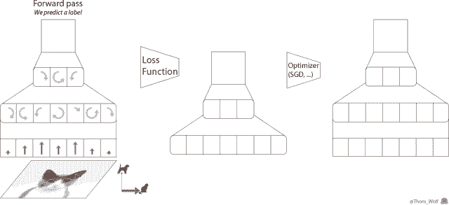
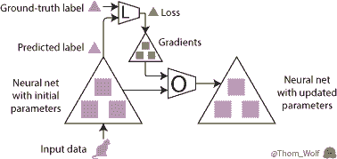
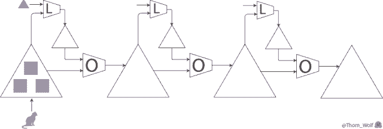
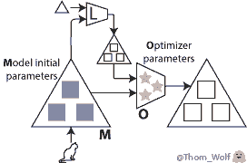
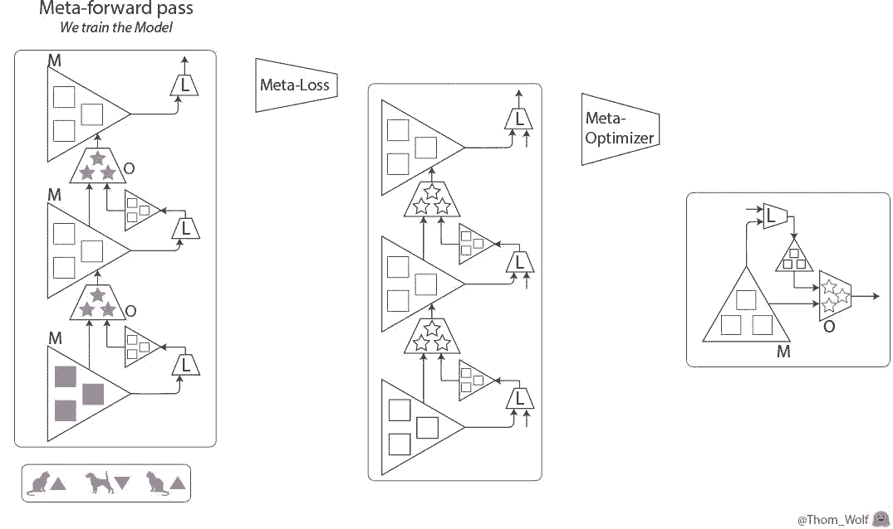
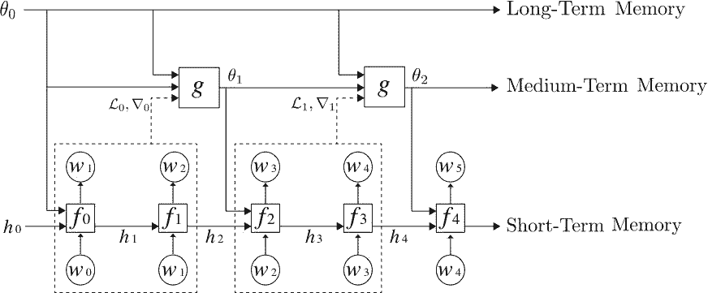
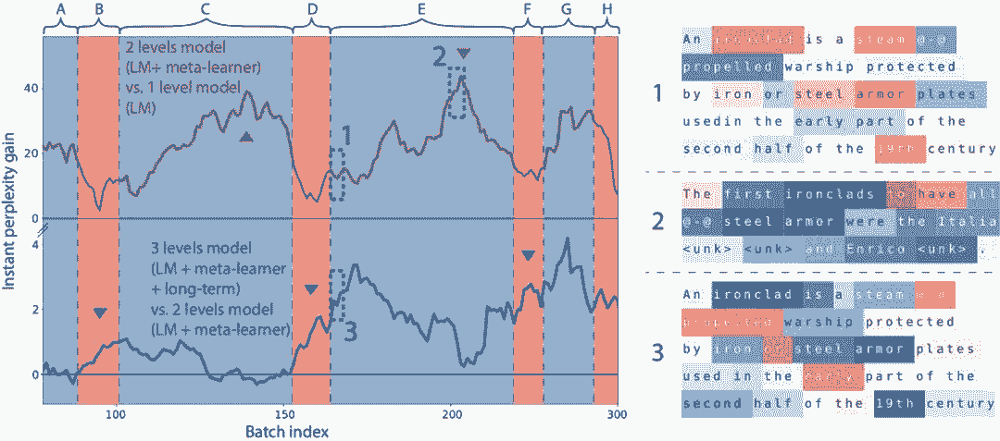

# 入门 | 从零开始，了解元学习

选自 Medium

**作者：****Thomas Wolf**

**机器之心编译**

**参与：Tianci LIU、路**

> 本文介绍了元学习，一个解决「学习如何学习」的问题。

元学习是目前机器学习领域一个令人振奋的研究趋势，它解决的是学习如何学习的问题。

传统的机器学习研究模式是：获取特定任务的大型数据集，然后用这个数据集从头开始训练模型。很明显，这和人类利用以往经验，仅仅通过少量样本就迅速完成学习的情况相差甚远。

因为人类学习了「如何学习」。

在这篇文章中，我将从一个非常直观的元学习简介入手，从它最早的起源一直谈到如今的元学习研究现状。然后，我会从头开始，在 PyTorch 中实现一个元学习模型，同时会分享一些从该项目中学到的经验教训。

**首先，什么是学习？**

我们先来简单了解一下，当我们训练一个用来实现猫狗图像分类的简单神经网络时，到底发生了什么。假设我们现在有一张猫的图像，以及对应的表示「这是一只猫」的标签。为简洁起见，我做了一个简单的动画来展示训练的过程。



*神经网络训练过程的单步。该网络用来实现猫狗图像分类。*

反向传播是神经网络训练中很关键的一步。因为神经网络执行的计算和损失函数都是可微函数，因此我们能够求出网络中每一个参数所对应的梯度，进而减少神经网络当前给出的预测标签与真实/目标标签之间的差异（这个差异是用损失函数度量的）。在反向传播完成后，就可以使用优化器来计算模型的更新参数了。而这正是使神经网络的训练更像是一门「艺术」而不是科学的原因：因为有太多的优化器和优化设置（超参数）可供选择了。

我们把该「单个训练步」放在一张图中展示，如下所示：



现在，训练图像是一只🐈，表示图像是一只猫的标签是 🔺。最大的这些 △ 表示我们的神经网络，里面的 ■ 表示参数和梯度，标有 L 的四边形表示损失函数，标有 O 的四边形表示优化器。

完整的学习过程就是不断地重复这个优化步，直到神经网络中的参数收敛到一个不错的结果上。



*上图表示神经网络的训练过程的三步，神经网络（用最大的 △ 表示）用于实现猫狗图像分类。*

**元学习**

元学习的思想是学习「学习（训练）」过程。

元学习有好几种实现方法，不过本文谈到的两种「学习『学习』过程」的方法和上文介绍的方式很类似。

在我们的训练过程中，具体而言，可以学习到两点：



*   神经网络的初始参数（图中的蓝色■）；

*   优化器的参数（粉色的★）。

我会介绍将这两点结合的情况，不过这里的每一点本身也非常有趣，而且可获得到简化、加速以及一些不错的理论结果。

现在，我们有两个部分需要训练：

*   用「模型（M）」这个词来指代我们之前的神经网络，现在也可以将其理解为一个低级网络。有时，人们也会用「优化对象（optimizee）」或者「学习器（learner）」来称呼它。该模型的权重在图中用 ■ 表示。

*   用「优化器（O）」或者「元学习器」来指代用于更新低级网络（即上述模型）权重的高级模型。优化器的权重在图中用 ★ 表示。

**如何学习这些元参数？**

事实上，我们可以将训练过程中的元损失的梯度反向传播到初始的模型权重和/或优化器的参数。

现在，我们有了两个嵌套的训练过程：优化器/元学习器上的元训练过程，其中（元）前向传输包含模型的多个训练步：我们之前见过的前馈、反向传播以及优化步骤。

现在我们来看看元训练的步骤：



*元训练步（训练优化器 O）包含 3 个模型（M）的训练步。*

在这里，元训练过程中的单个步骤是横向表示的。它包含模型训练过程中的两个步骤（在元前馈和元反向传播的方格中纵向表示），模型的训练过程和我们之前看到的训练过程完全一样。

可以看到，元前向传输的输入是在模型训练过程中依次使用的一列样本/标签（或一列批次）。


*元训练步中的输入是一列样本（🐈、🐕）及其对应的标签（🔺、🔻）。*

我们应该如何使用元损失来训练元学习器呢？在训练模型时，我们可以直接将模型的预测和目标标签做比较，得到误差值。

> 在训练元学习器时，我们可以用元损失来度量元学习器在目标任务——训练模型——上的表现。

一个可行的方法是在一些训练数据上计算模型的损失：损失越低，模型就越好。最后，我们可以计算出元损失，或者直接将模型训练过程中已经计算得到的损失结合在一起（例如，把它们直接加起来）。

我们还需要一个元优化器来更新优化器的权重，在这里，问题就变得很「meta」了：我们可以用另一个元学习器来优化当前的元学习器……不过最终，我们需要人为选择一个优化器，例如 SGD 或者 ADAM（不能像「turtles all the way down」一样（注：turtles all the way down 这里大概是说，「不能一个模型套一个模型，这样无限的套下去」）。

这里给出一些备注，它们对于我们现在要讨论的实现而言非常重要：

*   二阶导数：将元损失通过模型的梯度进行反向传播时，需要计算导数的导数，也就是二阶导数（在最后一个动画中的元反向传播部分，这是用绿色的 ▲ 穿过绿色的 ■ 来表示的）。我们可以使用 TensorFlow 或 PyTorch 等现代框架来计算二阶导数，不过在实践中，我们通常不考虑二阶导数，而只是通过模型权重进行反向传播（元反向传播图中的黄色 ■），以降低复杂度。

*   坐标共享：如今，深度学习模型中的参数数量非常多（在 NLP 任务中，很容易就有将近 3000 万 ～２亿个参数）。当前的 GPU 内存无法将这么多参数作为单独输入传输给优化器。我们经常采用的方法是「坐标共享」（coordinate sharing），这表示我们为一个参数设计一个优化器，然后将其复制到所有的参数上（具体而言，将它的权重沿着模型参数的输入维度进行共享）。在这个方法中，元学习器的参数数量和模型中的参数数量之间并没有函数关系。如果元学习器是一个记忆网络，如 RNN，我们依然可以令模型中的每个参数都具有单独的隐藏状态，以保留每个参数的单独变化情况。

**在 PyTorch 中实现元学习**

我们来尝试写些代码，看看真实情况如何吧。

现在我们有了一个模型，它包含一个我们想要进行训练的权重集合，我们将使用该集合解决这两项任务：

*   在元前馈步骤中：我们使用这个模型计算（损失函数的）梯度，并作为优化器的输入来更新模型参数；

*   在元反向传播步骤中：我们使用这个模型作为反向传播优化器参数梯度（从元损失中计算得到）的路径。

在 PyTorch 中完成这个任务最简单的方法是：使用两个一样的模块来表示模型，每个任务一个。我们把存储元前馈步骤中使用的模型梯度的模块称为前向模型（forward model），把元反向传播步骤中将参数存储为反向传播优化器梯度的连续路径的模块称为后向模型（backward model）。

两个模块之间会使用共享的 Tensor，以防止重复占用内存（Tensor 是内存中真正有意义的部分）；但同时，也会保留各自的 Variable，以明确区分模型的梯度和元学习器的梯度。

**PyTorch 中的一个简单元学习器类**

在 PyTorch 中共享张量非常直接：只需要更新 Variable 类中的指针，让它们指向相同的 Tensor 就可以了。但如果模型已经是内存优化模型，例如 AWD-LSTM 或 AWD-QRNN 这类共享 Tensors（输入和输出嵌入）的算法时，我们就会遇到问难。这时，我们在更新两个模块中的模型参数时，需要很小心，以确保我们保留的指针是正确的。

在这里给出一个实现方法：设置一个简单的辅助程序来完成遍历参数的任务，并返回更新 Parameter 指针（而不只是 Tensor）所需的全部信息，并保持共享参数同步。

以下是一个实现函数：

```py
def get_params(module, memo=None, pointers=None):
    """ Returns an iterator over PyTorch module parameters that allows to update parameters
        (and not only the data).
    ! Side effect: update shared parameters to point to the first yield instance
        (i.e. you can update shared parameters and keep them shared)
    Yields:
        (Module, string, Parameter): Tuple containing the parameter's module, name and pointer
    """
    if memo is None:
        memo = set()
        pointers = {}
    for name, p in module._parameters.items():
        if p not in memo:
            memo.add(p)
            pointers[p] = (module, name)
            yield module, name, p
        elif p is not None:
            prev_module, prev_name = pointers[p]
            module._parameters[name] = prev_module._parameters[prev_name] # update shared parameter pointer
    for child_module in module.children():
        for m, n, p in get_params(child_module, memo, pointers):
            yield m, n, p 
```

通过这个函数，我们可以嵌入任何模型，并且很整洁地遍历元学习器的模型参数。

现在，我们来写一个简单的元学习器类。我们的优化器是一个模块：在前馈阶段，它可以将前向模型（及其梯度）和后向模型作为输入接受，并遍历它们的参数来更新后向模型中的参数，同时允许元梯度反向传播（通过更新 Parameter 指针，而不仅仅是 Tensor 指针）。

```py
class MetaLearner(nn.Module):
    """ Bare Meta-learner class
        Should be added: intialization, hidden states, more control over everything
    """
    def __init__(self, model):
        super(MetaLearner, self).__init__()
        self.weights = Parameter(torch.Tensor(1, 2))

    def forward(self, forward_model, backward_model):
        """ Forward optimizer with a simple linear neural net
        Inputs:
            forward_model: PyTorch module with parameters gradient populated
            backward_model: PyTorch module identical to forward_model (but without gradients)
              updated at the Parameter level to keep track of the computation graph for meta-backward pass
        """
        f_model_iter = get_params(forward_model)
        b_model_iter = get_params(backward_model)
        for f_param_tuple, b_param_tuple in zip(f_model_iter, b_model_iter): # loop over parameters
            # Prepare the inputs, we detach the inputs to avoid computing 2nd derivatives (re-pack in new Variable)
            (module_f, name_f, param_f) = f_param_tuple
            (module_b, name_b, param_b) = b_param_tuple
            inputs = Variable(torch.stack([param_f.grad.data, param_f.data], dim=-1))
            # Optimization step: compute new model parameters, here we apply a simple linear function
            dW = F.linear(inputs, self.weights).squeeze()
            param_b = param_b + dW
            # Update backward_model (meta-gradients can flow) and forward_model (no need for meta-gradients).
            module_b._parameters[name_b] = param_b
            param_f.data = param_b.data 
```

这样一来，我们就可以像在第一部分中看到的那样来训练优化器了。以下是一个简单的要点示例，展示了前文描述的元训练过程：

```py
def train(forward_model, backward_model, optimizer, meta_optimizer, train_data, meta_epochs):
  """ Train a meta-learner
  Inputs:
    forward_model, backward_model: Two identical PyTorch modules (can have shared Tensors)
    optimizer: a neural net to be used as optimizer (an instance of the MetaLearner class)
    meta_optimizer: an optimizer for the optimizer neural net, e.g. ADAM
    train_data: an iterator over an epoch of training data
    meta_epochs: meta-training steps
  To be added: intialization, early stopping, checkpointing, more control over everything
  """
  for meta_epoch in range(meta_epochs): # Meta-training loop (train the optimizer)
    optimizer.zero_grad()
    losses = []
    for inputs, labels in train_data:   # Meta-forward pass (train the model)
      forward_model.zero_grad()         # Forward pass
      inputs = Variable(inputs)
      labels = Variable(labels)
      output = forward_model(inputs)
      loss = loss_func(output, labels)  # Compute loss
      losses.append(loss)
      loss.backward()                   # Backward pass to add gradients to the forward_model
      optimizer(forward_model,          # Optimizer step (update the models)
                backward_model)
    meta_loss = sum(losses)             # Compute a simple meta-loss
    meta_loss.backward()                # Meta-backward pass
    meta_optimizer.step()               # Meta-optimizer step 
```

**避免内存爆炸——隐藏状态记忆**

有时，我们想要学习一个可在非常庞大的（可能有几千万个参数的）模型上运行的优化器；同时，我们还希望可以在大量步骤上实现元训练，以得到优质梯度；就像我们在论文《Meta-Learning a Dynamical Language Model》中所实现的那样。

在实践中，这意味着，我们想要在元前馈中包含一个很长的训练过程，以及很多时间步；同时我们还需要将每一步的参数（黄色■）和梯度（绿色■）保存在内存中，这些参数和梯度会在元反向传播中使用到。

我们如何在不让 GPU 内存爆炸的情况下做到这一点呢？

一个办法是，使用梯度检查点（gradient checkpointing）来用内存换取计算，这个方法也叫「隐藏状态记忆」（Hidden State Memorization）。在我们的案例中，梯度检查点表示，将我们连续计算的元前馈和元反向传播切分成片段。

来自 Open AI 的 Yaroslav Bulatov 有一篇很好的介绍梯度检查点的文章，如果你感兴趣，可以了解一下：

Fitting larger networks into memory（https://medium.com/@yaroslavvb/fitting-larger-networks-into-memory-583e3c758ff9）

这篇文章非常长，所以我没有给出一个完整的梯度检查点代码示例，建议大家使用已经很完善的 TSHadley 的 PyTorch 实现，以及当前还在开发的梯度检查点的 PyTorch 本地实现。

**元学习中的其他方法**

元学习中还有另外两个很有前景的研究方向，但本文没有时间来讨论了。在这里我给出一些提示，这样，当你知道了它们大致的原理后，就可以自己查阅相关资料了：

*   循环神经网络：我们之前给出了神经网络的标准训练过程。还有一个方法：将连续的任务作为一个输入序列，然后建立一个循环模型，并用它提取、构建一个可用于新任务的序列表征。在这种方法中，对于某个带有记忆或注意力的循环神经网络，我们通常只使用一个训练过程。这个方法的效果也很不错，尤其是当你设计出适合任务的嵌入时。最近的这篇 SNAIL 论文是一个很好的例子：A Simple Neural Attentive Meta-Learner（https://openreview.net/forum?id=B1DmUzWAW）。

*   强化学习：优化器在元前馈过程中完成的计算和循环神经网络的计算过程很类似：在输入序列（学习过程中模型的权重序列和梯度序列）上重复使用相同的参数。在真实场景下，这表示我们会遇到循环神经网络经常遇到的一个问题：一旦模型出错，就很难返回安全路径，因为我们并没有训练模型从训练误差中恢复的能力；同时，当遇到一个比元学习过程中使用的序列更长的序列时，模型难以泛化。为了解决这些问题，我们可以求助于强化学习方法，让模型学习一个和当前训练状态相关的动作策略。

**自然语言处理中的元学习**

元学习和用于自然语言处理（NLP）的神经网络模型（如循环神经网络）之间有一个非常有趣的相似之处。在上一段中，我们曾提到：

> 用于优化神经网络模型的元学习器的行为和循环神经网络类似。

和 RNN 类似，元学习器会提取一系列模型训练过程中的参数和梯度作为输入序列，并根据这个输入序列计算得到一个输出序列（更新后的模型参数序列）。

我们的论文《Meta-Learning a Dynamical Language Model》中详细论述了该相似性，并研究了将元学习器用于神经网络语言模型中，以实现中期记忆：经过学习，元学习器能够在标准 RNN（如 LSTM）的权重中，编码中期记忆（除了短期记忆在 LSTM 隐藏状态中的传统编码方式以外）。



我们的元学习语言模型由 3 层记忆层级组成，自下而上分别是：标准 LSTM、用于更新 LSTM 权重以存储中期记忆的元学习器，以及一个长期静态记忆。

我们发现，元学习语言模型可以通过训练来编码最近输入的记忆，就像一篇维基百科文章的开始部分对预测文章的结尾部分非常有帮助一样。



*上图中的曲线展示了在给定一篇维基百科文章开始部分的情况下（A, …, H 是连续的维基百科文章），模型预测文章词汇的效果。单词颜色表示的意思相同：蓝色表示更好，红色表示更差。当模型在阅读一篇文章时，它从文章的开始部分进行学习，读到结尾部分的时候，它的预测效果也变得更好了（更多细节，请阅读我们的论文）。*

以上是我对元学习的介绍，希望对大家有所帮助！

**参考文献**

*1\. ^ (https://medium.com/huggingface/from-zero-to-research-an-introduction-to-meta-learning-8e16e677f78a#afeb) As such, meta-learning can be seen as a generalization of「transfer learning」and is related to the techniques for fine-tuning model on a task as well as techniques for hyper-parameters optimization. There was an interesting workshop on meta-learning (https://nips.cc/Conferences/2017/Schedule?showEvent=8767) at NIPS 2017 last December.*

*2\. ^ (https://medium.com/huggingface/from-zero-to-research-an-introduction-to-meta-learning-8e16e677f78a#dc5a) Of course in a real training we would be using a mini-batch of examples.*

*3\. ^ (https://medium.com/huggingface/from-zero-to-research-an-introduction-to-meta-learning-8e16e677f78a#e0bb) More precisely:「most of」these operations are differentiable.*

*4\. ^ (https://medium.com/huggingface/from-zero-to-research-an-introduction-to-meta-learning-8e16e677f78a#d640) Good blog posts introducing the relevant literature are the BAIR posts: Learning to learn (http://bair.berkeley.edu/blog/2017/07/18/learning-to-learn/) by Chelsea Finn and Learning to Optimize with Reinforcement Learning (http://bair.berkeley.edu/blog/2017/09/12/learning-to-optimize-with-rl/) by Ke Li.*

*5\. ^ (https://medium.com/huggingface/from-zero-to-research-an-introduction-to-meta-learning-8e16e677f78a#930c) Good examples of learning the model initial parameters are Model-Agnostic Meta-Learning (https://arxiv.org/abs/1703.03400) of UC Berkeley and its recent developments (https://openreview.net/forum?id=BJ_UL-k0b) as well as the Reptile algorithm (https://blog.openai.com/reptile/) of OpenAI. A good example of learning the optimizer』s parameters is the Learning to learn by gradient descent by gradient descent (https://arxiv.org/abs/1606.04474) paper of DeepMind. A paper combining the two is the work Optimization as a Model for Few-Shot Learning (https://openreview.net/forum?id=rJY0-Kcll) by Sachin Ravi and Hugo Larochelle. An nice and very recent overview can be found in Learning Unsupervised Learning Rules (https://arxiv.org/abs/1804.00222).*

*6\. ^ (https://medium.com/huggingface/from-zero-to-research-an-introduction-to-meta-learning-8e16e677f78a#d094) Similarly to the way we back propagate through time in an unrolled recurrent network.*

*7\. ^ (https://medium.com/huggingface/from-zero-to-research-an-introduction-to-meta-learning-8e16e677f78a#725d) Initially described in DeepMind』s Learning to learn by gradient descent by gradient descent (https://arxiv.org/abs/1606.04474) paper.*

*8\. ^ (https://medium.com/huggingface/from-zero-to-research-an-introduction-to-meta-learning-8e16e677f78a#4e23) We are using coordinate-sharing in our meta-learner as mentioned earlier. In practice, it means we simply iterate over the model parameters and apply our optimizer broadcasted on each parameters (no need to flatten and gather parameters like in L-BFGS for instance).*

*9\. ^ (https://medium.com/huggingface/from-zero-to-research-an-introduction-to-meta-learning-8e16e677f78a#d029) There is a surprising under-statement of how important back-propagating over very long sequence can be to get good results. The recent paper An Analysis of Neural Language Modeling at Multiple Scales (https://arxiv.org/abs/1803.08240) from Salesforce research is a good pointer in that direction.*

*10\. ^ (https://medium.com/huggingface/from-zero-to-research-an-introduction-to-meta-learning-8e16e677f78a#6c6f) Gradient checkpointing is described for example in Memory-Efficient Backpropagation Through Time (https://arxiv.org/abs/1606.03401) and the nice blog post (https://medium.com/@yaroslavvb/fitting-larger-networks-into-memory-583e3c758ff9) of Yaroslav Bulatov.*

*原文链接：https://medium.com/huggingface/from-zero-to-research-an-introduction-to-meta-learning-8e16e677f78a*

 ******本文为机器之心编译，**转载请联系本公众号获得授权****。**

✄------------------------------------------------

**加入机器之心（全职记者/实习生）：hr@jiqizhixin.com**

**投稿或寻求报道：editor@jiqizhixin.com**

**广告&商务合作：bd@jiqizhixin.com****