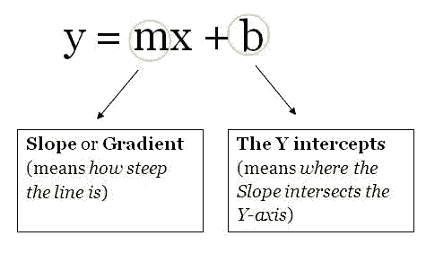
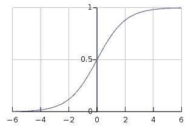
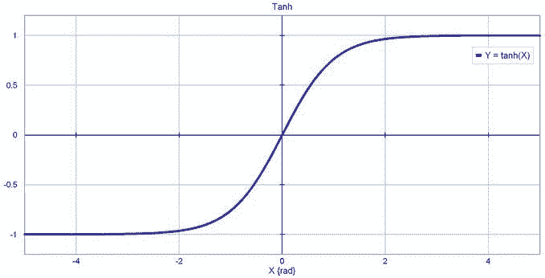
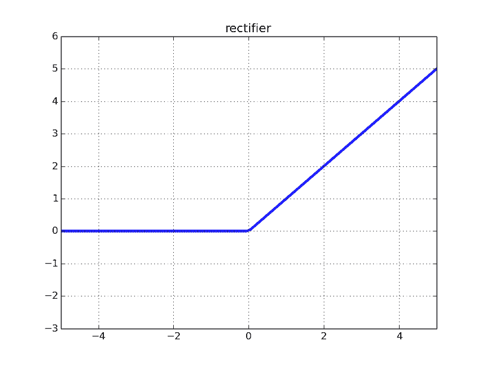
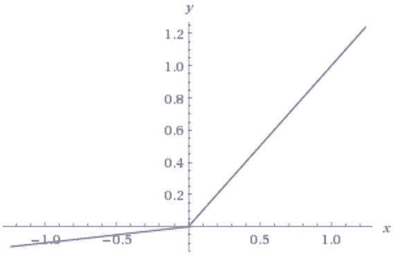
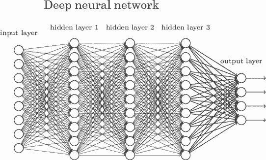

# 入门 | 关于神经网络：你需要知道这些

选自 towardsdatascience

**作者：****Suryansh S.**

**机器之心编译**

**参与：****白妤昕、路**

> 神经网络（NN）几乎可以在每个领域帮助我们用创造性的方式解决问题。本文将介绍神经网络的相关知识。读后你将对神经网络有个大概了解，它是如何工作的？如何创建神经网络？

本文涉及以下内容：

*   神经网络的发展历史

*   什么是真正的神经网络？

*   单元/神经元

*   权重/参数/连接

*   偏置项

*   超参数

*   激活函数

*   层

*   神经网络学习时发生了什么？

*   实现细节（如何管理项目中的所有因素）

*   关于神经网络的更多信息（更多资源链接）

**神经网络的发展历史**

我们简单回顾一下神经网络的发展历程，如果你想了解更多关于其发展历程的信息，请看这篇维基百科的文章（https://en.wikipedia.org/wiki/Artificial_neural_network#History），它是本章节的基础。

神经网络起源于 WarrenMcCulloch 和 Walter Pitts 于 1943 年首次建立的神经网络模型。他们的模型完全基于数学和算法，由于缺乏计算资源，模型无法测试。

后来，在 1958 年，Frank Rosenblatt 创建了第一个可以进行模式识别的模型，改变了现状。即感知器。但是他只提出了 notation 和模型。实际的神经网络模型仍然无法测试，此前的相关研究也较少。

第一批可以测试并具有多个层的神经网络于 1965 年由 Alexey Ivakhnenko 和 Lapa 创建。

之后，由于机器学习模型具有很强可行性，神经网络的研究停滞不前。很多人认为这是因为 Marvin Minsky 和 Seymour Papert 在 1969 年完成的书《感知机》（Perceptrons）导致的。

然而，这个停滞期相对较短。6 年后，即 1975 年，Paul Werbos 提出反向传播，解决了 XOR 问题，并且使神经网络的学习效率更高。

1992 年，最大池化（max-pooling）被提出，这有助于 3D 目标识别，因为它具备平移不变性，对变形具备一定鲁棒性。

2009 年至 2012 年间，JürgenSchmidhuber 研究小组创建的循环神经网络和深度前馈神经网络获得了模式识别和机器学习领域 8 项国际竞赛的冠军。

2011 年，深度学习神经网络开始将卷积层与最大池化层合并，然后将其输出传递给几个全连接层，再传递给输出层。这些被称为卷积神经网络。

在这之后还有更多的研究。

**什么是神经网络？**

了解神经网络的一个好方法是将它看作复合函数。你输入一些数据，它会输出一些数据。

3 个部分组成了神经网络的的基本架构：

*   单元/神经元

*   连接/权重/参数

*   偏置项

你可以把它们看作建筑物的「砖块」。根据你希望建筑物拥有的功能来安排砖块的位置。水泥是权重。无论权重多大，如果没有足够的砖块，建筑物还是会倒塌。然而，你可以让建筑以最小的精度运行（使用最少的砖块），然后逐步构建架构来解决问题。

我将在后面的章节中更多地讨论权重、偏置项和单元。

**单元/神经元**

作为神经网络架构三个部分中最不重要的部分，神经元是包含权重和偏置项的函数，等待数据传递给它们。接收数据后，它们执行一些计算，然后使用激活函数将数据限制在一个范围内（多数情况下）。

我们将这些单元想象成一个包含权重和偏置项的盒子。盒子从两端打开。一端接收数据，另一端输出修改后的数据。数据首先进入盒子中，将权重与数据相乘，再向相乘的数据添加偏置项。这是一个单元，也可以被认为是一个函数。该函数与下面这个直线方程类似：

想象一下有多个直线方程，超过 2 个可以促进神经网络中的非线性。从现在开始，你将为同一个数据点（输入）计算多个输出值。这些输出值将被发送到另一个单元，然后神经网络会计算出最终输出值。

**权重/参数/连接**

作为神经网络最重要的部分，这些（和偏置项）是用神经网络解决问题时必须学习的数值。这就是你现在需要知道的。

**偏置项**

这些数字代表神经网络认为其在将权重与数据相乘之后应该添加的内容。当然，它们经常出错，但神经网络随后也学习到最佳偏置项。

**超参数**

超参数必须手动设置。如果将神经网络看作一台机器，那么改变机器行为的 nob 就是神经网络的超参数。

你可以阅读我的另一篇文章（https://towardsdatascience.com/gas-and-nns-6a41f1e8146d），了解如何优化神经网络超参数。

**激活函数**

也称为映射函数（mapping function）。它们在 x 轴上输入数据，并在有限的范围内（大部分情况下）输出一个值。大多数情况下，它们被用于将单元的较大输出转换成较小的值。你选择的激活函数可以大幅提高或降低神经网络的性能。如果你喜欢，你可以为不同的单元选择不同的激活函数。

以下是一些常见的激活函数：

*   Sigmoid

*Sigmoid 函数*

*   Tanh

*tanh 函数*

*   ReLU：修正线性单元

*修正线性单元函数*

*   Leaky ReLU

*Leaky ReLU 函数*

**层**

这是神经网络在任何问题中都可获得复杂度的原因。增加层（具备单元）可增加神经网络输出的非线性。

每个层都包含一定数量的单元。大多数情况下单元的数量完全取决于创建者。但是，对于一个简单的任务而言，层数过多会增加不必要的复杂性，且在大多数情况下会降低其准确率。反之亦然。

每个神经网络有两层：输入层和输出层。二者之间的层称为隐藏层。下图所示的神经网络包含一个输入层（8 个单元）、一个输出层（4 个单元）和 3 个隐藏层（每层包含 9 个单元）。

*深度神经网络*

具有两个或更多隐藏层且每层包含大量单元的神经网络称为深度神经网络，它催生了深度学习这一新的学习领域。上图所示神经网络就是这样一个例子。

**神经网络学习时发生了什么？**

教神经网络解决问题的最常见方式是使用梯度下降。梯度下降相关内容，参见：https://hackernoon.com/gradient-descent-aynk-7cbe95a778da。

除梯度下降外，另一种常见的训练神经网络方法是使用反向传播。使用这种方法，神经网络输出层的误差会通过微积分中的链式规则向后传播。这对于没有微积分知识的初学者来说可能会难以理解，但也不要被吓倒，反向传播相关内容，推荐阅读：http://neuralnetworksanddeeplearning.com/chap2.html。

训练神经网络有许多注意事项。但对于初学者来说，没有必要在一篇文章中了解全部。

**实现细节（如何管理项目中的所有因素）**

为了解释如何管理项目中的所有因素，我创建了一个 Jupyter Notebook，包含一个学习 XOR 逻辑门的小型神经网络。Jupyter Notebook 地址：https://github.com/Frixoe/xor-neural-network/blob/master/XOR-Net-Notebook.ipynb。

在查看并理解 Notebook 内容后，你应该对如何构建基础神经网络有一个大致的了解。

Notebook 创建的神经网络的训练数据以矩阵排列，这是常见的数据排列方式。不同项目中的矩阵维度可能会有所不同。

大量数据通常分为两类：训练数据（60％）和测试数据（40％）。神经网络先使用训练数据，然后在测试数据上测试网络的准确率。

**关于神经网络的更多信息（更多资源链接）**

如果你仍然无法理解神经网络，那么推荐以下资源：

YouTube：

*   Siraj Raval (https://www.youtube.com/channel/UCWN3xxRkmTPmbKwht9FuE5A)

*   3Blue1Brown (https://www.youtube.com/channel/UCYO_jab_esuFRV4b17AJtAw)

*   The Coding Train (https://www.youtube.com/playlist?list=PLRqwX-V7Uu6aCibgK1PTWWu9by6XFdCfh)

*   Brandon Rohrer (https://www.youtube.com/channel/UCsBKTrp45lTfHa_p49I2AEQ)

*   giant_neural_network (https://www.youtube.com/channel/UCrBzGHKmGDcwLFnQGHJ3XYg)

*   Hugo Larochelle (https://www.youtube.com/channel/UCiDouKcxRmAdc5OeZdiRwAg)

*   Jabrils (https://www.youtube.com/channel/UCQALLeQPoZdZC4JNUboVEUg)

*   Luis Serrano (https://www.youtube.com/channel/UCgBncpylJ1kiVaPyP-PZauQ)

Coursera：

*   Neural Networks for Machine Learning (https://www.coursera.org/learn/neural-networks) by University of Toronto

*   Deep Learning Specialization (https://www.coursera.org/specializations/deep-learning) by Andrew Ng

*   Introduction to Deep Learning (https://www.coursera.org/learn/intro-to-deep-learning) by National Research University Higher School of Economics 

*原文链接：https://towardsdatascience.com/nns-aynk-c34efe37f15a*

****本文为机器之心编译，**转载请联系本公众号获得授权****。**

✄------------------------------------------------

**加入机器之心（全职记者/实习生）：hr@jiqizhixin.com**

**投稿或寻求报道：**content**@jiqizhixin.com**

**广告&商务合作：bd@jiqizhixin.com**