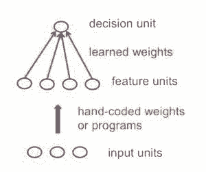
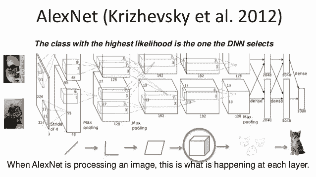

# 入门 | 机器学习研究者必知的八个神经网络架构

选自 Medium

**作者：****James Le**

**机器之心编译**

**参与：白悦、黄小天**

> 本文简述了机器学习核心结构的历史发展，并总结了研究者需要熟知的 8 个神经网络架构。

**我们为什么需要「机器学习」？**

机器学习对于那些我们直接编程太过复杂的任务来说是必需的。有些任务很复杂，以至于人类不可能解决任务中所有的细节并精确地编程。所以，我们向机器学习算法提供大量的数据，让算法通过探索数据并找到一个可以实现程序员目的的模型来解决这个问题。

我们来看两个例子：

*   写一个程序去识别复杂场景中照明条件下新视角的三维物体是很困难的。我们不知道编写什么程序，因为我们并不了解它在我们大脑中运作的机制，即便知道如何实现，写出来的程序也可能会非常复杂。

*   写一个程序去计算信用卡诈骗的概率是很困难的。因为可能没有任何既简单又可靠的规则，我们需要结合大量的弱规则去判别。欺骗是可以转移目标的，程序需要不断更改。

接着出现了机器学习方法：我们不需为每个特定的任务手动编程，只要收集大量的样本，为给定的输入指定正确的输出。机器学习算法利用这些样本去生成完成指定工作的程序。学习算法产生的程序可能与典型的手写程序非常不同，它可能包含数百万个数字。如果我们做得正确，这个程序将像处理训练集上的样本一样来处理新样本。如果数据改变，程序也可以通过训练新数据改变。你应该注意到，目前大量的计算比支付给程序员编写一个特定任务的程序便宜。

鉴于此，机器学习最适用任务的例子包括：

*   模式识别：真实场景中的物体，面部识别或面部表情，口语。

*   异常识别：不寻常的信用卡交易序列，核电站传感器读数的异常模式。

*   预测：未来股票价格或货币汇率，一个人喜欢什么电影。

**什么是神经网络？**

神经网络是机器学习文献中的一类模型。例如，如果你参加了 Coursera 的机器学习课程，很可能会学到神经网络。神经网络是一套特定的算法，它彻底改变了机器学习领域。他们受到生物神经网络的启发，目前深度神经网络已经被证实效果很好。神经网络本身是一般的函数逼近，这就是为什么它们几乎可以应用于任何从输入到输出空间复杂映射的机器学习问题。

以下是说服你学习神经计算的三个理由：

*   了解大脑是如何工作的：它非常大且很复杂，一旦破坏就会脑死亡，所以我们需要使用计算机模拟。

*   了解受神经元及其适应性连接启发的并行计算风格：这种风格与序列计算截然不同。

*   使用受大脑启发的新颖学习算法来解决实际问题：即使不是大脑的实际工作方式，学习算法也非常有用。

在完成吴恩达的 Coursera 机器学习课程后，我开始对神经网络和深度学习产生兴趣，因此寻找最好的网上资源来了解这个主题，并找到了 Geoffrey Hinton 的机器学习神经网络课程。如果你正在做深度学习的工程或想要踏入深度学习/机器学习的领域，你应该参加这个课程。Geoffrey Hinton 毫无疑问是深度学习领域的教父，在课程中给出了非凡的见解。在这篇博客文章中，我想分享我认为任何机器学习研究人员都应该熟悉的八个神经网络架构，以促进他们的工作。

一般来说，这些架构可分为三类：

1\. 前馈神经网络

这是实际应用中最常见的神经网络类型。第一层是输入，最后一层是输出。如果有多个隐藏层，我们称之为「深度」神经网络。他们计算出一系列改变样本相似性的变换。各层神经元的活动是前一层活动的非线性函数。

2\. 循环网络

循环网络在他们的连接图中定向了循环，这意味着你可以按照箭头回到你开始的地方。他们可以有复杂的动态，使其很难训练。他们更具有生物真实性。

目前如何高效地训练循环网络正在受到广泛关注。循环神经网络是模拟连续数据的一种非常自然的方式。它们相当于每个时间片段具有一个隐藏层的深度网络；除此之外，它们在每个时间片段上使用相同的权重并且在每个时间片段上输入。它们可以长时间记住隐藏状态的信息，但很难训练其使用这个潜能。

3\. 对称连接网络

对称连接网络有点像循环网络，但是单元之间的连接是对称的（它们在两个方向上权重相同）。比起循环网络，对称连接网络更容易分析。这个网络中有更多的限制，因为它们遵守能量函数定律。没有隐藏单元的对称连接网络被称为「Hopfield 网络」。有隐藏单元的对称连接的网络被称为玻尔兹曼机。

下面介绍研究者需要熟知的 8 个神经网络架构。

**1\. 感知器**

第一代神经网络出现时，感知机（perceptron）仅仅是单个神经元的计算模型，其在二十世纪六十年代初被美国计算机科学家 Frank Rosenblatt 推广。其学习算法非常强大，并且宣称可以学习很多事情。1969 年，Minsky 与 Papert 出版了一本名为《感知机》的书，这本书分析了这些算法可以做什么，并阐释了其局限性。许多人就将这个局限性放大到所有的 NN 模型。然而，感知机学习过程仍广泛用于具有包含数百万特征的大特征向量的任务。

在统计模式识别的标准范例中，我们首先将原始输入向量转换为特征激活向量。然后，基于大家的共识手动编程来定义特征。接下来，我们学习如何对每个特征激活进行加权以获得单一的标量。如果这个标量超过了某个阈值，我们认为输入向量是目标集中的一个正样本。

标准的感知机架构遵循前馈模型，输入被发送到神经元中，经处理后输出。在下图中，表示为网络自下而上读取：底部输入，顶部输出。

但是，感知机确实存在局限性：如果您使用手动设置特征，并且使用了足够多的特征，那么你几乎可以做任何事情。对于二进制输入向量，我们可以为指数级多的二进制向量分别设置一个特征单元，因此我们可以对二进制输入向量进行任何可能的区分。但是，一旦确定了手动编程的特征，感知器可以学习的东西就非常有限。

这个结果对于感知机是毁灭性的，因为模式识别是去识别在变换情况下的模式。Minsky 和 Papert 的「组不变性定理」认为感知机的学习部分无法去学习当转换来自于一个组的情况。为了识别上述那种情况，需要更多的特征单元去识别那些模式中包含的子信息。所以模式识别的技巧部分必须由手动编码的特征检测器来解决，而不是学习过程。

没有隐藏单元的网络在其可以学习建模的输入输出映射中是非常有限的。简单地增加一些线性单元无济于事，因为结果还是线性的。固定的输出非线性也不够，因此，我们需要多层自适应非线性隐藏单元。问题是怎样对这样的网络进行训练。我们需要一种适应所有权重的有效方式，而不仅仅是最后一层，所以这很难。学习进入隐藏层的权重等同于学习特征，这是非常困难的，因为没有人直接告诉我们隐藏层应该怎么做。

**2\. 卷积神经网络**

机器学习研究已经广泛地集中在物体检测问题上。有各种各样的事情使识别物体变得困难：

*   图像分割：真实场景中总是掺杂着其它物体。很难判断哪些部分属于同一个对象。对象的某些部分可以隐藏在其他对象的后面。

*   物体光照：像素的强度被光照强烈影响。

*   图像变形：物体可以以各种非仿射方式变形。例如，手写也可以有一个大的圆圈或只是一个尖头。

*   情景支持：物体所属类别通常由它们的使用方式来定义。例如，椅子是为了让人们坐在上面而设计的，因此它们具有各种各样的物理形状。

*   视角：标准学习方法无法应对的视点变化导致的图像变化，得到的信息随输入维度（即像素）的变化而变化。

*   维度跳变：设想一个医疗数据库，通常用来学习体重的神经元，现在忽然用来学习病人的年龄！要应用机器学习，我们首先要消除这个维度跳跃。

复制特征方法是目前神经网络解决目标检测问题的主要方法。在不同的位置使用相同的特征提取器。它也可以在尺寸和方向上复制，这很需技巧并且很贵。复制大大减少了要学习的自由参数的数量。它使用几种不同的特征类型，每种都有自己的复制检测器图像。它也允许以各种方式表示每个图像块。

那么复制特征检测器是如何实现的呢？

*   激活值等变化量：复制特征的方法并不能使神经元激活值不变，但是能够使激活值改变量相同。

*   知识不变量：如果在训练中一个特征在某些位置有效，则在测试过程中，特征检测器在各个位置有效。

1998 年，Yann LeCun 和他的合作者开发了 LeNet 的手写数字识别器。它在前馈网中使用反向传播，这个前馈网络不仅仅是一个识别器，它有许多隐藏层，每个层有许多复制单元的映射，汇集附近复制单元的输出，有一个即使重叠也能够同时处理几个字符的宽网，以及训练一套完整的系统的巧妙方式。后来正式命名为卷积神经网络。一个有趣的事实是：这个网络被用来读取北美地区约 10％的支票。

卷积神经网络可用于从手写数字到 3D 物体的与物体识别有关的所有工作。但是，从网下载的彩色照片中识别真实物体要比识别手写数字复杂得多。它百倍于手写数字的类别（1000：10），数百倍于手写数字的像素（256×256 色：28×28 灰度），是三维场景的二维图像，需要分割混乱场景，而且每个图片有多个对象。这样的情况下，相同类型的卷积神经网络会起作用吗？

之后在 ImageNet 2012 年的 ILSVRC 竞赛（这个比赛被誉为计算机视觉的年度奥林匹克竞赛）中，题目是一个包含大约 120 万张高分辨率训练图像的数据集。测试图像不显示初始注释（没有分割或标签），算法要产生指定图像中存在什么对象的标签。来自 Oxford、INRIA、XRCE 等机构的先进计算机视觉小组用已有的最好计算机视觉方法应用于这个数据集。通常计算机视觉系统是复杂的多级系统，往往需要在早期阶段通过手动调参来优化。

比赛获胜者 Alex Krizhevsky（NIPS 2012）开发了由 Yann LeCun 开创的深度卷积神经网络类型。其架构包括 7 个隐藏层（不包括池化层）。前五层是卷积层，后面两层是全连接层。激活函数在每个隐藏层中被修正为线性单元。这些训练比 Logistic 单元更快，更有表现力。除此之外，当附近的单元有更强的活动时，它还使用竞争规范化来压制隐藏的活动，这有助于强度的变化。

有一些技术手段可以显著提高神经网络的泛化能力：

1.  从 256×256 图像中随机挑选 224×224 块图像以获取更多数据，并使用图像的左右反射。在测试时，结合 10 个不同的图像：四个角落加上中间，再加上它们水平翻转的五个。

2.  使用「dropout」来调整全局连接层（包含大部分参数）的权重。Dropout 指的是随机移除每个训练样本一层中的一半隐藏单元，使其不再过多地依赖其它隐藏单元。

就硬件要求而言，Alex 在 2 个英伟达的 GTX 580 GPU（超过 1000 个快速小内核）上使用了非常高效的卷积网络实现。GPU 非常适合矩阵乘法，并且具有非常高的内存带宽。这让它在一周内训练了网络，并在测试时快速结合了 10 个图像块的结果。如果我们可以足够快地交换状态，我们可以在很多内核上传播一个网络。随着内核越来越便宜，数据集越来越大，大型神经网络将比老式计算机视觉系统发展得更快。

**3\. 循环神经网络**

 **

为了理解循环神经网络，我们需要对序列建模进行简要概述。当机器学习应用于序列时，我们经常希望将输入序列转换为不同域中的输出序列；例如，将一系列的声压转换成单词序列。当没有单独的目标序列时，我们可以通过尝试预测输入序列中的下一项作为网络的学习目标。目标输出序列是输入序列的下一步。比起试图根据一个图片的其他像素来预测一个像素或根据图像的其余部分来预测一个部分，这样似乎更自然。预测序列中的下一项模糊了有监督学习和无监督学习之间的区别。它使用专为监督学习而设计的方法，但它不需要单独的目标数据。

无记忆模型是这个任务的标准方法。具体而言，自回归模型可以通过使用「延迟抽头」从固定数量的前几项预测下一项，而且前馈神经网络是使用一层或多层非线性隐藏单元的广义自回归模型。但是，如果我们给生成模型一些隐藏的状态，使这个隐藏的状态内部是动态的，我们就会得到一个更有趣的模型：它可以长时间地将信息存储在隐藏状态。如果隐状态的动态从隐状态中生成输出是有噪声的，我们将永远无法知道它确切的隐藏状态。我们所能做的是推断隐状态矢量空间的概率分布。这种推断只适用于 2 种隐藏状态模型。

循环神经网络是非常强大的，因为它们结合了两个属性：1）分布式隐状态，允许其有效地存储大量有关过去的信息； 2）非线性动态，使他们能够以复杂的方式更新隐状态。有了足够的神经元和时间，RNN 可以计算任何计算机可以计算出来的东西。那么 RNN 可以表现什么样的行为呢？它们可以振动，可以稳定在点吸引子，从而表现地很混乱。还可以通过使用隐状态的不同子集执行许多不同的小程序，每个小程序捕获一块知识，而且所有的这些都能并行运行并以更复杂的方式交互。

然而，RNN 的计算能力使它们很难训练。由于梯度爆发和梯度消失，训练一个 RNN 是相当困难的。当我们进行多层反向传播时，梯度的大小会发生什么变化？如果权重很小，则梯度将指数缩小。如果权重很大，梯度将成指数增长。典型的前馈神经网络可以应付这些指数效应，因为它们只有很少的隐藏层。然而，在训练长序列的 RNN 中，梯度很容易爆炸或消失。即使初始权重选的很好，也很难检测到依赖于多个时间步长前的输入的当前目标输出，所以 RNN 难以处理序列中的长程依赖。

基本上有 4 种有效的方法来学习 RNN：

*   长短期记忆：将 RNN 用于长期记忆值的小模块。

*   Hessian Free 优化：通过使用酷炫的优化器来处理梯度消失问题，该优化器可以检测具有更小曲率的微小梯度。

*   回声状态网络：通过谨慎地初始化层之间的连接（输入 ->隐层、隐层 ->隐层、输出 -> 隐层），确保隐藏状态有巨大的弱耦合震荡存储，可以通过输入选择性地驱动这些振荡器。

*   利用动量进行良好的初始化：像回声状态网络一样进行初始化，然后使用动量学习所有连接。

**4\. 长短期记忆网络**

 **

Hochreiter 和 Schmidhuber（1997）通过构建长短期记忆网络，解决了获取 RNN 长时间记忆（如数以百计的时间步长）的问题。他们使用具有乘法相互作用的逻辑和线性单元来设计存储器单元。每当「写入」门打开时，信息就会进入单元。当「保持」门打开，信息将在单元中保持。信息可以通过打开「读取」门而从单元中读取。

手写草书识别是一个特别适合 RNN 的任务。输入是笔尖的（x，y，p）坐标序列，其中 p 表示笔是向上还是向下。输出是一个字符序列。Graves 和 Schmidhuber（2009）表明，带有 LSTM 的 RNN 是目前草书识别的最佳系统。简而言之，其使用一系列小图像代替笔坐标作为输入。

**5\. Hopfield 网络**

循环网络的非线性单元通常很难分析。它们可以表现为不同的方式：稳定到稳定的状态，振荡，或遵循不可预测的混沌轨迹。一个 Hopfield 网络由二元门限单元组成，它们之间有连续的连接。1982 年，John Hopfield 认识到，如果连接是对称的，就有一个全局能量函数。整个网络的每个二进制「结构」都有能量，而二进制阈值的决策规则使网络可以得到能量函数的最小值。利用这类计算的一种简洁方法是使用记忆作为神经网络的能量最小值。使用能量最小值来表示记忆从而内存可寻址。可以只知道一个项目的部分内容来访问这个项目。这对硬件损坏是极大的。

每当记忆一次配置，我们希望创造一个新的能量最小值。但是，如果在中间位置附近有两个最小值怎么办呢？这限制了 Hopfield 网络的容量。那么如何增加 Hopfield 网络的容量呢？物理学家认为他们已知的数学知识可以解释大脑的工作机制。物理学期刊上发表了许多关于 Hopfield 网络及其存储容量的论文。最终，Elizabeth Gardner 认为，有一个更好的存储规则——使出权重的「浑身解数」。这不是一次性存储向量，而是多次循环训练集，并利用感知机收敛过程来训练每个单元，使其具有正确的状态，给定该向量中所有其他单元的状态。统计学家称这种技术为「伪可能性」。

Hopfield 网络还有另一个计算功能。我们不再用网络来存储记忆，而是用它来构建感官输入的信息。用可见单元表示输入，用隐藏节点的状态来表达输入节点的信息，用能量表示信息的不好（低的能量状态来表达一个好的 interpretation）。

**6\. 玻尔兹曼机网络**

玻尔兹曼机是一种随机递归神经网络。它可以被看作是 Hopfield 网络随机生成的对应物。它是第一个能够学习内部表示的神经网络之一，能够表示并解决难的组合问题。

玻尔兹曼机学习算法的学习目标是最大化玻尔兹曼机分配给训练集中二进制向量概率的乘积。这等同于最大化玻尔兹曼分配给训练向量的对数概率之和。也就是说，如果我们做了如下的事情，最大化我们得到 N 个训练案例的概率：1）让网络在没有外部输入的情况下在不同时间稳定分布; 2）每次采样一次可见向量。

2012 年，Salakhutdinov 和 Hinton 提出了玻尔兹曼机的高效小批量学习程序。

*   对于正相位，首先将隐藏概率初始化为 0.5，将可见单元上的数据向量进行钳位，然后并行更新所有隐藏单元，使用平均场方法并行更新隐藏单元直到收敛。在网络收敛之后，记录每个连接的单元对 Pi Pj，并在最小批量中对所有数据取平均。

*   对于负相位：首先保留一组「幻想粒子」（就是一对 (Si,Sj) 形成的系统？）。每个粒子都有全局配置中的一个值。然后串行更新几次每个幻想粒子中的所有单元。对于每一个连接的单元，对所有的幻想粒子的 SiSj 取平均。

在普通玻尔兹曼机中，单元的随机更新需要连续。有一个特殊的体系结构允许更有效的交替并行更新（层内没有连接，没有跳层连接）。这个小批量程序使玻尔兹曼机的更新更加并行。这就是所说的深度玻尔兹曼机（DBM），一个缺失很多连接的普通玻尔兹曼机。

2014 年，Salakhutdinov 和 Hinton 为他们的模型提出了一个升级版，称之为受限玻尔兹曼机（RBM）。他们通过限制连通性使推理和学习变得更容易（隐藏单元只有一层，隐藏单元之间没有连接）。在 RBM 中，当可见单元被钳位时只需要一步就能达到热平衡。

另一个有效的小批量 RBM 学习程序是这样的：

*   对于正相位，首先将可见单元的数据矢量钳位。然后计算所有可见和隐藏单元对的<ViHj>的确切值。对于每个连接的单元对，对小批量中的所有数据<ViHj>求平均。

*   对于负相位，也保留一组「幻想粒子」（就是一对 (Vi，Hj) 形成的系统？）。然后交替并行更新几次每个幻想粒子中的所有单元。对于每一个连接的单位对，所有幻想粒子 ViHj 求平均。

**7\. 深度信念网络**

 **

反向传播被认为是人工神经网络中的标准方法，用于在处理一批数据之后计算每个神经元的误差贡献。但是，使用反向传播存在一些重要的问题。首先，它需要有标签的训练数据；而几乎所有的数据都没有标签。其次，学习时间不够理想，这意味着隐藏层数多的网络很慢。第三，它可能会陷入局部最小的局面，所以对于深度网络来说，它们还差得很远。

为了克服反向传播的限制，研究人员已经考虑使用无监督的学习方法。这有助于保持使用梯度方法来调整权重的效率和简单性，还可以用它来对传感输入的结构进行建模。特别是，他们调整权重使生成模型产生感官输入的概率最大化。问题是我们应该学习什么样的生成模型？可以是像玻尔兹曼机这样的能量模型吗？还是由理想化的神经元组成的因果模型？或是两者的混合？

信念网是由随机变量组成的有向无环图。使用信念网我们可以观察到一些变量。我们想要解决 2 个问题：1）推理问题：推断未观测变量的状态; 2）学习问题：调整变量之间的交互作用，使网络更有可能产生训练数据。

早期的图形模型的图形结构和条件概率是专家定义的。那时，这些图形连接稀疏，所以研究人员一开始把重点放在做正确的推论，而不是学习上。对于神经网络来说，学习是关键，手写知识并不酷，因为知识来自于学习训练数据。神经网络的目的不在于可解释性或通过稀疏连接性使其便于推理。不过，还有神经网络版本的信念网络。

由随机二元神经元组成的生成神经网络有两种类型：1）基于能量利用对称连接来连接二元随机神经元得到玻尔兹曼机; 2）我们通过因果关系在一个有向无环图中连接二元随机神经元获得 SBN。这两种类型的描述超出了本文的范围。

**8\. 深度自动编码器**

 **

最后，我们来讨论深度自动编码器。深度自动编码器是非线性降维的非常好的方法，原因如下：它们提供了两种灵活的映射方式。训练事例的学习时间是线性的（或更好的），最终的编码模型相当紧凑和快速。然而，使用反向传播来优化深度自动编码器很难。在初始权重较小的情况下，反向传播梯度消失。现在我们有了更好的方法来优化它们，要么使用无监督的逐层预训练，要么像回声状态网络那样谨慎地初始化权重。

对于预训练任务，实际上有三种不同类型的浅自动编码器：

1.  受限玻尔兹曼机作为自动编码器：当我们用一步对比散度训练受限玻尔兹曼机时，它试图使重建看起来像数据。它就像一个自动编码器，但是通过使用隐藏层中的二进制活动来强化正则化。经过最大可能性训练后，受限玻尔兹曼机不像自动编码器。我们可以用浅自动编码器堆栈来代替用于预训练的 RBM 堆栈；然而，如果浅自动编码器通过惩罚平方权重而被正规化，那么预训练就不是有效的（对于随后的辨别）。

2.  去噪自动编码器：通过将其许多分量设置为 0（例如输入的数据丢失的情况），将噪声添加到输入向量。他们仍然需要重建这些分量，因此他们必须提取捕获输入之间相关性的特征。如果我们使用表示自动编码器的堆栈，那么预训练是非常有效的。与 RBM 预训练一样好或者更好。由于我们可以很容易地计算目标函数的值，所以评估预训练也更简单。它缺乏我们用 RBM 获得的良好的变分边界，但这只是理论上的问题。

3.  压缩自动编码器：使自动编码器正规化的另一种方法是尽可能使隐藏单元的活动对输入不敏感，但是他们不能忽视这些输入，因为他们必须重建这些输入。我们通过惩罚每个隐藏活动相对于输入的平方梯度来达到这个目的。压缩自动编码器预训练时工作得很好。代码倾向于使一小部分隐藏单元对输入变化敏感。

简而言之，现在有很多不同的方法来进行功能的逐层预训练。对于没有大量标签化的事例的数据集来说，预训练有助于后续的判别式学习。对于非常大的有标签的数据集，使用无监督预训练初始化监督学习中使用的权重进行并不必要，即使对于深度网络也是如此。预训练是初始化深度网络权重的第一个不错的方法，但现在还有其他方法。但是，如果我们让网络很大，我们将再次离不开预训练！

**最后的福利**

神经网络是有史以来最美丽的编程范例之一。在传统的编程方法中，我们告诉计算机做什么，将大问题分解成计算机可轻松执行的许多精确定义的小任务。相比之下，在神经网络中，我们不需要告诉计算机如何解决我们的问题，而是让它通过观测数据学习，找出解决手头问题的办法。

如今，深度神经网络和深度学习在计算机视觉、语音识别和自然语言处理等许多重要问题上有着出色的表现。它们正在被谷歌、微软和 Facebook 等公司大规模部署。

我希望这篇文章能帮助你学习神经网络的核心概念，包括深度学习的现代技术。你可以从我的 GitHub 库（https://github.com/khanhnamle1994/neural-nets）中获取 Hinton 的 Coursera 课程所有课程幻灯片，研究论文和编程作业。祝你好运！

*原文链接：https://medium.com/@james_aka_yale/the-8-neural-network-architectures-machine-learning-researchers-need-to-learn-2f5c4e61aeeb*

****本文为机器之心编译，**转载请联系本公众号获得授权****。**

✄------------------------------------------------

**加入机器之心（全职记者/实习生）：hr@jiqizhixin.com**

**投稿或寻求报道：editor@jiqizhixin.com**

**广告&商务合作：bd@jiqizhixin.com**********