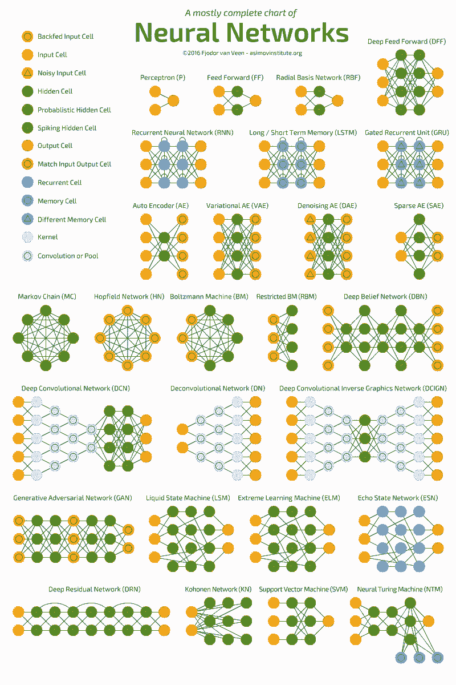
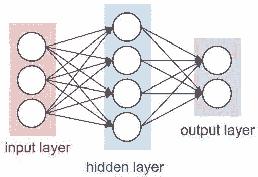
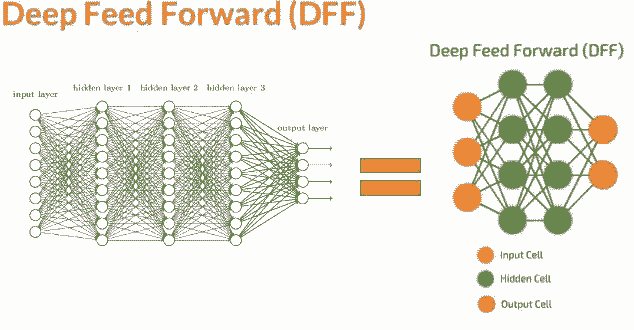
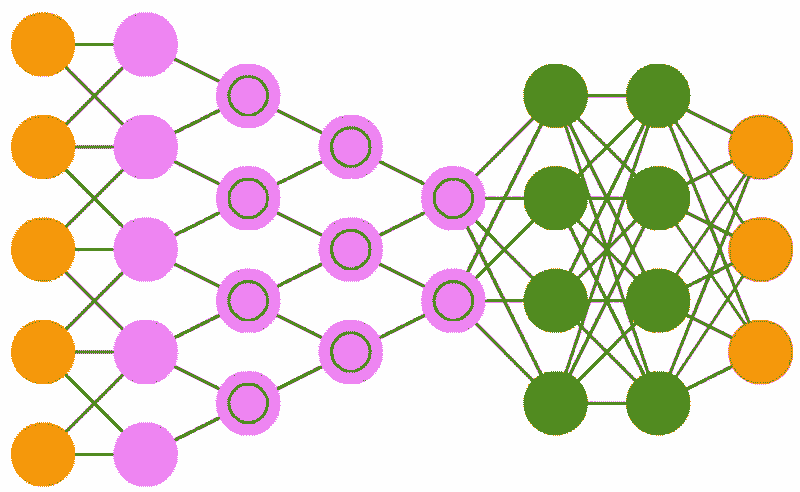
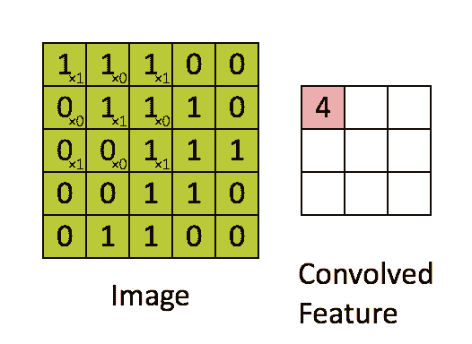
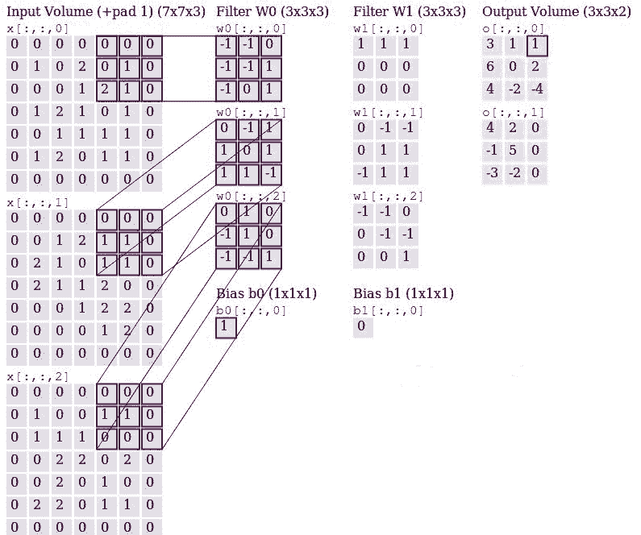
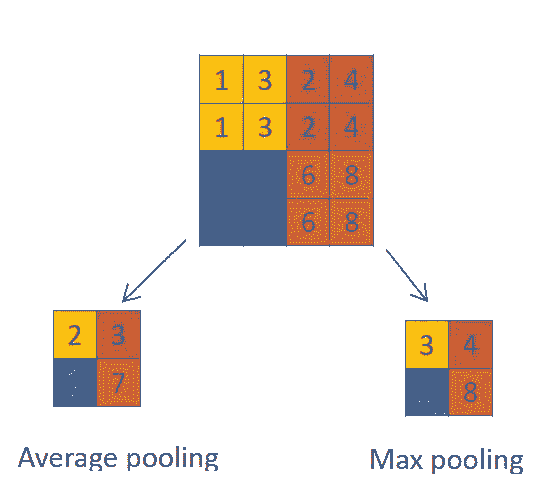
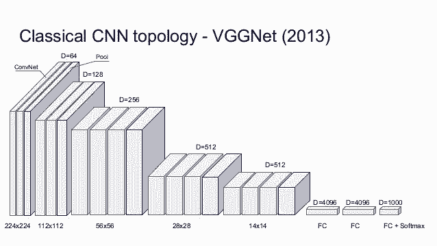
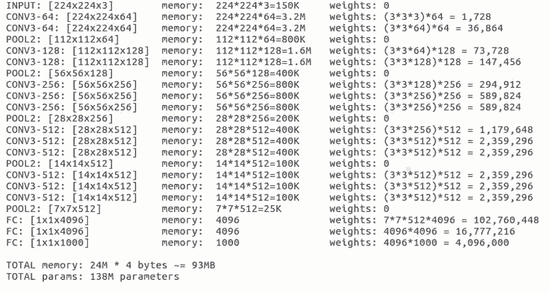

# 入门 | 一文看懂卷积神经网络

选自 Medium

**作者：****Pranjal Yadav**

**机器之心编译**

**参与：Nurhachu Null、路雪**

> 本文主要介绍了神经网络中的卷积神经网络，适合初学者阅读。

**概述**

深度学习和人工智能是 2016 年的热词；2017 年，这两个词愈发火热，但也更加容易混淆。我们将深入深度学习的核心，也就是神经网络。大多数神经网络的变体是难以理解的，并且它们的底层结构组件使得它们在理论上和图形上是一样的。

下图展示了最流行的神经网络变体，可参考这篇博客 (http://www.asimovinstitute.org/neural-network-zoo/)。

本文介绍卷积神经网络（CNN）。在开始之前，我们首先了解一下感知机。神经网络是一些被称作感知机的单元的集合，感知机是二元线性分类器。

如上图所示，输入 x1 和 x2 分别和各自的权重 w1 和 w2 相乘、求和，所以函数 f=x1*w1+x2*w2+b（偏置项，可以选择性地添加）。函数 f 可以是任意的运算，但是对于感知机而言通常是求和。函数 f 随后会通过一个激活函数来评估，该激活函数能够实现期望分类。Sigmoid 函数是用于二元分类的最常见的激活函数。如果您想进一步了解感知机，推荐阅读这篇文章（https://appliedgo.net/perceptron/）。

如果我们把多个输入堆叠在一起，并且使用函数 f 将其与位于另一层的多个堆叠在一起的单元连接在一起，这就形成了多个全连接的感知机，这些单元（隐藏层）的输出成为最后一个单元的输入，再通过函数 f 和激活函数得到最终的分类。如下图所示，这个就是最简单的神经网络。

神经网络有一个独特的能力，被称作「泛逼近函数」（Universal Approximation function），所以神经网络的拓扑和结构变体是很多样化的。这本身就是一个很大的话题，Michael Nielsen 在文章中做了详细的描述（http://neuralnetworksanddeeplearning.com/chap4.html）。读完这个我们可以相信：神经网络可以模拟任何函数，不管它是多么的复杂。上面提到的神经网络也被称为前馈神经网络（FFNN），因为信息流是单向、无环的。现在我们已经理解了感知机和前馈神经网络的基本知识，我们可以想象，数百个输入连接到数个这样的隐藏层会形成一个复杂的神经网络，通常被称为深度神经网络或者深度前馈神经网络。

**那么深度神经网络和卷积神经网络有什么不同呢？让我们来探讨一下。**

CNN 由于被应用在 ImageNet 等竞赛中而广受欢迎，最近也被应用在自然语言处理和语音识别中。需要记住的关键点是，其他的变体，如 RNN、LSTM、GRU 等，基于和 CNN 类似的结构，不过架构存在一些差异。

CNN 由三种不同的层组成，即「卷积层」、「池化层」、「密集层或全连接层」。我们之前的神经网络都是典型的全连接层神经网络。如果想了解更多卷积和池化层的知识，可以阅读 Andrej Karpathy 的解释（https://cs231n.github.io/convolutional-networks/）。现在继续我们关于层的讨论，下面我们来看一下卷积层。

（在下面的内容里，我们会以图像分类为例来理解卷积神经网络，后面再转移到自然语言处理和视频任务中。）

卷积层：假设一张图像有 5*5 个像素，1 代表白，0 代表黑，这幅图像被视为 5*5 的单色图像。现在用一个由随机地 0 和 1 组成的 3*3 矩阵去和图像中的子区域做乘法，每次迭代移动一个像素，这样该乘法会得到一个新的 3*3 的矩阵。下面的动图展示了这个过程。

上述的 3*3 的矩阵被称作「滤波器」，它的任务是提取图像特征，它使用「优化算法」来决定 3*3 矩阵中具体的 0 和 1。我们在神经网络的卷积层中使用好几个这样的滤波器来提取多个特征。3*3 矩阵的每一个单个步骤被称作「步幅」（stride）。

下图展示了使用两个三通道滤波器从三通道（RGB）图像中生成两个卷积输出的详细过程。

滤波器 w0 和 w1 是「卷积」，输出是提取到的特征，包含这些滤波器的层叫做卷积层。

池化层：这个层主要使用不同的函数为输入降维。通常，最大池化层（max-pooling layer）出现在卷积层之后。池化层使用 2*2 的矩阵，以卷积层相同的方式处理图像，不过它是给图像本身降维。下面分别是使用「最大池化」和「平均池化」的示例。

全连接层：这个层是位于之前一层和激活函数之间的全连接层。它和之前讨论过的简单「神经网络」是类似的。

注意：卷积神经网络结果也会使用正则化层，不过本文将分开讨论。此外，池化层会损失信息，所以也不是首选的。通常的做法是在卷机层中使用一个较大的步幅。

ILSVRC 2014 的亚军 VGGNet 是一个流行的卷积神经网络，它使用 16 个层来帮助我们理解 CNN 中深度的重要性，AlexNet 是 ILSVRC 2012 的冠军，它只有 8 层。Keras 中有可以直接使用的模型 VGG-16。

在 Keras 中加载了这个模型之后，我们可以观察每一层的「output shape」来理解张量维度，观察「Param#」来了解如何计算参数来得到卷积特征。「Param#」是每一次获取卷积特征时的所有权重更新。

现在我们已经熟悉了卷积神经网络的结构，理解了每一层都是如何运行的，那么我们可以进一步去理解它是如何用在自然语言处理和视频处理中的了。您可以在这个链接中了解自 2012 年以来所有获得 ImageNet 竞赛冠军的 CNN 模型（https://adeshpande3.github.io/The-9-Deep-Learning-Papers-You-Need-To-Know-About.html）。

*原文链接：https://towardsdatascience.com/a-deeper-understanding-of-nnets-part-1-cnns-263a6e3ac61*

****本文为机器之心编译，**转载请联系本公众号获得授权****。**

✄------------------------------------------------

**加入机器之心（全职记者/实习生）：hr@jiqizhixin.com**

**投稿或寻求报道：editor@jiqizhixin.com**

**广告&商务合作：bd@jiqizhixin.com**