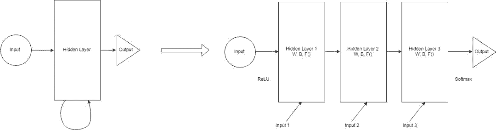

# 入门 | 一文简述循环神经网络

选自 Hackernoon

**作者：Debarko De**

 ****机器之心编译**

**参与：****李诗萌、路**

 **> 本文简要介绍了什么是循环神经网络及其运行原理，并给出了一个 RNN 实现示例。

什么是循环神经网络（RNN）？它们如何运行？可以用在哪里呢？本文试图回答上述这些问题，还展示了一个 RNN 实现 demo，你可以根据自己的需要进行扩展。

*循环神经网络架构*

基础知识。Python、CNN 知识是必备的。了解 CNN 的相关知识，是为了与 RNN 进行对比：RNN 为什么以及在哪些地方比 CNN 更好。

我们首先从「循环」（Recurrent）这个词说起。为什么将其称为循环？循环的意思是：

> 经常或重复出现

将这类神经网络称为循环神经网络是因为它对一组序列输入重复进行同样的操作。本文后续部分将讨论这种操作的意义。

**我们为什么需要 RNN？**

也许你现在想的是，已经有像卷积网络这样表现非常出色的网络了，为什么还需要其他类型的网络呢？有一个需要用到 RNN 的特殊例子。为了解释 RNN，你首先需要了解序列的相关知识，我们先来讲一下序列。

序列是相互依赖的（有限或无限）数据流，比如时间序列数据、信息性的字符串、对话等。在对话中，一个句子可能有一个意思，但是整体的对话可能又是完全不同的意思。股市数据这样的时间序列数据也是，单个数据表示当前价格，但是全天的数据会有不一样的变化，促使我们作出买进或卖出的决定。

当输入数据具有依赖性且是序列模式时，CNN 的结果一般都不太好。CNN 的前一个输入和下一个输入之间没有任何关联。所以所有的输出都是独立的。CNN 接受输入，然后基于训练好的模型输出。如果你运行了 100 个不同的输入，它们中的任何一个输出都不会受之前输出的影响。但想一下如果是文本生成或文本翻译呢？所有生成的单词与之前生成的单词都是独立的（有些情况下与之后的单词也是独立的，这里暂不讨论）。所以你需要有一些基于之前输出的偏向。这就是需要 RNN 的地方。RNN 对之前发生在数据序列中的事是有一定记忆的。这有助于系统获取上下文。理论上讲，RNN 有无限的记忆，这意味着它们有无限回顾的能力。通过回顾可以了解所有之前的输入。但从实际操作中看，它只能回顾最后几步。

本文仅为了与人类大体相关联，而不会做任何决定。本文只是基于之前关于该项目的知识做出了自己的判断（我甚至尚未理解人类大脑的 0.1%）。

**何时使用 RNN？**

RNN 可用于许多不同的地方。下面是 RNN 应用最多的领域。

**1\. 语言建模和文本生成**

给出一个词语序列，试着预测下一个词语的可能性。这在翻译任务中是很有用的，因为最有可能的句子将是可能性最高的单词组成的句子。

**2\. 机器翻译**

将文本内容从一种语言翻译成其他语言使用了一种或几种形式的 RNN。所有日常使用的实用系统都用了某种高级版本的 RNN。

**3\. 语音识别**

基于输入的声波预测语音片段，从而确定词语。

**4\. 生成图像描述**

RNN 一个非常广泛的应用是理解图像中发生了什么，从而做出合理的描述。这是 CNN 和 RNN 相结合的作用。CNN 做图像分割，RNN 用分割后的数据重建描述。这种应用虽然基本，但可能性是无穷的。

**5\. 视频标记**

可以通过一帧一帧地标记视频进行视频搜索。

**深入挖掘**

本文按照以下主题进行。每一部分都是基于之前的部分进行的，所以不要跳着读。

*   前馈网络

*   循环网络

*   循环神经元

*   基于时间的反向传播（BPTT）

*   RNN 实现

**前馈网络入门**

前馈网络通过在网络的每个节点上做出的一系列操作传递信息。前馈网络每次通过每个层直接向后传递信息。这与其他循环神经网络不同。一般而言，前馈网络接受一个输入并据此产生输出，这也是大多数监督学习的步骤，输出结果可能是一个分类结果。它的行为与 CNN 类似。输出可以是以猫狗等作为标签的类别。

前馈网络是基于一系列预先标注过的数据训练的。训练阶段的目的是减少前馈网络猜类别时的误差。一旦训练完成，我们就可以用训练后的权重对新批次的数据进行分类。

*一个典型的前馈网络架构*

还有一件事要注意。在前馈网络中，无论在测试阶段展示给分类器的图像是什么，都不会改变权重，所以也不会影响第二个决策。这是前馈网络和循环网络之间一个非常大的不同。

与循环网络不同，前馈网络在测试时不会记得之前的输入数据。它们始终是取决于时间点的。它们只会在训练阶段记得历史输入数据。

**循环网络**

也就是说，循环网络不仅将当前的输入样例作为网络输入，还将它们之前感知到的一并作为输入。

我们试着建立了一个多层感知器。从简单的角度讲，它有一个输入层、一个具备特定激活函数的隐藏层，最终可以得到输出。

*多层感知器架构示例*

如果在上述示例中的层数增加了，输入层也接收输入。那么第一个隐藏层将激活传递到下一个隐藏层上，依此类推。最后到达输出层。每一个隐藏层都有自己的权重和偏置项。现在问题变成了我们可以输入到隐藏层吗？

每一层都有自己的权重（W）、偏置项（B）和激活函数（F）。这些层的行为不同，合并它们从技术层面上讲也极具挑战性。为了合并它们，我们将所有层的权重和偏置项替换成相同的值。如下图所示：

现在我们就可以将所有层合并在一起了。所有的隐藏层都可以结合在一个循环层中。所以看起来就像下图：

我们在每一步都会向隐藏层提供输入。现在一个循环神经元存储了所有之前步的输入，并将这些信息和当前步的输入合并。因此，它还捕获到一些当前数据步和之前步的相关性信息。t-1 步的决策影响到第 t 步做的决策。这很像人类在生活中做决策的方式。我们将当前数据和近期数据结合起来，帮助解决手头的特定问题。这个例子很简单，但从原则上讲这与人类的决策能力是一致的。这让我非常想知道我们作为人类是否真的很智能，或者说我们是否有非常高级的神经网络模型。我们做出的决策只是对生活中收集到的数据进行训练。那么一旦有了能够在合理时间段内存储和计算数据的先进模型和系统时，是否可以数字化大脑呢？所以当我们有了比大脑更好更快的模型（基于数百万人的数据训练出的）时，会发生什么？

> 另一篇文章（https://deeplearning4j.org/lstm.html）的有趣观点：人总是被自己的行为所困扰。

我们用一个例子来阐述上面的解释，这个例子是预测一系列字母后的下一个字母。想象一个有 8 个字母的单词 namaskar。

> namaskar（合十礼）：印度表示尊重的传统问候或姿势，将手掌合起置于面前或胸前鞠躬。

如果我们在向网络输入 7 个字母后试着找出第 8 个字母，会发生什么呢？隐藏层会经历 8 次迭代。如果展开网络的话就是一个 8 层的网络，每一层对应一个字母。所以你可以想象一个普通的神经网络被重复了多次。展开的次数与它记得多久之前的数据是直接相关的。

*循环神经网络的运作原理*

**循环神经元**

这里我们将更深入地了解负责决策的实际神经元。以之前提到的 namaskar 为例，在给出前 7 个字母后，试着找出第 8 个字母。输入数据的完整词汇表是 {n,a,m,s,k,r}。在真实世界中单词或句子都会更复杂。为了简化问题，我们用的是下面这个简单的词汇表。

在上图中，隐藏层或 RNN 块在当前输入和之前的状态中应用了公式。在本例中，namaste 的字母 n 前面什么都没有。所以我们直接使用当前信息推断，并移动到下一个字母 a。在推断字母 a 的过程中，隐藏层应用了上述公式结合当前推断 a 的信息与前面推断 n 的信息。输入在网络中传递的每一个状态都是一个时间步或一步，所以时间步 t 的输入是 a，时间步 t-1 的输入就是 n。将公式同时应用于 n 和 a 后，就得到了一个新状态。

用于当前状态的公式如下所示：

h_t 是新状态，h_t-1 是前一个状态。x_t 是时间 t 时的输入。在对之前的时间步应用了相同的公式后，我们已经能感知到之前的输入了。我们将检查 7 个这样的输入，它们在每一步的权重和函数都是相同的。

现在试着以简单的方式定义 f()。我们使用 tanh 激活函数。通过矩阵 W_hh 定义权重，通过矩阵 W_xh 定义输入。公式如下所示：

上例只将最后一步作为记忆，因此只与最后一步的数据合并。为了提升网络的记忆能力，并在记忆中保留较长的序列，我们必须在方程中添加更多的状态，如 h_t-2、h_t-3 等。最后输出可以按测试阶段的计算方式进行计算：

其中，y_t 是输出。对输出与实际输出进行对比，然后计算出误差值。网络通过反向传播误差来更新权重，进行学习。本文后续部分会对反向传播进行讨论。

**基于时间的反向传播算法（BPTT）**

本节默认你已经了解了反向传播概念。如果需要对反向传播进行深入了解，请参阅链接：http://cs231n.github.io/optimization-2/。

现在我们了解了 RNN 是如何实际运作的，但是在实际工作中如何训练 RNN 呢？该如何决定每个连接的权重呢？如何初始化这些隐藏单元的权重呢？循环网络的目的是要准确地对序列输入进行分类。这要靠误差值的反向传播和梯度下降来实现。但是前馈网络中使用的标准反向传播无法在此应用。

与有向无环的前馈网络不同，RNN 是循环图，这也是问题所在。在前馈网络中可以计算出之前层的误差导数。但 RNN 的层级排列与前馈网络并不相同。

答案就在之前讨论过的内容中。我们需要展开网络。展开网络使其看起来像前馈网络就可以了。

*展开 RNN*

在每个时间步取出 RNN 的隐藏单元并复制。时间步中的每一次复制就像前馈网络中的一层。在时间步 t+1 中每个时间步 t 层与所有可能的层连接。因此我们对权重进行随机初始化，展开网络，然后在隐藏层中通过反向传播优化权重。通过向最低层传递参数完成初始化。这些参数作为反向传播的一部分也得到了优化。

展开网络的结果是，现在每一层的权重都不同，因此最终会得到不同程度的优化。无法保证基于权重计算出的误差是相等的。所以每一次运行结束时每一层的权重都不同。这是我们绝对不希望看到的。最简单的解决办法是以某种方式将所有层的误差合并到一起。可以对误差值取平均或者求和。通过这种方式，我们可以在所有时间步中使用一层来保持相同的权重。

**RNN 实现**

本文试着用 Keras 模型实现 RNN。我们试着根据给定的文本预测下一个序列。

代码地址：https://gist.github.com/09aefc5231972618d2c13ccedb0e22cc.git

该模型是 Yash Katariya 建的。我对该模型做了一些细微的改动以适合本文的要求。

****本文为机器之心编译，**转载请联系原作者获得授权****。**

✄------------------------------------------------

**加入机器之心（全职记者 / 实习生）：hr@jiqizhixin.com**

**投稿或寻求报道：**content**@jiqizhixin.com**

**广告 & 商务合作：bd@jiqizhixin.com******