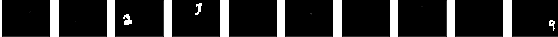

# 教程 | 重新发现语义分割，一文简述全卷积网络

选自 Medium

**作者****：Farhan Ahmad**

**机器之心编译**

**参与：李诗萌、路**

> 全卷积网络自 2012 年出现以来，在图像分类和图像检测领域取得了巨大成功。本文利用笔记本电脑构建了一个小型全卷积网络，详细介绍了全卷积网络的思路、过程等等，值得一看

语义分割是一种学习如何识别图像中对象范围的机器学习技术。语义分割赋予机器学习系统与人类相似的理解图像内容的能力。它促使机器学习算法定位对象的精准边界，无论是街景图像中的汽车和行人，还是医疗图像中的心脏、肝脏和肾脏。


*左图：分割后的 CT 扫描图像（图源：Semantic Scholar）。右图：分割后的街景图像（图源：Cityscapes Dataset）*

在语义分割方面有一些优秀的文章，这篇文章也许是最全面的：[资源 | 从全连接层到大型卷积核：深度学习的语义分割全指南](https://mp.weixin.qq.com/s?__biz=MzA3MzI4MjgzMw==&mid=2650728920&idx=4&sn=3c51fa0a95742d37222c3e16b77267ca&scene=21#wechat_redirect)

这篇文章的主要内容是如何针对 MNIST 数字建立一个小而快速的语义分割网络。

**背景**

语义分割网络有很多类，本文的重点在于全卷积网络（FCN）。Berkely 的论文（https://people.eecs.berkeley.edu/~jonlong/long_shelhamer_fcn.pdf）第一次提出 FCN。FCN 是通过扩展普通的卷积网络（CNN）建立的，因此 FCN 有更多参数而且训练时间更长。本文所述的工作源于构建一个非常小的 FCN，该 FCN 可以在几分钟内在普通的笔记本电脑上训练得到。这个想法的实现首先需要建立一个在每张图像中都包含多个 MNIST 数字的数据集。用于生成此派生数据集的代码在这里：https://github.com/farhanhubble/udacity-connect/blob/master/segmented-generator.ipynb。为避免混淆，我们将该数据集命名为 Ｍ2NIST（多数字 MNIST）。

**Ｍ2NIST**

M2NIST 中的每一张图都是灰度图（单通道），大小为 64*84 像素，最多包含 MNIST 数据集中的 3 个数字。如下所示：


*M2NIST 中的多数字图像* 

Ｍ2NIST 数据集的标签是分割掩码。分割掩码是一个二进制图像（像素值为 0 或 1），其高度和宽度都和多数字图像一致，但是有 10 个通道，从 0～9 的每一个数字都有一个通道。掩码中的第 k 个通道的像素都设置为 1，这与输入的多数字图像中数字 k 的位置是一致的。如果数字 k 没有出现在多数字图像中，就将掩码中的第 k 个通道的所有像素设置为 0。另一方面，如果多数字图像包含多个第 k 个数字的实例，则第 k 个通道就将所有像素设置为 1，这是为了与多数字图像中的任一实例一致。例如，上述多数字图像的掩码如下图所示：



*上述多数字图像的掩码。只有数字 2、3 和 9 的通道的一些像素为 1。*

为了让事情变得简单，M2NIST 数据集结合了 MNIST 中的数字，而且并未做任何诸如旋转或缩放这样的变化。M2NIST 可以保证数字不会发生重叠。

**FCN 背后的思路**

FCN 背后的思路非常简单。与 CNN 类似，FCN 也级联了卷积层和池化层。卷积层和最大池化层降低了输入图像的空间维度，还结合局部模式生成更多抽象「特征」。这种级联就是所谓的将原始输入编码为更抽象的编码特征的编码器。

在 CNN 中，编码器后紧跟着一些全连接层，这些全连接层可以将编码器产生的局部特征混合到全局预测结果中，而全局预测可以告诉我们感兴趣的对象是否存在。

> CNN = 编码器 + 分类器


*典型的 CNN 结构。图源：https://www.mathworks.com/solutions/deep-learning/convolutional-neural-network.html* 

在 FCN 中，我们想要预测掩码。如果在一张输入图像中有 n 类对象的话，那么掩码就有 n 个通道。掩码中第 k 个通道的 r 行 c 列的像素预测输入图中坐标为 (r,c) 的像素属于类别 k 的概率。这也被称为像素级密集预测。因为每个像素属于不同类别的概率和应该为 1，所以从通道 1 到 n 在 (r,c) 的值相加的和应该为 1。


*包含数字 2、3 和 9 的 M2NIST 图像带有通道 ID 的掩码。通道 0 到 9 在 (r,c) 处的值相加的和等于 1。*

让我们来了解一下 FCN 是如何完成像素级密集预测的。首先，FCN 使用转置卷积从编码器阶段逐渐扩展输出特征。转置卷积可以将特征重新分配至来源的像素位置。为了更好地理解转置卷积，请参阅下文：https://towardsdatascience.com/up-sampling-with-transposed-convolution-9ae4f2df52d0

要强调的重要一点是转置卷积不会撤销卷积操作。转置卷积使用和卷积结合多个值一样的方式重新分配一些卷积操作的输出，但方向相反。


*转置卷积将一个值从它来源的位置重新分配到（多个）位置。图源：https://towardsdatascience.com/up-sampling-with-transposed-convolution-9ae4f2df52d0*

使用多重转置卷积重复扩展或进行所谓的上采样，直到特征的高度和宽度与输入图像一致。这样的操作提供了每个像素位置的特征，并构成了 FCN 的解码器阶段。

> FAN = 编码器 + 解码器


*典型 FCN 架构。第一个阶段是编码器阶段，与 CNN 相似，编码器阶段减少了输入的高度（H）和宽度（W），并增加了通道（C）的厚度或数量。第二个阶段是解码器阶段，该阶段使用了转置卷积（反卷积）对来自编码器的特征进行上采样，直至其尺寸与输入图像一致。上图展现了每一层后的输出 H 和 W。输出的通道厚度（数量）并未展示出来，但可以量化表示。图源：https://www.doc.ic.ac.uk/~jce317/semantic-segmentation.html*

解码器的输出是形状为 H*W*C 的体（volume），其中 H 和 W 是输入图像的维度，C 是超参数。之后 C 通道会以像素级的方式和 n 个通道组合在一起，n 是对象类别的数量。特征值的像素级结合会使用普通的 1*1 卷积执行。1*1 卷积常用于这种「降维」操作。

大多数情况下 C>n，所以可以将该操作称为降维。值得一提的是，在大多数实现中，降维应用于编码器阶段的输出而非解码阶段的输出。这是为了减小网络的尺寸（https://arxiv.org/pdf/1409.4842.pdf）。

无论使用解码器对编码器的输出进行上采样，然后将解码器输出维度降为 n 还是将编码器的输出维度直接降为 n 然后用解码器对降维后的输出进行上采样，最终结果都是 H*W*n。然后用 Softmax 分类器以像素为单位预测每个像素所属 n 类中任一类的概率。

> 举一个具体的例子，假设编码器的输出是 14*14*512，如上面的 FCN 图所示，类别数量 n 是 10。一种选择是先使用 1*1 的卷积降低厚度。这一步操作后输出结果变为 14*14*10，然后进行上采样，结果变为 28*28*10、56*56*10 等等，直到得到 H*W*10 的输出。第二个选择是先进行上采样，得到 28x28x512、56x56x512 等，直到 HxWx512 的输出，再使用 1*1 的卷积降低厚度至 H*W*10。显而易见，第二个选择会消耗更多内存，因为厚度为 512 的中间输出明显会比第一种选择产生的厚度为 10 的中间输出消耗更多内存。

以编码器-解码器架构思想为基础，我们接下来了解一下如何重新利用 CNN 的部分组件使其成为 FCN 的编码器。

**重新利用 MNIST 分类器**

一般而言，FCN 是通过扩展现有 CNN 分类网络（如 Vgg、Resnet 或 GoogleNet）来建立的。FCN 的建立不仅再利用了这些 CNN 架构，还利用了这些架构预训练期间的权重，这显著地减少了 FCN 的训练时间。

原始论文（https://people.eecs.berkeley.edu/~jonlong/long）中是这样描述如何将 CNN 转换为 FCN 的：

> 通过丢弃最终的分类器层断开每一个网络，然后将所有的全连接层转换为卷积层。

用于建立 FCN 的 CNN 结构很简单：卷积层-最大池化层-卷积层-最大池化层-全连接层-全连接层。该 CNN 结构和训练代码在此：https://github.com/farhanhubble/udacity-connect/blob/master/mnist.ipynb。保存训练好的网络，这样才可以对其进行再利用。该网络定义如下：

```py
l1_1 = tf.layers.conv2d(input_2d,8,5,1,
                        activation=tf.nn.relu, name='conv1')
l1_2 = tf.layers.max_pooling2d(l1_1,2,2,name='pool1')
l1_3 = tf.layers.conv2d(l1_2,8,3,1,
                        activation=tf.nn.relu,name='conv2')
l1_4 = tf.layers.max_pooling2d(l1_3,2,2,name='poool2')
l1_5 = tf.layers.flatten(l1_4, name='flatten')
l2   = tf.layers.dense(l1_5, 32,
                        activation=tf.nn.relu,name='dense32')
out  = tf.layers.dense(l2,10,name='dense10')
```

为了「断开」该网络，我们移除了最后的分类器层 dense10。然后用 1*1 的卷积层代替了仅剩的全连接层 dense32。这是我们之前并未提及但原文中进行了的操作。在上述代码中相当于移除了 flatten 和 dens32 层，插入了新的 1*1 卷积，并将输出通道数设置为 32。这等同于丢弃了最后一个最大池化层 pool2 后的所有层，再添加一个 1*1 的卷积层。

用于构建 FCN 初始版本的代码地址：https://github.com/farhanhubble/udacity-connect/blob/4408cc1e8917f37e287d09177d6e4585bfe164ff/FCN-mnist.ipynb（最后更新的代码（https://github.com/farhanhubble/udacity-connect/）看似不同但重点一致）。

在下面的代码片段中，通过 get_tensor_by_name() 提取了最后的最大池化层的输出，然后将其馈送到输出厚度为 32 的 1*1 卷积中。该卷积层是原始 CNN 种 dense32 层的「替代」。接下来再用 1*1 卷积将输出厚度减少到 10。这是之前讨论过的降维。

```py
#Load pre-trained CNN for MNIST.
encoder = load_graph('checkpoints/frozen_graph.pb')
# Get required tensors from our pre-trained encoder(CNN).
maxpool2_out = encoder.get_tensor_by_name('poool2/MaxPool:0')
## Helper functions to reduce clutter.
_conv1x1 = lambda tensor, nb_filters :\
           tf.layers.conv2d(tensor, 
                            nb_filters, 
                            1, 
                            1,
                            activation=tf.nn.relu)
# Create a 32-deep 1x1 convolution layer in place of the 32-wide fully-connected layer.
enc_l1 = _conv1x1(maxpool2_out,32)
# Reduce number of channels to 10.
enc_l2 = _conv1x1(enc_l1,10)
```

这就完成了 FCN 的编码器阶段。为了建立解码器阶段，我们需要考虑如何缩放编码器输出的宽度与高度以及缩放的尺度。

尽管编码器中的卷积层和最大池化层来自于用于分类 28*28 的 MNIST 图像的 CNN，但也可以输入任意大小的图像。输入图像的高度和宽度对卷积层和最大池化层没什么影响，但对全连接层影响较大，不过因为已经断开最后的全连接层并将所有全连接层转换为 1*1 的卷积层，因此避免了影响。

当将 64*84*1 的 M2NIST 图像输入到编码器时，第一个卷积层（来自原始的 CNN）的卷积核大小 k=5，步长 s=1，输出深度 f=8，产生的输出大小为 60*40*8。k=2、s=2 的最大池化层将输出大小减半为 30*40*8。k=3、s=1、f=8 的下一个卷积层产生了大小为 28*38*8 的输出，紧跟着的下一个最大池化层再度将输出减半为 14*19*8。

总而言之：

> FCN 借用的 CNN 部分得到大小为 64*84*1 的输入，输出了 14*19*8 的特征。

编码器的下一层（dense32 的替代品）是输出厚度 f=32 的 1*1 的卷积层。该卷积层将 14*19*8 的特征重新结合到 14*19*32 的新特征中。

将这些特征的厚度减小（降维）。这用了厚度 f=10 的 1*1 卷积。所以编码器最终输出的特征形状为 14*19*10。然后通过解码器对这些特征进行上采样，直到特征变为 64*84*10。

> 解码器要将 14*19*10 的特征上采样为 64*84*10 的特征。

上采样要分阶段完成，以避免最终输出（掩码）的 ugly pattern。在（前期）实现中，把 14*19*10 的特征上采样到 30*40*10，然后再上采样为 64*84*10。

用类似于卷积的转置卷积进行上采样，以卷积核大小 k、步长 s 和滤波器数量（厚度）f 作为参数。每一个转置卷积的滤波器数量 f 都设置为 10，因为我们不用改变厚度。

步长取决于最终维度和初始维度的比例。对第一个转置卷积而言，高度的比例是（30/14），宽度的比例是（40/19），二者的值都约为 2，故 s=2。在第二个转置卷积中，该比例分别是 64/30 和 84/40，所以还是 s=2。

确定卷积核大小是一件有点棘手且相当依赖经验的事。对第一个转置卷积来说，k=1 将维度从 14*19*10 加倍为 28*38*10。为了得到 30*40*10，用 k=2 和 k=3 试了一下，但是都没得到令人满意的结果。最终，当 k=4 的时候起作用了。对第二个转置卷积而言，卷积核大小通常为 k=6。


*解码器阶段，卷积核大小（k）和步长（s）的值都经过仔细选择。*

解码器代码仅需调用 TensorFlow API 的两行：

```py
## Helper functions to reduce clutter.
_upsample = lambda tensor, kernel_sz, stride, nb_filters :\
 tf.layers.conv2d_transpose(tensor, 
                            nb_filters,
                            kernel_sz,
                            stride, 
                            padding='valid',
                            kernel_regularizer=
                            tf.contrib.layers.l2_regularizer(1e-3))
# Decoder with Two-stage up-sampling.
dec_l1 = _upsample(enc_l2,4,2,nb_classes)
dec_l2 = _upsample(enc_l3,6,2,nb_classes) 
```

为了进行像素级的概率计算，将解码器的输出馈送到 Softmax 层。沿着厚度（通道）应用 Softmax。

```py
logits    = tf.reshape(dec_l2,[-1,nb_classes], name='logits')        
labels_ph = tf.placeholder(dtype=tf.int32, 
                           shape=(None, 
                                 y.shape[1], 
                                 y.shape[2],
                                 y.shape[3]),        
                           name='segmentation_labels')
lr_ph       = tf.placeholder(dtype=tf.float32, name='learning_rate')
labels_flat = tf.reshape(labels_ph,[-1,num_classes])
cost_op = tf.reduce_mean(tf.nn.softmax_cross_entropy_with_logits(
labels=labels_flat, logits=logits))

# Apply an optimizer
optimizer_op = tf.train.AdamOptimizer(learning_rate=lr_ph).minimize(cost_op) 
```

在配备英伟达 1050 Ti GPU 的笔记本电脑上用交叉熵损失函数训练 100～400 个 epoch 后得到 FCN。一般而言，训练 2000 个样本仅需几分钟。

在这个初始设计中存在高偏差问题，该问题会在之后的迭代中解决。此外，还有一些逻辑和编程上的错误导致网络采取次优行为。下图是最佳早期设计的图示：


*早期 FCN 网络的预测。第一列是输入，接下来的 10 列是 10 个数字的预测掩码。由于网络设计的错误产生了白色的背景。有一些数字能清晰地分割开，另一些则模糊不清。*


*上述样本的真值。第一列是输入，剩下的 10 列是已知掩码。*

在修正了错误之后，该网络能够执行近乎完美的分割。下图是输出的预测值：


*修改后的设计的预测结果。还是有一些模糊不清，但总体结果很好。*

**总结**

所有的研究和实验大概花费了两周时间完成，并得到了可接受的结果。该问题很值得重新研究，因为小尺寸网络可以完成成百甚至上千次的实验，而这在之前是不可能完成的，至少在没有大量算力的情况下是不可能完成的。

完整代码地址：https://github.com/farhanhubble/udacity-connect/

*原文链接：**http://t.cn/RrJNQ3s?u=1402400261&m=4255076258606306&cu=3116703357*

 *****本文为机器之心编译，********转载请联系本公众号获得授权**********。**

✄------------------------------------------------

**加入机器之心（全职记者 / 实习生）：hr@jiqizhixin.com**

**投稿或寻求报道：**content**@jiqizhixin.com**

**广告 & 商务合作：bd@jiqizhixin.com***