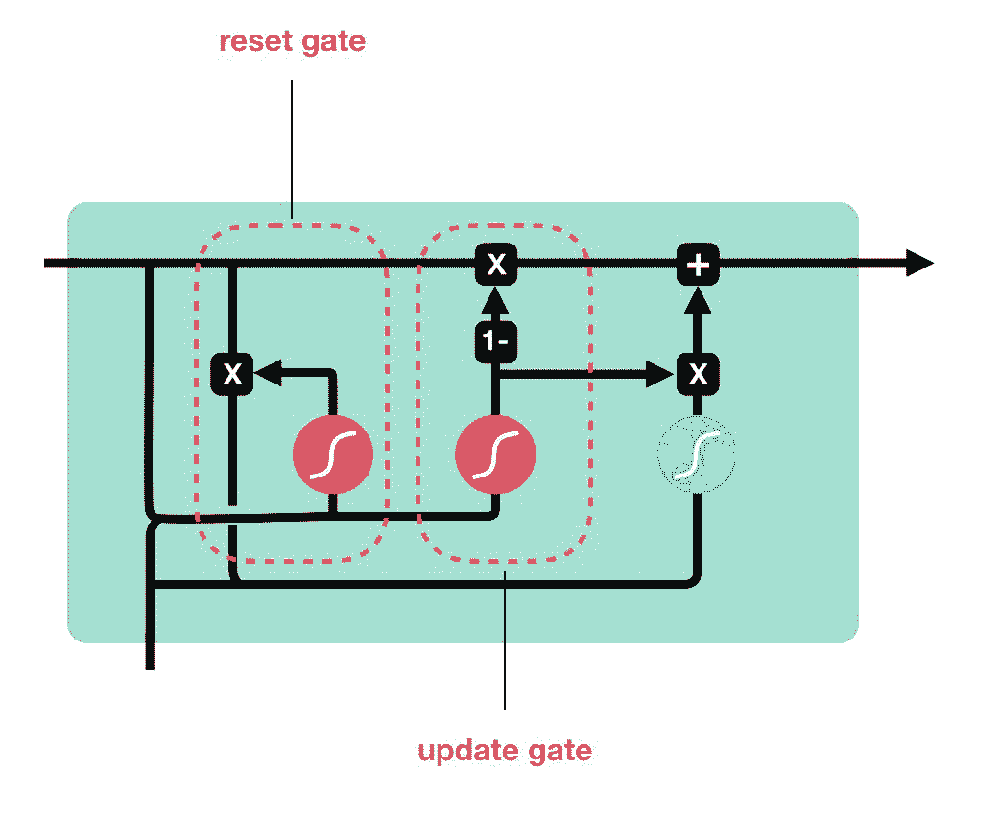

# 教程 | 一步一步，看图理解长短期记忆网络与门控循环网络

选自 TowardsDataScience

**作者：Michael Nguyen**

**机器之心编译**

**参与：高璇、思源**

> 大家好，欢迎来到 LSTM 和 GRU 的图解指南。在本文中，Michael 将从 LSTM 和 GRU 的背后的原理开始，然后解释令 LSTM 和 GRU 具有优秀性能的内部机制。如果你想了解这两个网络背后发生了什么，这篇文章就是为你准备的。

如果喜欢，你还可以观看这篇文章的视频版。

[`v.qq.com/iframe/preview.html?width=500&height=375&auto=0&vid=z1350anbf0v`](https://v.qq.com/iframe/preview.html?width=500&height=375&auto=0&vid=z1350anbf0v)

**问题重点——短期记忆**

循环神经网络（RNN）很大程度上会受到短期记忆的影响，如果序列足够长，它们将很难将信息从早期时间步传递到靠后的时间步。因此，如果你试图处理一段文字来做预测，RNN 可能从一开始就遗漏掉重要的信息。

在反向传播过程中，循环神经网络也存在梯度消失等问题。一般而言，梯度是用来更新神经网络权值的，梯度消失问题是梯度会随着时间的推移逐渐缩小接近零。如果梯度值变得非常小，它就不能为学习提供足够的信息。

*梯度更新规则*

所以在 RNN 中，通常是前期的层会因为梯度消失和停止学习。因此，RNN 会忘记它在更长的序列中看到的东西，从而只拥有短期记忆。

**解决方案——LSTM 和 GRU**

创建 LSTM 和 GRU 可以作为短期记忆的解决方案，它们有一种称为「门」的内部机制，可以调节信息流。

这些门可以判断数据在一个序列中该保留或弃用，因此它可以将相关信息传递到较长序列链中进行预测。几乎所有基于循环神经网络的最新成果都是通过这两个网络实现的。LSTM 和 GRU 可以应用在语音识别、语音合成和文本生成中。你甚至可以用它们来生成视频的字幕。

现在你应该理解 LSTM 和 GRU 擅长处理长序列的原因了。我将用直观的解释和插图来解答这个问题，我尽量避免使用数学。

**直观解释**

好，让我们从一个思维实验开始。假设你通过在网上看评论来决定是否买 Life 牌麦片。因为我们先看评论，然后判断其他人认为它是好还是坏。

当你阅读评论时，你的大脑潜意识里只会记住重要的关键词。你会侧重一些诸如「惊人的」和「完美均衡早餐」之类的词。你不会在意「这个」、「给予」、「所有」、「应该」等等。如果朋友第二天问你评论说了什么，你可能不会逐字逐句地记住。但你可能还记得一些重点，比如「肯定会再买」，其他的词会从记忆中消失。

这就是 LSTM 或 GRU 的作用，它可以学会只保留相关的信息以进行预测。在这种情况下，你记得的评论会让你做出好的判断。

**回顾循环神经网络**

为了理解 LSTM 或 GRU 是如何做到这一点的，让我们回顾一下循环神经网络。RNN 是这样工作的：第一个单词被转换成机器可读的向量。然后，RNN 逐个处理向量序列。

*逐个处理序列*

在处理过程中，它将之前的隐状态传递给序列的下一个步骤。隐状态作为神经网络的记忆，保存着网络先前观察到的数据信息。

*传递隐藏状态到下一时间步*

观察 RNN 的一个单元格，看看如何计算隐状态。首先，输入和之前的藏状态组合成一个向量。这个向量现在有当前输入和先前输入的信息。向量通过 tanh 激活，输出是新的隐状态，或神经网络的记忆。

*RNN 单元*

**双曲正切（tanh）激活函数**

tanh 激活函数用于调节在神经网络中传递的值，它会将输入值压缩到-1 到 1 之间。

*Tanh 将输入压缩到介于-1 到 1 之间*

当向量通过神经网络时，由于各种数学运算，它会经历许多变换。假设一个值连续乘以 3，结果会爆炸增长成天文数字，从而导致其他值的变化变得微不足道。

*缺少 tanh 的向量变换*

tanh 函数确保值保持在-1 到 1 之间，从而控制神经网络的输出。下图可以看到数值是如何借助 tanh 函数在不同的时间步之中保持稳定。

*tanh 函数下的向量变化*

这就是 RNN。它的内部操作很少，但在适当的环境下（比如短序列）会有很好的性能。RNN 使用的计算资源比它的改进版 LSTM 和 GRU 要少得多。

**LSTM**

LSTM 具有与循环神经网络相似的控制流，它在前向传播时处理传递信息的数据，两者区别在于单元内的处理过程不同。

*LSTM 单元及内部运算*

这些内部操作用于允许 LSTM 保存或丢弃信息，现在看这些操作可能会有点难，所以我们一步步来看。

**核心概念**

LSTM 的核心概念是单元状态，及单元中各种各样的门。单元状态好比传输的高速公路，在序列链中传递相关信息。你可以把它看作是网络的「记忆」。从理论上讲，单元状态可以在整个序列处理过程中携带相关信息。因此，即使是前期时间步的信息也可以帮助后续时间步的处理，因此单元状态有效减少了短期记忆的影响。随着单元状态在不同时间步的传递，我们可以通过门控机制添加或删除单元状态中的信息。这些门是不同的神经网络，用来决定能够进入单元状态的信息。在训练过程中，门可以学习到哪些信息是需要保存或遗忘的。

**sigmoid 函数**

门控机制主要由 sigmoid 激活函数构成，sigmoid 激活函数类似于 tanh 激活函数，它会将数值控制在 0 到 1 之间，而不是-1 到 1。这有助于更新或丢弃数据，因为任何数乘以 0 都是 0，这将导致数值消失或被「遗忘」。任何数字乘以 1 都是其本身，因此这个值不变或者「保存」。网络可以知道哪些数据不重要，可以被遗忘，或者哪些数据需要保存。

*Sigmoid 会将数值控制在 0 到 1 之间*

让我们再深入探讨一下各种门的作用，我们有三个不同的门来调节 LSTM 单元中的信息流，即遗忘门、输入门和输出门。

**遗忘门**

首先是遗忘门（forget gate），这个门决定了哪些信息应该被丢弃或保存。在遗忘门中，来自先前隐状态的信息和来自当前输入的信息传递到 sigmoid 函数，并将值压缩到 0 和 1 之间。越接近 0 意味着丢弃，越接近 1 意味着保留。

*遗忘门操作*

**输入门**

为了更新单元状态，LSTM 需要输入门（input gate）。首先，我们将前面的隐状态和当前输入传递给一个 sigmoid 函数，它通过将值转换为 0 到 1 来决定将更新哪些值。0 表示不重要，1 表示重要。还可以将隐状态和当前输入传递给 tanh 函数，使值变为-1 到 1 之间的值，以帮助调节神经网络。然后将 tanh 输出与 sigmoid 输出相乘，sigmoid 输出将决定保留 tanh 输出的重要信息。

*输入门操作*

**单元状态**

现在应该有足够的信息来计算单元状态。首先，单元状态逐点乘以遗忘向量，如果它与接近 0 的值相乘，就有可能在单元状态中得到低值。然后，从输入门读取上一步输出，并逐点相加，将单元状态更新为神经网络认为相关的新值，这就得到了新的单元状态。

*计算单元状态*

**输出门**

最后是输出门（output gate），输出门决定下一个隐藏状态。记住，隐藏状态包含先前输入的信息。隐藏状态也用于预测。首先，我们将前面的隐状态和当前输入传递给一个 sigmoid 函数。然后我们将新修改的单元状态传递给 tanh 函数。我们将 tanh 输出与 sigmoid 输出相乘，以确定隐状态应该包含的信息。新的单元状态和新的隐藏状态随后被转移到下一步中。

*输出门操作*

需要了解的是，遗忘门决定了哪些内容与前面的步骤相关。输入门决定从当前步骤中添加哪些相关信息。输出门决定下一个隐状态应该是什么。

**代码演示**

对于那些需要通过代码更好地理解模型的人来说，这里有一个 Python 伪代码示例：

*Python 伪代码*

1.  首先，将前面的隐状态和当前输入拼接起来，即为 combine。

2.  将 combine 的值送至遗忘层，并删除不相关的数据。

3.  使用 combine 创建候选层，候选项保存要添加到单元状态的可能值。

4.  将 combine 的值送至输入层，这一层决定应该添加到新的单元状态的候选数据。

5.  在计算遗忘层、候选层和输入层后，利用这些向量和前面的单元格状态计算新单元格状态。

6.  然后计算输出。

7.  输出和新单元状态之间的对应元素乘积将得到新的隐藏状态。

**GRU**

我们已经知道 LSTM 是如何工作的，让我们简单看看 GRU。GRU 是新一代的循环神经网络，它与 LSTM 非常相似。GRU 摆脱了单元状态，直接用隐藏状态传递信息，它只有重置门和更新门这两个门控机制。

*GRU 单元和它的门*

更新门的作用类似于 LSTM 的遗忘门和输入门。它同时决定丢弃什么旧信息，添加什么新信息。而重置门是一个用来决定要忘记多少过去信息的门。

GRU 的张量运算很少，因此与 LSTM 相比，它的训练速度要快一些。目前还不清楚哪一个更好，研究人员和工程师通常都根据自己实际情况选择二者之一。

**结论**

综上所述，RNN 对于处理用于预测的序列数据很有帮助，但其存在短期记忆问题。创建 LSTM 和 GRU 的目的是利用「门」的机制来降低短期记忆。LSTM 和 GRU 广泛应用在语音识别、语音合成、自然语言理解等最先进的深度学习应用中。

*原文链接：https://towardsdatascience.com/illustrated-guide-to-lstms-and-gru-s-a-step-by-step-explanation-44e9eb85bf21*

<mp-miniprogram class="miniprogram_element" data-miniprogram-appid="wxf424e2f3e2f94500" data-miniprogram-path="pages/technology/technology?id=c611384e-84f0-41c2-8dad-9cc2547c380a&amp;from=weapp" data-miniprogram-nickname="机器之心 Synced" data-miniprogram-avatar="http://mmbiz.qpic.cn/mmbiz_png/f3g058loLBj0Pib4UhuCFagffSB1RHImwskFzvic6mSp2LDhuerbXxeqqv0b63wSt2Pas7MicNWIcia358rlnhiaVag/0?wx_fmt=png" data-miniprogram-title="长短期记忆网络" data-miniprogram-imageurl="http://mmbiz.qpic.cn/mmbiz_jpg/KmXPKA19gW8UBr3ic1K9Wicdibt5kTibX1kEgd0GmlfJZ73icXKLkMUUP54lq1r6alkJezXNhZPvyYrhmwaQOpWcNWQ/0?wx_fmt=jpeg"></mp-miniprogram>

 *****本文为机器之心编译，**转载请联系本公众号获得授权****。**

✄------------------------------------------------

**加入机器之心（全职记者 / 实习生）：hr@jiqizhixin.com**

**投稿或寻求报道：**content**@jiqizhixin.com**

**广告 & 商务合作：bd@jiqizhixin.com***