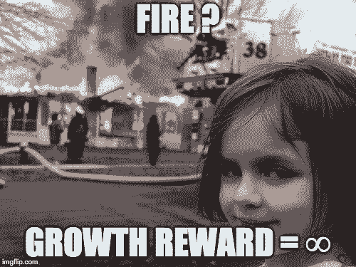
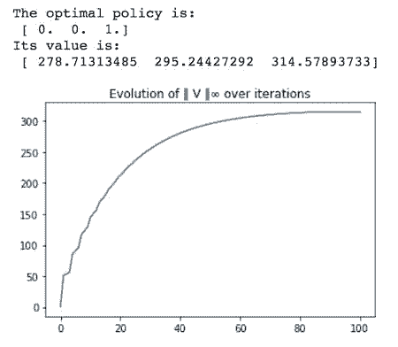
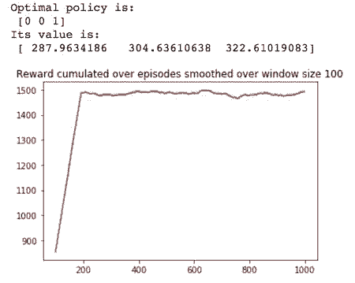
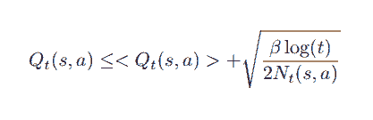
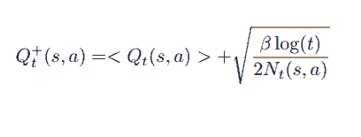
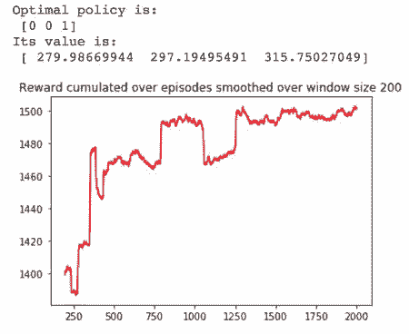
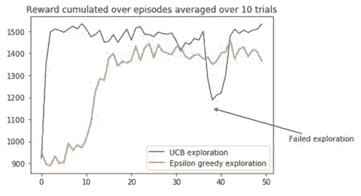

# 入门 | 走近流行强化学习算法：最优 Q-Learning

选自 Medium

**作者：****Yassine Yousfi**

**机器之心编译**

**参与：Nurhachu Null、李泽南**

> Q-Learning 是最著名的强化学习算法之一。我们将在本文中讨论该算法的一个重要部分：探索策略。但是在开始具体讨论之前，让我们从一些入门概念开始吧。

**强化学习（RL）**

强化学习是机器学习的一个重要领域，其中智能体通过对状态的感知、对行动的选择以及接受奖励和环境相连接。在每一步，智能体都要观察状态、选择并执行一个行动，这会改变它的状态并产生一个奖励。

**马尔科夫决策过程（MDP）**

在绝大多数传统的设置中，RL 解决 MDP。即使在 RL 的核心部分，我们也不会在本文中涉及 MDP 理论。维基百科上有关于 MDP 很好的简介。

我们将要解决「forest fire」的马尔科夫决策问题，这个在 python 的 MDP 工具箱（http://pymdptoolbox.readthedocs.io/en/latest/api/example.html）中是可以看到的。

> 森林由两种行动来管理：「等待」和「砍伐」。我们每年做出一个行动，首要目标是为野生动物维护一片古老的森林，次要目标是伐木赚钱。每年都会以 p 的概率发生森林火灾（森林正常生长的概率就是 1-p）。



我们将马尔科夫决策过程记为 (S, A, P, R, γ)，其中：

*   S 是有限状态空间：按照树龄分为三类：0—20 年，21—40 年，大于 40 年

*   A 是有限行动空间：「等待」和「砍伐」

*   P 和 R 是转换矩阵和奖励矩阵，它们的闭合形式容易表达出来

*   γ是表示长期奖励和短期奖励之间的区别的折扣因子

*   策略π是在给定的当前状态下动作的平稳分布（马尔可夫性）

目标就是找到在不了解任何马尔科夫动态特性的情况下来寻找马尔科夫决策过程的最优策略π*。需要注意的是，如果我们具有这种知识，像最有价值迭代这种算法就可以找到最优策略。

```py
def optimal_value_iteration(mdp, V0, num_iterations, epsilon=0.0001):
    V = np.zeros((num_iterations+1, mdp.S))
    V[0][:] = np.ones(mdp.S)*V0
    X = np.zeros((num_iterations+1, mdp.A, mdp.S))
    star = np.zeros((num_iterations+1,mdp.S))
    for k in range(num_iterations):
        for s in range(mdp.S):
            for a in range(mdp.A):
                X[k+1][a][s] = mdp.R[a][s] + mdp.discount*np.sum(mdp.P[a][s].dot(V[k]))
            star[k+1][s] = (np.argmax(X[k+1,:,s]))
            V[k+1][s] = np.max(X[k+1,:,s])

        if (np.max(V[k+1]-V[k])-np.min(V[k+1]-V[k])) < epsilon:
            V[k+1:] = V[k+1]
            star[k+1:] = star[k+1]
            X[k+1:] = X[k+1]
            break
        else: pass

    return star, V, X 
```

    

这里的最优策略是相当符合直觉的，就是等到森林达到最老的树龄再砍伐，因为我们把树龄最老的时候的砍伐奖励设置成了其成长过程中的 5 倍（r1=10,r2=50）。

**Q-LEARNING**

Q-Learning 中策略（π）的质量函数，它将任何一个状态动作组合（s,a）和在观察状态 s 下通过选择行动 a 而得到的期望积累折扣未来奖励映射在一起。

Q-Leraning 被称为「没有模型」，这意味着它不会尝试为马尔科夫决策过程的动态特性建模，它直接估计每个状态下每个动作的 Q 值。然后可以通过选择每个状态具有最高 Q 值的动作来绘制策略。

如果智能体能够以无限多的次数访问状态—行动对，那么 Q-Learning 将会收敛到最优的 Q 函数 [1]。

同样，我们也不会深入讨论 Q-Learning 的细节。如果你对它不太熟悉，这里有 Siraj Raval 的解释视频。

[`v.qq.com/iframe/preview.html?vid=p0673mq4gpj&width=500&height=375&auto=0`](https://v.qq.com/iframe/preview.html?vid=p0673mq4gpj&width=500&height=375&auto=0)

下面我们将展示 Q-Learning 的 Python 实现。请注意，这里所拥的学习率（alpha）遵循 [3] 的结果，使用 w=0.8 的多项式。

这里用到的探索策略（ε-greedy）在后面会有细节介绍。

```py
def q_learning(mdp, num_episodes, T_max, epsilon=0.01):
    Q = np.zeros((mdp.S, mdp.A))
    episode_rewards = np.zeros(num_episodes)
    policy = np.ones(mdp.S)
    V = np.zeros((num_episodes, mdp.S))
    N = np.zeros((mdp.S, mdp.A))
    for i_episode in range(num_episodes): 
        # epsilon greedy exploration
        greedy_probs = epsilon_greedy_exploration(Q, epsilon, mdp.A)
        state = np.random.choice(np.arange(mdp.S))
        for t in range(T_max):
            # epsilon greedy exploration
            action_probs = greedy_probs(state)
            action = np.random.choice(np.arange(len(action_probs)), p=action_probs)
            next_state, reward = playtransition(mdp, state, action)
            episode_rewards[i_episode] += reward
            N[state, action] += 1
            alpha = 1/(t+1)**0.8
            best_next_action = np.argmax(Q[next_state])    
            td_target = reward + mdp.discount * Q[next_state][best_next_action]
            td_delta = td_target - Q[state][action]
            Q[state][action] += alpha * td_delta
            state = next_state
        V[i_episode,:] = Q.max(axis=1)
        policy = Q.argmax(axis=1)

    return V, policy, episode_rewards, N 
```

          

**Exploration/Exploitation 权衡**

连续学习算法会涉及到一个基本的选择：

*   Exploitation: 在目前已经给定的信息下做出最佳选择

*   Exploration: 通过做出其他选择收集更多的信息

成功的平衡 exploration 和 exploitation 对智能体的学习性能有着重要的影响。太多的 exploration 会阻止智能体最大化短期奖励，因为所选的 exploration 行动可能导致来自环境的不良奖励。另一方面，在不完全的知识中 exploiting 会阻止智能体最大化长期奖励，因为所选的 exploiting 行动可能一直不是最优的。

**ε-greedy exploration 策略**

这是一个很朴素的 exploration 策略：在每一步都以概率 ε选择随机的动作。

这也许是最常用的、也是最简单的 exploration 策略。在很多实现中，ε都被设置为随时间衰减，但是在一些例子中，ε也被设置为定值。

```py
def epsilon_greedy_exploration(Q, epsilon, num_actions):
    def policy_exp(state):
        probs = np.ones(num_actions, dtype=float) * epsilon / num_actions
        best_action = np.argmax(Q[state])
        probs[best_action] += (1.0 - epsilon)
        return probs
    return policy_exp 
```

**「乐观面对不确定性」的 exploration 策略**

这个概念首次在随机多臂赌博机（SMAB）环境中被首次提出，这是一个古老的决策过程，为了最大化机器给出的期望折扣奖励，赌徒在每一步都要决定摇动哪一个机器。

赌徒面临着一个 exploration/exploitation 权衡，使用具有最高平均奖励的机器或者探索其他表现并不是很好的机器以得到更高的奖励。

SMAB 和 Q-Learning 中的 exploration 问题很相似。

*   Exploitation: 在给定的状态下选择具有最高 Q 值的动作

*   Exploration: 探索更多的动作（选择没有被足够得访问或者从未被访问的动作）


*图片来自微软研究院*

「面对不确定性的乐观」（OFU）状态：无论什么时候，我们都对老虎机的输出结果是不确定的，所以我们预计环境是最好的，然后选择最好的老虎机。

OFU 背后的直觉是：

*   如果我们处于最好的处境：OFU 会选择最佳的老虎机（没有遗憾）

*   如果我么不在最好的处境中：不确定性会减少（最佳）

最著名的 OFU 算法之一是 UCB（置信区上界）[2]。我们按照下面的方法将它用在 Q-learning 中。

定义：

*   Q(s, a): 状态 s 下采用动作 a 的 Q 值

*   N(t, s, a):在时间 t，动作 a 在状态 s 被选择的次数

智能体的目标是：Argmax {Q(s, a)/ a ∈ A}。代表在状态 s 下选择具有最大 Q 值的动作。但是时间 t 的实际 Q(s, a) 是未知的。

我们有：Q(s,a) = <Q(t, s, a)> + (Q(s,a) − <Q(t, s, a)>)，<Q(t, s, a)>是时间 t 估计的 Q 值。(Q(s,a) − <Q(t, s, a)>) 对应的是误差项，我们可以形成边界并使用 OFU。

Hoeffding 不等式是限制这个误差的一种方式，我们可以证明：



最优策略可以被写成：

Argmax {Q+(t, s, a)/ a ∈ A}



其中β ≥ 0 调节 exploration。当β＝0 的时候，该策略仅仅利用过去的估计（遵循 leader 策略）。

这个范围是该领域最常用的。还有很多其他改进这个范围的工作（UCB-V、UCB、KL-UCB、Bayes-UCB、BESA 等）。

这里是我们对经典 UCB exploration 策略的实现，以及它在 Q-Learning 中使用的结果。

```py
def UCB_exploration(Q, num_actions, beta=1):
    def UCB_exp(state, N, t):
        probs = np.zeros(num_actions, dtype=float)
        Q_ = Q[state,:]/max(Q[state,:]) + np.sqrt(beta*np.log(t+1)/(2*N[state]))
        best_action = Q_.argmax()
        probs[best_action] = 1
        return probs
    return UCB_exp 
```



UCB exploration 似乎能够快速地达到很高的奖励，然而训练过程还是受到早期 exploration 的干扰，对于更复杂的马尔科夫决策过程而言，这是有优势的，因为智能体可以免于非最优的解决方案。

我们来更加仔细地比较这两种策略。



**总结及展望**

Q-learning 是最常用的强化学习算法之一。在这篇文章中，我们讨论了 exploration 策略的重要性以及 UCB exploration 策略的使用，而并非最出名的ε-greedy exploration 策略。为了平衡 exploration 和 exploitation，更多的改进乐观策略可能会被用到。

**参考文献**

[1] T. Jaakkola, M. I. Jordan, and S. P. Singh,「On the convergence of stochastic iterative dynamic programming algorithms」Neural computation, vol. 6, no. 6, pp. 1185–1201, 1994.

[2] P. Auer,「Using Confidence Bounds for Exploitation-Exploration Trade-offs」, Journal of Machine Learning Research 3 397–422, 2002.

[3] E. Even-Dar, Y. Mansour,「Learning Rates for Q-learning」, Journal of Machine Learning Research 5 1–25, 2003. 

*原文链接：https://medium.com/sequential-learning/optimistic-q-learning-b9304d079e11*

****本文为机器之心编译，**转载请联系本公众号获得授权****。**

✄------------------------------------------------

**加入机器之心（全职记者/实习生）：hr@jiqizhixin.com**

**投稿或寻求报道：**content**@jiqizhixin.com**

**广告&商务合作：bd@jiqizhixin.com**