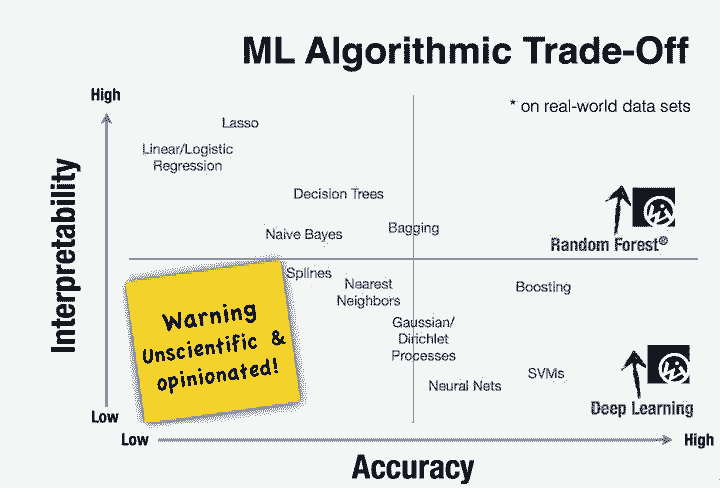
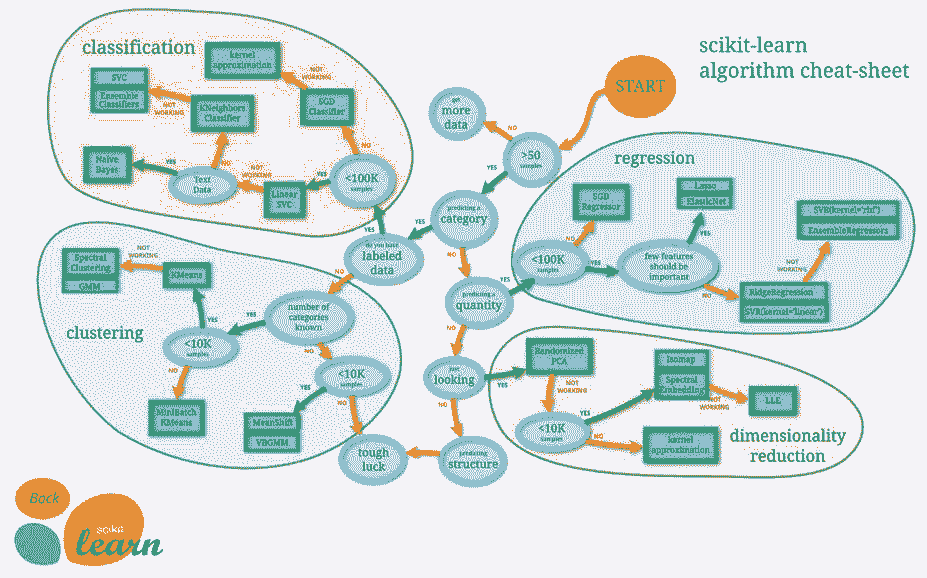

# 教程 | 算法太多挑花眼？教你如何选择正确的机器学习算法

选自 Hackernoon

**作者：Rajat Harlalka**

**机器之心编译**

**参与：Geek AI****、张倩**

> 机器学习算法虽多，却没有什么普适的解决方案。决策树、随机森林、朴素贝叶斯、深度网络等等等等，是不是有时候觉得挑花了眼呢？福利来啦~本文将教你慧眼识精，快速挑选出满意的算法！

机器学习既是一门科学，也是一种艺术。纵观各类机器学习算法，并没有一种普适的解决方案或方法。事实上，有几个因素会影响你对机器学习算法的选择。

有些问题是非常特别的，需要用一种特定的解决方法。例如，如果你对推荐系统有所了解，你会发现它是一类很常用的机器学习算法，用来解决一类非常特殊的问题。而其它的一些问题则非常开放，可能需要一种试错方法（例如：强化学习）。监督学习、分类、回归等问题都是非常开放的，可以被用于异常检测或建立更加广泛的预测模型。

此外，我们在选择机器学习算法时所做出的一些决定与算法的优化或技术层面关系并不大，而更多地与业务决策相关。下面，让我们一起来看看有哪些因素能帮你缩小机器学习算法的选择范围。

**数据科学过程**

在你开始研究不同的机器学习算法前，你需要对自己拥有的数据、面对的问题及相关约束有清晰的了解。

**理解你的数据**

当我们决定使用哪种算法时，我们所拥有的数据的类型和形态起着关键性的作用。有些算法可以利用较小的样本集合工作，而另一些算法则需要海量的样本。特定的算法对特定类型的数据起作用。例如，朴素贝叶斯算法对处理待分类的输入特别有效，但是对于缺失值则一点都不敏感。

因此，你需要做到：

了解你的数据

 1\. 查看总结统计和数据可视化的结果

*   百分比可以帮助你识别大多数数据的范围

*   平均数和中位数可以描述集中趋势

*   相关系数可以指出强的关联性

2\. 数据可视化

*   箱形图可以识别出异常值

*   密度图和直方图可以显示出数据的散布情况

*   散点图可以描述二元关系

数据清洗

 1\. 处理缺失值。缺失的数据对于某些模型的影响比对其它模型更大。即使是对于那些被用于处理缺失数据的模型来说，它们也可能对缺失数据很敏感（某些变量的缺失数据可能导致预测性能变差）

 2\. 选择处理异常值的方法

*   异常值在多维数据中十分常见。

*   有些模型对异常值的敏感性比其它模型要低。通常而言，树模型对于异常值的存在不太敏感。然而回归模型、或者任何试图使用方程的模型都会受到异常值的严重影响。

*   异常值可能是糟糕的数据收集造成的，也可能是合理的极值。

3\. 数据需要被聚合吗？

**数据增强**

 1\. 特征工程是从原始数据中产生能够被用于建模的数据的过程，可以起到以下几种作用：

*   使模型更容易被解释（如数据分箱（binning））

*   捕获更复杂的关系（如神经网络）

*   减少数据冗余并降低数据维度（如主成分分析（PCA））

*   重新缩放变量（如标准化或归一化）

2\. 不同的模型可能有不同的特征工程的要求。有的模型有内置的特征工程。

**对问题进行分类**

下一步是对问题进行分类。这是一个需要分两步实现的过程。

 1\. 根据输入分类：

*   如果你拥有的是带标签的数据，那么这就是一个监督学习问题。

*   如果你拥有的是未标注过的数据，并且希望从中找到有用的结构，那么这就是一个无监督学习问题。

*   如果你想要通过与环境的交互来优化一个目标函数，那么这就是一个强化学习问题。

2\. 根据输出分类：

*   如果模型的输出是一个（连续的）数字，那么这就是一个回归问题。

*   如果模型的输出是一个类别，那么这就是一个分类问题。

*   如果模型的输出是一组用输入数据划分出的簇，那么这就是一个聚类问题。

*   你想发现一个异常点吗？此时你面对的就是一个异常检测问题。

**理解你要满足的约束条件**

*   你需要考虑你能够存储数据的容量有多大？这取决于系统的存储容量，你可能无法存储若干 GB 大小的分类、回归模型或者若干 GB 的用于聚类分析的数据。例如，在嵌入式系统中，你就会面临这种情况。

*   对预测过程的速度是否有要求？在实时应用中，很显然，尽快得出预测结果是十分重要的。例如，在自动驾驶问题中，应用必须尽可能快地对道路标志进行分类，以免发生交通事故。

*   对学习过程的速度是否有要求？在某些情况下，快速训练模型是十分必要的：有时，你需要使用不同的数据集快速地实时更新你的模型。

**寻找可用的算法**

当对自己的任务环境有了一个清晰的认识后，你就可以使用你所掌握的工具确定适用于待解决的问题并切实可行的算法。一些影响你选择模型的因素如下：

*   模型是否满足业务目标

*   模型需要多少数据预处理工作

*   模型有多准确

*   模型的可解释性如何

*   模型运行的速度有多快：构造模型需要多久？模型做出预测需要多长时间？

*   模型的可伸缩性如何

模型的复杂度是一个影响算法选择的重要标准。一般来说，一个更复杂的模型具备下列特征：

*   它依赖于更多的特征进行学习和预测（例如，使用十个而不是两个特征来预测目标）

*   它依赖于更复杂的特征工程（例如，使用多项式特征、交互特征或主成分）

*   它有更大的计算开销（例如，需要一个由 100 棵决策树组成的随机森林，而不是一棵单独的决策树）

除此之外，同样的机器学习算法可以基于参数的个数和某些超参数的选择而变得更加复杂。例如：

*   回归模型可以拥有更多的特征，或者多项式项和交互项。

*   决策树可以拥有更大或更小的深度。

将相同的算法变得更加复杂增加了发生过拟合的几率。

**常用的机器学习算法**

**线性回归**

这可能是机器学习中最简单的算法。例如，当你想要计算一些连续值，而不是将输出分类时，可以使用回归算法。因此，当你需要预测一个正在运行的过程未来的值时，你可以使用回归算法。然而，当特征冗余，即如果存在多重共线性（multicollinearity）时，线性回归就不太稳定。

在下列情况下可以考虑使用线性回归：

*   从一个地方移动到另一个地方所需的时间

*   预测下个月某种产品的销售情况

*   血液中的酒精含量对协调能力的影响

*   预测每个月礼品卡的销售情况，并改善年收入的估算

**Logistic 回归**

Logistic 回归执行二进制分类，因此输出二值标签。它将特征的线性组合作为输入，并且对其应用非线性函数（sigmoid），因此它是一个非常小的神经网络的实例。

logistic 回归提供了许多方法对你的模型进行正则化处理，因此正如在朴素贝叶斯算法中那样，你不必担心你的特征是否相关。该模型还有一个很好的概率化的解释。不像在决策树或者支持向量机中那样，你可以很容易地更新你的模型以获取新的数据。如果你想要使用一个概率化的框架，或者你希望在未来能够快速地将更多的训练数据融合到你的模型中，你可以使用 logistic 回归算法。logistic 回归还可以帮助你理解预测结果背后起作用的因素，它不完全是一个黑盒方法。

在下列情况下可以考虑使用 logistic 回归算法：

*   预测客户流失

*   信用评分和欺诈检测

*   评价市场营销活动的效果

**决策树**

决策树很少被单独使用，但是不同的决策树可以组合成非常高效的算法，例如随机森林或梯度提升树算法。

决策树很容易处理特征交互，并且决策树是一种非参数模型，所以你不必担心异常值或者数据是否是线性可分的。决策树算法的一个缺点是，它们不支持在线学习，因此当你要使用新的样本时，你不得不重新构建决策树。决策树的另一个缺点是，它很容易发生过拟合，而这就是像随机森林（或提升树）这样的集成学习方法能够派上用场的地方。决策树也需要大量的内存空间（拥有的特征越多，你的决策树可能会越深、越大）

决策树能够很好地帮助你在诸多行动路径中做出选择：

*   做出投资决策

*   预测客户流失

*   找出可能拖欠银行贷款的人

*   在「建造」和「购买」两种选择间进行抉择

*   销售主管的资质审核

**K-均值**

有时，你完全没有数据的标签信息，并且你的目的是根据对象的特征来为其打上标签。这种问题被称为聚类任务。聚类算法可以在这种情况下被使用：例如，当你有一大群用户，你希望根据他们共有的一些属性将其划分到一些特定的组中。

如果在你的问题声明中有这样的问题：例如，找出一群个体的组织形式，或将某些东西分组，或找出特定的组。这时，你就应该使用聚类算法。

该方法最大的缺点是，K-均值算法需要提前知道你的数据会有多少簇，因此这可能需要进行大量的试验去「猜测」我们最终定义的簇的最佳个数——K。

**主成分分析（PCA）**

主成分分析能够对数据进行降维。有时，你拥有各种各样的特征，这些特征之间的相关性可能很高，而模型如果使用如此大量的数据可能会产生过拟合现象。这时，你可以使用主成分分析（PCA）技术。

主成分分析（PCA）能够起作用的关键因素是：除了低维的样本表征，它还提供了各种变量的一种同步的低维表征。同步的样本和变量的表征提供了一种能够可视化地找到能够表示一组样本的特征的变量的方法。

**支持向量机**

支持向量机（SVM）是一种在模式识别和分类问题中被广泛应用的监督机器学习技术——当你的数据恰好有两类时。

支持向量机准确率高，对于防止过拟合很好的理论保障。当你使用一个合适的核函数时，即使你的数据在基（低维）特征空间中是线性不可分的，他们也可以很好地工作。支持向量机在文本分类问题中非常流行，在该问题中，输入是一个维度非常高的空间是很正常的。然而，SVM 是一种内存密集型算法，它很难被解释，并且对其进行调优十分困难。

在下列现实世界的应用中，你可以使用支持向量机：

*   发现患有糖尿病等常见疾病的人

*   手写字符识别

*   文本分类——将文章按照话题分类

*   股票市场价格预测

**朴素贝叶斯**

这是一种基于贝叶斯定理的分类技术，它很容易构建，非常适用于大规模数据集。除了结构简单，据说朴素贝叶斯的表现甚至比一些复杂得多的分类方法更好。当 CPU 和内存资源有限时，朴素贝叶斯算法也是一个很好的选项。

朴素贝叶斯非常简单，你仅仅是在做大量的计数工作。如果朴素贝叶斯的条件独立假设确实成立，朴素贝叶斯分类器的收敛速度会比 logistic 回归这样的判别模型更快，因此需要的训练数据更少。即使朴素贝叶斯的假设不成立，朴素贝叶斯分类器往往也能很好地完成任务。如果你想使用一种快速的、简单的、性能也不错的模型，朴素贝叶斯是一个很好的选择。这种算法最大的缺点就是它不能学习到特征之间的相互作用。

在下列真实世界的应用中，你可以使用朴素贝叶斯：

*   情感分析和文本分类

*   类似于 Netflix、Amazon 这样的推荐系统

*   识别垃圾邮件

*   人脸识别

**随机森林**

随机森林是一种决策树的集成方法。它能够同时解决具有大规模数据集的回归问题和分类问题，还有助于从数以千计的输入变量中找出最重要的变量。随机森林具有很强的可伸缩性，它适用于任何维数的数据，并且通常具有相当不错的性能。此外，还有一些遗传算法，它们可以在具有最少的关于数据本身的知识的情况下，很好地扩展到任何维度和任何数据上，其中最简单的实现就是微生物遗传算法。然而，随机森林学习的速度可能会很慢（取决于参数设置），并且这种方法不能迭代地改进生成模型。

在下列现实世界的应用中，你可以使用随机森林：

*   预测高危患者

*   预测零件在生产中的故障

*   预测拖欠贷款的人

**神经网络**

神经网络中包含着神经元之间连接的权重。这些权重是平衡的，逐次对数据点进行学习。当所有的权重都被训练好后，如果需要对新给定的数据点进行回归，神经网络可以被用于预测分类结果或一个具体数值。利用神经网络，可以对特别复杂的模型进行训练，并且将其作为一种黑盒方法加以利用，而在训练模型之前，我们无需进行不可预测的复杂特征工程。通过与「深度方法」相结合，甚至可以采用更加不可预测的模型去实现新任务。例如，最近人们已经通过深度神经网络大大提升了物体识别任务的结果。深度学习还被应用于特征提取这样的非监督学习任务，也可以在人为干预更少的情况下，从原始图像或语音中提取特征。

另一方面，神经网络很难被解释清楚，其参数设置也复杂地让人难以置信。此外，神经网络算法也都是资源密集型和内存密集型的。

**SCIKIT 参考手册**

Scikit learning 为大家提供了一个非常深入的、解释地很清楚的流程图，它能够帮助你选择正确的算法。我认为此图十分方便。

**结论**

一般来说，你可以根据上面介绍的要点来筛选出一些算法，但是要想在一开始就知道哪种方法最好是很难的。你最好多迭代几次选择算法的过程。将你的数据输入给那些你确定的潜在优秀机器学习算法，通过并行或串行的方式运行这些算法，最终评估算法性能，从而选择出最佳的算法。

在最后，我想告诉你：为现实生活中的问题找到正确的解决方案，通常不仅仅是一个应用数学方法的问题。这要求我们对业务需求、规则和制度、相关利益者的关注点有所了解，并且具备大量的专业知识。在解决一个机器学习问题的同时，能够结合并平衡这些问题是至关重要的，那些能做到这一点的人可以创造最大的价值。

*原文链接：https://hackernoon.com/choosing-the-right-machine-learning-algorithm-68126944ce1f*

****本文为机器之心编译，**转载请联系本公众号获得授权****。**

✄------------------------------------------------

**加入机器之心（全职记者 / 实习生）：hr@jiqizhixin.com**

**投稿或寻求报道：**content**@jiqizhixin.com**

**广告 & 商务合作：bd@jiqizhixin.com**