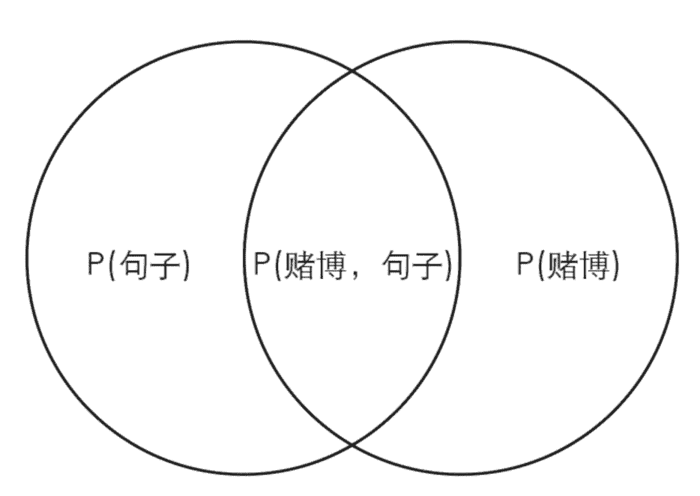
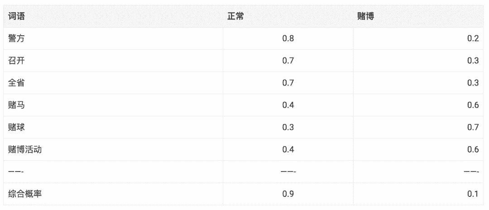
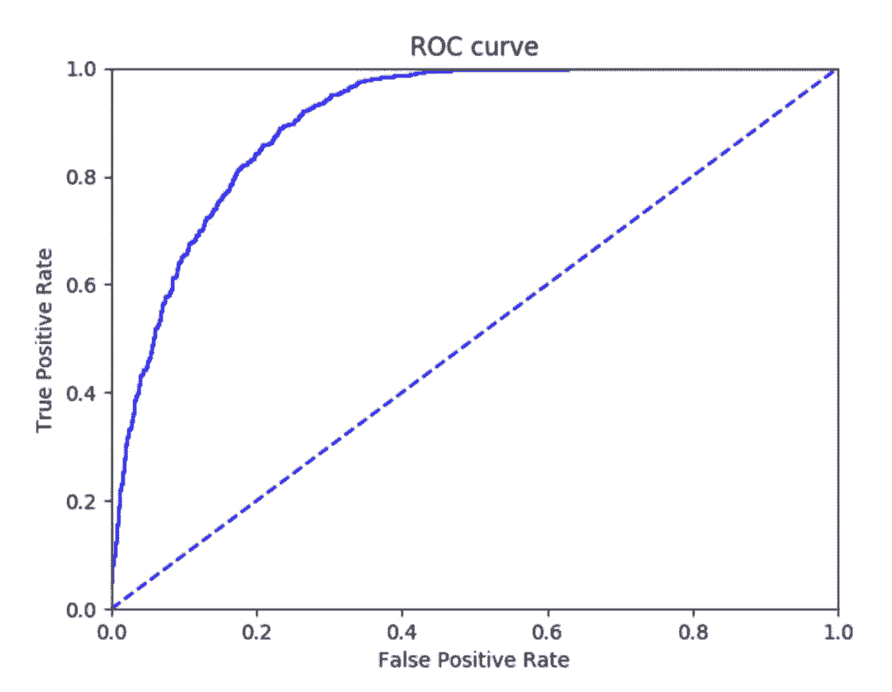

# 解读实践中最广泛应用的分类模型：朴素贝叶斯算法

机器之心专栏

**作者：伏宸实验室研究员 Windson Yang**

> 贝叶斯模型在机器学习以及人工智能中都有出现，cherry 分类器（https://github.com/Sunkist-Cherry/cherry）使用了朴素贝叶斯模型算法，经过简单的优化，使用 1000 个训练数据就能得到 97.5% 的准确率。虽然现在主流的框架都带有朴素贝叶斯模型算法，大多数开发者只需要直接调用 api 就能使用。但是在实际业务中，面对不同的数据集，必须了解算法的原理，实现以及懂得对结果进行分析，才能达到高准确率。

1.  cherry 分类器

2.  关键字过滤

3.  贝叶斯模型

4.  数学推导

5.  贝叶斯模型实现

6.  测试

7.  统计分析

8.  总结

**cherry 分类器**

cherry 分类器默认支持中英文分类，用作例子的数据缓存中，中文训练数据包含正常，政治敏感，赌博，色情 4 个类别，英文训练数据包含正常邮件，垃圾邮件两个类别 (训练数据可以通过 Google drive 下载，地址：https://drive.google.com/file/d/1OtbY7RCjkoQWYb0fHIOTBcJfgDlW5Tjz/view)。调用非常容易，使用 pip 安装后，输入句子：

> 警方召开了全省集中打击赌博违法犯罪活动专项行动电视电话会议。会议的重点是「查处」六合彩、赌球赌马等赌博活动。

```py
>>> result = cherry.classify('警方召开了全省集中打击赌博违法犯罪活动专项行动电 电话会议。会议的重点是“查处”六合彩、赌球赌马等赌博活动。')
Building prefix dict from the default dictionary ...
Loading model from cache /var/folders/md/0251yy51045d6nknpkbn6dc80000gn/T/jieba.cache
Loading model cost 0.894 seconds.
Prefix dict has been built succesfully.>>>
>>> result.percentage
[('normal.dat', 0.997), ('politics.dat', 0.002), ('gamble.dat', 0.0), ('sex.dat', 0.0)]>>>
>>> result.word_list
[('赌博', 8.5881312727226), ('活动', 6.401543938544878), ('会议', 6.091963362021649), ('违法犯罪', 4.234845736802978), ('警方', 3.536827626008435), ('打击', 3.2491455535566542), ('行动', 2.8561029654470476), ('查处', 2.3860993362013083), ('重点', 2.126816738271229), ('召开', 1.8628511924367634), ('专项', 1.1697040118768172), ('电视电话会议', 1.1697040118768172), ('全省', 0.47655683131687354), ('集中', -0.6220554573512382), ('六合彩', -2.29603189092291)]
```

分类器判断输入句子有 99.7% 的概率是正常句子，0.2% 是政治敏感，剩余 0.1% 是其他两个类别

```py
>>> result.percentage
[('normal.dat', 0.997), ('politics.dat', 0.002), ('gamble.dat', 0.0), ('sex.dat', 0.0)]
```

其中对分类器判断影响最大的词语分别是赌博，活动，会议，违法犯罪，警方，打击

```py
赌博，活动，会议，违法犯罪，警方，打击
```

**关键字过滤**

要理解分类器的原理，可以先从最简单的分类关键词算法开始，输入句子：

> 奖金将在您完成首存后即可存入您的账户。真人荷官，六合彩，赌球欢迎来到全新番摊游戏！

使用关键字算法，我们可以将真人荷官，六合彩这两个词语加入赌博类别的黑名单，每个类别都维持对应的黑名单表。当之后需要分类的时候，先判断关键字有没有出现在输入句子中，如果有，则判断为对应的类别。这个方法实现简单，但是缺点也很明显，误判率非常高，例如遇到输入句子：

> 警方召开了全省集中打击赌博违法犯罪活动专项行动电视电话会议。会议的重点是「查处」六合彩、赌球赌马等赌博活动。

这是一个正常的句子，但是由于包含六合彩，赌球这两个黑名单词语，关键字算法会误判其为赌博类别，同时，如果一个句子同时包含多个不同类别的黑名单词语，例如赌博，色情的话，关键字算法也无法判断正确。

**贝叶斯模型**

其实关键字算法已经接近贝叶斯模型的原理了，我们再仔细分析下关键字算法。关键字算法的问题在于只对输入句子中的部分词语进行分析，而没有对输入句子的整体进行分析。而贝叶斯模型会对输入句子的所有有效部分进行分析，通过训练数据计算出每个词语在不同类别下的概率，然后综合得出最有可能的结果。可以说，贝叶斯模型是关键字过滤加上统计学的升级版。

当贝叶斯模型去判断输入句子：

> 警方召开了全省集中打击赌博违法犯罪活动专项行动电视电话会议。会议的重点是「查处」六合彩、赌球赌马等赌博活动。

它会综合分析句子中的每个词语：

```py
警方，召开，全省，集中打击，... 六合彩，赌球，赌马，...
```

输入句子虽然包含六合彩，赌球这些赌博常出现的词语，但是警方，召开，集中打击这几个词代表这个句子极有可能是正常的句子。

**数学推导**

贝叶斯模型的数学推导非常简单，强烈建议大家静下心自己推导。

这里为了简单起见，我们只考虑句子是正常或者赌博两种可能，我们先复习一下概率论的基础表达：

> P(A) -> A 事件发生的概率，例如明天天晴的概率
> 
> P(A|B) -> 条件概率，B 事件发生的前提下 A 事件发生的概率，例如明天天晴而我又没带伞的概率
> 
> P(输入句子) -> 这个句子在训练数据中出现的概率
> 
> P(赌博) -> 赌博类别的句子在训练数据中出现的概率
> 
> P(赌博 | 输入句子) -> 输入句子是赌博类别的概率（也是我们最终要求的值）
> 
> P(赌博 | 输入句子) + P(正常 | 输入句子) = 100%



上图，中间重叠的部分是赌博和句子同时发生的概率 P(赌博，输入句子)，可以看出：

> P(赌博 | 输入句子) = P(赌博，输入句子) / P(输入句子) (1)

同理：

> P(输入句子 | 赌博) = P(赌博，输入句子) / P(赌博) (2)

把 (2) 代入 (1) 得到

> P(赌博 | 输入句子) = P(输入句子 | 赌博) * P(赌博) / P(输入句子) (3)

登登登灯，(3) 就是贝叶斯定理。没看懂没关系，静下心再看一遍。要得到最终输入句子是赌博类别的概率 P(赌博 | 输入句子)，需要知道右边 3 个量的值：

**1\. P(赌博)**

指训练数据中，赌博类别的句子占训练数据的百分比。

**2\. P(输入句子)**

指这个输入句子出现在训练数据中的概率。我们最终目的是判断输入句子是哪个类别的概率比较高，也就是比较 P(赌博 | 输入句子) 与 P(正常 | 输入句子)，由贝叶斯定理：

> P(赌博 | 输入句子) = P(输入句子 | 赌博) * P(赌博) / P(输入句子) (4)
> 
> P(正常 | 输入句子) = P(输入句子 | 正常) * P(正常) / P(输入句子) (5)

由于 (4)，(5) 都要除于相同的 P(输入句子)，所以 (4)，(5) 右边可以同时乘以 P(句子)，只比较等号右边前两个值的乘积的大小。

> P(赌博 | 输入句子) = P(输入句子 | 赌博) * P(赌博) P(正常 | 输入句子) = P(输入句子 | 正常) * P(正常)

**3\. P(句子 | 赌博)**

最关键的就是求 P(输入句子 | 赌博)，直接求输入句子在赌博类别句子中出现的概率非常困难，因为训练数据不可能包含所有句子，很可能并没有输入句子。什么意思呢？因为同一个句子，把词语进行不同的排列组合都能成立，例如：

> 奖金将在您完成首存后即可存入您的账户。真人荷官，六合彩，赌球欢迎来到全新番摊游戏！

可以变成

> 奖金将在您完成首存后即可存入您的账户。六合彩，赌球，真人荷官欢迎来到全新番摊游戏！

或者

> 欢迎来到全新番摊游戏，奖金将在您完成首存后即可存入您的账户。六合彩，真人荷官，赌球！

稍微变换词语的位置就是一个新的句子了，训练数据不可能把所有排列组合的句子都加进去，因为实在太多了。所以当我们遇到一个输入句子，很可能它在训练数据中没有出现，那么 P(输入句子 | 类别) 对应的概率都为零，这显然不是真实的结果。也会导致我们的分类器出错，这个时候该怎么办呢？刚刚在贝叶斯模型中我们提到，它会将一个句子分成不同的词语来综合分析，那我们是不是也可以把句子当成词语的集合呢？

> 警方召开了全省集中打击赌博违法犯罪活动专项行动电视电话会议。会议的重点是「查处」六合彩、赌球赌马等赌博活动。
> 
> 警方召开了全省… 赌马等赌博活动 = 警方 + 召开 + 全省…+ 赌博活动

即：

> P(输入句子 | 赌博) = (P(词语 1) * P(词语 2 | 词语 1) * P(词语 3 | 词语 2))| 赌博) ≈ P(词语 1)|P(赌博) * P(词语 2)|P(赌博) * P(词语 3)|P(赌博)
> 
> P(警方召开了全省… 赌马等赌博活动。| 赌博) = P(警方 | 赌博) * P(召开 | 赌博) * P(全省 | 赌博) … * P(赌马 | 赌博) * P(赌博活动 | 赌博)

我们把 P(输入句子 | 赌博) 分解成所有 P(词语 | 赌博) 概率的乘积，然后通过训练数据，计算每个词语在不同类别出现的概率。最终获取的是输入句子有效词语在不同类别中的概率。



在上面的例子中，虽然赌马，赌球，赌博活动这几个词是赌博类别的概率很高，但是综合所有词语，分类器判断输入句子有 80% 的概率是正常句子。简单来说，要判断句子是某个类别的概率，只需要计算该句子有效部分的词语的在该类别概率的乘积。

**贝叶斯模型实现**

要计算每个词语在不同类别下出现的概率，有以下几个步骤：

1.  选择训练数据，标记类别

2.  把所有训练数据进行分词，并且组成成一个包含所有词语的词袋集合

3.  把每个训练数据转换成词袋集合长度的向量

4.  利用每个类别的下训练数据，计算词袋集合中每个词语的概率

**选择训练数据**

训练数据的选择是非常关键的一步，我们可以从网络上搜索符合对应类别的句子，使每个类别的数据各占一半。不过当你理解了贝叶斯模型的原理之后，你会发现一个难题问题，就是如何保持数据的独立分布，例如你选择的训练数据如下：

*   赌博类别

> 根据您所选择的上述礼遇，您必须在娱乐场完成总金额（存款 + 首存奖金）16 倍或 15 倍流水之后，方可申请提款。
> 
> 奖金将在您完成首存后即可存入您的账户。真人荷官 六合彩 欢迎来到全新番摊游戏！

*   正常类别

> Linux 是一套免费使用和自由传播的类 Unix 操作系统，是一个基于 POSIX 和 UNIX 的多用户、多任务、支持多线程和多 CPU 的操作系统。
> 
> 理查德 · 菲利普斯 · 费曼，美国理论物理学家，量子电动力学创始人之一，纳米技术之父。

我们可以注意到六合彩，游戏这两个词语，只在赌博类别的训练数据出现。这两个词语对句子是否是赌博类别会有很大的影响性，六合彩对赌博类别确实是重要的判别词，但是游戏这个词语本身和赌博没有直接的关系，却被错误划分为赌博类别相关的词语，当之后分类器遇到

> 我们提供最新最全大型单机游戏下载，迷你单机游戏下载，并提供大量单机游戏攻略

会因为里面的游戏，将它判断为赌博类别，

```py
>>> result = cherry.classify('我们提供最新最全大型游戏下载，迷你游戏下载，并提供大量游戏攻略')>>> result.percentage
[('gamble.dat', 0.793), ('normal.dat', 0.207)]>>> result.word_list
[('游戏', 1.9388011143762069)]
```

所以，当我们要做一个赌博 / 正常的分类器，我们需要在正常类别的训练数据添加：

> 中国游戏第一门户站, 全年 365 天保持不间断更新, 您可以在这里获得专业的游戏新闻资讯, 完善的游戏攻略专区

这样的正常而且带有游戏关键字的句子。同时当训练数据过少，输入句子包含了训练数据中并没有 c 出现过的词语，该词语也会被分类器所忽略。cherry 分类器可以通过启用 debug 模式得到被错误划分的数据以及其权重最高的词语，你可以根据输出的词语来调整训练数据。我们之后可以通过 Adaboost 算法动态调整每个词语的权重，这个功能我们会在下一个版本推出。另外一方面，现实生活中，正常的句子比赌博类别的句子出现的概率要多得多，这点我们也可以从训练数据的比例上面体现，适当增加正常类别句子的数量，也可以赋予正常类别句子高权重，不过要小心 Accuracy_paradox 的问题。我们在测试的时候，可以根据混淆矩阵以及 ROC 曲线来分析分类器的效果，再进行数据调整。

#### **词袋集合**

为简单起见，本篇文章只选取 4 个句子作为训练数据：

*   赌博类别：

> 根据您所选择的上述礼遇，您必须在娱乐场完成总金额（存款 + 首存奖金）16 倍或 15 倍流水之后，方可申请提款。
> 
> 奖金将在您完成首存后即可存入您的账户。真人荷官 体育博彩 欢迎来到全新番摊游戏！

*   正常类别：

> 理查德 · 菲利普斯 · 费曼，美国理论物理学家，量子电动力学创始人之一，纳米技术之父。
> 
> 在公安机关持续不断的打击下，六合彩、私彩赌博活动由最初的公开、半公开状态转入地下。

要计算每个词语在不同类别下的概率，首先需要一个词袋集合，集合包含了训练数据中所有非重复词语 (_vocab_list)，参考函数 _vocab_list：

```py
def _get_vocab_list(self):
    '''
    Get a list contain all unique non stop words belongs to train_data
    Set up:
    self.vocab_list:
        [
            'What', 'lovely', 'day',
            'like', 'gamble', 'love', 'dog', 'sunkist'
        ]
    '''
    vocab_set = set()
    all_train_data = ''.join([v for _, v in self._train_data])
    token = Token(text=all_train_data, lan=self.lan, split=self.split)
    vocab_set = vocab_set | set(token.tokenizer)
    self._vocab_list = list(vocab_set)
```

默认使用结巴分词进行中文分词（你可以定制分词函数），例如第一个数据：

> 根据您所选择的上述礼遇，您必须在娱乐场完成总金额（存款 + 首存奖金）16 倍或 15 倍流水之后，方可申请提款。

分词后会得到：

```py
['根据', '您', '所', '选择', '的', '上述', '礼遇', '，', '您', '必须', '在', '娱乐场', '完成', '总金额', '（', '存款', '+', '首存', '奖金', '）', '16', '倍', '或', '15', '倍', '流水', '之后', '，', '方可', '申请', '提款', '。']
```

我们去掉包含在 stop_word.dat 中的词语，stop_word.dat 包含了汉语中的常见的转折词：

```py
如果，但是，并且，不只
```

这些词语对于我们分类器没有用处，因为任何类别都会出现这些词语。接下来再去掉长度等于 1 的字，第一个训练数据剩下：

```py
['选择', '上述', '礼遇', '娱乐场', '总金额', '存款', '首存', '奖金', '16', '15', '流水', '申请', '提款']
```

遍历 4 个句子最终得到的长度为 49 的词袋集合 (vocab_list) 就是：（这里使用的集合是无序的，所以你得到的结果顺序可能不同）

```py
['提款', '存入', '游戏', '最初', '六合彩', '娱乐场', '费曼', '奖金', '账户', '菲利普斯', '量子', '电动力学', '总金额', '上述', '活动', '状态', '物理学家', '公安机关', '荷官', '即可', '理论', '申请', '半公开', '选择', '15', '打击', '全新', '来到', '公开', '方可', '博彩', '完成', '理查德', '纳米技术', '不断', '存款', '之一', '创始人', '真人', '私彩', '持续', '根据', '必须', '16', '赌博', '欢迎', '体育', '转入地下', '首存', '流水', '美国', '礼遇']
```

得到词袋之后，再次使用训练数据，并把每个训练数据都转变成一个长度为 49 的一维向量

```py
def _get_vocab_matrix(self):
    '''
    Convert strings to vector depends on vocal_list
    '''
    array_list = []    for k, data in self._train_data:
        return_vec = np.zeros(len(self._vocab_list))
        token = Token(text=data, lan=self.lan, split=self.split)        for i in token.tokenizer:            if i in self._vocab_list:
                return_vec[self._vocab_list.index(i)] += 1
        array_list.append(return_vec)
    self._matrix_lst = array_list
```

> > 根据您所选择的上述礼遇，您必须在娱乐场完成总金额（存款 + 首存奖金）16 倍或 15 倍流水之后，方可申请提款。
> 
> 对应转变成：
> 
> ```py
> # 长度为 49
> 
> [1, 0, 0, 0, 1, 0, ..., 1, 0, 1]
> ```
> 
> 其中的 1 分别对应着数据分词后的词语在词袋中出现的次数。接下来将所有训练数据的向量结合成一个列表 _matrix_list
> 
> ```py
> [
>     [1, 0, 0, 0, 1, 0, ..., 1, 0, 1]
>     [0, 1, 1, 0, 0, 0, ..., 0, 0, 0]
>     ...
> ]
> ```
> 
> 要计算每个词语在不同类别下的概率，只需要把词语出现的次数除以该类别的所有词语的总数，cherry 分类器出于效率的考虑使用了 numpy 的矩阵运算。
> 
> ```py
> def _training(self):
>     '''
>     Native bayes training
>     '''
>     self._ps_vector = []    # 防止有词语在其他类别训练数据中没有出现过，最后的 P(句子|类别)乘积就会为零，所以给每个词语一个初始的非常小的出现概率，设置 vector 默认值为 1，cal 对应为 2
>     # vector: 默认值为 1 的一维数组
>     # cal: 默认的分母，计算该类别所有有效词语的总数
>     # num: 计算 P(赌博), P(句子)
>     vector_list = [{        'vector': np.ones(len(self._matrix_lst[0])),        'cal': 2.0, 'num': 0.0} for i in range(len(self.CLASSIFY))]    for k, v in enumerate(self.train_data):
>         vector_list[v[0]]['num'] += 1
>         # vector 加上对应句子的词向量，最后把整个向量除于 cal，就得到每个词语在该类别的概率。
>         # [1, 0, 0, 0, 1, 0, ..., 1, 0, 1] (根据您所选择的...)
>         # [0, 1, 1, 0, 0, 0, ..., 0, 0, 0] (奖金将在您完成...)
>         #                   +
>         # [1, 1, 1, 1, 1, 1, ..., 1, 1, 1] 
>         vector_list[v[0]]['vector'] += self._matrix_lst[k]
>         vector_list[v[0]]['cal'] += sum(self._matrix_lst[k])    for i in range(len(self.CLASSIFY)):        # 每个词语的概率为[2, 2, 2, 1, 2, 1, ..., 2, 1, 2]/cal
>         self._ps_vector.append((
>             np.log(vector_list[i]['vector']/vector_list[i]['cal']),
>             np.log(vector_list[i]['num']/len(self.train_data)))) 
> ```
> 
> 遍历完所有训练数据之后，会得到两个类别对应的每个词语的概率向量，(为了防止 python 的小数溢出，这里的概率都是取 np.log() 对数之后得到的值)：
> 
> ```py
> 赌博
> ([-2.80336038, -2.80336038, -2.80336038, -3.49650756, -3.49650756,
>    -2.80336038, -3.49650756, -2.39789527, -2.80336038, -3.49650756,
>    -3.49650756, -3.49650756, -2.80336038, -2.80336038, -3.49650756,
>    -3.49650756, -3.49650756, -3.49650756, -2.80336038, -2.80336038,
>    -3.49650756, -2.80336038, -3.49650756, -2.80336038, -2.80336038,
>    -3.49650756, -2.80336038, -2.80336038, -3.49650756, -2.80336038,
>    -2.80336038, -2.39789527, -3.49650756, -3.49650756, -3.49650756,
>    -2.80336038, -3.49650756, -3.49650756, -2.80336038, -3.49650756,
>    -3.49650756, -2.80336038, -2.80336038, -2.80336038, -3.49650756,
>    -2.80336038, -2.80336038, -3.49650756, -2.39789527, -2.80336038,
>    -3.49650756, -2.80336038]), 0.5)
> 
> 正常
> ([-3.25809654, -3.25809654, -3.25809654, -2.56494936, -2.56494936,
>    -3.25809654, -2.56494936, -3.25809654, -3.25809654, -2.56494936,
>    -2.56494936, -2.56494936, -3.25809654, -3.25809654, -2.56494936,
>    -2.56494936, -2.56494936, -2.56494936, -3.25809654, -3.25809654,
>    -2.56494936, -3.25809654, -2.56494936, -3.25809654, -3.25809654,
>    -2.56494936, -3.25809654, -3.25809654, -2.56494936, -3.25809654,
>    -3.25809654, -3.25809654, -2.56494936, -2.56494936, -2.56494936,
>    -3.25809654, -2.56494936, -2.56494936, -3.25809654, -2.56494936,
>    -2.56494936, -3.25809654, -3.25809654, -3.25809654, -2.56494936,
>    -3.25809654, -3.25809654, -2.56494936, -3.25809654, -3.25809654,
>    -2.56494936, -3.25809654]), 0.5)
> 
> 词袋集合 
> ['提款', '存入', '游戏', '最初', '六合彩', '娱乐场', '费曼', '奖金', '账户', '菲利普斯', '量子', '电动力学', '总金额', '上述', '活动', '状态', '物理学家', '公安机关', '荷官', '即可', '理论', '申请', '半公开', '选择', '15', '打击', '全新', '来到', '公开', '方可', '博彩', '完成', '理查德', '纳米技术', '不断', '存款', '之一', '创始人', '真人', '私彩', '持续', '根据', '必须', '16', '赌博', '欢迎', '体育', '转入地下', '首存', '流水', '美国', '礼遇']
> ```
> 
> 结合向量和词袋集合来看，提款，存入，游戏这几个词是赌博的概率要大于正常的概率
> 
> ```py
> #赌博 提款，存入，游戏[-2.80336038, -2.80336038, -2.80336038]#正常 提款，存入，游戏[-3.25809654, -3.25809654, -3.25809654]
> ```
> 
> 符合我们的常识，接下来就可以进行输入句子的分类了。
> 
> **判断类别**
> 
> 训练完数据，得到词语对应概率之后，判断类别就非常简单，只需要把输入句子进行相同的分词，然后计算对应的词语对应的概率的乘积即可，得到乘积最大的就是最有可能的类别。输入句子：
> 
> ```py
> 欢迎参加澳门在线娱乐城，这里有体育，百家乐，六合彩各类精彩游戏。
> ```
> 
> 同样地，先根据原先的词袋集合，先转变为一维向量
> 
> ```py
> # 词袋集合['提款', '存入', '游戏', '最初', '六合彩', '娱乐场', '费曼', '奖金', '账户', '菲利普斯', '量子', '电动力学', '总金额', '上述', '活动', '状态', '物理学家', '公安机关', '荷官', '即可', '理论', '申请', '半公开', '选择', '15', '打击', '全新', '来到', '公开', '方可', '博彩', '完成', '理查德', '纳米技术', '不断', '存款', '之一', '创始人', '真人', '私彩', '持续', '根据', '必须', '16', '赌博', '欢迎', '体育', '转入地下', '首存', '流水', '美国', '礼遇']# 一维向量[0, 0, 1, 0, 1, ...]
> ```
> 
> 然后与分别与两个概率向量相乘，求和，并加上对应的类别占比，对应的代码：
> 
> ```py
> def _bayes_classify(self):
>     '''
>     Calculate the probability of different category
>     '''
>     possibility_vector = []
>     log_list = []    # self._ps_vector: ([-3.44, -3.56, -2.90], 0.4)
>     for i in self._ps_vector:        # 计算每个词语对应概率的乘积
>         final_vector = i[0] * self.word_vec        # 获取对分类器影响度最大的词语
>         word_index = np.nonzero(final_vector)
>         non_zero_word = np.array(self._vocab_list)[word_index]        # non_zero_vector: [-7.3, -8]
>         non_zero_vector = final_vector[word_index]
>         possibility_vector.append(non_zero_vector)
>         log_list.append(sum(final_vector) + i[1])
>     possibility_array = np.array(possibility_vector)
>     max_val = max(log_list)    for i, j in enumerate(log_list):        # 输出最大概率的类别
>         if j == max_val:
>             max_array = possibility_array[i, :]
>             left_array = np.delete(possibility_array, i, 0)
>             sub_array = np.zeros(max_array.shape)            # 通过曼哈顿举例，计算影响度最大的词语
>             for k in left_array:
>                 sub_array += max_array - k            return self._update_category(log_list), \
>                 sorted(
>                     list(zip(non_zero_word, sub_array)),
>                     key=lambda x: x[1], reverse=True)
> ```
> 
> 通过计算：
> 
> > P(赌博 | 句子) = sum([0, 0, 1, 0, 1, …] * [-2.80336038, -2.80336038, -2.80336038, …]) + P(赌博) = 0.85
> > 
> > P(正常 | 句子) = sum([0, 0, 1, 0, 1, …] * [-3.25809654, -3.25809654, -3.25809654, …])+ P(正常) = 0.15
> 
> 最终得到 P(赌博 | 句子) > P(正常 | 句子)，所以分类器判断这个句子是赌博类别。
> 
> ```py
> >>> result = cherry.classify('欢迎参加澳门在线娱乐城，这里有体育，百家乐，六合彩各类精彩游戏。')>>> result.percentage
> [('gamble.dat', 0.85), ('normal.dat', 0.15)]>>> result.word_list
> [('六合彩', 0.96940055718810347), ('游戏', 0.96940055718810347), ('欢迎', 0.56393544907993931)]
> ```
> 
> **测试**
> 
> *   统计分析
>     
>     
> *   算法分析
>     
>     
> 
> **统计分析**
> 
> 测试方法有留出法 (hold-out)，k 折交叉验证法 (cross validation)，自助法 (bootstrapping)，这里我们使用留出法，测试脚本默认每次从所有数据中选出 60 个句子当成测试数据，剩下的当成训练数据。重复进行测试 10 次。运行测试脚本
> 
> ```py
> >>> python runanalysis.py
> This may takes some time, Go get a coffee :D.
> Building prefix dict from the default dictionary ...
> Loading model from cache /var/folders/md/0251yy51045d6nknpkbn6dc80000gn/T/jieba.cache
> Loading model cost 0.914 seconds.
> Prefix dict has been built succesfully.
> +Cherry---------------+------------+------------+
> | Confusion matrix    | gamble.dat | normal.dat |
> +---------------------+------------+------------+
> | (Real)gamble.dat    |        249 |          0 |
> | (Real)normal.dat    |         13 |        338 |
> | Error rate is 2.17% |            |            |
> +---------------------+------------+------------+
> ```
> 
> 输出分类测试数据的平均错误率为 2.17%，同时我们可以通过混淆矩阵对分类器进行分析：
> 
> 
> 
> *   查全率 (recall)（能找出赌博类别句子的概率）:真阳性 /(真阳性 + 假阴性) 249 / 249 = 100%
>     
>     
> *   查准率 (precision)（分类为赌博类别中的句子，确实是赌博类别的概率）:真阳性 /(真阳性 + 假阳性) 249 / (249 + 13) = 95%
>     
>     
> 
> 如果业务的需求是尽可能找到潜在的阳性数据（例如癌症初检）那么就要求高查全率，不过对应的，高查全率会导致查准率降低。（可以这样理解，假如所有句子都判断成赌博类别，那么所有确实是赌博类别的句子确实都被检测到了，但是查准率变得很低。）影响查全率以及查准率的一点是训练数据数量的比例，日常的句子中，赌博类别的句子与正常类别的句子比例可能是 1:50。也就是说随便给出一个句子，不用看内容，那么它有 98% 是正常的。不过在某些情况下，例如热门评论区打广告的用户就很多，那么这个比例就变成 1:10 或者 1:20，这个比例是根据具体业务而调整的。训练数据也应该遵循这个比例，但是实现中，我们必须要找到大量独立分布的数据才能遵循这个比例，这就是机器学习数据常遇到的不均衡分类问题。要解决这个问题，可以引入 Adaboost 算法动态调整每个词语的权重。我们可以通过 - p 参数输出 ROC 曲线：
> 
> 
> 
> **算法分析**
> 
> *   上下文关联
>     
>     
> *   分类器绕过
>     
>     
> 
> 1.上下文关联
> 
> 当我们计算 P(输入句子 | 类别) 的时候，我们把输入句子分成了词语的集合，同时假定了输入句子中词语与词语之间没有上下文关系，其实这是不完全正确的，例如：
> 
> ```py
> 警方召开了全省集中打击赌博违法犯罪活动...
> ```
> 
> 从常识句子的上下文判断，集中打击出现在赌博违法犯罪之前的概率，要比召开出现在赌博违法犯罪之前的概率高，不过当我们把输入句子分成词语的集合的时候，把它们看成每个词语都是独立分布的。这也是此算法称为朴素贝叶斯的原因，如果我们有大量的数据集，计算出每个词语对应词袋模型其他词语的出现概率值的话，可以提高检测的准确率。
> 
> 要注意的是，训练数据选择与最后进行分类的数据必须尽量关联，如果要检测的句子与训练数据有非常大的差别，例如检测的内容包含大量的英文单词，但是训练数据却没有，那么分类器就无法进行正确的分类。同时，输入句子过短的话，分类器也无法很好地进行分类。因为分类的结果会很容易被其中的一两个词语所影响。
> 
> 2.分类器绕过
> 
> 分类器无法分辨重复内容或部分无意义文本，输入句子：
> 
> > 车厘子车厘子车厘子车厘子
> > 
> > {{{{{{{{{{{}}}}}}}}}}}
> > 
> > 加入博彩 121 加 qq 看头像，很为温暖文科楼课文你问你看我呢额可能我呃让你听客啊啊爱看就是是过分过分你问人人官方代购极为。
> 
> 前两个是垃圾内容，但是即使我们添加垃圾内容的数据集，也很难判断正确。最后一个前一小段是赌博类别的句子，后面一长串是无意义或者正常类别的句子，分类器综合判断它是正确的句子。解决这个问题我们可以用一个简单的方法，计算句子的熵，也就是无序程度。每个句子都有合理的长度以及合理的无序程度，什么意思呢？句子的长度大约遵循正态分布，极长（不包含标点符号）或者极短的句子出现的概率比较低，同时，通常一个句子中的词语不会重复出现很多次，它的无序程度是在某个范围的。当我们看到前两个句子，因为它们词语的重复度非常高，所以句子的无序度非常低，如何计算句子的无序程度呢？
> 
> a.我们找两个输入句子作为例子，先把输入句子进行分词
> 
> > 车厘子是一只非常可爱的猫咪
> > 
> > 车厘子车厘子车厘子车厘子
> 
> 1.  ```py
>     [车厘子，非常，可爱，猫咪]
>     [车厘子，车厘子，车厘子，车厘子]
>     ```
>     
>     
> 
> b.计算每个词语出现的次数除于句子的词语数量：
> 
> P(车厘子) = P(非常) = P(可爱) = P(猫咪) = 1⁄4 (句子 1)
> 
> P(车厘子) = 4⁄4 = 1 (句子 2)
> 
> 通过计算熵的公式，带入每个概率值，最后除于句子的词语数量
> 
> 1.  ```py
>     H = -sum(p(x)log2p(x))H1 = ((1/4 * -2) - (1/4 * -2) - (1/4 * -2) - (1/4 * -2)) / 4= -2 / 4 = -1/2H2 = 0
>     ```
>     
>     
> 
> 可以看到，在同样的句子长度下，第一个句子的熵为 - 2，第二个为 0，可以设置一个熵的范围，如果低于该值，代表句子可能是垃圾数据。一般来说，先进行垃圾文本过滤，然后进行贝叶斯模型的分类，在工程中会有更好的效果。
> 
> **总结**
> 
> 理解了贝叶斯分类的原理，你就能根据自己的业务需求，来判断使用什么分词函数，使用哪些 stop_word，可以定制适合业务的数据集，同时根据输出的被错误分类的数据以及混淆矩阵，做出对应的调整。
> 
> *原文链接：*https://www.enginego.org/机器学习/贝叶斯分类/
> 
>  *****本文为机器之心专栏，**转载请联系原作者获得授权****。**
> 
> ✄------------------------------------------------
> 
> **加入机器之心（全职记者/实习生）：hr@jiqizhixin.com**
> 
> **投稿或寻求报道：editor@jiqizhixin.com**
> 
> **广告&商务合作：bd@jiqizhixin.com***