# 入门 | 奇异值分解简介：从原理到基础机器学习应用

选自 machinelearningmastery

**作者：****Jason Brownlee**

**机器之心编译**

**参与：Panda**

> 矩阵分解在机器学习应用中的重要性无需多言。本文对适用范围很广的奇异值分解方法进行了介绍，并通过代码演示说明了其工作方式、计算方法及其常见的几种基础应用。

矩阵分解也叫矩阵因子分解，涉及到用给定矩阵的组成元素描述该矩阵。

奇异值分解（SVD）可能是最著名和使用最广泛的矩阵分解方法。所有矩阵都有一种 SVD 方法，这使得其比特征分解（eigendecomposition）等其它方法更加稳定。因此，这种方法在很多应用中都有应用，包括压缩、去噪、数据压缩。

在这份教程中，你将了解用于将矩阵分解成其组成元素的奇异值分解方法。

在完成本教程后，你将了解：

*   奇异值分解是什么以及涉及什么

*   如何计算 SVD 以及如何根据 SVD 元素重建矩形和方形矩阵

*   如何使用 SVD 计算伪逆和执行降维

那就开始吧！

**教程概览**

本教程分为 5 部分，依次为：

1\. 奇异值分解

2\. 计算奇异值分解

3\. 根据 SVD 重建矩阵

4\. 用于伪逆的 SVD

5\. 用于降维的 SVD

**奇异值分解**

奇异值分解（SVD）是一种用于将矩阵归约成其组成部分的矩阵分解方法，以使后面的某些矩阵计算更简单。

为了说明简单，我们将关注用于实数值矩阵的 SVD，而会忽略复数矩阵的情况。

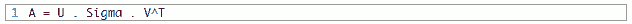

> 其中 A 是我们希望分解的 n×m 的实矩阵，U 是一个 m×m 矩阵，Sigma（通常用大写的希腊字母 ∑表示）是一个 m×n 的对角矩阵，V^T 是一个 n×n 矩阵的转置，其中 T 是上标。奇异值分解是线性代数的一个亮点。

——《Introduction to Linear Algebra》第五版，2016 年，第 371 页

> Sigma 矩阵中的对角值被称为原始矩阵 A 的奇异值。U 矩阵的列被称为 A 的左奇异向量，V 的列被称为 A 的右奇异向量。
> 
> SVD 是通过迭代式的数值方法计算的。我不会详细深入这些方法的细节。每一个矩形矩阵都有一个奇异值分解，尽管所得到的矩阵可能包含复数值以及浮点算术的局限性可能会导致某些矩阵无法简单利落地完成分解。
> 
> 奇异值分解（SVD）提供了另一种将矩阵分解成奇异向量和奇异值的方式。SVD 让我们可以发现某些与特征分解同种类型的信息。但是，SVD 有更广的适用性。

——《Deep Learning》，2016 年，第 44-45

> SVD 在矩阵求逆等其它矩阵运算的计算有广泛的应用，但也可用作机器学习中的数据归约方法。SVD 也可用在最小二乘线性回归、图像压缩和数据去噪中。
> 
> 奇异值分解（SVD）在统计学、机器学习和计算机科学领域有很多应用。将 SVD 应用于矩阵就像是使用 X 射线进行透视……

——《No Bullshit Guide To Linear Algebra》，2017 年，第 297 页

**计算奇异值分解**

SVD 可以通过调用 svd() 函数进行计算。

该函数在处理矩阵后会返回 U、Sigma 和 V^T 元素。Sigma 对角矩阵是按奇异值向量的形式返回的。V 矩阵是以转置后的形式返回的，比如 V.T.

下面的示例定义了一个 3×2 矩阵并计算了奇异值分解。

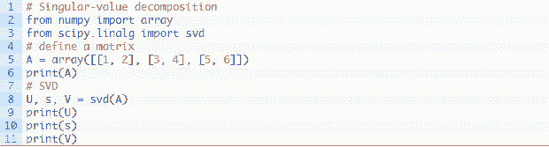

运行这个示例，首先会显示定义的 3×2 矩阵，然后会显示分解计算得到的 3×3 的 U 矩阵、2 个元素的 Sigma 向量和 2×3 的 V^T 矩阵元素。

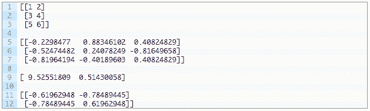

**根据 SVD 重建矩阵**

原始矩阵可以根据 U、Sigma 和 V^T 元素重建出来。

svd() 返回的 U、s 和 V 元素不能直接相乘。

s 向量必须使用 diag() 函数转换成对角矩阵。默认情况下，这个函数将创建一个相对于原来矩阵的 m×m 的方形矩阵。这是有问题的，因为该矩阵的尺寸并不符合矩阵乘法的规则，即一个矩阵的列数必须等于后一个矩阵的行数。

在创建了方形的 Sigma 对角矩阵之后，各个矩阵的大小与我们分解的原始 n×m 矩阵是相关的，如下：

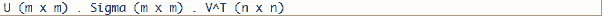

而事实上我们需要：

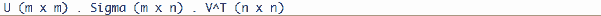

我们可以通过创建一个全是 0 值的 m×n 的新 Sigma 矩阵（比如：更多行）并使用通过 diag() 计算得到的方形对角矩阵来填充矩阵的前 n×n 部分。

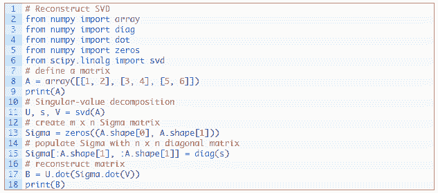

运行这个示例，首先会显示原始矩阵，然后会显示根据 SVD 元素重建的矩阵。

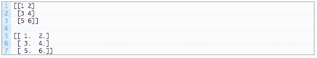

上面使用 Sigma 对角矩阵的复杂之处仅存在于 m 和 n 不相等的情况中。当重建一个方形矩阵时，其对角矩阵可以直接使用，如下。

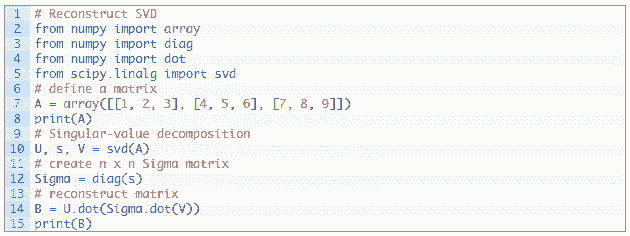

运行这个示例会显示原来的 3×3 矩阵和根据 SVD 元素直接重建的版本。

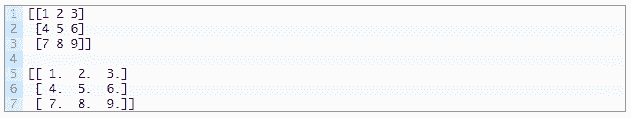

**用于伪逆的 SVD**

伪逆（pseudoinverse）是将方形矩阵的矩阵求逆泛化应用到行数和列数不相等的矩形矩阵上。这也被称为广义逆（Generalized Inverse）或摩尔-彭若斯逆（Moore-Penrose Inverse），得名于两位独立发现该方法的研究者。

> 矩阵求逆不是为非方形矩阵定义的。[...] 当 A 的列数大于行数时，那么使用伪逆求解线性方程是众多解决方案中的一种。

——《Deep Learning》，2016 年，第 46 页

伪逆表示为 A^+，其中 A 是被求逆的矩阵，+ 是上标。

伪逆是使用 A 的奇异值分解计算的：

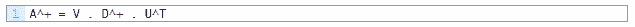

或者，没有点符号：

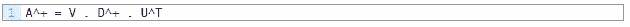

其中 A^+ 是 A 的伪逆，D^+ 是对角矩阵 Sigma 的伪逆，U^T 是 U 的转置。

我们可以根据 SVD 运算得到 U 和 V。

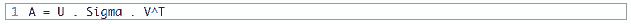

根据 Sigma 创建一个对角矩阵，计算 Sigma 中每个非零元素的倒数，然后如果原始矩阵是矩形的就取其转置，就可以计算得到 D^+。

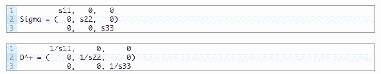

伪逆提供了一种求解线性回归方程的方法，尤其是当行数多于列数时，而这也是很常见的情况。

NumPy 提供了函数 pinv() 来计算矩形矩阵的伪逆。

下面的示例定义了一个 4×2 的矩阵并计算了其伪逆。

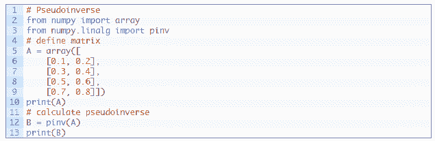

运行这个示例，首先显示定义的矩阵，然后显示计算出的伪逆。

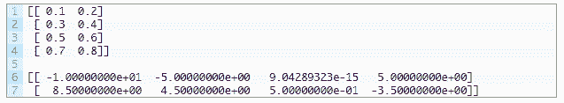

我们可以通过 SVD 采用人工的方式计算伪逆，并将结果与 pinv() 函数的结果进行比较。

首先我们必须计算 SVD。然后我们必须计算 s 数组中每个值的倒数。然后将这个 s 数组转换成一个对角矩阵，它额外增加了一行 0 以使其变成矩形形式。最后，我们可以根据这些元素计算伪逆。

具体实现方式为：

下面列出了完整的示例。

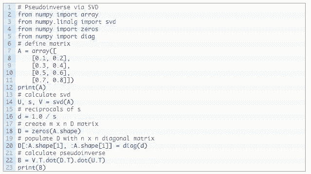

运行这个示例，首先显示定义的矩形矩阵，然后显示其伪逆，结果与上面 pinv() 函数的结果一致。

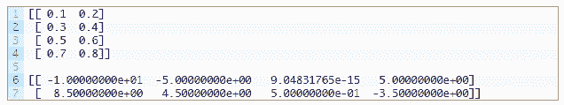

**用于降维的 SVD**

SVD 的一大常见应用是降维。

具有大量特征的数据（比如特征数（列数）多于观察数（行数））也许可以被归约成与所涉预测问题最相关的更小特征子集。

其结果是一个秩更低的矩阵，据说接近原始矩阵。

为了做到这一点，我们可以在原来的数据上执行一次 SVD 操作并选择 Sigma 中前 k 个最大的奇异值。这些列可以从 Sigma 中选择得到，行可以从 V^T 中选择得到。

然后可以重建原始向量 A 的近似 B。

在自然语言处理中，这种方法可以被用在文档中词出现情况或词频的矩阵上，并被称为隐含语义分析（Latent Semantic Analysis）或隐含语义索引（Latent Semantic Indexing）。

在实践中，我们可以保留和使用被称为 T 的描述性数据子集。这是矩阵的密集总结或投射。

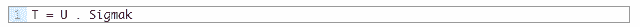

此外，这种变换既可以在原来的矩阵 A 上计算和应用，也可以在其它类似的矩阵上计算和应用。

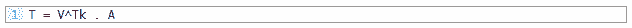

下面的示例是使用 SVD 的数据归约。

首先定义一个 3×10 的矩阵，其列数多于行数。然后计算 SVD 并且只选取其前两个特征。这些元素再重新结合起来，得到原始矩阵的准确再现。最后计算转换的方式有两种。

运行这个示例，首先显示定义的矩阵，然后是重建的近似矩阵，然后是原始矩阵的两个同样的变换结果。

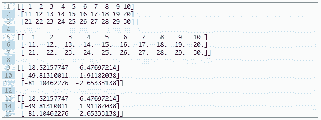

scikit-learn 提供了直接实现这种功能的 TruncatedSVD 类。

TruncatedSVD 的创建必须指定所需的特征数或所要选择的成分数，比如 2。一旦创建完成，你就可以通过调用 fit() 函数来拟合该变换（比如：计算 V^Tk），然后再通过调用 transform() 函数将其应用于原始矩阵。结果得到上面被称为 T 的 A 的变换。

下面的示例演示了 TruncatedSVD 类。

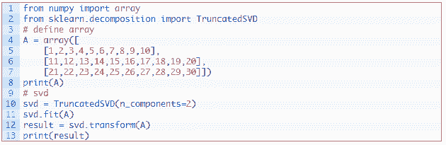

运行这个示例，首先显示定义的矩阵，然后是该矩阵变换后的版本。

可以看到，结果得到的值与上面人工计算的结果一致，但某些值的符号不一样。由于所涉及的计算的性质以及所用的基础库和方法的差异，可以预见在符号方面会存在一些不稳定性。只要对该变换进行训练以便复用，这种不稳定性在实践中应该不成问题。

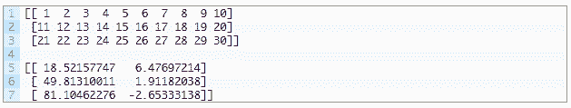

*原文链接：https://machinelearningmastery.com/singular-value-decomposition-for-machine-learning/*

****本文为机器之心编译，**转载请联系本公众号获得授权****。**

✄------------------------------------------------

**加入机器之心（全职记者/实习生）：hr@jiqizhixin.com**

**投稿或寻求报道：editor@jiqizhixin.com**

**广告&商务合作：bd@jiqizhixin.com**