# 入门 | 一文简述深度学习优化方法——梯度下降

选自 Paperspace

**作者****：Ayoosh Kathuria**

**机器之心编译**

**参与：**Nurhachu Null、淑婷****

> 本文是一篇关于深度学习优化方法——梯度下降的介绍性文章。作者通过长长的博文，简单介绍了梯度下降的概念、优势以及两大挑战。文中还配有大量生动形象的三维图像，有兴趣的亲了解一下？

从很大程度上来说，深度学习实际上是在解决大量烦人的优化问题。神经网络仅仅是一个非常复杂的函数，包含数百万个参数，这些参数代表的是一个问题的数学解答。以图像分类为例，AlexNet 就是一个数学函数，它以代表图像 RGB 值的数组为输入，生成一组分类得分的输出。

实质上，通过训练神经网络，我们是在最小化一个损失函数。这个损失函数的值衡量了我们网络的性能在给定数据集上离完美还差多少。

**损失函数**

简单起见，假设我们的网络只有两个参数。实际上，这个数量是在十亿左右，但是我们在这篇文章中会坚持使用两个参数的例子，以便我们在做一些可视化的尝试时不会把自己逼疯。一个很棒的损失函数的轮廓可能是这样的。

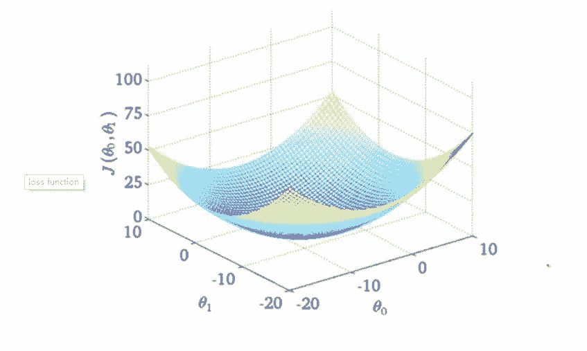

**损失函数的轮廓**

为何我说这是一个很棒的损失函数？因为拥有这种轮廓的损失函数就像圣诞老人一样，是不存在的。然而，它仍然是一个不错的教学工具，有助于全面了解关于梯度下降的一些最重要的想法。那么，我们从这里开始吧。

x 轴和 y 轴分别代表两个权值，z 轴代表在给定两个特定权值的情况下损失函数的值。我们的目标就是找到损失最小的特定权值，这个点被称作损失函数的最小值点。

你一开始就随机初始化了权值，所以你的神经网络可能会表现得像喝醉了的你一样，把猫的图片归类为人。这样的情况对应的是损失函数轮廓中的 A 点，此处的网络性能十分差，因此损失也很高。

我们需要寻找一种能够导航到「谷底」B 点处的方法，这里的损失函数值最小。那么我们要怎么做呢？

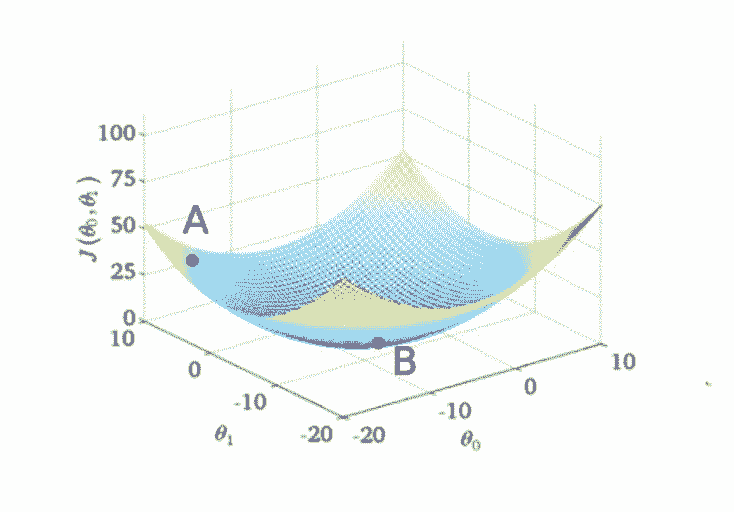

**梯度下降**

初始化权值的时候，我们处于损失函数图形中的 A 点。首先要做的就是查看 x-y 平面中所有可能的方向，看看哪个方向是损失函数的值下降最陡峭的方向。这个就是我们必须移动的方向，它恰恰与梯度的方向相反。梯度是高维导数的另一种说法，它给出了最陡峭的上升方向。

要想理解这个概念，请看下图。在曲面的任何一点，我们都能够定义一个与其相切的平面。在更高维度，我们总能够定义一个超平面，但在这里我们还是坚持使用 3 维空间。然后，在这个平面上有无限个方向。其中，准确来说只有一个使函数上升最快的方向，这个方向由梯度给出，与之相反的方向就是下降最快的方向。这就是算法名称的来源，我们沿着梯度的方向进行下降，所以就叫做梯度下降。

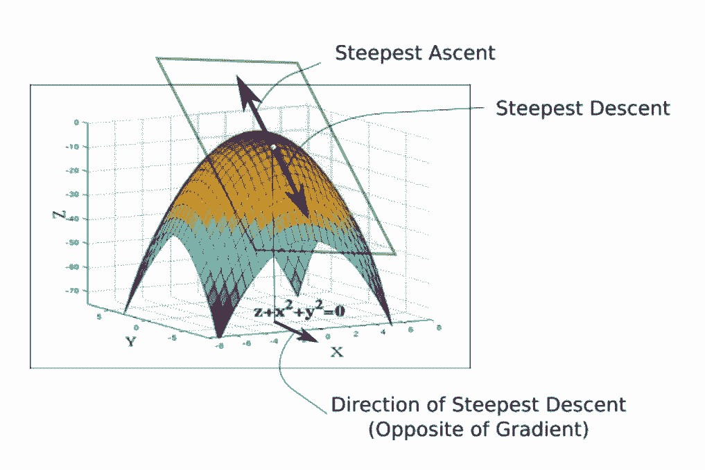

现在，既然已经有了前进方向，我们必须决定需要采取步子的大小，而控制下降步幅大小的参数即学习率。为了保证降到最小值，我们必须谨慎地选择学习率。

如果移动得太快，我们可能越过最小值，沿着「山谷」的山脊蹦蹦跳跳，永远都不可能到达最小值。如果移动太慢，训练可能花费太长的时间，根本就不可行，此外太慢的学习率也容易让算法陷入极小值，我们会在本文后面的部分讨论。

一旦有了梯度和学习率，我们就开始行动，然后在最终到达的任何位置重新计算梯度，然后重复这个过程。

梯度的方向告诉我们哪个方向上升的最快，它的幅值则表示最陡峭的上升/下降有多陡。所以，在最小值的地方，曲面轮廓几乎是平坦的，我们期望得到几乎为零的梯度。事实上，最小值点的梯度就是 0。

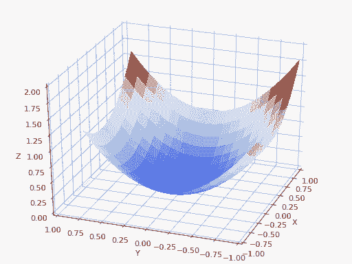

*梯度下降过程*

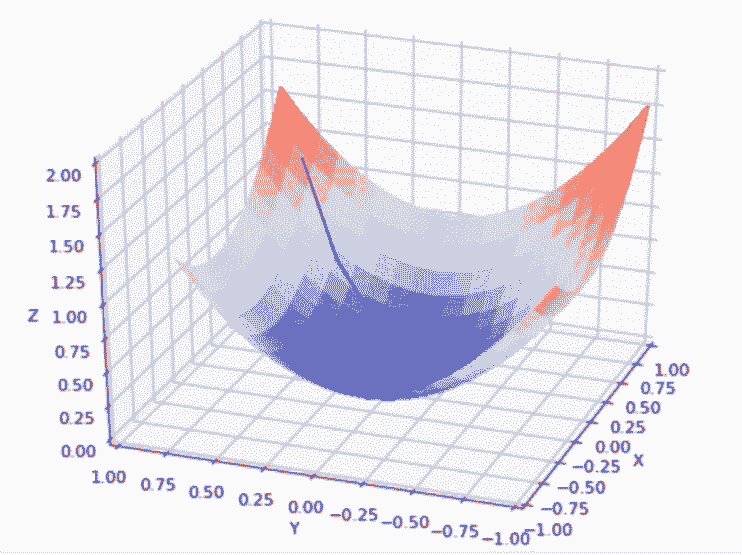*使用太大的学习率*

在实践中，我们可能永远无法精确地达到最小值，但是我们能够在最小值附近的平坦区域震荡。当我们在这个区域震荡时，损失值几乎是我们能够达到的最小值，并且不会有很大的变化，因为我们是在真实的最小值附近跳动。通常，当损失值在预定的数字内没有提升的时候我们会停止迭代，例如 10 次或者 20 次迭代。当这种情况发生时，我们就说训练已经收敛了，或者说收敛已经实现了。

**常见的错误**

让我稍微偏离主题一会。如果搜索梯度下降的可视化图，你很可能会看到一个起于一个点、终于最小值点的轨迹，就像前文动画所展示的一样。然而，这个关于梯度下降的描述并不准确。我们得到的轨迹完全局限在 x-y 平面内，这个平面包含权重。

正如上面的动画所描述的，梯度下降并不涉及在 z 轴方向上的移动。因为仅由 x 轴和 y 轴方向描述的权重是自由参数。实际得到的轨迹是定义在 x-y 平面中的，如下图所示：

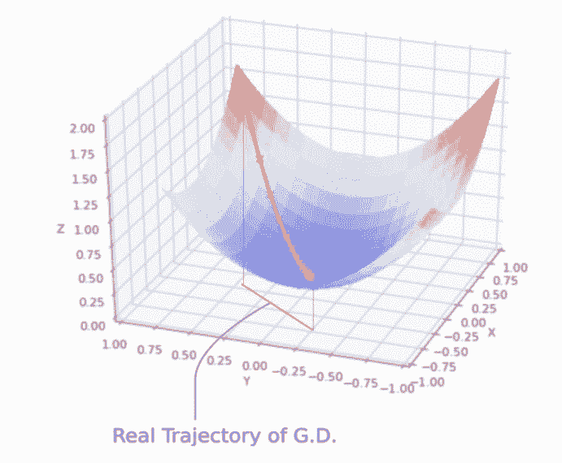

*实际的梯度下降轨迹*

x-y 平面中的每一个点代表着一个唯一的权重组合，而我们希望有一组由最小值描述的权重。

**基本方程**

描述梯度下降更新规则的基本方程是：

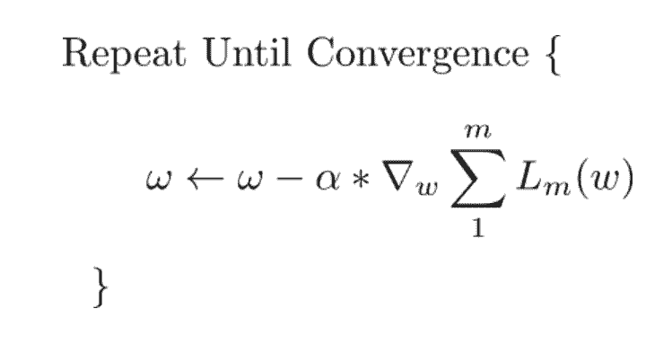

每一次迭代中都执行更新。此处，w 是权重向量，它位于 x-y 平面。我们从这个向量中减去学习率α乘上损失函数相对于权重的梯度。梯度是一个向量，它给出了损失函数上升最快的方向。下降最快的方向恰好和梯度方向相反，这就是为什么要从权重向量中减去梯度向量的原因。

如果想象向量对你来说有一些难度，那么，几乎同样的更新规则同时适用于网络的每一个权重。唯一的变化是，我们现在对每个权重单独执行更新，上述方程中的梯度被替换为梯度向量沿着特定权重方向的投影。

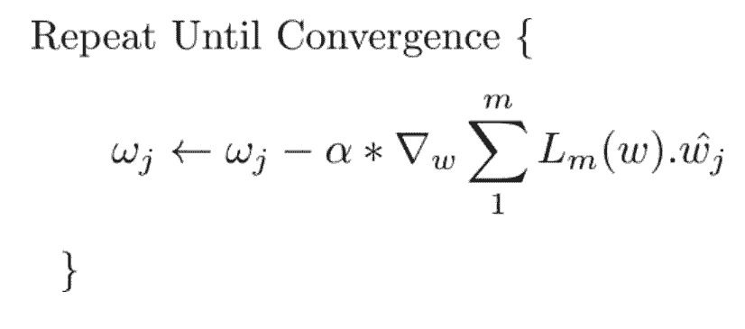

对所有的权重同时执行更新。

在做减法之前，我们用学习率与梯度向量相乘。这是我们之前讨论过的步骤。要知道，即使我们保持学习率不变，步长也会因为梯度大小，即损失函数轮廓的陡峭性变化而变化。随着我们接近最小值点，梯度会接近于 0，我们会以越来越小的步长接近最小值点。

理论上而言，这样很好，因为我们希望当接近一个最小值的时候算法能够采取更小的步长。步长太大有可能导致跳过最小值，并且在最小值脊梁之间来回跳动。

梯度下降中常用的一个技术是采用可变的学习率，而不是固定的学习率。初始时，我们可以使用较大的学习率。但是到了后来，随着接近最小值点，我们需要慢下来。实现这种策略的一种方法就是模拟退火，也就是衰减的学习率。在这种情况下，学习率在股东能够数量的迭代次数中逐渐减小。

**梯度下降挑战之一：局部极小值**

到目前为止，梯度下降的故事听起来真的很美好。现在，我来揭开它的面纱。还记得我之前说过有种损失函数很好，而这种损失函数是不存在的这句话吗？它们确实是不存在的。

首先，神经网络是复杂的函数，我们在假设的函数中引入了大量的非线性变换。得到的损失函数看起来并不太好，同样只有一个我们可以收敛到的最小值点。事实上，这种理想的损失函数被称作「凸函数」（总是向上弯曲的函数），而深度网络的损失函数很难是凸的。实际上，它们很可能是这样的：

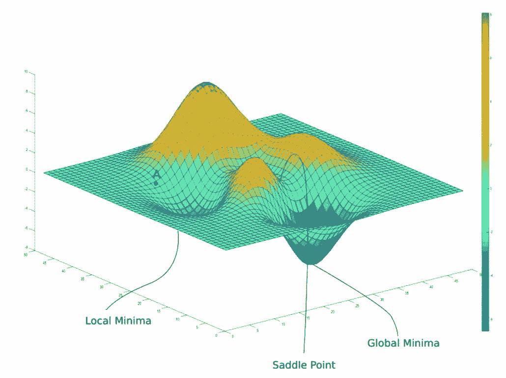

在上图中，存在梯度为 0 的局部极小值点。然而，我们想要达到的全局最小值点，却是无法实现的。现在，如果你将权值初始化在 A 点，那么你将会收敛到局部极小值点，而且，一旦你收敛到这个极小值点，梯度下降将没法使你离开这里。

梯度下降是由梯度驱动的，它在任何一个极小值点都会为 0。局部极小值之所以被称作局部极小值，是因为损失函数在该点的值在局部区域是最小的。而全局最小值被称作全局最小值，是因为在损失函数在该点的值在整个区域最小。

更糟糕的是，由于我们考虑的那个 3 维损失函数轮廓在实际中是从没有发生过的，损失函数的轮廓可能更加复杂。在实践中，我们的神经网络大约会有 10 亿个权重，给我们一个大约（10 亿+1）维的函数。

事实上，很难想象一个如此多维度的函数是什么样子的。然而，深度学习领域如今人才济济，人们已经想出了以 3D 的形式可视化损失函数轮廓的方法。最近的一篇论文提出了一种名为「Filter Normalization」的技术，该项技术解释了超出本文范围的内容。然而，它确实让我们看到了我们所处理的损失函数的潜在复杂性。例如，下图是 VGG-56 在 CIFAR-10 数据集上构建的损失函数的 3D 架构。

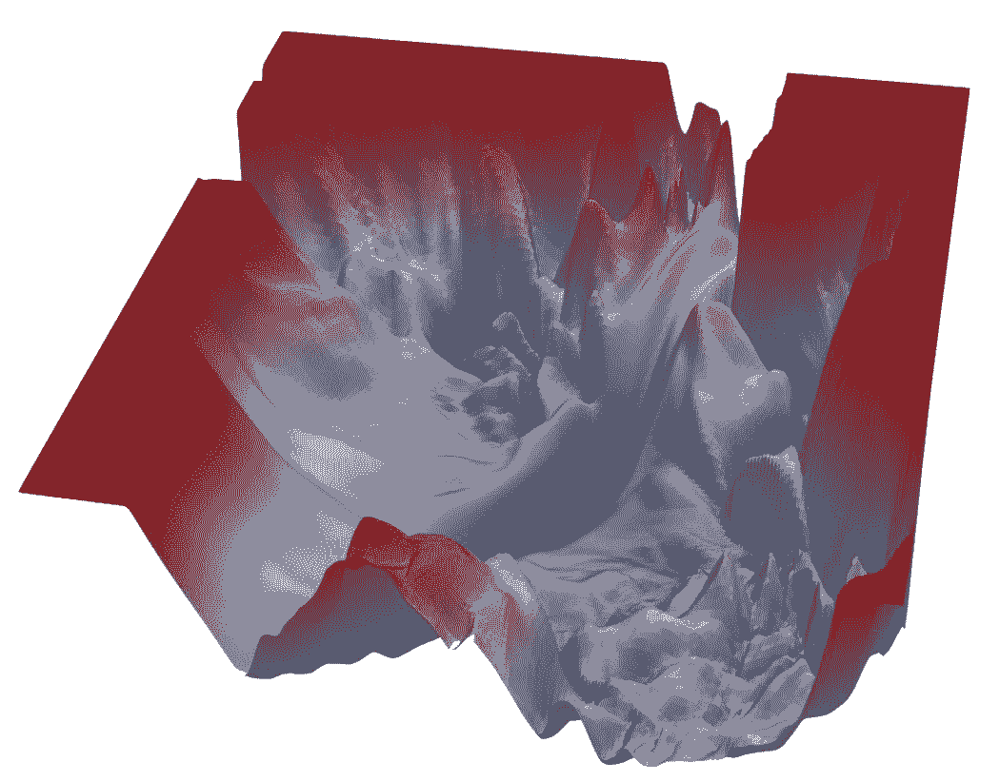

*一个复杂的损失函数图像（图源：https://www.cs.umd.edu/~tomg/projects/landscapes/）*

正如你所看到的，到处都是局部极小值点。

**梯度下降挑战之二：鞍点**

关于梯度下降的局限性，我们得到的基本教训是：一旦到达梯度为 0 的区域，不管极小值点的质量如何，它都几乎无法逃离。我们面临的另一种问题是鞍点，它们的形状如下：

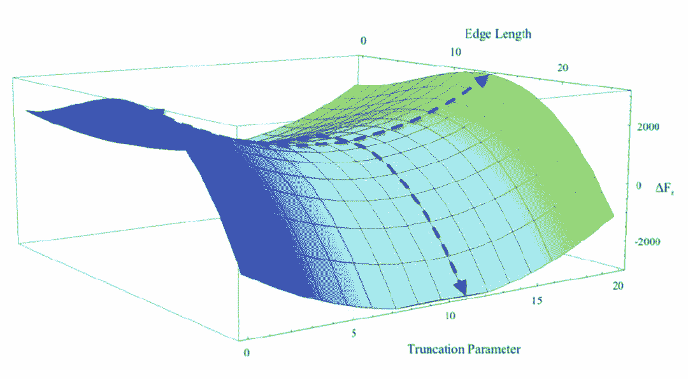

*鞍点*

你也可以在之前的图片中看到两座山峰相遇时候的鞍点。

鞍点得名于它的形状类似于马鞍。尽管它在 x 方向上是一个最小值点，但是它在另一个方向上是局部最大值点，并且，如果它沿着 x 方向变得更平坦的话，梯度下降会在 x 轴振荡并且不能继续根据 y 轴下降，这就会给我们一种已经收敛到最小值点的错觉。

**随机性的解救**

那么，我们如何在尝试收敛到全局最优值的同时摆脱局部极小值和鞍点呢？答案是使用随机梯度下降。

到目前为止，我们一直使用通过对训练集上的所有可能样本的损失值求和得到的损失函数进行梯度下降。如果我们进入局部极小值或者鞍点，我们就会被困住。帮助梯度下降摆脱这些困境的一种方法就是随机梯度下降。

在随机梯度下降中，我们不是通过对所有损失函数求和来计算损失函数的梯度，而是通过计算仅仅一个随机抽样（不替换）例子的损失梯度来采取步骤。随机梯度下降中的每个样本都是随机选择的，相比之下，早期方法在一个批量中处理所有的样本，因此称为批量梯度下降。

**更新规则也做了相应的改变。**

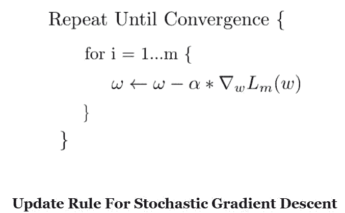

这意味着，我们每一步采用的损失函数都不同于实际的损失函数（它是每一个样本的损失函数的和）。这种「一个样本损失函数」在某一特定点的梯度实际上可能指向与「所有样本损失函数」的梯度略有不同的方向。

也就是说，尽管「所有样本损失函数」的梯度可能把我们推向一个局部极小值，或者使我们困在一个鞍点，但是这种「一个样本损失函数」的梯度可能指向一个不同的方向，并有可能帮助我们避开这些情况。

「所有样本损失函数」的一个局部最小值点也应该考虑在内。如果我们采用批量梯度下降，那么我们会被困在这里，因为这里的梯度始终会指向局部最小值点。但是，如果我们使用随机梯度下降，这个点可能不在「一个样本损失函数」轮廓的局部最小值周围，这使得我们远离局部最小值点。

即使我们陷在「一个样本损失函数」的局部最小值点，下一个随机采样点的「一个样本损失函数」的损失情况也可能不同，从而使我们能够继续移动。

当它收敛的时候，它会收敛到几乎所有「一个样本损失函数」的最小值。也有经验显示，鞍点是极不稳定的，轻轻一推就可以摆脱。

所以，这是否意味着在实践中应该使用这种一个样本的随机梯度下降呢？

**批大小**

答案是否定的。尽管从理论上而言，随机梯度下降可能给我们带来最好的结果，但是从计算角度而言，它并不是一个非常可行的选择。当我们使用由所有单个损失函数相加得到的函数进行梯度下降时，所有单个损失函数的梯度可以并行计算，而使用随机梯度下降的时候，梯度的计算必须一个一个的顺序进行。

因此，我们所做的是一个平衡的行为。我们使用固定数量（例如 16、32 或者 128 个）的样本形成一个 mini-batch 来构建损失函数，而不是使用整个数据集或者单个样本。这个词与一次处理所有样本形成了对比，它通常被称作批梯度下降。选择 mini-batch 的大小是为了保证我们有足够的随机性摆脱局部最小值，同时可以利用足够的并行计算力。

**重新审视局部极小值：它们并没有你想象的那么糟糕**

不要急着反对局部极小值，最近的研究表明局部最小值并不一定就是坏的。在神经网络的损失情况下，最小值实在太多了，好的局部极小值可能和全局最小值一样好。

我为什么说好？是因为你仍可能陷入由不稳定的训练样本导致的局部极小值中。好的局部极小值，或者文献中提到的最优局部极小值，在给定神经网络的高维损失函数中也可能是大量存在的。

你可能还会注意到，很多神经网络都在执行分类任务。如果一个局部极小值对应着 0.7—0.8 的正确标签分数，而全局最小值能够产生 0.95-0.98 的正确标签分数，那么两者输出的预测标签结果将是相同的。

最小值的一个理想属性是它应该在平坦的一面。为什么？因为平坦的最小值很容易收敛到，而且越过最小值或者在最小值的脊梁之间跳跃的可能性更小。

更重要的是，我们期望测试集的损失曲面与我们训练的训练集的损失曲面略有不同。对处于平坦又较宽处的极小值，由于这种变化，损失不会有太大变化，但处于相对较窄处的极小值不是这样。我们要指出的一点是，更平坦处的最小值能够更好地泛化，因此是可取的。

**重新审视学习率**

近来，针对损失函数中的次优最小值，关于学习率调度的研究激增。即使学习率下降，也有可能陷入局部极小值。传统上，要么在固定次数的迭代之后训练完成，要么在损失值没有改善的情况下，固定次数的迭代（比如 10 次）之后训练停止。这种情况在文献中被称为早停。

使用较快的学习率也有助于我们在训练中更早地跳过一些局部极小值。

人们也把早停和学习率衰减结合起来，在迭代 10 次后损失函数没有改善的情况下学习率开始衰减，最终在学习率低于某个确定的阈值时停止。

近年来，循环学习率变得流行起来，在循环学习率中，学习率是缓慢增加的，然后缓慢减小，以一种循环的形式持续着。

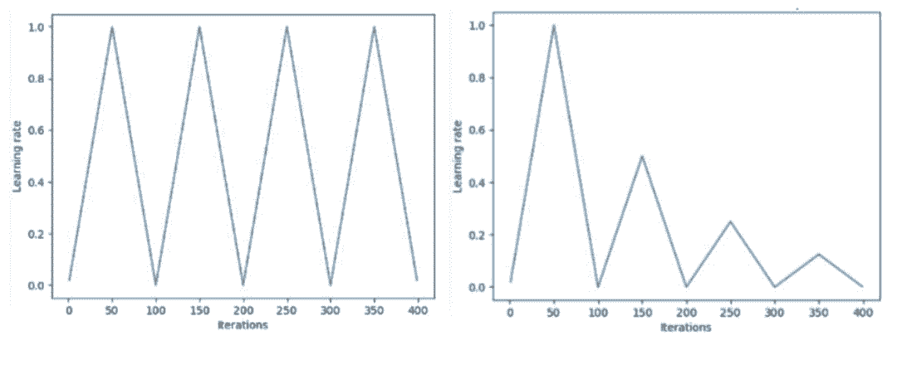

*Leslie N. Smith 提出的 Triangular 和 Triangular2 循环学习率方法。左侧的最大学习率和最小学习率保持不变。右侧的区别在于每个周期之后学习率减半。图源：Hafidz Zulkifli*

所谓暖重启的随机梯度下降，基本上是将学习率退火到一个下限，然后将学习率恢复到初始值。

对于学习率如何下降，我们也有不同的计划，例如，从指数衰减到余弦衰减。

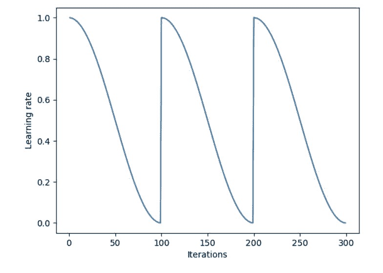

*余弦退火与重启相结合*

最近的一篇论文介绍了一种叫做「随机加权平均」的技术。作者提出了一种方法，首先收敛到最小值，缓存权重，然后将学习率恢复到更高的值。然后，这种更高的学习率将算法从最小值推到损失面中的随机点。然后使算法再次收敛到另一个最小值。重复几次，最后，他们对所有缓存权重集的预测进行平均，以产生最终预测。

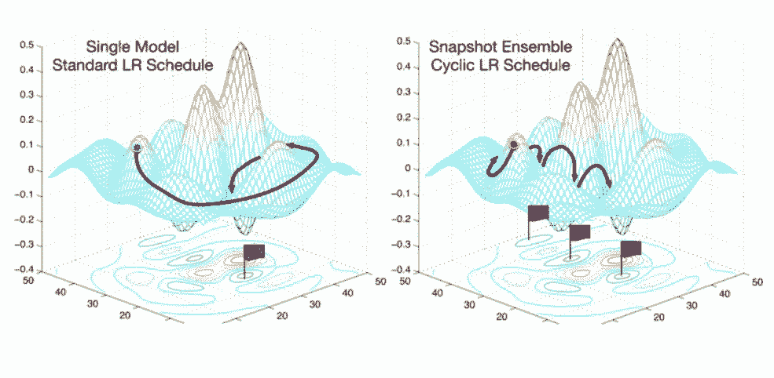

*随机加权平均技术*

**结论**

所以，这是梯度下降的介绍性文章，这是深度学习优化工作的驱动力，因为关于反向训练的开创性论文显示，可以通过计算梯度来训练神经网络。然而，关于梯度下降还有一个我们在这篇文章中没有谈到的缺失部分，那就是解决 pathological curvature 的问题。对经典随机梯度下降的扩展，如动量、RMSProp 和 Adam，被用来克服这个关键问题。

然而，我觉得我们所做的一切，对一篇文章来说已经足够了，其余的将会由另一篇文章解决。**

*原文链接：https://blog.paperspace.com/intro-to-optimization-in-deep-learning-gradient-descent/*

****本文为机器之心编译，**转载请联系本公众号获得授权****。**

✄------------------------------------------------

**加入机器之心（全职记者 / 实习生）：hr@jiqizhixin.com**

**投稿或寻求报道：**content**@jiqizhixin.com**

**广告 & 商务合作：bd@jiqizhixin.com**