# 入门 | 什么是自注意力机制？

选自 Medium

**作者：KION KIM**

**机器之心编译**

**参与：****Geek AI、刘晓坤**

> 注意力机制模仿了生物观察行为的内部过程，即一种将内部经验和外部感觉对齐从而增加部分区域的观察精细度的机制。注意力机制可以快速提取稀疏数据的重要特征，因而被广泛用于自然语言处理任务，特别是机器翻译。而自注意力机制是注意力机制的改进，其减少了对外部信息的依赖，更擅长捕捉数据或特征的内部相关性。本文通过文本情感分析的案例，解释了自注意力机制如何应用于稀疏文本的单词对表征加权，并有效提高模型效率。

目前有许多句子表征的方法。本文作者之前的博文中已经讨论了 5 中不同的基于单词表征的句子表征方法。想要了解更多这方面的内容，你可以访问以下链接：https://kionkim.github.io/（尽管其中大多数资料是韩文）

**句子表征**

在文本分类问题中，仅仅对句子中的词嵌入求平均的做法就能取得良好的效果。而文本分类实际上是一个相对容易和简单的任务，它不需要从语义的角度理解句子的意义，只需要对单词进行计数就足够了。例如，对情感分析来说，算法需要对与积极或消极情绪有重要关系的单词进行计数，而不用关心其位置和具体意义为何。当然，这样的算法应该学习到单词本身的情感。

**循环神经网络**

为了更好地理解句子，我们应该更加关注单词的顺序。为了做到这一点，循环神经网络可以从一系列具有以下的隐藏状态的输入单词（token）中抽取出相关信息。

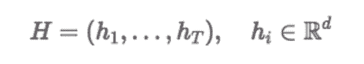

当我们使用这些信息时，我们通常只使用最后一个时间步的隐藏状态。然而，想要从仅仅存储在一个小规模向量中的句子表达出所有的信息并不是一件容易的事情。

**卷积神经网络**

借鉴于 n-gram 技术的思路，卷积神经网络（CNN）可以围绕我们感兴趣的单词归纳局部信息。为此，我们可以应用如下图所示的一维卷积。当然，下面仅仅给出了一个例子，我们也可以尝试其它不同的架构。

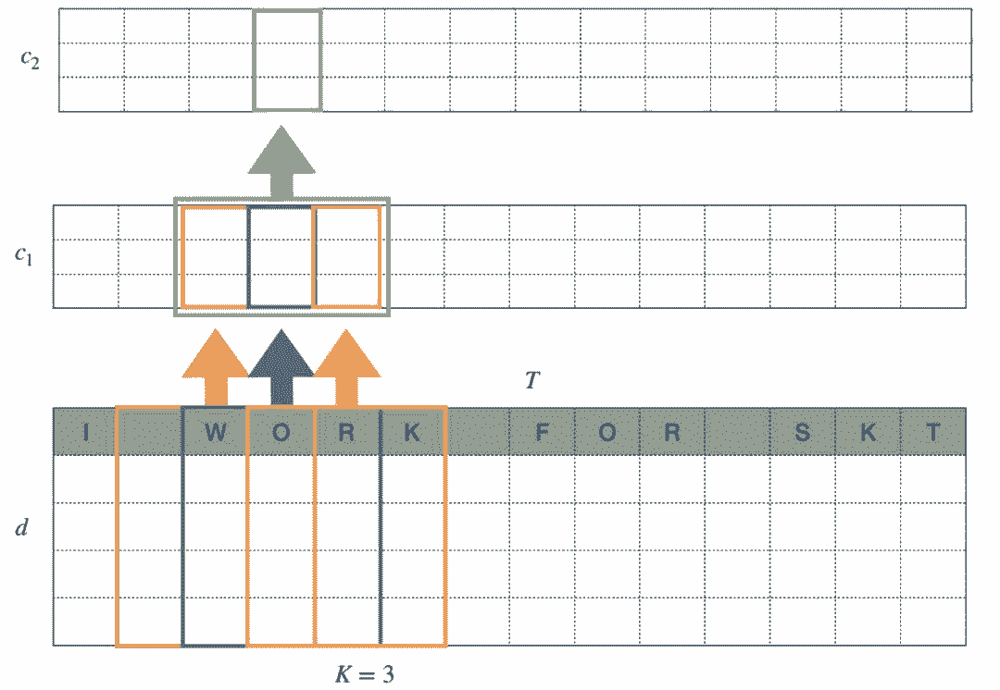

大小为 3 的一维卷积核扫描我们想要归纳信息的位置周围的单词。为此，我们必须使用大小为 1 的填充值（padding），从而使过滤后的长度保持与原始长度 T 相同。除此之外，输出通道的数量是 c_1。

接着，我们将另一个过滤器应用于特征图，最终将输入的规模转化为 c_2*T。这一系列的过程实在模仿人类阅读句子的方式，首先理解 3 个单词的含义，然后将它们综合考虑来理解更高层次的概念。作为一种衍生技术，我们可以利用在深度学习框架中实现的优化好的卷积神经网络算法来达到更快的运算速度。

**关系网络**

单词对可能会为我们提供关于句子的更清楚的信息。实际情况中，某个单词往往可能会根据其不同的用法而拥有不同的含义。例如，「I like」中的单词「like」（喜欢）和它在「like this」（像... 一样）中的含义是不同的。如果我们将「I」和「like」一同考虑，而不是将「like」和「this」放在一起考虑，我们可以更加清楚地领会到句子的感情。这绝对是一种积极的信号。Skip gram 是一种从单词对中检索信息的技术，它并不要求单词对中的单词紧紧相邻。正如单词「skip」所暗示的那样，它允许这些单词之间有间隔。

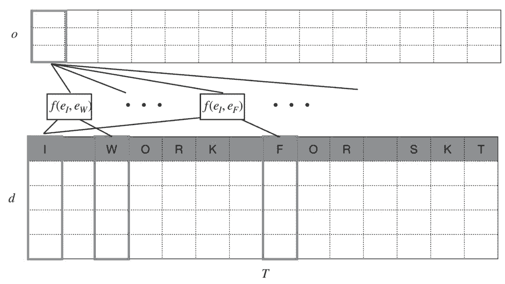

正如你在上图中所看到的，一对单词被输入到函数 f(⋅) 中，从而提取出它们之间的关系。对于某个特定的位置 t，有 T-1 对单词被归纳，而我们通过求和或平均或任意其它相关的技术对句子进行表征。当我们具体实现这个算法时，我们会对包括当前单词本身的 T 对单词进行这样的计算。

**需要一种折衷方法**

我们可以将这三种不同的方法写作同一个下面的通用形式：

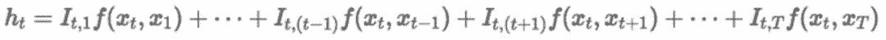

当所有的 I_{t,⋅} 为 1 时，通用形式说明任何「skip bigram」对于模型的贡献是均匀的。

对于 RNN 来说，我们忽略单词 x_t 之后的所有信息，因此上述方程可以化简为：

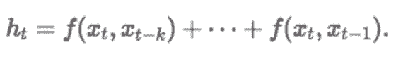

对于双向 RNN 来说，我们可以考虑从 x_T 到 x_t 的后向关系。

另一方面，CNN 只围绕我们感兴趣的单词浏览信息，如果我们只关心单词 x_t 前后的 k 个单词，通用的公式可以被重新排列为：

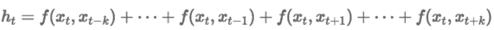

尽管关系网络可能过于庞大，以至于我们不能考虑所有单词对关系。而 CNN 的规模又太小了，我们不能仅仅考虑它们之间的局部关系。所以，我们需要在这两个极端之间找到一种折衷的方式，这就是所谓的注意力机制。

**自注意力机制**

上文提到的通用形式可以被重新改写为下面更加灵活的形式：

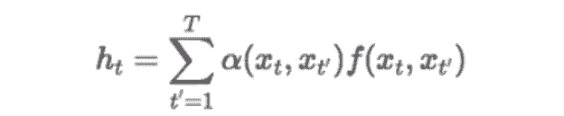

在这里，α(⋅,⋅) 控制了每个单词组合可能产生的影响。例如，在句子「I like you like this」中，两个单词「I」和「you」可能对于确定句子的情感没有帮助。然而，「I」和「like」的组合使我们对这句话的情感有了一个清晰的认识。在这种情况下，我们给予前一种组合的注意力很少，而给予后一种组合的注意力很多。通过引入权重向量 α(⋅,⋅)，我们可以让算法调整单词组合的重要程度。

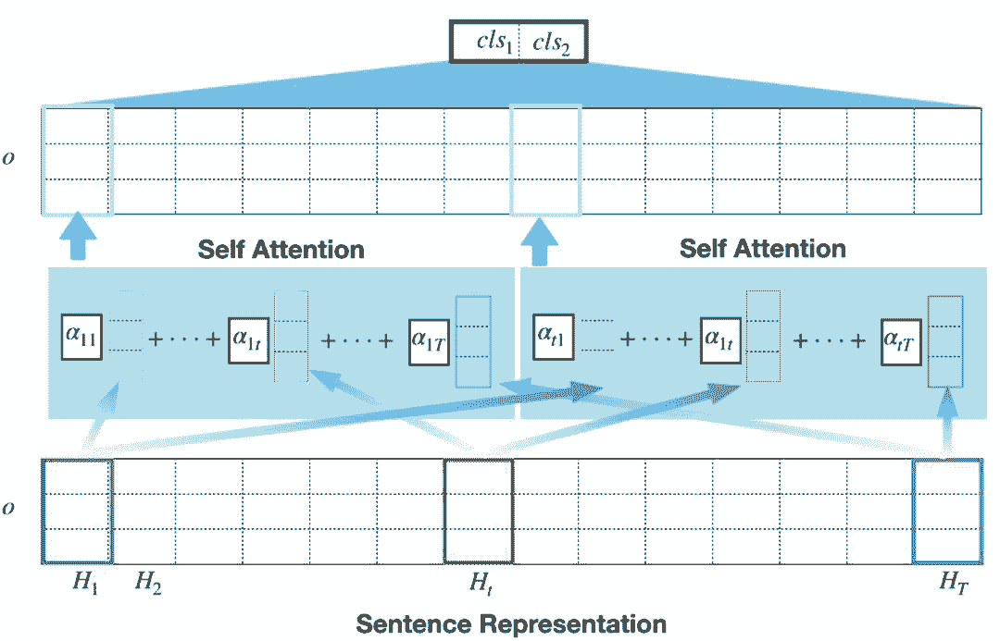

假设第 i 个句子中的 T 个单词被嵌入到了 H_{i1},…,H_{iT} 中，每个词嵌入都会被赋予一个权重 α_{it}，它代表了将单词归纳到一个统一的表征中时的相对重要性。

我们在这里想要拥有的最终结果是每个输入句子的权重矩阵。如果我们把 10 个句子输入到网络中，我们会得到 10 个如下所示的注意力矩阵。

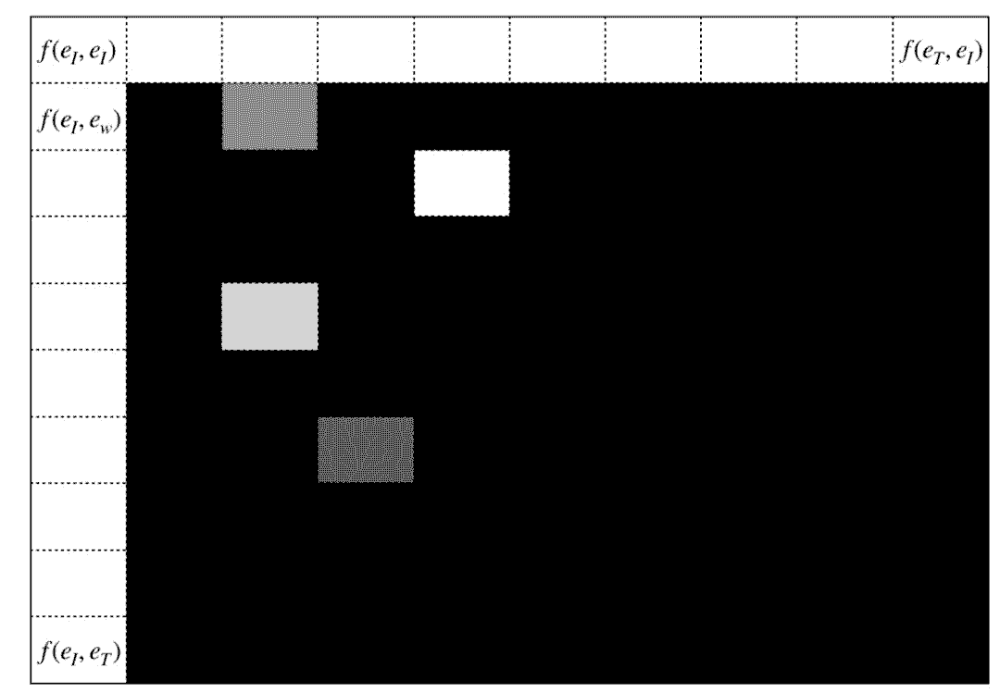

**自注意力机制的实现**

自注意力机制在论文「A structured Self-Attentive Sentence Embedding」中被首次提出，此文作者将自注意力机制应用于双向 LSTM 的隐层，模型结构如下图所示：

论文地址：https://arxiv.org/pdf/1703.03130.pdf

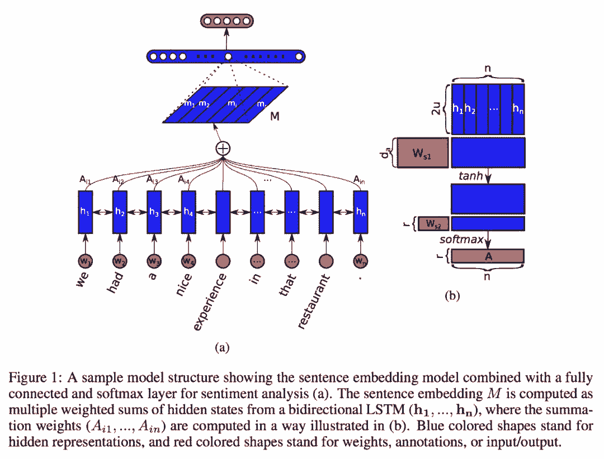

然而，我们并不一定要用 LSTM 来做单词表征（并不一定是单词表征，我的意思是句子表征之前的阶段），我们将把自注意力机制应用到基于关系网络的单词表征中。

与原论文中的自注意力机制不同（如上图所示，数学上的细节可以在我的上一篇博文中找到），关系网络的注意力机制可以被定义为：

参见：https://kionkim.github.io/_posts/2018-07-12-sentiment_analysis_self_attention.md

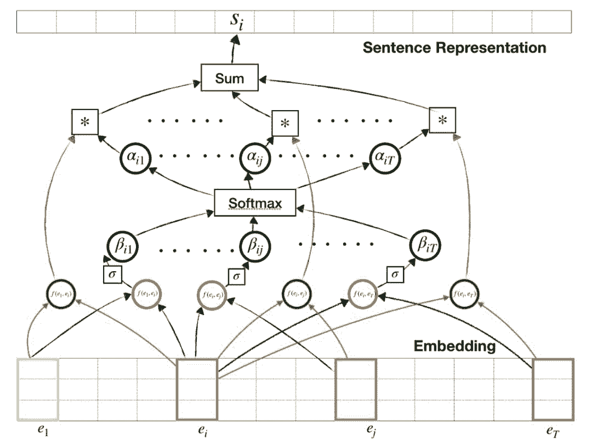

为了解释上面的图标，不妨假设我们想要得到第 i 个单词的表征。对于包含第 i 个单词的单词组合，会生成两个输出：一个用于特征提取（绿色圆圈），另一个用于注意力加权（红色圆圈）。这两个输出可能共享同一个网络，但在本文中，我们为每个输出使用单独的网络。在得到最后的注意力权重之前，注意力（红色圆圈）的输出通过需要经过 sigmoid 和 softmax 层的运算。这些注意力权重会与提取出的特征相乘，以得到我们感兴趣的单词的表征。

**用 Gluon 实现 自注意力机制**

在具体实现部分，我们假设网络结构十分简单，有两个相连的全连接层用于关系提取，有一个全连接层用于注意力机制。紧跟着是两个相连的全连接层用于分类。在这里，关系提取和注意力提取会用到下面的代码片段：

```py
class Sentence_Representation(nn.Block):
    def __init__(self, **kwargs):
        super(Sentence_Representation, self).__init__()
        for (k, v) in kwargs.items():
            setattr(self, k, v)

        with self.name_scope():
            self.embed = nn.Embedding(self.vocab_size, self.emb_dim)
            self.g_fc1 = nn.Dense(self.hidden_dim,activation='relu')
            self.g_fc2 = nn.Dense(self.hidden_dim,activation='relu')
            self.attn = nn.Dense(1, activation = 'tanh')

    def forward(self, x):
        embeds = self.embed(x) # batch * time step * embedding
        x_i = embeds.expand_dims(1)
        x_i = nd.repeat(x_i,repeats= self.sentence_length, axis=1) # batch * time step * time step * embedding
        x_j = embeds.expand_dims(2)
        x_j = nd.repeat(x_j,repeats= self.sentence_length, axis=2) # batch * time step * time step * embedding
        x_full = nd.concat(x_i,x_j,dim=3) # batch * time step * time step * (2 * embedding)
        # New input data
        _x = x_full.reshape((-1, 2 * self.emb_dim))

        # Network for attention
        _attn = self.attn(_x)
        _att = _attn.reshape((-1, self.sentence_length, self.sentence_length))
        _att = nd.sigmoid(_att)
        att = nd.softmax(_att, axis = 1)

        _x = self.g_fc1(_x) # (batch * time step * time step) * hidden_dim
        _x = self.g_fc2(_x) # (batch * time step * time step) * hidden_dim
        # add all (sentence_length*sentence_length) sized result to produce sentence representation

        x_g = _x.reshape((-1, self.sentence_length, self.sentence_length, self.hidden_dim))

        _inflated_att = _att.expand_dims(axis = -1)
        _inflated_att = nd.repeat(_inflated_att, repeats = self.hidden_dim, axis = 3)

        x_q = nd.multiply(_inflated_att, x_g)

        sentence_rep = nd.mean(x_q.reshape(shape = (-1, self.sentence_length **2, self.hidden_dim)), axis= 1)
        return sentence_rep, att 
```

我们将为特征提取和注意力机制运用独立的网络。最终得到的注意力向量的规模为 T*1，提取出的特征向量的规模为 T*d，其中 d 为超参数。为了将二者相乘，我们只需要将注意力向量扩展到与提取出的特征向量的规模相匹配。我们在这里提供的只是一个小例子，其它的实现可能会更好。

完整的实现代码可以从以下链接获得：http://210.121.159.217:9090/kionkim/stat-analysis/blob/master/nlp_models/notebooks/text_classification_RN_SA_umich.ipynb。

**结果**

下面是 9 个随机选择的注意力矩阵：

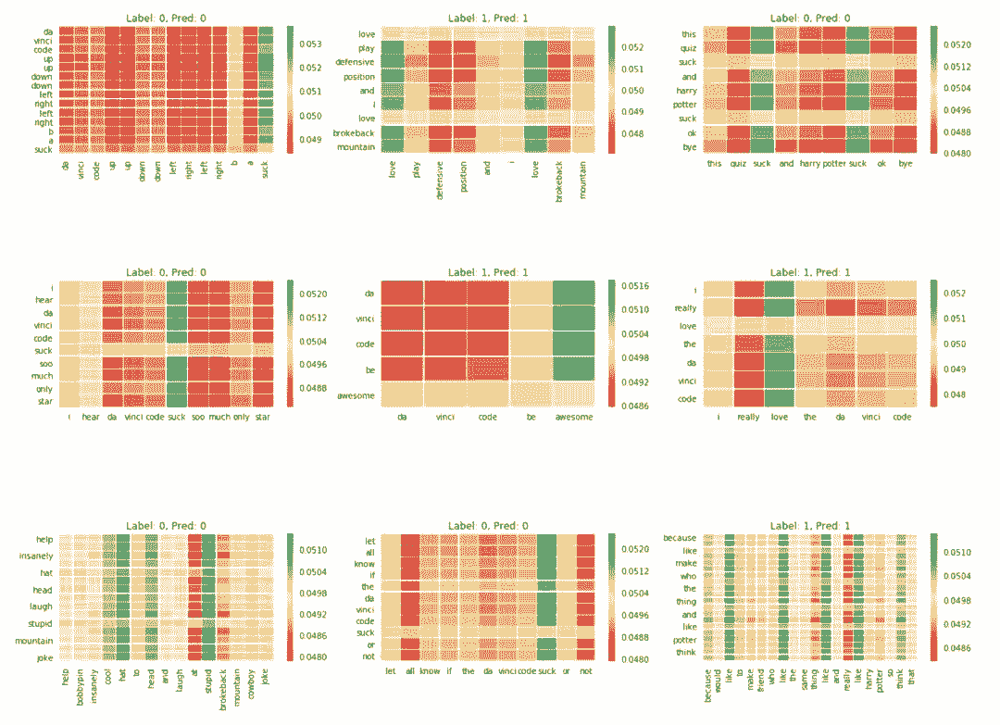

当对文本进行分类时，我们可以知道算法将把注意力放在那些单词上。正如预期的那样，在分类过程中，「love」、「awesome」、「stupid」、「suck」这样表达情感的单词受到了重点关注。

* 参考链接：https://medium.com/@kion.kim/self-attention-a-clever-compromise-4d61c28b8235*

****本文为机器之心编译，**转载请联系本公众号获得授权****。**

✄------------------------------------------------

**加入机器之心（全职记者 / 实习生）：hr@jiqizhixin.com**

**投稿或寻求报道：**content**@jiqizhixin.com**

**广告 & 商务合作：bd@jiqizhixin.com**