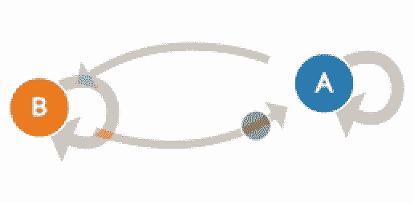
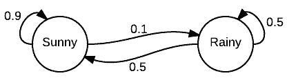
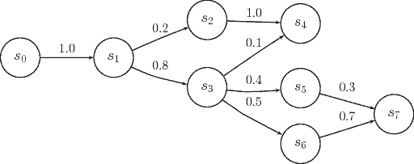
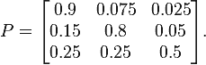
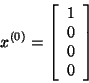

# 入门 | 今天是雾霾，明天是什么？马尔可夫链告诉你

选自 towardsdatascience

**作者：****Devin Soni**

**机器之心编译**

**参与：Nurhachu Null、刘晓坤**

> 什么是马尔可夫链？什么时候应该使用它们？它们是如何运作的？

马尔可夫链是一个相当常见、相当简单的对随机过程进行统计建模的方式。它们被应用在很多领域，从文本生成到金融建模。一个比较流行的例子是 SubredditSimulator，它使用马尔可夫链自动创建整个 subreddit 的内容。总之，马尔可夫链在概念上是非常直观，并且易于理解的，不使用任何高级的统计或者数学概念就可以实现。马尔可夫链是入门概率建模和数据科学技术的很好的开端。

**简介**

首先，我们用一个很常见的例子来描述它们：

> 试想有两种可能的天气状态：晴天或者阴天。你总是可以直接地观察当前的天气状态，而且保证是之前提及的两者之一。现在，你决定预测明天的天气。假设在这个过程中有一个潜在的转移，因为当前的天气会对第二天的天气状态有所影响。因此，作为一个敬业的人，你收集了几年的天气数据，然后计算得到阴天之后出现晴天的概率是 0.25。你还注意到，广泛地讲，阴天之后发生阴天的概率是 0.75，因为只有两种可能的天气状态。你现在可以利用这个分布，根据当地目前的天气状态去预测未来几天的天气。

这个例子描述了马尔可夫链的很多关键概念。马尔可夫链本质上是由一系列满足马尔可夫性质的转移组成，这些转换服从某种概率分布。

我们来观察一下在这个例子中，如何仅仅通过观察从当天到第二天的转换就得到概率分布。这其实说的就是马尔可夫性，即马尔可夫过程独有的让状态转移没有记忆的性质。这通常使它们无法成功地生成会出现某些期望潜在趋势的序列。例如，马尔可夫链可能根据词频来模仿一个作者的写作风格，但是它无法生成包含深层含义的文本或者蕴含某种主题意义的文本，因为这些文本都是基于更长的文本序列开发的。因此，它们缺乏生成语境相关内容的能力，因为它们无法考虑到之前的整条状态链。

*天气预测例子的可视化*

**模型**

形式上，马尔可夫链是一个概率自动机。状态转移的概率分布通常表示为马尔可夫链的转移矩阵。如果马尔可夫链有 N 个可能的状态，那么这个转移矩阵就是 N*x*N 的矩阵，使得元素 (I, J) 代表从状态 I 转移到状态 J 的概率。此外，状态转移矩阵必须是随机矩阵，它的每一行元素之和必须是 1。这完全是能够讲得通的，因为每一行代表它自己的概率分布。

*马尔可夫链的一般视图，圆圈代表状态，边代表转移。*

*具有三个可能状态的状态转移矩阵。*

此外，马尔可夫链也会有一个初始状态向量，由一个 N x 1 的向量表示，用这个向量来描述从 N 个状态中的某个状态开始的概率分布。初始向量中的元素 I 代表该马尔可夫链从 I 状态开始的概率。

*具有四个可能状态的初始向量。*

这两个实体通常就是用来描述一个马尔可夫链所需的全部内容了。

我们知道如何获得从一个状态转移到另一个状态的可能性，但是如何知道经过多个步骤后发生转移的概率呢？为了将这个也形式化，我们现在要定义在 M 个步骤中从状态 I 转移到状态 J 的概率。事实证明，这是很容易的。给定一个状态转移矩阵 P，这可以通过计算矩阵 P 的 M 次幂中的元素 (I, J) 来决定。然而，对于 M 值比较大的情况，如果您对简单的线性代数比较熟悉，更有效的方法是先将矩阵对角化，然后再计算它的 M 次幂。

**结论**

既然你已经了解了马尔可夫链的基本知识，现在就应该能够用你选择的语言轻松地实现它们。如果你不擅长编程，还有许多更高级的马尔可夫链和马尔可夫过程的属性可以深入研究。在我看来，马尔可夫链沿着理论路线的自然发展将是隐马尔可夫过程或 MCMC（马尔可夫链蒙特卡罗）。简单的马尔可夫链是其他更复杂的建模技术的基本组成，因此，掌握了这些知识，你现在可以去尝试更多这种主题的技术，例如信念建模和采样。

*原文链接：https://towardsdatascience.com/introduction-to-markov-chains-50da3645a50d*

****本文为机器之心编译，**转载请联系本公众号获得授权****。**

✄------------------------------------------------

**加入机器之心（全职记者/实习生）：hr@jiqizhixin.com**

**投稿或寻求报道：editor@jiqizhixin.com**

**广告&商务合作：bd@jiqizhixin.com**