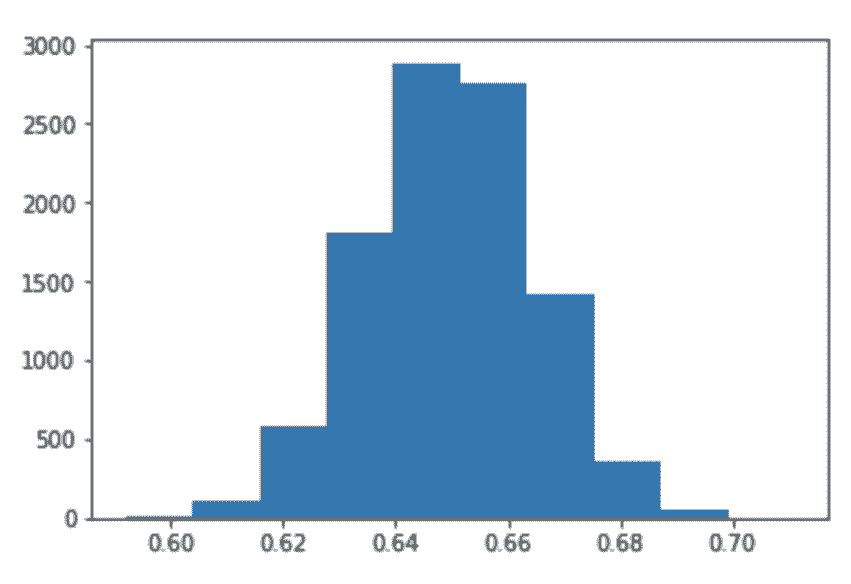
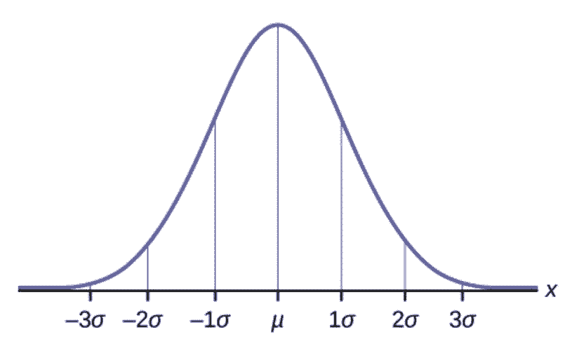
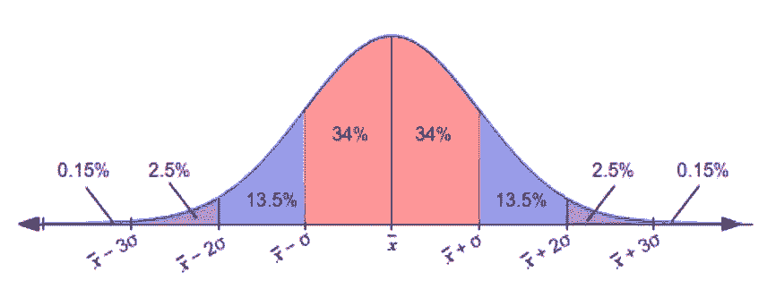
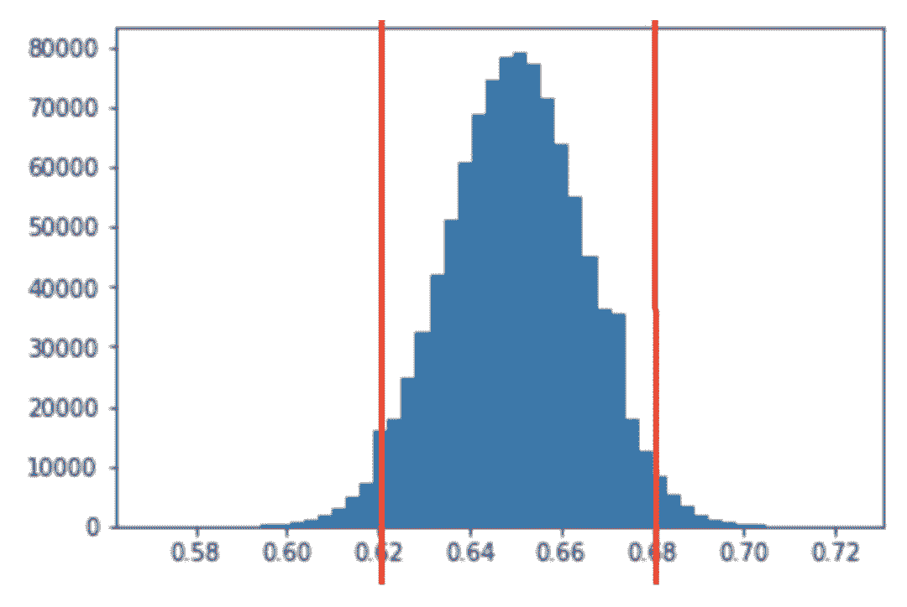

# 入门 | 我们常听说的置信区间与置信度到底是什么？

选自 TowardsDataScienceR

**作者：****Dima Shulga**

**机器之心编译**

**参与：程耀彤、思源**

> 机器学习本质上是对条件概率或概率分布的估计，而这样的估计到底有多少是置信度？这里就涉及到统计学里面的置信区间与置信度，本文简要介绍了置信区间这一核心概念，它有助于我们从直观上理解评价估计优劣的度量方法。

本文讨论了统计学中的一个基本术语 ：置信区间。我们仅以一种非常友好的方式讨论一般概念，没有太多花哨的统计术语，同时还会使用 Python 完成简单的实现！尽管这个术语是非常基础的，但我们有时很难完全理解置信区间到底是什么，为什么我们需要它。

假设你想知道美国有多少人热爱足球。为了得到 100％ 正确的答案，你可以做的唯一一件事是向美国的每一位公民询问他们是否热爱足球。根据维基百科，美国有超过 3.25 亿的人口。与 3.25 亿人谈话并不现实，因此我们必须通过问更少的人来得到答案。

我们可以通过在美国随机抽取一些人（与更少人交谈）并获得热爱足球的人的百分比来做到这一点，但是我们不能 100％ 确信这个数字是正确的，或者这个数字离真正的答案有多远。所以，我们试图实现的是获得一个区间，例如，对这个问题的一个可能的答案是：「我 95％ 相信在美国足球爱好者的比例是 58％ 至 62％」。这就是置信区间名字的来源，我们有一个区间，并且我们对它此一定的信心。

非常重要的是我们的样本是随机的，我们不能只从我们居住的城市中选择 1000 人，因为这样就不能很好地代表整个美国。另一个不好的例子是，我们不能给这 1000 个随机用户发 Facebook 消息，这样我们就会得到美国 Facebook 用户的喜爱趋势，因为并不是所有的美国公民都使用 Facebook。

因此，假设我们随机抽取了 1000 个美国人的样本，我们发现，在 1000 人中有 63% 的人喜欢足球，我们能假设（推断）出整个美国人口的情况吗？

为了回答这个问题，我希望我们以一个不同的方式来看待它。假设我们知道（理论上）美国人的确切比例，假设它是 65％，那么随机挑选 1000 人只有 63％ 的人喜欢足球的机会是多少？让我们用 Python 来探索这个问题！

```py
love_soccer_prop = 0.65  # Real percentage of people who love soccer
total_population = 325*10**6  # Total population in the U.S. (325M)
num_people_love_soccer = int(total_population * love_soccer_prop)
num_people_dont_love_soccer = int(total_population * (1 - love_soccer_prop))
people_love_soccer = np.ones(num_of_people_who_love_soccer)
people_dont_love_soccer = np.zeros(num_
people_dont_love_soccer)
all_people = np.hstack([people_love_soccer, people_dont_love_soccer])
print np.mean(all_people)
# Output = 0.65000000000000002
```

在这段代码中，我创建了一个表示 3.25 亿人的 NumPy 数组，对于每个人，如果他/她喜欢足球，那么我会存储 1，否则就是零。我们可以通过计算它的平均值来得到数组中的百分比，实际上它是 65％。

现在，让我们取几组容量为 1000 个样本的试验，看看得到的百分比是多少：

```py
for i in range(10):
    sample = np.random.choice(all_people, size=1000)
    print 'Sample', i, ':', np.mean(sample)
# Output:
Sample 0 : 0.641
Sample 1 : 0.647
Sample 2 : 0.661
Sample 3 : 0.642
Sample 4 : 0.652
Sample 5 : 0.647
Sample 6 : 0.671
Sample 7 : 0.629
Sample 8 : 0.648
Sample 9 : 0.627
```

对于每组样本，我们获得了不同的值，但直觉（和统计理论）表示，大量样本的平均值应该非常接近真实百分比。让我们这样试试！我们取很多样本，然后看看会发生什么：

```py
values = []
for i in range(10000):
    sample = np.random.choice(all_people, size=1000)
    mean = np.mean(sample)
    values.append(mean)
print np.mean(values)
# Output = 0.64982259999999992
```

我们创建了 10K 个样本，检查了每个样本中热爱足球的人的百分比，然后取平均值，我们得到了 64.98％，这非常接近于实际值 65％。让我们画出我们得到的所有值：



这里你看到的是我们得到的所有样本值的直方图，这个直方图的一个很好的性质是它和正态分布非常相似。正如我所说的，我不想在这里使用太多的统计术语，但假设如果我们这样做了很多次（无限次），我们将得到一个非常接近正态分布的直方图，我们可以知道该分布的参数。用更简单的话来说，我们会知道这个直方图的形状，所以我们可以精确地知道在任意数值范围内有多少个样本。

下面是一个例子，我们会多次运行这个模拟（试图达到无穷大）：


首先，我们可以看到直方图的中心（平均值）接近 65％，正如我们所预期的，但我们可以通过查看直方图来得到更多信息，例如，我们可以说，一半样本都大于 65％，或者我们可以说大约 25％ 的样本大于 67％，甚至可以说（大致）只有 2.5％ 的样本大于 68％。

在这一点上，很多人可能会问两个重要的问题：「我怎样才能取得无数的样本？」和「它对我有什么帮助？」。

让我们回到我们的例子，我们抽取了 1000 人的样本，得到了 63％，我们想知道，随机抽样的 1000 人中有 63％ 的足球爱好者的概率是多少。使用这个直方图，我们可以说有（大概）25％的概率，我们会得到一个小于或等于 63％ 的值。该理论告诉我们，我们实际上并不需要得到无限的样本，如果我们随机选择 1000 人，只有 63％ 的人喜欢足球是可能发生的。

实际上，为了找到不同数值范围或区间的概率，我们需要知道或至少估计总体分布的标准差。因为我们想把事情变得简单一点，因此现在先不讨论它。

让我们回到现实和真正的问题，我不知道美国足球爱好者的实际比例，我只抽取了一个样本，得到了 63％，这对我有什么帮助？

所以，我们不知道在美国热爱足球的人的实际比例。我们所知道的是，如果我们从总体分布取无数个样本，它将如下所示：



这里 μ 是总体分布的平均值（我们例子中足球爱好者的实际百分比），σ 是总体分布的标准差。

如果我们知道这一点（并且我们知道标准差），我们可以说约 64％ 的样本会落在红色区域，或者 95％ 以上的样品会落在图中的绿色区域之外：



如果我们在之前假设的实际百分比 65％ 上使用该图，那么 95％ 以上的样本将在 62％ 和 68％ 之间（+ - 3）。



当然，距离是对称的，所以如果样本有 95% 落在在实际百分比 -3 和 +3 之间，那么真实百分比落在样本百分比 -3 和 +3 之间的概率为 95％。

如果我们抽取一个样本，得到了 63％，那么我们可以说我们 95％ 确信实际比例在 60％（63-3）和 66％（63 + 3）之间。

这就是置信区间，区间为 63 + -3，置信度为 95％。

我希望大家现在对置信区间有更好的理解，但这个介绍忽略了一些重要的技术性的部分。有很多文章包含了这些部分，因此读者可继续阅读相关的材料加强理解。

原文链接：https://towardsdatascience.com/a-very-friendly-introduction-to-confidence-intervals-9add126e714

****本文为机器之心编译，**转载请联系本公众号获得授权****。**

✄------------------------------------------------

**加入机器之心（全职记者/实习生）：hr@jiqizhixin.com**

**投稿或寻求报道：editor@jiqizhixin.com**

**广告&商务合作：bd@jiqizhixin.com**