# 入门 | 机器学习模型的衡量不止准确率：还有精度和召回率

选自 Medium

**作者：William Koehrsen**

**机器之心编译**

**参与：Nurhachu Null、刘晓坤**

> 我们倾向于使用准确率，是因为熟悉它的定义，而不是因为它是评估模型的最佳工具！精度（查准率）和召回率（查全率）等指标对衡量机器学习的模型性能是非常基本的，特别是在不平衡分布数据集的案例中，在周志华教授的「西瓜书」中就特别详细地介绍了这些概念。

GitHub 地址：https://github.com/WillKoehrsen/Data-Analysis/blob/master/recall_precision/recall_precision_example.ipynb

**为分类任务选择正确的衡量指标**

倘若某人声称创建了一个能够识别登上飞机的恐怖分子的模型，并且准确率（accuracy）高达 99%。你相信吗？好了，有这么一个模型：将从美国机场起飞的所有乘客简单地标注为非恐怖分子。已知美国全年平均有 8 亿人次的乘客，并且在 2000-2017 年间共发现了 19 名恐怖分子，这个模型达到了接近完美的准确率——99.9999999%。这听起来确实令人印象深刻，但是我怀疑美国国土安全局不会在近期购买这个模型。尽管这个模型拥有接近完美的准确率，但是在这个问题中准确率显然不是一个合适的度量指标。

恐怖分子检测是一个不平衡的分类问题：我们需要鉴别的类别有两个——恐怖分子和非恐怖分子，其中一个类别代表了极大多数的数据点。另一个不平衡分类问题出现在当疾病在公众中的发病率很低时的疾病监测。在这两种情况下，正例类别——疾病或恐怖分子，远远少于负例类别的数量。这种问题是数据科学中比较常见的例子，其中准确率并不是评估模型性能的很好的衡量标准。

直观地说，我们知道在恐怖分子检测的问题中宣布所有的数据点为负例（非恐怖分子）是毫无裨益的，相反，我们应该聚焦于正例（恐怖分子）的识别。直觉告诉我们，我们应该最大化的是统计学上称为召回率或查全率（recall）的衡量指标，或者是最大化模型找到数据集中所有相关案例的能力。召回率的准确定义是：真正例除以（真正例+假反例）的和，如下图所示。真正例（true positives）是被真确分类的正例数据点，假反例（false negatives）是被错误分类的负例数据点。在恐怖分子检测的例子中，TP 是被正确识别的恐怖分子，FN 是模型误分类为非恐怖分子的恐怖分子的数据点。召回率可以被理解为模型找到数据集中所有感兴趣的数据点的能力。

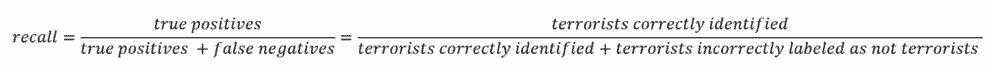

你可能注意到了这个等式中的一些细节：如果我们将所有的个体都预测为恐怖分子，那么模型的召回率就是 1.0！这样我们就得到了一个完美的模型吗？当然，不是！与数据科学中的绝大多数概念一样，在我们想要最大化的指标之间存在一个权衡。在召回率的例子中，当召回率增大的时候，精度就会减小。同样，直觉告诉我们，一个将 100% 的乘客标记为恐怖分子的模型可能是不可用的，因为我们必须禁止每一个乘客的飞行。统计学为我们提供了表达直觉的词汇：这个新的模型是低精度（precision）的，或者说较低的仅识别相关数据点的能力。

精度被定义为真正例除以（真正例+假正例）的和，如下图所示。假正例（FP）指的是模型将实际上是反例的样本误判为正例的情况，或者说，在我们的例子中指的是那些被模型判断为恐怖分子，而实际上不是恐怖分子的个体。召回率（查全率）表达的是模型找到数据集中相关实例的能力，而精度（查准率）表达模型找到的数据点中实际相关的比例。

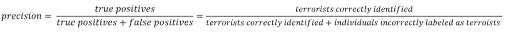

现在我们可以看到，第一个模型给所有的个体标上了非恐怖分子的标签，这个模型是不能使用的。尽管它有着近乎完美的准确率，但是它的精度和召回率都是零，因为没有 TP（真正例）！假设我们轻微地修改一下模型，然后将一个个体正确地识别为恐怖分子。现在，精度是 1（没有假正例，FP），但是召回率很低，因为实际上会有很多假反例（FN）。假设我们走到了另一个极端，将所有的乘客标记为恐怖分子，召回率就会是 1——我们将抓住每一个恐怖分子，但是精度会特别低，我们最终会拘留很多无辜的人。换言之，随着精度的增加，召回率会降低，反之亦然。

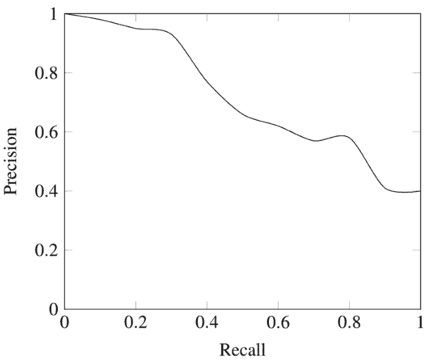

*精度—召回率权衡*

**结合精度和召回率**

在某些情况中，我们也许需要以牺牲另一个指标为代价来最大化精度或者召回率。例如，在之前的例子中，在对患者进行随访检查的初步疾病筛查中，我们可能希望得到接近于 1 的召回率—我们想找到所有实际患病的患者。如果随访检查的代价不是很高，我们可以接受较低的精度。然而，如果我们想要找到精度和召回率的最佳组合，我们可以使用 F1 score 来对两者进行结合。

F1 score 是对精度和召回率的调和平均：

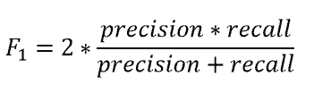

我们使用调和平均而不是简单的算术平均的原因是：调和平均可以惩罚极端情况。一个具有 1.0 的精度，而召回率为 0 的分类器，这两个指标的算术平均是 0.5，但是 F1 score 会是 0。F1 score 给了精度和召回率相同的权重，它是通用 Fβ指标的一个特殊情况，在 Fβ中，β 可以用来给召回率和精度更多或者更少的权重。(还有其他方式可以结合精度和召回率，例如二者的几何平均，但是 F1 score 是最常用的。) 如果我们想创建一个具有最佳的精度—召回率平衡的模型，那么就要尝试将 F1 score 最大化。

**可视化精度和召回率**

我已经向你抛出了几个新术语，接下来我将通过一个例子向你展示它们在实际中是如何使用的。在使用之前，我们要简单地谈一谈精度和召回率的概念。

首先要介绍一下混淆矩阵（confusion matrix），给定一个模型的预测标签时，它可以被用来快速计算精度和召回率。二分类的混淆矩阵总共包含四个不同的结果：真正例（TP）、假正例（FP）、真反例（TN），以及假反例（FN）。列表示真实值，行表示预测值。行和列的交叉点指的就是这四种结果。例如，如果我们将一个数据点预测为正例，但是它实际上是反例，那么这就是一个假正例。

用混淆矩阵计算精度和召回率需要找到矩阵中对应的值，并应用以下的等式进行计算。

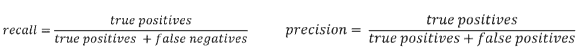

其他的用来展示分类模型性能的可视化技术是受试者特征曲线（ROC 曲线，Receiver Operating Characteristic curve）。别被这个复杂的名词吓到！这个思想是相当简单的：ROC 曲线展示了当改变在模型中识别为正例的阈值时，召回率和精度的关系会如何变化。如果我们有一个用来识别疾病的模型，我们的模型可能会为每一种疾病输出介于 0 到 1 之间的一个分数，为了将某个病人标记为患有某种疾病（一个正例标签），我们为每种疾病在这个范围内设置一个阈值，通过改变这个阈值，我们可以尝试实现合适的精度和召回率之间的平衡。

ROC 曲线在 Y 轴上画出了真正例率（TPR），在 X 轴上画出了假正例率 (FPR)。TPR 是召回率，FPR 是反例被报告为正例的概率。这两者都可以通过混淆矩阵计算得到。

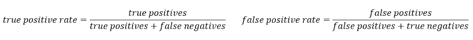

下图是一个典型的 ROC 曲线：

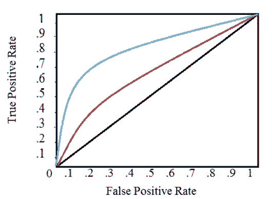

黑色对角线表示随机分类器，红色和蓝色曲线表示两种不同的分类模型。对于给定的模型，只能对应一条曲线。但是我们可以通过调整对正例进行分类的阈值来沿着曲线移动。通常，当降低阈值时，会沿着曲线向右和向上移动。

在阈值为 1.0 的情况下，我们将位于图的左下方，因为没有将任何数据点识别为正例，这导致没有真正例，也没有假正例（TPR = FPR = 0）。当降低阈值时，我们将更多的数据点识别为正例，导致更多的真正例，但也有更多的假正例 ( TPR 和 FPR 增加)。最终，在阈值 0.0 处，我们将所有数据点识别为正，并发现位于 ROC 曲线的右上角 ( TPR = FPR = 1.0 )。

最后，我们可以通过计算曲线下面积 ( AUC ) 来量化模型的 ROC 曲线，这是一个介于 0 和 1 之间的度量，数值越大，表示分类性能越好。在上图中，蓝色曲线的 AUC 将大于红色曲线的 AUC，这意味着蓝色模型在实现准确度和召回率的权衡方面更好。随机分类器 (黑线) 实现 0.5 的 AUC。

**回顾**

我们已经介绍了几个判断模型性能的属性，每个属性的定义都不是很复杂，但是结合在一起就有点复杂了。让我们通过一个例子做一个快速的回顾来巩固一下这些思想。

对于二分类问题：

*   真正例（TP）：实际上是正例的数据点被标记为正例

*   假正例（FP）：实际上是反例的数据点被标记为正例

*   真反例（TN）：实际上是反例的数据点被标记为反例

*   假反例（FN）：实际上是正例的数据点被标记为反例

召回率和精度衡量指标：

*   召回率（R）：分类模型识别所有相关实例的能力

*   精度（P）：分类模型仅仅返回相关实例的能力

*   F1 score：使用调和平均结合召回率和精度的指标

召回率和精度的可视化：

*   混淆矩阵：展示分类模型的真实和预测标签的对应结果。

*   受试者特征曲线（ROC 曲线）：画出真正例率（TPR）和假正例率（FPR），并将此作为模型归类正例阈值的函数。

*   曲线下面积（AUC）：基于 ROC 曲线下方的面积，计算分类模型总体性能的指标。

**实例应用**

我们的任务是为 100 名病人诊断一种在普通人群中患病率是 50% 的疾病。我们将假设一个黑盒模型，我们输入关于患者的信息，并得到 0 到 1 之间的分数。我们可以改变将患者标记为正例 (有疾病) 的阈值，以最大化分类器性能。我们将以 0.1 为增量从 0.0 到 1.0 评估阈值，在每个步骤中计算 ROC 曲线上的精度、召回率、F1 score 以及在 ROC 曲线上的位置。以下是每个阈值的分类结果：

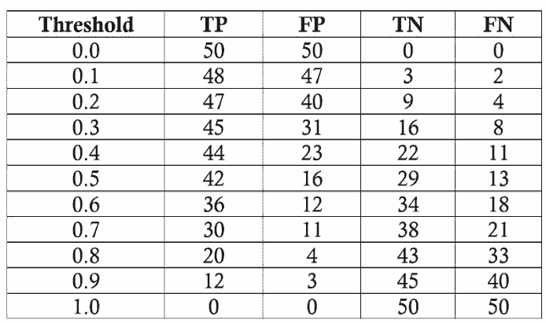

*模型在每个阈值下的结果*

我们将以阈值为 0.5 为例计算对应的召回率、精度、真正例率、假正例率。首先我们得到混淆矩阵：

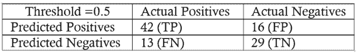

阈值为 0.5 时的混淆矩阵

我们可以利用混淆矩阵中的数值来计算召回率、精度和 F1 score：

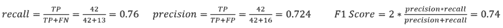

然后计算真正例率和假正例率来确定阈值为 0.5 时，模型在 ROC 曲线上对应的点。

为了得到整个 ROC 曲线，我们在每个阈值下都进行这个过程。你可能会想，这是相当乏味的，所以，我们用 python 语言来代替手工计算。用来做这些计算的 Juoyter Notebook 放在了 github 上，每个人都可以看到。最终的 ROC 曲线如下所示，点上面的数字是阈值。

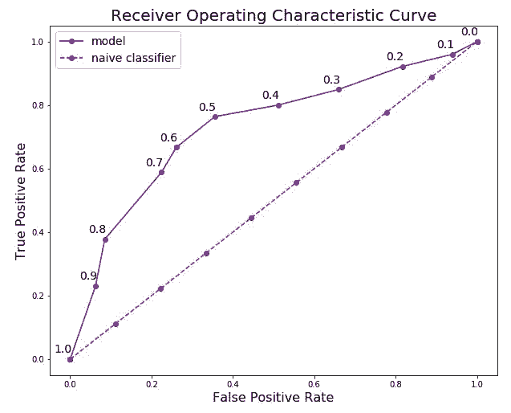

在这里我们可以看到，所有的概念都汇集到一起了！在阈值等于 1.0 的点，我们没有将任何病人归类为患病，因此模型的召回率和精度都是 0。随着阈值的减小，召回率增加了，因为我们发现更多的患者患有该疾病。然而，随着召回率的增加，精度会降低，因为除了增加真正例之外，还会增加假正例。在阈值为 0.0 的时候，我们的召回率是完美的——我们发现所有的患者都患有这种疾病——但是精度很低，因为有很多假正例。通过更改阈值并选择最大化 F1 score 的阈值，我们可以沿着给定模型的曲线移动。要改变整个曲线，我们需要建立一个不同的模型。

在每个阈值下最终模型的统计量如下表：

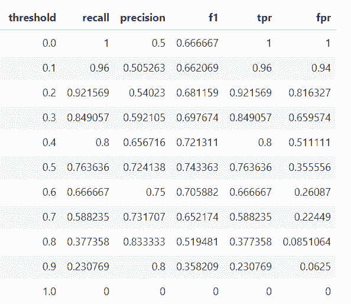

基于 F1 score，整体最佳的模型出现在阈值为 0.5 的地方。如果我们想要在更大程度上强调精度或者召回率，我们可以选择这些指标上最佳时对应的模型。

**结论**

我们倾向于使用准确率，因为每个人都知道它意味着什么，而不是因为它是完成任务的最佳工具！虽然更适合的度量指标 (如召回率和精度) 看起来可能很陌生，但我们已经直观地了解了为什么它们在某些问题 (如不平衡的分类任务) 中有着更好的表现。统计学为我们提供了计算这些指标的形式化定义和方程。数据科学是关于寻找解决问题的正确工具的学科，而且在开发分类模型时，我们常常需要超越准确率（accuracy）的单一指标。了解召回率、精度、F1 score 和 ROC 曲线使我们能够评估分类模型，并应使我们怀疑是否有人仅仅在吹捧模型的准确率，尤其是对于不平衡的问题。正如我们所看到的，准确率（accuracy）并不能对几个关键问题提供有用的评估，但现在我们知道如何使用更聪明的衡量指标！

*原文链接：https://towardsdatascience.com/beyond-accuracy-precision-and-recall-3da06bea9f6c*

****本文为机器之心编译，**转载请联系本公众号获得授权****。**

✄------------------------------------------------

**加入机器之心（全职记者/实习生）：hr@jiqizhixin.com**

**投稿或寻求报道：editor@jiqizhixin.com**

**广告&商务合作：bd@jiqizhixin.com**