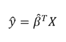

# 入门 | 贝叶斯线性回归方法的解释和优点

选自 TowardsDataScience

**作者：****William Koehrsen**

**机器之心编译**

**参与：****Geek AI、刘晓坤**

> 本文对比了频率线性回归和贝叶斯线性回归两种方法，并对后者进行了详细的介绍，分析了贝叶斯线性回归的优点和直观特征。

我认为贝叶斯学派和频率学派之间的纷争是「可远观而不可亵玩」的学术争论之一。与其热衷于站队，我认为同时学习这两种统计推断方法并且将它们应用到恰当的场景之下会更加富有成效。出于这种考虑，最近我努力学习和应用贝叶斯推断方法，补充学校课程所学的频率统计方法。

贝叶斯线性模型是我最早对应用贝叶斯推断的关注点之一。在我们学习的过程中，最重要的部分也许就是将一个概念介绍给别人。本文是我介绍贝叶斯线性回归的一次尝试。我会对线性回归的频率派方法做一个简要的回顾，介绍贝叶斯解释（Bayesian interpretation），并查看将其应用于简单数据集的结果。

代码地址：https://github.com/WillKoehrsen/Data-Analysis/blob/master/bayesian_lr/Bayesian%20Linear%20Regression%20Demonstration.ipynbRecap of Frequentist Linear Regression

**回顾****频率派线性回归**

线性回归的频率派视角可能是你所熟悉的、从学校学到的版本：模型假设反应变量（y，也称因变量）是一组权重和预测变量（x，也称自变量）乘积的线性组合。完整的公式还包含一个代表随机采样噪声的误差项。例如，如果我们有两个预测变量，公式可以写成：


其中，y 是反应变量（也被称为因变量），β 为权重（也被称为模型参数），x 为预测变量，ε 为代表随机采样噪声的误差项或者没有被包含在模型中的变量的影响。

线性回归是一个易于解释的简单模型： β_0 是截距项，其它的权重（β's）表示预测变量的增加对反应变量的影响。例如：如果 β_1 为 1.2，那么 x_1 每增加一个单位，反应变量就会增加 1.2。

我们可以通过矩阵方程将线性模型泛化到有任意数量预测变量的情况。将一个值为 1 的常量项添加到预测变量矩阵中代表截距，这样我们就可以将矩阵公式写成：


从训练数据中学习线性模型的目标是找出系数 β，该系数能够最好地解释数据。在频率派线性回归中，对数据最好的解释指的是系数 β 能够最小化残差平方和（RSS）。RSS 是已知的真实值（y）和预测模型的输出（ŷ，读作「y—hat」，表示一个估计值）之间差的平方的总和。残差平方和是关于模型参数的函数：


这个求和涵盖了训练集中的 N 个数据点。我们在此并不深究细节（参考资料：http://www.stat.cmu.edu/~cshalizi/mreg/15/lectures/13/lecture-13.pdf），不过该方程具备模型参数β的封闭解，能够最小化误差。这就是对参数 β 的最大似然估计，因为它是在给定输入 X 和输出 y 的条件下最有可能的 β 值。矩阵形式表达的封闭解如下：


（同样地，我们必须给 β 加一个「帽子」，因为它代表对模型参数的估计值。）别被这里的矩阵数学吓倒了！得益于像 Python 中的 Scikit-learn 这样的库，我们通常不需要对其进行手动的计算（尽管自己编写一个线性回归的代码是很好的做法）。这种通过最小化 RSS 来拟合模型参数的方法被称为普通最小二乘法（OLS）。

我们从频率线性回归中得到的是仅仅基于训练数据的对模型参数的单次估计。我们的模型是完全通过数据训练出来的：这样看来，我们所需要的所有关于模型的信息都被编码在了训练数据中。

当得到了 β hat 后，我们可以通过使用模型的等式来估计任意新数据点的输出值：



举一个最小二乘法的例子，我们可以对真实世界中的数据进行线性回归，数据中包含对 15,000 次运动的持续时间和燃烧的卡路里的观测值。


通过最小二乘法，我们得到了对模型参数的单次估计。在这个例子中，参数是直线的截距和斜率。我们可以写出通过 OLS 生成的方程：

```py
calories = -21.83 + 7.17 * duration
```

从斜率上，我们可以看到每多锻炼一分钟就会额外消耗 7.17 卡路里的热量。这个例子中的截距貌似没有什么作用，因为它告诉我们如果运动 0 分钟，我们会消耗 -21.86 卡路里！这只是一个 OLS 拟合过程的案例，在不考虑它的物理意义是否说得通的情况下，它找到了在训练数据集上最小化误差的直线。

如果有一个新的数据点，假设运动持续时间为 15.5 分钟，我们可以将它带入到方程中得到消耗的卡路里的点估计：

calories = -21.83 + 7.17 * 15.5 = 89.2

普通最小二乘法给了我们对输出的单次点估计，我们可以将其解释为给定数据时可能性最大的估计。然而，如果有一个很小的数据集，我们可能希望将估计表示为一个可能值的分布。这就是贝叶斯估计起作用的地方。

**贝叶斯线性回归**

从贝叶斯学派的观点来看，我们使用概率分布而非点估计来构建线性回归。反应变量 y 不是被估计的单个值，而是假设从一个正态分布中提取而来。贝叶斯线性回归模型如下：


输出 y 是从一个由均值和方差两种特征刻画的正态（高斯）分布生成的。线性回归的均值是权重矩阵的转置和预测变量矩阵之积。方差是标准差 σ 的平方（乘以单位矩阵，因为这是模型的多维表示）。

贝叶斯线性回归的目的不是找到模型参数的单一「最佳」值，而是确定模型参数的后验分布。不仅响应变量是从概率分布中生成的，而且假设模型参数也来自于概率分布。模型参数的后验分布是以训练的输入和输出作为条件的。


其中，P(β|y, X) 是给定输入和输出时的模型参数的后验概率分布。它等于输出的似然 P(y|β, X) 乘以给定输入的参数 β 的先验概率 P(β|X) 并且除以归一化常数。这是贝叶斯定理的一个简单表达形式，是支撑贝叶斯推断的基础。


让我们稍微停下脚步，想想这意味着什么。与 OLS 相比，我们有一个模型参数的后验分布，它与数据的似然和参数的先验概率的乘积成正比。在此，我们可以看到贝叶斯线性回归主要的两个好处。

1.  先验分布：如果具备领域知识或者对于模型参数的猜测，我们可以在模型中将它们包含进来，而不是像在线性回归的频率方法那样：假设所有关于参数的所需信息都来自于数据。如果事先没有没有任何的预估，我们可以为参数使用无信息先验，比如一个正态分布。

2.  后验分布：使用贝叶斯线性回归的结果是一个基于训练数据和先验概率的模型参数的分布。这使得我们能够量化对模型的不确定性：如果我们拥有较少的数据点，后验分布将更加分散。

随着数据点的增加，似然会降低先验的影响，当我们有无限的数据时，输出的参数会收敛到从 OLS 方法获得的值。

将模型参数作为概率分布的公式反映了贝叶斯学派的世界观：我们从最初的估计和先验分布开始，并随着收集到更多的证据，模型会变得更少犯错。贝叶斯推理是我们直觉的自然延伸。通常，我们有一个初始的假设，并且随着收集到那些或支持、或否定想法的数据越来越多，我们对于世界的模型将会发生改变（理想情况下，这就是我们进行推理的方式）。

**实现贝叶斯线性回归**

实际上，对于连续变量来说，估算模型参数的后验分布是很困难的。因此我们采用抽样方法从后验分布中抽取样本，用来对后验分布取近似。从分布中抽取随机样本来近似估计分布的技术是蒙特卡洛方法的应用之一。我们有许多蒙特卡洛抽样的算法，其中最常用的是马尔可夫链蒙特卡洛的变体。

**贝叶斯线性模型的应用**

我将跳过本文的代码部分（请参阅 PyMC3 中的代码实现），但是实现贝叶斯回归的基本流程是：指定模型参数的先验（在这个例子中我使用正态分布），创建将训练数据中的输入映射到输出的模型，接着用一个马尔可夫链蒙特卡洛（MCMC）算法从模型参数的后验分布中抽取样本。最终的结果是参数的后验分布。我们可以查看这些得到的分布，看看究竟发生了什么！

第一张图展示了模型参数后验分布的近似。这些是 MCMC 进行了 1000 步的结果，表示算法从后验分布中采样了 1000 步。


如果我们将斜率和结局的平均值和通过 OLS 得到的相比（OLS 得到的截距为 -21.83 且斜率为 7.17），我们看到这二者得到的结果极为相似。然而，尽管可以使用均值作为一个单次的点估计，但我们还拥有一系列模型参数可能的值。随着数据点数量的增加，这个范围将会缩小并且收敛到一个确切的值，表示对模型参数有更大的置信度（在贝叶斯推断中，一个变量的范围被称为可信区间，这与频率推断中的置信区间的解释稍稍有些不同）。

当我们想要展示从贝叶斯模型中得到的线性拟合效果时，我们可以画出一系列的直线，每条线代表对于模型参数的不同的估计，而并非仅仅显示估计值。随着数据点的数目增加，这些直线开始重叠在一起，因为模型参数的不确定性降低了。

为了显示数据点的数目在模型中的影响，我使用了两个模型。第一个模型的结果显示在左边，它使用了 500 个数据点；而右图所示的模型使用了 15,000 个数据点。每张图都显示了从模型参数的后验概率中抽样得到的 100 个可能的模型。


*使用 500 个（左图）观测值和 15,000 个（右图）观测值的贝叶斯线性回归模型的结果*

在使用更少的数据点时，线性拟合的变化更大，这代表着模型中更大的不确定性。有了所有的数据点，OLS 和贝叶斯模型的拟合结果几乎是一样的，因为先验的影响被数据中的似然降低了。

当使用我们的贝叶斯线性模型预测单个数据点的输出时，我们仍然不是得到单一的值，而是一个分布。下面是 15.5 分钟的运动所消耗的卡路里的概率密度图。红色的垂直线代表 OLS 的估计值。


*从贝叶斯模型中得到的消耗卡路里的后验概率密度*

我们看到，消耗掉的卡路里在 89.3 左右的达到概率的峰值，但是完整的估计是一系列的可能值。

**结论**

与其在贝叶斯学派和频率学派的讨论（或者争论）中站在任何一方，同时学习这两种方法才是更加有益的。这样的话，我们就可以在正确的情况下应用它们。

在拥有有限的数据或者想要在模型中使用先验知识的问题中，贝叶斯线性回归方法可以同时引入先验信息并且显示不确定性。贝叶斯线性回归反映了贝叶斯学派处理问题的框架：我们先构造一个初始的估计，并且随着收集到更多的数据，不断改进估计。贝叶斯观点是一种直观的看待世界的方法，并且贝叶斯推断可以成为相应的频率推断的实用的替代方法。数据科学并不是选边站，而是要找出最适合这份工作的工具，并且掌握更多的技能只会让你更有效率！

原文链接：https://towardsdatascience.com/introduction-to-bayesian-linear-regression-e66e60791ea7

****本文为机器之心编译，**转载请联系本公众号获得授权****。**

✄------------------------------------------------

**加入机器之心（全职记者/实习生）：hr@jiqizhixin.com**

**投稿或寻求报道：editor@jiqizhixin.com**

**广告&商务合作：bd@jiqizhixin.com**