# 入门 | CNN 也能用于 NLP 任务，一文简述文本分类任务的 7 个模型

选自 Ahmed BESBES

**作者：****Ahmed Besbes**

****机器之心编译****

**参与：李诗萌****、路**

> 本文介绍了用于文本分类任务的 7 个模型，包括传统的词袋模型、循环神经网络，也有常用于计算机视觉任务的卷积神经网络，以及 RNN + CNN。

本文是我之前写过的一篇基于推特数据进行情感分析的文章（https://ahmedbesbes.com/sentiment-analysis-on-twitter-using-word2vec-and-keras.html）的延伸内容。那时我建立了一个简单的模型：基于 keras 训练的两层前馈神经网络。用组成推文的词嵌入的加权平均值作为文档向量来表示输入推文。

我用的嵌入是用 gensim 基于语料库从头训练出来的 word2vec 模型。该是一个二分类任务，准确率能达到 79%。

本文目标在于探索其他在相同数据集上训练出来的 NLP 模型，然后在给定的测试集上对这些模型的性能进行评估。

我们将通过不同的模型（从依赖于词袋表征的简单模型到部署了卷积/循环网络的复杂模型）了解能否得到高于 79% 的准确率！


首先，将从简单的模型开始，逐步增加模型的复杂度。这项工作是为了说明简单的模型也能很有效。

我会进行这些尝试：

*   用词级的 ngram 做 logistic 回归

*   用字符级的 ngram 做 logistic 回归

*   用词级的 ngram 和字符级的 ngram 做 Logistic 回归

*   在没有对词嵌入进行预训练的情况下训练循环神经网络（双向 GRU）

*   用 GloVe 对词嵌入进行预训练，然后训练循环神经网络

*   多通道卷积神经网络

*   RNN（双向 GRU）+ CNN 模型

文末附有这些 NLP 技术的样板代码。这些代码可以帮助你开启自己的 NLP 项目并获得最优结果（这些模型中有一些非常强大）。

我们还可以提供一个综合基准，我们可以利用该基准分辨哪个模型最适合预测推文中的情绪。

在相关的 GitHub 库中还有不同的模型、这些模型的预测结果以及测试集。你可以自己尝试并得到可信的结果。

```py
import os
import re

import warnings
warnings.simplefilter("ignore", UserWarning)
from matplotlib import pyplot as plt
%matplotlib inline

import pandas as pd
pd.options.mode.chained_assignment = None
import numpy as np 
from string import punctuation

from nltk.tokenize import word_tokenize

from sklearn.model_selection import train_test_split
from sklearn.feature_extraction.text import TfidfVectorizer
from sklearn.linear_model import LogisticRegression
from sklearn.metrics import accuracy_score, auc, roc_auc_score
from sklearn.externals import joblib

import scipy
from scipy.sparse import hstack
```

**0\. 数据预处理**

你可以从该链接（http://thinknook.com/twitter-sentiment-analysis-training-corpus-dataset-2012-09-22/）下载数据集。

加载数据并提取所需变量（情感及情感文本）。

该数据集包含 1,578,614 个分好类的推文，每一行都用 1（积极情绪）和 0（消极情绪）进行了标记。

作者建议用 1/10 的数据进行测试，其余数据用于训练。

```py
data = pd.read_csv('./data/tweets.csv', encoding='latin1', usecols=['Sentiment', 'SentimentText'])
data.columns = ['sentiment', 'text']
data = data.sample(frac=1, random_state=42)
print(data.shape)
(1578614, 2)
for row in data.head(10).iterrows():
    print(row[1]['sentiment'], row[1]['text']) 
1 http://www.popsugar.com/2999655 keep voting for robert pattinson in the popsugar100 as well!! 
1 @GamrothTaylor I am starting to worry about you, only I have Navy Seal type sleep hours. 
0 sunburned...no sunbaked!    ow.  it hurts to sit.
1 Celebrating my 50th birthday by doing exactly the same as I do every other day - working on our websites.  It's just another day.   
1 Leah and Aiden Gosselin are the cutest kids on the face of the Earth 
1 @MissHell23 Oh. I didn't even notice.  
0 WTF is wrong with me?!!! I'm completely miserable. I need to snap out of this 
0 Was having the best time in the gym until I got to the car and had messages waiting for me... back to the down stage! 
1 @JENTSYY oh what happened?? 
0 @catawu Ghod forbid he should feel responsible for anything! 
```

推文数据中存在很多噪声，我们删除了推文中的网址、主题标签和用户提及来清理数据。

```py
def tokenize(tweet):
    tweet = re.sub(r'http\S+', '', tweet)
    tweet = re.sub(r"#(\w+)", '', tweet)
    tweet = re.sub(r"@(\w+)", '', tweet)
    tweet = re.sub(r'[^\w\s]', '', tweet)
    tweet = tweet.strip().lower()
    tokens = word_tokenize(tweet)
    return tokens
```

将清理好的数据保存在硬盘上。

```py
data['tokens'] = data.text.progress_map(tokenize)
data['cleaned_text'] = data['tokens'].map(lambda tokens: ' '.join(tokens))
data[['sentiment', 'cleaned_text']].to_csv('./data/cleaned_text.csv')

data = pd.read_csv('./data/cleaned_text.csv')
print(data.shape)
(1575026, 2)
data.head()
```

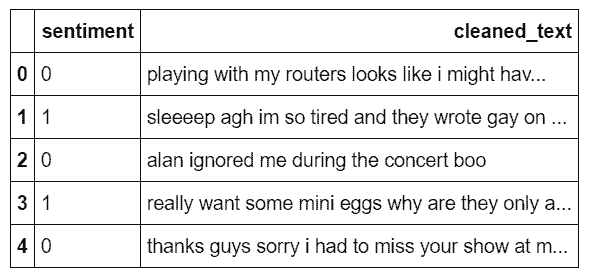

既然数据集已经清理干净了，就可以准备分割训练集和测试集来建立模型了。

本文数据都是用这种方式分割的。

```py
x_train, x_test, y_train, y_test = train_test_split(data['cleaned_text'], 
                                                    data['sentiment'], 
                                                    test_size=0.1, 
                                                    random_state=42,
                                                    stratify=data['sentiment'])

print(x_train.shape, x_test.shape, y_train.shape, y_test.shape)
(1417523,) (157503,) (1417523,) (157503,)
```

将测试集标签存储在硬盘上以便后续使用。

```py
pd.DataFrame(y_test).to_csv('./predictions/y_true.csv', index=False, encoding='utf-8') 
```

接下来就可以应用机器学习方法了。

**1\. 基于词级 ngram 的词袋模型**

那么，什么是 n-gram 呢？

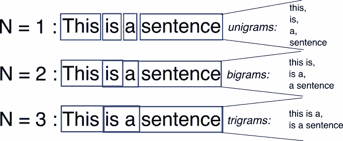

如图所示，ngram 是将可在源文本中找到的长度为 n 的相邻词的所有组合。

我们的模型将以 unigrams（n=1）和 bigrams（n=2）为特征。

用矩阵表示数据集，矩阵的每一行表示一条推文，每一列表示从推文（已经经过分词和清理）中提取的特征（一元模型或二元模型）。每个单元格是 tf-idf 分数（也可以用更简单的值，但 tf-idf 比较通用且效果较好）。我们将该矩阵称为文档-词项矩阵。

略经思考可知，拥有 150 万推文的语料库的一元模型和二元模型去重后的数量还是很大的。事实上，出于计算力的考虑，我们可将这个数设置为固定值。你可以通过交叉验证来确定这个值。

在向量化之后，语料库如下图所示：

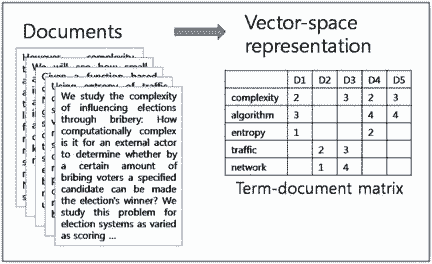

> I like pizza a lot

假设使用上述特征让模型对这句话进行预测。

由于我们使用的是一元模型和二元模型后，因此模型提取出了下列特征：

> i, like, pizza, a, lot, i like, like pizza, pizza a, a lot

因此，句子变成了大小为 N（分词总数）的向量，这个向量中包含 0 和这些 ngram 的 tf-idf 分数。所以接下来其实是要处理这个大而稀疏的向量。

一般而言，线性模型可以很好地处理大而稀疏的数据。此外，与其他模型相比，线性模型的训练速度也更快。

从过去的经验可知，logistic 回归可以在稀疏的 tf-idf 矩阵上良好地运作。

```py
vectorizer_word = TfidfVectorizer(max_features=40000,
                             min_df=5, 
                             max_df=0.5, 
                             analyzer='word', 
                             stop_words='english', 
                             ngram_range=(1, 2))

vectorizer_word.fit(x_train, leave=False)

tfidf_matrix_word_train = vectorizer_word.transform(x_train)
tfidf_matrix_word_test = vectorizer_word.transform(x_test)
```

在为训练集和测试集生成了 tf-idf 矩阵后，就可以建立第一个模型并对其进行测试。

tf-idf 矩阵是 logistic 回归的特征。

```py
lr_word = LogisticRegression(solver='sag', verbose=2)
lr_word.fit(tfidf_matrix_word_train, y_train)
```

一旦训练好模型后，就可以将其应用于测试数据以获得预测值。然后将这些值和模型一并存储在硬盘上。

```py
joblib.dump(lr_word, './models/lr_word_ngram.pkl')

y_pred_word = lr_word.predict(tfidf_matrix_word_test)
pd.DataFrame(y_pred_word, columns=['y_pred']).to_csv('./predictions/lr_word_ngram.csv', index=False) 
```

得到准确率：

```py
y_pred_word = pd.read_csv('./predictions/lr_word_ngram.csv')
print(accuracy_score(y_test, y_pred_word))
0.782042246814
```

第一个模型得到了 78.2% 的准确率！真不赖。接下来了解一下第二个模型。

**2\. 基于字符级 ngram 的词袋模型**

我们从未说过 ngram 仅为词服务，也可将其应用于字符上。

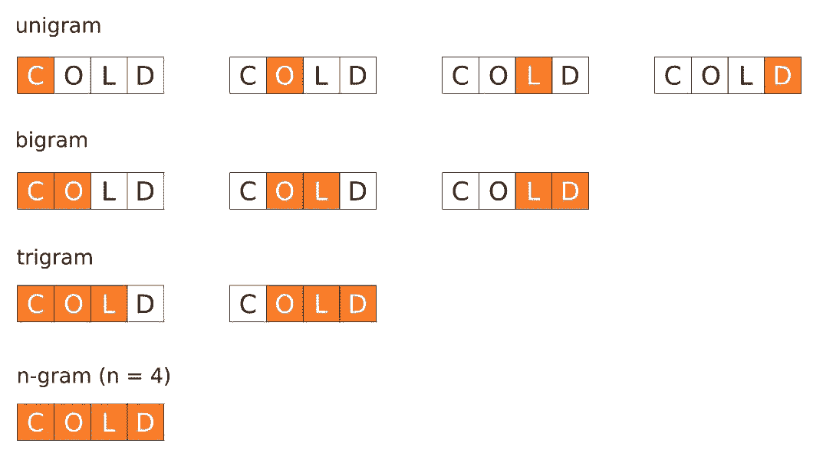

如你所见，我们将对字符级 ngram 使用与图中一样的代码，现在直接来看 4-grams 建模。

基本上这意味着，像「I like this movie」这样的句子会有下列特征：

> I, l, i, k, e, ..., I li, lik, like, ..., this, ... , is m, s mo, movi, ...

字符级 ngram 很有效，在语言建模任务中，甚至可以比分词表现得更好。像垃圾邮件过滤或自然语言识别这样的任务就高度依赖字符级 ngram。

与之前学习单词组合的模型不同，该模型学习的是字母组合，这样就可以处理单词的形态构成。

基于字符的表征的一个优势是可以更好地解决单词拼写错误的问题。

我们来运行同样的流程：

```py
vectorizer_char = TfidfVectorizer(max_features=40000,
                             min_df=5, 
                             max_df=0.5, 
                             analyzer='char', 
                             ngram_range=(1, 4))

vectorizer_char.fit(tqdm_notebook(x_train, leave=False));

tfidf_matrix_char_train = vectorizer_char.transform(x_train)
tfidf_matrix_char_test = vectorizer_char.transform(x_test)

lr_char = LogisticRegression(solver='sag', verbose=2)
lr_char.fit(tfidf_matrix_char_train, y_train)

y_pred_char = lr_char.predict(tfidf_matrix_char_test)
joblib.dump(lr_char, './models/lr_char_ngram.pkl')

pd.DataFrame(y_pred_char, columns=['y_pred']).to_csv('./predictions/lr_char_ngram.csv', index=False)
y_pred_char = pd.read_csv('./predictions/lr_char_ngram.csv')
print(accuracy_score(y_test, y_pred_char))
0.80420055491
```

80.4% 的准确率！字符级 ngram 模型的性能要比词级的 ngram 更好。

**3\. 基于词级 ngram 和字符级 ngram 的词袋模型**

与词级 ngram 的特征相比，字符级 ngram 特征似乎提供了更好的准确率。那么将字符级 ngram 和词级 ngram 结合效果又怎么样呢？

我们将两个 tf-idf 矩阵连接在一起，建立一个新的、混合 tf-idf 矩阵。该模型有助于学习单词形态结构以及与这个单词大概率相邻单词的形态结构。

将这些属性结合在一起。

```py
tfidf_matrix_word_char_train =  hstack((tfidf_matrix_word_train, tfidf_matrix_char_train))
tfidf_matrix_word_char_test =  hstack((tfidf_matrix_word_test, tfidf_matrix_char_test))

lr_word_char = LogisticRegression(solver='sag', verbose=2)
lr_word_char.fit(tfidf_matrix_word_char_train, y_train)

y_pred_word_char = lr_word_char.predict(tfidf_matrix_word_char_test)
joblib.dump(lr_word_char, './models/lr_word_char_ngram.pkl')

pd.DataFrame(y_pred_word_char, columns=['y_pred']).to_csv('./predictions/lr_word_char_ngram.csv', index=False)
y_pred_word_char = pd.read_csv('./predictions/lr_word_char_ngram.csv')
print(accuracy_score(y_test, y_pred_word_char))
0.81423845895
```

得到了 81.4% 的准确率。该模型只加了一个整体单元，但结果比之前的两个都要好。

关于词袋模型

*   优点：考虑到其简单的特性，词袋模型已经很强大了，它们训练速度快，且易于理解。

*   缺点：即使 ngram 带有一些单词间的语境，但词袋模型无法建模序列中单词间的长期依赖关系。

现在要用到深度学习模型了。深度学习模型的表现优于词袋模型是因为深度学习模型能够捕捉到句子中单词间的顺序依赖关系。这可能要归功于循环神经网络这一特殊神经网络结构的出现了。

本文并未涵盖 RNN 的理论基础，但该链接（http://colah.github.io/posts/2015-08-Understanding-LSTMs/）中的内容值得一读。这篇文章来源于 Cristopher Olah 的博客，详细叙述了一种特殊的 RNN 模型：长短期记忆网络（LSTM）。

在开始之前，要先设置一个深度学习专用的环境，以便在 TensorFlow 上使用 Keras。诚实地讲，我试着在个人笔记本上运行这些代码，但考虑到数据集的大小和 RNN 架构的复杂程度，这是很不实际的。还有一个很好的选择是 AWS。我一般在 EC2 p2.xlarge 实例上用深度学习 AMI（https://aws.amazon.com/marketplace/pp/B077GCH38C?qid=1527197041958&sr=0-1&ref_=srh_res_product_title）。亚马逊 AMI 是安装了所有包（TensorFlow、PyTorch 和 Keras 等）的预先配置过的 VM 图。强烈推荐大家使用！

```py
from keras.preprocessing.text import Tokenizer
from keras.preprocessing.text import text_to_word_sequence
from keras.preprocessing.sequence import pad_sequences

from keras.models import Model
from keras.models import Sequential

from keras.layers import Input, Dense, Embedding, Conv1D, Conv2D, MaxPooling1D, MaxPool2D
from keras.layers import Reshape, Flatten, Dropout, Concatenate
from keras.layers import SpatialDropout1D, concatenate
from keras.layers import GRU, Bidirectional, GlobalAveragePooling1D, GlobalMaxPooling1D

from keras.callbacks import Callback
from keras.optimizers import Adam

from keras.callbacks import ModelCheckpoint, EarlyStopping
from keras.models import load_model
from keras.utils.vis_utils import plot_model
```

**4\. 没有预训练词嵌入的循环神经网络**

RNN 可能看起来很可怕。尽管它们因为复杂而难以理解，但非常有趣。RNN 模型封装了一个非常漂亮的设计，以克服传统神经网络在处理序列数据（文本、时间序列、视频、DNA 序列等）时的短板。

RNN 是一系列神经网络的模块，它们彼此连接像锁链一样。每一个都将消息向后传递。强烈推荐大家从 Colah 的博客中深入了解它的内部机制，下面的图就来源于此。

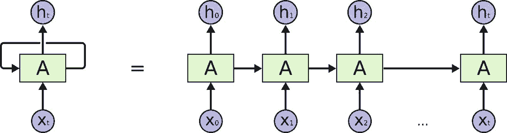

我们要处理的序列类型是文本数据。对意义而言，单词顺序很重要。RNN 考虑到了这一点，它可以捕捉长期依赖关系。

为了在文本数据上使用 Keras，我们首先要对数据进行预处理。可以用 Keras 的 Tokenizer 类。该对象用 num_words 作为参数，num_words 是根据词频进行分词后保留下来的最大词数。

```py
MAX_NB_WORDS = 80000
tokenizer = Tokenizer(num_words=MAX_NB_WORDS)

tokenizer.fit_on_texts(data['cleaned_text'])
```

当分词器适用于数据时，我们就可以用分词器将文本字符级 ngram 转换为数字序列。

这些数字表示每个单词在字典中的位置（将其视为映射）。

如下例所示：

```py
x_train[15]
'breakfast time happy time'
```

这里说明了分词器是如何将其转换为数字序列的。

```py
tokenizer.texts_to_sequences([x_train[15]])
[[530, 50, 119, 50]]
```

接下来在训练序列和测试序列中应用该分词器：

```py
train_sequences = tokenizer.texts_to_sequences(x_train)
test_sequences = tokenizer.texts_to_sequences(x_test)
```

将推文映射到整数列表中。但是由于长度不同，还是没法将它们在矩阵中堆叠在一起。还好 Keras 允许用 0 将序列填充至最大长度。我们将这个长度设置为 35（这是推文中的最大分词数）。

```py
MAX_LENGTH = 35
padded_train_sequences = pad_sequences(train_sequences, maxlen=MAX_LENGTH)
padded_test_sequences = pad_sequences(test_sequences, maxlen=MAX_LENGTH)
padded_train_sequences
array([[    0,     0,     0, ...,  2383,   284,     9],
       [    0,     0,     0, ...,    13,    30,    76],
       [    0,     0,     0, ...,    19,    37, 45231],
       ..., 
       [    0,     0,     0, ...,    43,   502,  1653],
       [    0,     0,     0, ...,     5,  1045,   890],
       [    0,     0,     0, ..., 13748, 38750,   154]])
padded_train_sequences.shape
(1417523, 35)
```

现在就可以将数据传入 RNN 了。

以下是我将使用的架构的一些元素：

*   嵌入维度为 300。这意味着我们使用的 8 万个单词中的每一个都被映射至 300 维的密集（浮点数）向量。该映射将在训练过程中进行调整。

*   在嵌入层上应用 spatial dropout 层以减少过拟合：按批次查看 35*300 的矩阵，随机删除每个矩阵中（设置为 0）的词向量（行）。这有助于将注意力不集中在特定的词语上，有利于模型的泛化。

*   双向门控循环单元（GRU）：这是循环网络部分。这是 LSTM 架构更快的变体。将其视为两个循环网络的组合，这样就可以从两个方向同时扫描文本序列：从左到右和从右到左。这使得网络在阅读给定单词时，可以结合之前和之后的内容理解文本。GRU 中每个网络块的输出 h_t 的维度即单元数，将这个值设置为 100。由于用了双向 GRU，因此每个 RNN 块的最终输出都是 200 维的。

双向 GRU 的输出是有维度的（批尺寸、时间步和单元）。这意味着如果用的是经典的 256 的批尺寸，维度将会是 (256, 35, 200)。

*   在每个批次上应用的是全局平均池化，其中包含了每个时间步（即单词）对应的输出向量的平均值。

*   我们应用了相同的操作，只是用最大池化替代了平均池化。

*   将前两个操作的输出连接在了一起。

```py
def get_simple_rnn_model():
    embedding_dim = 300
    embedding_matrix = np.random.random((MAX_NB_WORDS, embedding_dim))

    inp = Input(shape=(MAX_LENGTH, ))
    x = Embedding(input_dim=MAX_NB_WORDS, output_dim=embedding_dim, input_length=MAX_LENGTH, 
                  weights=[embedding_matrix], trainable=True)(inp)
    x = SpatialDropout1D(0.3)(x)
    x = Bidirectional(GRU(100, return_sequences=True))(x)
    avg_pool = GlobalAveragePooling1D()(x)
    max_pool = GlobalMaxPooling1D()(x)
    conc = concatenate([avg_pool, max_pool])
    outp = Dense(1, activation="sigmoid")(conc)

    model = Model(inputs=inp, outputs=outp)
    model.compile(loss='binary_crossentropy',
                  optimizer='adam',
                  metrics=['accuracy'])
    return model

rnn_simple_model = get_simple_rnn_model()
```

该模型的不同层如下所示：

```py
plot_model(rnn_simple_model, 
           to_file='./images/article_5/rnn_simple_model.png', 
           show_shapes=True, 
           show_layer_names=True)
```

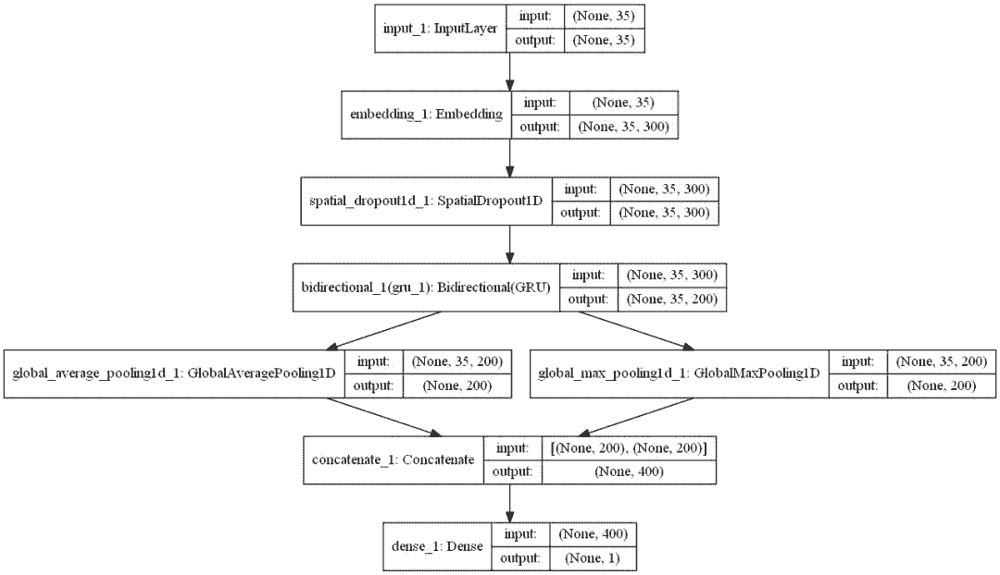

在训练期间使用了模型检查点。这样可以在每个 epoch 的最后将最佳模型（可以用准确率度量）自动存储（在硬盘上）。

```py
filepath="./models/rnn_no_embeddings/weights-improvement-{epoch:02d}-{val_acc:.4f}.hdf5"
checkpoint = ModelCheckpoint(filepath, monitor='val_acc', verbose=1, save_best_only=True, mode='max')

batch_size = 256
epochs = 2

history = rnn_simple_model.fit(x=padded_train_sequences, 
                    y=y_train, 
                    validation_data=(padded_test_sequences, y_test), 
                    batch_size=batch_size, 
                    callbacks=[checkpoint], 
                    epochs=epochs, 
                    verbose=1)

best_rnn_simple_model = load_model('./models/rnn_no_embeddings/weights-improvement-01-0.8262.hdf5')

y_pred_rnn_simple = best_rnn_simple_model.predict(padded_test_sequences, verbose=1, batch_size=2048)

y_pred_rnn_simple = pd.DataFrame(y_pred_rnn_simple, columns=['prediction'])
y_pred_rnn_simple['prediction'] = y_pred_rnn_simple['prediction'].map(lambda p: 1 if p >= 0.5 else 0)
y_pred_rnn_simple.to_csv('./predictions/y_pred_rnn_simple.csv', index=False)
y_pred_rnn_simple = pd.read_csv('./predictions/y_pred_rnn_simple.csv')
print(accuracy_score(y_test, y_pred_rnn_simple))
0.826219183127
```

准确率达到了 82.6%！这真是很不错的结果了！现在的模型表现已经比之前的词袋模型更好了，因为我们将文本的序列性质考虑在内了。

还能做得更好吗？

**5\. 用 GloVe 预训练词嵌入的循环神经网络**

在最后一个模型中，嵌入矩阵被随机初始化了。那么如果用预训练过的词嵌入对其进行初始化又当如何呢？举个例子：假设在语料库中有「pizza」这个词。遵循之前的架构对其进行初始化后，可以得到一个 300 维的随机浮点值向量。这当然是很好的。这很好实现，而且这个嵌入可以在训练过程中进行调整。但你还可以使用在很大的语料库上训练出来的另一个模型，为「pizza」生成词嵌入来代替随机选择的向量。这是一种特殊的迁移学习。

使用来自外部嵌入的知识可以提高 RNN 的精度，因为它整合了这个单词的相关新信息（词汇和语义），而这些信息是基于大规模数据语料库训练和提炼出来的。

我们使用的预训练嵌入是 GloVe。

官方描述是这样的：GloVe 是一种获取单词向量表征的无监督学习算法。该算法的训练基于语料库全局词-词共现数据，得到的表征展示出词向量空间有趣的线性子结构。

本文使用的 GloVe 嵌入的训练数据是数据量很大的网络抓取，包括：

*   8400 亿个分词；

*   220 万词。

下载压缩文件要 2.03GB。请注意，该文件无法轻松地加载在标准笔记本电脑上。

GloVe 嵌入有 300 维。

GloVe 嵌入来自原始文本数据，在该数据中每一行都包含一个单词和 300 个浮点数（对应嵌入）。所以首先要将这种结构转换为 Python 字典。

```py
def get_coefs(word, *arr):
    try:
        return word, np.asarray(arr, dtype='float32')
    except:
        return None, None

embeddings_index = dict(get_coefs(*o.strip().split()) for o in tqdm_notebook(open('./embeddings/glove.840B.300d.txt')))

embed_size=300
for k in tqdm_notebook(list(embeddings_index.keys())):
    v = embeddings_index[k]
    try:
        if v.shape != (embed_size, ):
            embeddings_index.pop(k)
    except:
        pass

embeddings_index.pop(None)
```

一旦创建了嵌入索引，我们就可以提取所有的向量，将其堆叠在一起并计算它们的平均值和标准差。

```py
values = list(embeddings_index.values())
all_embs = np.stack(values)

emb_mean, emb_std = all_embs.mean(), all_embs.std()
```

现在生成了嵌入矩阵。按照 mean=emb_mean 和 std=emb_std 的正态分布对矩阵进行初始化。遍历语料库中的 80000 个单词。对每一个单词而言，如果这个单词存在于 GloVe 中，我们就可以得到这个单词的嵌入，如果不存在那就略过。

```py
word_index = tokenizer.word_index
nb_words = MAX_NB_WORDS
embedding_matrix = np.random.normal(emb_mean, emb_std, (nb_words, embed_size))

oov = 0
for word, i in tqdm_notebook(word_index.items()):
    if i >= MAX_NB_WORDS: continue
    embedding_vector = embeddings_index.get(word)
    if embedding_vector is not None:
        embedding_matrix[i] = embedding_vector
    else:
        oov += 1

print(oov)

def get_rnn_model_with_glove_embeddings():
    embedding_dim = 300
    inp = Input(shape=(MAX_LENGTH, ))
    x = Embedding(MAX_NB_WORDS, embedding_dim, weights=[embedding_matrix], input_length=MAX_LENGTH, trainable=True)(inp)
    x = SpatialDropout1D(0.3)(x)
    x = Bidirectional(GRU(100, return_sequences=True))(x)
    avg_pool = GlobalAveragePooling1D()(x)
    max_pool = GlobalMaxPooling1D()(x)
    conc = concatenate([avg_pool, max_pool])
    outp = Dense(1, activation="sigmoid")(conc)

    model = Model(inputs=inp, outputs=outp)
    model.compile(loss='binary_crossentropy',
                  optimizer='adam',
                  metrics=['accuracy'])
    return model

rnn_model_with_embeddings = get_rnn_model_with_glove_embeddings()

filepath="./models/rnn_with_embeddings/weights-improvement-{epoch:02d}-{val_acc:.4f}.hdf5"
checkpoint = ModelCheckpoint(filepath, monitor='val_acc', verbose=1, save_best_only=True, mode='max')

batch_size = 256
epochs = 4

history = rnn_model_with_embeddings.fit(x=padded_train_sequences, 
                    y=y_train, 
                    validation_data=(padded_test_sequences, y_test), 
                    batch_size=batch_size, 
                    callbacks=[checkpoint], 
                    epochs=epochs, 
                    verbose=1)

best_rnn_model_with_glove_embeddings = load_model('./models/rnn_with_embeddings/weights-improvement-03-0.8372.hdf5')

y_pred_rnn_with_glove_embeddings = best_rnn_model_with_glove_embeddings.predict(
    padded_test_sequences, verbose=1, batch_size=2048)

y_pred_rnn_with_glove_embeddings = pd.DataFrame(y_pred_rnn_with_glove_embeddings, columns=['prediction'])
y_pred_rnn_with_glove_embeddings['prediction'] = y_pred_rnn_with_glove_embeddings['prediction'].map(lambda p: 
                                                                                                    1 if p >= 0.5 else 0)
y_pred_rnn_with_glove_embeddings.to_csv('./predictions/y_pred_rnn_with_glove_embeddings.csv', index=False)
y_pred_rnn_with_glove_embeddings = pd.read_csv('./predictions/y_pred_rnn_with_glove_embeddings.csv')
print(accuracy_score(y_test, y_pred_rnn_with_glove_embeddings))
0.837203100893 
```

准确率达到了 83.7%！来自外部词嵌入的迁移学习起了作用！本教程剩余部分都会在嵌入矩阵中使用 GloVe 嵌入。

**6\. 多通道卷积神经网络**

这一部分实验了我曾了解过的卷积神经网络结构（http://www.wildml.com/2015/11/understanding-convolutional-neural-networks-for-nlp/）。CNN 常用于计算机视觉任务。但最近我试着将其应用于 NLP 任务，而结果也希望满满。

简要了解一下当在文本数据上使用卷积网络时会发生什么。为了解释这一点，我从 wildm.com（一个很好的博客）中找到了这张非常有名的图（如下所示）。

了解一下使用的例子：I like this movie very much！（7 个分词）

*   每个单词的嵌入维度是 5。因此，可以用一个维度为 (7,5 的矩阵表示这句话。你可以将其视为一张「图」（数字或浮点数的矩阵）。

*   6 个滤波器，大小为 (2, 5) (3, 5) 和 (4, 5) 的滤波器各两个。这些滤波器应用于该矩阵上，它们的特殊之处在于都不是方矩阵，但它们的宽度和嵌入矩阵的宽度相等。所以每个卷积的结果将是一个列向量。

*   卷积产生的每一列向量都使用了最大池化操作进行下采样。

*   将最大池化操作的结果连接至将要传递给 softmax 函数进行分类的最终向量。

**背后的原理是什么？**

检测到特殊模式会激活每一次卷积的结果。通过改变卷积核的大小和连接它们的输出，你可以检测多个尺寸（2 个、3 个或 5 个相邻单词）的模式。

模式可以是像是「我讨厌」、「非常好」这样的表达式（词级的 ngram？），因此 CNN 可以在不考虑其位置的情况下从句子中分辨它们。

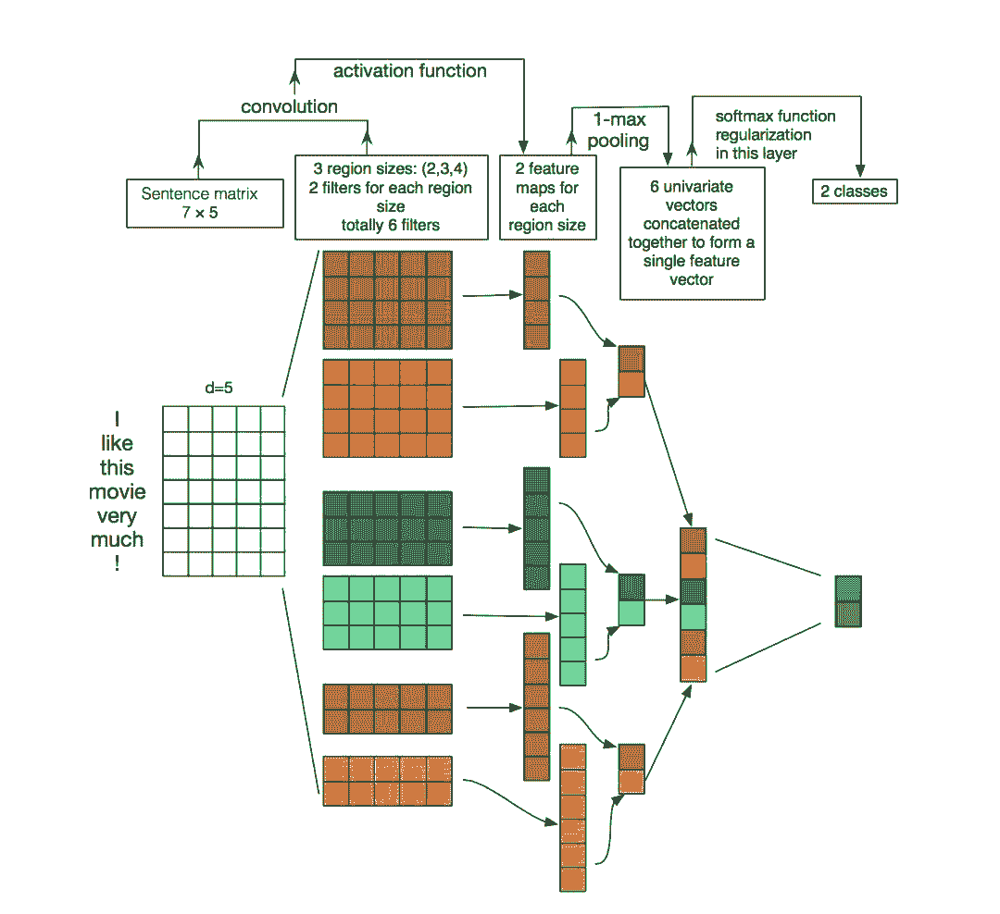

```py
def get_cnn_model():
    embedding_dim = 300

    filter_sizes = [2, 3, 5]
    num_filters = 256
    drop = 0.3

    inputs = Input(shape=(MAX_LENGTH,), dtype='int32')
    embedding = Embedding(input_dim=MAX_NB_WORDS,
                                output_dim=embedding_dim,
                                weights=[embedding_matrix],
                                input_length=MAX_LENGTH,
                                trainable=True)(inputs)

    reshape = Reshape((MAX_LENGTH, embedding_dim, 1))(embedding)
    conv_0 = Conv2D(num_filters, 
                    kernel_size=(filter_sizes[0], embedding_dim), 
                    padding='valid', kernel_initializer='normal', 
                    activation='relu')(reshape)

    conv_1 = Conv2D(num_filters, 
                    kernel_size=(filter_sizes[1], embedding_dim), 
                    padding='valid', kernel_initializer='normal', 
                    activation='relu')(reshape)
    conv_2 = Conv2D(num_filters, 
                    kernel_size=(filter_sizes[2], embedding_dim), 
                    padding='valid', kernel_initializer='normal', 
                    activation='relu')(reshape)

    maxpool_0 = MaxPool2D(pool_size=(MAX_LENGTH - filter_sizes[0] + 1, 1), 
                          strides=(1,1), padding='valid')(conv_0)

    maxpool_1 = MaxPool2D(pool_size=(MAX_LENGTH - filter_sizes[1] + 1, 1), 
                          strides=(1,1), padding='valid')(conv_1)

    maxpool_2 = MaxPool2D(pool_size=(MAX_LENGTH - filter_sizes[2] + 1, 1), 
                          strides=(1,1), padding='valid')(conv_2)
    concatenated_tensor = Concatenate(axis=1)(
        [maxpool_0, maxpool_1, maxpool_2])
    flatten = Flatten()(concatenated_tensor)
    dropout = Dropout(drop)(flatten)
    output = Dense(units=1, activation='sigmoid')(dropout)

    model = Model(inputs=inputs, outputs=output)
    adam = Adam(lr=1e-4, beta_1=0.9, beta_2=0.999, epsilon=1e-08, decay=0.0)

    model.compile(optimizer=adam, loss='binary_crossentropy', metrics=['accuracy'])

    return model

cnn_model_multi_channel = get_cnn_model()

plot_model(cnn_model_multi_channel, 
           to_file='./images/article_5/cnn_model_multi_channel.png', 
           show_shapes=True, 
           show_layer_names=True)
```

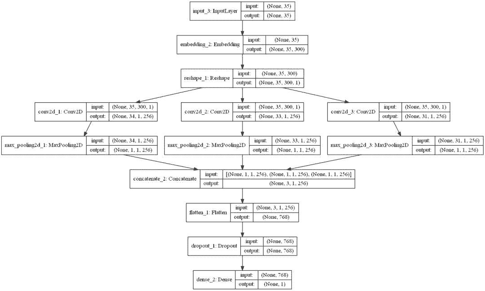

```py
filepath="./models/cnn_multi_channel/weights-improvement-{epoch:02d}-{val_acc:.4f}.hdf5"
checkpoint = ModelCheckpoint(filepath, monitor='val_acc', verbose=1, save_best_only=True, mode='max')

batch_size = 256
epochs = 4

history = cnn_model_multi_channel.fit(x=padded_train_sequences, 
                    y=y_train, 
                    validation_data=(padded_test_sequences, y_test), 
                    batch_size=batch_size, 
                    callbacks=[checkpoint], 
                    epochs=epochs, 
                    verbose=1)

best_cnn_model = load_model('./models/cnn_multi_channel/weights-improvement-04-0.8264.hdf5')

y_pred_cnn_multi_channel = best_cnn_model.predict(padded_test_sequences, verbose=1, batch_size=2048)

y_pred_cnn_multi_channel = pd.DataFrame(y_pred_cnn_multi_channel, columns=['prediction'])
y_pred_cnn_multi_channel['prediction'] = y_pred_cnn_multi_channel['prediction'].map(lambda p: 1 if p >= 0.5 else 0)
y_pred_cnn_multi_channel.to_csv('./predictions/y_pred_cnn_multi_channel.csv', index=False)
y_pred_cnn_multi_channel = pd.read_csv('./predictions/y_pred_cnn_multi_channel.csv')
print(accuracy_score(y_test, y_pred_cnn_multi_channel))
0.826409655689
```

准确率为 82.6%，没有 RNN 那么高，但是还是比 BOW 模型要好。也许调整超参数（滤波器的数量和大小）会带来一些提升？

**7\. RNN + CNN**

RNN 很强大。但有人发现可以通过在循环层上叠加卷积层使网络变得更强大。

这背后的原理在于 RNN 允许嵌入序列和之前单词的相关信息，CNN 可以使用这些嵌入并从中提取局部特征。这两个层一起工作可以称得上是强强联合。

更多相关信息请参阅：http://konukoii.com/blog/2018/02/19/twitter-sentiment-analysis-using-combined-lstm-cnn-models/

```py
def get_rnn_cnn_model():
    embedding_dim = 300
    inp = Input(shape=(MAX_LENGTH, ))
    x = Embedding(MAX_NB_WORDS, embedding_dim, weights=[embedding_matrix], input_length=MAX_LENGTH, trainable=True)(inp)
    x = SpatialDropout1D(0.3)(x)
    x = Bidirectional(GRU(100, return_sequences=True))(x)
    x = Conv1D(64, kernel_size = 2, padding = "valid", kernel_initializer = "he_uniform")(x)
    avg_pool = GlobalAveragePooling1D()(x)
    max_pool = GlobalMaxPooling1D()(x)
    conc = concatenate([avg_pool, max_pool])
    outp = Dense(1, activation="sigmoid")(conc)

    model = Model(inputs=inp, outputs=outp)
    model.compile(loss='binary_crossentropy',
                  optimizer='adam',
                  metrics=['accuracy'])
    return model

rnn_cnn_model = get_rnn_cnn_model()

plot_model(rnn_cnn_model, to_file='./images/article_5/rnn_cnn_model.png', show_shapes=True, show_layer_names=True)
```

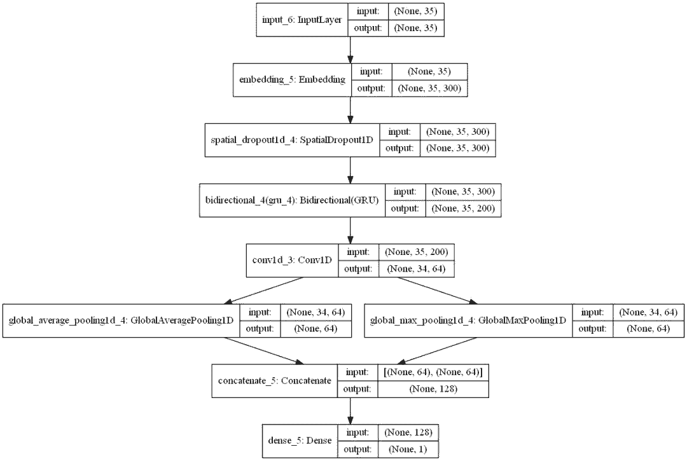

```py
filepath="./models/rnn_cnn/weights-improvement-{epoch:02d}-{val_acc:.4f}.hdf5"
checkpoint = ModelCheckpoint(filepath, monitor='val_acc', verbose=1, save_best_only=True, mode='max')

batch_size = 256
epochs = 4

history = rnn_cnn_model.fit(x=padded_train_sequences, 
                    y=y_train, 
                    validation_data=(padded_test_sequences, y_test), 
                    batch_size=batch_size, 
                    callbacks=[checkpoint], 
                    epochs=epochs, 
                    verbose=1)

best_rnn_cnn_model = load_model('./models/rnn_cnn/weights-improvement-03-0.8379.hdf5')

y_pred_rnn_cnn = best_rnn_cnn_model.predict(padded_test_sequences, verbose=1, batch_size=2048)

y_pred_rnn_cnn = pd.DataFrame(y_pred_rnn_cnn, columns=['prediction'])
y_pred_rnn_cnn['prediction'] = y_pred_rnn_cnn['prediction'].map(lambda p: 1 if p >= 0.5 else 0)
y_pred_rnn_cnn.to_csv('./predictions/y_pred_rnn_cnn.csv', index=False)
y_pred_rnn_cnn = pd.read_csv('./predictions/y_pred_rnn_cnn.csv')
print(accuracy_score(y_test, y_pred_rnn_cnn))
0.837882453033
```

这样可得到 83.8% 的准确率，这也是到现在为止最好的结果。

**8\. 总结**

在运行了 7 个不同的模型后，我们对比了一下：

```py
import seaborn as sns
from sklearn.metrics import roc_auc_score
sns.set_style("whitegrid")
sns.set_palette("pastel")

predictions_files = os.listdir('./predictions/')

predictions_dfs = []
for f in predictions_files:
    aux = pd.read_csv('./predictions/{0}'.format(f))
    aux.columns = [f.strip('.csv')]
    predictions_dfs.append(aux)

predictions = pd.concat(predictions_dfs, axis=1)

scores = {}

for column in tqdm_notebook(predictions.columns, leave=False):
    if column != 'y_true':
        s = accuracy_score(predictions['y_true'].values, predictions[column].values)
        scores[column] = s

scores = pd.DataFrame([scores], index=['accuracy'])

mapping_name = dict(zip(list(scores.columns), 
                        ['Char ngram + LR', '(Word + Char ngram) + LR', 
                           'Word ngram + LR', 'CNN (multi channel)',
                           'RNN + CNN', 'RNN no embd.', 'RNN + GloVe embds.']))

scores = scores.rename(columns=mapping_name)
scores = scores[['Word ngram + LR', 'Char ngram + LR', '(Word + Char ngram) + LR',
                'RNN no embd.', 'RNN + GloVe embds.', 'CNN (multi channel)',
                'RNN + CNN']]

scores = scores.T

ax = scores['accuracy'].plot(kind='bar', 
                             figsize=(16, 5), 
                             ylim=(scores.accuracy.min()*0.97, scores.accuracy.max() * 1.01), 
                             color='red', 
                             alpha=0.75, 
                             rot=45, 
                             fontsize=13)
ax.set_title('Comparative accuracy of the different models')

for i in ax.patches:
    ax.annotate(str(round(i.get_height(), 3)), 
                (i.get_x() + 0.1, i.get_height() * 1.002), color='dimgrey', fontsize=14)
```

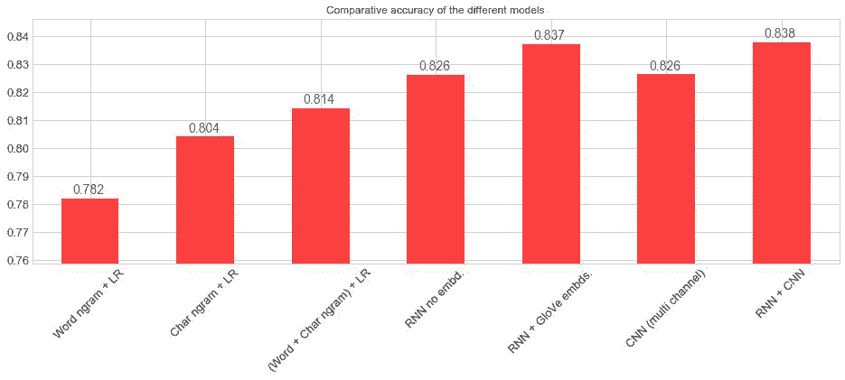

我们可以很快地看出在这些模型的预测值之间的关联。

```py
fig = plt.figure(figsize=(10, 5))
sns.heatmap(predictions.drop('y_true', axis=1).corr(method='kendall'), cmap="Blues", annot=True);
```

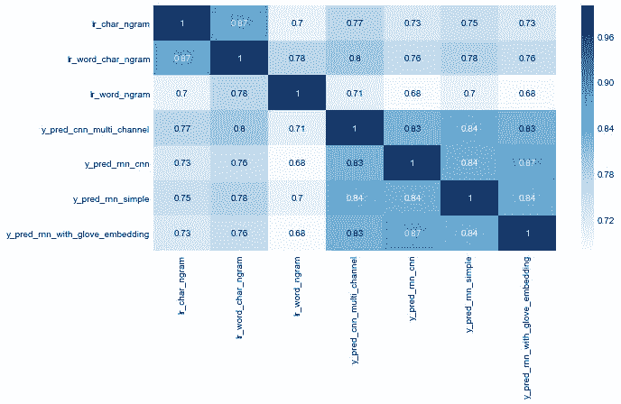

**结论**

以下是几条我认为值得与大家分享的发现：

*   使用字符级 ngram 的词袋模型很有效。不要低估词袋模型，它计算成本低且易于解释。

*   RNN 很强大。但你也可以用 GloVe 这样的外部预训练嵌入套在 RNN 模型上。当然也可以用 word2vec 和 FastText 等其他常见嵌入。

*   CNN 也可以应用于文本。CNN 的主要优势在于训练速度很快。此外，对 NLP 任务而言，CNN 从文本中提取局部特征的能力也很有趣。

*   RNN 和 CNN 可以堆叠在一起，可以同时利用这两种结构。

这篇文章很长。希望本文能对大家有所帮助。

原文链接：https://ahmedbesbes.com/overview-and-benchmark-of-traditional-and-deep-learning-models-in-text-classification.html

****本文为机器之心编译，**转载请联系本公众号获得授权****。**

✄------------------------------------------------

**加入机器之心（全职记者 / 实习生）：hr@jiqizhixin.com**

**投稿或寻求报道：**content**@jiqizhixin.com**

**广告 & 商务合作：bd@jiqizhixin.com**