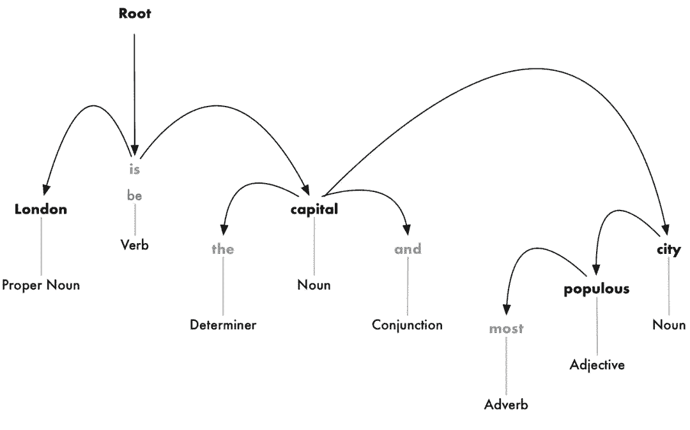

# 入门 | 自然语言处理是如何工作的？一步步教你构建 NLP 流水线

选自 medium

**作者****：Adam Geitgey**

**机器之心编译**

**参与：翁俊坚、刘晓坤**

> 计算机更擅长理解结构化数据，让计算机去理解主要以文化习惯沉淀下来的人类语言实在是太为难它们了。那自然语言处理获得的成功又是如何成就的呢？那就是，把人类语言（尽可能）结构化。本文以简单的例子一步步向我们展示了自然语言处理流水线的每个阶段的工作过程，也就是将语言结构化的过程，从句子分割、词汇标记化、...、到共指解析。作者的解释很直观、好理解，对于刚入门 NLP 的小伙伴是不可多得的好文。

计算机是如何理解人类语言的。

计算机非常擅长使用结构化数据，例如电子表格和数据库表。但是我们人类通常用文字交流，而不是使用电子表格来交流。这对计算机来说不是一件好事。

遗憾的是，在历史的进程中我们从未生活在一个充满结构化数据的世界里。


世界上很多信息是非结构化的——例如英语或其他人类语言中的原始文本。那我们要如何让计算机了解非结构化文本并从中提取数据呢？


自然语言处理，或简称为 NLP，是 AI 的子领域，重点放在使计算机能够理解和处理人类语言。接下来让我们看看 NLP 是如何工作，并学习如何使用 Python 编程来从原始文本中提取信息。

*注意：如果你不关心 NLP 是如何工作的，只想复制和粘贴一些代码，请跳过到「在 Python 中实现 NLP 流水线」的部分。*

**计算机能理解语言吗？**

只要计算机一直存在，程序员就一直在尝试编写出能理解像英语这样的语言的程序。原因很明显——人类已经书写下了几千年的信息，如果计算机能够读取和理解所有的这些数据，这将是非常有帮助的。

尽管计算机还不能像人类那样真正地理解英语——但是已经可以做很多事情了！在某些特定的领域，你可以用 NLP 技术去做一些看起来很神奇的事情，也可以在自己的项目中应用 NLP 技术来节省大量的时间。

更为便利的是，目前最新的 NLP 技术进展都可以通过开源的 Python 库（例如 spaCy、textacy、neuralcoref 等）来调用，仅仅需要几行 Python 代码即可实现 NLP 技术。

**从文本中提取含义并不容易**

阅读和理解英语的过程是非常复杂的，这个过程甚至没有包括考虑到英语有时并不遵循逻辑和一致的规则。例如，这条新闻标题是什么意思？

> 「Environmental regulators grill business owner over illegal coal fires.」

是监管者质疑企业所有者非法燃烧煤炭吗？还是监管者真的在架起企业所有者并用煤炭烧烤？正如你所看到的，用计算机解析英语将会变得非常复杂。

在机器学习中做任何复杂的事情通常意味着需要建立一条流水线 (pipeline)。这个想法是把你的问题分解成非常小的部分，然后用机器学习来分别解决每个部分，最后通过把几个互相馈送结果的机器学习模型连接起来，这样你就可以解决非常复杂的问题。

这正是我们要运用在 NLP 上的策略。我们将把理解英语的过程分解成小块，然后看看每个小块是如何工作的。

**一步一步建立 NLP 流水线**

让我们来看看来自维基百科的一段文字：

> London is the capital and most populous city of England and the United Kingdom. Standing on the River Thames in the south east of the island of Great Britain, London has been a major settlement for two millennia. It was founded by the Romans, who named it Londinium.

（伦敦是英格兰的首都同时也是英国人口最大的城市，是大不列颠东南部的泰晤士河流域两千年来的主要人类定居点，由罗马人建立，取名为伦蒂尼恩 (Londinium)。

这一段话包含了一些有用的事实。如果一台电脑能阅读这篇文章，理解到伦敦是一座城市，伦敦位于英国，伦敦由罗马人定居，那就太好了。但是为了达到这个目的，我们首先必须教会计算机最基本的书面语言概念，然后基于此再逐步进行完善。

**步骤 1：句子分割**

流水线的第一步是把文本拆分成单独的句子，像这样：

1.「伦敦是英格兰的首都同时也是英国人口最多的城市。」

2.「位于大不列颠岛东南部的泰晤士河流域的伦敦是两千年以来的主要人类定居点。」

3.「由罗马人建立，取名为伦蒂尼恩 (Londinium)。」

我们可以假设英语中的每个句子都表达了一个独立的思想或想法。编写一个程序来理解一个句子比理解整个段落要容易得多。

编码一个句子分割模型可以很简单地在任何看到标点符号的时候拆分句子。但是，现代 NLP 流水线通常使用更为复杂的技术，以应对那些没有被格式化干净的文件。

**步骤 2：词汇标记化**

现在我们已经把文档分割成句子，我们可以一次处理一个。让我们从文档中的第一句话开始：

> 「London is the capital and most populous city of England and the United Kingdom.」

我们的下一步是把这个句子分成不同的单词或标记，这叫做标记化，下面是标记化后的结果：

> 「London」,「is」,「the」,「capital」,「and」,「most」,「populous」,「city」,「of」,「England」,「and」,「the」,「United」,「Kingdom」,「.」

英语中的标记化是很容易做到的。只要它们之间有空格，我们就把它们分开。我们也将标点符号当作单独的记号来对待，因为标点也是有意义的。

**步骤 3：预测每个标记的词性**

接下来，我们来看看每一个标记，并尝试猜测它的词类：名词，动词，形容词等等。知道每个单词在句子中的作用将帮助我们弄清楚句子的意思。

我们可以把每个单词（和它周围的一些额外的单词用于上下文）输入预先训练的词性分类模型：


词性模型最初是通过给它提供数以百万计的英语句子来训练的，每一个单词的词性都已经标注出来，并让它学会复制这种行为。

需要注意的是，这个模型完全是基于统计数据的，它并没有真正理解单词的意思（如人类所思考的一样）。它只知道如何根据相似的句子和单词来猜测词性。

在处理完整个句子之后，我们将得到这样的结果：


有了这些信息，我们就可以开始获取一些非常基本的意思了。例如，我们可以看到句子中的名词包括「伦敦」和「首都」，所以这个句子很可能说的的是关于伦敦。

**步骤 4：文本词形还原**

在英语（和大多数语言）中，单词以不同的形式出现。看这两个句子：

*   I had a **pony**.

*   I had two **ponies**.

两个句子都是在讨论一个名词 - 小马（pony），但它们分别使用了不同的词形变化 (一个单数形式，一个复数形式)。当在计算机中处理文本时，了解每个单词的基本形式是有帮助的，这样你才知道这两个句子都在讨论同一个概念。否则，对计算机来说字串「pony」和「ponies」看起来就像两个完全不同的词汇。

在 NLP 中，我们把这个过程称为词形还原——找出句子中每个单词的最基本的形式或词条。

同样也适用于动词。我们也可以通过找到它们的词根，通过词形还原来将动词转换成非结合格式。所以「I had two ponies.」变成「I [have] two [pony].」

词形还原通常是通过基于词性的词条形式的查找表来完成的，并且可能通过一些自定义规则来处理一些你从未见过的单词。

下面是词形还原加上动词的词根形式后，我们的句子变成如下：


我们唯一的改变是把「is」变成「be」。

**步骤 5：识别停止词**

接下来，我们要考虑句子中每个词的重要性。英语有很多填充词，它们经常出现，如「and」、「the」和「a」。当对文本进行统计时，这些词引入了大量的噪声，因为它们比其他词更频繁地出现。一些 NLP 流水线将它们标记为「停止词」，也就是说，在进行任何统计分析之前，这可能是你想要过滤掉的单词。

下面是我们将停止词变成灰色后的句子：


停止词通常通过检查已知的停止词的硬编码列表来识别。但是没有适用于所有应用程序的停止词的标准列表。要忽略的单词列表可以根据应用程序而变化。

例如，如果你正在建造一个摇滚乐队搜索引擎，你要确保你不忽略「The」这个词。因为这个词出现在很多乐队的名字中，还有一个著名的 1980 摇滚乐队叫做「The The」!

**步骤 6a：依赖解析**

下一步是弄清楚我们句子中的所有单词是如何相互关联的，这叫做依赖解析。

我们的目标是构建一棵树，它给句子中的每个单词分配一个单一的父词。树的根结点是句子中的主要动词。下面是我们的句子的解析树一开始的样子：



但我们可以更进一步。除了识别每个单词的父词外，我们还可以预测两个词之间存在的关系类型：


这棵解析树告诉我们，句子的主语是名词「London」，它与「capital」有「be」关系。我们终于知道了一些有用的东西——伦敦是一个首都！如果我们遵循完整的解析树的句子（除上方所示），我们甚至会发现，伦敦是英国的首都。

就像我们先前使用机器学习模型预测词性一样，依赖解析也可以通过将单词输入机器学习模型并输出结果来工作。但是解析单词的依赖项是一项特别复杂的任务，需要一篇完整的文章来详细说明。如果你想知道它是如何工作的，一个很好的开始阅读的地方是 Matthew Honnibal 的优秀文章「Parsing English in 500 Lines of Python」。

但是，尽管作者在 2015 的一篇文章中说这种方法在现在是标准的，但它实际上已经过时了，甚至不再被作者使用。在 2016，谷歌发布了一个新的依赖性分析器，称为 Parsey McParseface，它使用了一种新的深度学习方法并超越了以前的基准，它迅速地遍及整个行业。一年后，他们发布了一种新的叫做 ParseySaurus 的模型，它改进了更多的东西。换句话说，解析技术仍然是一个活跃的研究领域，在不断地变化和改进。

同样需要记住的是，很多英语句子都是模棱两可的，难以解析的。在这种情况下，模型将根据该句子的解析版本进行猜测，但它并不完美，有时该模型将导致令人尴尬的错误。但随着时间的推移，我们的 NLP 模型将继续以更好的方式解析文本。

**步骤 6b：寻找名词短语**

到目前为止，我们把句子中的每个词都看作是独立的实体。但是有时候把代表一个想法或事物的单词组合在一起更有意义。我们可以使用依赖解析树中的相关信息自动将所有讨论同一事物的单词组合在一起。

例如：


我们可以将名词短语组合以产生下方的形式：


我们是否做这一步取决于我们的最终目标。如果我们不需要更多的细节来描述哪些词是形容词，而是想更多地关注提取完整的想法，那么这是一种快速而简单的方法。

**步骤 7：命名实体识别（NER）**

现在我们已经完成所有困难的工作，终于可以超越小学语法，开始真正地提取想法。

在我们的句子中，我们有下列名词：


这些名词中有一些是真实存在的。例如，「London 伦敦」、「England 英格兰」和「United Kingdom 英国」代表地图上的物理位置。很高兴能检测到这一点！利用这些信息，我们可以使用 NLP 自动提取到文档中提到的真实世界地名的列表。

命名实体识别（NER）的目标是用它们所代表的真实世界的概念来检测和标记这些名词。以下是我们在使用 NER 标签模型运行每个标签之后的句子：


但是 NER 系统不仅仅是简单的字典查找。相反，他们使用的是一个单词如何出现在句子中的上下文和一个统计模型来猜测单词代表的是哪种类型的名词。一个好的 NER 系统可以通过上下文线索来区分「Brooklyn Decker」这个人名和「Brooklyn」这个位置。

下面是一些典型的 NER 系统可以标记的对象类型：

*   人名

*   公司名称

*   地理位置（物理和政治）

*   产品名称

*   日期与时间

*   金钱数量

*   事件名称

NER 有大量的用途，因为它可以很容易地从文本中获取结构化数据。这是从 NLP 流水线中快速获取有价值信息的最简单方法之一。

**步骤 8：共指解析**

到此，我们对句子已经有了一个很好的表述。我们知道每个单词的词性、单词如何相互关联、哪些词在谈论命名实体。

然而，我们还有一个大问题。英语里充满了人称代词，比如他、她，还有它。这些是我们使用的快捷表述方法，而不需要在每个句子中一遍又一遍地写名字。人类可以根据上下文来记录这些词所代表的内容。但是我们的 NLP 模型不知道人称代词是什么意思，因为它一次只检查一个句子。

让我们看看文档中的第三句话：

> 「It was founded by the Romans, who named it Londinium.」

如果我们用 NLP 流水线来解析这个句子，我们就会知道「it」是由罗马人建立的。但知道「London」是由罗马人建立的则更为有用。

人类阅读这个句子时，可以很容易地理解「it」的意思是「London」。共指解析的目的是通过追踪句子中的代词来找出相同的映射。我们想找出所有提到同一个实体的单词。

下面是我们的文档中对「London」一词的共指解析的结果：


利用共指信息与解析树和命名实体信息相结合，我们可以从文档中提取大量信息。

共指解析是 NLP 流水线实现中最困难的步骤之一。这比句子分析更困难。深度学习的最新进展研究出了更精确的新方法，但还不完善。如果您想了解更多关于它是如何工作的，请查看：https://explosion.ai/demos/displacy-ent。

**NLP 流水线的 PYTHON 实现**

下面是我们完整的 NLP 流水线的概述：


共指解析是一个不一定要完成的可选步骤。

哟，看起来有好多步骤！

> 注意：在我们继续之前，值得一提的是，这些是典型的 NLP 流水线中的步骤，但是您可以将跳过某些步骤或重新排序步骤，这取决于您想做什么以及如何实现 NLP 库。例如，像 spaCy 这样的一些库是在使用依赖性解析的结果后才在流水线中进行句子分割。

那么，我们应该如何对这个流水线进行编码呢？感谢像 spaCy 这样神奇的 Python 库，它已经完成了！这些步骤都是编码过的，可以随时使用。

首先，假设已经安装了 Python 3，可以这样安装 spaCy：

```py
# Install spaCy 
pip3 install -U spacy

# Download the large English model for spaCy
python3 -m spacy download en_core_web_lg

# Install textacy which will also be useful
pip3 install -U textacy 
```

然后，在一段文本上运行 NLP 流水线的代码看起来如下：

```py
import spacy

# Load the large English NLP model
nlp = spacy.load('en_core_web_lg')

# The text we want to examine
text = """London is the capital and most populous city of England and 
the United Kingdom.  Standing on the River Thames in the south east 
of the island of Great Britain, London has been a major settlement 
for two millennia. It was founded by the Romans, who named it Londinium.
"""

# Parse the text with spaCy. This runs the entire pipeline.
doc = nlp(text)

# 'doc' now contains a parsed version of text. We can use it to do anything we want!
# For example, this will print out all the named entities that were detected:
for entity in doc.ents:
    print(f"{entity.text} ({entity.label_})") 
```

如果你运行到 z 这里，你将得到一个在我们的文档中检测到的命名实体和实体类型的列表：

```py
London (GPE)
England (GPE)
the United Kingdom (GPE)
the River Thames (FAC)
Great Britain (GPE)
London (GPE)
two millennia (DATE)
Romans (NORP)
Londinium (PERSON) 
```

您可以在这里查找这些代码：https://spacy.io/usage/linguistic-features#entity-types。

注意它在「Londinium」上犯了一个错误，认为它是一个人的名字而不是一个地方。这可能是因为在训练数据集中没有类似的东西，所以它做了最好的猜测。命名实体检测通常需要一小段模型微调（https://spacy.io/usage/training#section-ner），如果您正在解析具有独特或专用术语的文本。

让我们来检测实体并使用它来建立一个数据洗涤器。假设你正试图遵守新的 GDPR 隐私规则（https://medium.com/@ageitgey/understand-the-gdpr-in-10-minutes-407f4b54111f），并且你发现你有数以千计的文件，其中包含有个人可识别的信息，比如人的名字。你接到了移除文档中所有名字的任务。

通过数以千计的文件去搜寻并删除所有的名字，人工可能需要几年。但是使用 NLP，这是很容易实现的。这里有一个简单的洗涤器，去除它检测到的所有名字：

```py
import spacy

# Load the large English NLP model
nlp = spacy.load('en_core_web_lg')

# Replace a token with "REDACTED" if it is a name
def replace_name_with_placeholder(token):
    if token.ent_iob != 0 and token.ent_type_ == "PERSON":
        return "[REDACTED] "
    else:
        return token.string

# Loop through all the entities in a document and check if they are names
def scrub(text):
    doc = nlp(text)
    for ent in doc.ents:
        ent.merge()
    tokens = map(replace_name_with_placeholder, doc)
    return "".join(tokens)

s = """
In 1950, Alan Turing published his famous article "Computing Machinery and Intelligence". In 1957, Noam Chomsky’s 
Syntactic Structures revolutionized Linguistics with 'universal grammar', a rule based system of syntactic structures.
"""

print(scrub(s)) 
```

如果你运行它，你会发现它的结果是符合你的预期的：

```py
In 1950, [REDACTED] published his famous article "Computing Machinery and Intelligence". In 1957, [REDACTED] 
Syntactic Structures revolutionized Linguistics with 'universal grammar', a rule based system of syntactic structures. 
```

**提取事实**

你能用 spaCy 做的事情是非常多的。但是，您也可以使用 spaCy 解析的输出作为更复杂的数据提取算法的输入。有一个 Python 库叫做 textacy，它在 spaCy 之上实现了几种常见的数据抽取算法。这是一个很好的起点。

它实现的一种算法被称为半结构化语句提取。我们可以用它来搜索解析树，用于简单的语句，其中主语是「London」，动词是「be」的形式。这将有助于我们找到有关伦敦的事实。

以下是它的代码实现：

```py
import spacy
import textacy.extract

# Load the large English NLP model
nlp = spacy.load('en_core_web_lg')

# The text we want to examine
text = """London is the capital and most populous city of England and  the United Kingdom.  
Standing on the River Thames in the south east of the island of Great Britain, 
London has been a major settlement  for two millennia.  It was founded by the Romans, 
who named it Londinium.
"""

# Parse the document with spaCy
doc = nlp(text)

# Extract semi-structured statements
statements = textacy.extract.semistructured_statements(doc, "London")

# Print the results
print("Here are the things I know about London:")

for statement in statements:
    subject, verb, fact = statement
    print(f" - {fact}") 
```

结果如下：

```py
Here are the things I know about London:
 - the capital and most populous city of England and the United Kingdom.
- a major settlement for two millennia. 
```

也许这不太令人印象深刻。但是如果你在整个伦敦维基百科的文章文本上运行相同的代码而不仅仅是三个句子，你会得到更令人印象深刻的结果：

```py
Here are the things I know about London:
 - the capital and most populous city of England and the United Kingdom
 - a major settlement for two millennia
 - the world's most populous city from around 1831 to 1925
 - beyond all comparison the largest town in England
 - still very compact
 - the world's largest city from about 1831 to 1925
 - the seat of the Government of the United Kingdom
 - vulnerable to flooding
 - "one of the World's Greenest Cities" with more than 40 percent green space or open water
 - the most populous city and metropolitan area of the European Union and the second most populous in Europe
 - the 19th largest city and the 18th largest metropolitan region in the world
 - Christian, and has a large number of churches, particularly in the City of London
 - also home to sizeable Muslim, Hindu, Sikh, and Jewish communities
 - also home to 42 Hindu temples
 - the world's most expensive office market for the last three years according to world property journal (2015) report
 - one of the pre-eminent financial centres of the world as the most important location for international finance
 - the world top city destination as ranked by TripAdvisor users
 - a major international air transport hub with the busiest city airspace in the world
 - the centre of the National Rail network, with 70 percent of rail journeys starting or ending in London
 - a major global centre of higher education teaching and research and has the largest concentration of higher education institutes in Europe
 - home to designers Vivienne Westwood, Galliano, Stella McCartney, Manolo Blahnik, and Jimmy Choo, among others
 - the setting for many works of literature
 - a major centre for television production, with studios including BBC Television Centre, The Fountain Studios and The London Studios
 - also a centre for urban music
 - the "greenest city" in Europe with 35,000 acres of public parks, woodlands and gardens
 - not the capital of England, as England does not have its own government 
```

现在事情正在变得更加趣了！这是我们自动收集的大量信息。

要获得额外的支持，请尝试安装 neuralcoref 库，并将 Coreference 解析添加到流水线中。这会让你得到更多的事实，因为它会抓住谈论「it」而不是直接提及「London」的句子。

**我们还能做些什么呢？**

通过浏览 spaCy 文档和 textacy 文档，你可以看到许多可以用解析文本处理的示例。到目前为止，我们看到的只是一个小型示例。

下面是另一个实际例子：假设你正在构建一个网站，让用户使用最后一个例子中提取的信息查看世界上每一个城市的信息。

如果你在网站上有一个搜索功能，那么可以自动完成像谷歌这样的普通搜索查询：

Google‘s autocomplete suggestions for「London」


*谷歌对「London」的自我完善的建议*

但是要做到这一点，我们需要一个可能的完善建议的列表来向用户提出建议。我们可以使用 NLP 来快速生成这些数据。

下面是从文档中提取频繁提到的名词块的一种方法：

```py
import spacy
import textacy.extract

# Load the large English NLP model
nlp = spacy.load('en_core_web_lg')

# The text we want to examine
text = """London is [.. shortened for space ..]"""

# Parse the document with spaCy
doc = nlp(text)

# Extract noun chunks that appear
noun_chunks = textacy.extract.noun_chunks(doc, min_freq=3)

# Convert noun chunks to lowercase strings
noun_chunks = map(str, noun_chunks)
noun_chunks = map(str.lower, noun_chunks)

# Print out any nouns that are at least 2 words long
for noun_chunk in set(noun_chunks):
    if len(noun_chunk.split(" ")) > 1:
        print(noun_chunk) 
```

如果你在伦敦维基百科的文章上运行，你会得到这样的输出：

```py
westminster abbey
natural history museum
west end
east end
st paul's cathedral
royal albert hall
london underground
great fire
british museum
london eye
.... etc .... 
```

**深入探讨**

这只是一个微小的尝试，让你去理解可以用 NLP 做什么。在以后的文章中，我们将讨论 NLP 的其他应用，如文本分类以及 Amazon Alexa 等系统如何解析问题。

但在此之前，先安装 spaCy（https://spacy.io/）并开始去使用它！可能你不是一个 Python 用户，也可能你最终使用是一个不同的 NLP 库，但这些想法都应该是大致相同。

*原文链接：https://medium.com/@ageitgey/natural-language-processing-is-fun-9a0bff37854e*

****本文为机器之心编译，**转载请联系本公众号获得授权****。**

✄------------------------------------------------

**加入机器之心（全职记者 / 实习生）：hr@jiqizhixin.com**

**投稿或寻求报道：**content**@jiqizhixin.com**

**广告 & 商务合作：bd@jiqizhixin.com**