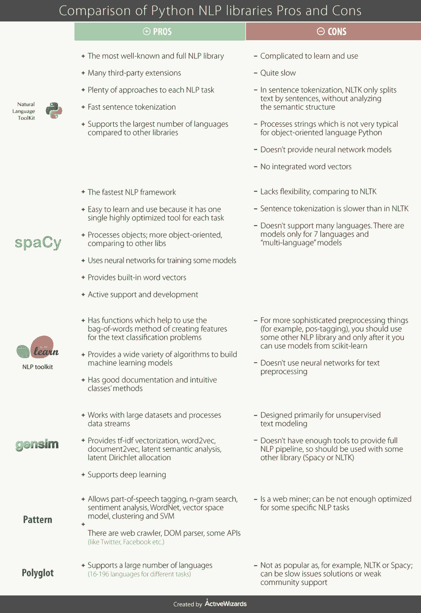

# 入门 | 6 大最流行、最有用的自然语言处理库对比

选自 KDnuggets

**作者****：****ActiveWizards**

**机器之心编译**

**参与：路****、王淑婷**

> 本文概述和比较了最流行、最有用的自然语言处理库，包含 NLTK、spaCy、scikit-learn、gensim、Pattern、polyglot。

现在自然语言处理（NLP）变得越来越流行，这在深度学习发展的背景下尤其引人注目。NLP 是人工智能的一个分支，旨在从文本中理解和提取重要信息，进而基于文本数据进行训练。NLP 的主要任务包括语音识别和生成、文本分析、情感分析、机器翻译等。

近几十年，只有适当受过语言学教育的专家才能从事自然语言处理方向的工作。除了数学和机器学习，他们还应该熟悉一些重要的语言概念。但是现在，我们可以使用写好的 NLP 库。它们的主要目的是简化文本预处理过程，这样我们可以专注于构建机器学习模型和超参数调整。

人们设计了很多工具和库来解决 NLP 问题。今天，我们想基于自身经验，概述和比较最流行、最有用的自然语言处理库。本文介绍的所有库只有部分任务会重合。因此，有时候很难直接将它们进行对比。我们将介绍一些特征，然后对比这些库。

**概览**

*   NLTK（自然语言工具包）用于分词、词形还原、词干提取、解析、句法分析、词性标注等任务。该库具备可用于几乎所有 NLP 任务的工具。

*   spaCy 是 NLTK 的主要竞争者。这两个库可用于同样的任务。

*   scikit-learn 提供一个用于机器学习的大型库，包含用于文本预处理的工具。

*   gensim 是用于话题空间建模、向量空间建模和文档相似度的工具包。

*   Pattern 库是作为 web 挖掘模块提供服务的，因此，它也支持 NLP 任务。

*   polyglot 是另一个用于 NLP 的 Python 包。它不是很流行，但也可以用于大量 NLP 任务。

为了更清晰地对比这些库，我们制作了下表来展示它们的优缺点。

更新：2018 年 7 月

**结论**

本文对比了几个流行的 NLP 库的特征。尽管大部分库适用的任务有重合，但一些库需要用独特的方法来解决特定的问题。确切来说，现在最流行的 NLP 包是 NLTK 和 spaCy。它们是 NLP 领域中的主要竞争者。我们认为，二者之间的差别在于解决问题的一般哲学。

NLTK 更加学术。你可以用它尝试不同的方法和算法，结合使用等等。spaCy 为每个问题提供一个开箱即用的解决方案。你不用思考哪种方法更好：spaCy 的作者已经替你考虑了。此外，spaCy 速度很快（是 NLTK 的好几倍）。它的一个缺陷在于支持的语言种类有限。但是，它所支持的语言数量在持续增加。因此，我们认为 spaCy 在大部分情况下是最优选，但是如果你想尝试一些特别的任务，可以使用 NLTK。

尽管这两个库非常流行，但还存在很多不同的选择，选择使用哪个 NLP 包取决于你要解决的问题。

原文链接：https://www.kdnuggets.com/2018/07/comparison-top-6-python-nlp-libraries.html

****本文为机器之心编译，**转载请联系本公众号获得授权****。**

✄------------------------------------------------

**加入机器之心（全职记者 / 实习生）：hr@jiqizhixin.com**

**投稿或寻求报道：**content**@jiqizhixin.com**

**广告 & 商务合作：bd@jiqizhixin.com**