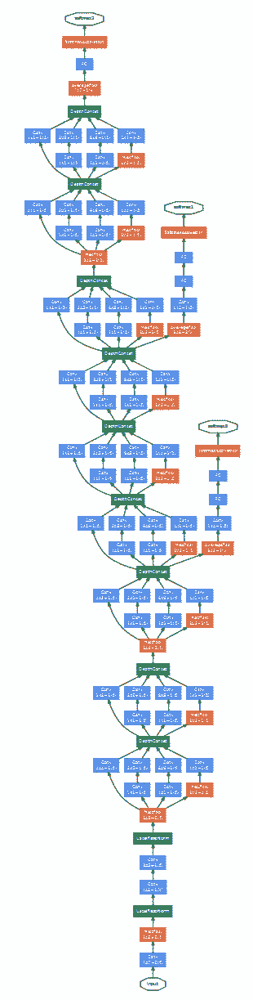

# 入门 | 从 VGG 到 NASNet，一文概览图像分类网络

选自 towardsdatascience

**作者：Lars Hulstaert**

**机器之心编译**

> 了解图像分类的不同网络架构是一项非常艰巨的任务。本文将讨论目前可在 keras 上使用的主要架构。作者将按照这些架构出现的时间顺序对其逐一讲解，并尝试以从业者的角度讨论其优缺点。

**关键概念**

虽然计算机视觉研究者们采取的方法各不相同，但是大体而言，他们的实验设置有着如下的趋势。本文将讨论如何进行图像预处理，数据增强用于哪类数据，优化机制以及输出层的实现方法。

**预处理**

通常而言，我们会计算训练集图像的平均像素值，将其从图像中减去。请注意，在 keras 环境下使用这些模型时考虑预处理方法很重要。计算机视觉模型不同，Keras 的「预处理」也不同。

**数据增强**

图像分类的数据集非常大。尽管如此，依然需要数据增强来提高模型泛化能力。数据增强一般包括重新缩放图像的随机裁剪、随机水平翻转、随机 RGB 颜色与亮度变换等技术。此外，也存在不同的缩放、裁剪等技术（即单尺度训练 vs 多尺度训练）。在测试阶段进行多裁剪评估也是经常使用的途径，不过该方案的计算成本更昂贵且性能改进有限。请注意，随机缩放和裁剪的目标是在不同尺寸和位置上学习对象的重要特征。Keras 并未实现所有数据增强技术的开箱即用，但可以通过 ImageDataGenerator 模块的预处理技术轻松实现。Andrew Howard 提出的数据增强技术更深入地解释了这些关键性的方法，具体参见：

https://arxiv.org/ftp/arxiv/papers/1312/1312.5402.pdf

*同一照片不同裁剪方式的实例（选自 Andrew Howard 论文）*

**训练机制**

在 keras 中可通过多 GPU 数据并行化训练模型（一般批大小为 256）。动量 SGD 或 RMSProp 是常用的优化技术。学习率的方案相对简单，要么在验证集的损失或准确率开始稳定时调低学习率，要么在固定间隔上调低学习率。通过 keras 中的「ReduceLROnPlateau」回调函数可以轻松模拟这种行为。

*这是一个训练过程的实例，其中学习率降低然后损失函数变得平坦了。*

**最后一层**

图像分类网络中最后一层传统上来说是全连接层。这些层的参数量巨大，因为你需要 N×M 个参数才能从 N 个隐藏节点过渡到 M 个节点。现在，这些全连接层已经被平均池化或最大池化层替代，它们要求的参数量和计算时间比较小。在对 keras 中预先训练好的网络进行微调时，这一点非常重要，这能限制所需要添加参数的数量。

**VGGNet**

VGGNet（https://arxiv.org/pdf/1409.1556.pdf）发布于 2014 年，作者是 Karen Simonyan 和 Andrew Zisserman，该网络表明堆叠多个层是提升计算机视觉性能的关键因素。VGGNet 包含 16 或 19 层，主要由小型的 3×3 卷积操作和 2×2 池化操作组成。

VGG 的优点在于，堆叠多个小的卷积核而不使用池化操作可以增加网络的表征深度，同时限制参数的数量。例如，通过堆叠 3 个 3×3 卷积层而不是使用单个的 7×7 层，可以克服一些限制。首先，这样做组合了三个非线性函数，而不只是一个，使得决策函数更有判别力和表征能力。第二，参数量减少了 81%，而感受野保持不变。另外，小卷积核的使用也扮演了正则化器的角色，并提高了不同卷积核的有效性。

VGG 的缺点在于，其评估的开销比浅层网络更加昂贵，内存和参数（140M）也更多。这些参数的大部分都可以归因于第一个全连接层。结果表明，这些层可以在不降低性能的情况下移除，同时显著减少了必要参数的数量。16 层和 19 层的参数预训练 VGG 在 keras 上是可以使用的。

**ResNet**

ResNet 架构是由何凯明等人提出的，他们试图通过这个架构训练更深的网络。作者指出，增加网络深度会导致更高的训练误差，这表明梯度问题（梯度消失/爆炸）可能会导致训练收敛性等潜在问题。

*尽管 20 层网络的潜在函数空间是封装在 56 层网络的空间内且运用了传统的梯度下降，但无法实现同样的效果（选自 ResNet 论文）*

ResNet 的主要贡献是增加了神经网络架构的跳过连接（skip connection），使用批归一化并移除了作为最后一层的全连接层。

*通过跳过连接，卷积层的输入 x 被添加到输出当中。因此，网络只学习「残留」特征，并容易保存已学习的特征。*

跳过连接基于这样一种想法：只要神经网络模型能够「适当地」将信息从前一层传递到下一层，它应该能变得「无限」深。如果在更深层没有附加信息进行聚合，那么带有跳过连接的卷积层可以视为一个恒等映射函数。

通过向网络中添加跳过连接，卷积层的默认函数变成了恒等函数。卷积核学到的任何新信息都可以在基本表征中添加或减去，因此这更容易优化残差映射。跳过连接不会增加参数的数量，但可以获得更稳定的训练和显著的性能提升，这是因为可以达到更深的网络（例如深度为 34、50、101 和 152 的网络）。请注意，1×1 的卷积用于减少输出通道的个数。

除跳过连接之外，在每次卷积完成后、激活进行前都采取批归一化。最后，网络删除了全连接层，并使用平均池化层减少参数的数量。由于网络加深，卷积层的抽象能力更强，从而减少了对全连接层的需求。

**GoogLeNet**

GoogLeNet 与 ResNet 的论文几乎同时发表，但它们引入了不同的改进方案。前面提到的两篇论文着重于提高分类网络的表征深度。

然而，GoogLeNet 仍试图扩大网络（多达 22 层），但也希望减少参数量和计算量。最初的 Inception 架构由 Google 发布，重点将 CNN 应用于大数据场景以及移动端。GoogLeNet 是包含 Inception 模块的全卷积结构。这些模块的目的是：通过构建由多个子模块（比如嵌套网络 - Inception）组成的复杂卷积核来提高卷积核的学习能力和抽象能力。

*Inception 模块的实例。1x1 卷积用来减小输入/输出的维度（选自 GoogLeNet 论文）。*

除了加入 Inception 模块，作者还使用了辅助分类器来提高稳定性和收敛速度。辅助分类器的想法是使用几个不同层的图像表征来执行分类任务（黄色框）。因此，模型中的不同层都可以计算梯度，然后使用这些梯度来优化训练。

*GoogLeNet 架构图示。黄色框表示辅助分类器（选自 GoogLeNet 论文）。*

**Inception v3**

Inception v3 架构中结合了几项创新点。在 Inception v3 中，主要的创新在于借鉴了 GoogLeNet 和 VGGNet 的部分原创思想，即使用 Inception 模块并通过一系列较小的卷积核更高效地表示较大的卷积核。除了小卷积之外，作者还尝试了非对称卷积（例如用 n×1 和 1×n 代替 n×n，而非多个 2×2 和 3×3 滤波器）。

*一个 3x3 卷积核后跟一个 1x1 卷积核的例子，它有效地取代了一个 5x5 卷积核（图片来自 Inception v3 论文）。*

作者通过执行批归一化和标签平滑化来改进正则化。标签平滑就是为每个类都分配一些权重，而不是将全权重分配给 ground truth 标签。由于网络对训练标签的过拟合程度较低，因此它应该能够更好地泛化，这与使用 L2 正则化效果相仿。

为了确保该模型在高分辨率图像和低分辨率图像上均表现良好，作者通过 Inception 模块分析了不同尺寸下的图像表征。因此，当 Inception 网络用于目标检测框架时，它们在对小分辨率和低分辨率对象进行分类时表现良好。

**NASNet**

我要讨论的最后一个图像分类架构是 NASNet（https://arxiv.org/pdf/1707.07012.pdf），它是使用神经结构搜索（NAS）框架构建的。NASNet 的目标是运用数据驱动和智能方法，而非直觉和实验来构建网络架构。尽管我不会详细讨论这个框架，但是可以解释一下它的总体思路。

Inception 论文表明「神经网络单元」中复杂的卷积核组合单元可以显著提升结果。NAS 框架将这种单元的构建过程定义为优化过程，然后通过叠加最佳单元来构建大型网络。

*例如，搜索框架构建了两种不同的单元，它们被用于训练整个模型。*

*原文链接：https://towardsdatascience.com/an-overview-of-image-classification-networks-3fb4ff6fa61b*

****本文为机器之心原创，**转载请联系本公众号获得授权****。**

✄------------------------------------------------

**加入机器之心（全职记者/实习生）：hr@jiqizhixin.com**

**投稿或寻求报道：editor@jiqizhixin.com**

**广告&商务合作：bd@jiqizhixin.com**