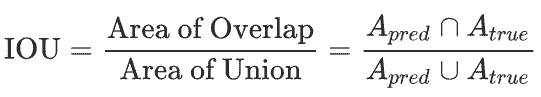
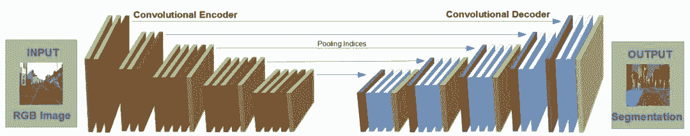
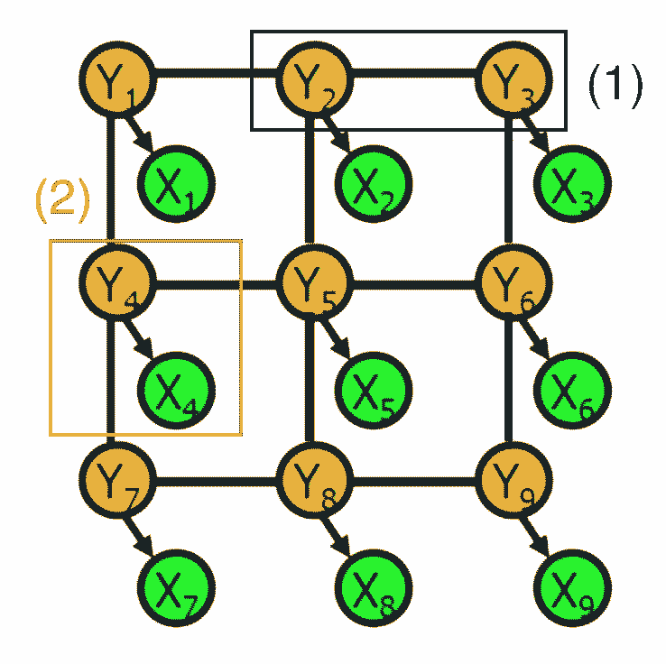
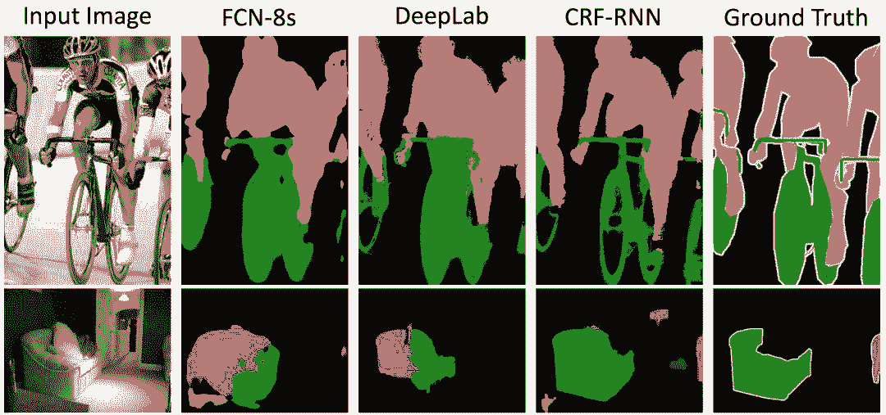
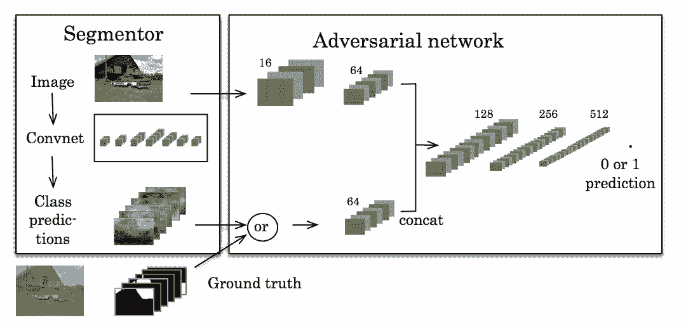
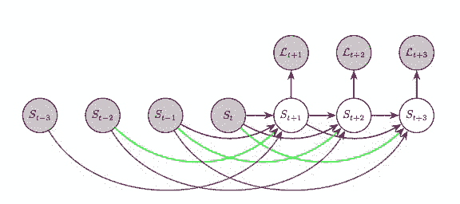

# 入门 | 一文了解什么是语义分割及常用的语义分割方法有哪些

选自 The Gradient

**作者：Andy Chen、Chaitanya Asawa**

****机器之心编译****

**参与：李诗萌****、思源**

> 语义分割是计算机视觉中的基础任务，我们通常会使用基于 CNN 加 CRF 的方法或直接使用对抗性的训练实现端到端的分割。本文简要介绍了这两种方法及它们的特点。

人类是如何描述场景的？我们可能会说「窗户下有一张桌子」，或者「沙发右边有一盏灯」。图像理解的关键在于将一个整体场景分解成几个单独的实体，这也有助于我们推理目标的不同行为。

当然，目标检测方法可以帮助我们绘制某些确定实体的边框，但人类对场景的理解能以像素级的精细程度对每一个实体进行检测并标记精确的边界。我们已经开始发展自动驾驶汽车和智能机器人，这些都需要深入理解周围环境，因此精确分割实体变得越来越重要。

**什么是语义分割？**

语义分割是计算机视觉中的基本任务，在语义分割中我们需要将视觉输入分为不同的语义可解释类别，「语义的可解释性」即分类类别在真实世界中是有意义的。例如，我们可能需要区分图像中属于汽车的所有像素，并把这些像素涂成蓝色。

*来源：Zhao 等人的 ICNet（2017）：语义分割的演示视频。*

虽然像聚类这样的无监督方法可以用于分割，但其结果不一定是有语义的。这些方法无法对它们训练的类进行细分，但是在搜索区域界限方面更加擅长。

与图像分类或目标检测相比，语义分割使我们对图像有更加细致的了解。这种了解在诸如自动驾驶、机器人以及图像搜索引擎等许多领域都是非常重要的。因此，本文讨论的主题是使用深度学习方法进行有监督的语义分割。

**数据集和指标**

目前有一些常用于训练语义分割模型的数据集：

*   Pascal VOC 2012：有 20 类目标，这些目标包括人类、机动车类以及其他类，可用于目标类别或背景的分割

*   Cityscapes：50 个城市的城市场景语义理解数据集

*   Pascal Context：有 400 多类的室内和室外场景

*   Stanford Background Dataset：至少有一个前景物体的一组户外场景。

*来自 Stanford Background Dataset 的示例图像，该数据集的图像大致为 320 *240 像素，还包括指向每块像素所属类别的整数矩阵。*

用于评估语义分割算法性能的标准指标是平均 IOU（Intersection Over Union，交并比），IoU 定义如下：

这样的评价指标可以判断目标的捕获程度（使预测标签与标注尽可能重合），也可以判断模型的精确程度（使并集尽可能重合）。

**流程**

一般而言，在高层次上，应用于语义分割模型的流程是：

我们将在下文中继续讨论流程中的分类器和后处理阶段。

**架构和方法**

**用卷积神经网络分类**

最近的语义分割架构一般都用卷积神经网络（CNN）为每个像素分配一个初始类别标签。卷积层可以有效地捕捉图像中的局部特征，并以层级的方式将许多这样的模块嵌套在一起，这样 CNN 就可以试着提取更大的结构了。通过一系列卷积捕捉图像的复杂特征，CNN 可以将一张图的内容编码为紧凑表征。

但为了将单独的像素映射给标签，我们需要将标准 CNN 编码器扩展为编码器-解码器架构。在这个架构中，编码器使用卷积层和池化层将特征图尺寸缩小，使其成为更低维的表征。解码器接收到这一表征，用通过转置卷积执行上采样而「恢复」空间维度，这样每一个转置卷积都能扩展特征图尺寸。在某些情况下，编码器的中间步骤可用于调优解码器。最终，解码器生成一个表示原始图像标签的数组。

*Yasrab 等人文章（2016）中 SCNet 的编码器-解码器架构。*

在许多语义分割架构中，CNN 旨在最小化的损失函数是交叉熵损失。该目标函数度量的是预测像素概率分布（在所有类上）和实际的概率分布的差异。

然而，对语义分割来说，交叉熵损失并不理想。因为对一张图来说，交叉熵损失是每一个像素损失的和，它并不鼓励邻近像素保持一致。因为交叉熵损失无法在像素间采用更高级的结构，所以交叉熵最小化的标签预测一般都是不完整或者是模糊的，它们都需要进行后续处理。

**用条件随机场优化**

来自 CNN 的原始标签一般都是「缺失（patchy）」图像，在图像中有一些小区域的标签可能不正确，因此无法匹配其周围的像素标签。为了解决这种不连续性，我们可以用一种平滑的形式。我们需要确保目标占据图片中的连续区域，这样给定的像素和其周围像素的标签就是一样的。

为了解决这个问题，有一些架构使用了条件随机场（CRF），使用原始图像中像素的相似性重新精炼 CNN 的标签。

*条件随机场案例。*

条件随机场是由随机变量组成的图，在这种情况下，每个顶点表示：

*   确定像素的 CNN 标签（绿色顶点 X_i）

*   确定像素的实际类别标签（黄色顶点 Y_i）

边会编码两类信息：

*   （1）蓝色：两个像素的实际类别，即它们之间的依赖关系

*   （2）红色：对于给定像素的 CNN 原始预测和实际标签之间的依赖关系

每个依赖性关系都具有势能，这是一个关于两个相关随机变量值的函数。例如，当相邻像素的实际目标标签相同时，第一类依存关系的势能较高。直观地讲，当目标标签是隐藏变量时，会根据概率分布产生可观察的 CNN 像素标签。

为了用 CRF 精炼标签，我们首先通过交叉验证用训练数据学习图模型的参数。然后，为了使概率 P（Y_1, Y_2, … Y_n | X_1, X_2,…X_n）最大化，对参数进行调整。CRF 的输出是原始图像像素的最终的目标标签。

实际上，CRF 图是完全连接的，也就意味着即使是从物理角度上讲相距很远的像素节点也可以共享边。这样的图有数十亿的边，从计算上讲难以进行精确处理。CRF 架构倾向于使用高效的近似技术进行处理。

**分类器架构**

CNN 分类后跟着 CRF 精炼只是一个可能的语义分割解决方法。也有论文叙述了其它的一些优秀方法：

*   U-Net（2015，https://arxiv.org/pdf/1505.04597.pdf）通过产生原始训练数据的扭曲版而增加训练数据。这一步使 CNN 编码器-解码器变得更加鲁棒以抵抗这些形变，并能从更少的训练图像中进行学习。当它在少于 40 张图的生物医学数据集上训练时，IOU 值仍能达到 92%。

*   DeepLab（2016，https://arxiv.org/pdf/1606.00915.pdf）将 CNN 编码器-解码器和 CRF 精炼过程相结合以产生目标标签（如前文所述，作者强调了解码器的上采样）。空洞卷积（也称扩张卷积）在每一层都使用大小不同的卷积核，使每一层都能捕获各种比例的特征。在 Pascal VOC 2012 测试集中，这个架构的平均 IOU 达到了 70.3%。

*   Dilation10（2016，https://arxiv.org/pdf/1511.07122.pdf）是一种扩张卷积的替代方法。完整流程是将扩张卷积的「前端模块」连接到内容模块上，再用 CRF-RNN 进行下一步处理。通过这样的构造，Dilation10 在 Pascal VOC 2012 测试集上的平均 IOU 值达到了 75.3%。

**其他训练方案**

我们最近的训练方案偏离了分类器和 CRF 模型。这些方法不是独立地优化不同模块，而是采用端到端的方法。

完全可微分的条件随机场

Zheng 等人建立的 CRF-RNN 模型引入了一种可以将分类和后处理合并为单一端到端的模型，该模型可以同时优化这两个阶段。因此可以自动学习诸如 CRF 高斯核权重这样的参数。他们将推理逼近算法的步骤重整为卷积，并使用循环神经网络（RNN）对具有完全迭代性质的推理算法进行建模。

*来自 FCN-8s、DeepLab 和 CRF-RNN 的两个示例图及其分割结果。注意 CRF-RNN，它在端到端的模型中优化了 CRF，因而产生了更少的斑点，图像也更准确。*

对抗训练

近期的另一个工作重点是使用对抗性训练获得更高阶的一致性。受生成对抗网络（GAN）的启发，Luc 等人训练了用于语义分割的标准 CNN 以及试着学习区分真实图分割和预测图分割的对抗网络。分割网络旨在产生对抗网络无法从真实分割中区别出来的预测分割。

这个方法的直观想法是希望我们的分割看起来尽可能真是。如果其它网络可以从真实分割中简单地将我们的预测结果区别出来，那么就说明我们的预测结果不够好。

*来源：Luc 等人的论文，使用对抗性网络进行语义分割*

**随时间的分割**

我们要如何预测未来目标会在哪呢？我们可以建模场景中的分割过程而解决这一问题。这适用于机器人或自动驾驶，在这两个问题中对物体的运动建模有助于计划。

我们首先在 Luc 等人（2017）的文章中发现了这一点。这篇文章说到，与预测未来的帧然后再进行分割相比，直接预测未来的语义分割则要求更高的性能。

他们使用了自回归模型，在自回归模型中他们用过去的分割预测下一次分割 S_t+1。为了预测之后的分割 S_t+2，他们将过去的 S_i 与预测出的 S_t+1 相结合再推断，依此类推得出所有的序列。

*该训练策略用于从之前的分割预测未来的分割。L_t 是一个可以捕获预测分割和真实分割之间差异的损失函数。来源：Luc 等人的论文，Predicting Deeper into the Future of Semantic Segmentation。*

他们比较了模型在不同时间尺度的表现：在 Cityscapes 数据集上评估下一帧（短时间）、下一个 0.5 秒（中等时间）和下一个 10 秒（长时间）的表现。他们发现，在时间较长时模型的表现不佳，但是在短期和中期时间范围中，模型性能都很好。

**结语**

许多诸如 U-Net 这样的方法，遵循最基本的结构：我们应用深度学习（卷积网络），其次是用经典概率技术进行后处理。虽然卷积网络的原始输出并不完美，但是后处理能利用人类先验知识更好地进行分割，以得到「好的」标签。

其余诸如对抗学习这样的方法，作为分割的端到端解决方案有非常强大的性能。与之前讨论的 CRF 不同，端到端的技术不需要人们对单独的组件建模以完善原始预测值。由于这些方法的表现优于多级流程，未来研究可能会越来越重视端到端的算法。

*原文链接：**https://thegradient.pub/semantic-segmentation/*

****本文为机器之心编译，**转载请联系本公众号获得授权****。**

✄------------------------------------------------

**加入机器之心（全职记者/实习生）：hr@jiqizhixin.com**

**投稿或寻求报道：**content**@jiqizhixin.com**

**广告&商务合作：bd@jiqizhixin.com**