# 入门 | 这是一份文科生都能看懂的线性代数简介

选自 Medium

**作者：Niklas Donges**

**机器之心编译**

**参与：****Tianci LIU、思源**

线性代数的概念对于理解机器学习背后的原理非常重要，尤其是在深度学习领域中。它可以帮助我们更好地理解算法内部到底是怎么运行的，借此，我们就能够更好的做出决策。所以，如果你真的希望了解机器学习具体算法，就不可避免需要精通这些线性代数的概念。这篇文章中，我们将向你介绍一些机器学习中涉及的关键线性代数知识。

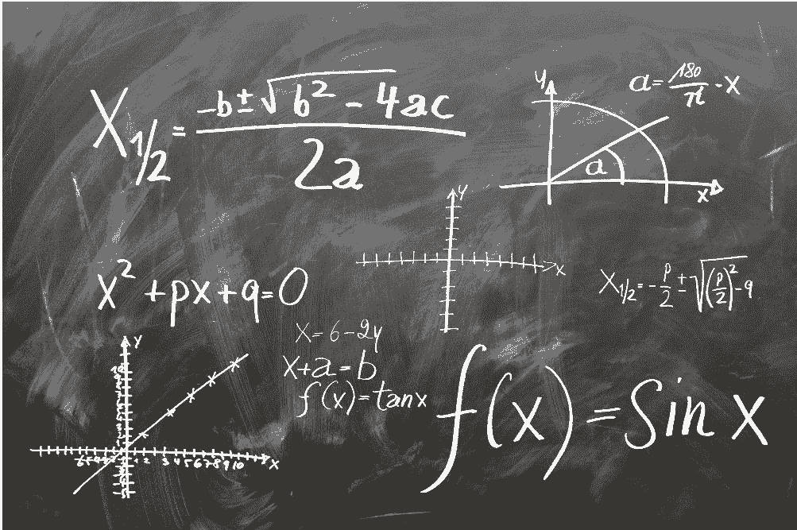

线性代数是一种连续形式的数学，被广泛应用于理工类学科中；因为它可以帮助我们对自然现象建模，然后进行高效的计算。但是，由于线性代数是一种连续而非离散的数学，因此，很多计算机科学家都不太了解它。另外，线性代数还在几乎所有的数学学科中都拥有着核心地位：例如几何学和泛函分析。

线性代数中的概念是理解机器学习理论所必需的基础知识，尤其是对那些处理深度学习算法的人而言。在刚接触机器学习时，你可以不需要掌握线性代数。但到了一定程度后，当你希望更好地理解不同机器学习算法运作原理时，线性代数就很有用了，它可以帮助你在开发机器学习系统时更好地做决策。

在线性代数中，我们使用线性方程来表示数据，并把它们写成矩阵或向量的形式。因此，基本上你都是在与矩阵和向量打交道，而不是标量（我们会在文章的稍后部分介绍这些概念）。如果你能够想到使用一个合适的库，比如 NumPy，你就可以通过简短的几行代码，轻松实现复杂的矩阵乘法。请注意，这篇文章忽略了那些对机器学习并不重要的线性代数概念。

**数学对象**

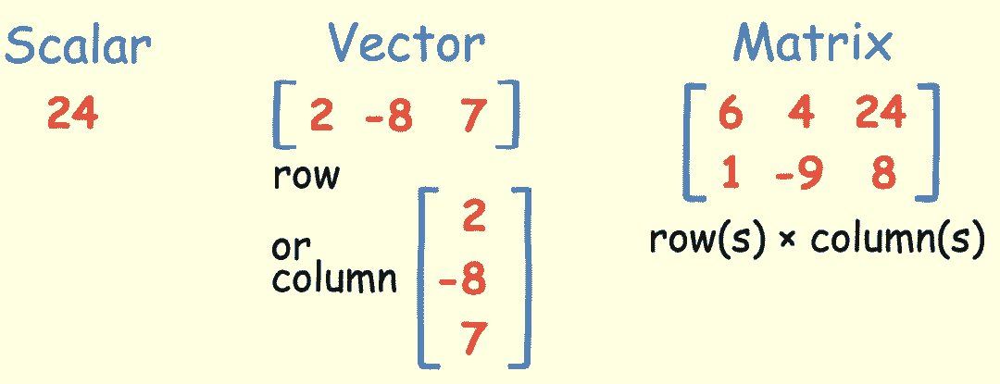

**标量**

标量就是一个简单的数，比如 24。

**向量**

 **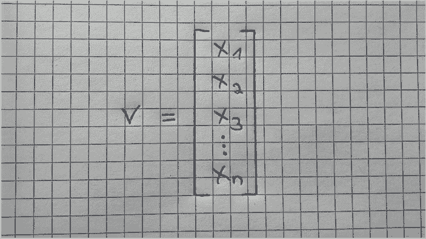

向量是一个有序数组，能够写成一行或者一列的形式。向量只包含一个索引，用来表示向量中的某个特定元素。比如 V_2 表示向量中的第二个元素，在上面淡黄色的图中是-8。

**矩阵**

矩阵是一个有序的二维数组，有两个索引。第一个索引表示行，第二个索引表示列。例如，M_23 表示的是第二行、第三列的元素，在上面淡黄色的图中是 8。矩阵可以有多个行或者列，注意一个向量也是一个矩阵，但仅有一行或者一列。

淡黄色图中有一个矩阵的例子：一个 2×3 的矩阵 (行数×列数)。下图中是另一个矩阵和对应的表示形式。

**张量**

三维张量是按照一定规律排列在方格中的数组，其中一个变量数字表示轴。张量有三个索引，其中第一个索引表示行，第二个索引表示列，第三个索引表示轴。例如，V_232 指向第二行、第三列、第二轴的元素，在下图右边的张量中表示 5。

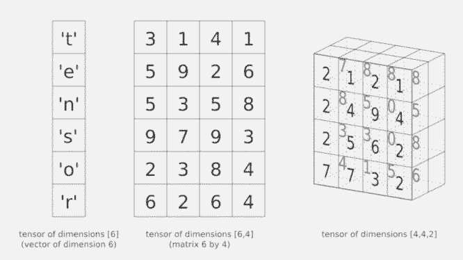

张量是上面谈到的概念中最常用的一个，因为张量是一个多维数组，同时可以是一个向量或者一个矩阵，具体取决于它的索引数量。例如，一阶张量可以表示向量（1 个索引），二阶张量可以表示矩阵（2 个索引），三阶就是张量（3 个索引），更高阶的称为高阶张量（超过 3 个索引）。

**运算法则**

**矩阵和标量的计算** 

如果你在一个矩阵上加、减、乘、除一个标量，你所做的就是直接对矩阵的每个元素进行这些数学运算。下图给出了矩阵数乘的一个很好的例子。

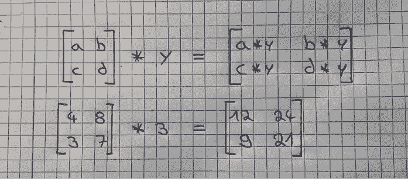

**矩阵和向量的运算**

对一个矩阵乘以一个向量，可以理解为对矩阵的每一行乘以向量的每一列，运算结果会是一个向量，它的行数和矩阵的行数一样。下图展示了这是如何计算的。

为了更好地理解这个概念，我们详细讲解一下第二张图中的计算步骤。为了得到结果向量中的第一个元素 16，选择拿来和矩阵相乘的向量中的元素 1 和 5，把它们与矩阵第一行中的元素 1 和 3 相乘，像这样：1*1 + 3*5 = 16。对矩阵第二行的元素进行相同的计算：4*1 + 0*5 = 4。同样，再计算矩阵第三行的元素：2*1 + 1*5 = 7。

这里还有另一个例子：

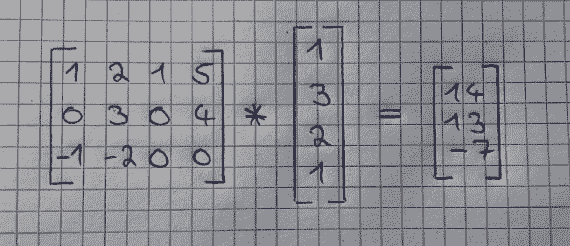

在这里，我们给出一个备忘录：

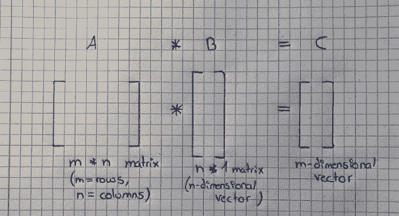

**矩阵间的加减法**

矩阵间的加减法非常简单直接。这里要求，两个矩阵需要维度相同，运算结果也会是一个相同维度的矩阵。你只需要将第一个矩阵中的每一个元素和第二个矩阵中对应位置的元素相加或者相减就可以了。如下图所示： 

**矩阵间的乘法**

如果你知道如何计算矩阵和向量间的乘法，矩阵间的乘法就也简单了。注意，只有当第一个矩阵的列数和第二个矩阵的行数相等时，才能把它们两个乘起来。运算结果会是一个矩阵，行数和第一个矩阵的行数相等，列数和第二个矩阵的列数相等。计算方法如下：

你只需要将第二个矩阵分成列向量，然后分别将第一个矩阵和每个列向量相乘。然后，将运算结果拼接成一个新的矩阵（不要把它们加起来!）。下图逐步展示了计算过程：

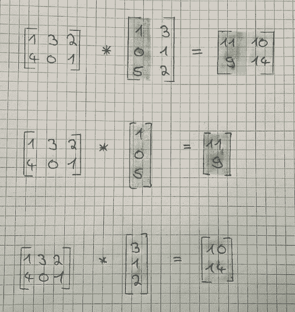

同样，我们也给出一个备忘录：

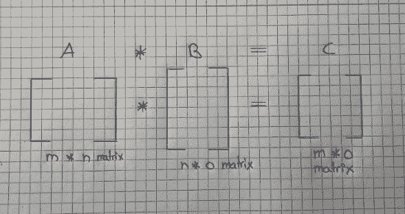**矩阵的乘法性质**

矩阵乘法拥有一些性质，根据这些性质，我们可以将大量计算整合成一个矩阵乘法。在下面我们会依次讨论这些性质。为了便于理解，我们会先用标量来解释这些性质，然后再使用矩阵形式。

**交换律**

数乘满足交换律，但矩阵乘法并不满足。这意味着，当我们在将两个标量乘在一起的时候：7×3 和 3×7 的结果是一样的，但当我们将两个矩阵相乘起来的时候：A×B 并不等于 B×A。

**结合律**

数乘和矩阵乘法都满足结合律。这意味着，数乘 3×（5×3）等于（3×5）×3，同时矩阵乘法 A×（B×C）等于（A×B）×C。

**分配律**

数乘和矩阵乘法都满足分配律。这表示，数乘 3×（5+3）等于 3×5+3×3，而矩阵乘法 A×（B+C）等于 A×B +A×C。

**单位矩阵**

单位矩阵是一种特殊的矩阵，不过首先，我们需要定义什么是「单位」。数字 1 是一个「单位」，因为任何数乘以 1 都等于它自身。因此，任何矩阵乘以一个单位矩阵都应该等于它自己。例如，矩阵 A 乘以单位矩阵还等于矩阵 A。

单位矩阵的主对角线元素都是 1，其余元素都是 0，你可以根据这个性质得到一个单位矩阵。同时它也是一个「方阵」，这表示它的行数和列数是相等的。

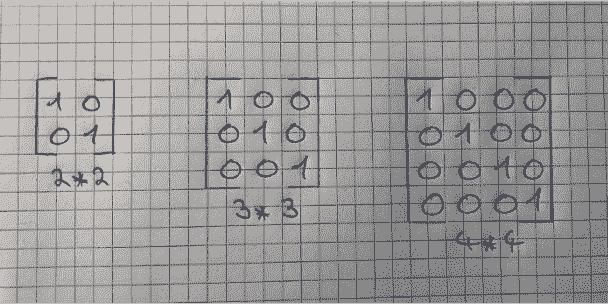

我我们之前说，矩阵乘法不满足交换律，但这里有一个例外：将一个矩阵和一个单位矩阵相乘。因此，下式是成立的：A × I = I×A = A。

**矩阵的逆和转置**

矩阵的逆和矩阵的转置是两种矩阵特有的性质。同样的，我们首先在实数上讨论这些性质，然后再使用在矩阵中。

1.逆运算

首先，什么是逆（倒数）? 一个数乘以它的逆（倒数）等于 1。注意，任何非零的数都有倒数。如果将矩阵和它的逆矩阵相乘，结果就应该是单位矩阵。下面的例子展示了标量的逆（倒数）：

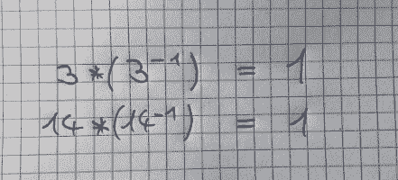

不过，并不是每个矩阵都有逆矩阵。如果一个矩阵是方阵，而且它可逆，就可以求出它的逆矩阵。很遗憾，讨论什么矩阵可逆超出了这篇文章的范围。

我们为什么需要逆矩阵呢？这是因为我们不能计算用矩阵相除，并没有「除以矩阵」的定义，但我们可以用一个矩阵乘以一个逆矩阵，来达到相同的目的。

下图展示了一个矩阵乘以它的逆矩阵，计算结果是一个 2×2 的单位矩阵。

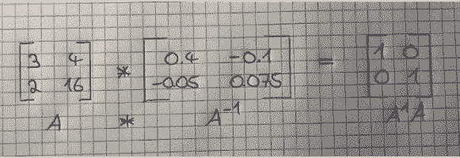

可以利用 NumPy 轻松计算出一个矩阵的逆矩阵（如果它可逆的话）。

2.转置

最后，我们讨论矩阵转置的性质。这基本上就是将一个矩阵沿着 45 度轴线镜像翻转。计算矩阵的转置非常简单，原始矩阵的第一列就是转置后矩阵的第一行，第二列则变成了转置后矩阵的第二行。一个 m×n 的矩阵仅仅是转成了 n×m 的矩阵。同时，矩阵 A 的元素 A_ij 等于转置后矩阵的元素 A_ji。下图展示了矩阵的转置：

**总结**

在这篇文章中，你接触到了一些机器学习中使用到的线性代数概念。你学会如何对这些对象进行加、减、乘、「除」。另外，你还掌握了矩阵最重要的性质，以及它们为什么可以帮我们得到更有效的计算。在这些知识的基础上，你还学习了逆矩阵和转置矩阵的概念，以及可以如何使用它们。虽然机器学习中还有很多线性代数知识，但这篇文章提供了关于最核心的概念的一些适当介绍。

*原文地址：https://towardsdatascience.com/linear-algebra-for-deep-learning-f21d7e7d7f23*

****本文为机器之心编译，**转载请联系本公众号获得授权****。**

✄------------------------------------------------

**加入机器之心（全职记者/实习生）：hr@jiqizhixin.com**

**投稿或寻求报道：editor@jiqizhixin.com**

**广告&商务合作：bd@jiqizhixin.com****