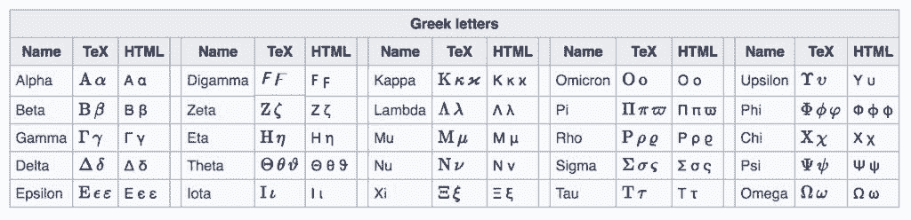

# 入门 | 一文介绍机器学习中基本的数学符号

选自 Machine Learning Mastery

**作者：****Jason Brownlee**

**机器之心编译**

**参与：****Edison Ke、黄小天**

> 本文介绍了机器学习中的基本数学符号。具体来说有算数符号，包括各种乘法、指数、平方根以及对数；数列和集合符号，包括索引、累加以及集合关系。此外，本文还给出了 5 个当你在理解数学符号遇到困难时可以应急的小技巧。

在机器学习中，你永远都绕不过数学符号。

通常，只要有一个代数项或一个方程符号看不懂，你就完全看不懂整个过程是怎么回事了。这种境况非常令人沮丧，尤其是对于那些正在成长中的机器学习初学者来说更是如此。

如果你能了解一些基本的数学符号以及相关的小技巧，那你就在看懂机器学习方法的论文或书籍描述上前进了一大步。

在本教程中，你将学到机器学习技术描述中遇到的基本数学符号。

在学完整个教程后，你会知道：

*   算术符号，包括若干种乘法、指数、平方根以及对数

*   数列和集合符号，包括索引、求和以及集合关系

*   5 种当你看不明白数学符号的时候可以采用的应急方法

让我们开始学习吧！

机器学习中的基本数学符号

**教程概览**

本教程分为 7 个部分，分别是：

1\. 看不懂数学符号的沮丧

2\. 算术符号

3\. 希腊字母

4\. 数列符号

5\. 集合符号

6\. 其他符号

7\. 更多帮助资源

**看不懂数学符号的沮丧**

你在阅读机器学习算法的相关内容时会遇到一些数学符号。举例来说，这些符号可能会被用来：

*   描述一个算法

*   描述数据的预处理

*   描述结果

*   描述测试工具

*   描述含义

你可能在论文、教科书、博文以及其他地方看到这些描述。相关代数项常常会给出完整定义，但你还是会看到不少陌生的数学符号。我曾多次深受其苦，简直太令人感到挫败了！

在本教程中，你会复习到一些帮助你看懂机器学习方法描述的基本数学符号。

**算术符号**

在本节中，我们将重温一些基础算数中你不太熟悉的符号，以及毕业之后一些可能遗忘的概念。

简单算术

算术的基本符号你已很熟悉。例如：

*   加法：1 + 1 = 2

*   减法：2 – 1 = 1

*   乘法：2 x 2 = 4

*   除法：2 / 2 = 1

大多数的数学运算都有一个对应的逆运算，进行相反的运算过程；比如，减法是加法的逆运算，而除法是乘法的逆运算。

**代数**

我们常希望用更抽象的方式来描述运算过程，以将其与具体的数据或运算区分开来。因此代数的运用随处可见：也就是用大写和/或小写字母来代表一个项，或者一个数学符号体系中的概念。用希腊字母来代替英文字母也是很常见的用法。数学中的每一个领域都可能有一些保留字母，这些字母都会代表一个特定的东西。尽管如此，代数中的项总应在描述中被定义一下，如果作者没有去定义，那是他的问题，不是你的错。

**乘法符号**

乘法是一个常见的符号，有几种记法。一般是用一个小小的「ⅹ」或者星号「*」来代表乘法：

> c = a x b
> 
> c = a * b

你有时也会看到用一个点来代表乘法，比如：

> c = a . b

这个式子其实和下式是一样的意思：

> c = a x b

或者你可能会看到运算符被省略，先前被定义的代数项之间没有符号也没有空格，比如：

> c = ab

这还是一样的意思。

**指数和平方根**

指数就是一个数字的幂次。这个符号写作正常大小的原数（底数）以及一个上标数（指数），例如：

> 2³

这个表达式的计算结果就是 3 个 2 连乘，或者说是 2 的立方：

> 2 x 2 x 2 = 8

求一个数的幂，就默认是求它的平方。

> 2² = 2 x 2 = 4

平方运算的效果可以用开方来逆转。开方在数学中是在被开方的数字上面加一个开方符号，这里简单起见，直接用「sqrt()」函数来表示了。

> sqrt(4) = 2

式中，我们知道了指数的结果 4，以及指数的次数 2，我们想算出指数的底数。事实上，开方运算可以是任意次指数的逆运算，只是开方符号默认次数为 2，相当于在开方符号的前面有一个下标的 2。我们当然可以试着写出立方的逆运算，也就是开立方符号：

> 2³ = 8
> 
> 3 sqrt(8) = 2

**对数和 e**

当我们求 10 的整数次幂的时候，我们常称之为数量级。

> 10² = 10 x 10 or 100

对这个运算求逆的另一方法是求这个运算结果（100）以 10 为底数的对数；用符号来表达的话就写作 log10()。

> log10(100) = 2

这里，我们已知指数的结果和底数，而要求指数的次数。这让我们在数量级上轻松地缩放。除此之外，由于计算机中使用二进制数学，求以 2 为底数的对数也是常用的运算。例如：

> 2⁶ = 64
> 
> log2(64) = 6

还有一个非常常见的对数是以自然底数 e 为底数的。符号 e 是一个专有符号，代表一个特殊的数字或者说一个称为欧拉数的常数。欧拉数是一个无限不循环小数，可以追溯到无穷的精度。

> e = 2.71828...

求 e 的幂被称为自然指数函数：

> e² = 7.38905...

求自然对数的运算就是这个运算的逆运算，记作 ln():

> ln(7.38905...) = 2

忽略更多数学细节，自然指数和自然对数在数学中非常有用，因为它们能用来抽象地描述某一系统的持续增长，比如说复利这样的指数级增长体系。

**希腊字母**

希腊字母在数学中用来代表变量、常数、函数以及其他的概念。比如说，在统计学中我们用小写的希腊字母 mu 来代表平均值，而小写的希腊字母 sigma 表示标准差。在线性回归中，我们用小写字母 beta 来代表系数，诸如此类。学会所有希腊字母的大小写以及怎么念会带来极大的帮助。

*希腊字母表。*

维基百科词条「数学、科学及工程中的希腊字母」是个非常有用的使用指南（https://en.wikipedia.org/wiki/Greek_letters_used_in_mathematics,_science,_and_engineering），因为上面列出来了在数学和科学不同领域内每一个希腊字母的常见用法。

**数列符号**

机器学习中的符号常用来描述数列运算。一个数列可以是一列数据，或者代数项。

**索引**

读懂数列符号的关键是要弄明白数列中的索引符号。一般来说符号中会明确数列的起点和终点，比如从 1 到 n，这里的 n 是数列的长度。在数列中的项都会用一个诸如 i、j、k 的下标来作为索引，就像数组的符号一样。比如说，a_i 就是数列 a 中的第 i 个元素。如果数列是二维的，那就需要用到 2 个索引；比如：b_{i,j} 就是数列 b 的第 i 行, 第 j 列的元素。

**数列运算**

我们也可以对一个数列进行数学运算。有两类运算时常被用到，所以有专门的简写运算符来表示它们：累加和累乘。

**数列累加**

对一个数列的累加用大写的希腊符号 sigma 来表示，而累加的内容则用变量名来表示，同时在 sigma 符号的下面明确开始的索引（如 i=1），在 sigma 符号的上面明确结束的索引（如 n）。

> Sigma i = 1, n a_i

这就是数列 a 的第一个元素到第 n 个元素的累加。

**数列累乘**

数列的累乘是用大写的希腊字母 pi 来表示的。而对累乘范围的描述方式与数列累加类似，开始的索引写在符号下面，结束的索引在符号上面。

> Pi i = 1, n a_i

这就是数列 a 的第一个元素到第 n 个元素的累乘。

**集合符号**

一个集合就是一组互不相同的元素的整体。在定义机器学习中的一些代数项的时候我们可能会遇到集合符号。

**数字集合**

你最常见的集合是数字集合，比如说有的代数项会定义在整数集或实数集内。这些常见的数字集合包括：

*   所以自然数的集合: N

*   所有整数的集合: Z

*   所有实数的集合: R

当然还有很多其他的数字集合，你可以参考维基百科中的「特殊集合」词条。我们在定义代数项的时候常指的是实值或者实数，而不是浮点数。浮点数在计算机运算中实际上是离散的数字。

**集合关系**

在定义代数项的时候常会看到集合关系符号，集合关系符号看起来就像是一个大写的「E」一样。

> 1 a E R

这表示定义 a 属于 R 集，或者说 a 属于实数集。同样，也有许多集合运算符；常见的两个集合运算符包括：

*   并集, 就是把两个集合的元素都包含进来：A U B

*   交集，就是只包括同时出现在两个集合中的元素：A ^ B

更多相关内容可以参考维基百科中的「集合」词条：https://en.wikipedia.org/wiki/Set_(mathematics)。

**其他符号**

本节中我会列出一些较常见的其他符号。一种常见的情况是我们会先抽象地定义一个方法，然后用单独的符号来重新定义一个具体的实现。比如，如果我们在估计一个变量 x，可以在 x 上加一些符号来代表这些估计，比如：

*   x-bar（x 上方有一横）

*   x-prime（x 右上角有一小撇）

*   x-hat（x 上方有一折线）

同一个符号在诸如数学的子领域或不同对象的语境下可能含义不同。比如说，|x|就是个很容易令人不解的符号，在不同的情况下可以指：

*   |x|: x 的绝对值.

*   |x|: 向量 x 的长度.

*   |x|: 集合 x 的势.

本教程只提及了基础的数学符号。有很多数学的子学科与机器学习更相关，需要更详细地复习一下。包括：

*   线性代数

*   统计学

*   概率论

*   微积分

可能还有一些多变量分析和信息论的内容。

**5 个在数学符号方面寻求帮助的小建议**

本部分将列示一些当你被机器学习中的数学符号折磨时可以用到的小建议。

**考虑一下作者**

你在阅读的论文或者书籍总有一个作者。这个作者可能犯错，可能有疏忽，也可能是因为他们自己也不明白自己在写什么，才让你如此迷惑。从符号的限制中逃离片刻，然后想想作者的目的。他们到底想把什么讲清楚？也许你甚至可以用电子邮件、Twitter、Facebook、领英等方式来联系作者让他帮你解释清楚。你放心，大多数学者都希望其他人能够理解并好好利用他们的研究成果。

**上维基百科查一查**

维基百科上有符号列表，可以帮助你缩小符号含义的可能范围。我建议你从这两个词条开始：

*   「数学符号表」（https://en.wikipedia.org/wiki/List_of_mathematical_symbols）

*   「数学、科学和工程中的希腊字母」（https://en.wikipedia.org/wiki/Greek_letters_used_in_mathematics,_science,_and_engineering）

**用代码简述出来**

数学运算不过就是对数据进行函数处理。把你读到的任何东西都用变量、for-循环等写成伪代码展示出来。这个过程中你可能打算使用某个脚本语言来处理自己随意写出来的数组，或者甚至一张 Excel 表格的数据。

当你阅读并理解了文章中的技术改进，那你随之写出来的核心代码才会取得更好的结果，最终经过不断的改进，你就会写出一个小小的原型机，可以自己玩耍了！我一度不相信这个方法行得通，直到看到一个学者仅用几行 MATLAB 代码和随意编写的数据就写出了一篇非常复杂的论文的核心代码。这令我大吃一惊，因为我以前一直坚信机器学习的系统必须完整地编写出来并且使用真实数据才能运行，所以要学习任何一篇文章只有找到原始的代码和数据这一条路可走。但是我真的错了。不过话说回来，那个学者真的是个天才。

现在我一直都在用这种方法学习机器学习，不过我是用 Python 写出新学到的技巧的核心代码。

**换条路试试**

有一个我在搞懂新技术时常用的小技巧，即找到所有引用了包含该技术的论文的其他论文，看看其他人如何演绎、解释这个新技术时常能够解除我在读原始描述产生的误解。不过这个办法不总是有效，反而会更加迷惑，引入了更多令人误解的方法和新符号。但是总体来说，这个办法还是有效的。

**在网上向大神请教**

说实话，有很多线上论坛里的人们很愿意向别人解释数学。你可以在屏幕上截张困扰你的符号图，写清楚出处和链接，然后连同你的困惑一起发布在问答网站上。推荐以下两个入门网站：

*   https://math.stackexchange.com/

*   https://stats.stackexchange.com/

你都有哪些弄明白数学符号的小技巧呢？不妨在评论区留言。

**推荐阅读**

如果你想进一步深入了解，这一部分会告诉你更多相关资源。

*   Section 0.1\. Reading Mathematics, Vector Calculus, Linear Algebra, and Differential Forms, 2009：http://www.math.cornell.edu/~hubbard/readingmath.pdf

*   The Language and Grammar of Mathematics, Timothy Gowers：http://assets.press.princeton.edu/chapters/gowers/gowers_I_2.pdf

*   Understanding Mathematics, a guide, Peter Alfeld：https://math.stackexchange.com/

**总结**

在本教程中，你了解了在阅读机器学习相关技术时可能会遇到的基础数学符号。具体来说，你学到了：

*   算数符号，包括各种乘法、指数、平方根以及对数。

*   数列和集合符号，包括索引、累加以及集合关系。

*   5 个当你在理解数学符号遇到困难时可以帮到你的小技巧。 

*原文链接：https://machinelearningmastery.com/basics-mathematical-notation-machine-learning/*

 *****本文为机器之心编译，**转载请联系本公众号获得授权****。**

✄------------------------------------------------

**加入机器之心（全职记者/实习生）：hr@jiqizhixin.com**

**投稿或寻求报道：editor@jiqizhixin.com**

**广告&商务合作：bd@jiqizhixin.com***