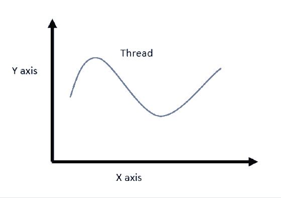

# 入门 | 初学机器学习：直观解读 KL 散度的数学概念

选自 thushv.com

**作者：****Thushan Ganegedara**

**机器之心编译**

**参与：Panda**

> 机器学习是当前最重要的技术发展方向之一。近日，悉尼大学博士生 Thushan Ganegedara 开始撰写一个系列博客文章，旨在为机器学习初学者介绍一些基本概念。本文是该系列的第一篇文章，介绍了 KL 散度（KL divergence）的基本数学概念和初级应用。作者已将相关代码发布在 GitHub 上。

代码：https://github.com/thushv89/nlp_examples_thushv_dot_com/blob/master/kl_divergence.ipynb

**基础概念**

首先让我们确立一些基本规则。我们将会定义一些我们需要了解的概念。

**分布（distribution）**

分布可能指代不同的东西，比如数据分布或概率分布。我们这里所涉及的是概率分布。假设你在一张纸上画了两根轴（即 X 和 Y），我可以将一个分布想成是落在这两根轴之间的一条线。其中 X 表示你有兴趣获取概率的不同值。Y 表示观察 X 轴上的值时所得到的概率。即 y=p(x)。下图即是某个分布的可视化。

这是一个连续概率分布。比如，我们可以将 X 轴看作是人的身高，Y 轴是找到对应身高的人的概率。

如果你想得到离散的概率分布，你可以将这条线分成固定长度的片段并以某种方式将这些片段水平化。然后就能根据这条线的每个片段创建边缘互相连接的矩形。这就能得到一个离散概率分布。

**事件（event）**

对于离散概率分布而言，事件是指观察到 X 取某个值（比如 X=1）的情况。我们将事件 X=1 的概率记为 P(X=1)。在连续空间中，你可以将其看作是一个取值范围（比如 0.95<X<1.05）。注意，事件的定义并不局限于在 X 轴上取值。但是我们后面只会考虑这种情况。

**回到 KL 散度**

从这里开始，我将使用来自这篇博文的示例：https://www.countbayesie.com/blog/2017/5/9/kullback-leibler-divergence-explained。这是一篇很好的 KL 散度介绍文章，但我觉得其中某些复杂的解释可以更详细的阐述。好了，让我们继续吧。

**我们想要解决的问题**

上述博文中所解决的核心问题是这样的：假设我们是一组正在广袤无垠的太空中进行研究的科学家。我们发现了一些太空蠕虫，这些太空蠕虫的牙齿数量各不相同。现在我们需要将这些信息发回地球。但从太空向地球发送信息的成本很高，所以我们需要用尽量少的数据表达这些信息。我们有个好方法：我们不发送单个数值，而是绘制一张图表，其中 X 轴表示所观察到的不同牙齿数量（0,1,2…），Y 轴是看到的太空蠕虫具有 x 颗牙齿的概率（即具有 x 颗牙齿的蠕虫数量/蠕虫总数量）。这样，我们就将观察结果转换成了分布。

发送分布比发送每只蠕虫的信息更高效。但我们还能进一步压缩数据大小。我们可以用一个已知的分布来表示这个分布（比如均匀分布、二项分布、正态分布）。举个例子，假如我们用均匀分布来表示真实分布，我们只需要发送两段数据就能恢复真实数据；均匀概率和蠕虫数量。但我们怎样才能知道哪种分布能更好地解释真实分布呢？这就是 KL 散度的用武之地。

直观解释：KL 散度是一种衡量两个分布（比如两条线）之间的匹配程度的方法。

**让我们对示例进行一点修改**

为了能够检查数值的正确性，让我们将概率值修改成对人类更友好的值（相比于上述博文中的值）。我们进行如下假设：假设有 100 只蠕虫，各种牙齿数的蠕虫的数量统计结果如下。

0 颗牙齿：2（概率：p_0 = 0.02）

1 颗牙齿：3（概率：p_1 = 0.03）

2 颗牙齿：5（概率：p_2 = 0.05）

3 颗牙齿：14（概率：p_3 = 0.14

4 颗牙齿：16（概率：p_4 = 0.16）

5 颗牙齿：15（概率：p_5 = 0.15）

6 颗牙齿：12（概率：p_6 = 0.12）

7 颗牙齿：8（概率：p_7 = 0.08）

8 颗牙齿：10（概率：p_8 = 0.1）

9 颗牙齿：8（概率：p_9 = 0.08）

10 颗牙齿：7（概率：p_10 = 0.07）

快速做一次完整性检查！确保蠕虫总数为 100，且概率总和为 1.0.

*   蠕虫总数 = 2+3+5+14+16+15+12+8+10+8+7 = 100

*   概率总和 = 0.02+0.03+0.05+0.14+0.16+0.15+0.12+0.08+0.1+0.08+0.07 = 1.0

可视化结果为：

**尝试 1：使用均匀分布建模**

我们首先使用均匀分布来建模该分布。均匀分布只有一个参数：均匀概率；即给定事件发生的概率。

均匀分布和我们的真实分布对比：

先不讨论这个结果，我们再用另一种分布来建模真实分布。

**尝试 2：使用二项分布建模**

你可能计算过抛硬币正面或背面向上的概率，这就是一种二项分布概率。我们可以将同样的概念延展到我们的问题上。对于有两个可能输出的硬币，我们假设硬币正面向上的概率为 p，并且进行了 n 次尝试，那么其中成功 k 次的概率为：

**公式解读**

这里说明一下二项分布中每一项的含义。第一项是 p^k。我们想成功 k 次，其中单次成功的概率为 p；那么成功 k 次的概率为 p^k。另外要记得我们进行了 n 次尝试。因此，其中失败的次数为 n-k，对应失败的概率为 (1-p)。所以成功 k 次的概率即为联合概率。到此还未结束。在 n 次尝试中，k 次成功会有不同的排列方式。在数量为 n 的空间中 k 个元素的不同排列数量为将所有这些项相乘就得到了成功 k 次的二项概率。

**二项分布的均值和方差**

我们还可以定义二项分布的均值和方差，如下：

均值= np

方差= np(1-p)

均值是什么意思？均值是指你进行 n 次尝试时的期望（平均）成功次数。如果每次尝试成功的概率为 p，那么可以说 n 次尝试的成功次数为 np。

方差又是什么意思？它表示真实的成功尝试次数偏离均值的程度。为了理解方差，让我们假设 n=1，那么等式就成了「方差= p(1-p)」。那么当 p=0.5 时（正面和背面向上的概率一样），方差最大；当 p=1 或 p=0 时（只能得到正面或背面中的一种），方差最小。

**回来继续建模**

现在我们已经理解了二项分布，接下来回到我们之前的问题。首先让我们计算蠕虫的牙齿的期望数量：

有了均值，我们可以计算 p 的值：

均值 = np

5.44 = 10p

p = 0.544

注意，这里的 n 是指在蠕虫中观察到的最大牙齿数。你可能会问我们为什么不把蠕虫总数（即 100）或总事件数（即 11）设为 n。我们很快就将看到原因。有了这些数据，我们可以按如下方式定义任意牙齿数的概率。

鉴于牙齿数的取值最大为 10，那么看见 k 颗牙齿的概率是多少（这里看见一颗牙齿即为一次成功尝试）？

从抛硬币的角度看，这就类似于：

假设我抛 10 次硬币，观察到 k 次正面向上的概率是多少？

从形式上讲，我们可以计算所有不同 k 值的概率。其中 k 是我们希望观察到的牙齿数量。是第 k 个牙齿数量位置（即 0 颗牙齿、1 颗牙齿……）的二项概率。所以，计算结果如下：

我们的真实分布和二项分布的比较如下：

**总结已有情况**

现在回头看看我们已经完成的工作。首先，我们理解了我们想要解决的问题。我们的问题是将特定类型的太空蠕虫的牙齿数据统计用尽量小的数据量发回地球。为此，我们想到用某个已知分布来表示真实的蠕虫统计数据，这样我们就可以只发送该分布的参数，而无需发送真实统计数据。我们检查了两种类型的分布，得到了以下结果。

*   均匀分布——概率为 0.0909

*   二项分布——n=10、p=0.544，k 取值在 0 到 10 之间。

让我们在同一个地方可视化这三个分布：

**我们如何定量地确定哪个分布更好？**

经过这些计算之后，我们需要一种衡量每个近似分布与真实分布之间匹配程度的方法。这很重要，这样当我们发送信息时，我们才无需担忧「我是否选择对了？」毕竟太空蠕虫关乎我们每个人的生命。

这就是 KL 散度的用武之地。KL 散度在形式上定义如下：

其中 q(x) 是近似分布，p(x) 是我们想要用 q(x) 匹配的真实分布。直观地说，这衡量的是给定任意分布偏离真实分布的程度。如果两个分布完全匹配，那么，否则它的取值应该是在 0 到无穷大（inf）之间。KL 散度越小，真实分布与近似分布之间的匹配就越好。

**KL 散度的直观解释**

让我们看看 KL 散度各个部分的含义。首先看看项。如果 q(x_i) 大于 p(x_i) 会怎样呢？此时这个项的值为负，因为小于 1 的值的对数为负。另一方面，如果 q(x_i) 总是小于 p(x_i)，那么该项的值为正。如果 p(x_i)=q(x_i) 则该项的值为 0。然后，为了使这个值为期望值，你要用 p(x_i) 来给这个对数项加权。也就是说，p(x_i) 有更高概率的匹配区域比低 p(x_i) 概率的匹配区域更加重要。

直观而言，优先正确匹配近似分布中真正高可能性的事件是有实际价值的。从数学上讲，这能让你自动忽略落在真实分布的支集（支集（support）是指分布使用的 X 轴的全长度）之外的分布区域。另外，这还能避免计算 log(0) 的情况——如果你试图计算落在真实分布的支集之外的任意区域的这个对数项，就可能出现这种情况。

**计算 KL 散度**

我们计算一下上面两个近似分布与真实分布之间的 KL 散度。首先来看均匀分布：

再看看二项分布：

**玩一玩 KL 散度**

现在，我们来玩一玩 KL 散度。首先我们会先看看当二元分布的成功概率变化时 KL 散度的变化情况。不幸的是，我们不能使用均匀分布做同样的事，因为 n 固定时均匀分布的概率不会变化。

可以看到，当我们远离我们的选择（红点）时，KL 散度会快速增大。实际上，如果你显示输出我们的选择周围小 Δ 数量的 KL 散度值，你会看到我们选择的成功概率的 KL 散度最小。

现在让我们看看和的行为方式。如下图所示：

看起来有一个区域中的和之间有最小的距离。让我们绘出两条线之间的差异（虚线），并且放大我们的概率选择所在的区域。

看起来我们的概率选择也位于非常接近和有最低差异的区域（但并不是最低差异的区域）。但这仍然是一个很有意思的发现。我不确定出现这种情况的原因是什么。如果有人知道，欢迎讨论。

**结论**

现在我们有些可靠的结果了。尽管均匀分布看起来很简单且信息不多而二项分布带有更有差别的信息，但实际上均匀分布与真实分布之间的匹配程度比二项分布的匹配程度更高。说老实话，这个结果实际上让我有点惊讶。因为我之前预计二项分布能更好地建模这个真实分布。因此，这个实验也能告诉我们：不要只相信自己的直觉！

原文链接：*http://www.thushv.com/machine-learning/light-on-math-machine-learning-intuitive-guide-to-understanding-kl-divergence/*

****本文为机器之心编译，**转载请联系本公众号获得授权****。**

✄------------------------------------------------

**加入机器之心（全职记者/实习生）：hr@jiqizhixin.com**

**投稿或寻求报道：**content**@jiqizhixin.com**

**广告&商务合作：bd@jiqizhixin.com**